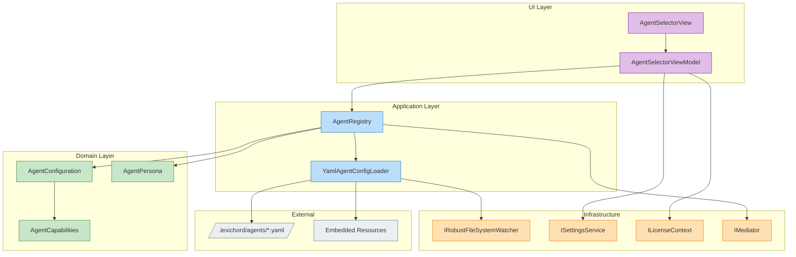
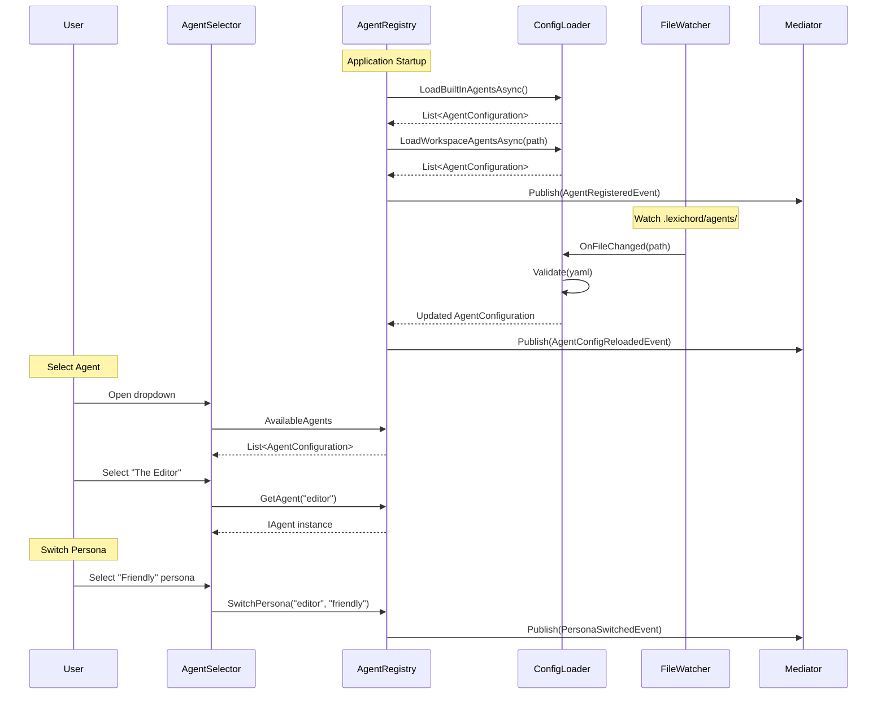

# LCS-SBD-071: The Agent Registry (Persona Management)

## Document Control

| Field            | Value                      |
| :--------------- | :------------------------- |
| **Document ID**  | LCS-SBD-071                |
| **Version**      | v0.7.1                     |
| **Swimlane**     | Agents                     |
| **Codename**     | The Agent Registry         |
| **Status**       | Draft                      |
| **Created**      | 2026-01-28                 |
| **Last Updated** | 2026-01-28                 |
| **Author**       | Lexichord Development Team |

---

## 1. Executive Summary

### 1.1 Vision

Version 0.7.1 introduces the **Agent Registry**, a configuration-driven system for defining and managing specialized agent personas. This foundational release establishes the infrastructure for "The Specialists" agent ecosystem, enabling writers to work with purpose-built AI assistants that understand specific writing contexts.

### 1.2 Business Value

- **Persona Flexibility:** Writers can switch between agent personalities (e.g., "Strict Editor" vs. "Friendly Editor") without losing conversation context.
- **Extensibility:** Custom agents can be defined via YAML files in workspace directories, enabling team-specific specialists.
- **Discoverability:** Unified Agent Selector UI provides quick access to available agents with filtering and favorites.
- **License Monetization:** Tiered access to specialist agents drives WriterPro and Teams subscription upgrades.

### 1.3 Success Metrics

| Metric                   | Target             | Measurement Method            |
| :----------------------- | :----------------- | :---------------------------- |
| Agent Load Time          | < 100ms            | Performance benchmark         |
| Configuration Validation | 100% schema errors | Unit test coverage            |
| Hot Reload Latency       | < 500ms            | File watcher integration test |
| Agent Discovery Time     | < 50ms             | UI responsiveness test        |
| Code Coverage            | ≥ 90%              | Coverage report               |

---

## 2. Dependencies

### 2.1 Upstream Dependencies

| Dependency                 | Version | Module               | Purpose                             |
| :------------------------- | :------ | :------------------- | :---------------------------------- |
| `IAgent`                   | v0.6.6a | Abstractions         | Base agent contract                 |
| `IAgentRegistry`           | v0.6.6c | Abstractions         | Agent registration (to be extended) |
| `IChatCompletionService`   | v0.6.1a | Modules.Agents       | LLM provider integration            |
| `IPromptRenderer`          | v0.6.3b | Modules.Agents       | Template rendering                  |
| `IRobustFileSystemWatcher` | v0.1.2b | Abstractions         | File change monitoring              |
| `ISettingsService`         | v0.1.6a | Abstractions         | User preferences persistence        |
| `ILicenseContext`          | v0.0.4c | Abstractions         | License tier validation             |
| `IMediator`                | v0.0.7a | MediatR (NuGet)      | Event bus                           |
| `ILogger<T>`               | v0.0.3b | Microsoft.Extensions | Structured logging                  |

### 2.2 NuGet Packages

| Package      | Version | Purpose                    | License    |
| :----------- | :------ | :------------------------- | :--------- |
| `YamlDotNet` | 16.x    | YAML configuration parsing | MIT        |
| `MediatR`    | 12.4.x  | Event bus / CQRS           | Apache 2.0 |

### 2.3 New Interfaces Introduced

| Interface                  | Defined In | Module         | Purpose                         |
| :------------------------- | :--------- | :------------- | :------------------------------ |
| `AgentConfiguration`       | v0.7.1a    | Abstractions   | Agent definition record         |
| `AgentPersona`             | v0.7.1a    | Abstractions   | Persona variant record          |
| `AgentCapabilities`        | v0.7.1a    | Abstractions   | Agent capability flags          |
| `IAgentRegistry` (ext.)    | v0.7.1b    | Abstractions   | Extended registry with personas |
| `IAgentConfigLoader`       | v0.7.1c    | Modules.Agents | YAML configuration loading      |
| `AgentDefinitionAttribute` | v0.7.1b    | Abstractions   | Attribute for agent discovery   |

---

## 3. Sub-Part Specifications

### 3.1 v0.7.1a: Agent Configuration Model

| Field            | Value                     |
| :--------------- | :------------------------ |
| **Sub-Part ID**  | AGT-071a                  |
| **Title**        | Agent Configuration Model |
| **Module**       | `Lexichord.Abstractions`  |
| **License Tier** | Core                      |

**Goal:** Define `AgentConfiguration` and `AgentPersona` records as the canonical data contracts for agent persona management.

**Key Deliverables:**

- `AgentConfiguration` record with agent identity, capabilities, and default options
- `AgentPersona` record with persona-specific overrides
- `AgentCapabilities` flags enum for capability declaration
- `ChatOptions` extension for persona-specific temperature and model settings
- XML documentation for all public types
- Unit tests for record equality and validation

**Key Interfaces:**

```csharp
namespace Lexichord.Abstractions.Agents;

/// <summary>
/// Defines the complete configuration for a specialized agent.
/// </summary>
public record AgentConfiguration(
    string AgentId,
    string Name,
    string Description,
    string Icon,
    string TemplateId,
    AgentCapabilities Capabilities,
    ChatOptions DefaultOptions,
    IReadOnlyList<AgentPersona> Personas,
    IReadOnlyDictionary<string, object>? CustomSettings = null
);

/// <summary>
/// Defines a persona variant for an agent with personality overrides.
/// </summary>
public record AgentPersona(
    string PersonaId,
    string DisplayName,
    string Tagline,
    string? SystemPromptOverride,
    float Temperature,
    string? VoiceDescription
);

/// <summary>
/// Declares the capabilities available to an agent.
/// </summary>
[Flags]
public enum AgentCapabilities
{
    None = 0,
    Chat = 1 << 0,
    DocumentContext = 1 << 1,
    StyleEnforcement = 1 << 2,
    CodeGeneration = 1 << 3,
    ResearchAssistance = 1 << 4,
    Summarization = 1 << 5
}
```

**Estimated Effort:** 4 hours

---

### 3.2 v0.7.1b: Agent Registry Implementation

| Field            | Value                                 |
| :--------------- | :------------------------------------ |
| **Sub-Part ID**  | AGT-071b                              |
| **Title**        | Agent Registry Implementation         |
| **Module**       | `Lexichord.Modules.Agents`            |
| **License Tier** | Core (basic), WriterPro (specialists) |

**Goal:** Extend `IAgentRegistry` to manage agent configurations and personas with runtime persona switching and singleton caching.

**Key Deliverables:**

- Extended `IAgentRegistry` interface with persona management methods
- `AgentRegistry` implementation with configuration caching
- `[AgentDefinition]` attribute for assembly scanning
- Singleton agent instance management
- Runtime persona switching without agent restart
- MediatR events for agent lifecycle (`AgentRegisteredEvent`, `PersonaSwitchedEvent`)
- Unit tests for registration and persona switching

**Key Interfaces:**

```csharp
namespace Lexichord.Abstractions.Agents;

/// <summary>
/// Registry for discovering and managing specialized agents.
/// </summary>
public interface IAgentRegistry
{
    /// <summary>
    /// Gets all available agent configurations.
    /// </summary>
    IReadOnlyList<AgentConfiguration> AvailableAgents { get; }

    /// <summary>
    /// Gets all available personas across all agents.
    /// </summary>
    IReadOnlyList<AgentPersona> AvailablePersonas { get; }

    /// <summary>
    /// Gets an agent instance by ID using default persona.
    /// </summary>
    IAgent GetAgent(string agentId);

    /// <summary>
    /// Gets an agent instance with a specific persona applied.
    /// </summary>
    IAgent GetAgentWithPersona(string agentId, string personaId);

    /// <summary>
    /// Registers an agent configuration with its factory.
    /// </summary>
    void RegisterAgent(AgentConfiguration config, Func<IServiceProvider, IAgent> factory);

    /// <summary>
    /// Registers a standalone persona that can be applied to compatible agents.
    /// </summary>
    void RegisterPersona(AgentPersona persona);

    /// <summary>
    /// Switches the active persona for a cached agent instance.
    /// </summary>
    void SwitchPersona(string agentId, string personaId);
}

/// <summary>
/// Marks a class as an agent definition for assembly scanning.
/// </summary>
[AttributeUsage(AttributeTargets.Class, AllowMultiple = false)]
public sealed class AgentDefinitionAttribute : Attribute
{
    public string AgentId { get; }
    public AgentDefinitionAttribute(string agentId) => AgentId = agentId;
}
```

**Estimated Effort:** 8 hours

---

### 3.3 v0.7.1c: Agent Configuration Files

| Field            | Value                                      |
| :--------------- | :----------------------------------------- |
| **Sub-Part ID**  | AGT-071c                                   |
| **Title**        | Agent Configuration Files                  |
| **Module**       | `Lexichord.Modules.Agents`                 |
| **License Tier** | WriterPro (custom agents), Core (built-in) |

**Goal:** Support YAML-based agent definitions with loading from embedded resources and workspace directories, plus hot-reload capability.

**Key Deliverables:**

- `IAgentConfigLoader` interface for configuration loading
- `YamlAgentConfigLoader` implementation with schema validation
- Built-in agent definitions loaded from embedded resources
- Workspace agent loading from `.lexichord/agents/` directory
- Hot-reload via `IRobustFileSystemWatcher` integration
- YAML schema documentation
- Unit tests for parsing and validation

**Configuration Schema:**

```yaml
# .lexichord/agents/editor.yaml
agent_id: "editor"
name: "The Editor"
description: "Focused on grammar, clarity, and structure"
icon: "edit-3"
template_id: "specialist-editor"
license_tier: "WriterPro"
capabilities:
    - Chat
    - DocumentContext
    - StyleEnforcement
default_options:
    model: "gpt-4o"
    temperature: 0.3
    max_tokens: 2048
personas:
    - persona_id: "strict"
      display_name: "Strict Editor"
      tagline: "No errors escape notice"
      temperature: 0.1
      system_prompt_override: "Be precise and exacting..."
    - persona_id: "friendly"
      display_name: "Friendly Editor"
      tagline: "Gentle suggestions for improvement"
      temperature: 0.5
```

**Key Interfaces:**

```csharp
namespace Lexichord.Modules.Agents.Configuration;

/// <summary>
/// Loads agent configurations from YAML files.
/// </summary>
public interface IAgentConfigLoader
{
    /// <summary>
    /// Loads all agent configurations from embedded resources.
    /// </summary>
    Task<IReadOnlyList<AgentConfiguration>> LoadBuiltInAgentsAsync(CancellationToken ct = default);

    /// <summary>
    /// Loads agent configurations from a workspace directory.
    /// </summary>
    Task<IReadOnlyList<AgentConfiguration>> LoadWorkspaceAgentsAsync(string workspacePath, CancellationToken ct = default);

    /// <summary>
    /// Validates a single YAML configuration file.
    /// </summary>
    AgentConfigValidationResult Validate(string yamlContent);
}

public record AgentConfigValidationResult(
    bool IsValid,
    IReadOnlyList<string> Errors,
    AgentConfiguration? Configuration
);
```

**Estimated Effort:** 10 hours

---

### 3.4 v0.7.1d: Agent Selector UI

| Field            | Value                      |
| :--------------- | :------------------------- |
| **Sub-Part ID**  | AGT-071d                   |
| **Title**        | Agent Selector UI          |
| **Module**       | `Lexichord.Modules.Agents` |
| **License Tier** | Core                       |

**Goal:** Create an intuitive agent picker in the Co-pilot panel with filtering, favorites, and license tier badges.

**Key Deliverables:**

- `AgentSelectorView.axaml` dropdown control
- `AgentSelectorViewModel` with reactive filtering
- Persona sub-menu for multi-persona agents
- Favorite agents persisted to user settings
- Search/filter for large agent collections
- License tier badges with upgrade prompts
- Keyboard navigation support
- Unit tests for ViewModel logic

**UI Mockup:**

```
┌──────────────────────────────────────┐
│ Agent: [▼ The Editor - Strict      ] │
├──────────────────────────────────────┤
│ ⭐ The Editor                    PRO │
│   ├─ 📝 Strict (current)             │
│   └─ 😊 Friendly                     │
│ ⭐ The Researcher               PRO  │
│ ── General Chat               CORE   │
│ 🔒 The Strategist             TEAMS  │
├──────────────────────────────────────┤
│ 🔍 Search agents...                  │
└──────────────────────────────────────┘
```

**Key Interfaces:**

```csharp
namespace Lexichord.Modules.Agents.ViewModels;

public class AgentSelectorViewModel : ViewModelBase
{
    public IReadOnlyList<AgentItemViewModel> AllAgents { get; }
    public IReadOnlyList<AgentItemViewModel> FilteredAgents { get; }
    public IReadOnlyList<AgentItemViewModel> FavoriteAgents { get; }
    public AgentItemViewModel? SelectedAgent { get; set; }
    public AgentPersona? SelectedPersona { get; set; }
    public string SearchQuery { get; set; }

    public ICommand SelectAgentCommand { get; }
    public ICommand ToggleFavoriteCommand { get; }
    public ICommand SwitchPersonaCommand { get; }
}

public class AgentItemViewModel : ViewModelBase
{
    public AgentConfiguration Configuration { get; }
    public bool IsFavorite { get; set; }
    public bool IsLocked { get; }
    public LicenseTier RequiredTier { get; }
    public IReadOnlyList<PersonaItemViewModel> Personas { get; }
}
```

**Estimated Effort:** 12 hours

---

## 4. Implementation Checklist

| #   | Task                                    | Sub-Part | Module         | Status |
| :-- | :-------------------------------------- | :------- | :------------- | :----- |
| 1   | Create `AgentConfiguration` record      | v0.7.1a  | Abstractions   | [✓]    |
| 2   | Create `AgentPersona` record            | v0.7.1a  | Abstractions   | [✓]    |
| 3   | Create `AgentCapabilities` enum         | v0.7.1a  | Abstractions   | [✓]    |
| 4   | Add unit tests for configuration models | v0.7.1a  | Tests.Agents   | [✓]    |
| 5   | Extend `IAgentRegistry` interface       | v0.7.1b  | Abstractions   | [✓]    |
| 6   | Implement `AgentRegistry` class         | v0.7.1b  | Modules.Agents | [✓]    |
| 7   | Create `AgentDefinitionAttribute`       | v0.7.1b  | Abstractions   | [✓]    |
| 8   | Add persona switching logic             | v0.7.1b  | Modules.Agents | [✓]    |
| 9   | Create MediatR events                   | v0.7.1b  | Abstractions   | [✓]    |
| 10  | Add registry unit tests                 | v0.7.1b  | Tests.Agents   | [✓]    |
| 11  | Create `IAgentConfigLoader` interface   | v0.7.1c  | Abstractions   | [ ]    |
| 12  | Implement `YamlAgentConfigLoader`       | v0.7.1c  | Modules.Agents | [ ]    |
| 13  | Create embedded resource agents         | v0.7.1c  | Modules.Agents | [ ]    |
| 14  | Integrate `IRobustFileSystemWatcher`    | v0.7.1c  | Modules.Agents | [ ]    |
| 15  | Add YAML parsing unit tests             | v0.7.1c  | Tests.Agents   | [ ]    |
| 16  | Create `AgentSelectorView.axaml`        | v0.7.1d  | Modules.Agents | [ ]    |
| 17  | Implement `AgentSelectorViewModel`      | v0.7.1d  | Modules.Agents | [ ]    |
| 18  | Add favorites persistence               | v0.7.1d  | Modules.Agents | [ ]    |
| 19  | Implement license tier badges           | v0.7.1d  | Modules.Agents | [ ]    |
| 20  | Add UI unit tests                       | v0.7.1d  | Tests.Agents   | [ ]    |

---

## 5. Dependency Matrix

### 5.1 Required Interfaces

| Interface                  | Source  | Usage                                |
| :------------------------- | :------ | :----------------------------------- |
| `IAgent`                   | v0.6.6a | Base contract for all agents         |
| `IAgentRegistry`           | v0.6.6c | Extended in this version             |
| `IChatCompletionService`   | v0.6.1a | LLM calls for agents                 |
| `IPromptRenderer`          | v0.6.3b | Template variable substitution       |
| `IRobustFileSystemWatcher` | v0.1.2b | Hot-reload configuration files       |
| `ISettingsService`         | v0.1.6a | Persist favorite agents              |
| `ILicenseContext`          | v0.0.4c | Validate access to tier-gated agents |
| `IMediator`                | v0.0.7a | Publish agent lifecycle events       |
| `ILogger<T>`               | v0.0.3b | Structured logging                   |

### 5.2 New Records

| Record                        | Module         | Purpose                     |
| :---------------------------- | :------------- | :-------------------------- |
| `AgentConfiguration`          | Abstractions   | Agent metadata and settings |
| `AgentPersona`                | Abstractions   | Persona variant definition  |
| `AgentConfigValidationResult` | Modules.Agents | YAML validation result      |

### 5.3 New Enums

| Enum                | Module       | Values                                                                                           |
| :------------------ | :----------- | :----------------------------------------------------------------------------------------------- |
| `AgentCapabilities` | Abstractions | None, Chat, DocumentContext, StyleEnforcement, CodeGeneration, ResearchAssistance, Summarization |

### 5.4 New MediatR Events

| Event                      | Module       | When Published                   |
| :------------------------- | :----------- | :------------------------------- |
| `AgentRegisteredEvent`     | Abstractions | When an agent is registered      |
| `PersonaSwitchedEvent`     | Abstractions | When user switches persona       |
| `AgentConfigReloadedEvent` | Abstractions | When YAML files are hot-reloaded |

---

## 6. Architecture Diagram



---

## 7. Data Flow Diagram



---

## 8. Risks & Mitigations

| Risk                                       | Impact | Probability | Mitigation                                    |
| :----------------------------------------- | :----- | :---------- | :-------------------------------------------- |
| YAML schema changes break existing configs | High   | Medium      | Schema versioning with backward compatibility |
| File watcher missing events                | Medium | Low         | Debounce + periodic rescan fallback           |
| Circular persona references                | Medium | Low         | Validation at load time                       |
| Memory bloat from cached agents            | Medium | Medium      | LRU cache with configurable size limit        |
| License bypass via custom YAML             | High   | Low         | Server-side tier validation on first use      |

---

## 9. What This Enables

| Future Version | Feature               | Dependency on v0.7.1                    |
| :------------- | :-------------------- | :-------------------------------------- |
| v0.7.2         | Task Specialists      | `AgentConfiguration` + `IAgentRegistry` |
| v0.7.3         | Agent Memory          | Persona-specific context storage        |
| v0.7.4         | Agent Tools           | `AgentCapabilities` flags               |
| v0.7.5         | Multi-Agent Workflows | Registry + persona switching            |
| v0.7.6         | Agent Marketplace     | YAML configuration format               |
| v0.7.7         | Usage Analytics       | Registry events                         |
| v0.7.8         | Agent Hardening       | All v0.7.1 components                   |

---

## 10. Decision Trees

### 10.1 Agent Access Decision

```
User requests agent "editor"
├── Is agent registered?
│   ├── NO → Return error: "Agent not found"
│   └── YES → Check license tier
│       ├── User tier >= Required tier?
│       │   ├── YES → Return agent instance
│       │   └── NO → Show upgrade prompt
│       └── Is agent in workspace (custom)?
│           ├── YES → Check if custom agents allowed
│           │   ├── User tier >= WriterPro?
│           │   │   ├── YES → Return agent instance
│           │   │   └── NO → Show upgrade prompt
│           │   └── (unreachable)
│           └── NO → (use tier check above)
```

### 10.2 Configuration Hot-Reload Decision

```
File system event received
├── Is file in .lexichord/agents/?
│   ├── NO → Ignore event
│   └── YES → Parse YAML
│       ├── Is YAML valid?
│       │   ├── NO → Log validation errors, keep cached config
│       │   └── YES → Does agent_id match existing?
│       │       ├── YES → Update cached configuration
│       │       │   └── Publish AgentConfigReloadedEvent
│       │       └── NO → Register new agent
│       │           └── Publish AgentRegisteredEvent
```

---

## 11. User Stories

| ID    | As a...    | I want to...                       | So that...                                    |
| :---- | :--------- | :--------------------------------- | :-------------------------------------------- |
| US-01 | Writer     | Select from available agents       | I can choose the right specialist for my task |
| US-02 | Writer     | Switch personas within an agent    | I can adjust the agent's personality          |
| US-03 | Writer     | Mark agents as favorites           | My preferred agents are quickly accessible    |
| US-04 | Writer     | Search agents by name              | I can find specific agents in large lists     |
| US-05 | Team Admin | Create custom workspace agents     | My team has project-specific specialists      |
| US-06 | Team Admin | Define multiple personas per agent | Agents can adapt to different contexts        |
| US-07 | Free User  | See locked agents with tier badges | I understand what's available with upgrades   |

---

## 12. Use Cases

### UC-01: Select Agent with Persona

**Actors:** Writer

**Preconditions:**

- Application is running
- Agent Registry is initialized
- User has WriterPro or higher license

**Flow:**

1. User opens Co-pilot panel
2. User clicks the Agent Selector dropdown
3. System displays available agents with persona sub-menus
4. User expands "The Editor" agent
5. System shows available personas: "Strict", "Friendly"
6. User selects "Friendly" persona
7. System switches to The Editor with Friendly persona
8. System publishes `PersonaSwitchedEvent`
9. Co-pilot updates to reflect new agent/persona

**Postconditions:**

- Selected agent and persona are active
- Subsequent prompts use the new agent configuration

---

### UC-02: Hot-Reload Custom Agent

**Actors:** Team Admin

**Preconditions:**

- Workspace is open
- `.lexichord/agents/` directory exists
- User has Teams license

**Flow:**

1. Admin creates/edits `custom-reviewer.yaml` in `.lexichord/agents/`
2. System detects file change via `IRobustFileSystemWatcher`
3. System validates YAML schema
4. If valid: System updates/registers agent configuration
5. System publishes `AgentConfigReloadedEvent`
6. Agent Selector refreshes to show updated agent

**Postconditions:**

- New/updated agent is available immediately
- No application restart required

---

## 13. Unit Testing Requirements

### 13.1 Test Categories

```csharp
[Trait("Category", "Unit")]
[Trait("Module", "Agents")]
[Trait("SubPart", "v0.7.1a")]
public class AgentConfigurationTests
{
    [Fact]
    public void AgentConfiguration_Equality_SameValues_AreEqual()
    {
        // Arrange
        var config1 = new AgentConfiguration(
            "test-agent", "Test", "Description", "icon", "template",
            AgentCapabilities.Chat, new ChatOptions(), []);
        var config2 = new AgentConfiguration(
            "test-agent", "Test", "Description", "icon", "template",
            AgentCapabilities.Chat, new ChatOptions(), []);

        // Assert
        config1.Should().Be(config2);
    }

    [Fact]
    public void AgentCapabilities_Flags_CombineCorrectly()
    {
        // Arrange
        var capabilities = AgentCapabilities.Chat | AgentCapabilities.DocumentContext;

        // Assert
        capabilities.HasFlag(AgentCapabilities.Chat).Should().BeTrue();
        capabilities.HasFlag(AgentCapabilities.DocumentContext).Should().BeTrue();
        capabilities.HasFlag(AgentCapabilities.CodeGeneration).Should().BeFalse();
    }
}
```

### 13.2 Registry Tests

```csharp
[Trait("Category", "Unit")]
[Trait("Module", "Agents")]
[Trait("SubPart", "v0.7.1b")]
public class AgentRegistryTests
{
    private readonly IAgentRegistry _registry;
    private readonly IMediator _mediator = Substitute.For<IMediator>();

    [Fact]
    public void RegisterAgent_ValidConfig_AddsToAvailableAgents()
    {
        // Arrange
        var config = CreateTestAgentConfiguration();

        // Act
        _registry.RegisterAgent(config, sp => Substitute.For<IAgent>());

        // Assert
        _registry.AvailableAgents.Should().Contain(c => c.AgentId == config.AgentId);
    }

    [Fact]
    public void GetAgentWithPersona_ValidPersona_ReturnsAgentWithOverrides()
    {
        // Arrange
        var config = CreateTestAgentConfiguration();
        _registry.RegisterAgent(config, sp => new TestAgent());

        // Act
        var agent = _registry.GetAgentWithPersona("test-agent", "friendly");

        // Assert
        agent.Should().NotBeNull();
        // Verify persona overrides applied
    }

    [Fact]
    public void SwitchPersona_CachedAgent_UpdatesWithoutRecreating()
    {
        // Arrange
        var config = CreateTestAgentConfiguration();
        _registry.RegisterAgent(config, sp => new TestAgent());
        var agent1 = _registry.GetAgent("test-agent");

        // Act
        _registry.SwitchPersona("test-agent", "strict");
        var agent2 = _registry.GetAgent("test-agent");

        // Assert
        agent1.Should().BeSameAs(agent2); // Same instance
    }
}
```

### 13.3 YAML Loader Tests

```csharp
[Trait("Category", "Unit")]
[Trait("Module", "Agents")]
[Trait("SubPart", "v0.7.1c")]
public class YamlAgentConfigLoaderTests
{
    private readonly IAgentConfigLoader _loader = new YamlAgentConfigLoader();

    [Fact]
    public void Validate_ValidYaml_ReturnsSuccess()
    {
        // Arrange
        var yaml = """
            agent_id: "test"
            name: "Test Agent"
            description: "A test agent"
            icon: "test-icon"
            template_id: "default"
            capabilities: [Chat]
            """;

        // Act
        var result = _loader.Validate(yaml);

        // Assert
        result.IsValid.Should().BeTrue();
        result.Configuration.Should().NotBeNull();
    }

    [Fact]
    public void Validate_MissingRequiredField_ReturnsErrors()
    {
        // Arrange
        var yaml = """
            name: "Test Agent"
            description: "Missing agent_id"
            """;

        // Act
        var result = _loader.Validate(yaml);

        // Assert
        result.IsValid.Should().BeFalse();
        result.Errors.Should().Contain(e => e.Contains("agent_id"));
    }
}
```

---

## 14. Observability & Logging

| Level   | Source        | Message Template                                           |
| :------ | :------------ | :--------------------------------------------------------- |
| Info    | AgentRegistry | `Agent registered: {AgentId} with {PersonaCount} personas` |
| Info    | AgentRegistry | `Persona switched: {AgentId} → {PersonaId}`                |
| Debug   | AgentRegistry | `Agent instance created: {AgentId}`                        |
| Debug   | ConfigLoader  | `Loading agents from: {Path}`                              |
| Warning | ConfigLoader  | `Invalid agent config skipped: {Path} - {Error}`           |
| Warning | AgentRegistry | `Agent not found: {AgentId}`                               |
| Error   | ConfigLoader  | `Failed to load agent configs: {Error}`                    |

---

## 15. UI/UX Specifications

### 15.1 Agent Selector Dropdown

```
┌─────────────────────────────────────────────────────┐
│ 🤖 Agent: [▼ The Editor (Strict)                  ] │
├─────────────────────────────────────────────────────┤
│                                                     │
│   FAVORITES                                         │
│   ─────────────────────────────────────────────     │
│   ⭐ The Editor                          [PRO]     │
│      └─ 📝 Strict                                  │
│      └─ 😊 Friendly                                │
│   ⭐ The Researcher                      [PRO]     │
│                                                     │
│   ALL AGENTS                                        │
│   ─────────────────────────────────────────────     │
│   🤖 General Chat                        [CORE]    │
│   📊 The Strategist                      [TEAMS]   │
│   🔬 The Analyst                         [TEAMS]   │
│                                                     │
├─────────────────────────────────────────────────────┤
│   🔍 [Search agents...                           ]  │
└─────────────────────────────────────────────────────┘
```

### 15.2 Component Styling

| Element         | Style                                                        |
| :-------------- | :----------------------------------------------------------- |
| Dropdown Button | 36px height, rounded corners, icon + text                    |
| Agent Item      | 32px height, hover highlight, icon prefix                    |
| Tier Badge      | Pill shape, muted colors (Core=gray, Pro=purple, Teams=blue) |
| Favorite Star   | Toggle on click, yellow when active                          |
| Search Input    | Bottom of dropdown, magnifying glass icon                    |

### 15.3 Keyboard Navigation

| Key        | Action                    |
| :--------- | :------------------------ |
| `↓` / `↑`  | Navigate agents           |
| `→`        | Expand persona sub-menu   |
| `←`        | Collapse persona sub-menu |
| `Enter`    | Select agent/persona      |
| `Escape`   | Close dropdown            |
| Type chars | Filter agents by name     |

---

## 16. Acceptance Criteria (QA)

| #   | Category          | Criterion                                              |
| :-- | :---------------- | :----------------------------------------------------- |
| 1   | **Functionality** | All built-in agents load successfully on startup       |
| 2   | **Functionality** | Custom agents load from `.lexichord/agents/` directory |
| 3   | **Functionality** | Hot-reload updates agents without application restart  |
| 4   | **Functionality** | Persona switching preserves conversation context       |
| 5   | **Performance**   | Agent registry initialization completes in < 100ms     |
| 6   | **Performance**   | Dropdown opens and populates in < 50ms                 |
| 7   | **Licensing**     | Locked agents show tier badges and upgrade prompts     |
| 8   | **Licensing**     | Custom agents require WriterPro tier                   |
| 9   | **UX**            | Favorite agents appear in quick-access section         |
| 10  | **UX**            | Search filters agents in real-time                     |
| 11  | **Accessibility** | Full keyboard navigation works                         |
| 12  | **Testing**       | Unit test coverage ≥ 90%                               |

---

## 17. Verification Commands

```bash
# Build the solution
dotnet build Lexichord.sln

# Run unit tests for Agents module
dotnet test tests/Lexichord.Tests.Agents \
  --filter "SubPart=v0.7.1a|SubPart=v0.7.1b|SubPart=v0.7.1c|SubPart=v0.7.1d" \
  --logger "console;verbosity=normal"

# Generate coverage report
dotnet test tests/Lexichord.Tests.Agents \
  --collect:"XPlat Code Coverage" \
  --results-directory ./coverage

# Validate YAML schema
dotnet run --project tools/AgentConfigValidator -- \
  --path ".lexichord/agents/"

# Performance benchmark
dotnet run --project tests/Lexichord.Benchmarks -- \
  --filter "*AgentRegistry*"
```

---

## 18. Deliverable Checklist

| #   | Deliverable                      | Sub-Part | Status |
| :-- | :------------------------------- | :------- | :----- |
| 1   | `AgentConfiguration.cs`          | v0.7.1a  | [✓]    |
| 2   | `AgentPersona.cs`                | v0.7.1a  | [✓]    |
| 3   | `AgentCapabilities.cs`           | v0.7.1a  | [✓]    |
| 4   | `AgentConfigurationTests.cs`     | v0.7.1a  | [✓]    |
| 5   | `IAgentRegistry.cs` (extended)   | v0.7.1b  | [✓]    |
| 6   | `AgentRegistry.cs`               | v0.7.1b  | [✓]    |
| 7   | `AgentDefinitionAttribute.cs`    | v0.7.1b  | [✓]    |
| 8   | `AgentRegistryTests.cs`          | v0.7.1b  | [✓]    |
| 9   | `IAgentConfigLoader.cs`          | v0.7.1c  | [ ]    |
| 10  | `YamlAgentConfigLoader.cs`       | v0.7.1c  | [ ]    |
| 11  | Embedded agent YAML resources    | v0.7.1c  | [ ]    |
| 12  | `YamlAgentConfigLoaderTests.cs`  | v0.7.1c  | [ ]    |
| 13  | `AgentSelectorView.axaml`        | v0.7.1d  | [ ]    |
| 14  | `AgentSelectorViewModel.cs`      | v0.7.1d  | [ ]    |
| 15  | `AgentItemViewModel.cs`          | v0.7.1d  | [ ]    |
| 16  | `AgentSelectorViewModelTests.cs` | v0.7.1d  | [ ]    |
| 17  | YAML schema documentation        | v0.7.1c  | [ ]    |
| 18  | DI registration in AgentsModule  | All      | [✓]    |

---

## 19. Code Examples

### 19.1 Registering a Built-in Agent

```csharp
public class AgentsModule : IModule
{
    public void ConfigureServices(IServiceCollection services)
    {
        // Register the agent registry
        services.AddSingleton<IAgentRegistry, AgentRegistry>();
        services.AddSingleton<IAgentConfigLoader, YamlAgentConfigLoader>();

        // Register built-in agents
        services.AddTransient<EditorAgent>();
        services.AddTransient<ResearcherAgent>();
    }

    public async Task InitializeAsync(IServiceProvider services, CancellationToken ct)
    {
        var registry = services.GetRequiredService<IAgentRegistry>();
        var configLoader = services.GetRequiredService<IAgentConfigLoader>();

        // Load built-in agents
        var builtInAgents = await configLoader.LoadBuiltInAgentsAsync(ct);
        foreach (var config in builtInAgents)
        {
            registry.RegisterAgent(config, sp =>
                sp.GetRequiredKeyedService<IAgent>(config.AgentId));
        }

        // Load workspace agents if available
        var workspace = services.GetRequiredService<IWorkspaceService>();
        if (workspace.CurrentWorkspace is { } wsPath)
        {
            var wsAgents = await configLoader.LoadWorkspaceAgentsAsync(wsPath, ct);
            foreach (var config in wsAgents)
            {
                registry.RegisterAgent(config, sp =>
                    new CustomAgent(config, sp));
            }
        }
    }
}
```

### 19.2 Using the Agent Registry

```csharp
public class CoPilotViewModel : ViewModelBase
{
    private readonly IAgentRegistry _registry;
    private IAgent? _currentAgent;

    public async Task SwitchAgentAsync(string agentId, string? personaId = null)
    {
        _currentAgent = personaId is not null
            ? _registry.GetAgentWithPersona(agentId, personaId)
            : _registry.GetAgent(agentId);

        // Update UI
        CurrentAgentName = _currentAgent.Configuration.Name;
        CurrentPersonaName = _currentAgent.ActivePersona?.DisplayName;
    }
}
```

---

## 20. Deferred Features

| Feature                    | Reason                           | Target Version |
| :------------------------- | :------------------------------- | :------------- |
| Agent Memory/Context Store | Requires additional architecture | v0.7.3         |
| Agent Tool Execution       | Complex permission model needed  | v0.7.4         |
| Multi-Agent Orchestration  | Depends on tool system           | v0.7.5         |
| Cloud Agent Sync           | Requires backend infrastructure  | v0.7.6         |
| Agent Analytics Dashboard  | Telemetry integration needed     | v0.7.7         |

---

## 21. Changelog Entry

```markdown
## [0.7.1] - 2026-XX-XX

### Added

- **Agent Configuration Model** (v0.7.1a)
    - `AgentConfiguration` record for agent metadata and settings
    - `AgentPersona` record for personality variants
    - `AgentCapabilities` flags enum for capability declaration

- **Agent Registry** (v0.7.1b)
    - Extended `IAgentRegistry` with persona management
    - `[AgentDefinition]` attribute for assembly scanning
    - Singleton agent caching with runtime persona switching
    - MediatR events: `AgentRegisteredEvent`, `PersonaSwitchedEvent`

- **Configuration Files** (v0.7.1c)
    - YAML-based agent definitions
    - Built-in agents loaded from embedded resources
    - Workspace agents from `.lexichord/agents/` directory
    - Hot-reload via `IRobustFileSystemWatcher`

- **Agent Selector UI** (v0.7.1d)
    - Dropdown agent picker in Co-pilot panel
    - Persona sub-menus for multi-persona agents
    - Favorite agents with persistence
    - Search/filter functionality
    - License tier badges

### Changed

- `IAgentRegistry` interface extended with new methods

### Dependencies

- Requires: `YamlDotNet` 16.x
```

---

## Related Documents

- [LCS-DES-071-INDEX.md](LCS-DES-071-INDEX.md) - Design Specification Index
- [LCS-DES-071a.md](LCS-DES-071a.md) - Agent Configuration Model
- [LCS-DES-071b.md](LCS-DES-071b.md) - Agent Registry Implementation
- [LCS-DES-071c.md](LCS-DES-071c.md) - Agent Configuration Files
- [LCS-DES-071d.md](LCS-DES-071d.md) - Agent Selector UI
- [roadmap-v0.7.x.md](../roadmap-v0.7.x.md) - Version 0.7.x Roadmap
