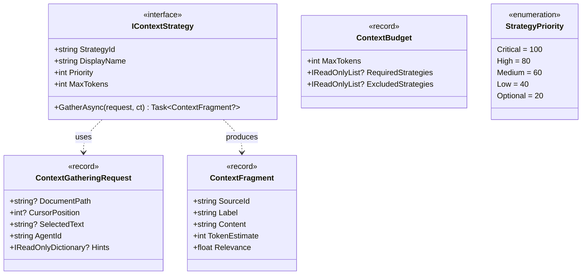

# LCS-DES-072a: Context Strategy Interface

## 1. Metadata & Categorization

| Field              | Value                      |
| :----------------- | :------------------------- |
| **Document ID**    | LCS-DES-072a               |
| **Feature ID**     | AGT-072a                   |
| **Feature Name**   | Context Strategy Interface |
| **Target Version** | v0.7.2a                    |
| **Module Scope**   | Lexichord.Abstractions     |
| **Swimlane**       | Agents                     |
| **License Tier**   | WriterPro+                 |
| **Status**         | Draft                      |
| **Last Updated**   | 2026-01-28                 |

---

## 2. Executive Summary

### 2.1 The Requirement

AI agents need contextual information to provide accurate, relevant assistance. Without a structured approach to context gathering, each agent would need to implement its own ad-hoc logic, leading to duplicated code, inconsistent behavior, and missed opportunities for optimization.

### 2.2 The Proposed Solution

Define a pluggable `IContextStrategy` abstraction that allows different types of context to be gathered independently and combined by an orchestrator. Each strategy focuses on a single context source (document content, selection, RAG results, etc.) and produces a standardized `ContextFragment` output.

---

## 3. Architecture & Modular Strategy

### 3.1 Dependencies

**Upstream Modules:**

| Component         | Version | Purpose                        |
| :---------------- | :------ | :----------------------------- |
| `ITokenCounter`   | v0.6.1b | Token estimation for fragments |
| `ILicenseContext` | v0.0.6a | License tier validation        |

**Downstream Consumers:**

| Component             | Version | Purpose                         |
| :-------------------- | :------ | :------------------------------ |
| Built-in strategies   | v0.7.2b | Implement `IContextStrategy`    |
| `ContextOrchestrator` | v0.7.2c | Coordinates multiple strategies |

### 3.2 Component Hierarchy



---

## 4. Data Contract (The API)

### 4.1 Core Interface

```csharp
namespace Lexichord.Abstractions.Agents.Context;

/// <summary>
/// Defines a pluggable strategy for gathering contextual information
/// to provide to AI agents during request processing.
///
/// Each strategy focuses on a specific type of context source:
/// - Document content
/// - User selection
/// - Cursor position
/// - Heading hierarchy
/// - RAG search results
/// - Style rules
///
/// Strategies are executed in parallel by the <see cref="IContextOrchestrator"/>
/// and their results are combined based on priority and token budget.
/// </summary>
/// <remarks>
/// <para>
/// <strong>Implementation Guidelines:</strong>
/// </para>
/// <list type="bullet">
///   <item>Return <c>null</c> if no relevant context is available</item>
///   <item>Respect <see cref="MaxTokens"/> to prevent context overflow</item>
///   <item>Use <see cref="Priority"/> to indicate importance (higher = more important)</item>
///   <item>Set <see cref="ContextFragment.Relevance"/> to help with trimming decisions</item>
///   <item>Handle cancellation via <see cref="CancellationToken"/></item>
/// </list>
/// </remarks>
public interface IContextStrategy
{
    /// <summary>
    /// Gets the unique identifier for this strategy.
    /// Used for configuration, logging, and deduplication.
    /// </summary>
    /// <example>
    /// Examples: "document", "selection", "rag", "style"
    /// </example>
    string StrategyId { get; }

    /// <summary>
    /// Gets the human-readable display name for UI presentation.
    /// Shown in the Context Preview panel.
    /// </summary>
    /// <example>
    /// Examples: "Document Content", "Selected Text", "Related Documentation"
    /// </example>
    string DisplayName { get; }

    /// <summary>
    /// Gets the execution priority for this strategy.
    /// Higher values indicate higher priority:
    /// - Higher priority strategies execute first in sorting
    /// - Higher priority fragments are retained during budget trimming
    ///
    /// Recommended ranges:
    /// - 100: Critical context (always needed)
    /// - 80: High priority (usually needed)
    /// - 60: Medium priority (helpful)
    /// - 40: Low priority (nice to have)
    /// - 20: Optional (include if budget allows)
    /// </summary>
    int Priority { get; }

    /// <summary>
    /// Gets the maximum tokens this strategy should contribute.
    /// Prevents any single strategy from consuming the entire budget.
    /// </summary>
    int MaxTokens { get; }

    /// <summary>
    /// Gathers relevant context based on the provided request.
    /// </summary>
    /// <param name="request">
    /// The context gathering request containing document path, cursor position,
    /// selection, agent ID, and optional hints.
    /// </param>
    /// <param name="ct">Cancellation token for timeout handling.</param>
    /// <returns>
    /// A <see cref="ContextFragment"/> containing the gathered context,
    /// or <c>null</c> if no relevant context is available.
    /// </returns>
    /// <exception cref="OperationCanceledException">
    /// Thrown when the cancellation token is triggered (e.g., timeout).
    /// </exception>
    Task<ContextFragment?> GatherAsync(
        ContextGatheringRequest request,
        CancellationToken ct);
}
```

### 4.2 Request Model

```csharp
namespace Lexichord.Abstractions.Agents.Context;

/// <summary>
/// Encapsulates all information needed to gather context for an agent request.
/// Passed to each <see cref="IContextStrategy"/> during context assembly.
/// </summary>
/// <param name="DocumentPath">
/// Path to the currently active document, if any.
/// May be null if no document is open.
/// </param>
/// <param name="CursorPosition">
/// Current cursor position in the document (character offset from start).
/// May be null if cursor position is unknown or not applicable.
/// </param>
/// <param name="SelectedText">
/// Currently selected text in the document, if any.
/// May be null if nothing is selected.
/// </param>
/// <param name="AgentId">
/// Identifier of the agent requesting context.
/// Allows strategies to customize behavior per agent.
/// </param>
/// <param name="Hints">
/// Optional key-value hints for strategy customization.
/// Strategies can check for specific hints to modify behavior.
/// </param>
/// <example>
/// <code>
/// var request = new ContextGatheringRequest(
///     DocumentPath: "/docs/chapter1.md",
///     CursorPosition: 1234,
///     SelectedText: "The old man and the sea",
///     AgentId: "editor",
///     Hints: new Dictionary&lt;string, object&gt;
///     {
///         ["IncludeHeadings"] = true,
///         ["MaxSearchResults"] = 5
///     });
/// </code>
/// </example>
public record ContextGatheringRequest(
    string? DocumentPath,
    int? CursorPosition,
    string? SelectedText,
    string AgentId,
    IReadOnlyDictionary<string, object>? Hints)
{
    /// <summary>
    /// Creates a minimal request with only the agent ID.
    /// Useful for testing or when no document context is available.
    /// </summary>
    public static ContextGatheringRequest Empty(string agentId)
        => new(null, null, null, agentId, null);

    /// <summary>
    /// Gets a hint value with type checking, returning default if not found.
    /// </summary>
    /// <typeparam name="T">Expected type of the hint value.</typeparam>
    /// <param name="key">Hint key to look up.</param>
    /// <param name="defaultValue">Value to return if hint not found.</param>
    public T GetHint<T>(string key, T defaultValue = default!)
    {
        if (Hints is null) return defaultValue;
        if (!Hints.TryGetValue(key, out var value)) return defaultValue;
        return value is T typed ? typed : defaultValue;
    }

    /// <summary>
    /// Checks if a document path is available.
    /// </summary>
    public bool HasDocument => !string.IsNullOrEmpty(DocumentPath);

    /// <summary>
    /// Checks if text is selected.
    /// </summary>
    public bool HasSelection => !string.IsNullOrEmpty(SelectedText);

    /// <summary>
    /// Checks if cursor position is known.
    /// </summary>
    public bool HasCursor => CursorPosition.HasValue;
}
```

### 4.3 Fragment Model

```csharp
namespace Lexichord.Abstractions.Agents.Context;

/// <summary>
/// Represents a single piece of context gathered by an <see cref="IContextStrategy"/>.
/// Contains the actual content along with metadata for sorting and display.
/// </summary>
/// <param name="SourceId">
/// Unique identifier of the source strategy that produced this fragment.
/// Matches the <see cref="IContextStrategy.StrategyId"/> of the producing strategy.
/// </param>
/// <param name="Label">
/// Human-readable label for display in the Context Preview panel.
/// Should be concise but descriptive.
/// </param>
/// <param name="Content">
/// The actual context content to be included in the agent prompt.
/// Already formatted as needed (e.g., markdown, code blocks).
/// </param>
/// <param name="TokenEstimate">
/// Estimated token count for this fragment's content.
/// Used for budget management and trimming decisions.
/// </param>
/// <param name="Relevance">
/// Relevance score from 0.0 (irrelevant) to 1.0 (perfectly relevant).
/// Used as a secondary sort key when priority is equal.
/// Higher relevance fragments are retained during budget trimming.
/// </param>
/// <example>
/// <code>
/// var fragment = new ContextFragment(
///     SourceId: "document",
///     Label: "Document Content",
///     Content: "# Chapter 3\n\nThis chapter covers integration patterns...",
///     TokenEstimate: 450,
///     Relevance: 1.0f);
/// </code>
/// </example>
public record ContextFragment(
    string SourceId,
    string Label,
    string Content,
    int TokenEstimate,
    float Relevance)
{
    /// <summary>
    /// Creates an empty fragment indicating a strategy produced no content.
    /// </summary>
    public static ContextFragment Empty(string sourceId, string label)
        => new(sourceId, label, string.Empty, 0, 0f);

    /// <summary>
    /// Indicates whether this fragment contains meaningful content.
    /// </summary>
    public bool HasContent => !string.IsNullOrWhiteSpace(Content);

    /// <summary>
    /// Creates a copy with truncated content to fit a token limit.
    /// </summary>
    /// <param name="maxTokens">Maximum tokens to retain.</param>
    /// <param name="tokenCounter">Token counter for estimation.</param>
    /// <returns>New fragment with truncated content.</returns>
    public ContextFragment TruncateTo(int maxTokens, ITokenCounter tokenCounter)
    {
        if (TokenEstimate <= maxTokens) return this;

        var truncated = TruncateContent(Content, maxTokens, tokenCounter);
        var newTokens = tokenCounter.CountTokens(truncated);

        return this with
        {
            Content = truncated,
            TokenEstimate = newTokens
        };
    }

    private static string TruncateContent(string content, int maxTokens, ITokenCounter counter)
    {
        // Smart truncation: prefer paragraph boundaries
        var paragraphs = content.Split("\n\n", StringSplitOptions.RemoveEmptyEntries);
        var result = new StringBuilder();

        foreach (var para in paragraphs)
        {
            if (counter.CountTokens(result.ToString() + para) > maxTokens)
                break;

            if (result.Length > 0) result.AppendLine();
            result.Append(para);
        }

        return result.ToString();
    }
}
```

### 4.4 Budget Model

```csharp
namespace Lexichord.Abstractions.Agents.Context;

/// <summary>
/// Specifies token budget and strategy filtering for context assembly.
/// Controls which strategies run and how much total context can be included.
/// </summary>
/// <param name="MaxTokens">
/// Maximum total tokens for assembled context.
/// Fragments will be trimmed to fit this budget.
/// </param>
/// <param name="RequiredStrategies">
/// Strategy IDs that must be included even if over budget.
/// A warning is logged but the strategy is not dropped.
/// </param>
/// <param name="ExcludedStrategies">
/// Strategy IDs that should not be executed, regardless of other settings.
/// Takes precedence over required strategies.
/// </param>
/// <example>
/// <code>
/// // Editor agent with specific requirements
/// var budget = new ContextBudget(
///     MaxTokens: 8000,
///     RequiredStrategies: ["document", "selection"],
///     ExcludedStrategies: ["rag"]);
/// </code>
/// </example>
public record ContextBudget(
    int MaxTokens,
    IReadOnlyList<string>? RequiredStrategies,
    IReadOnlyList<string>? ExcludedStrategies)
{
    /// <summary>
    /// Default budget with 8000 tokens and no strategy restrictions.
    /// </summary>
    public static ContextBudget Default => new(8000, null, null);

    /// <summary>
    /// Creates a budget with only a token limit.
    /// </summary>
    public static ContextBudget WithLimit(int maxTokens)
        => new(maxTokens, null, null);

    /// <summary>
    /// Checks if a strategy is required.
    /// </summary>
    public bool IsRequired(string strategyId)
        => RequiredStrategies?.Contains(strategyId) == true;

    /// <summary>
    /// Checks if a strategy is excluded.
    /// </summary>
    public bool IsExcluded(string strategyId)
        => ExcludedStrategies?.Contains(strategyId) == true;

    /// <summary>
    /// Checks if a strategy should be executed.
    /// </summary>
    public bool ShouldExecute(string strategyId)
        => !IsExcluded(strategyId);
}
```

### 4.5 Priority Enumeration

```csharp
namespace Lexichord.Abstractions.Agents.Context;

/// <summary>
/// Standard priority levels for context strategies.
/// Provides semantic meaning to priority values.
/// </summary>
public static class StrategyPriority
{
    /// <summary>
    /// Critical priority (100) - Always needed, never trimmed first.
    /// Example: Document content for edit requests.
    /// </summary>
    public const int Critical = 100;

    /// <summary>
    /// High priority (80) - Usually needed for good results.
    /// Example: Selected text for context-aware suggestions.
    /// </summary>
    public const int High = 80;

    /// <summary>
    /// Medium priority (60) - Helpful but not essential.
    /// Example: RAG search results for background knowledge.
    /// </summary>
    public const int Medium = 60;

    /// <summary>
    /// Low priority (40) - Nice to have.
    /// Example: Heading hierarchy for document structure.
    /// </summary>
    public const int Low = 40;

    /// <summary>
    /// Optional priority (20) - Include only if budget allows.
    /// Example: Style rules when editing.
    /// </summary>
    public const int Optional = 20;
}
```

### 4.6 Factory Interface

```csharp
namespace Lexichord.Abstractions.Agents.Context;

/// <summary>
/// Factory for creating context strategy instances.
/// Allows runtime registration and instantiation of strategies.
/// </summary>
public interface IContextStrategyFactory
{
    /// <summary>
    /// Gets all registered strategy IDs.
    /// </summary>
    IReadOnlyList<string> AvailableStrategyIds { get; }

    /// <summary>
    /// Creates a strategy instance by ID.
    /// </summary>
    /// <param name="strategyId">Strategy ID to instantiate.</param>
    /// <returns>Strategy instance, or null if not registered.</returns>
    IContextStrategy? CreateStrategy(string strategyId);

    /// <summary>
    /// Creates all available strategy instances.
    /// </summary>
    /// <returns>All registered strategies.</returns>
    IReadOnlyList<IContextStrategy> CreateAllStrategies();

    /// <summary>
    /// Checks if a strategy is available for the current license tier.
    /// </summary>
    bool IsAvailable(string strategyId, LicenseTier tier);
}
```

---

## 5. Implementation Logic

### 5.1 Base Strategy Implementation

```csharp
namespace Lexichord.Modules.Agents.Context;

/// <summary>
/// Base class for context strategies providing common functionality.
/// </summary>
public abstract class ContextStrategyBase : IContextStrategy
{
    protected readonly ITokenCounter _tokenCounter;
    protected readonly ILogger _logger;

    protected ContextStrategyBase(
        ITokenCounter tokenCounter,
        ILogger logger)
    {
        _tokenCounter = tokenCounter;
        _logger = logger;
    }

    /// <inheritdoc />
    public abstract string StrategyId { get; }

    /// <inheritdoc />
    public abstract string DisplayName { get; }

    /// <inheritdoc />
    public abstract int Priority { get; }

    /// <inheritdoc />
    public abstract int MaxTokens { get; }

    /// <inheritdoc />
    public abstract Task<ContextFragment?> GatherAsync(
        ContextGatheringRequest request,
        CancellationToken ct);

    /// <summary>
    /// Creates a fragment with automatic token estimation.
    /// </summary>
    protected ContextFragment CreateFragment(
        string content,
        float relevance = 1.0f,
        string? customLabel = null)
    {
        var tokens = _tokenCounter.CountTokens(content);

        _logger.LogDebug(
            "{Strategy} creating fragment with {Tokens} tokens",
            StrategyId, tokens);

        return new ContextFragment(
            SourceId: StrategyId,
            Label: customLabel ?? DisplayName,
            Content: content,
            TokenEstimate: tokens,
            Relevance: relevance);
    }

    /// <summary>
    /// Truncates content to fit MaxTokens, preferring paragraph boundaries.
    /// </summary>
    protected string TruncateToMaxTokens(string content)
    {
        var tokens = _tokenCounter.CountTokens(content);
        if (tokens <= MaxTokens) return content;

        _logger.LogWarning(
            "{Strategy} content ({Tokens} tokens) exceeds max ({Max}), truncating",
            StrategyId, tokens, MaxTokens);

        // Smart truncation: keep complete paragraphs
        var paragraphs = content.Split("\n\n", StringSplitOptions.RemoveEmptyEntries);
        var result = new StringBuilder();
        var currentTokens = 0;

        foreach (var para in paragraphs)
        {
            var paraTokens = _tokenCounter.CountTokens(para);
            if (currentTokens + paraTokens > MaxTokens) break;

            if (result.Length > 0) result.Append("\n\n");
            result.Append(para);
            currentTokens += paraTokens;
        }

        return result.ToString();
    }

    /// <summary>
    /// Verifies request has required properties for this strategy.
    /// </summary>
    protected bool ValidateRequest(
        ContextGatheringRequest request,
        bool requireDocument = false,
        bool requireSelection = false,
        bool requireCursor = false)
    {
        if (requireDocument && !request.HasDocument)
        {
            _logger.LogDebug("{Strategy}: No document available", StrategyId);
            return false;
        }

        if (requireSelection && !request.HasSelection)
        {
            _logger.LogDebug("{Strategy}: No selection available", StrategyId);
            return false;
        }

        if (requireCursor && !request.HasCursor)
        {
            _logger.LogDebug("{Strategy}: No cursor position available", StrategyId);
            return false;
        }

        return true;
    }
}
```

### 5.2 Strategy Factory Implementation

```csharp
namespace Lexichord.Modules.Agents.Context;

/// <summary>
/// Default factory for creating context strategies from DI container.
/// </summary>
public sealed class ContextStrategyFactory : IContextStrategyFactory
{
    private readonly IServiceProvider _services;
    private readonly ILicenseContext _license;
    private readonly ILogger<ContextStrategyFactory> _logger;

    private static readonly Dictionary<string, (Type Type, LicenseTier MinTier)> _registrations = new()
    {
        ["document"] = (typeof(DocumentContextStrategy), LicenseTier.WriterPro),
        ["selection"] = (typeof(SelectionContextStrategy), LicenseTier.WriterPro),
        ["cursor"] = (typeof(CursorContextStrategy), LicenseTier.WriterPro),
        ["heading"] = (typeof(HeadingContextStrategy), LicenseTier.WriterPro),
        ["rag"] = (typeof(RAGContextStrategy), LicenseTier.Teams),
        ["style"] = (typeof(StyleContextStrategy), LicenseTier.Teams),
    };

    public ContextStrategyFactory(
        IServiceProvider services,
        ILicenseContext license,
        ILogger<ContextStrategyFactory> logger)
    {
        _services = services;
        _license = license;
        _logger = logger;
    }

    public IReadOnlyList<string> AvailableStrategyIds =>
        _registrations
            .Where(kv => IsAvailable(kv.Key, _license.CurrentTier))
            .Select(kv => kv.Key)
            .ToList();

    public IContextStrategy? CreateStrategy(string strategyId)
    {
        if (!_registrations.TryGetValue(strategyId, out var reg))
        {
            _logger.LogWarning("Unknown strategy ID: {StrategyId}", strategyId);
            return null;
        }

        if (!IsAvailable(strategyId, _license.CurrentTier))
        {
            _logger.LogDebug(
                "Strategy {StrategyId} not available for tier {Tier}",
                strategyId, _license.CurrentTier);
            return null;
        }

        return (IContextStrategy)_services.GetRequiredService(reg.Type);
    }

    public IReadOnlyList<IContextStrategy> CreateAllStrategies()
    {
        var result = new List<IContextStrategy>();

        foreach (var strategyId in AvailableStrategyIds)
        {
            var strategy = CreateStrategy(strategyId);
            if (strategy is not null)
            {
                result.Add(strategy);
            }
        }

        _logger.LogDebug("Created {Count} strategies", result.Count);
        return result;
    }

    public bool IsAvailable(string strategyId, LicenseTier tier)
    {
        if (!_registrations.TryGetValue(strategyId, out var reg))
            return false;

        return tier >= reg.MinTier;
    }
}
```

---

## 6. Observability & Logging

| Level   | Source              | Message Template                                                |
| :------ | :------------------ | :-------------------------------------------------------------- |
| Debug   | ContextStrategyBase | `{Strategy} creating fragment with {Tokens} tokens`             |
| Debug   | ContextStrategyBase | `{Strategy}: No document available`                             |
| Debug   | ContextStrategyBase | `{Strategy}: No selection available`                            |
| Warning | ContextStrategyBase | `{Strategy} content ({Tokens}) exceeds max ({Max}), truncating` |
| Debug   | StrategyFactory     | `Created {Count} strategies`                                    |
| Warning | StrategyFactory     | `Unknown strategy ID: {StrategyId}`                             |
| Debug   | StrategyFactory     | `Strategy {StrategyId} not available for tier {Tier}`           |

---

## 7. Security Considerations

| Consideration             | Mitigation                                     |
| :------------------------ | :--------------------------------------------- |
| Document content exposure | Context follows same access rules as documents |
| Strategy injection        | Factory only creates registered strategies     |
| Arbitrary hints           | Validate hint types before processing          |
| Token count manipulation  | Verify counts with actual tokenizer            |

---

## 8. Acceptance Criteria (QA)

| #   | Category       | Criterion                                                     |
| :-- | :------------- | :------------------------------------------------------------ |
| 1   | **Interface**  | `IContextStrategy` defines all required members               |
| 2   | **Request**    | `ContextGatheringRequest` contains all documented fields      |
| 3   | **Fragment**   | `ContextFragment` captures source, content, tokens, relevance |
| 4   | **Budget**     | `ContextBudget` supports required/excluded strategy lists     |
| 5   | **Factory**    | Factory creates strategies based on license tier              |
| 6   | **Base Class** | `ContextStrategyBase` provides token estimation helpers       |
| 7   | **Truncation** | Truncation respects paragraph boundaries                      |
| 8   | **Validation** | Base class validates request properties correctly             |

---

## 9. Unit Tests

```csharp
[Trait("Category", "Unit")]
[Trait("Version", "v0.7.2a")]
public class ContextGatheringRequestTests
{
    [Fact]
    public void Empty_CreatesRequestWithOnlyAgentId()
    {
        // Arrange & Act
        var request = ContextGatheringRequest.Empty("test-agent");

        // Assert
        request.DocumentPath.Should().BeNull();
        request.CursorPosition.Should().BeNull();
        request.SelectedText.Should().BeNull();
        request.AgentId.Should().Be("test-agent");
        request.Hints.Should().BeNull();
    }

    [Fact]
    public void GetHint_ReturnsValueWhenPresent()
    {
        // Arrange
        var request = new ContextGatheringRequest(
            null, null, null, "test",
            new Dictionary<string, object> { ["maxResults"] = 5 });

        // Act
        var result = request.GetHint<int>("maxResults");

        // Assert
        result.Should().Be(5);
    }

    [Fact]
    public void GetHint_ReturnsDefaultWhenMissing()
    {
        // Arrange
        var request = ContextGatheringRequest.Empty("test");

        // Act
        var result = request.GetHint("missing", 10);

        // Assert
        result.Should().Be(10);
    }

    [Theory]
    [InlineData("/path/doc.md", true)]
    [InlineData("", false)]
    [InlineData(null, false)]
    public void HasDocument_ReflectsDocumentPathPresence(string? path, bool expected)
    {
        // Arrange
        var request = new ContextGatheringRequest(path, null, null, "test", null);

        // Act & Assert
        request.HasDocument.Should().Be(expected);
    }
}

[Trait("Category", "Unit")]
[Trait("Version", "v0.7.2a")]
public class ContextFragmentTests
{
    [Fact]
    public void Empty_CreatesFragmentWithNoContent()
    {
        // Arrange & Act
        var fragment = ContextFragment.Empty("test", "Test Label");

        // Assert
        fragment.SourceId.Should().Be("test");
        fragment.Label.Should().Be("Test Label");
        fragment.Content.Should().BeEmpty();
        fragment.TokenEstimate.Should().Be(0);
        fragment.Relevance.Should().Be(0f);
    }

    [Fact]
    public void HasContent_ReturnsTrueWhenContentPresent()
    {
        // Arrange
        var fragment = new ContextFragment("test", "Test", "Some content", 10, 1.0f);

        // Act & Assert
        fragment.HasContent.Should().BeTrue();
    }

    [Fact]
    public void HasContent_ReturnsFalseForEmptyContent()
    {
        // Arrange
        var fragment = ContextFragment.Empty("test", "Test");

        // Act & Assert
        fragment.HasContent.Should().BeFalse();
    }
}

[Trait("Category", "Unit")]
[Trait("Version", "v0.7.2a")]
public class ContextBudgetTests
{
    [Fact]
    public void Default_Has8000Tokens()
    {
        // Act
        var budget = ContextBudget.Default;

        // Assert
        budget.MaxTokens.Should().Be(8000);
        budget.RequiredStrategies.Should().BeNull();
        budget.ExcludedStrategies.Should().BeNull();
    }

    [Fact]
    public void IsRequired_ReturnsTrueForRequiredStrategy()
    {
        // Arrange
        var budget = new ContextBudget(8000, ["document", "selection"], null);

        // Act & Assert
        budget.IsRequired("document").Should().BeTrue();
        budget.IsRequired("rag").Should().BeFalse();
    }

    [Fact]
    public void IsExcluded_ReturnsTrueForExcludedStrategy()
    {
        // Arrange
        var budget = new ContextBudget(8000, null, ["rag"]);

        // Act & Assert
        budget.IsExcluded("rag").Should().BeTrue();
        budget.IsExcluded("document").Should().BeFalse();
    }

    [Fact]
    public void ShouldExecute_ReturnsFalseForExcludedStrategy()
    {
        // Arrange
        var budget = new ContextBudget(8000, null, ["rag"]);

        // Act & Assert
        budget.ShouldExecute("rag").Should().BeFalse();
        budget.ShouldExecute("document").Should().BeTrue();
    }
}

[Trait("Category", "Unit")]
[Trait("Version", "v0.7.2a")]
public class ContextStrategyFactoryTests
{
    [Fact]
    public void AvailableStrategyIds_ReflectsLicenseTier()
    {
        // Arrange
        var license = Substitute.For<ILicenseContext>();
        license.CurrentTier.Returns(LicenseTier.WriterPro);

        var factory = new ContextStrategyFactory(
            Substitute.For<IServiceProvider>(),
            license,
            NullLogger<ContextStrategyFactory>.Instance);

        // Act
        var ids = factory.AvailableStrategyIds;

        // Assert - WriterPro has document, selection, cursor, heading
        //          but NOT rag, style (Teams+)
        ids.Should().Contain("document");
        ids.Should().Contain("selection");
        ids.Should().NotContain("rag");
        ids.Should().NotContain("style");
    }

    [Fact]
    public void CreateStrategy_ReturnsNullForUnknownId()
    {
        // Arrange
        var factory = CreateFactory(LicenseTier.Enterprise);

        // Act
        var strategy = factory.CreateStrategy("unknown");

        // Assert
        strategy.Should().BeNull();
    }

    [Fact]
    public void IsAvailable_ReturnsFalseForInsufficientTier()
    {
        // Arrange
        var factory = CreateFactory(LicenseTier.WriterPro);

        // Act & Assert
        factory.IsAvailable("rag", LicenseTier.WriterPro).Should().BeFalse();
        factory.IsAvailable("rag", LicenseTier.Teams).Should().BeTrue();
    }
}
```

---

## 10. DI Registration

```csharp
// In AgentsModule.cs

public static IServiceCollection AddContextStrategyInterface(
    this IServiceCollection services)
{
    // Factory for creating strategies
    services.AddSingleton<IContextStrategyFactory, ContextStrategyFactory>();

    // Token counter dependency
    services.AddSingleton<ITokenCounter, TiktokenTokenCounter>();

    return services;
}
```

---

## 11. Deliverable Checklist

| #   | Deliverable                             | Status |
| :-- | :-------------------------------------- | :----- |
| 1   | `IContextStrategy` interface            | [ ]    |
| 2   | `ContextGatheringRequest` record        | [ ]    |
| 3   | `ContextFragment` record                | [ ]    |
| 4   | `ContextBudget` record                  | [ ]    |
| 5   | `StrategyPriority` constants            | [ ]    |
| 6   | `IContextStrategyFactory` interface     | [ ]    |
| 7   | `ContextStrategyBase` abstract class    | [ ]    |
| 8   | `ContextStrategyFactory` implementation | [ ]    |
| 9   | Unit tests for all contracts            | [ ]    |

---
