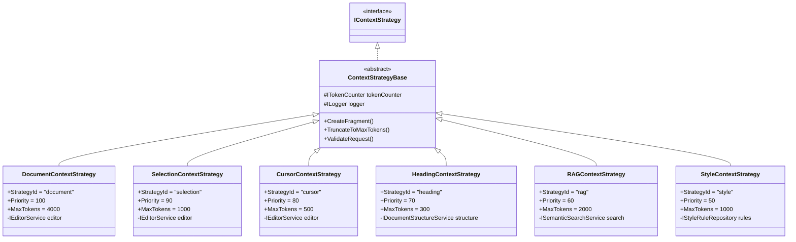
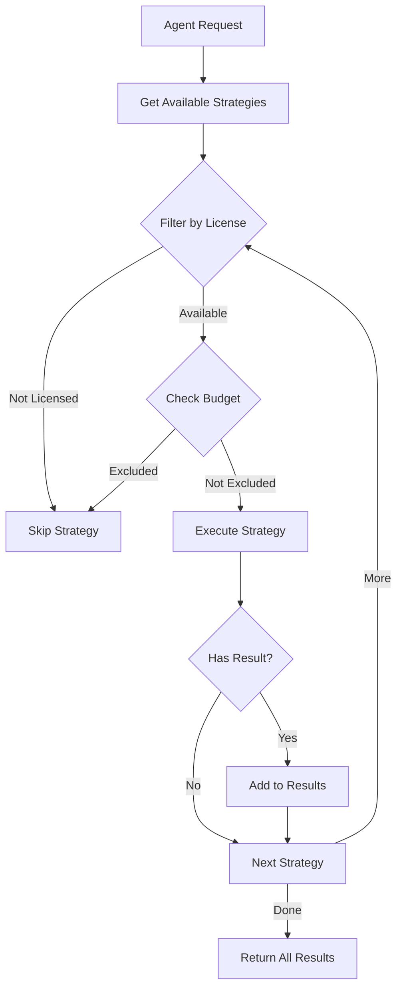

# LCS-DES-072b: Built-in Context Strategies

## 1. Metadata & Categorization

| Field              | Value                       |
| :----------------- | :-------------------------- |
| **Document ID**    | LCS-DES-072b                |
| **Feature ID**     | AGT-072b                    |
| **Feature Name**   | Built-in Context Strategies |
| **Target Version** | v0.7.2b                     |
| **Module Scope**   | Lexichord.Modules.Agents    |
| **Swimlane**       | Agents                      |
| **License Tier**   | WriterPro+ / Teams+         |
| **Status**         | Draft                       |
| **Last Updated**   | 2026-01-28                  |

---

## 2. Executive Summary

### 2.1 The Requirement

The Context Assembler requires concrete implementations of `IContextStrategy` to gather relevant information for AI agents. Each strategy focuses on a specific context source with appropriate logic for extraction, formatting, and relevance scoring.

### 2.2 The Proposed Solution

Implement six built-in context strategies covering the most common context sources:

1. **DocumentContextStrategy** - Current document content with smart truncation
2. **SelectionContextStrategy** - Selected text with surrounding paragraph context
3. **CursorContextStrategy** - Text window around the cursor position
4. **HeadingContextStrategy** - Document heading hierarchy for structure awareness
5. **RAGContextStrategy** - Semantic search results from indexed documentation
6. **StyleContextStrategy** - Active style rules for consistency guidance

---

## 3. Architecture & Modular Strategy

### 3.1 Dependencies

**Upstream Modules:**

| Component                   | Version | Purpose                 |
| :-------------------------- | :------ | :---------------------- |
| `IContextStrategy`          | v0.7.2a | Interface to implement  |
| `ContextStrategyBase`       | v0.7.2a | Base class with helpers |
| `IEditorService`            | v0.1.3a | Document content access |
| `IDocumentStructureService` | v0.1.4b | Heading/section parsing |
| `ISemanticSearchService`    | v0.4.5a | RAG semantic search     |
| `IStyleRuleRepository`      | v0.2.1b | Style rule access       |
| `ITokenCounter`             | v0.6.1b | Token estimation        |
| `ILicenseContext`           | v0.0.6a | License gating          |

### 3.2 Strategy Overview



### 3.3 License Gating

| Strategy  | License Tier | Rationale                            |
| :-------- | :----------- | :----------------------------------- |
| document  | WriterPro+   | Basic AI assistance                  |
| selection | WriterPro+   | Basic context-aware editing          |
| cursor    | WriterPro+   | Basic cursor-based suggestions       |
| heading   | WriterPro+   | Document structure understanding     |
| rag       | Teams+       | Advanced semantic search (resources) |
| style     | Teams+       | Team style consistency               |

---

## 4. Data Contract (The API)

### 4.1 DocumentContextStrategy

```csharp
namespace Lexichord.Modules.Agents.Context.Strategies;

/// <summary>
/// Provides the current document content as context for AI agents.
/// Implements smart truncation to respect token limits while preserving
/// complete paragraphs and document structure.
/// </summary>
/// <remarks>
/// <para><strong>Priority:</strong> 100 (Critical) - Fundamental context for most agents.</para>
/// <para><strong>License:</strong> WriterPro+</para>
/// <para><strong>Max Tokens:</strong> 4000</para>
/// </remarks>
[RequiresLicense(LicenseTier.WriterPro)]
public sealed class DocumentContextStrategy : ContextStrategyBase
{
    private readonly IEditorService _editor;

    /// <inheritdoc />
    public override string StrategyId => "document";

    /// <inheritdoc />
    public override string DisplayName => "Document Content";

    /// <inheritdoc />
    public override int Priority => StrategyPriority.Critical; // 100

    /// <inheritdoc />
    public override int MaxTokens => 4000;

    public DocumentContextStrategy(
        IEditorService editor,
        ITokenCounter tokenCounter,
        ILogger<DocumentContextStrategy> logger)
        : base(tokenCounter, logger)
    {
        _editor = editor;
    }

    /// <inheritdoc />
    public override async Task<ContextFragment?> GatherAsync(
        ContextGatheringRequest request,
        CancellationToken ct)
    {
        if (!ValidateRequest(request, requireDocument: true))
            return null;

        _logger.LogDebug(
            "DocumentContextStrategy gathering content from {Path}",
            request.DocumentPath);

        var content = await _editor.GetContentAsync(request.DocumentPath!, ct);

        if (string.IsNullOrWhiteSpace(content))
        {
            _logger.LogDebug("Document is empty, returning null");
            return null;
        }

        // Smart truncation preserving structure
        content = TruncateSmartly(content);

        return CreateFragment(content, relevance: 1.0f);
    }

    private string TruncateSmartly(string content)
    {
        var tokens = _tokenCounter.CountTokens(content);
        if (tokens <= MaxTokens) return content;

        _logger.LogInformation(
            "Truncating document from {Original} to ~{Max} tokens",
            tokens, MaxTokens);

        // Strategy: Keep complete sections/paragraphs
        var lines = content.Split('\n');
        var result = new StringBuilder();
        var currentTokens = 0;

        foreach (var line in lines)
        {
            var lineTokens = _tokenCounter.CountTokens(line);

            // Check if adding this line would exceed budget
            if (currentTokens + lineTokens > MaxTokens)
            {
                // Check if we're at a good breaking point (heading or blank line)
                if (IsBreakingPoint(line) || result.Length > MaxTokens / 2)
                {
                    result.AppendLine("...");
                    result.AppendLine("[Content truncated to fit token budget]");
                    break;
                }
            }

            result.AppendLine(line);
            currentTokens += lineTokens;
        }

        return result.ToString().TrimEnd();
    }

    private static bool IsBreakingPoint(string line)
        => string.IsNullOrWhiteSpace(line) || line.StartsWith('#');
}
```

### 4.2 SelectionContextStrategy

```csharp
namespace Lexichord.Modules.Agents.Context.Strategies;

/// <summary>
/// Provides the user's selected text with surrounding paragraph context.
/// Designed for context-aware editing suggestions based on what the user
/// has explicitly selected.
/// </summary>
/// <remarks>
/// <para><strong>Priority:</strong> 90 (High) - User's explicit focus.</para>
/// <para><strong>License:</strong> WriterPro+</para>
/// <para><strong>Max Tokens:</strong> 1000</para>
/// </remarks>
[RequiresLicense(LicenseTier.WriterPro)]
public sealed class SelectionContextStrategy : ContextStrategyBase
{
    private readonly IEditorService _editor;

    private const int SurroundingParagraphs = 1; // Include 1 paragraph before/after

    /// <inheritdoc />
    public override string StrategyId => "selection";

    /// <inheritdoc />
    public override string DisplayName => "Selected Text";

    /// <inheritdoc />
    public override int Priority => StrategyPriority.High; // 90

    /// <inheritdoc />
    public override int MaxTokens => 1000;

    public SelectionContextStrategy(
        IEditorService editor,
        ITokenCounter tokenCounter,
        ILogger<SelectionContextStrategy> logger)
        : base(tokenCounter, logger)
    {
        _editor = editor;
    }

    /// <inheritdoc />
    public override async Task<ContextFragment?> GatherAsync(
        ContextGatheringRequest request,
        CancellationToken ct)
    {
        if (!ValidateRequest(request, requireSelection: true))
            return null;

        _logger.LogDebug(
            "SelectionContextStrategy gathering selection ({Length} chars)",
            request.SelectedText!.Length);

        var selection = request.SelectedText!;
        var context = await GetSurroundingContextAsync(request, ct);

        var result = FormatSelectionWithContext(selection, context);
        result = TruncateToMaxTokens(result);

        return CreateFragment(result, relevance: 1.0f);
    }

    private async Task<(string before, string after)> GetSurroundingContextAsync(
        ContextGatheringRequest request,
        CancellationToken ct)
    {
        if (!request.HasDocument || !request.HasCursor)
            return (string.Empty, string.Empty);

        var fullContent = await _editor.GetContentAsync(request.DocumentPath!, ct);
        var cursorPos = request.CursorPosition!.Value;

        // Find paragraph boundaries
        var paragraphs = fullContent.Split("\n\n", StringSplitOptions.RemoveEmptyEntries);

        int charCount = 0;
        int selectionParagraphIndex = 0;

        for (int i = 0; i < paragraphs.Length; i++)
        {
            if (charCount + paragraphs[i].Length >= cursorPos)
            {
                selectionParagraphIndex = i;
                break;
            }
            charCount += paragraphs[i].Length + 2; // +2 for \n\n
        }

        // Get surrounding paragraphs
        var beforeStart = Math.Max(0, selectionParagraphIndex - SurroundingParagraphs);
        var afterEnd = Math.Min(paragraphs.Length - 1, selectionParagraphIndex + SurroundingParagraphs);

        var before = string.Join("\n\n", paragraphs.Skip(beforeStart).Take(selectionParagraphIndex - beforeStart));
        var after = string.Join("\n\n", paragraphs.Skip(selectionParagraphIndex + 1).Take(afterEnd - selectionParagraphIndex));

        return (before, after);
    }

    private static string FormatSelectionWithContext(string selection, (string before, string after) context)
    {
        var sb = new StringBuilder();

        if (!string.IsNullOrWhiteSpace(context.before))
        {
            sb.AppendLine("[Context before selection]");
            sb.AppendLine(context.before);
            sb.AppendLine();
        }

        sb.AppendLine("<<SELECTED_TEXT>>");
        sb.AppendLine(selection);
        sb.AppendLine("<</SELECTED_TEXT>>");

        if (!string.IsNullOrWhiteSpace(context.after))
        {
            sb.AppendLine();
            sb.AppendLine("[Context after selection]");
            sb.AppendLine(context.after);
        }

        return sb.ToString();
    }
}
```

### 4.3 CursorContextStrategy

```csharp
namespace Lexichord.Modules.Agents.Context.Strategies;

/// <summary>
/// Provides a text window around the cursor position.
/// Useful for suggestions at the current writing position.
/// </summary>
/// <remarks>
/// <para><strong>Priority:</strong> 80 (High)</para>
/// <para><strong>License:</strong> WriterPro+</para>
/// <para><strong>Max Tokens:</strong> 500</para>
/// </remarks>
[RequiresLicense(LicenseTier.WriterPro)]
public sealed class CursorContextStrategy : ContextStrategyBase
{
    private readonly IEditorService _editor;

    /// <summary>
    /// Default number of characters to include before/after cursor.
    /// Can be overridden via hints["WindowSize"].
    /// </summary>
    private const int DefaultWindowSize = 500;

    /// <inheritdoc />
    public override string StrategyId => "cursor";

    /// <inheritdoc />
    public override string DisplayName => "Cursor Context";

    /// <inheritdoc />
    public override int Priority => StrategyPriority.High - 10; // 80

    /// <inheritdoc />
    public override int MaxTokens => 500;

    public CursorContextStrategy(
        IEditorService editor,
        ITokenCounter tokenCounter,
        ILogger<CursorContextStrategy> logger)
        : base(tokenCounter, logger)
    {
        _editor = editor;
    }

    /// <inheritdoc />
    public override async Task<ContextFragment?> GatherAsync(
        ContextGatheringRequest request,
        CancellationToken ct)
    {
        if (!ValidateRequest(request, requireDocument: true, requireCursor: true))
            return null;

        var windowSize = request.GetHint("WindowSize", DefaultWindowSize);

        _logger.LogDebug(
            "CursorContextStrategy gathering {WindowSize} chars around position {Pos}",
            windowSize, request.CursorPosition);

        var content = await _editor.GetContentAsync(request.DocumentPath!, ct);
        var cursorPos = request.CursorPosition!.Value;

        // Extract window around cursor
        var startPos = Math.Max(0, cursorPos - windowSize / 2);
        var endPos = Math.Min(content.Length, cursorPos + windowSize / 2);

        // Expand to word boundaries
        startPos = ExpandToWordBoundary(content, startPos, Direction.Left);
        endPos = ExpandToWordBoundary(content, endPos, Direction.Right);

        var window = content.Substring(startPos, endPos - startPos);

        // Mark cursor position
        var cursorOffset = cursorPos - startPos;
        var result = FormatWithCursorMarker(window, cursorOffset);

        result = TruncateToMaxTokens(result);

        // Lower relevance if cursor is at very start/end of document
        var relevance = CalculateRelevance(cursorPos, content.Length);

        return CreateFragment(result, relevance);
    }

    private static int ExpandToWordBoundary(string content, int pos, Direction direction)
    {
        if (pos <= 0 || pos >= content.Length) return pos;

        var step = direction == Direction.Left ? -1 : 1;

        while (pos > 0 && pos < content.Length && !char.IsWhiteSpace(content[pos]))
        {
            pos += step;
        }

        return pos;
    }

    private static string FormatWithCursorMarker(string window, int cursorOffset)
    {
        if (cursorOffset < 0 || cursorOffset > window.Length)
            return window;

        // Insert a visible cursor marker
        return window.Insert(cursorOffset, "▌"); // Unicode vertical bar
    }

    private static float CalculateRelevance(int cursorPos, int contentLength)
    {
        if (contentLength == 0) return 0.5f;

        // Higher relevance in the middle of the document
        var relativePos = (float)cursorPos / contentLength;
        var distanceFromCenter = Math.Abs(0.5f - relativePos);

        return Math.Max(0.6f, 1.0f - distanceFromCenter);
    }

    private enum Direction { Left, Right }
}
```

### 4.4 HeadingContextStrategy

```csharp
namespace Lexichord.Modules.Agents.Context.Strategies;

/// <summary>
/// Provides the heading hierarchy (document structure) as context.
/// Helps agents understand the document organization and current location.
/// </summary>
/// <remarks>
/// <para><strong>Priority:</strong> 70 (Medium-High)</para>
/// <para><strong>License:</strong> WriterPro+</para>
/// <para><strong>Max Tokens:</strong> 300</para>
/// </remarks>
[RequiresLicense(LicenseTier.WriterPro)]
public sealed class HeadingContextStrategy : ContextStrategyBase
{
    private readonly IDocumentStructureService _structure;

    /// <inheritdoc />
    public override string StrategyId => "heading";

    /// <inheritdoc />
    public override string DisplayName => "Heading Hierarchy";

    /// <inheritdoc />
    public override int Priority => StrategyPriority.Medium + 10; // 70

    /// <inheritdoc />
    public override int MaxTokens => 300;

    public HeadingContextStrategy(
        IDocumentStructureService structure,
        ITokenCounter tokenCounter,
        ILogger<HeadingContextStrategy> logger)
        : base(tokenCounter, logger)
    {
        _structure = structure;
    }

    /// <inheritdoc />
    public override async Task<ContextFragment?> GatherAsync(
        ContextGatheringRequest request,
        CancellationToken ct)
    {
        if (!ValidateRequest(request, requireDocument: true))
            return null;

        _logger.LogDebug(
            "HeadingContextStrategy gathering structure from {Path}",
            request.DocumentPath);

        var structure = await _structure.GetStructureAsync(request.DocumentPath!, ct);

        if (structure.Headings.Count == 0)
        {
            _logger.LogDebug("No headings found in document");
            return null;
        }

        // Build heading tree
        var headingTree = BuildHeadingTree(structure.Headings);

        // Find current section based on cursor
        var currentPath = request.HasCursor
            ? FindCurrentPath(structure.Headings, request.CursorPosition!.Value)
            : Array.Empty<Heading>();

        var content = FormatHeadingContext(headingTree, currentPath);
        content = TruncateToMaxTokens(content);

        var relevance = currentPath.Length > 0 ? 1.0f : 0.7f;
        return CreateFragment(content, relevance);
    }

    private static string BuildHeadingTree(IReadOnlyList<Heading> headings)
    {
        var sb = new StringBuilder();
        sb.AppendLine("## Document Structure");
        sb.AppendLine();

        int prevLevel = 0;

        foreach (var heading in headings)
        {
            var indent = new string(' ', (heading.Level - 1) * 2);
            sb.AppendLine($"{indent}- {heading.Text}");
        }

        return sb.ToString();
    }

    private static IReadOnlyList<Heading> FindCurrentPath(
        IReadOnlyList<Heading> headings,
        int cursorPosition)
    {
        var path = new List<Heading>();
        Heading? current = null;

        foreach (var heading in headings)
        {
            if (heading.StartPosition > cursorPosition)
                break;

            // Check if this heading is at the same or higher level
            while (path.Count > 0 && path[^1].Level >= heading.Level)
            {
                path.RemoveAt(path.Count - 1);
            }

            path.Add(heading);
            current = heading;
        }

        return path;
    }

    private static string FormatHeadingContext(
        string headingTree,
        IReadOnlyList<Heading> currentPath)
    {
        var sb = new StringBuilder();
        sb.Append(headingTree);

        if (currentPath.Count > 0)
        {
            sb.AppendLine();
            sb.AppendLine("## Current Location");
            sb.AppendLine();
            sb.Append("You are in: ");
            sb.AppendJoin(" → ", currentPath.Select(h => h.Text));
            sb.AppendLine();
        }

        return sb.ToString();
    }
}
```

### 4.5 RAGContextStrategy

````csharp
namespace Lexichord.Modules.Agents.Context.Strategies;

/// <summary>
/// Provides semantically related content from the RAG index.
/// Searches indexed documentation for related snippets based on
/// the user's selection or current paragraph.
/// </summary>
/// <remarks>
/// <para><strong>Priority:</strong> 60 (Medium)</para>
/// <para><strong>License:</strong> Teams+ (requires indexed corpus)</para>
/// <para><strong>Max Tokens:</strong> 2000</para>
/// </remarks>
[RequiresLicense(LicenseTier.Teams)]
public sealed class RAGContextStrategy : ContextStrategyBase
{
    private readonly ISemanticSearchService _search;
    private readonly IContextExpansionService _expansion;

    private const int DefaultTopK = 3;
    private const float MinRelevanceScore = 0.7f;

    /// <inheritdoc />
    public override string StrategyId => "rag";

    /// <inheritdoc />
    public override string DisplayName => "Related Documentation";

    /// <inheritdoc />
    public override int Priority => StrategyPriority.Medium; // 60

    /// <inheritdoc />
    public override int MaxTokens => 2000;

    public RAGContextStrategy(
        ISemanticSearchService search,
        IContextExpansionService expansion,
        ITokenCounter tokenCounter,
        ILogger<RAGContextStrategy> logger)
        : base(tokenCounter, logger)
    {
        _search = search;
        _expansion = expansion;
    }

    /// <inheritdoc />
    public override async Task<ContextFragment?> GatherAsync(
        ContextGatheringRequest request,
        CancellationToken ct)
    {
        // Need either selection or document for search query
        if (!request.HasSelection && !request.HasDocument)
        {
            _logger.LogDebug("RAGContextStrategy: No text available for search");
            return null;
        }

        var query = await BuildSearchQueryAsync(request, ct);
        if (string.IsNullOrWhiteSpace(query))
        {
            _logger.LogDebug("RAGContextStrategy: Could not build search query");
            return null;
        }

        var topK = request.GetHint("TopK", DefaultTopK);

        _logger.LogDebug(
            "RAGContextStrategy searching for: '{Query}' (top {K})",
            query.Truncate(50), topK);

        var options = new SearchOptions(TopK: topK, IncludeMetadata: true);
        var results = await _search.SearchAsync(query, options, ct);

        if (results.Hits.Count == 0)
        {
            _logger.LogDebug("RAGContextStrategy: No results found");
            return null;
        }

        // Filter by relevance
        var relevantHits = results.Hits
            .Where(h => h.Score >= MinRelevanceScore)
            .ToList();

        if (relevantHits.Count == 0)
        {
            _logger.LogDebug(
                "RAGContextStrategy: {Count} results below threshold {Threshold}",
                results.Hits.Count, MinRelevanceScore);
            return null;
        }

        // Expand to surrounding context and format
        var expandedContent = await ExpandResultsAsync(relevantHits, ct);
        var content = FormatSearchResults(expandedContent);
        content = TruncateToMaxTokens(content);

        // Average relevance of included hits
        var avgRelevance = relevantHits.Average(h => h.Score);

        return CreateFragment(content, (float)avgRelevance);
    }

    private async Task<string> BuildSearchQueryAsync(
        ContextGatheringRequest request,
        CancellationToken ct)
    {
        // Prefer selection if available
        if (request.HasSelection)
        {
            return ExtractKeyPhrases(request.SelectedText!);
        }

        // Fall back to current paragraph around cursor
        if (request.HasDocument && request.HasCursor)
        {
            var paragraph = await _expansion.GetParagraphAtPositionAsync(
                request.DocumentPath!,
                request.CursorPosition!.Value,
                ct);
            return ExtractKeyPhrases(paragraph ?? "");
        }

        return string.Empty;
    }

    private static string ExtractKeyPhrases(string text)
    {
        // Simple extraction: first 100 chars of non-trivial content
        var cleaned = text
            .Replace("\n", " ")
            .Replace("\r", " ");

        if (cleaned.Length > 100)
            cleaned = cleaned.Substring(0, 100);

        return cleaned;
    }

    private async Task<List<ExpandedResult>> ExpandResultsAsync(
        IReadOnlyList<SearchHit> hits,
        CancellationToken ct)
    {
        var results = new List<ExpandedResult>();

        foreach (var hit in hits)
        {
            var expanded = await _expansion.ExpandAsync(hit.DocumentId, hit.Offset, ct);
            results.Add(new ExpandedResult(hit, expanded));
        }

        return results;
    }

    private static string FormatSearchResults(IReadOnlyList<ExpandedResult> results)
    {
        var sb = new StringBuilder();
        sb.AppendLine("## Related Documentation");
        sb.AppendLine();

        foreach (var result in results)
        {
            sb.AppendLine($"### From: {result.Hit.DocumentTitle}");
            sb.AppendLine($"*Relevance: {result.Hit.Score:P0}*");
            sb.AppendLine();
            sb.AppendLine("```");
            sb.AppendLine(result.ExpandedContent);
            sb.AppendLine("```");
            sb.AppendLine();
        }

        return sb.ToString();
    }

    private record ExpandedResult(SearchHit Hit, string ExpandedContent);
}
````

### 4.6 StyleContextStrategy

```csharp
namespace Lexichord.Modules.Agents.Context.Strategies;

/// <summary>
/// Provides active style rules as context for the AI agent.
/// Ensures agent suggestions align with the configured style guide.
/// </summary>
/// <remarks>
/// <para><strong>Priority:</strong> 50 (Medium-Low)</para>
/// <para><strong>License:</strong> Teams+ (team style consistency)</para>
/// <para><strong>Max Tokens:</strong> 1000</para>
/// </remarks>
[RequiresLicense(LicenseTier.Teams)]
public sealed class StyleContextStrategy : ContextStrategyBase
{
    private readonly IStyleRuleRepository _rules;
    private readonly IStyleProfile _profile;

    /// <inheritdoc />
    public override string StrategyId => "style";

    /// <inheritdoc />
    public override string DisplayName => "Style Rules";

    /// <inheritdoc />
    public override int Priority => StrategyPriority.Optional + 30; // 50

    /// <inheritdoc />
    public override int MaxTokens => 1000;

    public StyleContextStrategy(
        IStyleRuleRepository rules,
        IStyleProfile profile,
        ITokenCounter tokenCounter,
        ILogger<StyleContextStrategy> logger)
        : base(tokenCounter, logger)
    {
        _rules = rules;
        _profile = profile;
    }

    /// <inheritdoc />
    public override async Task<ContextFragment?> GatherAsync(
        ContextGatheringRequest request,
        CancellationToken ct)
    {
        _logger.LogDebug("StyleContextStrategy gathering active rules");

        // Get active style profile
        var activeProfile = await _profile.GetActiveProfileAsync(ct);
        if (activeProfile is null)
        {
            _logger.LogDebug("No active style profile");
            return null;
        }

        // Get enabled rules
        var enabledRules = await _rules.GetEnabledRulesAsync(activeProfile.Id, ct);

        if (enabledRules.Count == 0)
        {
            _logger.LogDebug("No enabled rules in profile {Profile}", activeProfile.Name);
            return null;
        }

        // Filter to relevant rules based on agent
        var relevantRules = FilterRulesForAgent(enabledRules, request.AgentId);

        if (relevantRules.Count == 0)
        {
            _logger.LogDebug(
                "No rules relevant to agent {Agent}",
                request.AgentId);
            return null;
        }

        var content = FormatStyleRules(activeProfile.Name, relevantRules);
        content = TruncateToMaxTokens(content);

        return CreateFragment(content, relevance: 0.8f);
    }

    private static List<StyleRule> FilterRulesForAgent(
        IReadOnlyList<StyleRule> rules,
        string agentId)
    {
        // Filter based on agent type
        return agentId switch
        {
            "editor" => rules.Where(r =>
                r.Category is "grammar" or "punctuation" or "clarity").ToList(),

            "simplifier" => rules.Where(r =>
                r.Category is "readability" or "sentence-length" or "word-choice").ToList(),

            "tuning" => rules.Where(r =>
                r.Category is "voice" or "tone" or "terminology").ToList(),

            _ => rules.ToList()
        };
    }

    private static string FormatStyleRules(
        string profileName,
        IReadOnlyList<StyleRule> rules)
    {
        var sb = new StringBuilder();
        sb.AppendLine($"## Style Guide: {profileName}");
        sb.AppendLine();
        sb.AppendLine("Follow these style rules in your suggestions:");
        sb.AppendLine();

        var byCategory = rules.GroupBy(r => r.Category);

        foreach (var category in byCategory)
        {
            sb.AppendLine($"### {FormatCategoryName(category.Key)}");
            sb.AppendLine();

            foreach (var rule in category)
            {
                sb.AppendLine($"- **{rule.Name}**: {rule.Description}");

                if (!string.IsNullOrEmpty(rule.Example))
                {
                    sb.AppendLine($"  - Example: {rule.Example}");
                }
            }

            sb.AppendLine();
        }

        return sb.ToString();
    }

    private static string FormatCategoryName(string category)
    {
        return category switch
        {
            "grammar" => "Grammar & Punctuation",
            "readability" => "Readability",
            "voice" => "Voice & Tone",
            "terminology" => "Terminology",
            "sentence-length" => "Sentence Structure",
            "word-choice" => "Word Choice",
            _ => CultureInfo.CurrentCulture.TextInfo.ToTitleCase(category)
        };
    }
}
```

---

## 5. Implementation Logic

### 5.1 Strategy Selection Flow



### 5.2 Content Truncation Strategy

Each strategy implements smart truncation that:

1. **Respects structure**: Prefers breaking at paragraph/section boundaries
2. **Preserves completeness**: Keeps complete sentences when possible
3. **Indicates truncation**: Adds markers when content is cut
4. **Prioritizes relevance**: Keeps content closest to focus point

```csharp
/// <summary>
/// Smart truncation algorithm used by all strategies.
/// </summary>
public static class ContentTruncator
{
    public static string TruncateToTokens(
        string content,
        int maxTokens,
        ITokenCounter counter)
    {
        var currentTokens = counter.CountTokens(content);
        if (currentTokens <= maxTokens) return content;

        // Strategy 1: Split by paragraphs
        var paragraphs = content.Split("\n\n", StringSplitOptions.RemoveEmptyEntries);
        var result = new StringBuilder();
        var runningTokens = 0;

        foreach (var para in paragraphs)
        {
            var paraTokens = counter.CountTokens(para);

            if (runningTokens + paraTokens <= maxTokens * 0.9) // Leave 10% buffer
            {
                if (result.Length > 0) result.Append("\n\n");
                result.Append(para);
                runningTokens += paraTokens;
            }
            else
            {
                // Try to fit partial paragraph
                var remaining = maxTokens - runningTokens - 20; // Buffer for marker
                if (remaining > 50) // Only if meaningful amount left
                {
                    var partial = TruncateParagraph(para, remaining, counter);
                    if (result.Length > 0) result.Append("\n\n");
                    result.Append(partial);
                }
                break;
            }
        }

        if (counter.CountTokens(result.ToString()) < currentTokens)
        {
            result.Append("\n\n[Content truncated]");
        }

        return result.ToString();
    }

    private static string TruncateParagraph(
        string paragraph,
        int maxTokens,
        ITokenCounter counter)
    {
        // Split by sentences
        var sentences = paragraph.Split(new[] { ". ", "! ", "? " }, StringSplitOptions.None);
        var result = new StringBuilder();
        var runningTokens = 0;

        foreach (var sentence in sentences)
        {
            var sentenceTokens = counter.CountTokens(sentence);

            if (runningTokens + sentenceTokens <= maxTokens)
            {
                if (result.Length > 0) result.Append(" ");
                result.Append(sentence.Trim());
                if (!sentence.EndsWith('.') && !sentence.EndsWith('!') && !sentence.EndsWith('?'))
                    result.Append('.');
                runningTokens += sentenceTokens;
            }
            else
            {
                result.Append("...");
                break;
            }
        }

        return result.ToString();
    }
}
```

---

## 6. Observability & Logging

| Level | Source                   | Message Template                                       |
| :---- | :----------------------- | :----------------------------------------------------- |
| Debug | DocumentContextStrategy  | `Gathering content from {Path}`                        |
| Info  | DocumentContextStrategy  | `Truncating document from {Original} to ~{Max} tokens` |
| Debug | SelectionContextStrategy | `Gathering selection ({Length} chars)`                 |
| Debug | CursorContextStrategy    | `Gathering {WindowSize} chars around position {Pos}`   |
| Debug | HeadingContextStrategy   | `Gathering structure from {Path}`                      |
| Debug | HeadingContextStrategy   | `No headings found in document`                        |
| Debug | RAGContextStrategy       | `Searching for: '{Query}' (top {K})`                   |
| Debug | RAGContextStrategy       | `{Count} results below threshold {Threshold}`          |
| Debug | StyleContextStrategy     | `Gathering active rules`                               |
| Debug | StyleContextStrategy     | `No rules relevant to agent {Agent}`                   |

---

## 7. Acceptance Criteria (QA)

| #   | Category      | Criterion                                         |
| :-- | :------------ | :------------------------------------------------ |
| 1   | **Document**  | Returns document content, truncated to MaxTokens  |
| 2   | **Document**  | Preserves paragraph boundaries during truncation  |
| 3   | **Selection** | Returns selected text with surrounding paragraphs |
| 4   | **Selection** | Marks selection boundaries clearly                |
| 5   | **Cursor**    | Returns text window around cursor position        |
| 6   | **Cursor**    | Expands to word boundaries                        |
| 7   | **Heading**   | Returns complete heading hierarchy                |
| 8   | **Heading**   | Shows current location in hierarchy               |
| 9   | **RAG**       | Returns semantically relevant search results      |
| 10  | **RAG**       | Filters results below relevance threshold         |
| 11  | **Style**     | Returns relevant style rules for agent type       |
| 12  | **Style**     | Formats rules by category                         |
| 13  | **All**       | Returns null when prerequisites not met           |
| 14  | **All**       | Respects MaxTokens limit                          |
| 15  | **License**   | RAG and Style require Teams+ license              |

---

## 8. Unit Tests

```csharp
[Trait("Category", "Unit")]
[Trait("Version", "v0.7.2b")]
public class DocumentContextStrategyTests
{
    [Fact]
    public async Task GatherAsync_WithValidDocument_ReturnsFragment()
    {
        // Arrange
        var editor = Substitute.For<IEditorService>();
        editor.GetContentAsync(Arg.Any<string>(), Arg.Any<CancellationToken>())
            .Returns("# Title\n\nParagraph content here.");

        var strategy = CreateStrategy(editor);
        var request = new ContextGatheringRequest("/doc.md", null, null, "test", null);

        // Act
        var result = await strategy.GatherAsync(request, CancellationToken.None);

        // Assert
        result.Should().NotBeNull();
        result!.SourceId.Should().Be("document");
        result.Content.Should().Contain("Title");
    }

    [Fact]
    public async Task GatherAsync_WithLargeDocument_TruncatesContent()
    {
        // Arrange
        var largeContent = string.Join("\n\n", Enumerable.Range(0, 100)
            .Select(i => $"Paragraph {i} with some content that adds tokens."));

        var editor = Substitute.For<IEditorService>();
        editor.GetContentAsync(Arg.Any<string>(), Arg.Any<CancellationToken>())
            .Returns(largeContent);

        var strategy = CreateStrategy(editor);
        var request = new ContextGatheringRequest("/doc.md", null, null, "test", null);

        // Act
        var result = await strategy.GatherAsync(request, CancellationToken.None);

        // Assert
        result!.TokenEstimate.Should().BeLessThanOrEqualTo(4000);
        result.Content.Should().Contain("[Content truncated");
    }

    [Fact]
    public async Task GatherAsync_WithNoDocument_ReturnsNull()
    {
        // Arrange
        var strategy = CreateStrategy(Substitute.For<IEditorService>());
        var request = new ContextGatheringRequest(null, null, null, "test", null);

        // Act
        var result = await strategy.GatherAsync(request, CancellationToken.None);

        // Assert
        result.Should().BeNull();
    }
}

[Trait("Category", "Unit")]
[Trait("Version", "v0.7.2b")]
public class SelectionContextStrategyTests
{
    [Fact]
    public async Task GatherAsync_WithSelection_ReturnsFormattedSelection()
    {
        // Arrange
        var editor = Substitute.For<IEditorService>();
        editor.GetContentAsync(Arg.Any<string>(), Arg.Any<CancellationToken>())
            .Returns("Before paragraph.\n\nSelected text here.\n\nAfter paragraph.");

        var strategy = CreateStrategy(editor);
        var request = new ContextGatheringRequest(
            "/doc.md", 30, "Selected text", "test", null);

        // Act
        var result = await strategy.GatherAsync(request, CancellationToken.None);

        // Assert
        result.Should().NotBeNull();
        result!.Content.Should().Contain("<<SELECTED_TEXT>>");
        result.Content.Should().Contain("Selected text");
        result.Content.Should().Contain("<</SELECTED_TEXT>>");
    }

    [Fact]
    public async Task GatherAsync_WithNoSelection_ReturnsNull()
    {
        // Arrange
        var strategy = CreateStrategy(Substitute.For<IEditorService>());
        var request = new ContextGatheringRequest("/doc.md", 0, null, "test", null);

        // Act
        var result = await strategy.GatherAsync(request, CancellationToken.None);

        // Assert
        result.Should().BeNull();
    }
}

[Trait("Category", "Unit")]
[Trait("Version", "v0.7.2b")]
public class CursorContextStrategyTests
{
    [Fact]
    public async Task GatherAsync_WithCursor_ReturnsWindowAroundCursor()
    {
        // Arrange
        var content = "Start of document. Middle of document here. End of document.";
        var editor = Substitute.For<IEditorService>();
        editor.GetContentAsync(Arg.Any<string>(), Arg.Any<CancellationToken>())
            .Returns(content);

        var strategy = CreateStrategy(editor);
        var request = new ContextGatheringRequest("/doc.md", 30, null, "test", null);

        // Act
        var result = await strategy.GatherAsync(request, CancellationToken.None);

        // Assert
        result.Should().NotBeNull();
        result!.Content.Should().Contain("Middle");
        result.Content.Should().Contain("▌"); // Cursor marker
    }

    [Fact]
    public async Task GatherAsync_WithCustomWindowSize_UsesHint()
    {
        // Arrange
        var editor = Substitute.For<IEditorService>();
        editor.GetContentAsync(Arg.Any<string>(), Arg.Any<CancellationToken>())
            .Returns(new string('x', 1000));

        var strategy = CreateStrategy(editor);
        var request = new ContextGatheringRequest(
            "/doc.md", 500, null, "test",
            new Dictionary<string, object> { ["WindowSize"] = 100 });

        // Act
        var result = await strategy.GatherAsync(request, CancellationToken.None);

        // Assert
        result!.Content.Length.Should().BeLessThan(200); // ~100 chars + marker
    }
}

[Trait("Category", "Unit")]
[Trait("Version", "v0.7.2b")]
public class HeadingContextStrategyTests
{
    [Fact]
    public async Task GatherAsync_WithHeadings_ReturnsHierarchy()
    {
        // Arrange
        var structure = Substitute.For<IDocumentStructureService>();
        structure.GetStructureAsync(Arg.Any<string>(), Arg.Any<CancellationToken>())
            .Returns(new DocumentStructure(new[]
            {
                new Heading(1, "Chapter 1", 0),
                new Heading(2, "Section 1.1", 50),
                new Heading(2, "Section 1.2", 100),
            }));

        var strategy = CreateStrategy(structure);
        var request = new ContextGatheringRequest("/doc.md", 75, null, "test", null);

        // Act
        var result = await strategy.GatherAsync(request, CancellationToken.None);

        // Assert
        result.Should().NotBeNull();
        result!.Content.Should().Contain("Chapter 1");
        result.Content.Should().Contain("Section 1.1");
        result.Content.Should().Contain("Current Location");
    }

    [Fact]
    public async Task GatherAsync_WithNoHeadings_ReturnsNull()
    {
        // Arrange
        var structure = Substitute.For<IDocumentStructureService>();
        structure.GetStructureAsync(Arg.Any<string>(), Arg.Any<CancellationToken>())
            .Returns(new DocumentStructure(Array.Empty<Heading>()));

        var strategy = CreateStrategy(structure);
        var request = new ContextGatheringRequest("/doc.md", 0, null, "test", null);

        // Act
        var result = await strategy.GatherAsync(request, CancellationToken.None);

        // Assert
        result.Should().BeNull();
    }
}

[Trait("Category", "Unit")]
[Trait("Version", "v0.7.2b")]
public class RAGContextStrategyTests
{
    [Fact]
    public async Task GatherAsync_WithRelevantResults_ReturnsFormattedContent()
    {
        // Arrange
        var search = Substitute.For<ISemanticSearchService>();
        search.SearchAsync(Arg.Any<string>(), Arg.Any<SearchOptions>(), Arg.Any<CancellationToken>())
            .Returns(new SearchResults(new[]
            {
                new SearchHit("doc1", "Related Doc", 0.85f, 0),
            }));

        var expansion = Substitute.For<IContextExpansionService>();
        expansion.ExpandAsync(Arg.Any<string>(), Arg.Any<int>(), Arg.Any<CancellationToken>())
            .Returns("Expanded content from related document.");

        var strategy = CreateStrategy(search, expansion);
        var request = new ContextGatheringRequest(null, null, "search text", "test", null);

        // Act
        var result = await strategy.GatherAsync(request, CancellationToken.None);

        // Assert
        result.Should().NotBeNull();
        result!.Content.Should().Contain("Related Documentation");
        result.Content.Should().Contain("Expanded content");
    }

    [Fact]
    public async Task GatherAsync_WithLowRelevanceResults_ReturnsNull()
    {
        // Arrange
        var search = Substitute.For<ISemanticSearchService>();
        search.SearchAsync(Arg.Any<string>(), Arg.Any<SearchOptions>(), Arg.Any<CancellationToken>())
            .Returns(new SearchResults(new[]
            {
                new SearchHit("doc1", "Unrelated", 0.5f, 0), // Below 0.7 threshold
            }));

        var strategy = CreateStrategy(search, Substitute.For<IContextExpansionService>());
        var request = new ContextGatheringRequest(null, null, "search text", "test", null);

        // Act
        var result = await strategy.GatherAsync(request, CancellationToken.None);

        // Assert
        result.Should().BeNull();
    }
}

[Trait("Category", "Unit")]
[Trait("Version", "v0.7.2b")]
public class StyleContextStrategyTests
{
    [Fact]
    public async Task GatherAsync_WithActiveProfile_ReturnsFilteredRules()
    {
        // Arrange
        var rules = Substitute.For<IStyleRuleRepository>();
        rules.GetEnabledRulesAsync(Arg.Any<string>(), Arg.Any<CancellationToken>())
            .Returns(new[]
            {
                new StyleRule("rule1", "grammar", "Active Voice", "Prefer active voice"),
                new StyleRule("rule2", "readability", "Short Sentences", "Keep sentences short"),
            });

        var profile = Substitute.For<IStyleProfile>();
        profile.GetActiveProfileAsync(Arg.Any<CancellationToken>())
            .Returns(new StyleProfileInfo("default", "Default Profile"));

        var strategy = CreateStrategy(rules, profile);
        var request = new ContextGatheringRequest(null, null, null, "simplifier", null);

        // Act
        var result = await strategy.GatherAsync(request, CancellationToken.None);

        // Assert
        result.Should().NotBeNull();
        result!.Content.Should().Contain("Short Sentences"); // readability rule
        result.Content.Should().NotContain("Active Voice"); // grammar rule (not for simplifier)
    }

    [Fact]
    public async Task GatherAsync_WithNoActiveProfile_ReturnsNull()
    {
        // Arrange
        var profile = Substitute.For<IStyleProfile>();
        profile.GetActiveProfileAsync(Arg.Any<CancellationToken>())
            .Returns((StyleProfileInfo?)null);

        var strategy = CreateStrategy(Substitute.For<IStyleRuleRepository>(), profile);
        var request = new ContextGatheringRequest(null, null, null, "test", null);

        // Act
        var result = await strategy.GatherAsync(request, CancellationToken.None);

        // Assert
        result.Should().BeNull();
    }
}
```

---

## 9. DI Registration

```csharp
// In AgentsModule.cs

public static IServiceCollection AddBuiltInContextStrategies(
    this IServiceCollection services)
{
    // Core strategies (WriterPro+)
    services.AddSingleton<IContextStrategy, DocumentContextStrategy>();
    services.AddSingleton<IContextStrategy, SelectionContextStrategy>();
    services.AddSingleton<IContextStrategy, CursorContextStrategy>();
    services.AddSingleton<IContextStrategy, HeadingContextStrategy>();

    // Premium strategies (Teams+)
    services.AddSingleton<IContextStrategy, RAGContextStrategy>();
    services.AddSingleton<IContextStrategy, StyleContextStrategy>();

    // Context expansion service for RAG
    services.AddSingleton<IContextExpansionService, ContextExpansionService>();

    return services;
}
```

---

## 10. Deliverable Checklist

| #   | Deliverable                               | Status |
| :-- | :---------------------------------------- | :----- |
| 1   | `DocumentContextStrategy` implementation  | [ ]    |
| 2   | `SelectionContextStrategy` implementation | [ ]    |
| 3   | `CursorContextStrategy` implementation    | [ ]    |
| 4   | `HeadingContextStrategy` implementation   | [ ]    |
| 5   | `RAGContextStrategy` implementation       | [ ]    |
| 6   | `StyleContextStrategy` implementation     | [ ]    |
| 7   | `ContentTruncator` utility class          | [ ]    |
| 8   | Unit tests for DocumentContextStrategy    | [ ]    |
| 9   | Unit tests for SelectionContextStrategy   | [ ]    |
| 10  | Unit tests for CursorContextStrategy      | [ ]    |
| 11  | Unit tests for HeadingContextStrategy     | [ ]    |
| 12  | Unit tests for RAGContextStrategy         | [ ]    |
| 13  | Unit tests for StyleContextStrategy       | [ ]    |

---
