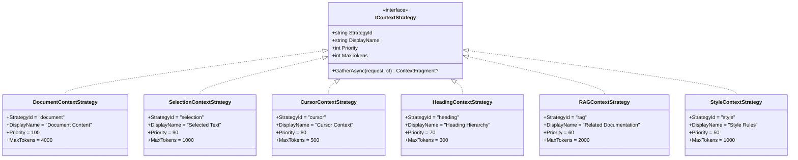

# LCS-DES-072-INDEX: Context Assembler Design Specification Index

## Document Control

| Field            | Value                                                          |
| :--------------- | :------------------------------------------------------------- |
| **Document ID**  | LCS-DES-072-INDEX                                              |
| **Version**      | v0.7.2                                                         |
| **Codename**     | The Context Assembler (Intelligent Context)                    |
| **Status**       | Draft                                                          |
| **Module**       | Lexichord.Modules.Agents                                       |
| **Created**      | 2026-01-28                                                     |
| **Related Docs** | [LCS-SBD-072](LCS-SBD-072.md), [Roadmap](../roadmap-v0.7.x.md) |

---

## 1. Overview

The **Context Assembler** (v0.7.2) delivers intelligent context gathering for AI agents. Rather than manually specifying what context each agent should receive, the Context Assembler uses a pluggable strategy architecture to automatically gather relevant information from multiple sources:

- **Document Content**: The current working document
- **Selection/Cursor**: User-focused text and surrounding context
- **Heading Hierarchy**: Document structure for navigation
- **RAG Search Results**: Semantically related documentation
- **Style Rules**: Active style guidelines for consistency

The orchestrator coordinates these strategies in parallel, manages token budgets, deduplicates overlapping content, and presents a transparent preview to users.

### 1.1 Design Philosophy

The Context Assembler follows these principles:

1. **Pluggable Architecture**: New context sources can be added without modifying core code
2. **Parallel Execution**: Strategies run concurrently for minimal latency
3. **Budget Awareness**: Token limits prevent context overflow and cost waste
4. **Transparency**: Users see exactly what context agents receive
5. **Intelligent Trimming**: Priority and relevance guide what to keep when over budget

### 1.2 Key Architecture Diagram


---

## 2. Sub-Part Design Specifications

| ID               | Title                       | Document                           | Status |
| :--------------- | :-------------------------- | :--------------------------------- | :----- |
| **LCS-DES-072a** | Context Strategy Interface  | [LCS-DES-072a.md](LCS-DES-072a.md) | Draft  |
| **LCS-DES-072b** | Built-in Context Strategies | [LCS-DES-072b.md](LCS-DES-072b.md) | Draft  |
| **LCS-DES-072c** | Context Orchestrator        | [LCS-DES-072c.md](LCS-DES-072c.md) | Draft  |
| **LCS-DES-072d** | Context Preview Panel       | [LCS-DES-072d.md](LCS-DES-072d.md) | Draft  |

### 2.1 Sub-Part Dependency Graph


---

## 3. Dependencies

### 3.1 Upstream Dependencies

| Component                   | Version | Source Module            | Usage                             |
| :-------------------------- | :------ | :----------------------- | :-------------------------------- |
| `IChatCompletionService`    | v0.6.1a | Lexichord.Abstractions   | Chat completion for token limits  |
| `IPromptRenderer`           | v0.6.3b | Lexichord.Modules.Agents | Template variable injection       |
| `IContextInjector`          | v0.6.3d | Lexichord.Modules.Agents | Base context injection (extended) |
| `IAgentRegistry`            | v0.7.1b | Lexichord.Modules.Agents | Agent strategy preferences        |
| `AgentConfiguration`        | v0.7.1a | Lexichord.Abstractions   | Per-agent context settings        |
| `ISemanticSearchService`    | v0.4.5a | Lexichord.Modules.RAG    | RAG strategy semantic search      |
| `IStyleRuleRepository`      | v0.2.1b | Lexichord.Modules.Styles | Style strategy rule access        |
| `IEditorService`            | v0.1.3a | Lexichord.Modules.Editor | Document content access           |
| `IDocumentStructureService` | v0.1.4b | Lexichord.Modules.Editor | Heading hierarchy parsing         |
| `ITokenCounter`             | v0.6.1b | Lexichord.Abstractions   | Token estimation                  |
| `IMediator`                 | v0.0.7a | MediatR                  | Event publishing                  |
| `ILicenseContext`           | v0.0.6a | Lexichord.Host           | Feature gating                    |

### 3.2 Downstream Dependents

| Component         | Version | Purpose                                   |
| :---------------- | :------ | :---------------------------------------- |
| `EditorAgent`     | v0.7.3b | Uses context for targeted editing         |
| `SimplifierAgent` | v0.7.4b | Uses context for readability improvements |
| `TuningAgent`     | v0.7.5b | Uses context with lint violations         |
| `SummarizerAgent` | v0.7.6a | Uses context for document summarization   |
| `WorkflowEngine`  | v0.7.7b | Passes context between workflow steps     |

---

## 4. New Interfaces Summary

### 4.1 Core Abstractions (v0.7.2a)

```csharp
namespace Lexichord.Abstractions.Agents.Context;

/// <summary>
/// Defines a pluggable strategy for gathering contextual information.
/// Each strategy focuses on a specific type of context (document, selection, RAG, etc.).
/// </summary>
public interface IContextStrategy
{
    /// <summary>Unique identifier for this strategy (e.g., "document", "rag").</summary>
    string StrategyId { get; }

    /// <summary>Display name for UI presentation.</summary>
    string DisplayName { get; }

    /// <summary>
    /// Execution priority. Higher values execute earlier and are retained
    /// when trimming to budget. Range: 0-100.
    /// </summary>
    int Priority { get; }

    /// <summary>Maximum tokens this strategy should contribute.</summary>
    int MaxTokens { get; }

    /// <summary>
    /// Gathers relevant context based on the request.
    /// Returns null if no context is available or applicable.
    /// </summary>
    Task<ContextFragment?> GatherAsync(
        ContextGatheringRequest request,
        CancellationToken ct);
}
```

### 4.2 Orchestration (v0.7.2c)

```csharp
namespace Lexichord.Modules.Agents.Context;

/// <summary>
/// Coordinates multiple context strategies to assemble comprehensive context
/// for an agent request, respecting token budgets and deduplicating content.
/// </summary>
public interface IContextOrchestrator
{
    /// <summary>
    /// Assembles context from all applicable strategies.
    /// Executes strategies in parallel, sorts by priority, deduplicates,
    /// and trims to fit the specified token budget.
    /// </summary>
    Task<AssembledContext> AssembleAsync(
        ContextGatheringRequest request,
        ContextBudget budget,
        CancellationToken ct);

    /// <summary>Gets all registered strategies.</summary>
    IReadOnlyList<IContextStrategy> GetStrategies();

    /// <summary>
    /// Enables or disables a strategy at runtime.
    /// Disabled strategies are skipped during assembly.
    /// </summary>
    void SetStrategyEnabled(string strategyId, bool enabled);

    /// <summary>Gets current enabled status for a strategy.</summary>
    bool IsStrategyEnabled(string strategyId);
}
```

---

## 5. Data Models Summary

### 5.1 Request & Response Models

```csharp
namespace Lexichord.Abstractions.Agents.Context;

/// <summary>
/// Encapsulates all information needed to gather context for an agent request.
/// </summary>
public record ContextGatheringRequest(
    string? DocumentPath,
    int? CursorPosition,
    string? SelectedText,
    string AgentId,
    IReadOnlyDictionary<string, object>? Hints);

/// <summary>
/// Represents a single piece of context gathered by a strategy.
/// </summary>
public record ContextFragment(
    string SourceId,
    string Label,
    string Content,
    int TokenEstimate,
    float Relevance);

/// <summary>
/// Specifies token budget and strategy filtering for context assembly.
/// </summary>
public record ContextBudget(
    int MaxTokens,
    IReadOnlyList<string>? RequiredStrategies,
    IReadOnlyList<string>? ExcludedStrategies);

/// <summary>
/// Result of context assembly, containing all retained fragments.
/// </summary>
public record AssembledContext(
    IReadOnlyList<ContextFragment> Fragments,
    int TotalTokens,
    IReadOnlyDictionary<string, object> Variables,
    TimeSpan AssemblyDuration);
```

### 5.2 Events

```csharp
namespace Lexichord.Modules.Agents.Context;

/// <summary>
/// Published when context assembly completes, enabling UI updates.
/// </summary>
public sealed record ContextAssembledEvent(
    string AgentId,
    IReadOnlyList<ContextFragment> Fragments,
    int TotalTokens,
    TimeSpan Duration) : INotification;

/// <summary>
/// Published when a strategy is enabled or disabled.
/// </summary>
public sealed record StrategyToggleEvent(
    string StrategyId,
    bool IsEnabled) : INotification;
```

---

## 6. Strategy Implementations (v0.7.2b)

| Strategy ID | Class                      | License    | Priority | Max Tokens | Description                 |
| :---------- | :------------------------- | :--------- | :------: | :--------: | :-------------------------- |
| `document`  | `DocumentContextStrategy`  | WriterPro+ |   100    |    4000    | Current document content    |
| `selection` | `SelectionContextStrategy` | WriterPro+ |    90    |    1000    | Selected text with context  |
| `cursor`    | `CursorContextStrategy`    | WriterPro+ |    80    |    500     | Text around cursor position |
| `heading`   | `HeadingContextStrategy`   | WriterPro+ |    70    |    300     | Heading hierarchy path      |
| `rag`       | `RAGContextStrategy`       | Teams+     |    60    |    2000    | Semantic search results     |
| `style`     | `StyleContextStrategy`     | Teams+     |    50    |    1000    | Active style rules          |

### 6.1 Strategy Class Diagram



---

## 7. Orchestration Flow

### 7.1 Assembly Sequence


### 7.2 Budget Trimming Algorithm

```text
ALGORITHM: TrimToBudget(fragments, maxTokens)

INPUT:
  - fragments: List<ContextFragment> sorted by (Priority DESC, Relevance DESC)
  - maxTokens: int

OUTPUT:
  - List<ContextFragment> fitting within budget

PROCESS:
  1. runningTotal = 0
  2. result = []

  3. FOR EACH fragment IN fragments:
       tokenCost = fragment.TokenEstimate

       IF runningTotal + tokenCost <= maxTokens THEN:
         result.Add(fragment)
         runningTotal += tokenCost
       ELSE:
         // Fragment doesn't fit - check if required
         IF fragment.SourceId IN requiredStrategies THEN:
           // Force include with warning
           result.Add(fragment)
           runningTotal += tokenCost
           LOG_WARNING("Required strategy exceeds budget")
         ELSE:
           LOG_INFO("Dropping {fragment.SourceId}: exceeds budget")

  4. RETURN result
```

---

## 8. Deduplication Strategy

### 8.1 Content Similarity Detection

The Context Assembler uses a hash-based approach for detecting duplicate content:

```csharp
public class ContentDeduplicator
{
    private const double SimilarityThreshold = 0.80; // 80% match = duplicate

    public IReadOnlyList<ContextFragment> Deduplicate(
        IReadOnlyList<ContextFragment> fragments)
    {
        var result = new List<ContextFragment>();
        var seen = new HashSet<int>();

        foreach (var fragment in fragments.OrderByDescending(f => f.Priority))
        {
            var contentHash = ComputeContentHash(fragment.Content);

            // Check for similar content already included
            bool isDuplicate = seen.Any(existingHash =>
                ComputeSimilarity(contentHash, existingHash) > SimilarityThreshold);

            if (!isDuplicate)
            {
                result.Add(fragment);
                seen.Add(contentHash);
            }
            else
            {
                _logger.LogDebug(
                    "Skipping duplicate content from {Strategy}",
                    fragment.SourceId);
            }
        }

        return result;
    }

    private int ComputeContentHash(string content)
    {
        // Use rolling hash for efficient comparison
        return content.GetHashCode();
    }

    private double ComputeSimilarity(int hash1, int hash2)
    {
        // Jaccard similarity of n-gram sets
        // Implementation in LCS-DES-072c
    }
}
```

### 8.2 Deduplication Rules

| Rule                         | Behavior                             |
| :--------------------------- | :----------------------------------- |
| Exact duplicate              | Keep higher priority fragment only   |
| >80% similarity              | Keep higher priority fragment only   |
| Subset content               | Keep superset fragment               |
| Different sources, same text | Merge metadata, keep single fragment |

---

## 9. UI Component Summary (v0.7.2d)

### 9.1 Context Preview Panel

```text
┌──────────────────────────────────────────────────────────────────────────┐
│  Context Preview                                      ↻ Refresh  ⚙ Settings│
├──────────────────────────────────────────────────────────────────────────┤
│  Budget: 8000 tokens | Used: 5,234 tokens (65%)                          │
│  ━━━━━━━━━━━━━━━━━━━━━━━━━━━━━━━━━━━━━━━░░░░░░░░░░░░░░░░░░░░              │
├──────────────────────────────────────────────────────────────────────────┤
│  ▼ [✓] Document Content                                    2,150 tokens  │
│    ┌─────────────────────────────────────────────────────────────────┐   │
│    │ # Chapter 3: Integration Patterns                               │   │
│    │                                                                 │   │
│    │ This chapter covers the key patterns used for integrating...    │   │
│    └─────────────────────────────────────────────────────────────────┘   │
├──────────────────────────────────────────────────────────────────────────┤
│  ▼ [✓] Selected Text                                         450 tokens  │
│    ┌─────────────────────────────────────────────────────────────────┐   │
│    │ "The dependency injection container should be configured..."     │   │
│    └─────────────────────────────────────────────────────────────────┘   │
├──────────────────────────────────────────────────────────────────────────┤
│  ▶ [✓] Related Documentation                               1,800 tokens  │
├──────────────────────────────────────────────────────────────────────────┤
│  ▶ [✓] Style Rules                                           834 tokens  │
├──────────────────────────────────────────────────────────────────────────┤
│  ▶ [ ] Heading Hierarchy (disabled)                                 —    │
└──────────────────────────────────────────────────────────────────────────┘
```

### 9.2 ViewModel Structure

```csharp
namespace Lexichord.App.ViewModels.Agents;

public partial class ContextPreviewViewModel : ViewModelBase
{
    [ObservableProperty]
    private ObservableCollection<ContextFragmentViewModel> _fragments = [];

    [ObservableProperty]
    private int _totalTokens;

    [ObservableProperty]
    private int _budgetTokens = 8000;

    [ObservableProperty]
    private double _usagePercentage;

    [ObservableProperty]
    private bool _isRefreshing;

    public ICommand RefreshCommand { get; }
    public ICommand ToggleStrategyCommand { get; }

    // Reacts to ContextAssembledEvent
    public async Task HandleContextAssembledAsync(ContextAssembledEvent @event)
    {
        Fragments.Clear();
        foreach (var fragment in @event.Fragments)
        {
            Fragments.Add(new ContextFragmentViewModel(fragment));
        }
        TotalTokens = @event.TotalTokens;
        UsagePercentage = (double)TotalTokens / BudgetTokens * 100;
    }
}
```

---

## 10. Configuration

### 10.1 Context Settings

```json
{
    "Context": {
        "DefaultBudget": 8000,
        "StrategyTimeout": 5000,
        "DeduplicationThreshold": 0.8,
        "Strategies": {
            "document": {
                "Enabled": true,
                "MaxTokens": 4000
            },
            "selection": {
                "Enabled": true,
                "MaxTokens": 1000
            },
            "cursor": {
                "Enabled": true,
                "MaxTokens": 500,
                "WindowSize": 200
            },
            "heading": {
                "Enabled": true,
                "MaxTokens": 300
            },
            "rag": {
                "Enabled": true,
                "MaxTokens": 2000,
                "TopK": 3
            },
            "style": {
                "Enabled": true,
                "MaxTokens": 1000
            }
        }
    }
}
```

### 10.2 Per-Agent Strategy Overrides

```json
{
    "Agents": {
        "editor": {
            "ContextStrategies": ["document", "selection", "style"],
            "ExcludeStrategies": ["rag"]
        },
        "simplifier": {
            "ContextStrategies": ["document", "selection"],
            "RequireStrategies": ["selection"]
        },
        "tuning": {
            "ContextStrategies": ["document", "style"],
            "RequireStrategies": ["style"]
        }
    }
}
```

---

## 11. DI Registration

```csharp
// In AgentsModule.cs

public static IServiceCollection AddContextAssembler(
    this IServiceCollection services,
    IConfiguration configuration)
{
    // Core orchestrator
    services.AddSingleton<IContextOrchestrator, ContextOrchestrator>();

    // Core strategies (WriterPro+)
    services.AddSingleton<IContextStrategy, DocumentContextStrategy>();
    services.AddSingleton<IContextStrategy, SelectionContextStrategy>();
    services.AddSingleton<IContextStrategy, CursorContextStrategy>();
    services.AddSingleton<IContextStrategy, HeadingContextStrategy>();

    // Premium strategies (Teams+)
    services.AddSingleton<IContextStrategy, RAGContextStrategy>();
    services.AddSingleton<IContextStrategy, StyleContextStrategy>();

    // Configuration
    services.Configure<ContextOptions>(
        configuration.GetSection("Context"));

    // Strategy registry for runtime management
    services.AddSingleton<IContextStrategyRegistry, ContextStrategyRegistry>();

    return services;
}
```

---

## 12. Testing Strategy

### 12.1 Test Categories

| Category          | Scope                                 | Count |
| :---------------- | :------------------------------------ | :---: |
| Unit Tests        | Individual strategy logic             |  ~35  |
| Integration Tests | Orchestrator with multiple strategies |  ~12  |
| Performance Tests | Parallel execution timing             |  ~5   |
| UI Tests          | ViewModel reactive behavior           |  ~10  |
| **Total**         |                                       |  ~62  |

### 12.2 Critical Test Cases

```csharp
[Trait("Category", "Unit")]
[Trait("Version", "v0.7.2c")]
public class ContextOrchestratorTests
{
    [Fact]
    public async Task AssembleAsync_ExecutesEnabledStrategiesInParallel()
    {
        // Verify all enabled strategies run concurrently
    }

    [Fact]
    public async Task AssembleAsync_RespectsTokenBudget()
    {
        // Verify total tokens never exceed budget
    }

    [Fact]
    public async Task AssembleAsync_SortsByPriorityDescending()
    {
        // Verify high-priority strategies kept when trimming
    }

    [Fact]
    public async Task AssembleAsync_DeduplicatesOverlappingContent()
    {
        // Verify >80% similar content is deduplicated
    }

    [Fact]
    public async Task AssembleAsync_RespectsExcludedStrategies()
    {
        // Verify excluded strategies are not executed
    }

    [Fact]
    public async Task AssembleAsync_IncludesRequiredStrategiesEvenIfOverBudget()
    {
        // Verify required strategies with warning on budget overflow
    }
}
```

---

## 13. Performance Targets

| Metric                      | Target         | Measurement         |
| :-------------------------- | :------------- | :------------------ |
| Context assembly (5 strats) | < 200ms        | Stopwatch           |
| Single strategy execution   | < 50ms         | Per-strategy timing |
| Deduplication overhead      | < 10ms         | Profiler            |
| Token estimation accuracy   | ±5%            | LLM verification    |
| UI update latency           | < 16ms (60fps) | Frame timing        |
| Memory per assembly         | < 2MB          | Memory profiler     |

---

## 14. Observability

### 14.1 Logging Matrix

| Level   | Source              | Message Template                                                                |
| :------ | :------------------ | :------------------------------------------------------------------------------ |
| Debug   | ContextOrchestrator | `Starting context assembly for agent {AgentId}`                                 |
| Debug   | ContextOrchestrator | `Executing {Count} strategies in parallel`                                      |
| Info    | ContextOrchestrator | `Context assembled: {FragmentCount} fragments, {Tokens} tokens in {Duration}ms` |
| Warning | ContextOrchestrator | `Strategy {StrategyId} timed out after {Timeout}ms`                             |
| Warning | BudgetTrimmer       | `Required strategy {StrategyId} exceeds budget by {Excess} tokens`              |
| Debug   | Strategy            | `{StrategyId} gathering context for {DocumentPath}`                             |
| Info    | Strategy            | `{StrategyId} returned {Tokens} tokens (relevance: {Relevance})`                |
| Warning | Strategy            | `{StrategyId} content truncated from {Original} to {Truncated} tokens`          |
| Debug   | Deduplicator        | `Removed {Count} duplicate fragments`                                           |
| Debug   | ContextPreviewVM    | `Refreshing context preview`                                                    |

### 14.2 Metrics

```csharp
// OpenTelemetry metrics
var assemblyDuration = _meter.CreateHistogram<double>(
    "context.assembly.duration.ms",
    "Context assembly duration in milliseconds");

var fragmentCount = _meter.CreateHistogram<int>(
    "context.assembly.fragment.count",
    "Number of fragments in assembled context");

var tokenUsage = _meter.CreateHistogram<int>(
    "context.assembly.token.count",
    "Total tokens in assembled context");
```

---

## 15. Security Considerations

| Consideration                 | Mitigation                            |
| :---------------------------- | :------------------------------------ |
| Sensitive content in context  | Respect document access controls      |
| Strategy plugin injection     | Only built-in strategies in v0.7.2    |
| Token budget manipulation     | Server-side budget enforcement        |
| Context preview data exposure | Same access rules as source documents |

---

## 16. Acceptance Criteria Summary

| #   | Category          | Criterion                                                  |
| :-- | :---------------- | :--------------------------------------------------------- |
| 1   | **Assembly**      | Context assembles in < 200ms for 5 strategies              |
| 2   | **Parallel**      | Strategies execute concurrently (verified by timing)       |
| 3   | **Budget**        | Total tokens never exceed MaxTokens                        |
| 4   | **Priority**      | Higher priority fragments retained when trimming           |
| 5   | **Deduplication** | Identical content not duplicated in output                 |
| 6   | **UI Preview**    | All fragments visible with correct token counts            |
| 7   | **Toggle**        | Disabling strategy removes its fragment from context       |
| 8   | **Refresh**       | Manual refresh replaces all fragments                      |
| 9   | **License**       | Teams-only strategies hidden for WriterPro users           |
| 10  | **Events**        | `ContextAssembledEvent` published after assembly           |
| 11  | **Required**      | Required strategies included with warning when over budget |
| 12  | **Timeout**       | Slow strategies don't block assembly completion            |

---

## 17. Related Documents

| Document                                            | Purpose                                  |
| :-------------------------------------------------- | :--------------------------------------- |
| [LCS-SBD-072](LCS-SBD-072.md)                       | Scope Breakdown Document                 |
| [LCS-DES-072a](LCS-DES-072a.md)                     | Context Strategy Interface specification |
| [LCS-DES-072b](LCS-DES-072b.md)                     | Built-in Strategies specification        |
| [LCS-DES-072c](LCS-DES-072c.md)                     | Context Orchestrator specification       |
| [LCS-DES-072d](LCS-DES-072d.md)                     | Context Preview Panel specification      |
| [Roadmap v0.7.x](../roadmap-v0.7.x.md)              | Feature roadmap                          |
| [LCS-DES-071-INDEX](../v0.7.1/LCS-DES-071-INDEX.md) | Agent Registry (prerequisite)            |

---

## 18. Changelog

| Version | Date       | Changes       |
| :------ | :--------- | :------------ |
| 0.1     | 2026-01-28 | Initial draft |

---
