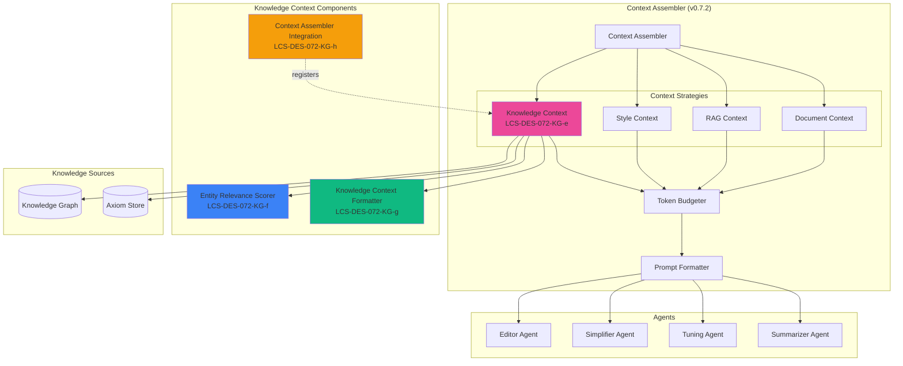

# LCS-DES-072-KG-INDEX: Graph Context Strategy — Design Specifications Index

## Document Control

| Field | Value |
| :--- | :--- |
| **Index ID** | LCS-DES-072-KG-INDEX |
| **System Breakdown** | LCS-SBD-072-KG |
| **Version** | v0.7.2 |
| **Codename** | Graph Context Strategy (CKVS Phase 4a) |
| **Status** | In Progress |
| **Last Updated** | 2026-02-14 |

---

## 1. Overview

This index catalogs all design specifications for the **Graph Context Strategy** component of CKVS Phase 4a. This strategy generalizes knowledge graph access into a reusable context source that all specialist agents can consume through the Context Assembler.

---

## 2. Sub-Part Specifications

| Spec ID | Title | Est. Hours | Description |
| :------ | :---- | :--------- | :---------- |
| [LCS-DES-072-KG-e](LCS-DES-072-KG-e.md) | Knowledge Context Strategy | 5 | Implements IContextStrategy for graph data ✅ |
| [LCS-DES-072-KG-f](LCS-DES-072-KG-f.md) | Entity Relevance Scorer | 4 | Ranks entities by query similarity ✅ |
| [LCS-DES-072-KG-g](LCS-DES-072-KG-g.md) | Knowledge Context Formatter | 3 | Serializes for prompt injection ✅ |
| [LCS-DES-072-KG-h](LCS-DES-072-KG-h.md) | Context Assembler Integration | 2 | Registers strategy with assembler |
| **Total** | | **14** | |

---

## 3. Architecture Diagram



---

## 4. Key Interfaces

### 4.1 IKnowledgeContextStrategy

```csharp
public interface IKnowledgeContextStrategy : IContextStrategy
{
    Task<ContextFragment> GetContextAsync(
        ContextRequest request,
        CancellationToken ct = default);

    Task<KnowledgeContextFragment> GetKnowledgeContextAsync(
        ContextRequest request,
        KnowledgeContextConfig config,
        CancellationToken ct = default);

    KnowledgeContextConfig GetConfigForAgent(AgentType agentType);
}
```

### 4.2 IEntityRelevanceScorer

```csharp
public interface IEntityRelevanceScorer
{
    Task<IReadOnlyList<ScoredEntity>> ScoreEntitiesAsync(
        ContextRequest request,
        IReadOnlyList<KnowledgeEntity> entities,
        CancellationToken ct = default);
}
```

### 4.3 IKnowledgeContextFormatter

```csharp
public interface IKnowledgeContextFormatter
{
    FormattedContext Format(
        IReadOnlyList<KnowledgeEntity> entities,
        IReadOnlyList<KnowledgeRelationship> relationships,
        IReadOnlyList<Axiom> axioms,
        KnowledgeContextConfig config);

    FormattedContext TruncateToTokenBudget(
        FormattedContext context,
        int maxTokens);
}
```

---

## 5. Agent-Specific Configurations

| Agent | Entity Types | Max Entities | Include Axioms | Max Tokens |
| :---- | :----------- | :----------- | :------------- | :--------- |
| Editor | All | 30 | Yes | 5000 |
| Simplifier | Concept, Term | 10 | No | 2000 |
| Tuning | Endpoint, Parameter | 20 | Yes | 4000 |
| Summarizer | Product, Component | 15 | No | 3000 |
| Copilot | All | 25 | Yes | 4000 |

---

## 6. Relevance Scoring Algorithm

```
FINAL_SCORE =
    0.35 × SEMANTIC_SIMILARITY +
    0.25 × DOCUMENT_MENTION +
    0.20 × TYPE_MATCH +
    0.10 × RECENCY +
    0.10 × NAME_MATCH

Where:
- SEMANTIC_SIMILARITY = cosine(embed(query), embed(entity))
- DOCUMENT_MENTION = min(mention_count / 5, 1)
- TYPE_MATCH = 1.0 if preferred type else 0.3
- RECENCY = max(0, 1 - days_old / 365)
- NAME_MATCH = term_matches / query_terms
```

---

## 7. Context Formats

| Format | Use Case | Example |
| :----- | :------- | :------ |
| YAML | Default for prompts | Clean, readable |
| Markdown | Documentation agents | Structured headers |
| JSON | API-focused agents | Programmatic |
| Plain | Fallback | Simple text |

---

## 8. Performance Targets

| Metric | Target | Measurement |
| :----- | :----- | :---------- |
| Context retrieval | <200ms | P95 timing |
| Relevance scoring | <50ms | P95 timing |
| Token counting | <10ms | P95 timing |
| Total strategy time | <300ms | P95 timing |

---

## 9. Dependencies

| Component | From | Description |
| :-------- | :--- | :---------- |
| `IContextAssembler` | v0.7.2 | Strategy registration |
| `IGraphRepository` | v0.4.5e | Entity queries |
| `IAxiomStore` | v0.4.6-KG | Axiom retrieval |
| `ISemanticSearchService` | v0.4.5 | Relevance scoring |
| `ITokenCounter` | v0.4.4c | Token budgeting |

---

## 10. License Gating Summary

| Component | Core | WriterPro | Teams | Enterprise |
| :-------- | :--- | :-------- | :---- | :--------- |
| Knowledge Context Strategy | ❌ | Basic | Full | Full |
| Entity Relevance Scorer | ❌ | ✅ | ✅ | ✅ |
| Context Formatter | ❌ | ✅ | ✅ | ✅ |
| Agent-specific Configs | ❌ | ❌ | ✅ | Custom |

---

## 11. What This Enables

- **All Specialist Agents:** Knowledge-aware by default
- **v0.7.5 Unified Validation:** Context includes validation hints
- **Custom Agents:** Future agents get knowledge context automatically
- **Consistent API:** Standard interface for knowledge retrieval

---

## 12. Changelog

| Version | Date | Author | Changes |
| :------ | :--- | :----- | :------ |
| 1.0 | 2026-01-31 | Lead Architect | Initial creation |
| 1.1 | 2026-02-14 | Lead Architect | Marked v0.7.2e as complete |
| 1.2 | 2026-02-14 | Lead Architect | Marked v0.7.2f as complete |
| 1.3 | 2026-02-14 | Lead Architect | Marked v0.7.2g as complete |

---
