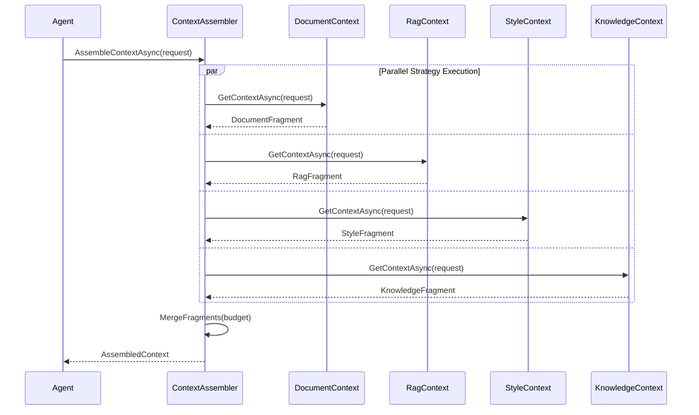

# LCS-DES-072-KG-h: Context Assembler Integration

## Document Control

| Field | Value |
| :--- | :--- |
| **Spec ID** | LCS-DES-072-KG-h |
| **System Breakdown** | LCS-SBD-072-KG |
| **Version** | v0.7.2 |
| **Codename** | Context Assembler Integration (CKVS Phase 4a) |
| **Estimated Hours** | 2 |
| **Status** | Complete |
| **Last Updated** | 2026-02-14 |

---

## 1. Overview

### 1.1 Purpose

The **Context Assembler Integration** registers the Knowledge Context Strategy with the existing Context Assembler, enabling all specialist agents to receive knowledge graph context automatically.

### 1.2 Key Responsibilities

- Register KnowledgeContextStrategy with Context Assembler
- Configure strategy priority
- Wire up dependencies
- Provide configuration extension methods

### 1.3 Module Location

```
src/
  Lexichord.KnowledgeGraph/
    Context/
      Integration/
        ContextAssemblerExtensions.cs
        KnowledgeContextRegistration.cs
```

---

## 2. Implementation

### 2.1 Service Registration Extensions

```csharp
namespace Lexichord.KnowledgeGraph.Context.Integration;

/// <summary>
/// Extension methods for registering knowledge context with Context Assembler.
/// </summary>
public static class ContextAssemblerExtensions
{
    /// <summary>
    /// Adds knowledge context strategy to the context assembler.
    /// </summary>
    public static IServiceCollection AddKnowledgeContextStrategy(
        this IServiceCollection services,
        Action<KnowledgeContextOptions>? configure = null)
    {
        // Configure options
        var options = new KnowledgeContextOptions();
        configure?.Invoke(options);
        services.AddSingleton(Options.Create(options));

        // Register scoring configuration
        services.Configure<ScoringConfig>(config =>
        {
            config.SemanticWeight = options.ScoringWeights.Semantic;
            config.MentionWeight = options.ScoringWeights.Mention;
            config.TypeWeight = options.ScoringWeights.Type;
            config.RecencyWeight = options.ScoringWeights.Recency;
            config.NameMatchWeight = options.ScoringWeights.NameMatch;
        });

        // Register components
        services.AddSingleton<ITokenEstimator, SimpleTokenEstimator>();
        services.AddSingleton<IKnowledgeContextFormatter, KnowledgeContextFormatter>();
        services.AddSingleton<IEntityRelevanceScorer, EntityRelevanceScorer>();
        services.AddSingleton<IKnowledgeContextStrategy, KnowledgeContextStrategy>();

        // Register as IContextStrategy for discovery
        services.AddSingleton<IContextStrategy>(sp =>
            sp.GetRequiredService<IKnowledgeContextStrategy>());

        return services;
    }

    /// <summary>
    /// Configures the context assembler to use knowledge context.
    /// </summary>
    public static IContextAssemblerBuilder UseKnowledgeContext(
        this IContextAssemblerBuilder builder,
        Action<KnowledgeContextOptions>? configure = null)
    {
        builder.Services.AddKnowledgeContextStrategy(configure);

        // Register strategy with assembler
        builder.AddStrategy<IKnowledgeContextStrategy>(priority: 30);

        return builder;
    }
}
```

### 2.2 Knowledge Context Options

```csharp
/// <summary>
/// Options for knowledge context integration.
/// </summary>
public class KnowledgeContextOptions
{
    /// <summary>
    /// Whether knowledge context is enabled.
    /// </summary>
    public bool Enabled { get; set; } = true;

    /// <summary>
    /// Default max tokens for knowledge context.
    /// </summary>
    public int DefaultMaxTokens { get; set; } = 4000;

    /// <summary>
    /// Default max entities.
    /// </summary>
    public int DefaultMaxEntities { get; set; } = 20;

    /// <summary>
    /// Default minimum relevance score.
    /// </summary>
    public float DefaultMinRelevanceScore { get; set; } = 0.5f;

    /// <summary>
    /// Scoring weights configuration.
    /// </summary>
    public ScoringWeights ScoringWeights { get; set; } = new();

    /// <summary>
    /// Agent-specific configuration overrides.
    /// </summary>
    public Dictionary<AgentType, KnowledgeContextConfig> AgentConfigs { get; set; } = new();
}

/// <summary>
/// Scoring weight configuration.
/// </summary>
public class ScoringWeights
{
    public float Semantic { get; set; } = 0.35f;
    public float Mention { get; set; } = 0.25f;
    public float Type { get; set; } = 0.20f;
    public float Recency { get; set; } = 0.10f;
    public float NameMatch { get; set; } = 0.10f;
}
```

### 2.3 Context Assembler Builder Interface

```csharp
/// <summary>
/// Builder interface for Context Assembler (from v0.7.2).
/// </summary>
public interface IContextAssemblerBuilder
{
    /// <summary>Service collection.</summary>
    IServiceCollection Services { get; }

    /// <summary>Adds a context strategy.</summary>
    IContextAssemblerBuilder AddStrategy<TStrategy>(int priority = 0)
        where TStrategy : class, IContextStrategy;

    /// <summary>Configures strategy options.</summary>
    IContextAssemblerBuilder Configure(Action<ContextAssemblerOptions> configure);
}
```

### 2.4 Registration Example

```csharp
/// <summary>
/// Example of registering knowledge context in Startup.
/// </summary>
public static class Startup
{
    public static void ConfigureServices(IServiceCollection services)
    {
        // Register CKVS dependencies first
        services.AddKnowledgeGraph();
        services.AddAxiomStore();

        // Configure context assembler with knowledge context
        services.AddContextAssembler(assembler =>
        {
            // Standard context strategies
            assembler.UseDocumentContext();
            assembler.UseRagContext();
            assembler.UseStyleContext();

            // Add knowledge context strategy
            assembler.UseKnowledgeContext(options =>
            {
                options.DefaultMaxTokens = 4000;
                options.DefaultMinRelevanceScore = 0.5f;

                // Custom scoring weights
                options.ScoringWeights.Semantic = 0.4f;
                options.ScoringWeights.Mention = 0.3f;

                // Agent-specific overrides
                options.AgentConfigs[AgentType.Editor] = new KnowledgeContextConfig
                {
                    MaxEntities = 30,
                    MaxTokens = 5000,
                    IncludeAxioms = true
                };

                options.AgentConfigs[AgentType.Simplifier] = new KnowledgeContextConfig
                {
                    MaxEntities = 10,
                    MaxTokens = 2000,
                    IncludeEntityTypes = ["Concept", "Term"],
                    IncludeAxioms = false
                };
            });
        });
    }
}
```

### 2.5 Context Assembler Flow

```csharp
/// <summary>
/// Example showing how Context Assembler uses strategies.
/// </summary>
public class ContextAssemblerUsageExample
{
    private readonly IContextAssembler _assembler;

    public async Task<AgentContext> GetContextForAgentAsync(
        AgentType agentType,
        string query,
        Document? document)
    {
        var request = new ContextRequest
        {
            AgentType = agentType,
            Query = query,
            Document = document,
            TokenBudget = 8000
        };

        // Assembler calls all registered strategies
        // including KnowledgeContextStrategy
        var context = await _assembler.AssembleContextAsync(request);

        // Context now includes:
        // - Document context (from DocumentContextStrategy)
        // - RAG context (from RagContextStrategy)
        // - Style context (from StyleContextStrategy)
        // - Knowledge context (from KnowledgeContextStrategy) <- NEW

        return context;
    }
}
```

---

## 3. Context Assembly Flow



---

## 4. Error Handling

| Error | Handling Strategy |
| :---- | :---------------- |
| Strategy registration fails | Log error, skip strategy |
| Knowledge context unavailable | Return empty fragment |
| Budget exceeded | Truncate knowledge context last |

---

## 5. Testing Requirements

| Test Case | Description |
| :-------- | :---------- |
| `AddKnowledgeContextStrategy_Registers` | Services registered |
| `UseKnowledgeContext_ConfiguresAssembler` | Builder configures correctly |
| `ContextAssembler_IncludesKnowledge` | Knowledge in final context |
| `AgentConfigs_Applied` | Agent-specific configs work |

---

## 6. License Gating

| Tier | Access |
| :--- | :----- |
| Core | Not available |
| WriterPro | Basic integration |
| Teams | Full integration |
| Enterprise | Custom configs per agent |

---

## 7. Changelog

| Version | Date | Author | Changes |
| :------ | :--- | :----- | :------ |
| 1.0 | 2026-01-31 | Lead Architect | Initial creation |
| 1.1 | 2026-02-14 | Lead Architect | Status → Complete; adapted to codebase patterns (no builder, used existing factory/DI registration) |
