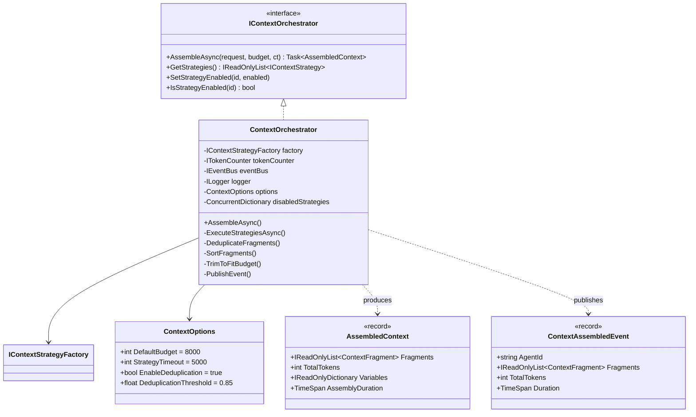
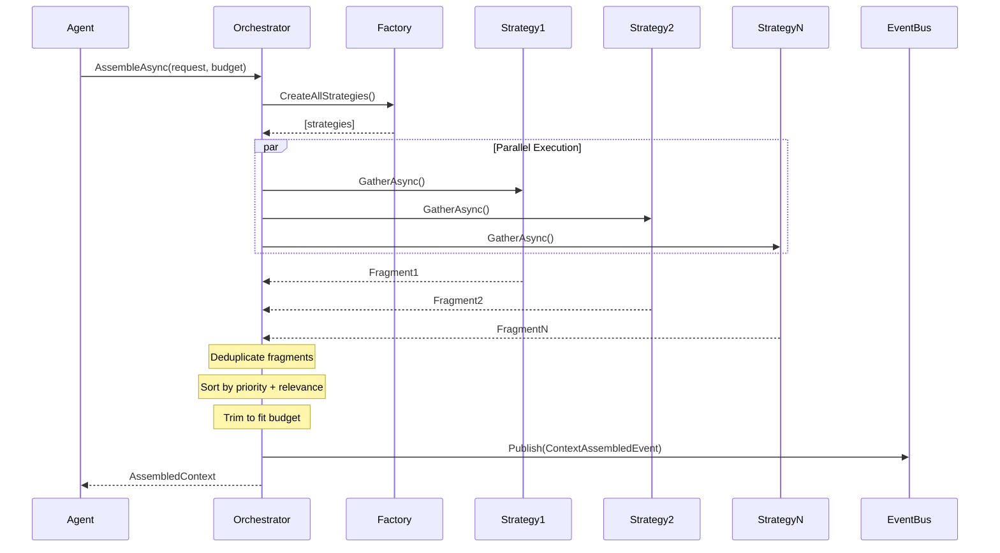
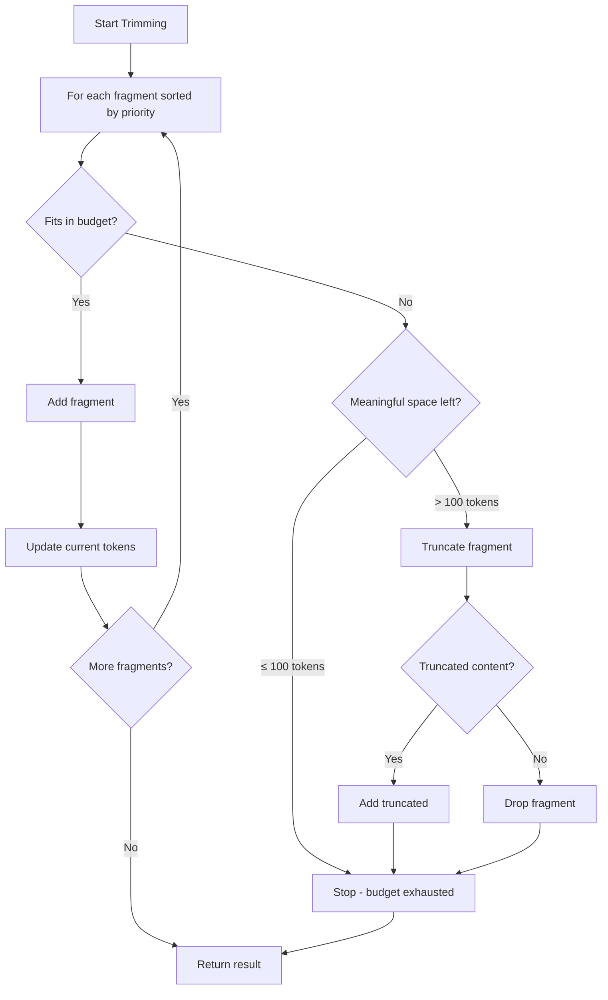

# LCS-DES-072c: Context Orchestrator

## 1. Metadata & Categorization

| Field              | Value                    |
| :----------------- | :----------------------- |
| **Document ID**    | LCS-DES-072c             |
| **Feature ID**     | AGT-072c                 |
| **Feature Name**   | Context Orchestrator     |
| **Target Version** | v0.7.2c                  |
| **Module Scope**   | Lexichord.Modules.Agents |
| **Swimlane**       | Agents                   |
| **License Tier**   | WriterPro+               |
| **Status**         | Draft                    |
| **Last Updated**   | 2026-01-28               |

---

## 2. Executive Summary

### 2.1 The Requirement

Multiple context strategies must be coordinated to gather comprehensive context for AI agents. This coordination requires:

- Parallel execution for performance
- Token budget enforcement to avoid exceeding model limits
- Content deduplication to prevent redundant information
- Priority-based sorting for intelligent trimming
- Timeout handling for slow strategies

### 2.2 The Proposed Solution

Implement an `IContextOrchestrator` that:

1. Executes all enabled strategies in parallel with configurable timeout
2. Collects and deduplicates resulting `ContextFragment`s
3. Sorts fragments by priority and relevance
4. Trims content to fit the token budget
5. Publishes a `ContextAssembledEvent` for observability

---

## 3. Architecture & Modular Strategy

### 3.1 Dependencies

**Upstream Modules:**

| Component                 | Version | Purpose                           |
| :------------------------ | :------ | :-------------------------------- |
| `IContextStrategy`        | v0.7.2a | Strategy interface                |
| `ContextBudget`           | v0.7.2a | Budget constraints                |
| `ContextFragment`         | v0.7.2a | Fragment data structure           |
| `IContextStrategyFactory` | v0.7.2a | Strategy instantiation            |
| Built-in strategies       | v0.7.2b | Concrete strategy implementations |
| `ITokenCounter`           | v0.6.1b | Token counting                    |
| `IEventBus`               | v0.1.5a | Event publishing                  |

**Downstream Consumers:**

| Component             | Version | Purpose                    |
| :-------------------- | :------ | :------------------------- |
| `EditorAgent`         | v0.7.3b | Consumes assembled context |
| `SimplifierAgent`     | v0.7.4b | Consumes assembled context |
| `TuningAgent`         | v0.7.5b | Consumes assembled context |
| Context Preview Panel | v0.7.2d | Displays assembled context |

### 3.2 Component Architecture



### 3.3 Orchestration Flow



---

## 4. Data Contract (The API)

### 4.1 Orchestrator Interface

```csharp
namespace Lexichord.Abstractions.Agents.Context;

/// <summary>
/// Coordinates multiple context strategies to assemble comprehensive
/// context for AI agent requests.
///
/// The orchestrator handles:
/// - Parallel strategy execution with timeout
/// - Token budget enforcement
/// - Content deduplication
/// - Priority-based sorting and trimming
/// </summary>
/// <remarks>
/// <para>
/// <strong>Usage:</strong>
/// </para>
/// <code>
/// var request = new ContextGatheringRequest(doc, cursor, selection, agentId, null);
/// var budget = new ContextBudget(8000, null, null);
/// var assembled = await orchestrator.AssembleAsync(request, budget, ct);
///
/// foreach (var fragment in assembled.Fragments)
/// {
///     Console.WriteLine($"{fragment.Label}: {fragment.TokenEstimate} tokens");
/// }
/// </code>
/// </remarks>
public interface IContextOrchestrator
{
    /// <summary>
    /// Assembles context by executing all enabled strategies and combining results.
    /// </summary>
    /// <param name="request">Context gathering parameters.</param>
    /// <param name="budget">Token and strategy constraints.</param>
    /// <param name="ct">Cancellation token.</param>
    /// <returns>Assembled context with all fragments and metadata.</returns>
    /// <exception cref="OperationCanceledException">
    /// Thrown if the operation is cancelled.
    /// </exception>
    Task<AssembledContext> AssembleAsync(
        ContextGatheringRequest request,
        ContextBudget budget,
        CancellationToken ct);

    /// <summary>
    /// Gets all registered context strategies.
    /// </summary>
    /// <returns>List of all available strategies.</returns>
    IReadOnlyList<IContextStrategy> GetStrategies();

    /// <summary>
    /// Enables or disables a strategy for future assemblies.
    /// </summary>
    /// <param name="strategyId">ID of strategy to toggle.</param>
    /// <param name="enabled">Whether strategy should be enabled.</param>
    void SetStrategyEnabled(string strategyId, bool enabled);

    /// <summary>
    /// Checks if a strategy is currently enabled.
    /// </summary>
    /// <param name="strategyId">ID of strategy to check.</param>
    /// <returns>True if strategy is enabled.</returns>
    bool IsStrategyEnabled(string strategyId);
}
```

### 4.2 Assembled Context

```csharp
namespace Lexichord.Abstractions.Agents.Context;

/// <summary>
/// The result of context assembly, containing all gathered fragments
/// with metadata about the assembly process.
/// </summary>
/// <param name="Fragments">
/// Context fragments sorted by priority (highest first).
/// Already trimmed to fit within the requested budget.
/// </param>
/// <param name="TotalTokens">
/// Total token count across all included fragments.
/// Guaranteed to be less than or equal to budget.MaxTokens.
/// </param>
/// <param name="Variables">
/// Extracted variables for template substitution.
/// Includes document name, current heading, etc.
/// </param>
/// <param name="AssemblyDuration">
/// Time taken to gather and assemble all context.
/// Useful for performance monitoring.
/// </param>
/// <example>
/// <code>
/// var assembled = await orchestrator.AssembleAsync(request, budget, ct);
///
/// // Build context string for prompt
/// var context = string.Join("\n\n",
///     assembled.Fragments.Select(f => $"## {f.Label}\n{f.Content}"));
///
/// // Log performance
/// logger.LogInformation(
///     "Assembled {Tokens} tokens in {Duration}ms",
///     assembled.TotalTokens,
///     assembled.AssemblyDuration.TotalMilliseconds);
/// </code>
/// </example>
public record AssembledContext(
    IReadOnlyList<ContextFragment> Fragments,
    int TotalTokens,
    IReadOnlyDictionary<string, object> Variables,
    TimeSpan AssemblyDuration)
{
    /// <summary>
    /// Creates an empty context result.
    /// </summary>
    public static AssembledContext Empty => new(
        Array.Empty<ContextFragment>(),
        0,
        new Dictionary<string, object>(),
        TimeSpan.Zero);

    /// <summary>
    /// Whether any context was gathered.
    /// </summary>
    public bool HasContext => Fragments.Count > 0;

    /// <summary>
    /// Gets the combined content of all fragments.
    /// </summary>
    /// <param name="separator">Separator between fragments.</param>
    /// <returns>Combined content string.</returns>
    public string GetCombinedContent(string separator = "\n\n")
    {
        return string.Join(separator,
            Fragments.Select(f => $"## {f.Label}\n{f.Content}"));
    }

    /// <summary>
    /// Gets fragment by source ID if present.
    /// </summary>
    public ContextFragment? GetFragment(string sourceId)
        => Fragments.FirstOrDefault(f => f.SourceId == sourceId);

    /// <summary>
    /// Checks if a specific strategy contributed context.
    /// </summary>
    public bool HasFragmentFrom(string sourceId)
        => Fragments.Any(f => f.SourceId == sourceId);
}
```

### 4.3 Context Options

```csharp
namespace Lexichord.Modules.Agents.Context;

/// <summary>
/// Configuration options for context assembly.
/// Loaded from configuration section "Context".
/// </summary>
/// <example>
/// Configuration in appsettings.json:
/// <code>
/// {
///   "Context": {
///     "DefaultBudget": 8000,
///     "StrategyTimeout": 5000,
///     "EnableDeduplication": true,
///     "DeduplicationThreshold": 0.85
///   }
/// }
/// </code>
/// </example>
public sealed class ContextOptions
{
    /// <summary>
    /// Configuration section name.
    /// </summary>
    public const string Section = "Context";

    /// <summary>
    /// Default token budget when none specified.
    /// </summary>
    public int DefaultBudget { get; set; } = 8000;

    /// <summary>
    /// Timeout in milliseconds for individual strategy execution.
    /// Strategies exceeding this timeout are cancelled.
    /// </summary>
    public int StrategyTimeout { get; set; } = 5000;

    /// <summary>
    /// Whether to deduplicate similar content across fragments.
    /// </summary>
    public bool EnableDeduplication { get; set; } = true;

    /// <summary>
    /// Similarity threshold for considering content duplicated.
    /// Range 0.0-1.0, where 1.0 means exact match required.
    /// </summary>
    public float DeduplicationThreshold { get; set; } = 0.85f;

    /// <summary>
    /// Maximum number of strategies to execute in parallel.
    /// </summary>
    public int MaxParallelism { get; set; } = 6;
}
```

### 4.4 Context Assembled Event

```csharp
namespace Lexichord.Modules.Agents.Context;

/// <summary>
/// Event published after context assembly completes.
/// Used by the Context Preview panel and telemetry.
/// </summary>
/// <param name="AgentId">ID of the agent that requested context.</param>
/// <param name="Fragments">All fragments included in the result.</param>
/// <param name="TotalTokens">Total tokens in assembled context.</param>
/// <param name="Duration">Time taken for assembly.</param>
public sealed record ContextAssembledEvent(
    string AgentId,
    IReadOnlyList<ContextFragment> Fragments,
    int TotalTokens,
    TimeSpan Duration) : INotification;
```

---

## 5. Implementation Logic

### 5.1 Orchestrator Implementation

```csharp
namespace Lexichord.Modules.Agents.Context;

/// <summary>
/// Default implementation of <see cref="IContextOrchestrator"/>.
/// Coordinates strategy execution, deduplication, and budget management.
/// </summary>
public sealed class ContextOrchestrator : IContextOrchestrator
{
    private readonly IContextStrategyFactory _factory;
    private readonly ITokenCounter _tokenCounter;
    private readonly IEventBus _eventBus;
    private readonly ContextOptions _options;
    private readonly ILogger<ContextOrchestrator> _logger;

    private readonly ConcurrentDictionary<string, bool> _strategyEnabled = new();

    public ContextOrchestrator(
        IContextStrategyFactory factory,
        ITokenCounter tokenCounter,
        IEventBus eventBus,
        IOptions<ContextOptions> options,
        ILogger<ContextOrchestrator> logger)
    {
        _factory = factory;
        _tokenCounter = tokenCounter;
        _eventBus = eventBus;
        _options = options.Value;
        _logger = logger;
    }

    /// <inheritdoc />
    public async Task<AssembledContext> AssembleAsync(
        ContextGatheringRequest request,
        ContextBudget budget,
        CancellationToken ct)
    {
        var sw = Stopwatch.StartNew();

        _logger.LogInformation(
            "Starting context assembly for agent {AgentId} with budget {Budget} tokens",
            request.AgentId, budget.MaxTokens);

        try
        {
            // 1. Get all enabled strategies
            var strategies = GetEnabledStrategies(budget);

            if (strategies.Count == 0)
            {
                _logger.LogWarning("No strategies available for context assembly");
                return AssembledContext.Empty;
            }

            // 2. Execute strategies in parallel
            var fragments = await ExecuteStrategiesAsync(strategies, request, ct);

            if (fragments.Count == 0)
            {
                _logger.LogInformation("No context fragments gathered");
                return AssembledContext.Empty;
            }

            // 3. Deduplicate if enabled
            if (_options.EnableDeduplication)
            {
                fragments = DeduplicateFragments(fragments);
            }

            // 4. Sort by priority and relevance
            fragments = SortFragments(fragments);

            // 5. Trim to fit budget
            fragments = TrimToFitBudget(fragments, budget.MaxTokens);

            // 6. Extract variables
            var variables = ExtractVariables(request, fragments);

            // 7. Build result
            var totalTokens = fragments.Sum(f => f.TokenEstimate);
            sw.Stop();

            var result = new AssembledContext(
                fragments,
                totalTokens,
                variables,
                sw.Elapsed);

            _logger.LogInformation(
                "Context assembly completed: {FragmentCount} fragments, {Tokens} tokens, {Duration}ms",
                fragments.Count, totalTokens, sw.ElapsedMilliseconds);

            // 8. Publish event for UI
            await PublishEventAsync(request.AgentId, result, ct);

            return result;
        }
        catch (Exception ex) when (ex is not OperationCanceledException)
        {
            _logger.LogError(ex, "Context assembly failed for agent {AgentId}", request.AgentId);
            throw;
        }
    }

    /// <inheritdoc />
    public IReadOnlyList<IContextStrategy> GetStrategies()
    {
        return _factory.CreateAllStrategies();
    }

    /// <inheritdoc />
    public void SetStrategyEnabled(string strategyId, bool enabled)
    {
        _strategyEnabled[strategyId] = enabled;

        _logger.LogDebug(
            "Strategy {StrategyId} {Status}",
            strategyId,
            enabled ? "enabled" : "disabled");
    }

    /// <inheritdoc />
    public bool IsStrategyEnabled(string strategyId)
    {
        return _strategyEnabled.GetValueOrDefault(strategyId, true);
    }

    private IReadOnlyList<IContextStrategy> GetEnabledStrategies(ContextBudget budget)
    {
        return _factory.CreateAllStrategies()
            .Where(s => IsStrategyEnabled(s.StrategyId))
            .Where(s => budget.ShouldExecute(s.StrategyId))
            .ToList();
    }

    private async Task<List<ContextFragment>> ExecuteStrategiesAsync(
        IReadOnlyList<IContextStrategy> strategies,
        ContextGatheringRequest request,
        CancellationToken ct)
    {
        var results = new ConcurrentBag<ContextFragment>();
        var timeout = TimeSpan.FromMilliseconds(_options.StrategyTimeout);

        var parallelOptions = new ParallelOptions
        {
            MaxDegreeOfParallelism = _options.MaxParallelism,
            CancellationToken = ct
        };

        await Parallel.ForEachAsync(strategies, parallelOptions, async (strategy, ct) =>
        {
            try
            {
                using var cts = CancellationTokenSource.CreateLinkedTokenSource(ct);
                cts.CancelAfter(timeout);

                var fragment = await strategy.GatherAsync(request, cts.Token);

                if (fragment is not null && fragment.HasContent)
                {
                    results.Add(fragment);

                    _logger.LogDebug(
                        "Strategy {StrategyId} returned {Tokens} tokens",
                        strategy.StrategyId, fragment.TokenEstimate);
                }
            }
            catch (OperationCanceledException)
            {
                _logger.LogWarning(
                    "Strategy {StrategyId} timed out after {Timeout}ms",
                    strategy.StrategyId, _options.StrategyTimeout);
            }
            catch (Exception ex)
            {
                _logger.LogError(
                    ex,
                    "Strategy {StrategyId} failed",
                    strategy.StrategyId);
            }
        });

        return results.ToList();
    }

    private List<ContextFragment> DeduplicateFragments(List<ContextFragment> fragments)
    {
        if (fragments.Count <= 1) return fragments;

        var deduplicated = new List<ContextFragment>();
        var seenContent = new List<string>();

        foreach (var fragment in fragments.OrderByDescending(f => f.Relevance))
        {
            var isDuplicate = seenContent.Any(seen =>
                CalculateSimilarity(seen, fragment.Content) >= _options.DeduplicationThreshold);

            if (!isDuplicate)
            {
                deduplicated.Add(fragment);
                seenContent.Add(fragment.Content);
            }
            else
            {
                _logger.LogDebug(
                    "Deduplicating fragment from {SourceId}",
                    fragment.SourceId);
            }
        }

        return deduplicated;
    }

    private static float CalculateSimilarity(string a, string b)
    {
        // Jaccard similarity based on word sets
        var wordsA = a.Split(' ', StringSplitOptions.RemoveEmptyEntries)
            .Select(w => w.ToLowerInvariant())
            .ToHashSet();
        var wordsB = b.Split(' ', StringSplitOptions.RemoveEmptyEntries)
            .Select(w => w.ToLowerInvariant())
            .ToHashSet();

        if (wordsA.Count == 0 || wordsB.Count == 0) return 0f;

        var intersection = wordsA.Intersect(wordsB).Count();
        var union = wordsA.Union(wordsB).Count();

        return (float)intersection / union;
    }

    private static List<ContextFragment> SortFragments(List<ContextFragment> fragments)
    {
        return fragments
            .OrderByDescending(f => GetPriorityForSource(f.SourceId))
            .ThenByDescending(f => f.Relevance)
            .ToList();
    }

    private static int GetPriorityForSource(string sourceId)
    {
        // Map source IDs to priorities
        return sourceId switch
        {
            "document" => StrategyPriority.Critical,
            "selection" => StrategyPriority.High,
            "cursor" => StrategyPriority.High - 10,
            "heading" => StrategyPriority.Medium + 10,
            "rag" => StrategyPriority.Medium,
            "style" => StrategyPriority.Optional + 30,
            _ => StrategyPriority.Low
        };
    }

    private List<ContextFragment> TrimToFitBudget(
        List<ContextFragment> fragments,
        int maxTokens)
    {
        var result = new List<ContextFragment>();
        var currentTokens = 0;

        foreach (var fragment in fragments)
        {
            if (currentTokens + fragment.TokenEstimate <= maxTokens)
            {
                result.Add(fragment);
                currentTokens += fragment.TokenEstimate;
            }
            else
            {
                // Try to fit a truncated version
                var remaining = maxTokens - currentTokens;
                if (remaining > 100) // Only if meaningful space left
                {
                    var truncated = fragment.TruncateTo(remaining, _tokenCounter);
                    if (truncated.HasContent)
                    {
                        result.Add(truncated);
                        currentTokens += truncated.TokenEstimate;

                        _logger.LogDebug(
                            "Truncated {SourceId} from {Original} to {Truncated} tokens",
                            fragment.SourceId, fragment.TokenEstimate, truncated.TokenEstimate);
                    }
                }

                _logger.LogInformation(
                    "Budget exhausted at {Tokens}/{Max} tokens, dropping remaining fragments",
                    currentTokens, maxTokens);
                break;
            }
        }

        return result;
    }

    private static Dictionary<string, object> ExtractVariables(
        ContextGatheringRequest request,
        IReadOnlyList<ContextFragment> fragments)
    {
        var variables = new Dictionary<string, object>();

        // Document name
        if (request.HasDocument)
        {
            variables["DocumentName"] = Path.GetFileName(request.DocumentPath!);
            variables["DocumentPath"] = request.DocumentPath!;
        }

        // Cursor position
        if (request.HasCursor)
        {
            variables["CursorPosition"] = request.CursorPosition!.Value;
        }

        // Selection length
        if (request.HasSelection)
        {
            variables["SelectionLength"] = request.SelectedText!.Length;
        }

        // Context summary
        variables["FragmentCount"] = fragments.Count;
        variables["TotalTokens"] = fragments.Sum(f => f.TokenEstimate);

        return variables;
    }

    private async Task PublishEventAsync(
        string agentId,
        AssembledContext context,
        CancellationToken ct)
    {
        var @event = new ContextAssembledEvent(
            agentId,
            context.Fragments,
            context.TotalTokens,
            context.AssemblyDuration);

        await _eventBus.PublishAsync(@event, ct);
    }
}
```

### 5.2 Fragment Trimming Logic



### 5.3 Deduplication Algorithm

```csharp
/// <summary>
/// Deduplication algorithm using Jaccard similarity.
/// Compares word sets between fragments to detect overlap.
/// </summary>
public static class ContentDeduplicator
{
    /// <summary>
    /// Calculates Jaccard similarity between two text fragments.
    /// </summary>
    /// <returns>Similarity score from 0.0 (no overlap) to 1.0 (identical).</returns>
    public static float CalculateJaccardSimilarity(string textA, string textB)
    {
        var wordsA = TokenizeToWords(textA);
        var wordsB = TokenizeToWords(textB);

        if (wordsA.Count == 0 || wordsB.Count == 0)
            return 0f;

        var intersection = wordsA.Intersect(wordsB).Count();
        var union = wordsA.Union(wordsB).Count();

        return (float)intersection / union;
    }

    private static HashSet<string> TokenizeToWords(string text)
    {
        return text
            .ToLowerInvariant()
            .Split(' ', StringSplitOptions.RemoveEmptyEntries)
            .Select(w => StripPunctuation(w))
            .Where(w => w.Length > 2) // Ignore very short words
            .ToHashSet();
    }

    private static string StripPunctuation(string word)
    {
        return new string(word.Where(char.IsLetterOrDigit).ToArray());
    }
}
```

---

## 6. Observability & Logging

| Level   | Source              | Message Template                                                                       |
| :------ | :------------------ | :------------------------------------------------------------------------------------- |
| Info    | ContextOrchestrator | `Starting context assembly for agent {AgentId} with budget {Budget} tokens`            |
| Warning | ContextOrchestrator | `No strategies available for context assembly`                                         |
| Info    | ContextOrchestrator | `No context fragments gathered`                                                        |
| Debug   | ContextOrchestrator | `Strategy {StrategyId} returned {Tokens} tokens`                                       |
| Warning | ContextOrchestrator | `Strategy {StrategyId} timed out after {Timeout}ms`                                    |
| Error   | ContextOrchestrator | `Strategy {StrategyId} failed`                                                         |
| Debug   | ContextOrchestrator | `Deduplicating fragment from {SourceId}`                                               |
| Debug   | ContextOrchestrator | `Truncated {SourceId} from {Original} to {Truncated} tokens`                           |
| Info    | ContextOrchestrator | `Budget exhausted at {Tokens}/{Max} tokens, dropping remaining`                        |
| Info    | ContextOrchestrator | `Context assembly completed: {FragmentCount} fragments, {Tokens} tokens, {Duration}ms` |
| Debug   | ContextOrchestrator | `Strategy {StrategyId} {Status}`                                                       |

---

## 7. Security Considerations

| Consideration          | Mitigation                                          |
| :--------------------- | :-------------------------------------------------- |
| Strategy injection     | Factory only creates registered/licensed strategies |
| Token budget bypass    | Server-side enforcement, client values ignored      |
| Content exposure       | Context respects document access controls           |
| Resource exhaustion    | Timeout enforcement, max parallelism limit          |
| Large fragment attacks | MaxTokens per strategy prevents abuse               |

---

## 8. Acceptance Criteria (QA)

| #   | Category           | Criterion                                             |
| :-- | :----------------- | :---------------------------------------------------- |
| 1   | **Parallel**       | All strategies execute concurrently                   |
| 2   | **Timeout**        | Strategies exceeding timeout are cancelled            |
| 3   | **Deduplication**  | Similar content (≥85% Jaccard) is deduplicated        |
| 4   | **Sorting**        | Fragments sorted by priority then relevance           |
| 5   | **Budget**         | Total tokens never exceed budget.MaxTokens            |
| 6   | **Truncation**     | Low-priority fragments truncated before dropping      |
| 7   | **Variables**      | Document name, cursor position extracted              |
| 8   | **Event**          | ContextAssembledEvent published on completion         |
| 9   | **Enable/Disable** | SetStrategyEnabled affects subsequent assemblies      |
| 10  | **Empty**          | Returns Empty result when no fragments gathered       |
| 11  | **Errors**         | Individual strategy failures don't crash orchestrator |

---

## 9. Unit Tests

```csharp
[Trait("Category", "Unit")]
[Trait("Version", "v0.7.2c")]
public class ContextOrchestratorTests
{
    [Fact]
    public async Task AssembleAsync_WithMultipleStrategies_CombinesResults()
    {
        // Arrange
        var orchestrator = CreateOrchestrator(
            CreateMockStrategy("doc", 100, "Document content"),
            CreateMockStrategy("selection", 50, "Selected text"));

        var request = ContextGatheringRequest.Empty("test");
        var budget = ContextBudget.Default;

        // Act
        var result = await orchestrator.AssembleAsync(request, budget, CancellationToken.None);

        // Assert
        result.Fragments.Should().HaveCount(2);
        result.TotalTokens.Should().Be(150);
    }

    [Fact]
    public async Task AssembleAsync_ExceedingBudget_TrimsFragments()
    {
        // Arrange
        var orchestrator = CreateOrchestrator(
            CreateMockStrategy("doc", 5000, "Large document"),
            CreateMockStrategy("rag", 4000, "Large RAG results"));

        var request = ContextGatheringRequest.Empty("test");
        var budget = ContextBudget.WithLimit(6000);

        // Act
        var result = await orchestrator.AssembleAsync(request, budget, CancellationToken.None);

        // Assert
        result.TotalTokens.Should().BeLessThanOrEqualTo(6000);
    }

    [Fact]
    public async Task AssembleAsync_WithDuplicateContent_Deduplicates()
    {
        // Arrange
        var content = "The quick brown fox jumps over the lazy dog";
        var orchestrator = CreateOrchestrator(
            CreateMockStrategy("doc", 10, content),
            CreateMockStrategy("selection", 10, content)); // Same content

        var request = ContextGatheringRequest.Empty("test");
        var budget = ContextBudget.Default;

        // Act
        var result = await orchestrator.AssembleAsync(request, budget, CancellationToken.None);

        // Assert
        result.Fragments.Should().HaveCount(1); // Deduplicated
    }

    [Fact]
    public async Task AssembleAsync_SortsFragmentsByPriority()
    {
        // Arrange
        var orchestrator = CreateOrchestrator(
            CreateMockStrategy("rag", 50, "Low priority", StrategyPriority.Medium),
            CreateMockStrategy("doc", 50, "High priority", StrategyPriority.Critical));

        var request = ContextGatheringRequest.Empty("test");
        var budget = ContextBudget.Default;

        // Act
        var result = await orchestrator.AssembleAsync(request, budget, CancellationToken.None);

        // Assert
        result.Fragments[0].SourceId.Should().Be("doc"); // Critical first
        result.Fragments[1].SourceId.Should().Be("rag"); // Medium second
    }

    [Fact]
    public async Task AssembleAsync_WithSlowStrategy_TimesOut()
    {
        // Arrange
        var slowStrategy = Substitute.For<IContextStrategy>();
        slowStrategy.StrategyId.Returns("slow");
        slowStrategy.GatherAsync(Arg.Any<ContextGatheringRequest>(), Arg.Any<CancellationToken>())
            .Returns(async ct =>
            {
                await Task.Delay(10000, ct); // 10 seconds
                return new ContextFragment("slow", "Slow", "Content", 10, 1.0f);
            });

        var fastStrategy = CreateMockStrategy("fast", 10, "Fast content");

        var options = Options.Create(new ContextOptions { StrategyTimeout = 100 }); // 100ms timeout
        var orchestrator = CreateOrchestrator(options, slowStrategy, fastStrategy);

        var request = ContextGatheringRequest.Empty("test");
        var budget = ContextBudget.Default;

        // Act
        var result = await orchestrator.AssembleAsync(request, budget, CancellationToken.None);

        // Assert - Only fast strategy should return results
        result.Fragments.Should().ContainSingle();
        result.Fragments[0].SourceId.Should().Be("fast");
    }

    [Fact]
    public async Task AssembleAsync_WithDisabledStrategy_ExcludesIt()
    {
        // Arrange
        var orchestrator = CreateOrchestrator(
            CreateMockStrategy("doc", 50, "Document"),
            CreateMockStrategy("rag", 50, "RAG results"));

        orchestrator.SetStrategyEnabled("rag", false);

        var request = ContextGatheringRequest.Empty("test");
        var budget = ContextBudget.Default;

        // Act
        var result = await orchestrator.AssembleAsync(request, budget, CancellationToken.None);

        // Assert
        result.Fragments.Should().ContainSingle();
        result.Fragments[0].SourceId.Should().Be("doc");
    }

    [Fact]
    public async Task AssembleAsync_WithExcludedStrategy_SkipsIt()
    {
        // Arrange
        var orchestrator = CreateOrchestrator(
            CreateMockStrategy("doc", 50, "Document"),
            CreateMockStrategy("rag", 50, "RAG results"));

        var request = ContextGatheringRequest.Empty("test");
        var budget = new ContextBudget(8000, null, ["rag"]);

        // Act
        var result = await orchestrator.AssembleAsync(request, budget, CancellationToken.None);

        // Assert
        result.Fragments.Should().ContainSingle();
        result.HasFragmentFrom("rag").Should().BeFalse();
    }

    [Fact]
    public async Task AssembleAsync_PublishesEvent()
    {
        // Arrange
        var eventBus = Substitute.For<IEventBus>();
        var orchestrator = CreateOrchestrator(eventBus,
            CreateMockStrategy("doc", 50, "Content"));

        var request = ContextGatheringRequest.Empty("test-agent");
        var budget = ContextBudget.Default;

        // Act
        await orchestrator.AssembleAsync(request, budget, CancellationToken.None);

        // Assert
        await eventBus.Received(1).PublishAsync(
            Arg.Is<ContextAssembledEvent>(e => e.AgentId == "test-agent"),
            Arg.Any<CancellationToken>());
    }

    [Fact]
    public async Task AssembleAsync_ExtractsVariables()
    {
        // Arrange
        var orchestrator = CreateOrchestrator(
            CreateMockStrategy("doc", 50, "Content"));

        var request = new ContextGatheringRequest("/path/doc.md", 100, "selected", "test", null);
        var budget = ContextBudget.Default;

        // Act
        var result = await orchestrator.AssembleAsync(request, budget, CancellationToken.None);

        // Assert
        result.Variables.Should().ContainKey("DocumentName");
        result.Variables["DocumentName"].Should().Be("doc.md");
        result.Variables.Should().ContainKey("CursorPosition");
        result.Variables["CursorPosition"].Should().Be(100);
    }

    [Fact]
    public async Task AssembleAsync_WithNoStrategies_ReturnsEmpty()
    {
        // Arrange
        var factory = Substitute.For<IContextStrategyFactory>();
        factory.CreateAllStrategies().Returns(Array.Empty<IContextStrategy>());

        var orchestrator = new ContextOrchestrator(
            factory,
            Substitute.For<ITokenCounter>(),
            Substitute.For<IEventBus>(),
            Options.Create(new ContextOptions()),
            NullLogger<ContextOrchestrator>.Instance);

        var request = ContextGatheringRequest.Empty("test");
        var budget = ContextBudget.Default;

        // Act
        var result = await orchestrator.AssembleAsync(request, budget, CancellationToken.None);

        // Assert
        result.Should().Be(AssembledContext.Empty);
    }
}

[Trait("Category", "Unit")]
[Trait("Version", "v0.7.2c")]
public class ContentDeduplicatorTests
{
    [Theory]
    [InlineData("hello world", "hello world", 1.0f)]
    [InlineData("hello world", "goodbye world", 0.33f)]
    [InlineData("hello world", "completely different", 0.0f)]
    public void CalculateJaccardSimilarity_ReturnsExpectedScore(
        string a, string b, float expectedApprox)
    {
        // Act
        var result = ContentDeduplicator.CalculateJaccardSimilarity(a, b);

        // Assert
        result.Should().BeApproximately(expectedApprox, 0.1f);
    }

    [Fact]
    public void CalculateJaccardSimilarity_WithEmptyString_ReturnsZero()
    {
        // Act
        var result = ContentDeduplicator.CalculateJaccardSimilarity("", "hello");

        // Assert
        result.Should().Be(0f);
    }
}

[Trait("Category", "Unit")]
[Trait("Version", "v0.7.2c")]
public class AssembledContextTests
{
    [Fact]
    public void GetCombinedContent_FormatsFragments()
    {
        // Arrange
        var context = new AssembledContext(
            new[]
            {
                new ContextFragment("doc", "Document", "Doc content", 10, 1.0f),
                new ContextFragment("rag", "Related", "RAG content", 10, 0.8f),
            },
            20,
            new Dictionary<string, object>(),
            TimeSpan.FromMilliseconds(100));

        // Act
        var combined = context.GetCombinedContent();

        // Assert
        combined.Should().Contain("## Document");
        combined.Should().Contain("Doc content");
        combined.Should().Contain("## Related");
        combined.Should().Contain("RAG content");
    }

    [Fact]
    public void HasContext_ReturnsTrueWhenFragmentsExist()
    {
        // Arrange
        var context = new AssembledContext(
            new[] { new ContextFragment("doc", "Doc", "Content", 10, 1.0f) },
            10,
            new Dictionary<string, object>(),
            TimeSpan.Zero);

        // Act & Assert
        context.HasContext.Should().BeTrue();
    }

    [Fact]
    public void Empty_HasNoContext()
    {
        // Act & Assert
        AssembledContext.Empty.HasContext.Should().BeFalse();
    }
}
```

---

## 10. DI Registration

```csharp
// In AgentsModule.cs

public static IServiceCollection AddContextOrchestrator(
    this IServiceCollection services,
    IConfiguration configuration)
{
    // Configuration
    services.Configure<ContextOptions>(
        configuration.GetSection(ContextOptions.Section));

    // Orchestrator
    services.AddSingleton<IContextOrchestrator, ContextOrchestrator>();

    return services;
}

// Combined registration in AddAgentsModule
public static IServiceCollection AddAgentsModule(
    this IServiceCollection services,
    IConfiguration configuration)
{
    services.AddContextStrategyInterface();
    services.AddBuiltInContextStrategies();
    services.AddContextOrchestrator(configuration);

    return services;
}
```

---

## 11. Deliverable Checklist

| #   | Deliverable                          | Status |
| :-- | :----------------------------------- | :----- |
| 1   | `IContextOrchestrator` interface     | [ ]    |
| 2   | `AssembledContext` record            | [ ]    |
| 3   | `ContextOptions` configuration class | [ ]    |
| 4   | `ContextAssembledEvent` event        | [ ]    |
| 5   | `ContextOrchestrator` implementation | [ ]    |
| 6   | `ContentDeduplicator` utility        | [ ]    |
| 7   | Parallel strategy execution          | [ ]    |
| 8   | Timeout handling                     | [ ]    |
| 9   | Deduplication algorithm              | [ ]    |
| 10  | Budget trimming logic                | [ ]    |
| 11  | Event publishing                     | [ ]    |
| 12  | Unit tests for ContextOrchestrator   | [ ]    |
| 13  | Unit tests for deduplication         | [ ]    |
| 14  | Unit tests for AssembledContext      | [ ]    |

---
