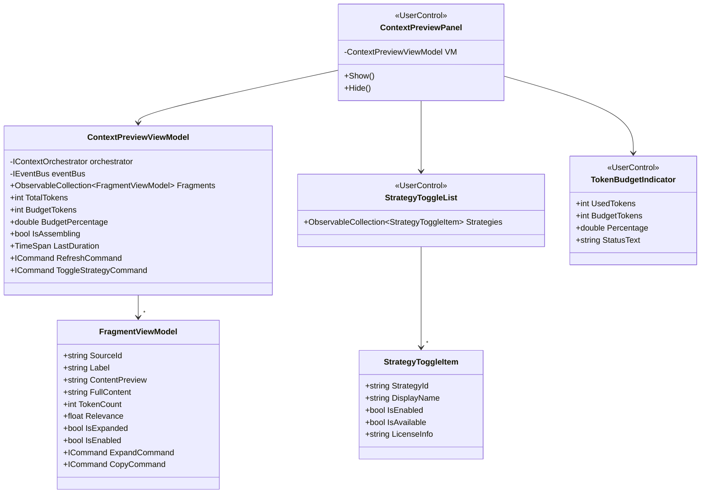

# LCS-DES-072d: Context Preview Panel

## 1. Metadata & Categorization

| Field              | Value                  |
| :----------------- | :--------------------- |
| **Document ID**    | LCS-DES-072d           |
| **Feature ID**     | AGT-072d               |
| **Feature Name**   | Context Preview Panel  |
| **Target Version** | v0.7.2d                |
| **Module Scope**   | Lexichord.Presentation |
| **Swimlane**       | Agents                 |
| **License Tier**   | WriterPro+             |
| **Status**         | Complete               |
| **Last Updated**   | 2026-02-14             |

---

## 2. Executive Summary

### 2.1 The Requirement

Users need visibility into what context is being provided to AI agents. Without transparency, users cannot:

- Understand why agents make specific suggestions
- Verify that relevant context is included
- Disable strategies that provide irrelevant information
- Debug issues with agent responses

### 2.2 The Proposed Solution

Implement a **Context Preview Panel** that:

1. Displays all context fragments with their labels and token counts
2. Shows real-time assembly progress during context gathering
3. Allows users to enable/disable individual strategies
4. Provides expandable views of fragment content
5. Displays total token usage with visual budget indicator

---

## 3. Architecture & Modular Strategy

### 3.1 Dependencies

**Upstream Modules:**

| Component               | Version | Purpose                 |
| :---------------------- | :------ | :---------------------- |
| `IContextOrchestrator`  | v0.7.2c | Context assembly events |
| `ContextAssembledEvent` | v0.7.2c | Event subscription      |
| `ContextFragment`       | v0.7.2a | Fragment display data   |
| `IEventBus`             | v0.1.5a | Event subscription      |
| Avalonia UI             | -       | UI framework            |

**Design Patterns:**

| Pattern  | Application                |
| :------- | :------------------------- |
| MVVM     | ViewModel/View separation  |
| Observer | Event-driven UI updates    |
| Reactive | Real-time fragment display |

### 3.2 Component Architecture



### 3.3 Panel Layout

```
┌─────────────────────────────────────────────────────────────┐
│ Context Preview                                    [⟳] [×]  │
├─────────────────────────────────────────────────────────────┤
│ Token Budget: [████████████░░░░░░░] 6,234 / 8,000 (78%)     │
│ Last Assembly: 127ms                                        │
├─────────────────────────────────────────────────────────────┤
│ ▼ Strategies                                                │
│   ☑ Document Content    ☑ Selected Text                     │
│   ☑ Cursor Context      ☑ Heading Hierarchy                 │
│   ☑ Related Docs (RAG)  ☑ Style Rules                       │
├─────────────────────────────────────────────────────────────┤
│ ▼ Document Content                          4,000 tokens    │
│   # Chapter 3: Integration Patterns                         │
│   This chapter covers the various integration...            │
│   [Show More]                                               │
├─────────────────────────────────────────────────────────────┤
│ ▶ Selected Text                               450 tokens    │
├─────────────────────────────────────────────────────────────┤
│ ▶ Heading Hierarchy                           234 tokens    │
├─────────────────────────────────────────────────────────────┤
│ ▼ Related Documentation                     1,200 tokens    │
│   From: API Reference Guide                                 │
│   The integration service provides...                       │
│   [Show More]                                               │
├─────────────────────────────────────────────────────────────┤
│ ▶ Style Rules                                 350 tokens    │
└─────────────────────────────────────────────────────────────┘
```

---

## 4. Data Contract (The API)

### 4.1 ContextPreviewViewModel

```csharp
namespace Lexichord.Presentation.ViewModels.Agents;

/// <summary>
/// ViewModel for the Context Preview panel.
/// Displays real-time context assembly results and allows strategy management.
/// </summary>
public sealed class ContextPreviewViewModel : ViewModelBase, IDisposable
{
    private readonly IContextOrchestrator _orchestrator;
    private readonly IEventBus _eventBus;
    private readonly IDispatcher _dispatcher;
    private readonly CompositeDisposable _disposables = new();

    private bool _isAssembling;
    private int _totalTokens;
    private int _budgetTokens = 8000;
    private TimeSpan _lastDuration;

    /// <summary>
    /// Collection of fragment ViewModels for display.
    /// </summary>
    public ObservableCollection<FragmentViewModel> Fragments { get; } = new();

    /// <summary>
    /// Collection of strategy toggle items.
    /// </summary>
    public ObservableCollection<StrategyToggleItem> Strategies { get; } = new();

    /// <summary>
    /// Whether context assembly is currently in progress.
    /// </summary>
    public bool IsAssembling
    {
        get => _isAssembling;
        private set => SetProperty(ref _isAssembling, value);
    }

    /// <summary>
    /// Total tokens across all fragments.
    /// </summary>
    public int TotalTokens
    {
        get => _totalTokens;
        private set
        {
            if (SetProperty(ref _totalTokens, value))
            {
                OnPropertyChanged(nameof(BudgetPercentage));
                OnPropertyChanged(nameof(BudgetStatusText));
            }
        }
    }

    /// <summary>
    /// Current token budget.
    /// </summary>
    public int BudgetTokens
    {
        get => _budgetTokens;
        set
        {
            if (SetProperty(ref _budgetTokens, value))
            {
                OnPropertyChanged(nameof(BudgetPercentage));
                OnPropertyChanged(nameof(BudgetStatusText));
            }
        }
    }

    /// <summary>
    /// Percentage of budget used (0.0 to 1.0).
    /// </summary>
    public double BudgetPercentage => BudgetTokens > 0
        ? Math.Min(1.0, (double)TotalTokens / BudgetTokens)
        : 0.0;

    /// <summary>
    /// Human-readable budget status text.
    /// </summary>
    public string BudgetStatusText =>
        $"{TotalTokens:N0} / {BudgetTokens:N0} ({BudgetPercentage:P0})";

    /// <summary>
    /// Duration of the last context assembly.
    /// </summary>
    public TimeSpan LastDuration
    {
        get => _lastDuration;
        private set => SetProperty(ref _lastDuration, value);
    }

    /// <summary>
    /// Formatted duration text.
    /// </summary>
    public string DurationText => $"{LastDuration.TotalMilliseconds:F0}ms";

    /// <summary>
    /// Command to manually trigger context refresh.
    /// </summary>
    public ICommand RefreshCommand { get; }

    /// <summary>
    /// Command to toggle a strategy's enabled state.
    /// </summary>
    public ICommand ToggleStrategyCommand { get; }

    /// <summary>
    /// Command to copy all context to clipboard.
    /// </summary>
    public ICommand CopyAllCommand { get; }

    public ContextPreviewViewModel(
        IContextOrchestrator orchestrator,
        IEventBus eventBus,
        IDispatcher dispatcher,
        ILogger<ContextPreviewViewModel> logger)
    {
        _orchestrator = orchestrator;
        _eventBus = eventBus;
        _dispatcher = dispatcher;

        RefreshCommand = new AsyncRelayCommand(RefreshAsync);
        ToggleStrategyCommand = new RelayCommand<StrategyToggleItem>(ToggleStrategy);
        CopyAllCommand = new AsyncRelayCommand(CopyAllToClipboardAsync);

        InitializeStrategies();
        SubscribeToEvents();
    }

    private void InitializeStrategies()
    {
        foreach (var strategy in _orchestrator.GetStrategies())
        {
            Strategies.Add(new StrategyToggleItem
            {
                StrategyId = strategy.StrategyId,
                DisplayName = strategy.DisplayName,
                IsEnabled = _orchestrator.IsStrategyEnabled(strategy.StrategyId),
                IsAvailable = true,
            });
        }
    }

    private void SubscribeToEvents()
    {
        _eventBus.Subscribe<ContextAssembledEvent>(OnContextAssembled)
            .DisposeWith(_disposables);

        _eventBus.Subscribe<ContextAssemblyStartedEvent>(OnAssemblyStarted)
            .DisposeWith(_disposables);
    }

    private void OnAssemblyStarted(ContextAssemblyStartedEvent @event)
    {
        _dispatcher.InvokeAsync(() =>
        {
            IsAssembling = true;
            Fragments.Clear();
        });
    }

    private void OnContextAssembled(ContextAssembledEvent @event)
    {
        _dispatcher.InvokeAsync(() =>
        {
            IsAssembling = false;
            TotalTokens = @event.TotalTokens;
            LastDuration = @event.Duration;

            Fragments.Clear();

            foreach (var fragment in @event.Fragments)
            {
                Fragments.Add(new FragmentViewModel(fragment));
            }
        });
    }

    private void ToggleStrategy(StrategyToggleItem? item)
    {
        if (item is null) return;

        item.IsEnabled = !item.IsEnabled;
        _orchestrator.SetStrategyEnabled(item.StrategyId, item.IsEnabled);
    }

    private async Task RefreshAsync()
    {
        // Trigger a new context assembly with current settings
        // This would be connected to the active agent's context request
    }

    private async Task CopyAllToClipboardAsync()
    {
        var content = string.Join("\n\n",
            Fragments.Select(f => $"## {f.Label}\n{f.FullContent}"));

        await Application.Current!.Clipboard!.SetTextAsync(content);
    }

    public void Dispose()
    {
        _disposables.Dispose();
    }
}
```

### 4.2 FragmentViewModel

```csharp
namespace Lexichord.Presentation.ViewModels.Agents;

/// <summary>
/// ViewModel for a single context fragment.
/// Supports expansion and copying.
/// </summary>
public sealed class FragmentViewModel : ViewModelBase
{
    private readonly ContextFragment _fragment;
    private bool _isExpanded;

    private const int PreviewLength = 150;

    /// <summary>
    /// Source strategy ID.
    /// </summary>
    public string SourceId => _fragment.SourceId;

    /// <summary>
    /// Human-readable label.
    /// </summary>
    public string Label => _fragment.Label;

    /// <summary>
    /// Truncated content preview.
    /// </summary>
    public string ContentPreview
    {
        get
        {
            if (_fragment.Content.Length <= PreviewLength)
                return _fragment.Content;

            return _fragment.Content.Substring(0, PreviewLength) + "...";
        }
    }

    /// <summary>
    /// Full content for expanded view.
    /// </summary>
    public string FullContent => _fragment.Content;

    /// <summary>
    /// Token count for this fragment.
    /// </summary>
    public int TokenCount => _fragment.TokenEstimate;

    /// <summary>
    /// Formatted token count string.
    /// </summary>
    public string TokenCountText => $"{TokenCount:N0} tokens";

    /// <summary>
    /// Relevance score (0.0 - 1.0).
    /// </summary>
    public float Relevance => _fragment.Relevance;

    /// <summary>
    /// Formatted relevance percentage.
    /// </summary>
    public string RelevanceText => $"{Relevance:P0}";

    /// <summary>
    /// Whether the fragment is expanded.
    /// </summary>
    public bool IsExpanded
    {
        get => _isExpanded;
        set
        {
            if (SetProperty(ref _isExpanded, value))
            {
                OnPropertyChanged(nameof(DisplayContent));
                OnPropertyChanged(nameof(ExpandButtonText));
            }
        }
    }

    /// <summary>
    /// Content to display based on expansion state.
    /// </summary>
    public string DisplayContent => IsExpanded ? FullContent : ContentPreview;

    /// <summary>
    /// Text for the expand/collapse button.
    /// </summary>
    public string ExpandButtonText => IsExpanded ? "Show Less" : "Show More";

    /// <summary>
    /// Whether the fragment needs expansion control.
    /// </summary>
    public bool NeedsExpansion => _fragment.Content.Length > PreviewLength;

    /// <summary>
    /// Icon for the source type.
    /// </summary>
    public string SourceIcon => SourceId switch
    {
        "document" => "📄",
        "selection" => "✂️",
        "cursor" => "📍",
        "heading" => "📑",
        "rag" => "🔍",
        "style" => "🎨",
        _ => "📋"
    };

    /// <summary>
    /// Command to toggle expansion.
    /// </summary>
    public ICommand ToggleExpandCommand { get; }

    /// <summary>
    /// Command to copy this fragment's content.
    /// </summary>
    public ICommand CopyCommand { get; }

    public FragmentViewModel(ContextFragment fragment)
    {
        _fragment = fragment;

        ToggleExpandCommand = new RelayCommand(() => IsExpanded = !IsExpanded);
        CopyCommand = new AsyncRelayCommand(CopyToClipboardAsync);
    }

    private async Task CopyToClipboardAsync()
    {
        await Application.Current!.Clipboard!.SetTextAsync(FullContent);
    }
}
```

### 4.3 StrategyToggleItem

```csharp
namespace Lexichord.Presentation.ViewModels.Agents;

/// <summary>
/// ViewModel for a strategy toggle in the settings section.
/// </summary>
public sealed class StrategyToggleItem : ViewModelBase
{
    private bool _isEnabled;
    private bool _isAvailable;

    /// <summary>
    /// Strategy identifier.
    /// </summary>
    public string StrategyId { get; init; } = string.Empty;

    /// <summary>
    /// Human-readable display name.
    /// </summary>
    public string DisplayName { get; init; } = string.Empty;

    /// <summary>
    /// Whether the strategy is currently enabled.
    /// </summary>
    public bool IsEnabled
    {
        get => _isEnabled;
        set => SetProperty(ref _isEnabled, value);
    }

    /// <summary>
    /// Whether the strategy is available for the current license.
    /// </summary>
    public bool IsAvailable
    {
        get => _isAvailable;
        set => SetProperty(ref _isAvailable, value);
    }

    /// <summary>
    /// License requirement info (e.g., "Teams+").
    /// </summary>
    public string LicenseInfo { get; init; } = string.Empty;

    /// <summary>
    /// Tooltip text explaining the strategy.
    /// </summary>
    public string Tooltip => StrategyId switch
    {
        "document" => "Include the current document content",
        "selection" => "Include selected text with surrounding context",
        "cursor" => "Include text around the cursor position",
        "heading" => "Include document heading structure",
        "rag" => "Include semantically related documentation",
        "style" => "Include active style rules",
        _ => $"Context from {DisplayName}"
    };
}
```

---

## 5. UI/UX Specifications

### 5.1 Context Preview Panel (AXAML)

```xml
<UserControl x:Class="Lexichord.Presentation.Views.Agents.ContextPreviewPanel"
             xmlns="https://github.com/avaloniaui"
             xmlns:x="http://schemas.microsoft.com/winfx/2006/xaml"
             xmlns:vm="using:Lexichord.Presentation.ViewModels.Agents"
             x:DataType="vm:ContextPreviewViewModel">

    <Design.DataContext>
        <vm:ContextPreviewViewModel />
    </Design.DataContext>

    <Border Classes="panel"
            Background="{DynamicResource PanelBackground}"
            BorderBrush="{DynamicResource PanelBorder}"
            BorderThickness="1"
            CornerRadius="4">
        <Grid RowDefinitions="Auto,Auto,Auto,*">

            <!-- Header -->
            <Border Grid.Row="0" Classes="panel-header">
                <Grid ColumnDefinitions="*,Auto,Auto">
                    <TextBlock Text="Context Preview"
                               Classes="panel-title"
                               VerticalAlignment="Center" />

                    <Button Grid.Column="1"
                            Command="{Binding RefreshCommand}"
                            ToolTip.Tip="Refresh context"
                            Classes="icon-button">
                        <PathIcon Data="{StaticResource RefreshIcon}" />
                    </Button>

                    <Button Grid.Column="2"
                            Classes="icon-button close"
                            ToolTip.Tip="Close panel">
                        <PathIcon Data="{StaticResource CloseIcon}" />
                    </Button>
                </Grid>
            </Border>

            <!-- Token Budget Indicator -->
            <Border Grid.Row="1" Classes="budget-section" Padding="12,8">
                <StackPanel Spacing="4">
                    <Grid ColumnDefinitions="*,Auto">
                        <TextBlock Text="Token Budget"
                                   Classes="section-label" />
                        <TextBlock Text="{Binding BudgetStatusText}"
                                   Classes="budget-text"
                                   HorizontalAlignment="Right" />
                    </Grid>

                    <ProgressBar Value="{Binding BudgetPercentage}"
                                 Maximum="1"
                                 Classes="budget-bar"
                                 Height="8" />

                    <TextBlock Text="{Binding DurationText, StringFormat='Last Assembly: {0}'}"
                               Classes="duration-text"
                               FontSize="11"
                               Opacity="0.7" />
                </StackPanel>
            </Border>

            <!-- Strategy Toggles -->
            <Expander Grid.Row="2"
                      Header="Strategies"
                      IsExpanded="True"
                      Classes="settings-expander">
                <ItemsControl ItemsSource="{Binding Strategies}"
                              Margin="8">
                    <ItemsControl.ItemsPanel>
                        <ItemsPanelTemplate>
                            <WrapPanel Orientation="Horizontal" />
                        </ItemsPanelTemplate>
                    </ItemsControl.ItemsPanel>
                    <ItemsControl.ItemTemplate>
                        <DataTemplate x:DataType="vm:StrategyToggleItem">
                            <CheckBox Content="{Binding DisplayName}"
                                      IsChecked="{Binding IsEnabled}"
                                      IsEnabled="{Binding IsAvailable}"
                                      ToolTip.Tip="{Binding Tooltip}"
                                      Margin="0,0,12,4"
                                      Command="{Binding $parent[ItemsControl].((vm:ContextPreviewViewModel)DataContext).ToggleStrategyCommand}"
                                      CommandParameter="{Binding}" />
                        </DataTemplate>
                    </ItemsControl.ItemTemplate>
                </ItemsControl>
            </Expander>

            <!-- Fragment List -->
            <ScrollViewer Grid.Row="3"
                          VerticalScrollBarVisibility="Auto">
                <ItemsControl ItemsSource="{Binding Fragments}"
                              Margin="8">
                    <ItemsControl.ItemTemplate>
                        <DataTemplate x:DataType="vm:FragmentViewModel">
                            <Border Classes="fragment-card"
                                    Margin="0,0,0,8"
                                    Padding="12"
                                    Background="{DynamicResource FragmentBackground}"
                                    CornerRadius="4">
                                <StackPanel Spacing="8">

                                    <!-- Fragment Header -->
                                    <Grid ColumnDefinitions="Auto,*,Auto">
                                        <StackPanel Orientation="Horizontal"
                                                    Spacing="8">
                                            <TextBlock Text="{Binding SourceIcon}"
                                                       FontSize="16" />
                                            <TextBlock Text="{Binding Label}"
                                                       Classes="fragment-label"
                                                       FontWeight="SemiBold" />
                                        </StackPanel>

                                        <TextBlock Grid.Column="2"
                                                   Text="{Binding TokenCountText}"
                                                   Classes="token-count"
                                                   Opacity="0.7"
                                                   FontSize="12" />
                                    </Grid>

                                    <!-- Fragment Content -->
                                    <Border Background="{DynamicResource CodeBackground}"
                                            Padding="8"
                                            CornerRadius="2">
                                        <SelectableTextBlock Text="{Binding DisplayContent}"
                                                             FontFamily="Cascadia Code,Consolas,Menlo,monospace"
                                                             FontSize="12"
                                                             TextWrapping="Wrap" />
                                    </Border>

                                    <!-- Actions -->
                                    <StackPanel Orientation="Horizontal"
                                                Spacing="8"
                                                IsVisible="{Binding NeedsExpansion}">
                                        <Button Content="{Binding ExpandButtonText}"
                                                Command="{Binding ToggleExpandCommand}"
                                                Classes="link-button"
                                                Padding="0" />

                                        <Button Content="Copy"
                                                Command="{Binding CopyCommand}"
                                                Classes="link-button"
                                                Padding="0" />
                                    </StackPanel>

                                </StackPanel>
                            </Border>
                        </DataTemplate>
                    </ItemsControl.ItemTemplate>
                </ItemsControl>
            </ScrollViewer>

            <!-- Loading Overlay -->
            <Border Grid.Row="3"
                    Background="#80000000"
                    IsVisible="{Binding IsAssembling}">
                <StackPanel HorizontalAlignment="Center"
                            VerticalAlignment="Center"
                            Spacing="12">
                    <ProgressRing IsIndeterminate="True"
                                  Width="32"
                                  Height="32" />
                    <TextBlock Text="Assembling context..."
                               Foreground="White" />
                </StackPanel>
            </Border>

        </Grid>
    </Border>
</UserControl>
```

### 5.2 Token Budget Indicator Styles

```xml
<Style Selector="ProgressBar.budget-bar">
    <Setter Property="Background" Value="{DynamicResource BudgetBarBackground}" />
    <Setter Property="Foreground" Value="{DynamicResource BudgetBarForeground}" />
    <Setter Property="CornerRadius" Value="4" />
</Style>

<Style Selector="ProgressBar.budget-bar[Value &gt; 0.8]">
    <Setter Property="Foreground" Value="{DynamicResource WarningColor}" />
</Style>

<Style Selector="ProgressBar.budget-bar[Value &gt; 0.95]">
    <Setter Property="Foreground" Value="{DynamicResource ErrorColor}" />
</Style>
```

### 5.3 Visual States

| State                | Visual Indicator                          |
| :------------------- | :---------------------------------------- |
| Assembling           | Loading overlay with progress ring        |
| Under budget (≤80%)  | Green progress bar                        |
| Near budget (>80%)   | Yellow/warning progress bar               |
| At budget (>95%)     | Red progress bar                          |
| Strategy disabled    | Unchecked checkbox, grayed strategy name  |
| Strategy unavailable | Disabled checkbox with license tooltip    |
| Fragment expanded    | Full content visible, "Show Less" button  |
| Fragment collapsed   | Preview with ellipsis, "Show More" button |

---

## 6. Observability & Logging

| Level | Source                  | Message Template                                     |
| :---- | :---------------------- | :--------------------------------------------------- |
| Debug | ContextPreviewViewModel | `Context preview updated: {FragmentCount} fragments` |
| Debug | ContextPreviewViewModel | `Strategy {StrategyId} toggled to {Enabled}`         |
| Debug | ContextPreviewViewModel | `Context copied to clipboard ({Length} chars)`       |
| Info  | ContextPreviewViewModel | `Context preview panel opened`                       |
| Debug | FragmentViewModel       | `Fragment {SourceId} expanded`                       |
| Debug | FragmentViewModel       | `Fragment content copied to clipboard`               |

---

## 7. Acceptance Criteria (QA)

| #   | Category       | Criterion                                        |
| :-- | :------------- | :----------------------------------------------- |
| 1   | **Display**    | Shows all fragments with labels and token counts |
| 2   | **Display**    | Token budget bar updates in real-time            |
| 3   | **Display**    | Shows assembly duration after completion         |
| 4   | **Strategies** | All strategies listed with checkboxes            |
| 5   | **Strategies** | Toggling strategy updates orchestrator           |
| 6   | **Strategies** | Unavailable strategies show license info         |
| 7   | **Fragments**  | Fragment content expandable/collapsible          |
| 8   | **Fragments**  | Copy button copies fragment content              |
| 9   | **Loading**    | Loading overlay shown during assembly            |
| 10  | **Budget**     | Progress bar color changes based on usage        |
| 11  | **Refresh**    | Refresh button triggers new context assembly     |
| 12  | **Copy All**   | Copy All copies combined context to clipboard    |

---

## 8. Unit Tests

```csharp
[Trait("Category", "Unit")]
[Trait("Version", "v0.7.2d")]
public class ContextPreviewViewModelTests
{
    [Fact]
    public void InitializeStrategies_PopulatesStrategyList()
    {
        // Arrange
        var orchestrator = Substitute.For<IContextOrchestrator>();
        orchestrator.GetStrategies().Returns(new[]
        {
            CreateMockStrategy("doc", "Document Content"),
            CreateMockStrategy("rag", "Related Docs"),
        });

        // Act
        var vm = CreateViewModel(orchestrator);

        // Assert
        vm.Strategies.Should().HaveCount(2);
        vm.Strategies[0].StrategyId.Should().Be("doc");
        vm.Strategies[1].StrategyId.Should().Be("rag");
    }

    [Fact]
    public void OnContextAssembled_UpdatesFragments()
    {
        // Arrange
        var eventBus = new InMemoryEventBus();
        var vm = CreateViewModel(eventBus: eventBus);

        var @event = new ContextAssembledEvent(
            "test",
            new[]
            {
                new ContextFragment("doc", "Document", "Content", 100, 1.0f),
                new ContextFragment("rag", "Related", "More content", 50, 0.8f),
            },
            150,
            TimeSpan.FromMilliseconds(100));

        // Act
        eventBus.Publish(@event);

        // Assert
        vm.Fragments.Should().HaveCount(2);
        vm.TotalTokens.Should().Be(150);
        vm.LastDuration.Should().Be(TimeSpan.FromMilliseconds(100));
    }

    [Fact]
    public void OnAssemblyStarted_SetsIsAssembling()
    {
        // Arrange
        var eventBus = new InMemoryEventBus();
        var vm = CreateViewModel(eventBus: eventBus);

        // Act
        eventBus.Publish(new ContextAssemblyStartedEvent("test"));

        // Assert
        vm.IsAssembling.Should().BeTrue();
    }

    [Fact]
    public void BudgetPercentage_CalculatesCorrectly()
    {
        // Arrange
        var vm = CreateViewModel();
        vm.BudgetTokens = 8000;

        // Simulate context assembled event
        SimulateContextAssembled(vm, totalTokens: 4000);

        // Assert
        vm.BudgetPercentage.Should().BeApproximately(0.5, 0.01);
    }

    [Fact]
    public void ToggleStrategy_UpdatesOrchestrator()
    {
        // Arrange
        var orchestrator = Substitute.For<IContextOrchestrator>();
        var vm = CreateViewModel(orchestrator);

        var strategyItem = new StrategyToggleItem
        {
            StrategyId = "doc",
            DisplayName = "Document",
            IsEnabled = true,
        };
        vm.Strategies.Add(strategyItem);

        // Act
        vm.ToggleStrategyCommand.Execute(strategyItem);

        // Assert
        orchestrator.Received(1).SetStrategyEnabled("doc", false);
    }

    [Fact]
    public async Task CopyAllCommand_CopiesAllContent()
    {
        // Arrange
        var clipboard = Substitute.For<IClipboard>();
        var vm = CreateViewModel(clipboard: clipboard);

        vm.Fragments.Add(new FragmentViewModel(
            new ContextFragment("doc", "Doc", "Doc content", 10, 1.0f)));
        vm.Fragments.Add(new FragmentViewModel(
            new ContextFragment("rag", "RAG", "RAG content", 10, 1.0f)));

        // Act
        await ((IAsyncCommand)vm.CopyAllCommand).ExecuteAsync(null);

        // Assert
        await clipboard.Received(1).SetTextAsync(Arg.Is<string>(s =>
            s.Contains("Doc content") && s.Contains("RAG content")));
    }

    [Fact]
    public void Dispose_UnsubscribesFromEvents()
    {
        // Arrange
        var eventBus = Substitute.For<IEventBus>();
        var subscription = Substitute.For<IDisposable>();
        eventBus.Subscribe<ContextAssembledEvent>(Arg.Any<Action<ContextAssembledEvent>>())
            .Returns(subscription);

        var vm = CreateViewModel(eventBus: eventBus);

        // Act
        vm.Dispose();

        // Assert
        subscription.Received(1).Dispose();
    }
}

[Trait("Category", "Unit")]
[Trait("Version", "v0.7.2d")]
public class FragmentViewModelTests
{
    [Fact]
    public void ContentPreview_TruncatesLongContent()
    {
        // Arrange
        var longContent = new string('x', 500);
        var fragment = new ContextFragment("test", "Test", longContent, 100, 1.0f);
        var vm = new FragmentViewModel(fragment);

        // Assert
        vm.ContentPreview.Should().HaveLength(153); // 150 + "..."
        vm.ContentPreview.Should().EndWith("...");
    }

    [Fact]
    public void ContentPreview_RetainsShortContent()
    {
        // Arrange
        var shortContent = "Short content";
        var fragment = new ContextFragment("test", "Test", shortContent, 10, 1.0f);
        var vm = new FragmentViewModel(fragment);

        // Assert
        vm.ContentPreview.Should().Be(shortContent);
    }

    [Fact]
    public void ToggleExpandCommand_TogglesIsExpanded()
    {
        // Arrange
        var fragment = new ContextFragment("test", "Test", new string('x', 500), 100, 1.0f);
        var vm = new FragmentViewModel(fragment);

        // Act
        vm.ToggleExpandCommand.Execute(null);

        // Assert
        vm.IsExpanded.Should().BeTrue();
        vm.ExpandButtonText.Should().Be("Show Less");
    }

    [Fact]
    public void NeedsExpansion_TrueForLongContent()
    {
        // Arrange
        var longContent = new string('x', 200);
        var fragment = new ContextFragment("test", "Test", longContent, 100, 1.0f);

        // Act
        var vm = new FragmentViewModel(fragment);

        // Assert
        vm.NeedsExpansion.Should().BeTrue();
    }

    [Fact]
    public void SourceIcon_ReturnsCorrectIcons()
    {
        // Arrange & Act & Assert
        CreateFragmentVM("document").SourceIcon.Should().Be("📄");
        CreateFragmentVM("selection").SourceIcon.Should().Be("✂️");
        CreateFragmentVM("cursor").SourceIcon.Should().Be("📍");
        CreateFragmentVM("heading").SourceIcon.Should().Be("📑");
        CreateFragmentVM("rag").SourceIcon.Should().Be("🔍");
        CreateFragmentVM("style").SourceIcon.Should().Be("🎨");
        CreateFragmentVM("unknown").SourceIcon.Should().Be("📋");
    }

    private static FragmentViewModel CreateFragmentVM(string sourceId)
    {
        return new FragmentViewModel(
            new ContextFragment(sourceId, "Test", "Content", 10, 1.0f));
    }
}

[Trait("Category", "Unit")]
[Trait("Version", "v0.7.2d")]
public class StrategyToggleItemTests
{
    [Fact]
    public void Tooltip_ReturnsDescriptiveText()
    {
        // Arrange & Act & Assert
        new StrategyToggleItem { StrategyId = "document" }.Tooltip
            .Should().Contain("document content");

        new StrategyToggleItem { StrategyId = "rag" }.Tooltip
            .Should().Contain("semantically related");
    }
}
```

---

## 9. DI Registration

```csharp
// In PresentationModule.cs

public static IServiceCollection AddContextPreviewPanel(
    this IServiceCollection services)
{
    // ViewModel
    services.AddTransient<ContextPreviewViewModel>();

    // View (registered for DI-based view resolution)
    services.AddTransient<ContextPreviewPanel>();

    return services;
}
```

---

## 10. Deliverable Checklist

| #   | Deliverable                              | Status |
| :-- | :--------------------------------------- | :----- |
| 1   | `ContextPreviewViewModel` implementation | [x]    |
| 2   | `FragmentViewModel` implementation       | [x]    |
| 3   | `StrategyToggleItem` implementation      | [x]    |
| 4   | `ContextPreviewPanel.axaml` view         | [x]    |
| 5   | Token budget indicator styles            | [x]    |
| 6   | Fragment card styles                     | [x]    |
| 7   | Loading overlay                          | [x]    |
| 8   | Strategy toggle functionality            | [x]    |
| 9   | Copy to clipboard functionality          | [x]    |
| 10  | Event subscription for real-time updates | [x]    |
| 11  | Unit tests for ContextPreviewViewModel   | [x]    |
| 12  | Unit tests for FragmentViewModel         | [x]    |
| 13  | Unit tests for StrategyToggleItem        | [x]    |

---
