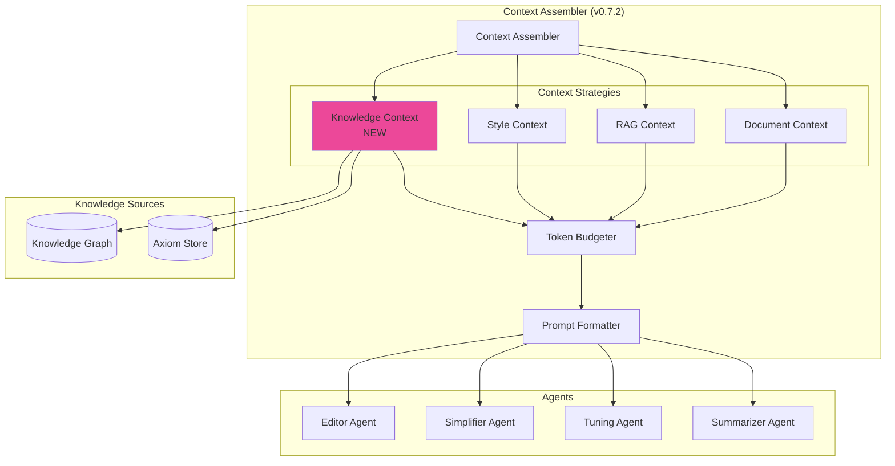

# LCS-SBD-072-KG: Scope Overview — Graph Context Strategy

## Document Control

| Field            | Value                                                        |
| :--------------- | :----------------------------------------------------------- |
| **Document ID**  | LCS-SBD-072-KG                                               |
| **Version**      | v0.7.2                                                       |
| **Codename**     | Graph Context Strategy (CKVS Phase 4a)                       |
| **Status**       | Complete                                                     |
| **Last Updated** | 2026-02-14                                                   |
| **Owner**        | Lead Architect                                               |
| **Depends On**   | v0.7.2 (Context Assembler), v0.6.6-KG (Knowledge-Aware Co-pilot) |

---

## 1. Executive Summary

### 1.1 The Vision

**v0.7.2-KG** delivers the **Graph Context Strategy** — a new context source for the agent Context Assembler that provides structured knowledge from the CKVS Knowledge Graph. This enables all specialist agents (Editor, Simplifier, Tuning, Summarizer) to leverage graph data.

While v0.6.6-KG added knowledge awareness to the Co-pilot specifically, this version generalizes it into a reusable context strategy that any agent can consume.

### 1.2 Business Value

- **Universal Knowledge Access:** All agents can query the graph.
- **Consistent Context API:** Standard interface for knowledge retrieval.
- **Relevance Ranking:** Smart selection of relevant entities.
- **Token Budgeting:** Automatic trimming to fit context windows.
- **Agent Specialization:** Different agents get different views of knowledge.

### 1.3 Success Criteria

1. `IKnowledgeContextStrategy` integrates with Context Assembler.
2. Context includes entities, relationships, and applicable axioms.
3. Relevance scoring ranks entities by query similarity.
4. Token budgeting stays within 4K tokens for knowledge context.
5. All specialist agents receive knowledge context.
6. Context retrieval <200ms P95.

---

## 2. Relationship to Existing v0.7.2

The existing v0.7.2 spec covers the **Context Assembler** for specialist agents:

| Context Source | Existing | CKVS Addition |
|:---------------|:---------|:--------------|
| Document Context | ✓ | (unchanged) |
| RAG Context | ✓ | (unchanged) |
| Style Context | ✓ | (unchanged) |
| **Knowledge Context** | — | **New** |

---

## 3. Key Deliverables

### 3.1 Sub-Parts

| Sub-Part | Title | Description | Est. Hours |
|:---------|:------|:------------|:-----------|
| v0.7.2e | Knowledge Context Strategy | Implements IContextStrategy | 5 ☑ |
| v0.7.2f | Entity Relevance Scorer | Ranks entities by query similarity | 4 ☑ |
| v0.7.2g | Knowledge Context Formatter | Serializes for prompt injection | 3 ☑ |
| v0.7.2h | Context Assembler Integration | Registers strategy with assembler | 2 ☑ |
| **Total** | | | **14 hours** |

### 3.2 Key Interfaces

```csharp
/// <summary>
/// Context strategy that provides knowledge graph data.
/// </summary>
public interface IKnowledgeContextStrategy : IContextStrategy
{
    /// <summary>
    /// Gets knowledge context for a request.
    /// </summary>
    Task<ContextFragment> GetContextAsync(
        ContextRequest request,
        CancellationToken ct = default);
}

/// <summary>
/// Knowledge context configuration per agent type.
/// </summary>
public record KnowledgeContextConfig
{
    /// <summary>Maximum tokens for knowledge context.</summary>
    public int MaxTokens { get; init; } = 4000;

    /// <summary>Entity types to include (null = all).</summary>
    public IReadOnlyList<string>? IncludeEntityTypes { get; init; }

    /// <summary>Minimum relevance score (0-1).</summary>
    public float MinRelevanceScore { get; init; } = 0.5f;

    /// <summary>Include relationships.</summary>
    public bool IncludeRelationships { get; init; } = true;

    /// <summary>Include applicable axioms.</summary>
    public bool IncludeAxioms { get; init; } = true;

    /// <summary>Maximum entities to include.</summary>
    public int MaxEntities { get; init; } = 20;
}

/// <summary>
/// Context fragment containing knowledge data.
/// </summary>
public record KnowledgeContextFragment : ContextFragment
{
    /// <summary>Entities in context.</summary>
    public IReadOnlyList<KnowledgeEntity> Entities { get; init; }

    /// <summary>Relationships in context.</summary>
    public IReadOnlyList<KnowledgeRelationship> Relationships { get; init; }

    /// <summary>Applicable axioms.</summary>
    public IReadOnlyList<Axiom> Axioms { get; init; }

    /// <summary>Relevance scores per entity.</summary>
    public IReadOnlyDictionary<Guid, float> RelevanceScores { get; init; }
}
```

### 3.3 Context Assembler Integration



---

## 4. Agent-Specific Configurations

| Agent | Entity Types | Max Entities | Include Axioms | Notes |
|:------|:-------------|:-------------|:---------------|:------|
| Editor | All | 30 | Yes | Full context for editing |
| Simplifier | Concept | 10 | No | Focus on terminology |
| Tuning | Endpoint, Parameter | 20 | Yes | Technical accuracy |
| Summarizer | Product, Component | 15 | No | High-level overview |

---

## 5. Relevance Scoring Algorithm

```
ALGORITHM: Entity Relevance Scoring

INPUT: Query q, Entity e, Document d
OUTPUT: Relevance score (0.0-1.0)

1. SEMANTIC SIMILARITY (40%)
   semantic_score = cosine_similarity(embed(q), embed(e.name + e.description))

2. DOCUMENT MENTION (30%)
   mention_count = count_mentions(e, d)
   mention_score = min(mention_count / 5.0, 1.0)

3. TYPE MATCH (20%)
   type_score = 1.0 if e.type in context_config.include_types else 0.5

4. RECENCY (10%)
   days_old = (now - e.modified_at).days
   recency_score = max(0, 1.0 - days_old / 365)

5. FINAL SCORE
   relevance = 0.4 * semantic + 0.3 * mention + 0.2 * type + 0.1 * recency

RETURN relevance
```

---

## 6. Dependencies

| Component | Source | Usage |
|:----------|:-------|:------|
| `IContextAssembler` | v0.7.2 | Strategy registration |
| `IGraphRepository` | v0.4.5e | Entity queries |
| `IAxiomStore` | v0.4.6-KG | Axiom retrieval |
| `ISemanticSearchService` | v0.4.5 | Relevance scoring |
| `ITokenCounter` | v0.4.4c | Token budgeting |

---

## 7. License Gating

| Tier | Knowledge Context |
|:-----|:------------------|
| Core | Not available |
| WriterPro | Basic (entities only, no axioms) |
| Teams | Full (entities + relationships + axioms) |
| Enterprise | Full + custom configs per agent |

---

## 8. Performance Targets

| Metric | Target | Measurement |
|:-------|:-------|:------------|
| Context retrieval | <200ms | P95 timing |
| Relevance scoring | <50ms | P95 timing |
| Token counting | <10ms | P95 timing |
| Total strategy time | <300ms | P95 timing |

---

## 9. What This Enables

- **v0.7.3-v0.7.6 Agents:** All specialist agents knowledge-aware.
- **v0.7.5 Unified Validation:** Context includes validation hints.
- **Custom Agents:** Future agents get knowledge context automatically.

---
