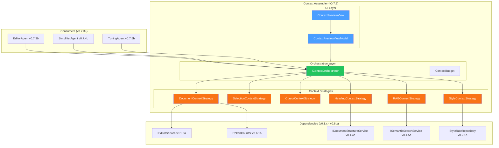
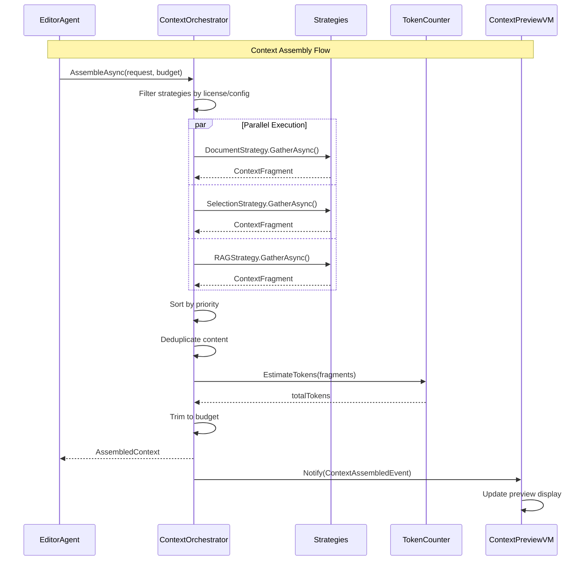

# LCS-SBD-072: Scope Breakdown Document — The Context Assembler

## Document Control

| Field            | Value                                                                      |
| :--------------- | :------------------------------------------------------------------------- |
| **Document ID**  | LCS-SBD-072                                                                |
| **Version**      | v0.7.2                                                                     |
| **Codename**     | The Context Assembler (Intelligent Context)                                |
| **Status**       | Draft                                                                      |
| **Module**       | Lexichord.Modules.Agents                                                   |
| **Created**      | 2026-01-28                                                                 |
| **Author**       | Documentation Agent                                                        |
| **Reviewers**    | TBD                                                                        |
| **Related Docs** | [LCS-DES-072-INDEX](LCS-DES-072-INDEX.md), [Roadmap](../roadmap-v0.7.x.md) |

---

## 1. Executive Summary

### 1.1 Vision

**v0.7.2** delivers the **Context Assembler** — an advanced system that automatically gathers relevant context based on user activity and cursor position. This release transforms context injection from a static, manual process into an intelligent, adaptive system that understands what information each specialized agent needs.

The Context Assembler uses a pluggable strategy architecture that allows different types of context (document content, RAG search results, style rules, heading hierarchies) to be gathered in parallel, prioritized by relevance, and trimmed to fit within token budgets. This enables specialized agents to receive precisely the right context for their tasks without overwhelming the LLM or exceeding rate limits.

### 1.2 Business Value

| Benefit                  | Impact                                                            |
| :----------------------- | :---------------------------------------------------------------- |
| **Enhanced AI Accuracy** | Agents receive relevant context, improving response quality       |
| **Reduced Token Costs**  | Intelligent trimming prevents wasted tokens on irrelevant context |
| **Faster Responses**     | Parallel context gathering minimizes latency                      |
| **User Transparency**    | Context preview shows exactly what information agents receive     |
| **Extensibility**        | New context strategies can be added without modifying core code   |
| **Agent Customization**  | Each agent can specify which strategies to use                    |

### 1.3 Success Criteria

| Criterion             | Target                                              |
| :-------------------- | :-------------------------------------------------- |
| Context assembly time | < 200ms for 5 parallel strategies                   |
| Token budget accuracy | ±5% of target budget                                |
| Strategy execution    | All strategies execute in parallel                  |
| Deduplication         | No duplicate content in assembled context           |
| User preview          | Context panel shows all fragments with token counts |
| Strategy hot-swap     | Enable/disable strategies without restart           |

### 1.4 License Gating

The Context Assembler is available to **WriterPro+** users as part of the AI Agent functionality. Context strategies gating:

| Feature                   | Core | WriterPro | Teams | Enterprise |
| :------------------------ | :--: | :-------: | :---: | :--------: |
| Document Context Strategy |  —   |     ✓     |   ✓   |     ✓      |
| Selection Context         |  —   |     ✓     |   ✓   |     ✓      |
| Cursor Context            |  —   |     ✓     |   ✓   |     ✓      |
| Heading Context           |  —   |     ✓     |   ✓   |     ✓      |
| RAG Context Strategy      |  —   |     —     |   ✓   |     ✓      |
| Style Context Strategy    |  —   |     —     |   ✓   |     ✓      |
| Custom Strategies         |  —   |     —     |   —   |     ✓      |

---

## 2. Dependencies on Prior Versions

### 2.1 Required Components

| Component                   | Version | Purpose                                   |
| :-------------------------- | :------ | :---------------------------------------- |
| `IChatCompletionService`    | v0.6.1a | Chat completion abstraction               |
| `IPromptRenderer`           | v0.6.3b | Template rendering with context variables |
| `IContextInjector`          | v0.6.3d | Base context injection (being extended)   |
| `IPromptTemplateRepository` | v0.6.3c | Template storage                          |
| `IAgent`                    | v0.6.6a | Agent abstraction consuming context       |
| `IAgentRegistry`            | v0.7.1b | Agent registry (extended)                 |
| `AgentConfiguration`        | v0.7.1a | Agent config with strategy preferences    |
| `ISemanticSearchService`    | v0.4.5a | RAG search integration                    |
| `IStyleRuleRepository`      | v0.2.1b | Style rules access                        |
| `IEditorService`            | v0.1.3a | Document content access                   |
| `IDocumentStructureService` | v0.1.4b | Heading/section parsing                   |
| `ITokenCounter`             | v0.6.1b | Token estimation                          |
| `IMediator`                 | v0.0.7a | Event publishing                          |
| `ILogger<T>`                | v0.0.3b | Structured logging                        |

---

## 3. Sub-Part Specifications

### 3.1 v0.7.2a: Context Strategy Interface

| Field            | Value                      |
| :--------------- | :------------------------- |
| **Sub-Part ID**  | AGT-072a                   |
| **Title**        | Context Strategy Interface |
| **Module**       | `Lexichord.Abstractions`   |
| **License Tier** | WriterPro+                 |

**Goal:** Define the pluggable abstraction for context gathering strategies.

**Key Deliverables:**

- `IContextStrategy` interface for pluggable context gathering
- `ContextGatheringRequest` record with document path, cursor, selection, agent ID
- `ContextFragment` record with source ID, label, content, token estimate, relevance
- `StrategyPriority` enumeration for ordering
- `IContextStrategyFactory` for strategy instantiation
- Unit tests for core contracts

**Key Interfaces:**

```csharp
namespace Lexichord.Abstractions.Agents.Context;

/// <summary>
/// Defines a pluggable strategy for gathering contextual information.
/// </summary>
public interface IContextStrategy
{
    /// <summary>Unique identifier for this strategy.</summary>
    string StrategyId { get; }

    /// <summary>Display name for UI presentation.</summary>
    string DisplayName { get; }

    /// <summary>Execution priority (higher = earlier).</summary>
    int Priority { get; }

    /// <summary>Maximum tokens this strategy should contribute.</summary>
    int MaxTokens { get; }

    /// <summary>Gathers relevant context based on the request.</summary>
    Task<ContextFragment?> GatherAsync(
        ContextGatheringRequest request,
        CancellationToken ct);
}

public record ContextGatheringRequest(
    string? DocumentPath,
    int? CursorPosition,
    string? SelectedText,
    string AgentId,
    IReadOnlyDictionary<string, object>? Hints);

public record ContextFragment(
    string SourceId,
    string Label,
    string Content,
    int TokenEstimate,
    float Relevance);
```

**Dependencies:**

- v0.6.3d: `IContextInjector` (base interface being extended)

---

### 3.2 v0.7.2b: Built-in Context Strategies

| Field            | Value                       |
| :--------------- | :-------------------------- |
| **Sub-Part ID**  | AGT-072b                    |
| **Title**        | Built-in Context Strategies |
| **Module**       | `Lexichord.Modules.Agents`  |
| **License Tier** | WriterPro+ / Teams+         |

**Goal:** Implement core context gathering strategies for common use cases.

**Key Deliverables:**

- `DocumentContextStrategy` - Current document content with token limits
- `SelectionContextStrategy` - Selected text with surrounding paragraph
- `CursorContextStrategy` - Text around cursor (configurable window)
- `HeadingContextStrategy` - Current section heading hierarchy
- `RAGContextStrategy` - Semantic search results from v0.5.x (Teams+)
- `StyleContextStrategy` - Active style rules from v0.2.x (Teams+)
- Unit tests for each strategy

**Key Interfaces:**

```csharp
namespace Lexichord.Modules.Agents.Context.Strategies;

/// <summary>
/// Provides current document content as context, respecting token limits.
/// </summary>
[RequiresLicense(LicenseTier.WriterPro)]
public class DocumentContextStrategy(
    IEditorService editorService,
    ITokenCounter tokenCounter,
    ILogger<DocumentContextStrategy> logger) : IContextStrategy
{
    public string StrategyId => "document";
    public string DisplayName => "Document Content";
    public int Priority => 100; // High priority - fundamental context
    public int MaxTokens => 4000;

    public async Task<ContextFragment?> GatherAsync(
        ContextGatheringRequest request,
        CancellationToken ct)
    {
        if (string.IsNullOrEmpty(request.DocumentPath)) return null;

        var content = await editorService.GetContentAsync(request.DocumentPath, ct);
        var tokens = tokenCounter.CountTokens(content);

        if (tokens > MaxTokens)
        {
            content = TruncateToTokens(content, MaxTokens);
            tokens = MaxTokens;
        }

        return new ContextFragment(
            StrategyId, DisplayName, content, tokens, Relevance: 1.0f);
    }

    private string TruncateToTokens(string content, int maxTokens)
    {
        // Smart truncation: prefer complete paragraphs
        // Implementation details in design spec
    }
}

/// <summary>
/// Provides semantic search results as context from RAG index.
/// </summary>
[RequiresLicense(LicenseTier.Teams)]
public class RAGContextStrategy(
    ISemanticSearchService search,
    IContextExpansionService expansion,
    ILogger<RAGContextStrategy> logger) : IContextStrategy
{
    public string StrategyId => "rag";
    public string DisplayName => "Related Documentation";
    public int Priority => 50; // Medium priority
    public int MaxTokens => 2000;

    public async Task<ContextFragment?> GatherAsync(
        ContextGatheringRequest request,
        CancellationToken ct)
    {
        if (string.IsNullOrEmpty(request.SelectedText)) return null;

        var results = await search.SearchAsync(
            request.SelectedText,
            new SearchOptions(TopK: 3),
            ct);

        if (results.Hits.Count == 0) return null;

        var content = FormatHitsAsContext(results.Hits);
        return new ContextFragment(
            StrategyId, DisplayName, content,
            EstimateTokens(content), Relevance: 0.8f);
    }
}
```

**Dependencies:**

- v0.7.2a: `IContextStrategy` interface
- v0.4.5a: `ISemanticSearchService` for RAG
- v0.2.1b: `IStyleRuleRepository` for style rules

---

### 3.3 v0.7.2c: Context Orchestrator

| Field            | Value                      |
| :--------------- | :------------------------- |
| **Sub-Part ID**  | AGT-072c                   |
| **Title**        | Context Orchestrator       |
| **Module**       | `Lexichord.Modules.Agents` |
| **License Tier** | WriterPro+                 |

**Goal:** Implement the central orchestrator that coordinates multiple strategies.

**Key Deliverables:**

- `IContextOrchestrator` interface for assembling context
- `ContextOrchestrator` implementation with parallel execution
- `ContextBudget` record for token budget configuration
- `AssembledContext` record with fragments and metadata
- Priority-based ordering and relevance sorting
- Token budget enforcement with intelligent trimming
- Content deduplication algorithm
- Unit tests for orchestration logic

**Key Interfaces:**

```csharp
namespace Lexichord.Modules.Agents.Context;

/// <summary>
/// Coordinates multiple context strategies to assemble comprehensive context.
/// </summary>
public interface IContextOrchestrator
{
    /// <summary>Assembles context from all applicable strategies.</summary>
    Task<AssembledContext> AssembleAsync(
        ContextGatheringRequest request,
        ContextBudget budget,
        CancellationToken ct);

    /// <summary>Gets all registered strategies.</summary>
    IReadOnlyList<IContextStrategy> GetStrategies();

    /// <summary>Enables or disables a strategy at runtime.</summary>
    void SetStrategyEnabled(string strategyId, bool enabled);
}

public record ContextBudget(
    int MaxTokens,
    IReadOnlyList<string>? RequiredStrategies,
    IReadOnlyList<string>? ExcludedStrategies);

public record AssembledContext(
    IReadOnlyList<ContextFragment> Fragments,
    int TotalTokens,
    IReadOnlyDictionary<string, object> Variables,
    TimeSpan AssemblyDuration);
```

**Processing Logic:**

```text
ASSEMBLE CONTEXT:
1. Filter strategies by:
   - NOT in ExcludedStrategies
   - User license allows strategy
   - Strategy is enabled

2. Execute all strategies in parallel (Task.WhenAll)

3. Collect non-null results

4. Sort fragments by:
   - Priority (descending)
   - Relevance score (descending)

5. Deduplicate overlapping content:
   - Hash each content segment
   - Remove fragments with >80% similarity

6. Trim to fit token budget:
   - Sum tokens from highest priority down
   - Drop lowest priority fragments that exceed budget

7. Build Variables dictionary from fragment content

8. Return AssembledContext with metrics
```

**Dependencies:**

- v0.7.2a: `IContextStrategy` interface
- v0.7.2b: Built-in strategies

---

### 3.4 v0.7.2d: Context Preview Panel

| Field            | Value                 |
| :--------------- | :-------------------- |
| **Sub-Part ID**  | AGT-072d              |
| **Title**        | Context Preview Panel |
| **Module**       | `Lexichord.App`       |
| **License Tier** | WriterPro+            |

**Goal:** Create a UI panel showing assembled context to users.

**Key Deliverables:**

- `ContextPreviewView.axaml` - Collapsible panel for context display
- `ContextPreviewViewModel` - Reactive ViewModel for context state
- `ContextFragmentControl` - Control for each fragment
- Token count visualization per fragment and total
- Toggle switches for strategy enable/disable
- "Refresh Context" button for manual re-gathering
- Highlight for fragments used in last request
- Integration with Co-pilot panel
- Unit tests for ViewModel logic

**Key UI Components:**

```text
┌──────────────────────────────────────────────────────────────────────────┐
│  Context Preview                                      ↻ Refresh  ⚙ Settings│
├──────────────────────────────────────────────────────────────────────────┤
│  Budget: 8000 tokens | Used: 5,234 tokens (65%)                          │
│  ━━━━━━━━━━━━━━━━━━━━━━━━━━━━━━━━━━━━━━━░░░░░░░░░░░░░░░░░░░░              │
├──────────────────────────────────────────────────────────────────────────┤
│  ▼ [✓] Document Content                                    2,150 tokens  │
│    ┌─────────────────────────────────────────────────────────────────┐   │
│    │ # Chapter 3: Integration Patterns                               │   │
│    │                                                                 │   │
│    │ This chapter covers the key patterns used for integrating...    │   │
│    └─────────────────────────────────────────────────────────────────┘   │
├──────────────────────────────────────────────────────────────────────────┤
│  ▼ [✓] Selected Text                                         450 tokens  │
│    ┌─────────────────────────────────────────────────────────────────┐   │
│    │ "The dependency injection container should be configured..."     │   │
│    └─────────────────────────────────────────────────────────────────┘   │
├──────────────────────────────────────────────────────────────────────────┤
│  ▶ [✓] Related Documentation                               1,800 tokens  │
├──────────────────────────────────────────────────────────────────────────┤
│  ▶ [✓] Style Rules                                           834 tokens  │
├──────────────────────────────────────────────────────────────────────────┤
│  ▶ [ ] Heading Hierarchy (disabled)                                 —    │
└──────────────────────────────────────────────────────────────────────────┘
```

**Dependencies:**

- v0.7.2c: `IContextOrchestrator` for context data
- v0.6.4a: `CoPilotViewModel` for integration

---

## 4. Implementation Checklist

| Phase | Task                                    | Est. Hours | Status |
| :---: | :-------------------------------------- | :--------: | :----: |
|   1   | Define `IContextStrategy` interface     |     2      |   ✅    |
|   1   | Create `ContextGatheringRequest` record |     1      |   ✅    |
|   1   | Create `ContextFragment` record         |     1      |   ✅    |
|   1   | Unit tests for core contracts           |     2      |   ✅    |
|   2   | Implement `DocumentContextStrategy`     |     3      |   ✅    |
|   2   | Implement `SelectionContextStrategy`    |     2      |   ✅    |
|   2   | Implement `CursorContextStrategy`       |     2      |   ✅    |
|   2   | Implement `HeadingContextStrategy`      |     3      |   ✅    |
|   2   | Implement `RAGContextStrategy`          |     4      |   ✅    |
|   2   | Implement `StyleContextStrategy`        |     3      |   ✅    |
|   2   | Unit tests for all strategies           |     6      |   ✅    |
|   3   | Define `IContextOrchestrator` interface |     1      |   ✅    |
|   3   | Implement parallel strategy execution   |     3      |   ✅    |
|   3   | Implement priority sorting              |     2      |   ✅    |
|   3   | Implement content deduplication         |     3      |   ✅    |
|   3   | Implement token budget trimming         |     2      |   ✅    |
|   3   | Unit tests for orchestrator             |     4      |   ✅    |
|   4   | Create `ContextPreviewView.axaml`       |     4      |   ✅    |
|   4   | Create `ContextPreviewViewModel`        |     3      |   ✅    |
|   4   | Create `ContextFragmentControl`         |     2      |   ✅    |
|   4   | Implement toggle switches               |     2      |   ✅    |
|   4   | Implement refresh functionality         |     1      |   ✅    |
|   4   | Integrate with Co-pilot panel           |     2      |   ✅    |
|   4   | Unit tests for ViewModel                |     3      |   ✅    |
|   5   | Integration tests for full context flow |     4      |   ☐    |
|   5   | DI registration in AgentsModule.cs      |     1      |   ✅    |
|       | **Total**                               |   **64**   |        |

---

## 5. Dependency Matrix

### 5.1 New Interfaces

| Interface                 | Module                   | Purpose                     |
| :------------------------ | :----------------------- | :-------------------------- |
| `IContextStrategy`        | Lexichord.Abstractions   | Pluggable context gathering |
| `IContextOrchestrator`    | Lexichord.Modules.Agents | Strategy coordination       |
| `IContextStrategyFactory` | Lexichord.Modules.Agents | Strategy instantiation      |

### 5.2 New Records/Classes

| Type                       | Module                   | Purpose                     |
| :------------------------- | :----------------------- | :-------------------------- |
| `ContextGatheringRequest`  | Lexichord.Abstractions   | Context request parameters  |
| `ContextFragment`          | Lexichord.Abstractions   | Individual context piece    |
| `ContextBudget`            | Lexichord.Abstractions   | Token budget configuration  |
| `AssembledContext`         | Lexichord.Abstractions   | Complete assembled context  |
| `DocumentContextStrategy`  | Lexichord.Modules.Agents | Document content strategy   |
| `SelectionContextStrategy` | Lexichord.Modules.Agents | Selection-based strategy    |
| `CursorContextStrategy`    | Lexichord.Modules.Agents | Cursor-based strategy       |
| `HeadingContextStrategy`   | Lexichord.Modules.Agents | Heading hierarchy strategy  |
| `RAGContextStrategy`       | Lexichord.Modules.Agents | Semantic search strategy    |
| `StyleContextStrategy`     | Lexichord.Modules.Agents | Style rules strategy        |
| `ContextOrchestrator`      | Lexichord.Modules.Agents | Orchestrator implementation |
| `ContextPreviewViewModel`  | Lexichord.App            | Preview panel ViewModel     |

---

## 6. Architecture Diagram



---

## 7. Data Flow Diagram



---

## 8. Risks & Mitigations

| Risk                            | Probability | Impact | Mitigation                                      |
| :------------------------------ | :---------: | :----: | :---------------------------------------------- |
| Strategy execution timeout      |   Medium    |  High  | Per-strategy timeout, skip slow strategies      |
| Token estimation inaccuracy     |   Medium    | Medium | Use conservative estimates, test with real LLMs |
| Deduplication false positives   |     Low     | Medium | Tunable similarity threshold, user override     |
| RAG search latency              |    High     | Medium | Cache recent searches, async prefetch           |
| Memory pressure from large docs |   Medium    |  High  | Stream document content, limit buffer size      |
| Strategy registration conflicts |     Low     |  Low   | Unique strategy IDs, startup validation         |

---

## 9. Success Metrics

| Metric                      | Measurement Method        | Target     |
| :-------------------------- | :------------------------ | :--------- |
| Context assembly time       | Stopwatch timing          | < 200ms    |
| Token budget accuracy       | Compare estimate vs LLM   | ±5%        |
| Parallel strategy execution | WhenAll completion timing | All finish |
| Deduplication effectiveness | Duplicate content ratio   | < 5%       |
| User satisfaction           | Preview panel engagement  | > 50% view |

---

## 10. What This Enables

### 10.1 Immediate Benefits

- **Intelligent Context**: Agents receive precisely relevant information
- **Cost Optimization**: Token budgets prevent waste
- **Transparency**: Users see exactly what context agents receive
- **Extensibility**: New strategies without core changes

### 10.2 Future Capabilities

| Future Feature           | How v0.7.2 Enables It                           |
| :----------------------- | :---------------------------------------------- |
| v0.7.3: Editor Agent     | Uses context for targeted editing suggestions   |
| v0.7.4: Simplifier Agent | Accesses readability metrics via context        |
| v0.7.5: Tuning Agent     | Receives style violations through context       |
| v0.7.6: Summarizer Agent | Gets document structure for intelligent summary |
| v0.7.7: Agent Workflows  | Context flows between workflow steps            |

---

## 11. Decision Trees

### 11.1 Strategy Selection Decision

```text
START: "Which strategies should execute?"
│
├── Is strategy in ExcludedStrategies?
│   ├── YES → SKIP: Strategy excluded by request
│   └── NO → Continue
│
├── Does user license allow strategy?
│   ├── NO → SKIP: License gate
│   └── YES → Continue
│
├── Is strategy enabled in user settings?
│   ├── NO → SKIP: User disabled
│   └── YES → Continue
│
├── Is strategy in RequiredStrategies?
│   ├── YES → EXECUTE: Mandatory
│   └── NO → Continue
│
└── Does agent support this strategy?
    ├── NO → SKIP: Agent doesn't need it
    └── YES → EXECUTE: Add to parallel batch
```

### 11.2 Token Budget Trimming Decision

```text
START: "How to fit fragments in budget?"
│
├── Calculate total tokens of all fragments
│
├── Total ≤ MaxTokens?
│   ├── YES → RETURN: All fragments
│   └── NO → Continue
│
├── Sort fragments by (Priority DESC, Relevance DESC)
│
├── FOR EACH fragment (highest priority first):
│   ├── Running sum + fragment.Tokens ≤ MaxTokens?
│   │   ├── YES → INCLUDE fragment
│   │   └── NO → SKIP fragment
│   │
│   └── Is fragment in RequiredStrategies?
│       └── YES → INCLUDE (even if over budget with warning)
│
└── RETURN: Included fragments
```

---

## 12. User Stories

| ID    | Role           | Story                                                                           | Acceptance Criteria                         |
| :---- | :------------- | :------------------------------------------------------------------------------ | :------------------------------------------ |
| US-01 | Writer         | As a writer, I want the AI to see my current document so responses are relevant | Context preview shows document fragment     |
| US-02 | Writer         | As a writer, I want to see what context the AI receives for transparency        | Context panel displays all active fragments |
| US-03 | Writer         | As a writer, I want to enable/disable context sources                           | Toggle switches work; changes apply         |
| US-04 | Technical Lead | As a tech lead, I want RAG context included with style rules                    | Both strategies execute; results merged     |
| US-05 | Admin          | As an admin, I want to control which strategies are available                   | License gating prevents unauthorized use    |

---

## 13. Use Cases

### UC-01: Assemble Context for Edit Request

**Preconditions:**

- User has WriterPro+ license
- Document is open with text selected
- Editor Agent is active

**Flow:**

1. User requests edit suggestion from Editor Agent
2. Agent requests context from Orchestrator with budget: 8000 tokens
3. Orchestrator filters strategies: Document, Selection, Style (RAG excluded)
4. Strategies execute in parallel:
    - Document: Returns 2000 tokens of current document
    - Selection: Returns 150 tokens of selected text + context
    - Style: Returns 500 tokens of active style rules
5. Orchestrator sorts by priority, deduplicates
6. Total: 2650 tokens (within budget)
7. Context returned to Agent

**Postconditions:**

- Agent receives relevant context
- Context preview panel updates
- ContextAssembledEvent published

### UC-02: Refresh Context Manually

**Preconditions:**

- Context Preview panel is visible
- Previous context is stale

**Flow:**

1. User clicks "Refresh Context" button
2. ViewModel triggers new context assembly
3. Orchestrator executes all enabled strategies
4. New fragments replace previous fragments in UI
5. Token counts update

**Postconditions:**

- Fresh context displayed
- Assembly timestamp updates

---

## 14. Unit Testing Requirements

### 14.1 Strategy Tests

```csharp
[Trait("Category", "Unit")]
[Trait("Version", "v0.7.2b")]
public class DocumentContextStrategyTests
{
    [Fact]
    public async Task GatherAsync_WithValidDocument_ReturnsFragment()
    {
        // Arrange
        var editorService = Substitute.For<IEditorService>();
        editorService.GetContentAsync(Arg.Any<string>(), Arg.Any<CancellationToken>())
            .Returns("# Document Title\n\nContent here...");

        var strategy = new DocumentContextStrategy(
            editorService,
            new TiktokenTokenCounter(),
            NullLogger<DocumentContextStrategy>.Instance);

        var request = new ContextGatheringRequest("/path/doc.md", null, null, "editor", null);

        // Act
        var fragment = await strategy.GatherAsync(request, CancellationToken.None);

        // Assert
        fragment.Should().NotBeNull();
        fragment!.SourceId.Should().Be("document");
        fragment.Content.Should().Contain("Document Title");
    }

    [Fact]
    public async Task GatherAsync_WithLargeDocument_TruncatesToMaxTokens()
    {
        // Arrange
        var largeContent = string.Join("\n", Enumerable.Repeat("Word ", 10000));
        var editorService = Substitute.For<IEditorService>();
        editorService.GetContentAsync(Arg.Any<string>(), Arg.Any<CancellationToken>())
            .Returns(largeContent);

        var strategy = new DocumentContextStrategy(
            editorService,
            new TiktokenTokenCounter(),
            NullLogger<DocumentContextStrategy>.Instance);

        var request = new ContextGatheringRequest("/path/doc.md", null, null, "editor", null);

        // Act
        var fragment = await strategy.GatherAsync(request, CancellationToken.None);

        // Assert
        fragment!.TokenEstimate.Should().BeLessThanOrEqualTo(4000);
    }
}
```

### 14.2 Orchestrator Tests

```csharp
[Trait("Category", "Unit")]
[Trait("Version", "v0.7.2c")]
public class ContextOrchestratorTests
{
    [Fact]
    public async Task AssembleAsync_ExecutesStrategiesInParallel()
    {
        // Arrange
        var strategies = new[]
        {
            CreateMockStrategy("doc", delay: 100),
            CreateMockStrategy("sel", delay: 100),
            CreateMockStrategy("rag", delay: 100),
        };

        var orchestrator = new ContextOrchestrator(strategies);
        var request = new ContextGatheringRequest("/path", null, null, "test", null);
        var budget = new ContextBudget(8000, null, null);
        var stopwatch = Stopwatch.StartNew();

        // Act
        var result = await orchestrator.AssembleAsync(request, budget, CancellationToken.None);

        // Assert - All 3 should complete in ~100ms if parallel, not 300ms
        stopwatch.ElapsedMilliseconds.Should().BeLessThan(200);
        result.Fragments.Should().HaveCount(3);
    }

    [Fact]
    public async Task AssembleAsync_TrimsToTokenBudget()
    {
        // Arrange
        var orchestrator = CreateOrchestratorWithFragments(
            new("doc", 3000), new("sel", 3000), new("rag", 3000));

        var budget = new ContextBudget(MaxTokens: 5000, null, null);

        // Act
        var result = await orchestrator.AssembleAsync(
            new ContextGatheringRequest("/path", null, null, "test", null),
            budget,
            CancellationToken.None);

        // Assert
        result.TotalTokens.Should().BeLessThanOrEqualTo(5000);
        result.Fragments.Count.Should().BeLessThan(3); // At least one dropped
    }
}
```

---

## 15. Observability & Logging

| Level   | Source              | Message Template                                                                |
| :------ | :------------------ | :------------------------------------------------------------------------------ |
| Debug   | ContextOrchestrator | `Starting context assembly for agent {AgentId}`                                 |
| Debug   | ContextOrchestrator | `Executing {Count} strategies in parallel`                                      |
| Info    | ContextOrchestrator | `Context assembled: {FragmentCount} fragments, {Tokens} tokens in {Duration}ms` |
| Warning | ContextOrchestrator | `Strategy {StrategyId} timed out after {Timeout}ms`                             |
| Debug   | Strategy            | `{StrategyId} gathering context for {DocumentPath}`                             |
| Info    | Strategy            | `{StrategyId} returned {Tokens} tokens (relevance: {Relevance})`                |
| Warning | Strategy            | `{StrategyId} content truncated from {Original} to {Truncated} tokens`          |
| Debug   | ContextPreviewVM    | `Refreshing context preview`                                                    |

---

## 16. UI/UX Specifications

### 16.1 Context Preview Panel Layout

```text
┌──────────────────────────────────────────────────────────────────────────┐
│  Context Preview                                      ↻ Refresh  ⚙ Settings│ ← Header
├──────────────────────────────────────────────────────────────────────────┤
│  Budget: 8000 tokens | Used: 5,234 tokens (65%)                          │ ← Summary
│  ━━━━━━━━━━━━━━━━━━━━━━━━━━━━━━━━━━━━━━━░░░░░░░░░░░░░░░░░░░░              │ ← Progress
├──────────────────────────────────────────────────────────────────────────┤
│  ▼ [✓] Document Content                                    2,150 tokens  │ ← Fragment
│    ┌─────────────────────────────────────────────────────────────────┐   │
│    │ # Chapter 3: Integration Patterns                               │   │
│    │                                                                 │   │
│    │ This chapter covers the key patterns used for integrating...    │   │
│    └─────────────────────────────────────────────────────────────────┘   │ ← Content
├──────────────────────────────────────────────────────────────────────────┤
│  ▶ [✓] Selected Text                                         450 tokens  │ ← Collapsed
├──────────────────────────────────────────────────────────────────────────┤
│  ▶ [ ] Heading Hierarchy (disabled)                                 —    │ ← Disabled
└──────────────────────────────────────────────────────────────────────────┘
```

### 16.2 Component Styling Requirements

| Component         | Theme Resource            | Notes                          |
| :---------------- | :------------------------ | :----------------------------- |
| Panel Header      | `Brush.Surface.Primary`   | Matches Co-pilot header        |
| Progress Bar      | `Brush.Accent.Primary`    | Semantic token usage indicator |
| Fragment Header   | `Brush.Surface.Secondary` | Collapsible expander           |
| Content Preview   | `Brush.Surface.Tertiary`  | Monospace font, code block     |
| Token Count       | `Brush.Text.Secondary`    | Right-aligned, subtle          |
| Disabled Fragment | `Brush.Text.Disabled`     | Grayed out, no checkbox        |
| Checkbox          | `LexCheckbox` theme       | Standard toggle                |

---

## 17. Acceptance Criteria (QA)

| #   | Category          | Criterion                                            |
| :-- | :---------------- | :--------------------------------------------------- |
| 1   | **Assembly**      | Context assembles in < 200ms for 5 strategies        |
| 2   | **Parallel**      | Strategies execute concurrently (verify with timing) |
| 3   | **Budget**        | Total tokens never exceed MaxTokens                  |
| 4   | **Priority**      | Higher priority fragments retained when trimming     |
| 5   | **Deduplication** | Identical content not duplicated in output           |
| 6   | **UI Preview**    | All fragments visible with correct token counts      |
| 7   | **Toggle**        | Disabling strategy removes its fragment from context |
| 8   | **Refresh**       | Manual refresh replaces all fragments                |
| 9   | **License**       | Teams-only strategies hidden for WriterPro users     |
| 10  | **Events**        | `ContextAssembledEvent` published after assembly     |

---

## 18. Verification Commands

```bash
# ═══════════════════════════════════════════════════════════════════════════
# v0.7.2 Verification
# ═══════════════════════════════════════════════════════════════════════════

# 1. Build solution
dotnet build

# 2. Run unit tests for v0.7.2 components
dotnet test --filter "Version~v0.7.2"

# 3. Run strategy-specific tests
dotnet test --filter "FullyQualifiedName~ContextStrategy"

# 4. Run orchestrator tests
dotnet test --filter "FullyQualifiedName~ContextOrchestrator"

# 5. Run UI tests
dotnet test --filter "FullyQualifiedName~ContextPreviewViewModel"

# 6. Manual verification:
# a) Open document, activate Editor Agent
# b) Verify Context Preview shows document fragment
# c) Select text, verify selection appears in preview
# d) Toggle off Document strategy, verify fragment removed
# e) Click Refresh, verify all fragments update
```

---

## 19. Deliverable Checklist

| #   | Deliverable                                  | Status |
| :-- | :------------------------------------------- | :----- |
| 1   | `IContextStrategy` interface in Abstractions | [x]    |
| 2   | `ContextGatheringRequest` record             | [x]    |
| 3   | `ContextFragment` record                     | [x]    |
| 4   | `DocumentContextStrategy` implementation     | [x]    |
| 5   | `SelectionContextStrategy` implementation    | [x]    |
| 6   | `CursorContextStrategy` implementation       | [x]    |
| 7   | `HeadingContextStrategy` implementation      | [x]    |
| 8   | `RAGContextStrategy` implementation          | [x]    |
| 9   | `StyleContextStrategy` implementation        | [x]    |
| 10  | `IContextOrchestrator` interface             | [x]    |
| 11  | `ContextOrchestrator` implementation         | [x]    |
| 12  | `ContextPreviewView.axaml`                   | [ ]    |
| 13  | `ContextPreviewViewModel`                    | [ ]    |
| 14  | Unit tests for all strategies                | [x]    |
| 15  | Unit tests for orchestrator                  | [x]    |
| 16  | Integration tests for full context flow      | [ ]    |
| 17  | DI registration complete                     | [x]    |

---

## 20. Code Examples

### 20.1 ContextGatheringRequest Record

```csharp
namespace Lexichord.Abstractions.Agents.Context;

/// <summary>
/// Encapsulates all information needed to gather context for an agent request.
/// </summary>
/// <param name="DocumentPath">Path to the active document, if any.</param>
/// <param name="CursorPosition">Current cursor position in document.</param>
/// <param name="SelectedText">Currently selected text, if any.</param>
/// <param name="AgentId">ID of the requesting agent.</param>
/// <param name="Hints">Optional hints for strategy execution.</param>
public record ContextGatheringRequest(
    string? DocumentPath,
    int? CursorPosition,
    string? SelectedText,
    string AgentId,
    IReadOnlyDictionary<string, object>? Hints);
```

### 20.2 ContextFragment Record

```csharp
namespace Lexichord.Abstractions.Agents.Context;

/// <summary>
/// Represents a single piece of context gathered by a strategy.
/// </summary>
/// <param name="SourceId">Unique identifier of the source strategy.</param>
/// <param name="Label">Human-readable label for UI display.</param>
/// <param name="Content">The actual context content.</param>
/// <param name="TokenEstimate">Estimated token count for this fragment.</param>
/// <param name="Relevance">Relevance score (0.0 to 1.0).</param>
public record ContextFragment(
    string SourceId,
    string Label,
    string Content,
    int TokenEstimate,
    float Relevance);
```

---

## 21. Deferred Features

| Feature                        | Deferred To | Reason                                 |
| :----------------------------- | :---------- | :------------------------------------- |
| Custom user-defined strategies | v0.7.8      | Requires plugin architecture           |
| Strategy performance analytics | v0.7.8      | Needs telemetry infrastructure         |
| Context caching between reqs   | v0.7.8c     | Performance optimization phase         |
| Cross-document context         | v0.8.x      | Requires workspace indexing            |
| Git history context            | v0.8.x      | Depends on Git integration enhancement |

---

## 22. Changelog Entry

Upon completion of v0.7.2, the following entry will be added to `CHANGELOG.md`:

```markdown
## [0.7.2] - 2026-XX-XX

### Added

- **Context Strategy Interface**: Pluggable `IContextStrategy` abstraction for extensible context gathering
- **Built-in Strategies**: Six core strategies for document, selection, cursor, heading, RAG, and style context
- **Context Orchestrator**: `IContextOrchestrator` coordinates parallel strategy execution with token budgeting
- **Context Preview Panel**: UI showing all context fragments with token counts and enable/disable toggles
- **Deduplication**: Automatic removal of overlapping content between fragments
- **Token Budget Enforcement**: Intelligent trimming based on priority and relevance

### Changed

- Extended `IContentInjector` (v0.6.3d) with strategy-based context assembly
- Agents now receive assembled context via `ContextOrchestrator` instead of direct injection

### Dependencies

- No new NuGet packages required

### Technical

- `IContextStrategy` interface for pluggable context gathering
- `ContextOrchestrator` implementation with parallel execution
- `ContextPreviewViewModel` for reactive UI updates
- MediatR event: `ContextAssembledEvent` for telemetry
```

---
