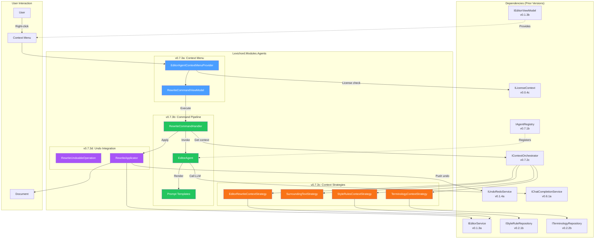
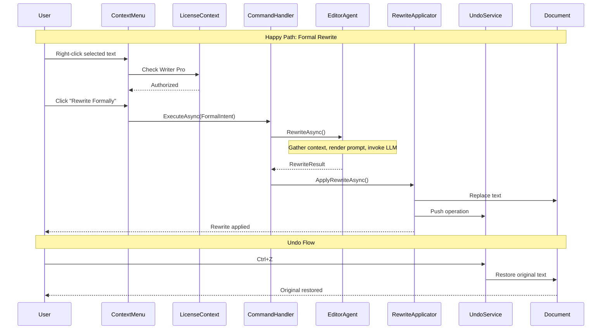

# LCS-DES-073: Design Specification Index — The Editor Agent

## Document Control

| Field | Value |
| :--- | :--- |
| **Document ID** | LCS-DES-073-INDEX |
| **Feature ID** | AGT-073 |
| **Feature Name** | The Editor Agent |
| **Target Version** | v0.7.3 |
| **Module Scope** | Lexichord.Modules.Agents |
| **Swimlane** | Ensemble |
| **License Tier** | Writer Pro |
| **Feature Gate Key** | FeatureFlags.Agents.Editor |
| **Status** | Draft |
| **Last Updated** | 2026-01-27 |

---

## 1. Executive Summary

**v0.7.3** delivers the **Editor Agent** — the first "truly useful" AI assistant integrated directly into Lexichord's editing workflow, enabling context-aware text rewriting via the right-click context menu.

### 1.1 The Problem

Writers frequently need to transform text: making casual prose more formal, simplifying complex passages for broader audiences, or expanding brief statements with additional detail. Currently, this requires:

- Leaving Lexichord to use external AI tools
- Copying text, pasting into another application, copying results back
- Losing document context (style rules, terminology, surrounding text)
- No integration with undo/redo — risky experimentation

### 1.2 The Solution

Implement a context menu-integrated AI rewriting system that:

1. **Integrates Seamlessly** — Right-click any selection to access AI rewrites
2. **Understands Context** — Uses surrounding text, style rules, and terminology
3. **Provides Intent-Based Options** — Formal, Simplify, Expand, and Custom
4. **Supports Safe Experimentation** — Full undo/redo integration
5. **Respects License Tiers** — Writer Pro feature with graceful degradation

### 1.3 Business Value

| Value | Description |
| :--- | :--- |
| **Productivity** | Transform text in seconds, not minutes |
| **Context Awareness** | AI understands style rules and document context |
| **Seamless Integration** | Never leave the editor to use AI |
| **Risk-Free Experimentation** | Full undo/redo for all rewrites |
| **Consistency** | Rewrites respect configured style and terminology |
| **Foundation** | Pattern for all future context-integrated agents |

---

## 2. Related Documents

### 2.1 Scope Breakdown Document

The detailed scope breakdown for v0.7.3, including all sub-parts, implementation checklists, user stories, and acceptance criteria:

| Document | Description |
| :--- | :--- |
| **[LCS-SBD-073](./LCS-SBD-073.md)** | Scope Breakdown — The Editor Agent |

### 2.2 Sub-Part Design Specifications

Each sub-part has its own detailed design specification:

| Sub-Part | Document | Title | Description |
| :--- | :--- | :--- | :--- |
| v0.7.3a | **[LCS-DES-073a](./LCS-DES-073a.md)** | EditorViewModel Integration | Context menu integration and command binding |
| v0.7.3b | **[LCS-DES-073b](./LCS-DES-073b.md)** | Agent Command Pipeline | Rewrite request processing and LLM invocation |
| v0.7.3c | **[LCS-DES-073c](./LCS-DES-073c.md)** | Context-Aware Rewriting | Context strategies and prompt templating |
| v0.7.3d | **[LCS-DES-073d](./LCS-DES-073d.md)** | Undo/Redo Integration | Undoable operations and preview mode |

---

## 3. Architecture Overview

### 3.1 Component Diagram



### 3.2 User Interaction Flow



---

## 4. Dependencies

### 4.1 Upstream Dependencies

| Interface | Source Version | Purpose |
| :--- | :--- | :--- |
| `IAgent` / `BaseAgent` | v0.6.6a-b | Agent base abstraction |
| `IAgentRegistry` | v0.7.1b | Agent discovery and registration |
| `AgentConfiguration` | v0.7.1a | Agent configuration model |
| `IContextOrchestrator` | v0.7.2c | Context assembly |
| `IContextStrategy` | v0.7.2a | Pluggable context gathering |
| `IChatCompletionService` | v0.6.1a | LLM communication |
| `IPromptRenderer` | v0.6.3b | Mustache template rendering |
| `IPromptTemplateRepository` | v0.6.3c | Template storage |
| `IEditorService` | v0.1.3a | Document manipulation |
| `IEditorViewModel` | v0.1.3b | Editor UI state |
| `IStyleRuleRepository` | v0.2.1b | Style rules |
| `ITerminologyRepository` | v0.2.2b | Domain terminology |
| `IUndoRedoService` | v0.1.4a | Undo/redo management |
| `ILicenseContext` | v0.0.4c | License verification |
| `IMediator` | v0.0.7a | Event publishing |

### 4.2 NuGet Packages

| Package | Version | Purpose |
| :--- | :--- | :--- |
| `YamlDotNet` | 15.x | Prompt template parsing |
| `Stubble.Core` | 10.x | Mustache rendering (via v0.6.3b) |
| (No new packages) | — | Uses existing dependencies |

### 4.3 Downstream Consumers (Future)

| Version | Feature | Uses From v0.7.3 |
| :--- | :--- | :--- |
| v0.7.4 | Simplifier Agent | Context strategy patterns |
| v0.7.5 | Tuning Agent | Undo integration patterns |
| v0.7.6 | Summarizer Agent | Agent registration patterns |
| v0.7.7 | Agent Workflows | Command handler patterns |

---

## 5. License Gating Strategy

The Editor Agent is a **Writer Pro** feature.

### 5.1 Gating Behavior

| License Tier | Behavior |
| :--- | :--- |
| **Core/Free** | Context menu shows "Rewrite with AI..." as disabled; lock icon displayed; clicking shows upgrade modal |
| **Writer** | Same as Core — Editor Agent requires Writer Pro |
| **Writer Pro** | Full access to all rewrite commands |
| **Teams** | Full access plus analytics |
| **Enterprise** | Full access plus audit logging |

### 5.2 UI Presentation

```text
Free/Writer License:
┌──────────────────────────────────────────────────────────────────┐
│ ▶ Rewrite with AI...                                   [🔒 Pro] │
│   ├── ✨ Rewrite Formally (disabled)          Ctrl+Shift+R      │
│   ├── 📝 Simplify (disabled)                  Ctrl+Shift+S      │
│   └── ...                                                       │
└──────────────────────────────────────────────────────────────────┘
Tooltip: "Upgrade to Writer Pro to unlock AI-powered rewriting"
Click: Opens upgrade modal
```

---

## 6. Rewrite Intent Types

### 6.1 Available Intents

| Intent | Description | Temperature | Use Case |
| :--- | :--- | :--- | :--- |
| **Formal** | Transform casual text to professional tone | 0.3 | Business documents, formal reports |
| **Simplified** | Reduce complexity for broader audience | 0.4 | User documentation, public content |
| **Expanded** | Add detail and explanation | 0.5 | Elaborating brief notes, adding context |
| **Custom** | User-provided transformation instruction | 0.5 | Any specialized transformation |

### 6.2 Prompt Template Mapping

| Intent | Template ID | Key Behaviors |
| :--- | :--- | :--- |
| Formal | `editor-rewrite-formal` | Replace casual language, use complete sentences, remove contractions |
| Simplified | `editor-rewrite-simplify` | Shorter sentences, plain language, active voice |
| Expanded | `editor-rewrite-expand` | Add examples, elaborate points, include transitions |
| Custom | `editor-rewrite-custom` | Follow user's custom instruction |

---

## 7. Key User Flows

### 7.1 Primary Flow: Context Menu Rewrite

1. User selects text in editor
2. User right-clicks to open context menu
3. User hovers "Rewrite with AI..." submenu
4. User clicks desired rewrite option (e.g., "Rewrite Formally")
5. Progress indicator appears
6. Rewritten text replaces selection
7. Undo entry created

### 7.2 Custom Rewrite Flow

1. User selects text
2. User clicks "Custom Rewrite..." (Ctrl+Shift+C)
3. Custom rewrite dialog opens
4. User enters instruction (e.g., "Make this more persuasive")
5. User clicks "Generate Preview"
6. Preview appears in dialog
7. User clicks "Apply" or "Cancel"
8. If applied, text replaced and undo entry created

### 7.3 Undo/Redo Flow

1. User performs any rewrite
2. User presses Ctrl+Z
3. Original text restored
4. User presses Ctrl+Y
5. Rewritten text restored

---

## 8. Implementation Checklist Summary

| Sub-Part | Tasks | Est. Hours |
| :--- | :--- | :--- |
| v0.7.3a | Context Menu Integration | 9.5 |
| v0.7.3b | Agent Command Pipeline | 13 |
| v0.7.3c | Context-Aware Rewriting | 7.5 |
| v0.7.3d | Undo/Redo Integration | 7.5 |
| Integration | Full workflow tests, DI | 4 |
| **Total** | | **40 hours** |

See [LCS-SBD-073](./LCS-SBD-073.md) Section 4 for the detailed task breakdown.

---

## 9. Success Criteria Summary

| Category | Criterion | Target |
| :--- | :--- | :--- |
| **Performance** | Rewrite time (< 500 words) | < 3 seconds |
| **Performance** | Context assembly time | < 300ms |
| **Performance** | Undo operation time | < 100ms |
| **Quality** | User acceptance rate | > 80% (accept vs. undo) |
| **Reliability** | Error rate | < 1% |
| **Memory** | Per-rewrite allocation | < 10MB |

See [LCS-SBD-073](./LCS-SBD-073.md) Section 9 for full success metrics.

---

## 10. Key Interfaces Summary

### 10.1 New Interfaces

| Interface | Purpose |
| :--- | :--- |
| `IEditorAgentContextMenuProvider` | Provides rewrite commands to context menu |
| `IEditorAgent` | Editor-specific agent for rewriting |
| `IRewriteCommandHandler` | Orchestrates rewrite request pipeline |
| `IRewriteApplicator` | Applies rewrites with undo support |

### 10.2 New Records

| Record | Purpose |
| :--- | :--- |
| `RewriteRequest` | Encapsulates rewrite command input |
| `RewriteResult` | Encapsulates rewrite command output |
| `RewriteProgressUpdate` | Streaming progress information |
| `RewriteCommandOption` | Context menu command definition |

### 10.3 New Events

| Event | Purpose |
| :--- | :--- |
| `RewriteRequestedEvent` | User initiated rewrite |
| `RewriteCompletedEvent` | LLM finished processing |
| `RewriteAppliedEvent` | Rewrite applied to document |
| `RewriteUndoneEvent` | Rewrite reverted via undo |

---

## 11. Context Strategy Summary

| Strategy | Source | Content Gathered |
| :--- | :--- | :--- |
| `EditorRewriteContextStrategy` | Coordinator | Combines all rewrite-specific context |
| `SurroundingTextStrategy` | Editor | Previous/current/next paragraphs |
| `StyleRulesContextStrategy` | Style Repository | Active style rules (top 10) |
| `TerminologyContextStrategy` | Terminology Repository | Relevant domain terms |

---

## 12. What This Enables

| Version | Feature | Uses From v0.7.3 |
| :--- | :--- | :--- |
| v0.7.4 | Simplifier Agent | Context strategies, prompt patterns |
| v0.7.5 | Tuning Agent | Undo integration, command pipeline |
| v0.7.6 | Summarizer Agent | Agent registration, context assembly |
| v0.7.7 | Agent Workflows | Command handlers, result types |
| v0.8.x | Custom Agents | Established patterns for user-defined agents |

---

## 13. Risks and Mitigations

| Risk | Impact | Mitigation |
| :--- | :--- | :--- |
| LLM latency > 3 seconds | Medium | Streaming responses, progress UI, cancel option |
| Poor rewrite quality | High | Carefully crafted prompts, context injection, easy undo |
| Token limit exceeded | Medium | Priority-based context truncation |
| Undo stack corruption | High | Atomic operations, rollback on failure |

See [LCS-SBD-073](./LCS-SBD-073.md) Section 8 for full risk matrix.

---

## 14. Keyboard Shortcuts

| Shortcut | Action |
| :--- | :--- |
| `Ctrl+Shift+R` | Rewrite Formally |
| `Ctrl+Shift+S` | Simplify |
| `Ctrl+Shift+E` | Expand |
| `Ctrl+Shift+C` | Custom Rewrite... |
| `Ctrl+Z` | Undo (including rewrites) |
| `Ctrl+Y` | Redo (including rewrites) |
| `Escape` | Cancel in-progress rewrite |

---

## Document History

| Version | Date | Author | Changes |
| :--- | :--- | :--- | :--- |
| 1.0 | 2026-01-27 | Lead Architect | Initial draft |
