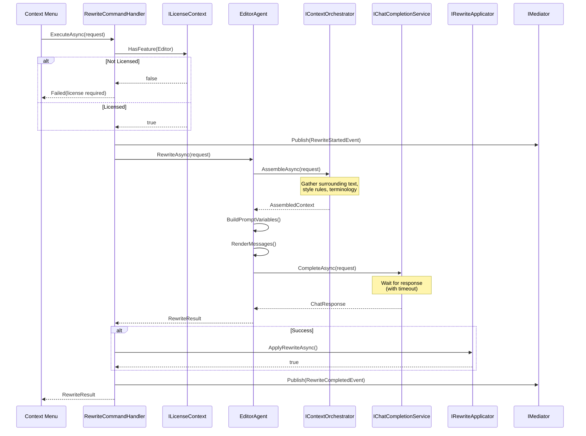

# LCS-DES-073b: Design Specification — Agent Command Pipeline

## 1. Metadata & Categorization

| Field | Value | Description |
| :--- | :--- | :--- |
| **Feature ID** | `AGT-073b` | Sub-part of AGT-073 |
| **Feature Name** | `Agent Command Pipeline` | Rewrite command processing |
| **Target Version** | `v0.7.3b` | Second sub-part of v0.7.3 |
| **Module Scope** | `Lexichord.Modules.Agents` | Agents module |
| **Swimlane** | `Ensemble` | Agent vertical |
| **License Tier** | `Writer Pro` | Requires Writer Pro |
| **Feature Gate Key** | `FeatureFlags.Agents.Editor` | License gate |
| **Author** | Lead Architect | |
| **Status** | `Draft` | |
| **Last Updated** | `2026-01-27` | |
| **Parent Document** | [LCS-DES-073-INDEX](./LCS-DES-073-INDEX.md) | |
| **Scope Breakdown** | [LCS-SBD-073 Section 3.2](./LCS-SBD-073.md#32-v073b-agent-command-pipeline) | |

---

## 2. Executive Summary

### 2.1 The Requirement

When a user triggers a rewrite command, the system must:
1. Gather relevant context from the document
2. Render an appropriate prompt template
3. Invoke the LLM with the request
4. Process and validate the response
5. Apply the result to the document

This requires a robust command pipeline that handles errors, timeouts, and progress indication.

> **Goal:** Implement a complete command pipeline from user action to document update, with streaming progress and error handling.

### 2.2 The Proposed Solution

Implement:
1. `EditorAgent` — The specialized agent for text rewriting
2. `RewriteCommandHandler` — Orchestrates the full rewrite pipeline
3. `RewriteRequest/RewriteResult` — Data models for the operation
4. Prompt templates for each rewrite intent

---

## 3. Architecture & Modular Strategy

### 3.1 Dependencies

#### 3.1.1 Upstream Modules

| Interface | Source Version | Purpose |
| :--- | :--- | :--- |
| `IAgent` | v0.6.6a | Base agent interface |
| `BaseAgent` | v0.6.6b | Agent base class |
| `IAgentRegistry` | v0.7.1b | Agent registration |
| `IContextOrchestrator` | v0.7.2c | Context assembly |
| `IChatCompletionService` | v0.6.1a | LLM communication |
| `IPromptRenderer` | v0.6.3b | Template rendering |
| `IPromptTemplateRepository` | v0.6.3c | Template storage |
| `IRewriteApplicator` | v0.7.3d | Document update |

#### 3.1.2 NuGet Packages

| Package | Version | Purpose |
| :--- | :--- | :--- |
| `YamlDotNet` | 15.x | Prompt template parsing |
| `Stubble.Core` | 10.x | Mustache rendering |

### 3.2 Licensing Behavior

*   **Enforcement:** Server-side license check before LLM invocation
*   **Fallback:** If license expires mid-operation, complete current request but block new ones

---

## 4. Data Contract (The API)

### 4.1 RewriteRequest

```csharp
namespace Lexichord.Modules.Agents.Editor;

/// <summary>
/// A request to rewrite selected text using the Editor Agent.
/// </summary>
public record RewriteRequest
{
    /// <summary>
    /// The text selected by the user for rewriting.
    /// </summary>
    public required string SelectedText { get; init; }

    /// <summary>
    /// The span of the selection in the document.
    /// </summary>
    public required TextSpan SelectionSpan { get; init; }

    /// <summary>
    /// The type of rewrite transformation requested.
    /// </summary>
    public required RewriteIntent Intent { get; init; }

    /// <summary>
    /// Custom instruction for RewriteIntent.Custom.
    /// Required when Intent is Custom.
    /// </summary>
    public string? CustomInstruction { get; init; }

    /// <summary>
    /// Path to the document being edited.
    /// Used for context gathering.
    /// </summary>
    public string? DocumentPath { get; init; }

    /// <summary>
    /// Additional context to include in the prompt.
    /// </summary>
    public IReadOnlyDictionary<string, object>? AdditionalContext { get; init; }

    /// <summary>
    /// Maximum time to wait for LLM response.
    /// Default: 30 seconds.
    /// </summary>
    public TimeSpan Timeout { get; init; } = TimeSpan.FromSeconds(30);

    /// <summary>
    /// Validates the request is properly formed.
    /// </summary>
    /// <exception cref="ArgumentException">Thrown when validation fails.</exception>
    public void Validate()
    {
        if (string.IsNullOrWhiteSpace(SelectedText))
            throw new ArgumentException("Selected text cannot be empty", nameof(SelectedText));

        if (SelectedText.Length > 50000)
            throw new ArgumentException("Selected text exceeds maximum length of 50000 characters", nameof(SelectedText));

        if (Intent == RewriteIntent.Custom && string.IsNullOrWhiteSpace(CustomInstruction))
            throw new ArgumentException("Custom instruction required for custom intent", nameof(CustomInstruction));
    }

    /// <summary>
    /// Estimates the token count for this request.
    /// </summary>
    public int EstimatedTokens => SelectedText.Length / 4 + (CustomInstruction?.Length ?? 0) / 4;
}
```

### 4.2 RewriteResult

```csharp
namespace Lexichord.Modules.Agents.Editor;

/// <summary>
/// The result of a rewrite operation.
/// </summary>
public record RewriteResult
{
    /// <summary>
    /// The original text that was selected.
    /// </summary>
    public required string OriginalText { get; init; }

    /// <summary>
    /// The rewritten text from the LLM.
    /// If failed, this equals OriginalText.
    /// </summary>
    public required string RewrittenText { get; init; }

    /// <summary>
    /// The intent that was applied.
    /// </summary>
    public required RewriteIntent Intent { get; init; }

    /// <summary>
    /// Whether the rewrite completed successfully.
    /// </summary>
    public required bool Success { get; init; }

    /// <summary>
    /// Error message if Success is false.
    /// </summary>
    public string? ErrorMessage { get; init; }

    /// <summary>
    /// Token usage metrics from the LLM.
    /// </summary>
    public required UsageMetrics Usage { get; init; }

    /// <summary>
    /// Total time taken for the operation.
    /// </summary>
    public required TimeSpan Duration { get; init; }

    /// <summary>
    /// Creates a failed result.
    /// </summary>
    public static RewriteResult Failed(
        string originalText,
        RewriteIntent intent,
        string errorMessage,
        TimeSpan duration) => new()
    {
        OriginalText = originalText,
        RewrittenText = originalText, // Return original on failure
        Intent = intent,
        Success = false,
        ErrorMessage = errorMessage,
        Usage = UsageMetrics.Empty,
        Duration = duration
    };
}

/// <summary>
/// Token usage metrics from an LLM operation.
/// </summary>
public record UsageMetrics(
    int PromptTokens,
    int CompletionTokens,
    int TotalTokens)
{
    public static UsageMetrics Empty => new(0, 0, 0);

    public decimal EstimatedCost(decimal costPer1kTokens) =>
        (TotalTokens / 1000m) * costPer1kTokens;
}
```

### 4.3 RewriteProgressUpdate

```csharp
namespace Lexichord.Modules.Agents.Editor;

/// <summary>
/// Progress update during a streaming rewrite operation.
/// </summary>
public record RewriteProgressUpdate
{
    /// <summary>
    /// Partial text received so far (for streaming display).
    /// </summary>
    public required string PartialText { get; init; }

    /// <summary>
    /// Progress percentage (0-100).
    /// </summary>
    public required double ProgressPercentage { get; init; }

    /// <summary>
    /// Current state of the operation.
    /// </summary>
    public required RewriteProgressState State { get; init; }

    /// <summary>
    /// Optional status message.
    /// </summary>
    public string? StatusMessage { get; init; }
}

/// <summary>
/// States during rewrite progress.
/// </summary>
public enum RewriteProgressState
{
    /// <summary>
    /// Initializing the operation.
    /// </summary>
    Initializing,

    /// <summary>
    /// Gathering context from document.
    /// </summary>
    GatheringContext,

    /// <summary>
    /// Waiting for/receiving LLM response.
    /// </summary>
    GeneratingRewrite,

    /// <summary>
    /// Operation completed successfully.
    /// </summary>
    Completed,

    /// <summary>
    /// Operation failed.
    /// </summary>
    Failed
}
```

### 4.4 IRewriteCommandHandler

```csharp
namespace Lexichord.Modules.Agents.Editor;

/// <summary>
/// Handles rewrite command execution from user action to document update.
/// </summary>
public interface IRewriteCommandHandler
{
    /// <summary>
    /// Executes a rewrite command synchronously (waits for completion).
    /// </summary>
    /// <param name="request">The rewrite request.</param>
    /// <param name="ct">Cancellation token.</param>
    /// <returns>The complete rewrite result.</returns>
    Task<RewriteResult> ExecuteAsync(RewriteRequest request, CancellationToken ct = default);

    /// <summary>
    /// Executes a rewrite with streaming progress updates.
    /// </summary>
    /// <param name="request">The rewrite request.</param>
    /// <param name="ct">Cancellation token.</param>
    /// <returns>Async enumerable of progress updates.</returns>
    IAsyncEnumerable<RewriteProgressUpdate> ExecuteStreamingAsync(
        RewriteRequest request,
        CancellationToken ct = default);

    /// <summary>
    /// Cancels any in-progress rewrite operation.
    /// </summary>
    void Cancel();

    /// <summary>
    /// Gets whether a rewrite is currently in progress.
    /// </summary>
    bool IsExecuting { get; }
}
```

### 4.5 IEditorAgent

```csharp
namespace Lexichord.Modules.Agents.Editor;

/// <summary>
/// Editor Agent specialized for text rewriting operations.
/// Extends the base IAgent with rewrite-specific methods.
/// </summary>
public interface IEditorAgent : IAgent
{
    /// <summary>
    /// Performs a text rewrite according to the specified intent.
    /// </summary>
    /// <param name="request">The rewrite request.</param>
    /// <param name="ct">Cancellation token.</param>
    /// <returns>The rewrite result.</returns>
    Task<RewriteResult> RewriteAsync(RewriteRequest request, CancellationToken ct = default);

    /// <summary>
    /// Performs a streaming rewrite with progress updates.
    /// </summary>
    /// <param name="request">The rewrite request.</param>
    /// <param name="ct">Cancellation token.</param>
    /// <returns>Async enumerable of progress updates.</returns>
    IAsyncEnumerable<RewriteProgressUpdate> RewriteStreamingAsync(
        RewriteRequest request,
        CancellationToken ct = default);

    /// <summary>
    /// Gets the prompt template ID for a given intent.
    /// </summary>
    string GetTemplateId(RewriteIntent intent);
}
```

---

## 5. Implementation Logic

### 5.1 EditorAgent Implementation

```csharp
namespace Lexichord.Modules.Agents.Editor;

/// <summary>
/// The Editor Agent - specializes in text rewriting with context awareness.
/// </summary>
[RequiresLicense(LicenseTier.WriterPro)]
[AgentDefinition("editor", "The Editor", "Grammar, clarity, and text transformation")]
public class EditorAgent : BaseAgent, IEditorAgent
{
    private readonly IContextOrchestrator _contextOrchestrator;
    private readonly IStyleRuleRepository _styleRules;
    private readonly ILogger<EditorAgent> _logger;

    public EditorAgent(
        IChatCompletionService llm,
        IPromptRenderer renderer,
        IPromptTemplateRepository templates,
        IContextOrchestrator contextOrchestrator,
        IStyleRuleRepository styleRules,
        ILogger<EditorAgent> logger)
        : base(llm, renderer, templates, logger)
    {
        _contextOrchestrator = contextOrchestrator;
        _styleRules = styleRules;
        _logger = logger;
    }

    #region IAgent Implementation

    public override string AgentId => "editor";
    public override string Name => "The Editor";
    public override string Description => "Transforms text while respecting context and style rules.";

    public override AgentCapabilities Capabilities =>
        AgentCapabilities.Chat |
        AgentCapabilities.DocumentContext |
        AgentCapabilities.StyleEnforcement;

    protected override ChatOptions GetDefaultOptions() => new(
        Model: "gpt-4o",
        Temperature: 0.3f,
        MaxTokens: 2048
    );

    #endregion

    #region IEditorAgent Implementation

    public string GetTemplateId(RewriteIntent intent) => intent switch
    {
        RewriteIntent.Formal => "editor-rewrite-formal",
        RewriteIntent.Simplified => "editor-rewrite-simplify",
        RewriteIntent.Expanded => "editor-rewrite-expand",
        RewriteIntent.Custom => "editor-rewrite-custom",
        _ => throw new ArgumentOutOfRangeException(nameof(intent))
    };

    public async Task<RewriteResult> RewriteAsync(
        RewriteRequest request,
        CancellationToken ct = default)
    {
        request.Validate();

        var stopwatch = Stopwatch.StartNew();

        try
        {
            _logger.LogInformation(
                "Starting {Intent} rewrite for {CharCount} characters",
                request.Intent, request.SelectedText.Length);

            // 1. Gather context
            var context = await GatherRewriteContextAsync(request, ct);

            // 2. Get template
            var templateId = GetTemplateId(request.Intent);
            var template = Templates.GetTemplate(templateId);

            // 3. Build prompt variables
            var variables = BuildPromptVariables(request, context);

            // 4. Render prompt
            var messages = Renderer.RenderMessages(template, variables);

            // 5. Get chat options (adjust temperature for intent)
            var options = GetOptionsForIntent(request.Intent);

            // 6. Invoke LLM
            using var timeoutCts = new CancellationTokenSource(request.Timeout);
            using var linkedCts = CancellationTokenSource.CreateLinkedTokenSource(ct, timeoutCts.Token);

            var response = await Llm.CompleteAsync(
                new ChatRequest(messages, options),
                linkedCts.Token);

            stopwatch.Stop();

            _logger.LogInformation(
                "Completed {Intent} rewrite: {OriginalLength} -> {RewrittenLength} chars in {DurationMs}ms",
                request.Intent,
                request.SelectedText.Length,
                response.Content.Length,
                stopwatch.ElapsedMilliseconds);

            return new RewriteResult
            {
                OriginalText = request.SelectedText,
                RewrittenText = response.Content.Trim(),
                Intent = request.Intent,
                Success = true,
                ErrorMessage = null,
                Usage = new UsageMetrics(
                    response.PromptTokens,
                    response.CompletionTokens,
                    response.PromptTokens + response.CompletionTokens),
                Duration = stopwatch.Elapsed
            };
        }
        catch (OperationCanceledException) when (ct.IsCancellationRequested)
        {
            stopwatch.Stop();
            _logger.LogWarning("Rewrite cancelled by user");
            return RewriteResult.Failed(
                request.SelectedText,
                request.Intent,
                "Rewrite cancelled",
                stopwatch.Elapsed);
        }
        catch (OperationCanceledException)
        {
            stopwatch.Stop();
            _logger.LogWarning("Rewrite timed out after {Timeout}", request.Timeout);
            return RewriteResult.Failed(
                request.SelectedText,
                request.Intent,
                $"Rewrite timed out after {request.Timeout.TotalSeconds} seconds",
                stopwatch.Elapsed);
        }
        catch (Exception ex)
        {
            stopwatch.Stop();
            _logger.LogError(ex, "Rewrite failed for {Intent}", request.Intent);
            return RewriteResult.Failed(
                request.SelectedText,
                request.Intent,
                ex.Message,
                stopwatch.Elapsed);
        }
    }

    public async IAsyncEnumerable<RewriteProgressUpdate> RewriteStreamingAsync(
        RewriteRequest request,
        [EnumeratorCancellation] CancellationToken ct = default)
    {
        request.Validate();

        yield return new RewriteProgressUpdate
        {
            PartialText = string.Empty,
            ProgressPercentage = 0,
            State = RewriteProgressState.Initializing,
            StatusMessage = "Preparing rewrite..."
        };

        // Gather context
        yield return new RewriteProgressUpdate
        {
            PartialText = string.Empty,
            ProgressPercentage = 10,
            State = RewriteProgressState.GatheringContext,
            StatusMessage = "Gathering document context..."
        };

        var context = await GatherRewriteContextAsync(request, ct);

        yield return new RewriteProgressUpdate
        {
            PartialText = string.Empty,
            ProgressPercentage = 25,
            State = RewriteProgressState.GeneratingRewrite,
            StatusMessage = "Generating rewrite..."
        };

        // Build and invoke
        var templateId = GetTemplateId(request.Intent);
        var template = Templates.GetTemplate(templateId);
        var variables = BuildPromptVariables(request, context);
        var messages = Renderer.RenderMessages(template, variables);
        var options = GetOptionsForIntent(request.Intent);

        var partialText = new StringBuilder();

        await foreach (var chunk in Llm.StreamAsync(new ChatRequest(messages, options), ct))
        {
            partialText.Append(chunk.Content);

            // Estimate progress based on expected output length
            var estimatedCompletion = Math.Min(
                25 + (partialText.Length / (float)request.SelectedText.Length) * 70,
                95);

            yield return new RewriteProgressUpdate
            {
                PartialText = partialText.ToString(),
                ProgressPercentage = estimatedCompletion,
                State = RewriteProgressState.GeneratingRewrite,
                StatusMessage = "Generating rewrite..."
            };
        }

        yield return new RewriteProgressUpdate
        {
            PartialText = partialText.ToString().Trim(),
            ProgressPercentage = 100,
            State = RewriteProgressState.Completed,
            StatusMessage = "Rewrite complete"
        };
    }

    #endregion

    #region Private Methods

    private async Task<AssembledContext> GatherRewriteContextAsync(
        RewriteRequest request,
        CancellationToken ct)
    {
        var gatheringRequest = new ContextGatheringRequest(
            DocumentPath: request.DocumentPath,
            CursorPosition: request.SelectionSpan.Start,
            SelectedText: request.SelectedText,
            AgentId: AgentId,
            Hints: request.AdditionalContext);

        var budget = new ContextBudget(
            MaxTokens: 4000,
            RequiredStrategies: new[] { "style", "terminology" },
            ExcludedStrategies: null);

        return await _contextOrchestrator.AssembleAsync(gatheringRequest, budget, ct);
    }

    private Dictionary<string, object> BuildPromptVariables(
        RewriteRequest request,
        AssembledContext context)
    {
        var variables = new Dictionary<string, object>
        {
            ["selection"] = request.SelectedText
        };

        // Add context fragments
        foreach (var fragment in context.Fragments)
        {
            switch (fragment.SourceId)
            {
                case "surrounding-text":
                    variables["surrounding_context"] = fragment.Content;
                    break;
                case "style-rules":
                    variables["style_rules"] = fragment.Content;
                    break;
                case "terminology":
                    variables["terminology"] = fragment.Content;
                    break;
            }
        }

        // Add custom instruction if present
        if (!string.IsNullOrEmpty(request.CustomInstruction))
        {
            variables["custom_instruction"] = request.CustomInstruction;
        }

        // Add context variables
        foreach (var (key, value) in context.Variables)
        {
            variables[key] = value;
        }

        return variables;
    }

    private ChatOptions GetOptionsForIntent(RewriteIntent intent)
    {
        var baseOptions = GetDefaultOptions();

        // Adjust temperature based on intent
        var temperature = intent switch
        {
            RewriteIntent.Formal => 0.3f,      // Consistent, professional
            RewriteIntent.Simplified => 0.4f,  // Some variation for readability
            RewriteIntent.Expanded => 0.5f,    // More creative for expansion
            RewriteIntent.Custom => 0.5f,      // Balanced for custom
            _ => 0.3f
        };

        return baseOptions with { Temperature = temperature };
    }

    #endregion
}
```

### 5.2 RewriteCommandHandler Implementation

```csharp
namespace Lexichord.Modules.Agents.Editor;

/// <summary>
/// Orchestrates the complete rewrite command pipeline.
/// </summary>
public class RewriteCommandHandler : IRewriteCommandHandler
{
    private readonly IEditorAgent _editorAgent;
    private readonly IRewriteApplicator _applicator;
    private readonly IMediator _mediator;
    private readonly ILicenseContext _licenseContext;
    private readonly ILogger<RewriteCommandHandler> _logger;

    private CancellationTokenSource? _currentCts;

    public bool IsExecuting { get; private set; }

    public RewriteCommandHandler(
        IEditorAgent editorAgent,
        IRewriteApplicator applicator,
        IMediator mediator,
        ILicenseContext licenseContext,
        ILogger<RewriteCommandHandler> logger)
    {
        _editorAgent = editorAgent;
        _applicator = applicator;
        _mediator = mediator;
        _licenseContext = licenseContext;
        _logger = logger;
    }

    public async Task<RewriteResult> ExecuteAsync(
        RewriteRequest request,
        CancellationToken ct = default)
    {
        // Verify license
        if (!_licenseContext.HasFeature(FeatureFlags.Agents.Editor))
        {
            _logger.LogWarning("Rewrite attempted without valid license");
            return RewriteResult.Failed(
                request.SelectedText,
                request.Intent,
                "Writer Pro license required for AI rewriting",
                TimeSpan.Zero);
        }

        // Track execution state
        IsExecuting = true;
        _currentCts = CancellationTokenSource.CreateLinkedTokenSource(ct);

        try
        {
            // Publish start event
            await _mediator.Publish(new RewriteStartedEvent(
                request.Intent,
                request.SelectedText.Length,
                request.DocumentPath), _currentCts.Token);

            // Execute rewrite
            var result = await _editorAgent.RewriteAsync(request, _currentCts.Token);

            if (result.Success)
            {
                // Apply to document
                var applied = await _applicator.ApplyRewriteAsync(
                    request.DocumentPath!,
                    request.SelectionSpan,
                    result,
                    _currentCts.Token);

                if (!applied)
                {
                    result = result with
                    {
                        Success = false,
                        ErrorMessage = "Failed to apply rewrite to document"
                    };
                }
            }

            // Publish completion event
            await _mediator.Publish(new RewriteCompletedEvent(
                result.Intent,
                result.Success,
                result.Usage,
                result.Duration), _currentCts.Token);

            return result;
        }
        finally
        {
            IsExecuting = false;
            _currentCts?.Dispose();
            _currentCts = null;
        }
    }

    public async IAsyncEnumerable<RewriteProgressUpdate> ExecuteStreamingAsync(
        RewriteRequest request,
        [EnumeratorCancellation] CancellationToken ct = default)
    {
        // Verify license
        if (!_licenseContext.HasFeature(FeatureFlags.Agents.Editor))
        {
            yield return new RewriteProgressUpdate
            {
                PartialText = string.Empty,
                ProgressPercentage = 0,
                State = RewriteProgressState.Failed,
                StatusMessage = "Writer Pro license required"
            };
            yield break;
        }

        IsExecuting = true;
        _currentCts = CancellationTokenSource.CreateLinkedTokenSource(ct);

        RewriteResult? finalResult = null;

        try
        {
            await foreach (var update in _editorAgent.RewriteStreamingAsync(request, _currentCts.Token))
            {
                yield return update;

                // Capture final result when completed
                if (update.State == RewriteProgressState.Completed)
                {
                    finalResult = new RewriteResult
                    {
                        OriginalText = request.SelectedText,
                        RewrittenText = update.PartialText,
                        Intent = request.Intent,
                        Success = true,
                        ErrorMessage = null,
                        Usage = UsageMetrics.Empty, // Not available in streaming
                        Duration = TimeSpan.Zero    // Not tracked in streaming
                    };
                }
            }

            // Apply result to document
            if (finalResult?.Success == true)
            {
                var applied = await _applicator.ApplyRewriteAsync(
                    request.DocumentPath!,
                    request.SelectionSpan,
                    finalResult,
                    _currentCts.Token);

                if (!applied)
                {
                    yield return new RewriteProgressUpdate
                    {
                        PartialText = finalResult.RewrittenText,
                        ProgressPercentage = 100,
                        State = RewriteProgressState.Failed,
                        StatusMessage = "Failed to apply rewrite to document"
                    };
                }
            }
        }
        finally
        {
            IsExecuting = false;
            _currentCts?.Dispose();
            _currentCts = null;
        }
    }

    public void Cancel()
    {
        if (_currentCts is not null && !_currentCts.IsCancellationRequested)
        {
            _logger.LogInformation("Cancelling in-progress rewrite");
            _currentCts.Cancel();
        }
    }
}
```

### 5.3 Flow Diagram



---

## 6. Prompt Templates

### 6.1 editor-rewrite-formal.yaml

```yaml
template_id: "editor-rewrite-formal"
name: "Formal Rewrite"
description: "Transforms text to formal, professional tone"
version: "1.0.0"

system_prompt: |
  You are an expert editor specializing in formal, professional writing.
  Your task is to rewrite the given text in a more formal, professional tone.

  ## Guidelines

  ### Tone and Style
  - Replace casual language with formal equivalents
  - Use complete sentences and avoid contractions (don't → do not)
  - Maintain a professional, authoritative voice
  - Remove colloquialisms and slang

  ### Structure
  - Preserve all factual content and meaning
  - Keep technical terms intact
  - Maintain logical flow and paragraph structure

  ### Vocabulary
  - Use precise, professional vocabulary
  - Avoid filler words (like, basically, really, very)
  - Prefer formal transitions (however, therefore, consequently)

  {{#style_rules}}
  ## Style Rules to Follow
  {{style_rules}}
  {{/style_rules}}

  {{#terminology}}
  ## Terminology to Respect
  {{terminology}}
  {{/terminology}}

  ## IMPORTANT
  Return ONLY the rewritten text. Do not include:
  - Explanations or commentary
  - Alternative versions
  - Markdown formatting around the text
  - Quotes or delimiters

  The output should be ready to paste directly into the document.

user_prompt: |
  {{#surrounding_context}}
  ## Context (preceding and following text)
  """
  {{surrounding_context}}
  """

  {{/surrounding_context}}
  Rewrite the following text in a formal, professional tone:

  """
  {{selection}}
  """
```

### 6.2 editor-rewrite-simplify.yaml

```yaml
template_id: "editor-rewrite-simplify"
name: "Simplify Rewrite"
description: "Simplifies text for broader audience"
version: "1.0.0"

system_prompt: |
  You are an expert at making complex text accessible to a broader audience.
  Your task is to simplify the given text while preserving its meaning.

  ## Guidelines

  ### Sentence Structure
  - Use shorter sentences (aim for 15-20 words maximum)
  - One idea per sentence
  - Use active voice instead of passive

  ### Vocabulary
  - Replace jargon with plain language
  - Explain or spell out abbreviations
  - Use common words over technical ones (when possible)

  ### Clarity
  - Break complex ideas into simpler steps
  - Add transitional phrases for flow
  - Remove unnecessary qualifiers

  ### Preservation
  - Maintain accuracy - don't oversimplify facts
  - Keep essential technical terms (but explain if needed)
  - Preserve the author's core message

  {{#style_rules}}
  ## Style Rules to Follow
  {{style_rules}}
  {{/style_rules}}

  ## IMPORTANT
  Return ONLY the simplified text. Do not include explanations or alternatives.

user_prompt: |
  {{#surrounding_context}}
  ## Context
  """
  {{surrounding_context}}
  """

  {{/surrounding_context}}
  Simplify the following text for a general audience:

  """
  {{selection}}
  """
```

### 6.3 editor-rewrite-expand.yaml

```yaml
template_id: "editor-rewrite-expand"
name: "Expand Rewrite"
description: "Expands text with more detail and explanation"
version: "1.0.0"

system_prompt: |
  You are an expert at elaborating concise text into more detailed content.
  Your task is to expand the given text with additional detail and explanation.

  ## Guidelines

  ### Expansion Techniques
  - Add relevant details and examples
  - Expand abbreviations and acronyms
  - Include transitional phrases for flow
  - Elaborate on key points

  ### Proportionality
  - Keep expansion proportional (typically 2-3x original length)
  - Don't pad with unnecessary filler
  - Each addition should add value

  ### Consistency
  - Maintain the original tone and style
  - Don't contradict the original content
  - Build on existing ideas, don't introduce tangents

  {{#style_rules}}
  ## Style Rules to Follow
  {{style_rules}}
  {{/style_rules}}

  {{#terminology}}
  ## Terminology to Respect
  {{terminology}}
  {{/terminology}}

  ## IMPORTANT
  Return ONLY the expanded text. Do not include explanations.

user_prompt: |
  {{#surrounding_context}}
  ## Context
  """
  {{surrounding_context}}
  """

  {{/surrounding_context}}
  Expand the following text with more detail and explanation:

  """
  {{selection}}
  """
```

### 6.4 editor-rewrite-custom.yaml

```yaml
template_id: "editor-rewrite-custom"
name: "Custom Rewrite"
description: "Custom transformation with user instruction"
version: "1.0.0"

system_prompt: |
  You are an expert editor capable of transforming text according to specific instructions.
  Follow the user's custom instruction precisely.

  {{#style_rules}}
  ## Style Rules to Follow
  {{style_rules}}
  {{/style_rules}}

  {{#terminology}}
  ## Terminology to Respect
  {{terminology}}
  {{/terminology}}

  ## IMPORTANT
  Return ONLY the rewritten text. Do not include:
  - Explanations of your changes
  - Alternative versions
  - Commentary or suggestions

  The output should be ready to paste directly into the document.

user_prompt: |
  {{#surrounding_context}}
  ## Context
  """
  {{surrounding_context}}
  """

  {{/surrounding_context}}
  ## Instruction
  {{custom_instruction}}

  ## Text to Rewrite
  """
  {{selection}}
  """
```

---

## 7. Observability & Logging

| Level | Source | Message Template |
| :--- | :--- | :--- |
| Info | EditorAgent | `Starting {Intent} rewrite for {CharCount} characters` |
| Info | EditorAgent | `Completed {Intent} rewrite: {OriginalLength} -> {RewrittenLength} chars in {DurationMs}ms` |
| Warning | EditorAgent | `Rewrite cancelled by user` |
| Warning | EditorAgent | `Rewrite timed out after {Timeout}` |
| Error | EditorAgent | `Rewrite failed for {Intent}: {ErrorMessage}` |
| Warning | RewriteCommandHandler | `Rewrite attempted without valid license` |
| Info | RewriteCommandHandler | `Cancelling in-progress rewrite` |
| Debug | EditorAgent | `Context gathered: {FragmentCount} fragments, {TotalTokens} tokens` |

---

## 8. Security & Safety

| Risk | Level | Mitigation |
| :--- | :--- | :--- |
| Prompt injection via selection | Medium | Selection is always wrapped in delimiters; system prompt establishes context |
| LLM generating harmful content | Low | Using established LLM safety features; content is user-controlled input |
| Token limit attacks | Medium | Maximum selection size (50000 chars); context budget limits |
| Rate limiting bypass | Medium | Server-side rate limiting independent of client |

---

## 9. Acceptance Criteria

| # | Given | When | Then |
| :--- | :--- | :--- | :--- |
| 1 | Valid request with Formal intent | ExecuteAsync called | Returns formal rewritten text |
| 2 | Valid request with Simplified intent | ExecuteAsync called | Returns simplified text |
| 3 | Valid request with Expanded intent | ExecuteAsync called | Returns expanded text |
| 4 | Valid request with Custom intent and instruction | ExecuteAsync called | Returns text per instruction |
| 5 | Request without license | ExecuteAsync called | Returns failed result with license error |
| 6 | Request exceeds timeout | ExecuteAsync called | Returns failed result with timeout error |
| 7 | Request cancelled | Cancel() called | Returns failed result with cancelled message |
| 8 | Streaming request | ExecuteStreamingAsync called | Yields progress updates |
| 9 | Empty selection | Validate() called | Throws ArgumentException |
| 10 | Custom intent without instruction | Validate() called | Throws ArgumentException |

---

## 10. Unit Testing Requirements

### 10.1 EditorAgentTests

```csharp
[Trait("Category", "Unit")]
[Trait("Version", "v0.7.3b")]
public class EditorAgentTests
{
    private Mock<IChatCompletionService> _llm;
    private Mock<IContextOrchestrator> _contextOrchestrator;
    private EditorAgent _sut;

    [SetUp]
    public void Setup()
    {
        _llm = new Mock<IChatCompletionService>();
        _contextOrchestrator = new Mock<IContextOrchestrator>();

        _sut = new EditorAgent(
            _llm.Object,
            Mock.Of<IPromptRenderer>(),
            Mock.Of<IPromptTemplateRepository>(),
            _contextOrchestrator.Object,
            Mock.Of<IStyleRuleRepository>(),
            Mock.Of<ILogger<EditorAgent>>());
    }

    [Fact]
    public async Task RewriteAsync_FormalIntent_ReturnsRewrittenText()
    {
        // Arrange
        _contextOrchestrator.Setup(c => c.AssembleAsync(
            It.IsAny<ContextGatheringRequest>(),
            It.IsAny<ContextBudget>(),
            It.IsAny<CancellationToken>()))
            .ReturnsAsync(AssembledContext.Empty);

        _llm.Setup(l => l.CompleteAsync(
            It.IsAny<ChatRequest>(),
            It.IsAny<CancellationToken>()))
            .ReturnsAsync(new ChatResponse("Hello, how are you?", 10, 15));

        var request = CreateRequest(RewriteIntent.Formal, "hey whats up");

        // Act
        var result = await _sut.RewriteAsync(request);

        // Assert
        result.Success.Should().BeTrue();
        result.RewrittenText.Should().Be("Hello, how are you?");
        result.Intent.Should().Be(RewriteIntent.Formal);
        result.Usage.PromptTokens.Should().Be(10);
        result.Usage.CompletionTokens.Should().Be(15);
    }

    [Fact]
    public async Task RewriteAsync_Timeout_ReturnsFailedResult()
    {
        // Arrange
        _contextOrchestrator.Setup(c => c.AssembleAsync(
            It.IsAny<ContextGatheringRequest>(),
            It.IsAny<ContextBudget>(),
            It.IsAny<CancellationToken>()))
            .ReturnsAsync(AssembledContext.Empty);

        _llm.Setup(l => l.CompleteAsync(
            It.IsAny<ChatRequest>(),
            It.IsAny<CancellationToken>()))
            .ThrowsAsync(new OperationCanceledException());

        var request = CreateRequest(RewriteIntent.Formal, "test")
            with { Timeout = TimeSpan.FromMilliseconds(1) };

        // Act
        var result = await _sut.RewriteAsync(request);

        // Assert
        result.Success.Should().BeFalse();
        result.ErrorMessage.Should().Contain("timed out");
        result.RewrittenText.Should().Be("test"); // Original preserved
    }

    [Theory]
    [InlineData(RewriteIntent.Formal, "editor-rewrite-formal")]
    [InlineData(RewriteIntent.Simplified, "editor-rewrite-simplify")]
    [InlineData(RewriteIntent.Expanded, "editor-rewrite-expand")]
    [InlineData(RewriteIntent.Custom, "editor-rewrite-custom")]
    public void GetTemplateId_ReturnsCorrectTemplate(RewriteIntent intent, string expectedId)
    {
        // Act
        var templateId = _sut.GetTemplateId(intent);

        // Assert
        templateId.Should().Be(expectedId);
    }

    private static RewriteRequest CreateRequest(RewriteIntent intent, string text) => new()
    {
        SelectedText = text,
        SelectionSpan = new TextSpan(0, text.Length),
        Intent = intent,
        CustomInstruction = intent == RewriteIntent.Custom ? "Make it better" : null,
        DocumentPath = "/test.md"
    };
}
```

### 10.2 RewriteCommandHandlerTests

```csharp
[Trait("Category", "Unit")]
[Trait("Version", "v0.7.3b")]
public class RewriteCommandHandlerTests
{
    private Mock<IEditorAgent> _agent;
    private Mock<IRewriteApplicator> _applicator;
    private Mock<ILicenseContext> _license;
    private RewriteCommandHandler _sut;

    [SetUp]
    public void Setup()
    {
        _agent = new Mock<IEditorAgent>();
        _applicator = new Mock<IRewriteApplicator>();
        _license = new Mock<ILicenseContext>();

        _sut = new RewriteCommandHandler(
            _agent.Object,
            _applicator.Object,
            Mock.Of<IMediator>(),
            _license.Object,
            Mock.Of<ILogger<RewriteCommandHandler>>());
    }

    [Fact]
    public async Task ExecuteAsync_WithLicense_ReturnsResult()
    {
        // Arrange
        _license.Setup(l => l.HasFeature(FeatureFlags.Agents.Editor)).Returns(true);
        _agent.Setup(a => a.RewriteAsync(It.IsAny<RewriteRequest>(), It.IsAny<CancellationToken>()))
            .ReturnsAsync(CreateSuccessResult());
        _applicator.Setup(a => a.ApplyRewriteAsync(
            It.IsAny<string>(),
            It.IsAny<TextSpan>(),
            It.IsAny<RewriteResult>(),
            It.IsAny<CancellationToken>()))
            .ReturnsAsync(true);

        // Act
        var result = await _sut.ExecuteAsync(CreateRequest());

        // Assert
        result.Success.Should().BeTrue();
    }

    [Fact]
    public async Task ExecuteAsync_WithoutLicense_ReturnsFailure()
    {
        // Arrange
        _license.Setup(l => l.HasFeature(FeatureFlags.Agents.Editor)).Returns(false);

        // Act
        var result = await _sut.ExecuteAsync(CreateRequest());

        // Assert
        result.Success.Should().BeFalse();
        result.ErrorMessage.Should().Contain("license");
    }

    [Fact]
    public async Task ExecuteAsync_SetsIsExecuting()
    {
        // Arrange
        _license.Setup(l => l.HasFeature(FeatureFlags.Agents.Editor)).Returns(true);
        var tcs = new TaskCompletionSource<RewriteResult>();
        _agent.Setup(a => a.RewriteAsync(It.IsAny<RewriteRequest>(), It.IsAny<CancellationToken>()))
            .Returns(tcs.Task);

        // Act
        var task = _sut.ExecuteAsync(CreateRequest());
        var wasExecuting = _sut.IsExecuting;
        tcs.SetResult(CreateSuccessResult());
        await task;

        // Assert
        wasExecuting.Should().BeTrue();
        _sut.IsExecuting.Should().BeFalse();
    }

    private static RewriteRequest CreateRequest() => new()
    {
        SelectedText = "test",
        SelectionSpan = new TextSpan(0, 4),
        Intent = RewriteIntent.Formal,
        DocumentPath = "/test.md"
    };

    private static RewriteResult CreateSuccessResult() => new()
    {
        OriginalText = "test",
        RewrittenText = "Test.",
        Intent = RewriteIntent.Formal,
        Success = true,
        Usage = new UsageMetrics(10, 10, 20),
        Duration = TimeSpan.FromSeconds(1)
    };
}
```

---

## 11. Deliverable Checklist

| # | Deliverable | Status |
| :--- | :--- | :--- |
| 1 | `RewriteRequest.cs` record | [ ] |
| 2 | `RewriteResult.cs` record | [ ] |
| 3 | `RewriteProgressUpdate.cs` record | [ ] |
| 4 | `UsageMetrics.cs` record | [ ] |
| 5 | `IEditorAgent.cs` interface | [ ] |
| 6 | `EditorAgent.cs` implementation | [ ] |
| 7 | `IRewriteCommandHandler.cs` interface | [ ] |
| 8 | `RewriteCommandHandler.cs` implementation | [ ] |
| 9 | `editor-rewrite-formal.yaml` template | [ ] |
| 10 | `editor-rewrite-simplify.yaml` template | [ ] |
| 11 | `editor-rewrite-expand.yaml` template | [ ] |
| 12 | `editor-rewrite-custom.yaml` template | [ ] |
| 13 | Unit tests for EditorAgent | [ ] |
| 14 | Unit tests for RewriteCommandHandler | [ ] |
| 15 | DI registration | [ ] |

---

## 12. Verification Commands

```bash
# Run all v0.7.3b tests
dotnet test --filter "Version=v0.7.3b" --logger "console;verbosity=detailed"

# Run agent tests
dotnet test --filter "FullyQualifiedName~EditorAgentTests"

# Run handler tests
dotnet test --filter "FullyQualifiedName~RewriteCommandHandlerTests"

# Verify prompt templates exist
ls -la src/Lexichord.Modules.Agents/Prompts/editor-rewrite-*.yaml

# Manual verification:
# 1. Select casual text, trigger "Rewrite Formally"
#    Expected: Formal rewrite appears
# 2. Observe progress indicator during rewrite
#    Expected: Progress shown from 0-100%
# 3. Cancel mid-rewrite
#    Expected: Original text preserved
# 4. Test with slow network
#    Expected: Timeout error after 30s
```

---

## Document History

| Version | Date | Author | Changes |
| :--- | :--- | :--- | :--- |
| 1.0 | 2026-01-27 | Lead Architect | Initial draft |
