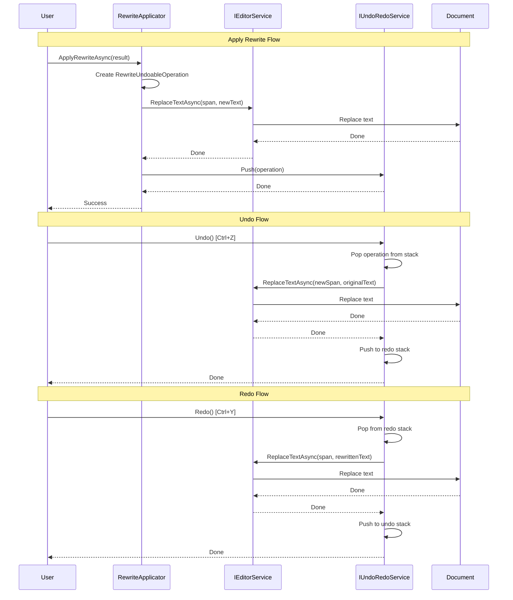
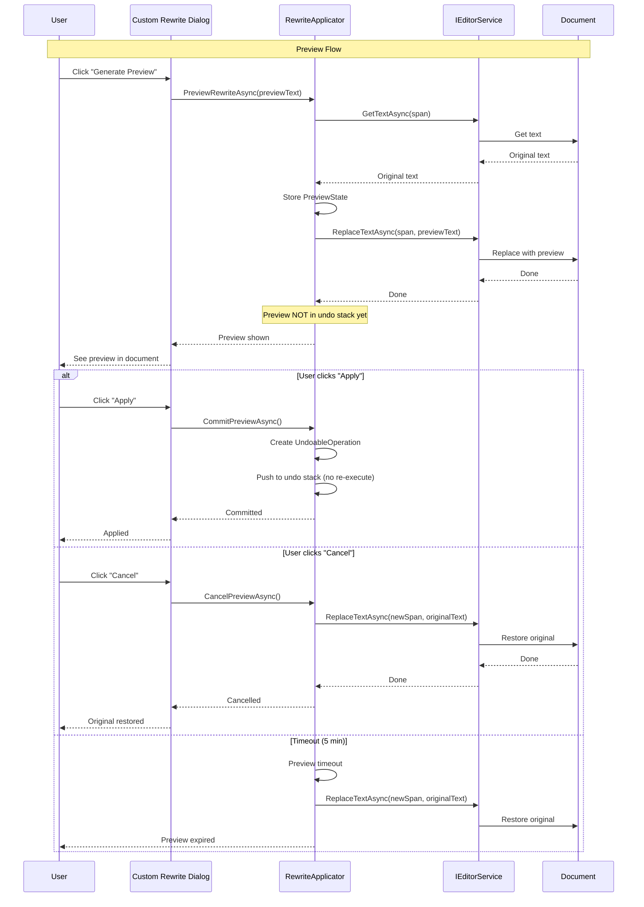

# LCS-DES-073d: Design Specification — Undo/Redo Integration

## 1. Metadata & Categorization

| Field | Value | Description |
| :--- | :--- | :--- |
| **Feature ID** | `AGT-073d` | Sub-part of AGT-073 |
| **Feature Name** | `Undo/Redo Integration` | Undoable rewrite operations |
| **Target Version** | `v0.7.3d` | Fourth sub-part of v0.7.3 |
| **Module Scope** | `Lexichord.Modules.Agents` | Agents module |
| **Swimlane** | `Ensemble` | Agent vertical |
| **License Tier** | `Writer Pro` | Requires Writer Pro |
| **Feature Gate Key** | `FeatureFlags.Agents.Editor` | License gate |
| **Author** | Lead Architect | |
| **Status** | `Draft` | |
| **Last Updated** | `2026-01-27` | |
| **Parent Document** | [LCS-DES-073-INDEX](./LCS-DES-073-INDEX.md) | |
| **Scope Breakdown** | [LCS-SBD-073 Section 3.4](./LCS-SBD-073.md#34-v073d-undoredo-integration) | |

---

## 2. Executive Summary

### 2.1 The Requirement

AI rewrites transform document content in ways that may not always match user expectations. To enable risk-free experimentation:

- Every rewrite must be fully undoable with a single Ctrl+Z
- Multiple rewrites create separate undo entries
- Undo entries clearly identify the operation ("AI Rewrite (Formal)")
- Preview mode allows trying rewrites before committing

Without undo integration, users would hesitate to use AI rewrites or risk losing their original text.

> **Goal:** Integrate rewrite operations with the undo/redo system so users can safely experiment with AI transformations.

### 2.2 The Proposed Solution

Implement:
1. `RewriteUndoableOperation` — An `IUndoableOperation` for text rewrites
2. `IRewriteApplicator` — Service for applying rewrites with undo support
3. Preview mode — Try before committing
4. Clear undo stack labeling — "AI Rewrite (Formal)" entries

---

## 3. Architecture & Modular Strategy

### 3.1 Dependencies

#### 3.1.1 Upstream Modules

| Interface | Source Version | Purpose |
| :--- | :--- | :--- |
| `IUndoRedoService` | v0.1.4a | Undo/redo stack management |
| `IUndoableOperation` | v0.1.4a | Undoable operation interface |
| `IEditorService` | v0.1.3a | Document text manipulation |
| `IMediator` | v0.0.7a | Event publishing |

#### 3.1.2 NuGet Packages

No new packages required.

### 3.2 Undo Stack Behavior

Each rewrite creates a single undo entry. The undo stack maintains:

```text
┌─────────────────────────────────────┐
│ Undo Stack                          │
├─────────────────────────────────────┤
│ ← AI Rewrite (Formal) - 10:30 AM   │ ← Most recent
│ ← Typing - 10:29 AM                │
│ ← AI Rewrite (Simplify) - 10:25 AM │
│ ← Paste - 10:20 AM                 │
└─────────────────────────────────────┘
```

---

## 4. Data Contract (The API)

### 4.1 IUndoableOperation (from v0.1.4a)

```csharp
namespace Lexichord.Abstractions.Undo;

/// <summary>
/// An operation that can be undone and redone.
/// </summary>
public interface IUndoableOperation
{
    /// <summary>
    /// Unique identifier for this operation.
    /// </summary>
    string Id { get; }

    /// <summary>
    /// Display name shown in undo history.
    /// </summary>
    string DisplayName { get; }

    /// <summary>
    /// Timestamp when the operation was performed.
    /// </summary>
    DateTime Timestamp { get; }

    /// <summary>
    /// Executes the operation (initial do or redo).
    /// </summary>
    Task ExecuteAsync(CancellationToken ct = default);

    /// <summary>
    /// Undoes the operation.
    /// </summary>
    Task UndoAsync(CancellationToken ct = default);

    /// <summary>
    /// Redoes the operation after an undo.
    /// </summary>
    Task RedoAsync(CancellationToken ct = default);
}
```

### 4.2 RewriteUndoableOperation

```csharp
namespace Lexichord.Modules.Agents.Editor;

/// <summary>
/// An undoable operation for AI text rewrites.
/// Captures the original and rewritten text for undo/redo.
/// </summary>
public class RewriteUndoableOperation : IUndoableOperation
{
    /// <summary>
    /// Unique identifier for this operation.
    /// </summary>
    public string Id { get; } = Guid.NewGuid().ToString();

    /// <summary>
    /// Display name shown in undo history.
    /// Format: "AI Rewrite ({Intent})"
    /// </summary>
    public string DisplayName => $"AI Rewrite ({_intent})";

    /// <summary>
    /// Timestamp when the operation was performed.
    /// </summary>
    public DateTime Timestamp { get; } = DateTime.UtcNow;

    private readonly string _documentPath;
    private readonly TextSpan _originalSpan;
    private readonly string _originalText;
    private readonly string _rewrittenText;
    private readonly RewriteIntent _intent;
    private readonly IEditorService _editorService;
    private readonly ILogger<RewriteUndoableOperation>? _logger;

    /// <summary>
    /// Creates a new rewrite undoable operation.
    /// </summary>
    /// <param name="documentPath">Path to the document.</param>
    /// <param name="originalSpan">Original selection span.</param>
    /// <param name="originalText">Original text content.</param>
    /// <param name="rewrittenText">Rewritten text content.</param>
    /// <param name="intent">The rewrite intent applied.</param>
    /// <param name="editorService">Editor service for text manipulation.</param>
    /// <param name="logger">Optional logger.</param>
    public RewriteUndoableOperation(
        string documentPath,
        TextSpan originalSpan,
        string originalText,
        string rewrittenText,
        RewriteIntent intent,
        IEditorService editorService,
        ILogger<RewriteUndoableOperation>? logger = null)
    {
        _documentPath = documentPath ?? throw new ArgumentNullException(nameof(documentPath));
        _originalSpan = originalSpan;
        _originalText = originalText ?? throw new ArgumentNullException(nameof(originalText));
        _rewrittenText = rewrittenText ?? throw new ArgumentNullException(nameof(rewrittenText));
        _intent = intent;
        _editorService = editorService ?? throw new ArgumentNullException(nameof(editorService));
        _logger = logger;
    }

    /// <summary>
    /// Executes the rewrite (replaces original with rewritten text).
    /// </summary>
    public async Task ExecuteAsync(CancellationToken ct = default)
    {
        _logger?.LogDebug(
            "Executing rewrite {Id}: replacing {OriginalLength} chars with {RewrittenLength} chars",
            Id, _originalText.Length, _rewrittenText.Length);

        await _editorService.ReplaceTextAsync(
            _documentPath,
            _originalSpan,
            _rewrittenText,
            ct);
    }

    /// <summary>
    /// Undoes the rewrite (restores original text).
    /// </summary>
    public async Task UndoAsync(CancellationToken ct = default)
    {
        _logger?.LogDebug(
            "Undoing rewrite {Id}: restoring original text",
            Id);

        // Calculate the current span based on rewritten text length
        var currentSpan = new TextSpan(
            _originalSpan.Start,
            _rewrittenText.Length);

        await _editorService.ReplaceTextAsync(
            _documentPath,
            currentSpan,
            _originalText,
            ct);
    }

    /// <summary>
    /// Redoes the rewrite (reapplies rewritten text).
    /// </summary>
    public async Task RedoAsync(CancellationToken ct = default)
    {
        _logger?.LogDebug(
            "Redoing rewrite {Id}: reapplying rewritten text",
            Id);

        // After undo, the span is back to original size
        await _editorService.ReplaceTextAsync(
            _documentPath,
            _originalSpan,
            _rewrittenText,
            ct);
    }

    /// <summary>
    /// Gets a summary of the operation for debugging.
    /// </summary>
    public override string ToString() =>
        $"RewriteOperation({Id}): {_intent}, {_originalText.Length} -> {_rewrittenText.Length} chars";
}
```

### 4.3 IRewriteApplicator

```csharp
namespace Lexichord.Modules.Agents.Editor;

/// <summary>
/// Service for applying rewrites with undo support and preview capability.
/// </summary>
public interface IRewriteApplicator
{
    /// <summary>
    /// Applies a rewrite result to the document with full undo support.
    /// Creates an undo entry and publishes events.
    /// </summary>
    /// <param name="documentPath">Path to the document.</param>
    /// <param name="selectionSpan">The original selection span.</param>
    /// <param name="result">The rewrite result to apply.</param>
    /// <param name="ct">Cancellation token.</param>
    /// <returns>True if applied successfully, false otherwise.</returns>
    Task<bool> ApplyRewriteAsync(
        string documentPath,
        TextSpan selectionSpan,
        RewriteResult result,
        CancellationToken ct = default);

    /// <summary>
    /// Previews a rewrite without committing to the undo stack.
    /// The preview can be committed or cancelled.
    /// </summary>
    /// <param name="documentPath">Path to the document.</param>
    /// <param name="selectionSpan">The original selection span.</param>
    /// <param name="previewText">The preview text to show.</param>
    /// <param name="ct">Cancellation token.</param>
    Task PreviewRewriteAsync(
        string documentPath,
        TextSpan selectionSpan,
        string previewText,
        CancellationToken ct = default);

    /// <summary>
    /// Commits the current preview to the undo stack.
    /// </summary>
    /// <param name="ct">Cancellation token.</param>
    Task CommitPreviewAsync(CancellationToken ct = default);

    /// <summary>
    /// Cancels the current preview and restores original text.
    /// </summary>
    /// <param name="ct">Cancellation token.</param>
    Task CancelPreviewAsync(CancellationToken ct = default);

    /// <summary>
    /// Gets whether a preview is currently active.
    /// </summary>
    bool IsPreviewActive { get; }
}
```

---

## 5. Implementation Logic

### 5.1 RewriteApplicator Implementation

```csharp
namespace Lexichord.Modules.Agents.Editor;

/// <summary>
/// Applies rewrites to documents with undo support and preview capability.
/// </summary>
public class RewriteApplicator : IRewriteApplicator, IDisposable
{
    private readonly IEditorService _editorService;
    private readonly IUndoRedoService _undoRedoService;
    private readonly IMediator _mediator;
    private readonly ILoggerFactory _loggerFactory;
    private readonly ILogger<RewriteApplicator> _logger;

    // Preview state
    private PreviewState? _currentPreview;
    private readonly object _previewLock = new();
    private CancellationTokenSource? _previewTimeoutCts;
    private const int PreviewTimeoutMinutes = 5;

    public bool IsPreviewActive => _currentPreview != null;

    public RewriteApplicator(
        IEditorService editorService,
        IUndoRedoService undoRedoService,
        IMediator mediator,
        ILoggerFactory loggerFactory)
    {
        _editorService = editorService;
        _undoRedoService = undoRedoService;
        _mediator = mediator;
        _loggerFactory = loggerFactory;
        _logger = loggerFactory.CreateLogger<RewriteApplicator>();
    }

    public async Task<bool> ApplyRewriteAsync(
        string documentPath,
        TextSpan selectionSpan,
        RewriteResult result,
        CancellationToken ct = default)
    {
        if (!result.Success)
        {
            _logger.LogWarning("Cannot apply failed rewrite result");
            return false;
        }

        // Cancel any active preview first
        await CancelPreviewAsync(ct);

        try
        {
            _logger.LogInformation(
                "Applying {Intent} rewrite: {OriginalLength} -> {RewrittenLength} chars",
                result.Intent,
                result.OriginalText.Length,
                result.RewrittenText.Length);

            // Create the undoable operation
            var operation = new RewriteUndoableOperation(
                documentPath,
                selectionSpan,
                result.OriginalText,
                result.RewrittenText,
                result.Intent,
                _editorService,
                _loggerFactory.CreateLogger<RewriteUndoableOperation>());

            // Execute the operation
            await operation.ExecuteAsync(ct);

            // Push to undo stack
            _undoRedoService.Push(operation);

            _logger.LogDebug(
                "Pushed rewrite operation {Id} to undo stack",
                operation.Id);

            // Publish event
            await _mediator.Publish(new RewriteAppliedEvent(
                DocumentPath: documentPath,
                OriginalText: result.OriginalText,
                RewrittenText: result.RewrittenText,
                Intent: result.Intent,
                OperationId: operation.Id), ct);

            return true;
        }
        catch (Exception ex)
        {
            _logger.LogError(ex, "Failed to apply rewrite");
            return false;
        }
    }

    public async Task PreviewRewriteAsync(
        string documentPath,
        TextSpan selectionSpan,
        string previewText,
        CancellationToken ct = default)
    {
        // Cancel any existing preview
        await CancelPreviewAsync(ct);

        lock (_previewLock)
        {
            _logger.LogDebug(
                "Starting preview at span {Start}-{End}",
                selectionSpan.Start, selectionSpan.Start + selectionSpan.Length);

            // Store original state
            _currentPreview = new PreviewState(
                DocumentPath: documentPath,
                OriginalSpan: selectionSpan,
                OriginalText: null!, // Will be filled
                PreviewText: previewText,
                StartTime: DateTime.UtcNow);
        }

        // Get original text before replacing
        var originalText = await _editorService.GetTextAsync(documentPath, selectionSpan, ct);

        lock (_previewLock)
        {
            if (_currentPreview != null)
            {
                _currentPreview = _currentPreview with { OriginalText = originalText };
            }
        }

        // Apply preview (not pushed to undo stack)
        await _editorService.ReplaceTextAsync(documentPath, selectionSpan, previewText, ct);

        // Start timeout timer
        _previewTimeoutCts = new CancellationTokenSource();
        _ = StartPreviewTimeoutAsync(_previewTimeoutCts.Token);

        // Publish preview started event
        await _mediator.Publish(new RewritePreviewStartedEvent(documentPath, previewText), ct);
    }

    public async Task CommitPreviewAsync(CancellationToken ct = default)
    {
        PreviewState? preview;
        lock (_previewLock)
        {
            preview = _currentPreview;
            _currentPreview = null;
        }

        if (preview == null)
        {
            _logger.LogWarning("No active preview to commit");
            return;
        }

        CancelPreviewTimeout();

        _logger.LogDebug("Committing preview as permanent change");

        // Create undoable operation (text already applied)
        var operation = new RewriteUndoableOperation(
            preview.DocumentPath,
            preview.OriginalSpan,
            preview.OriginalText,
            preview.PreviewText,
            RewriteIntent.Custom, // Preview is effectively custom
            _editorService,
            _loggerFactory.CreateLogger<RewriteUndoableOperation>());

        // Don't execute (already applied), just push to undo stack
        _undoRedoService.Push(operation);

        await _mediator.Publish(new RewritePreviewCommittedEvent(preview.DocumentPath), ct);
    }

    public async Task CancelPreviewAsync(CancellationToken ct = default)
    {
        PreviewState? preview;
        lock (_previewLock)
        {
            preview = _currentPreview;
            _currentPreview = null;
        }

        if (preview == null)
            return;

        CancelPreviewTimeout();

        _logger.LogDebug("Cancelling preview, restoring original text");

        // Calculate current span (preview text length)
        var currentSpan = new TextSpan(
            preview.OriginalSpan.Start,
            preview.PreviewText.Length);

        // Restore original text
        await _editorService.ReplaceTextAsync(
            preview.DocumentPath,
            currentSpan,
            preview.OriginalText,
            ct);

        await _mediator.Publish(new RewritePreviewCancelledEvent(preview.DocumentPath), ct);
    }

    private async Task StartPreviewTimeoutAsync(CancellationToken ct)
    {
        try
        {
            await Task.Delay(TimeSpan.FromMinutes(PreviewTimeoutMinutes), ct);

            if (!ct.IsCancellationRequested && _currentPreview != null)
            {
                _logger.LogInformation("Preview timed out after {Minutes} minutes, cancelling",
                    PreviewTimeoutMinutes);
                await CancelPreviewAsync(CancellationToken.None);
            }
        }
        catch (OperationCanceledException)
        {
            // Expected when preview is committed or cancelled
        }
    }

    private void CancelPreviewTimeout()
    {
        _previewTimeoutCts?.Cancel();
        _previewTimeoutCts?.Dispose();
        _previewTimeoutCts = null;
    }

    public void Dispose()
    {
        CancelPreviewTimeout();
    }

    /// <summary>
    /// Internal state for tracking a preview operation.
    /// </summary>
    private record PreviewState(
        string DocumentPath,
        TextSpan OriginalSpan,
        string OriginalText,
        string PreviewText,
        DateTime StartTime);
}
```

### 5.2 Events for Undo/Redo Integration

```csharp
namespace Lexichord.Modules.Agents.Editor.Events;

/// <summary>
/// Event raised when a rewrite is applied to the document.
/// </summary>
public record RewriteAppliedEvent(
    string DocumentPath,
    string OriginalText,
    string RewrittenText,
    RewriteIntent Intent,
    string OperationId) : INotification;

/// <summary>
/// Event raised when a rewrite is undone.
/// </summary>
public record RewriteUndoneEvent(
    string DocumentPath,
    string OperationId) : INotification;

/// <summary>
/// Event raised when a rewrite is redone.
/// </summary>
public record RewriteRedoneEvent(
    string DocumentPath,
    string OperationId) : INotification;

/// <summary>
/// Event raised when a preview is started.
/// </summary>
public record RewritePreviewStartedEvent(
    string DocumentPath,
    string PreviewText) : INotification;

/// <summary>
/// Event raised when a preview is committed.
/// </summary>
public record RewritePreviewCommittedEvent(
    string DocumentPath) : INotification;

/// <summary>
/// Event raised when a preview is cancelled.
/// </summary>
public record RewritePreviewCancelledEvent(
    string DocumentPath) : INotification;
```

### 5.3 Undo/Redo Flow Diagram



### 5.4 Preview Mode Flow



---

## 6. UI/UX Specifications

### 6.1 Undo History Display

```text
┌─────────────────────────────────────────────────────────────────┐
│ Edit Menu                                                       │
├─────────────────────────────────────────────────────────────────┤
│ Undo "AI Rewrite (Formal)"                         Ctrl+Z       │
│ Redo                                               Ctrl+Y       │
├─────────────────────────────────────────────────────────────────┤
│ ▾ Undo History                                                  │
│   ├── ✨ AI Rewrite (Formal)              2 minutes ago         │
│   ├── ⌨️ Typing                            3 minutes ago         │
│   ├── 📝 AI Rewrite (Simplify)            5 minutes ago         │
│   └── 📋 Paste                            10 minutes ago        │
└─────────────────────────────────────────────────────────────────┘
```

### 6.2 Preview Mode Indicator

```text
┌─────────────────────────────────────────────────────────────────┐
│ 📄 Document.md                              [Preview Mode]      │
├─────────────────────────────────────────────────────────────────┤
│ ┌───────────────────────────────────────────────────────────┐   │
│ │ [Preview highlight: yellow background]                    │   │
│ │                                                           │   │
│ │ The rewritten text appears here with a subtle             │   │
│ │ highlight indicating it's a preview, not committed.       │   │
│ │                                                           │   │
│ └───────────────────────────────────────────────────────────┘   │
│                                                                 │
├─────────────────────────────────────────────────────────────────┤
│ Preview active • [Apply] [Cancel]           4:32 remaining      │
└─────────────────────────────────────────────────────────────────┘
```

### 6.3 Component Styling

| Component | Theme Resource | Notes |
| :--- | :--- | :--- |
| Undo history item | `LexUndoHistoryItem` | Show icon based on operation type |
| AI rewrite icon | `Icon.Sparkles` | Identifies AI operations |
| Preview highlight | `Brush.Warning.Light` | Yellow tint for preview text |
| Preview bar | `LexPreviewBar` | Fixed at bottom during preview |
| Timeout indicator | `LexCountdown` | Shows remaining preview time |

---

## 7. Observability & Logging

| Level | Source | Message Template |
| :--- | :--- | :--- |
| Info | RewriteApplicator | `Applying {Intent} rewrite: {OriginalLength} -> {RewrittenLength} chars` |
| Debug | RewriteApplicator | `Pushed rewrite operation {Id} to undo stack` |
| Debug | RewriteApplicator | `Starting preview at span {Start}-{End}` |
| Debug | RewriteApplicator | `Committing preview as permanent change` |
| Debug | RewriteApplicator | `Cancelling preview, restoring original text` |
| Info | RewriteApplicator | `Preview timed out after {Minutes} minutes, cancelling` |
| Warning | RewriteApplicator | `Cannot apply failed rewrite result` |
| Warning | RewriteApplicator | `No active preview to commit` |
| Error | RewriteApplicator | `Failed to apply rewrite: {Error}` |
| Debug | RewriteUndoableOperation | `Executing rewrite {Id}: replacing {OriginalLength} chars with {RewrittenLength} chars` |
| Debug | RewriteUndoableOperation | `Undoing rewrite {Id}: restoring original text` |
| Debug | RewriteUndoableOperation | `Redoing rewrite {Id}: reapplying rewritten text` |

---

## 8. Security & Safety

| Risk | Level | Mitigation |
| :--- | :--- | :--- |
| Undo stack corruption | Medium | Atomic operations; exception handling with rollback |
| Preview state leak | Low | Timeout auto-cancel; dispose on navigation |
| Concurrent modifications | Medium | Lock on preview state; document locking during operations |
| Memory from undo history | Low | UndoRedoService limits stack depth (default: 100) |

---

## 9. Acceptance Criteria

| # | Given | When | Then |
| :--- | :--- | :--- | :--- |
| 1 | Rewrite applied | Ctrl+Z pressed | Original text restored |
| 2 | Rewrite undone | Ctrl+Y pressed | Rewritten text restored |
| 3 | Multiple rewrites | Ctrl+Z pressed multiple times | Each rewrite undone in order |
| 4 | Rewrite applied | View undo history | "AI Rewrite ({Intent})" entry visible |
| 5 | Preview started | Text displayed | Preview text visible with highlight |
| 6 | Preview active | "Apply" clicked | Text committed, undo entry created |
| 7 | Preview active | "Cancel" clicked | Original text restored, no undo entry |
| 8 | Preview active | 5 minutes pass | Preview auto-cancelled |
| 9 | Preview active | Navigate away | Preview cancelled |
| 10 | Rewrite fails | Error occurs | No undo entry created, original preserved |

---

## 10. Unit Testing Requirements

### 10.1 RewriteUndoableOperationTests

```csharp
[Trait("Category", "Unit")]
[Trait("Version", "v0.7.3d")]
public class RewriteUndoableOperationTests
{
    private Mock<IEditorService> _editorService;

    [SetUp]
    public void Setup()
    {
        _editorService = new Mock<IEditorService>();
    }

    [Fact]
    public async Task ExecuteAsync_ReplacesTextWithRewrittenVersion()
    {
        // Arrange
        var operation = CreateOperation("hello", "Hello, World!");

        // Act
        await operation.ExecuteAsync();

        // Assert
        _editorService.Verify(e => e.ReplaceTextAsync(
            "/test.md",
            new TextSpan(0, 5),
            "Hello, World!",
            It.IsAny<CancellationToken>()),
            Times.Once);
    }

    [Fact]
    public async Task UndoAsync_RestoresOriginalText()
    {
        // Arrange
        var operation = CreateOperation("hello", "Hello, World!");
        await operation.ExecuteAsync();

        // Act
        await operation.UndoAsync();

        // Assert
        _editorService.Verify(e => e.ReplaceTextAsync(
            "/test.md",
            new TextSpan(0, 13), // Length of "Hello, World!"
            "hello",
            It.IsAny<CancellationToken>()),
            Times.Once);
    }

    [Fact]
    public async Task RedoAsync_ReappliesRewrittenText()
    {
        // Arrange
        var operation = CreateOperation("hello", "Hello, World!");
        await operation.ExecuteAsync();
        await operation.UndoAsync();

        // Act
        await operation.RedoAsync();

        // Assert
        _editorService.Verify(e => e.ReplaceTextAsync(
            "/test.md",
            new TextSpan(0, 5),
            "Hello, World!",
            It.IsAny<CancellationToken>()),
            Times.Exactly(2)); // Once for Execute, once for Redo
    }

    [Theory]
    [InlineData(RewriteIntent.Formal, "AI Rewrite (Formal)")]
    [InlineData(RewriteIntent.Simplified, "AI Rewrite (Simplified)")]
    [InlineData(RewriteIntent.Expanded, "AI Rewrite (Expanded)")]
    [InlineData(RewriteIntent.Custom, "AI Rewrite (Custom)")]
    public void DisplayName_ReflectsIntent(RewriteIntent intent, string expectedName)
    {
        // Arrange
        var operation = new RewriteUndoableOperation(
            "/test.md",
            new TextSpan(0, 5),
            "a", "b",
            intent,
            _editorService.Object);

        // Assert
        operation.DisplayName.Should().Be(expectedName);
    }

    [Fact]
    public void Id_IsUnique()
    {
        // Arrange
        var op1 = CreateOperation("a", "b");
        var op2 = CreateOperation("a", "b");

        // Assert
        op1.Id.Should().NotBe(op2.Id);
    }

    private RewriteUndoableOperation CreateOperation(string original, string rewritten) =>
        new(
            "/test.md",
            new TextSpan(0, original.Length),
            original,
            rewritten,
            RewriteIntent.Formal,
            _editorService.Object);
}
```

### 10.2 RewriteApplicatorTests

```csharp
[Trait("Category", "Unit")]
[Trait("Version", "v0.7.3d")]
public class RewriteApplicatorTests
{
    private Mock<IEditorService> _editorService;
    private Mock<IUndoRedoService> _undoService;
    private Mock<IMediator> _mediator;
    private RewriteApplicator _sut;

    [SetUp]
    public void Setup()
    {
        _editorService = new Mock<IEditorService>();
        _undoService = new Mock<IUndoRedoService>();
        _mediator = new Mock<IMediator>();

        _sut = new RewriteApplicator(
            _editorService.Object,
            _undoService.Object,
            _mediator.Object,
            new LoggerFactory());
    }

    [Fact]
    public async Task ApplyRewriteAsync_SuccessResult_PushesToUndoStack()
    {
        // Arrange
        var result = CreateSuccessResult();

        // Act
        var applied = await _sut.ApplyRewriteAsync(
            "/test.md",
            new TextSpan(0, 5),
            result);

        // Assert
        applied.Should().BeTrue();
        _undoService.Verify(u => u.Push(It.IsAny<IUndoableOperation>()), Times.Once);
    }

    [Fact]
    public async Task ApplyRewriteAsync_FailedResult_ReturnsFalse()
    {
        // Arrange
        var result = RewriteResult.Failed("test", RewriteIntent.Formal, "Error", TimeSpan.Zero);

        // Act
        var applied = await _sut.ApplyRewriteAsync(
            "/test.md",
            new TextSpan(0, 5),
            result);

        // Assert
        applied.Should().BeFalse();
        _undoService.Verify(u => u.Push(It.IsAny<IUndoableOperation>()), Times.Never);
    }

    [Fact]
    public async Task ApplyRewriteAsync_PublishesEvent()
    {
        // Arrange
        var result = CreateSuccessResult();

        // Act
        await _sut.ApplyRewriteAsync(
            "/test.md",
            new TextSpan(0, 5),
            result);

        // Assert
        _mediator.Verify(m => m.Publish(
            It.Is<RewriteAppliedEvent>(e => e.Intent == RewriteIntent.Formal),
            It.IsAny<CancellationToken>()),
            Times.Once);
    }

    [Fact]
    public async Task PreviewRewriteAsync_SetsIsPreviewActive()
    {
        // Arrange
        _editorService.Setup(e => e.GetTextAsync(
            It.IsAny<string>(),
            It.IsAny<TextSpan>(),
            It.IsAny<CancellationToken>()))
            .ReturnsAsync("original");

        // Act
        await _sut.PreviewRewriteAsync(
            "/test.md",
            new TextSpan(0, 8),
            "preview text");

        // Assert
        _sut.IsPreviewActive.Should().BeTrue();
    }

    [Fact]
    public async Task CommitPreviewAsync_CreatesUndoEntry()
    {
        // Arrange
        _editorService.Setup(e => e.GetTextAsync(
            It.IsAny<string>(),
            It.IsAny<TextSpan>(),
            It.IsAny<CancellationToken>()))
            .ReturnsAsync("original");

        await _sut.PreviewRewriteAsync(
            "/test.md",
            new TextSpan(0, 8),
            "preview text");

        // Act
        await _sut.CommitPreviewAsync();

        // Assert
        _sut.IsPreviewActive.Should().BeFalse();
        _undoService.Verify(u => u.Push(It.IsAny<IUndoableOperation>()), Times.Once);
    }

    [Fact]
    public async Task CancelPreviewAsync_RestoresOriginalText()
    {
        // Arrange
        _editorService.Setup(e => e.GetTextAsync(
            It.IsAny<string>(),
            It.IsAny<TextSpan>(),
            It.IsAny<CancellationToken>()))
            .ReturnsAsync("original");

        await _sut.PreviewRewriteAsync(
            "/test.md",
            new TextSpan(0, 8),
            "preview text");

        // Act
        await _sut.CancelPreviewAsync();

        // Assert
        _sut.IsPreviewActive.Should().BeFalse();
        _editorService.Verify(e => e.ReplaceTextAsync(
            "/test.md",
            It.Is<TextSpan>(s => s.Length == "preview text".Length),
            "original",
            It.IsAny<CancellationToken>()),
            Times.Once);
        _undoService.Verify(u => u.Push(It.IsAny<IUndoableOperation>()), Times.Never);
    }

    private static RewriteResult CreateSuccessResult() => new()
    {
        OriginalText = "hello",
        RewrittenText = "Hello, World!",
        Intent = RewriteIntent.Formal,
        Success = true,
        Usage = new UsageMetrics(10, 10, 20),
        Duration = TimeSpan.FromSeconds(1)
    };
}
```

---

## 11. Deliverable Checklist

| # | Deliverable | Status |
| :--- | :--- | :--- |
| 1 | `RewriteUndoableOperation.cs` | [ ] |
| 2 | `IRewriteApplicator.cs` interface | [ ] |
| 3 | `RewriteApplicator.cs` implementation | [ ] |
| 4 | `RewriteAppliedEvent.cs` | [ ] |
| 5 | `RewriteUndoneEvent.cs` | [ ] |
| 6 | `RewriteRedoneEvent.cs` | [ ] |
| 7 | `RewritePreviewStartedEvent.cs` | [ ] |
| 8 | `RewritePreviewCommittedEvent.cs` | [ ] |
| 9 | `RewritePreviewCancelledEvent.cs` | [ ] |
| 10 | Unit tests for RewriteUndoableOperation | [ ] |
| 11 | Unit tests for RewriteApplicator | [ ] |
| 12 | DI registration | [ ] |

---

## 12. Verification Commands

```bash
# Run all v0.7.3d tests
dotnet test --filter "Version=v0.7.3d" --logger "console;verbosity=detailed"

# Run undo operation tests
dotnet test --filter "FullyQualifiedName~RewriteUndoableOperationTests"

# Run applicator tests
dotnet test --filter "FullyQualifiedName~RewriteApplicatorTests"

# Manual verification:
# 1. Perform a rewrite, press Ctrl+Z
#    Expected: Original text restored
# 2. Press Ctrl+Y
#    Expected: Rewritten text restored
# 3. Perform multiple rewrites, undo each
#    Expected: Each undo restores previous state
# 4. Open "Custom Rewrite", click "Preview", then "Cancel"
#    Expected: Original text restored, no undo entry
# 5. Open "Custom Rewrite", click "Preview", then "Apply"
#    Expected: Text committed, can undo with Ctrl+Z
# 6. Start preview, wait 5 minutes
#    Expected: Preview auto-cancelled
```

---

## Document History

| Version | Date | Author | Changes |
| :--- | :--- | :--- | :--- |
| 1.0 | 2026-01-27 | Lead Architect | Initial draft |
