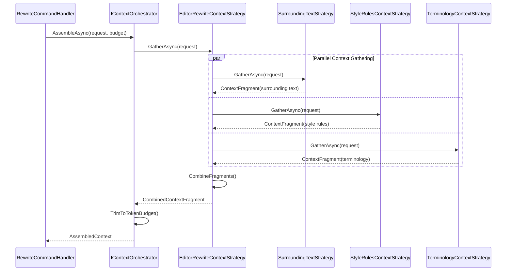

# LCS-DES-073c: Design Specification — Context-Aware Rewriting

## 1. Metadata & Categorization

| Field | Value | Description |
| :--- | :--- | :--- |
| **Feature ID** | `AGT-073c` | Sub-part of AGT-073 |
| **Feature Name** | `Context-Aware Rewriting` | Context gathering strategies |
| **Target Version** | `v0.7.3c` | Third sub-part of v0.7.3 |
| **Module Scope** | `Lexichord.Modules.Agents` | Agents module |
| **Swimlane** | `Ensemble` | Agent vertical |
| **License Tier** | `Writer Pro` | Requires Writer Pro |
| **Feature Gate Key** | `FeatureFlags.Agents.Editor` | License gate |
| **Author** | Lead Architect | |
| **Status** | `Draft` | |
| **Last Updated** | `2026-01-27` | |
| **Parent Document** | [LCS-DES-073-INDEX](./LCS-DES-073-INDEX.md) | |
| **Scope Breakdown** | [LCS-SBD-073 Section 3.3](./LCS-SBD-073.md#33-v073c-context-aware-rewriting) | |

---

## 2. Executive Summary

### 2.1 The Requirement

For the Editor Agent to produce high-quality rewrites, it needs context beyond just the selected text:

- **Surrounding text** for tone and topic consistency
- **Active style rules** for brand voice compliance
- **Domain terminology** for accurate technical language
- **Document metadata** for structural context

Without this context, rewrites may be grammatically correct but stylistically inconsistent with the document.

> **Goal:** Implement context gathering strategies that assemble relevant document context for context-aware AI rewrites.

### 2.2 The Proposed Solution

Implement specialized context strategies that:

1. Extend the `IContextStrategy` interface from v0.7.2a
2. Gather rewrite-specific context (surrounding paragraphs, style rules, terminology)
3. Prioritize context by relevance within token budget
4. Format context for prompt injection

---

## 3. Architecture & Modular Strategy

### 3.1 Dependencies

#### 3.1.1 Upstream Modules

| Interface | Source Version | Purpose |
| :--- | :--- | :--- |
| `IContextStrategy` | v0.7.2a | Base strategy interface |
| `IContextOrchestrator` | v0.7.2c | Context assembly coordination |
| `IEditorService` | v0.1.3a | Document access |
| `IStyleRuleRepository` | v0.2.1b | Style rule retrieval |
| `ITerminologyRepository` | v0.2.2b | Domain terminology |

#### 3.1.2 NuGet Packages

No new packages required.

### 3.2 Strategy Priority

Context strategies are executed by priority and relevance-scored results are trimmed to fit the token budget.

| Strategy | Priority | Default Inclusion | Max Tokens |
| :--- | :--- | :--- | :--- |
| `SurroundingTextStrategy` | 100 | Always | 1000 |
| `StyleRulesContextStrategy` | 90 | Always | 500 |
| `TerminologyContextStrategy` | 80 | When terms found | 300 |
| `DocumentMetadataStrategy` | 70 | Optional | 200 |

---

## 4. Data Contract (The API)

### 4.1 Context Strategy Base (from v0.7.2a)

```csharp
namespace Lexichord.Modules.Agents.Context;

/// <summary>
/// Base interface for context gathering strategies.
/// </summary>
public interface IContextStrategy
{
    /// <summary>
    /// Unique identifier for this strategy.
    /// </summary>
    string StrategyId { get; }

    /// <summary>
    /// Priority for context inclusion (higher = more important).
    /// </summary>
    int Priority { get; }

    /// <summary>
    /// Gathers context for the given request.
    /// </summary>
    /// <param name="request">The context gathering request.</param>
    /// <param name="ct">Cancellation token.</param>
    /// <returns>Context fragment, or null if no relevant context.</returns>
    Task<ContextFragment?> GatherAsync(
        ContextGatheringRequest request,
        CancellationToken ct);
}

/// <summary>
/// Request for context gathering.
/// </summary>
public record ContextGatheringRequest(
    string? DocumentPath,
    int? CursorPosition,
    string? SelectedText,
    string AgentId,
    IReadOnlyDictionary<string, object>? Hints);

/// <summary>
/// A fragment of context from a specific source.
/// </summary>
public record ContextFragment(
    string SourceId,
    string Label,
    string Content,
    int TokenEstimate,
    float Relevance);
```

### 4.2 EditorRewriteContextStrategy

```csharp
namespace Lexichord.Modules.Agents.Editor.Context;

/// <summary>
/// Coordinator strategy that combines editor-specific context sources.
/// Delegates to specialized strategies for each context type.
/// </summary>
public class EditorRewriteContextStrategy : IContextStrategy
{
    public string StrategyId => "editor-rewrite";
    public int Priority => 100;

    private readonly SurroundingTextStrategy _surroundingText;
    private readonly StyleRulesContextStrategy _styleRules;
    private readonly TerminologyContextStrategy _terminology;
    private readonly ILogger<EditorRewriteContextStrategy> _logger;

    public EditorRewriteContextStrategy(
        SurroundingTextStrategy surroundingText,
        StyleRulesContextStrategy styleRules,
        TerminologyContextStrategy terminology,
        ILogger<EditorRewriteContextStrategy> logger)
    {
        _surroundingText = surroundingText;
        _styleRules = styleRules;
        _terminology = terminology;
        _logger = logger;
    }

    public async Task<ContextFragment?> GatherAsync(
        ContextGatheringRequest request,
        CancellationToken ct)
    {
        if (request.AgentId != "editor")
            return null;

        var fragments = new List<ContextFragment>();

        // Gather all context types in parallel
        var tasks = new[]
        {
            _surroundingText.GatherAsync(request, ct),
            _styleRules.GatherAsync(request, ct),
            _terminology.GatherAsync(request, ct)
        };

        var results = await Task.WhenAll(tasks);

        foreach (var result in results)
        {
            if (result is not null)
            {
                fragments.Add(result);
            }
        }

        if (fragments.Count == 0)
            return null;

        // Combine into single fragment
        var combinedContent = FormatCombinedContext(fragments);
        var totalTokens = fragments.Sum(f => f.TokenEstimate);

        _logger.LogDebug(
            "Gathered {FragmentCount} context fragments, {TotalTokens} estimated tokens",
            fragments.Count, totalTokens);

        return new ContextFragment(
            SourceId: StrategyId,
            Label: "Editor Rewrite Context",
            Content: combinedContent,
            TokenEstimate: totalTokens,
            Relevance: 0.95f);
    }

    private string FormatCombinedContext(List<ContextFragment> fragments)
    {
        var sb = new StringBuilder();

        foreach (var fragment in fragments.OrderByDescending(f => f.Relevance))
        {
            sb.AppendLine($"## {fragment.Label}");
            sb.AppendLine(fragment.Content);
            sb.AppendLine();
        }

        return sb.ToString().TrimEnd();
    }
}
```

---

## 5. Implementation Logic

### 5.1 SurroundingTextStrategy

```csharp
namespace Lexichord.Modules.Agents.Editor.Context;

/// <summary>
/// Gathers surrounding paragraph context for the selection.
/// Provides previous, current, and next paragraphs for tone consistency.
/// </summary>
public class SurroundingTextStrategy : IContextStrategy
{
    public string StrategyId => "surrounding-text";
    public int Priority => 100;

    private const int MaxSurroundingChars = 2000;
    private const int PreferredParagraphsBefore = 1;
    private const int PreferredParagraphsAfter = 1;

    private readonly IEditorService _editorService;
    private readonly ILogger<SurroundingTextStrategy> _logger;

    public SurroundingTextStrategy(
        IEditorService editorService,
        ILogger<SurroundingTextStrategy> logger)
    {
        _editorService = editorService;
        _logger = logger;
    }

    public async Task<ContextFragment?> GatherAsync(
        ContextGatheringRequest request,
        CancellationToken ct)
    {
        if (string.IsNullOrEmpty(request.DocumentPath))
        {
            _logger.LogDebug("No document path, skipping surrounding text");
            return null;
        }

        if (!request.CursorPosition.HasValue)
        {
            _logger.LogDebug("No cursor position, skipping surrounding text");
            return null;
        }

        try
        {
            var document = await _editorService.GetDocumentAsync(request.DocumentPath, ct);
            if (document == null)
                return null;

            var cursorPos = request.CursorPosition.Value;
            var content = document.Content;

            // Find paragraph boundaries
            var paragraphs = SplitIntoParagraphs(content);
            var currentParagraphIndex = FindParagraphIndex(paragraphs, cursorPos);

            if (currentParagraphIndex < 0)
                return null;

            // Gather surrounding paragraphs
            var surroundingText = new StringBuilder();
            var includedParagraphs = 0;
            var totalChars = 0;

            // Previous paragraphs
            for (int i = Math.Max(0, currentParagraphIndex - PreferredParagraphsBefore);
                 i < currentParagraphIndex && totalChars < MaxSurroundingChars;
                 i++)
            {
                var para = paragraphs[i].Text;
                if (totalChars + para.Length <= MaxSurroundingChars)
                {
                    surroundingText.AppendLine(para);
                    surroundingText.AppendLine();
                    totalChars += para.Length;
                    includedParagraphs++;
                }
            }

            // Mark current paragraph (contains selection)
            surroundingText.AppendLine("[SELECTION IS HERE]");
            surroundingText.AppendLine();

            // Next paragraphs
            for (int i = currentParagraphIndex + 1;
                 i <= Math.Min(paragraphs.Count - 1, currentParagraphIndex + PreferredParagraphsAfter) &&
                 totalChars < MaxSurroundingChars;
                 i++)
            {
                var para = paragraphs[i].Text;
                if (totalChars + para.Length <= MaxSurroundingChars)
                {
                    surroundingText.AppendLine(para);
                    surroundingText.AppendLine();
                    totalChars += para.Length;
                    includedParagraphs++;
                }
            }

            var contextContent = surroundingText.ToString().Trim();

            if (string.IsNullOrWhiteSpace(contextContent))
                return null;

            _logger.LogDebug(
                "Gathered {ParagraphCount} surrounding paragraphs, {CharCount} chars",
                includedParagraphs, totalChars);

            return new ContextFragment(
                SourceId: StrategyId,
                Label: "Surrounding Text",
                Content: contextContent,
                TokenEstimate: totalChars / 4,
                Relevance: 0.9f);
        }
        catch (Exception ex)
        {
            _logger.LogWarning(ex, "Failed to gather surrounding text context");
            return null;
        }
    }

    private List<Paragraph> SplitIntoParagraphs(string content)
    {
        var paragraphs = new List<Paragraph>();
        var currentPos = 0;

        var lines = content.Split(new[] { "\r\n", "\n" }, StringSplitOptions.None);
        var currentParagraph = new StringBuilder();
        var paragraphStart = 0;

        foreach (var line in lines)
        {
            if (string.IsNullOrWhiteSpace(line))
            {
                if (currentParagraph.Length > 0)
                {
                    paragraphs.Add(new Paragraph(
                        currentParagraph.ToString().Trim(),
                        paragraphStart,
                        currentPos));
                    currentParagraph.Clear();
                }
                paragraphStart = currentPos + line.Length + 1;
            }
            else
            {
                if (currentParagraph.Length == 0)
                    paragraphStart = currentPos;
                currentParagraph.AppendLine(line);
            }
            currentPos += line.Length + 1; // +1 for newline
        }

        // Don't forget last paragraph
        if (currentParagraph.Length > 0)
        {
            paragraphs.Add(new Paragraph(
                currentParagraph.ToString().Trim(),
                paragraphStart,
                currentPos));
        }

        return paragraphs;
    }

    private int FindParagraphIndex(List<Paragraph> paragraphs, int cursorPosition)
    {
        for (int i = 0; i < paragraphs.Count; i++)
        {
            if (cursorPosition >= paragraphs[i].StartOffset &&
                cursorPosition <= paragraphs[i].EndOffset)
            {
                return i;
            }
        }
        return -1;
    }

    private record Paragraph(string Text, int StartOffset, int EndOffset);
}
```

### 5.2 StyleRulesContextStrategy

```csharp
namespace Lexichord.Modules.Agents.Editor.Context;

/// <summary>
/// Gathers active style rules for prompt context.
/// Formats rules as actionable guidelines for the LLM.
/// </summary>
public class StyleRulesContextStrategy : IContextStrategy
{
    public string StrategyId => "style-rules";
    public int Priority => 90;

    private const int MaxRules = 10;

    private readonly IStyleRuleRepository _styleRules;
    private readonly ILogger<StyleRulesContextStrategy> _logger;

    public StyleRulesContextStrategy(
        IStyleRuleRepository styleRules,
        ILogger<StyleRulesContextStrategy> logger)
    {
        _styleRules = styleRules;
        _logger = logger;
    }

    public async Task<ContextFragment?> GatherAsync(
        ContextGatheringRequest request,
        CancellationToken ct)
    {
        try
        {
            var activeRules = await _styleRules.GetActiveRulesAsync(ct);

            if (activeRules == null || !activeRules.Any())
            {
                _logger.LogDebug("No active style rules found");
                return null;
            }

            // Prioritize rules and take top N
            var prioritizedRules = activeRules
                .OrderByDescending(r => r.Severity)
                .ThenBy(r => r.Category)
                .Take(MaxRules)
                .ToList();

            var rulesContent = FormatRulesAsContext(prioritizedRules);

            _logger.LogDebug(
                "Gathered {RuleCount} style rules for context",
                prioritizedRules.Count);

            return new ContextFragment(
                SourceId: StrategyId,
                Label: "Style Rules",
                Content: rulesContent,
                TokenEstimate: rulesContent.Length / 4,
                Relevance: 0.85f);
        }
        catch (Exception ex)
        {
            _logger.LogWarning(ex, "Failed to gather style rules context");
            return null;
        }
    }

    private string FormatRulesAsContext(List<StyleRule> rules)
    {
        var sb = new StringBuilder();

        var rulesByCategory = rules.GroupBy(r => r.Category);

        foreach (var category in rulesByCategory)
        {
            sb.AppendLine($"### {category.Key}");

            foreach (var rule in category)
            {
                sb.AppendLine($"- {FormatRuleAsGuideline(rule)}");
            }

            sb.AppendLine();
        }

        return sb.ToString().Trim();
    }

    private string FormatRuleAsGuideline(StyleRule rule)
    {
        // Convert rule pattern to actionable guideline
        return rule.RuleType switch
        {
            StyleRuleType.Prefer => $"Prefer \"{rule.Replacement}\" over \"{rule.Pattern}\"",
            StyleRuleType.Avoid => $"Avoid using \"{rule.Pattern}\"",
            StyleRuleType.Replace => $"Replace \"{rule.Pattern}\" with \"{rule.Replacement}\"",
            StyleRuleType.Enforce => $"{rule.Description}",
            _ => rule.Description
        };
    }
}
```

### 5.3 TerminologyContextStrategy

```csharp
namespace Lexichord.Modules.Agents.Editor.Context;

/// <summary>
/// Gathers relevant terminology based on the selected text.
/// Helps ensure technical accuracy and consistent term usage.
/// </summary>
public class TerminologyContextStrategy : IContextStrategy
{
    public string StrategyId => "terminology";
    public int Priority => 80;

    private const int MaxTerms = 10;

    private readonly ITerminologyRepository _terminology;
    private readonly ILogger<TerminologyContextStrategy> _logger;

    public TerminologyContextStrategy(
        ITerminologyRepository terminology,
        ILogger<TerminologyContextStrategy> logger)
    {
        _terminology = terminology;
        _logger = logger;
    }

    public async Task<ContextFragment?> GatherAsync(
        ContextGatheringRequest request,
        CancellationToken ct)
    {
        if (string.IsNullOrEmpty(request.SelectedText))
        {
            _logger.LogDebug("No selected text, skipping terminology");
            return null;
        }

        try
        {
            // Get all terms
            var allTerms = await _terminology.GetAllTermsAsync(ct);

            if (allTerms == null || !allTerms.Any())
            {
                _logger.LogDebug("No terminology defined");
                return null;
            }

            // Find terms that appear in the selected text
            var relevantTerms = FindRelevantTerms(request.SelectedText, allTerms);

            if (!relevantTerms.Any())
            {
                _logger.LogDebug("No relevant terms found in selection");
                return null;
            }

            var terminologyContent = FormatTermsAsContext(relevantTerms);

            _logger.LogDebug(
                "Found {TermCount} relevant terms in selection",
                relevantTerms.Count);

            return new ContextFragment(
                SourceId: StrategyId,
                Label: "Terminology",
                Content: terminologyContent,
                TokenEstimate: terminologyContent.Length / 4,
                Relevance: 0.8f);
        }
        catch (Exception ex)
        {
            _logger.LogWarning(ex, "Failed to gather terminology context");
            return null;
        }
    }

    private List<TermEntry> FindRelevantTerms(string selectedText, IEnumerable<TermEntry> allTerms)
    {
        var lowerText = selectedText.ToLowerInvariant();
        var relevantTerms = new List<TermEntry>();

        foreach (var term in allTerms)
        {
            // Check if term appears in selection
            if (lowerText.Contains(term.Term.ToLowerInvariant()))
            {
                relevantTerms.Add(term);
                continue;
            }

            // Check synonyms
            if (term.Synonyms != null)
            {
                foreach (var synonym in term.Synonyms)
                {
                    if (lowerText.Contains(synonym.ToLowerInvariant()))
                    {
                        relevantTerms.Add(term);
                        break;
                    }
                }
            }
        }

        return relevantTerms
            .OrderByDescending(t => t.Priority)
            .Take(MaxTerms)
            .ToList();
    }

    private string FormatTermsAsContext(List<TermEntry> terms)
    {
        var sb = new StringBuilder();

        foreach (var term in terms)
        {
            sb.AppendLine($"**{term.Term}**: {term.Definition}");

            if (term.Usage != null)
            {
                sb.AppendLine($"  _Usage: {term.Usage}_");
            }

            if (term.Synonyms != null && term.Synonyms.Any())
            {
                sb.AppendLine($"  _Synonyms: {string.Join(", ", term.Synonyms)}_");
            }

            if (!string.IsNullOrEmpty(term.PreferredForm))
            {
                sb.AppendLine($"  _Preferred form: {term.PreferredForm}_");
            }

            sb.AppendLine();
        }

        return sb.ToString().Trim();
    }
}
```

### 5.4 Context Assembly Flow



---

## 6. Token Budget Management

### 6.1 Budget Allocation

The context orchestrator respects a token budget to prevent exceeding LLM context limits.

```csharp
namespace Lexichord.Modules.Agents.Context;

/// <summary>
/// Manages token budget allocation across context strategies.
/// </summary>
public class TokenBudgetManager
{
    private readonly int _totalBudget;
    private int _remainingBudget;

    public TokenBudgetManager(int totalBudget)
    {
        _totalBudget = totalBudget;
        _remainingBudget = totalBudget;
    }

    /// <summary>
    /// Allocates tokens to a context fragment.
    /// Returns actual tokens allocated (may be less than requested).
    /// </summary>
    public int Allocate(ContextFragment fragment)
    {
        if (_remainingBudget <= 0)
            return 0;

        var allocated = Math.Min(fragment.TokenEstimate, _remainingBudget);
        _remainingBudget -= allocated;

        return allocated;
    }

    /// <summary>
    /// Gets whether there's remaining budget for more context.
    /// </summary>
    public bool HasRemainingBudget => _remainingBudget > 0;

    /// <summary>
    /// Gets remaining token budget.
    /// </summary>
    public int RemainingBudget => _remainingBudget;

    /// <summary>
    /// Trims content to fit within allocated tokens.
    /// </summary>
    public string TrimToTokens(string content, int maxTokens)
    {
        var estimatedTokens = content.Length / 4;

        if (estimatedTokens <= maxTokens)
            return content;

        // Truncate to approximately maxTokens
        var maxChars = maxTokens * 4;
        var truncated = content.Substring(0, maxChars);

        // Find last complete sentence
        var lastPeriod = truncated.LastIndexOf('.');
        if (lastPeriod > maxChars * 0.7) // Don't truncate too much
        {
            truncated = truncated.Substring(0, lastPeriod + 1);
        }

        return truncated + "\n[...truncated for length]";
    }
}
```

### 6.2 Default Budget Allocation

| Context Type | Default Allocation | Priority |
| :--- | :--- | :--- |
| Selected Text | Included in prompt, not budget | N/A |
| Surrounding Text | 1000 tokens | 100 |
| Style Rules | 500 tokens | 90 |
| Terminology | 300 tokens | 80 |
| Buffer/Overhead | 200 tokens | N/A |
| **Total Budget** | **2000 tokens** | — |

---

## 7. Observability & Logging

| Level | Source | Message Template |
| :--- | :--- | :--- |
| Debug | EditorRewriteContextStrategy | `Gathered {FragmentCount} context fragments, {TotalTokens} estimated tokens` |
| Debug | SurroundingTextStrategy | `Gathered {ParagraphCount} surrounding paragraphs, {CharCount} chars` |
| Debug | SurroundingTextStrategy | `No document path, skipping surrounding text` |
| Debug | StyleRulesContextStrategy | `Gathered {RuleCount} style rules for context` |
| Debug | StyleRulesContextStrategy | `No active style rules found` |
| Debug | TerminologyContextStrategy | `Found {TermCount} relevant terms in selection` |
| Debug | TerminologyContextStrategy | `No relevant terms found in selection` |
| Warning | * | `Failed to gather {StrategyId} context: {Error}` |

---

## 8. Security & Safety

| Risk | Level | Mitigation |
| :--- | :--- | :--- |
| PII in context | Medium | Style rules and terminology are user-defined; surrounding text is document content |
| Context injection | Low | All context is properly escaped and prefixed in prompts |
| Token exhaustion | Low | Budget manager enforces limits |

---

## 9. Acceptance Criteria

| # | Given | When | Then |
| :--- | :--- | :--- | :--- |
| 1 | Document with multiple paragraphs | Context gathered | Surrounding paragraphs included |
| 2 | Active style rules defined | Context gathered | Top 10 rules included |
| 3 | Terminology matching selection | Context gathered | Matching terms included |
| 4 | No style rules defined | Context gathered | Style rules section omitted |
| 5 | No matching terminology | Context gathered | Terminology section omitted |
| 6 | No document path | Context gathered | Surrounding text skipped gracefully |
| 7 | Token budget exceeded | Context assembled | Context truncated to fit |
| 8 | All strategies fail | Context gathered | Returns null gracefully |

---

## 10. Unit Testing Requirements

### 10.1 SurroundingTextStrategyTests

```csharp
[Trait("Category", "Unit")]
[Trait("Version", "v0.7.3c")]
public class SurroundingTextStrategyTests
{
    private Mock<IEditorService> _editorService;
    private SurroundingTextStrategy _sut;

    [SetUp]
    public void Setup()
    {
        _editorService = new Mock<IEditorService>();
        _sut = new SurroundingTextStrategy(
            _editorService.Object,
            Mock.Of<ILogger<SurroundingTextStrategy>>());
    }

    [Fact]
    public async Task GatherAsync_WithSurroundingParagraphs_IncludesContext()
    {
        // Arrange
        var document = new Document
        {
            Content = "First paragraph.\n\nSecond paragraph with cursor.\n\nThird paragraph."
        };
        _editorService.Setup(e => e.GetDocumentAsync(It.IsAny<string>(), It.IsAny<CancellationToken>()))
            .ReturnsAsync(document);

        var request = new ContextGatheringRequest(
            DocumentPath: "/test.md",
            CursorPosition: 25, // In second paragraph
            SelectedText: "cursor",
            AgentId: "editor",
            Hints: null);

        // Act
        var result = await _sut.GatherAsync(request, CancellationToken.None);

        // Assert
        result.Should().NotBeNull();
        result!.Content.Should().Contain("First paragraph");
        result.Content.Should().Contain("[SELECTION IS HERE]");
        result.Content.Should().Contain("Third paragraph");
    }

    [Fact]
    public async Task GatherAsync_WithNoDocumentPath_ReturnsNull()
    {
        // Arrange
        var request = new ContextGatheringRequest(
            DocumentPath: null,
            CursorPosition: 10,
            SelectedText: "test",
            AgentId: "editor",
            Hints: null);

        // Act
        var result = await _sut.GatherAsync(request, CancellationToken.None);

        // Assert
        result.Should().BeNull();
    }

    [Fact]
    public async Task GatherAsync_ExceedsMaxChars_Truncates()
    {
        // Arrange
        var longContent = string.Join("\n\n", Enumerable.Range(0, 50).Select(i => new string('a', 200)));
        var document = new Document { Content = longContent };
        _editorService.Setup(e => e.GetDocumentAsync(It.IsAny<string>(), It.IsAny<CancellationToken>()))
            .ReturnsAsync(document);

        var request = new ContextGatheringRequest(
            DocumentPath: "/test.md",
            CursorPosition: 5000,
            SelectedText: "test",
            AgentId: "editor",
            Hints: null);

        // Act
        var result = await _sut.GatherAsync(request, CancellationToken.None);

        // Assert
        result.Should().NotBeNull();
        result!.Content.Length.Should().BeLessThan(2500); // MaxSurroundingChars + overhead
    }
}
```

### 10.2 StyleRulesContextStrategyTests

```csharp
[Trait("Category", "Unit")]
[Trait("Version", "v0.7.3c")]
public class StyleRulesContextStrategyTests
{
    private Mock<IStyleRuleRepository> _styleRules;
    private StyleRulesContextStrategy _sut;

    [SetUp]
    public void Setup()
    {
        _styleRules = new Mock<IStyleRuleRepository>();
        _sut = new StyleRulesContextStrategy(
            _styleRules.Object,
            Mock.Of<ILogger<StyleRulesContextStrategy>>());
    }

    [Fact]
    public async Task GatherAsync_WithActiveRules_FormatsAsGuidelines()
    {
        // Arrange
        var rules = new List<StyleRule>
        {
            new StyleRule { Pattern = "utilize", Replacement = "use", RuleType = StyleRuleType.Prefer },
            new StyleRule { Pattern = "very", RuleType = StyleRuleType.Avoid }
        };
        _styleRules.Setup(s => s.GetActiveRulesAsync(It.IsAny<CancellationToken>()))
            .ReturnsAsync(rules);

        var request = new ContextGatheringRequest(
            DocumentPath: "/test.md",
            CursorPosition: 10,
            SelectedText: "test",
            AgentId: "editor",
            Hints: null);

        // Act
        var result = await _sut.GatherAsync(request, CancellationToken.None);

        // Assert
        result.Should().NotBeNull();
        result!.Content.Should().Contain("Prefer \"use\" over \"utilize\"");
        result.Content.Should().Contain("Avoid using \"very\"");
    }

    [Fact]
    public async Task GatherAsync_NoRules_ReturnsNull()
    {
        // Arrange
        _styleRules.Setup(s => s.GetActiveRulesAsync(It.IsAny<CancellationToken>()))
            .ReturnsAsync(new List<StyleRule>());

        var request = CreateRequest();

        // Act
        var result = await _sut.GatherAsync(request, CancellationToken.None);

        // Assert
        result.Should().BeNull();
    }

    [Fact]
    public async Task GatherAsync_ManyRules_LimitsToMaxRules()
    {
        // Arrange
        var rules = Enumerable.Range(0, 20)
            .Select(i => new StyleRule { Pattern = $"word{i}", RuleType = StyleRuleType.Avoid })
            .ToList();
        _styleRules.Setup(s => s.GetActiveRulesAsync(It.IsAny<CancellationToken>()))
            .ReturnsAsync(rules);

        var request = CreateRequest();

        // Act
        var result = await _sut.GatherAsync(request, CancellationToken.None);

        // Assert
        result.Should().NotBeNull();
        var ruleCount = result!.Content.Split('\n').Count(l => l.StartsWith("- "));
        ruleCount.Should().BeLessOrEqualTo(10);
    }

    private static ContextGatheringRequest CreateRequest() => new(
        DocumentPath: "/test.md",
        CursorPosition: 10,
        SelectedText: "test",
        AgentId: "editor",
        Hints: null);
}
```

### 10.3 TerminologyContextStrategyTests

```csharp
[Trait("Category", "Unit")]
[Trait("Version", "v0.7.3c")]
public class TerminologyContextStrategyTests
{
    private Mock<ITerminologyRepository> _terminology;
    private TerminologyContextStrategy _sut;

    [SetUp]
    public void Setup()
    {
        _terminology = new Mock<ITerminologyRepository>();
        _sut = new TerminologyContextStrategy(
            _terminology.Object,
            Mock.Of<ILogger<TerminologyContextStrategy>>());
    }

    [Fact]
    public async Task GatherAsync_WithMatchingTerms_IncludesDefinitions()
    {
        // Arrange
        var terms = new List<TermEntry>
        {
            new TermEntry { Term = "API", Definition = "Application Programming Interface" },
            new TermEntry { Term = "REST", Definition = "Representational State Transfer" }
        };
        _terminology.Setup(t => t.GetAllTermsAsync(It.IsAny<CancellationToken>()))
            .ReturnsAsync(terms);

        var request = new ContextGatheringRequest(
            DocumentPath: "/test.md",
            CursorPosition: 10,
            SelectedText: "The REST API provides endpoints",
            AgentId: "editor",
            Hints: null);

        // Act
        var result = await _sut.GatherAsync(request, CancellationToken.None);

        // Assert
        result.Should().NotBeNull();
        result!.Content.Should().Contain("**API**");
        result.Content.Should().Contain("Application Programming Interface");
        result.Content.Should().Contain("**REST**");
    }

    [Fact]
    public async Task GatherAsync_MatchesSynonyms_IncludesTerm()
    {
        // Arrange
        var terms = new List<TermEntry>
        {
            new TermEntry
            {
                Term = "Lexichord",
                Definition = "Writing platform",
                Synonyms = new[] { "the app", "this tool" }
            }
        };
        _terminology.Setup(t => t.GetAllTermsAsync(It.IsAny<CancellationToken>()))
            .ReturnsAsync(terms);

        var request = new ContextGatheringRequest(
            DocumentPath: "/test.md",
            CursorPosition: 10,
            SelectedText: "The app makes writing easier",
            AgentId: "editor",
            Hints: null);

        // Act
        var result = await _sut.GatherAsync(request, CancellationToken.None);

        // Assert
        result.Should().NotBeNull();
        result!.Content.Should().Contain("**Lexichord**");
    }

    [Fact]
    public async Task GatherAsync_NoMatchingTerms_ReturnsNull()
    {
        // Arrange
        var terms = new List<TermEntry>
        {
            new TermEntry { Term = "API", Definition = "Application Programming Interface" }
        };
        _terminology.Setup(t => t.GetAllTermsAsync(It.IsAny<CancellationToken>()))
            .ReturnsAsync(terms);

        var request = new ContextGatheringRequest(
            DocumentPath: "/test.md",
            CursorPosition: 10,
            SelectedText: "Hello world, this is a test",
            AgentId: "editor",
            Hints: null);

        // Act
        var result = await _sut.GatherAsync(request, CancellationToken.None);

        // Assert
        result.Should().BeNull();
    }
}
```

---

## 11. Deliverable Checklist

| # | Deliverable | Status |
| :--- | :--- | :--- |
| 1 | `EditorRewriteContextStrategy.cs` | [ ] |
| 2 | `SurroundingTextStrategy.cs` | [ ] |
| 3 | `StyleRulesContextStrategy.cs` | [ ] |
| 4 | `TerminologyContextStrategy.cs` | [ ] |
| 5 | `TokenBudgetManager.cs` | [ ] |
| 6 | Unit tests for SurroundingTextStrategy | [ ] |
| 7 | Unit tests for StyleRulesContextStrategy | [ ] |
| 8 | Unit tests for TerminologyContextStrategy | [ ] |
| 9 | DI registration | [ ] |

---

## 12. Verification Commands

```bash
# Run all v0.7.3c tests
dotnet test --filter "Version=v0.7.3c" --logger "console;verbosity=detailed"

# Run context strategy tests
dotnet test --filter "FullyQualifiedName~ContextStrategy"

# Manual verification:
# 1. Define style rules, select text with rule violations
#    Expected: Rewrite respects style rules
# 2. Define terminology, select text containing terms
#    Expected: Rewrite uses correct terminology
# 3. Select text in middle of document
#    Expected: Rewrite is consistent with surrounding tone
```

---

## Document History

| Version | Date | Author | Changes |
| :--- | :--- | :--- | :--- |
| 1.0 | 2026-01-27 | Lead Architect | Initial draft |
