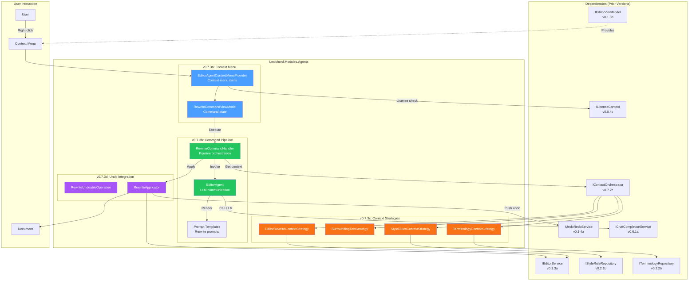
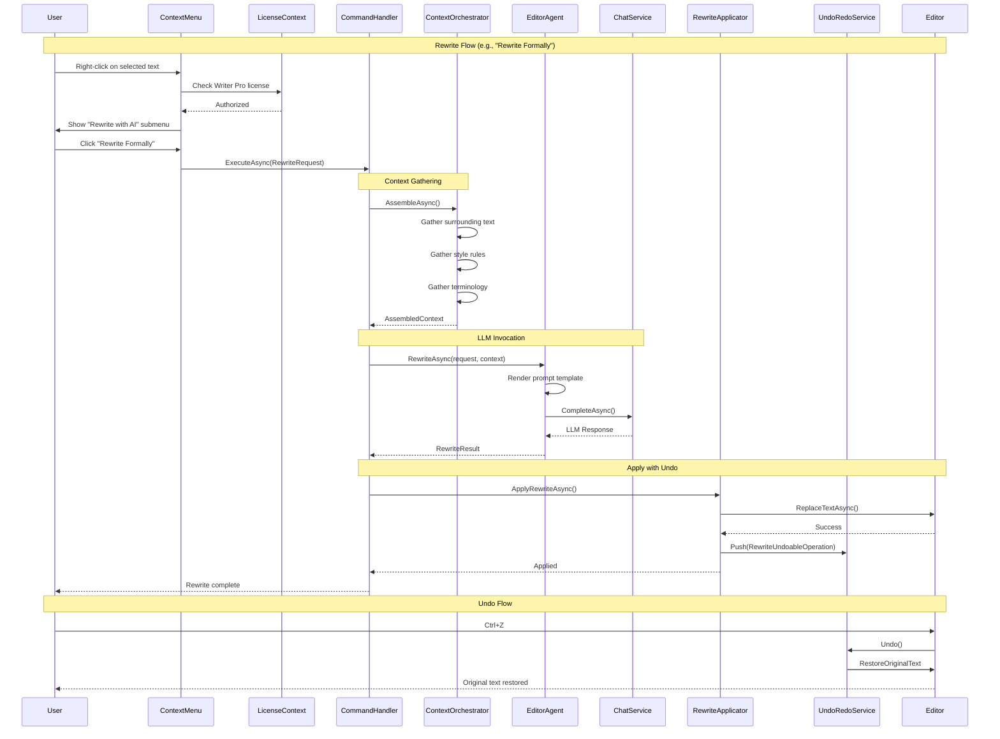

# LCS-SBD-073: Scope Breakdown — The Editor Agent

## Document Control

| Field            | Value                                    |
| :--------------- | :--------------------------------------- |
| **Document ID**  | LCS-SBD-073                              |
| **Version**      | v0.7.3                                   |
| **Codename**     | The Editor Agent                         |
| **Status**       | Draft                                    |
| **Last Updated** | 2026-01-27                               |
| **Owner**        | Lead Architect                           |
| **Depends On**   | v0.7.1 (Agent Registry), v0.7.2 (Context Assembler), v0.6.6 (Co-pilot Agent), v0.6.3 (Prompt Templating) |

---

## 1. Executive Summary

### 1.1 The Vision

**v0.7.3** delivers the **Editor Agent** — the first "truly useful" AI assistant integrated directly into Lexichord's editing workflow. This release transforms the contextual menu system from a static set of commands into an intelligent rewriting assistant that understands document context, respects style rules, and integrates seamlessly with the editor's undo/redo system.

The Editor Agent enables writers to select any text, right-click, and choose from AI-powered rewriting options: "Rewrite Formally", "Simplify", "Expand", and custom commands. Unlike generic AI tools, the Editor Agent leverages Lexichord's understanding of style rules, document structure, and user preferences to produce context-aware rewrites that maintain consistency with the writer's established voice.

### 1.2 Business Value

- **Productivity:** Writers can transform text in seconds rather than manually rewriting, saving hours on editing tasks.
- **Context Awareness:** Unlike standalone AI tools, the Editor Agent understands the document's style rules, terminology, and voice profile.
- **Seamless Integration:** Right-click context menu provides instant access without leaving the editing flow.
- **Safe Experimentation:** Full undo/redo integration lets writers try rewrites risk-free.
- **Consistency:** AI suggestions respect configured style rules and terminology, maintaining document consistency.
- **Foundation:** Establishes the pattern for all future context-menu-integrated agent actions.

### 1.3 Success Criteria

This release succeeds when:

1. Users can select text, right-click, and access "Rewrite" submenu with predefined options.
2. "Rewrite Formally", "Simplify", and "Expand" commands produce contextually appropriate results.
3. All rewrites integrate with the undo/redo system as a single atomic operation.
4. The agent respects active style rules and terminology when generating rewrites.
5. Response time for rewrites is under 3 seconds for typical selections (< 500 words).

### 1.4 License Gating

The Editor Agent is a **Writer Pro** feature. Lower tiers will see:

- Context menu shows "Rewrite with AI" as disabled/grayed out
- "Upgrade to Writer Pro" tooltip on hover
- Lock icon next to rewrite options
- Clicking disabled option opens upgrade modal

---

## 2. Dependencies on Prior Versions

| Component                  | Source Version | Usage in v0.7.3                                   |
| :------------------------- | :------------- | :------------------------------------------------ |
| `IAgent`                   | v0.6.6a        | Base interface for EditorAgent implementation     |
| `BaseAgent`                | v0.6.6b        | Abstract base class with shared agent logic       |
| `IAgentRegistry`           | v0.7.1b        | Agent discovery and registration                  |
| `AgentConfiguration`       | v0.7.1a        | Agent persona and settings configuration          |
| `IContextOrchestrator`     | v0.7.2c        | Intelligent context assembly for prompts          |
| `IContextStrategy`         | v0.7.2a        | Pluggable context gathering strategies            |
| `IChatCompletionService`   | v0.6.1a        | LLM communication for agent responses             |
| `IPromptRenderer`          | v0.6.3b        | Template rendering with Mustache                  |
| `IPromptTemplateRepository`| v0.6.3c        | Template storage and retrieval                    |
| `IEditorService`           | v0.1.3a        | Document access and manipulation                  |
| `IEditorViewModel`         | v0.1.3b        | Editor UI state and commands                      |
| `IStyleRuleRepository`     | v0.2.1b        | Active style rules for context                    |
| `IUndoRedoService`         | v0.1.4a        | Undo/redo stack management                        |
| `ILicenseContext`          | v0.0.4c        | Feature gating for Writer Pro tier                |
| `IMediator`                | v0.0.7a        | Event publishing for agent actions                |
| `Serilog`                  | v0.0.3b        | Structured logging                                |

---

## 3. Sub-Part Specifications

### 3.1 v0.7.3a: EditorViewModel Integration

| Field            | Value                                     |
| :--------------- | :---------------------------------------- |
| **Sub-Part ID**  | AGT-073a                                  |
| **Title**        | EditorViewModel Integration               |
| **Module**       | `Lexichord.Modules.Agents`                |
| **License Tier** | Writer Pro                                |

**Goal:** Integrate the Editor Agent into the EditorViewModel's context menu system, enabling right-click access to AI rewriting commands.

**Key Deliverables:**

- `EditorAgentContextMenuProvider.cs` implementing context menu items
- `RewriteCommandViewModel.cs` for rewrite command state
- Integration with `IEditorViewModel.ContextMenuItems`
- License-gated visibility for rewrite commands
- Selection state binding for enable/disable logic
- Keyboard shortcuts (Ctrl+Shift+R for "Rewrite Formally")
- Unit tests for context menu integration

**Key Interfaces:**

```csharp
namespace Lexichord.Modules.Agents.Editor;

/// <summary>
/// Provides Editor Agent commands to the editor's context menu.
/// </summary>
public interface IEditorAgentContextMenuProvider
{
    /// <summary>
    /// Gets the context menu items for AI rewriting commands.
    /// Items are automatically disabled when no text is selected.
    /// </summary>
    IReadOnlyList<ContextMenuItem> GetRewriteMenuItems();

    /// <summary>
    /// Gets whether rewrite commands should be enabled based on current selection.
    /// </summary>
    bool CanRewrite { get; }

    /// <summary>
    /// Event raised when rewrite availability changes.
    /// </summary>
    event EventHandler<bool> CanRewriteChanged;
}

/// <summary>
/// Represents a rewrite command option in the context menu.
/// </summary>
public record RewriteCommandOption(
    string CommandId,
    string DisplayName,
    string Description,
    string Icon,
    string? KeyboardShortcut,
    RewriteIntent Intent
);

/// <summary>
/// The type of rewrite transformation requested.
/// </summary>
public enum RewriteIntent
{
    Formal,
    Simplified,
    Expanded,
    Custom
}
```

**Key UI Components:**

```text
+------------------------------------------------------------------+
|  [Selected Text]                                                  |
+------------------------------------------------------------------+
| Right-click Context Menu:                                         |
+------------------------------------------------------------------+
| Cut                             Ctrl+X                            |
| Copy                            Ctrl+C                            |
| Paste                           Ctrl+V                            |
|------------------------------------------------------------------|
| > Rewrite with AI...                                    [Pro]     |
|   ├── Rewrite Formally          Ctrl+Shift+R                      |
|   ├── Simplify                  Ctrl+Shift+S                      |
|   ├── Expand                    Ctrl+Shift+E                      |
|   └── Custom Rewrite...         Ctrl+Shift+C                      |
|------------------------------------------------------------------|
| Style Check                                                       |
| Define Term...                                                    |
+------------------------------------------------------------------+
```

**Dependencies:**

- v0.1.3b: `IEditorViewModel` (context menu integration point)
- v0.0.4c: `ILicenseContext` (Writer Pro feature gating)

---

### 3.2 v0.7.3b: Agent Command Pipeline

| Field            | Value                                     |
| :--------------- | :---------------------------------------- |
| **Sub-Part ID**  | AGT-073b                                  |
| **Title**        | Agent Command Pipeline                    |
| **Module**       | `Lexichord.Modules.Agents`                |
| **License Tier** | Writer Pro                                |

**Goal:** Implement the command pipeline that processes rewrite requests, invokes the EditorAgent, and applies the result to the document.

**Key Deliverables:**

- `EditorAgent.cs` implementing `IAgent` for rewriting tasks
- `RewriteRequest.cs` / `RewriteResult.cs` records
- `RewriteCommandHandler.cs` orchestrating the full pipeline
- `EditorAgentPromptTemplates.yaml` with rewrite-specific prompts
- Progress indication during LLM processing
- Error handling for LLM failures and timeouts
- Unit tests for command pipeline

**Key Interfaces:**

```csharp
namespace Lexichord.Modules.Agents.Editor;

/// <summary>
/// Handles rewrite command execution from selection to document update.
/// </summary>
public interface IRewriteCommandHandler
{
    /// <summary>
    /// Executes a rewrite command on the selected text.
    /// </summary>
    /// <param name="request">The rewrite request with selected text and intent.</param>
    /// <param name="cancellationToken">Cancellation token.</param>
    /// <returns>The rewrite result with transformed text.</returns>
    Task<RewriteResult> ExecuteAsync(RewriteRequest request, CancellationToken cancellationToken = default);

    /// <summary>
    /// Executes a rewrite with streaming response for progress indication.
    /// </summary>
    IAsyncEnumerable<RewriteProgressUpdate> ExecuteStreamingAsync(
        RewriteRequest request,
        CancellationToken cancellationToken = default);
}

/// <summary>
/// A request to rewrite selected text.
/// </summary>
public record RewriteRequest(
    string SelectedText,
    TextSpan SelectionSpan,
    RewriteIntent Intent,
    string? CustomInstruction,
    string? DocumentPath,
    IReadOnlyDictionary<string, object>? AdditionalContext
);

/// <summary>
/// The result of a rewrite operation.
/// </summary>
public record RewriteResult(
    string OriginalText,
    string RewrittenText,
    RewriteIntent Intent,
    bool Success,
    string? ErrorMessage,
    UsageMetrics Usage,
    TimeSpan Duration
);

/// <summary>
/// Progress update during streaming rewrite.
/// </summary>
public record RewriteProgressUpdate(
    string PartialText,
    double ProgressPercentage,
    RewriteProgressState State
);

public enum RewriteProgressState
{
    Initializing,
    GatheringContext,
    GeneratingRewrite,
    Completed,
    Failed
}
```

**EditorAgent Implementation:**

```csharp
namespace Lexichord.Modules.Agents.Editor;

/// <summary>
/// The Editor Agent - specializes in text rewriting with context awareness.
/// </summary>
[RequiresLicense(LicenseTier.WriterPro)]
[AgentDefinition("editor", "The Editor", "Grammar, clarity, and text transformation")]
public class EditorAgent : BaseAgent, IEditorAgent
{
    private readonly IContextOrchestrator _contextOrchestrator;
    private readonly IStyleRuleRepository _styleRules;

    public EditorAgent(
        IChatCompletionService llm,
        IPromptRenderer renderer,
        IPromptTemplateRepository templates,
        IContextOrchestrator contextOrchestrator,
        IStyleRuleRepository styleRules,
        ILogger<EditorAgent> logger)
        : base(llm, renderer, templates, logger)
    {
        _contextOrchestrator = contextOrchestrator;
        _styleRules = styleRules;
    }

    public override string AgentId => "editor";
    public override string Name => "The Editor";
    public override string Description => "Transforms text while respecting context and style.";

    public override AgentCapabilities Capabilities =>
        AgentCapabilities.Chat |
        AgentCapabilities.DocumentContext |
        AgentCapabilities.StyleEnforcement;

    protected override ChatOptions GetDefaultOptions() => new(
        Model: "gpt-4o",
        Temperature: 0.3f,
        MaxTokens: 2048
    );

    public async Task<RewriteResult> RewriteAsync(
        RewriteRequest request,
        CancellationToken ct = default)
    {
        var stopwatch = Stopwatch.StartNew();

        try
        {
            // 1. Gather context
            var context = await GatherRewriteContextAsync(request, ct);

            // 2. Select appropriate template
            var templateId = GetTemplateForIntent(request.Intent);

            // 3. Invoke LLM
            var agentRequest = new AgentRequest(
                request.CustomInstruction ?? GetDefaultInstructionForIntent(request.Intent),
                DocumentPath: request.DocumentPath,
                Selection: request.SelectedText
            );

            var response = await InvokeWithContextAsync(agentRequest, context, ct);

            stopwatch.Stop();

            return new RewriteResult(
                OriginalText: request.SelectedText,
                RewrittenText: response.Content,
                Intent: request.Intent,
                Success: true,
                ErrorMessage: null,
                Usage: response.Usage,
                Duration: stopwatch.Elapsed
            );
        }
        catch (Exception ex)
        {
            stopwatch.Stop();
            Logger.LogError(ex, "Rewrite failed for intent {Intent}", request.Intent);

            return new RewriteResult(
                OriginalText: request.SelectedText,
                RewrittenText: request.SelectedText,
                Intent: request.Intent,
                Success: false,
                ErrorMessage: ex.Message,
                Usage: UsageMetrics.Empty,
                Duration: stopwatch.Elapsed
            );
        }
    }

    private string GetTemplateForIntent(RewriteIntent intent) => intent switch
    {
        RewriteIntent.Formal => "editor-rewrite-formal",
        RewriteIntent.Simplified => "editor-rewrite-simplify",
        RewriteIntent.Expanded => "editor-rewrite-expand",
        RewriteIntent.Custom => "editor-rewrite-custom",
        _ => throw new ArgumentOutOfRangeException(nameof(intent))
    };

    private string GetDefaultInstructionForIntent(RewriteIntent intent) => intent switch
    {
        RewriteIntent.Formal => "Rewrite this text in a more formal, professional tone.",
        RewriteIntent.Simplified => "Simplify this text for a broader audience.",
        RewriteIntent.Expanded => "Expand this text with more detail and explanation.",
        RewriteIntent.Custom => "Rewrite this text according to the custom instruction.",
        _ => throw new ArgumentOutOfRangeException(nameof(intent))
    };
}
```

**Dependencies:**

- v0.6.6a: `IAgent` (agent interface)
- v0.7.2c: `IContextOrchestrator` (context assembly)
- v0.6.1a: `IChatCompletionService` (LLM communication)

---

### 3.3 v0.7.3c: Context-Aware Rewriting

| Field            | Value                                     |
| :--------------- | :---------------------------------------- |
| **Sub-Part ID**  | AGT-073c                                  |
| **Title**        | Context-Aware Rewriting                   |
| **Module**       | `Lexichord.Modules.Agents`                |
| **License Tier** | Writer Pro                                |

**Goal:** Implement context gathering strategies that provide the Editor Agent with relevant document context, style rules, and terminology for high-quality rewrites.

**Key Deliverables:**

- `EditorRewriteContextStrategy.cs` gathering rewrite-specific context
- `SurroundingTextStrategy.cs` for paragraph/section context
- `StyleRulesContextStrategy.cs` injecting active style rules
- `TerminologyContextStrategy.cs` for domain-specific terms
- Prompt templates that utilize gathered context
- Context preview in rewrite dialog (optional)
- Unit tests for context strategies

**Key Interfaces:**

```csharp
namespace Lexichord.Modules.Agents.Editor;

/// <summary>
/// Context strategy specific to editor rewrite operations.
/// Gathers surrounding text, style rules, and relevant terminology.
/// </summary>
public class EditorRewriteContextStrategy : IContextStrategy
{
    public string StrategyId => "editor-rewrite";
    public int Priority => 100; // High priority for rewrite operations

    private readonly IEditorService _editorService;
    private readonly IStyleRuleRepository _styleRules;
    private readonly ITerminologyRepository _terminology;

    public EditorRewriteContextStrategy(
        IEditorService editorService,
        IStyleRuleRepository styleRules,
        ITerminologyRepository terminology)
    {
        _editorService = editorService;
        _styleRules = styleRules;
        _terminology = terminology;
    }

    public async Task<ContextFragment?> GatherAsync(
        ContextGatheringRequest request,
        CancellationToken ct)
    {
        if (string.IsNullOrEmpty(request.SelectedText))
            return null;

        var contextBuilder = new StringBuilder();

        // 1. Gather surrounding paragraph context
        var surroundingText = await GetSurroundingParagraphAsync(
            request.DocumentPath,
            request.CursorPosition ?? 0,
            ct);

        if (!string.IsNullOrEmpty(surroundingText))
        {
            contextBuilder.AppendLine("## Surrounding Context");
            contextBuilder.AppendLine(surroundingText);
            contextBuilder.AppendLine();
        }

        // 2. Gather relevant style rules
        var activeRules = await _styleRules.GetActiveRulesAsync(ct);
        if (activeRules.Any())
        {
            contextBuilder.AppendLine("## Style Rules to Follow");
            foreach (var rule in activeRules.Take(10)) // Limit to avoid token overflow
            {
                contextBuilder.AppendLine($"- {rule.Description}");
            }
            contextBuilder.AppendLine();
        }

        // 3. Gather relevant terminology
        var terms = await GetRelevantTermsAsync(request.SelectedText, ct);
        if (terms.Any())
        {
            contextBuilder.AppendLine("## Terminology");
            foreach (var term in terms)
            {
                contextBuilder.AppendLine($"- **{term.Term}**: {term.Definition}");
            }
        }

        var content = contextBuilder.ToString();
        return new ContextFragment(
            SourceId: StrategyId,
            Label: "Editor Rewrite Context",
            Content: content,
            TokenEstimate: EstimateTokens(content),
            Relevance: 0.95f
        );
    }

    private async Task<string> GetSurroundingParagraphAsync(
        string? documentPath,
        int cursorPosition,
        CancellationToken ct)
    {
        if (string.IsNullOrEmpty(documentPath))
            return string.Empty;

        var document = await _editorService.GetDocumentAsync(documentPath, ct);
        if (document == null)
            return string.Empty;

        // Get paragraph containing cursor position
        var paragraph = document.GetParagraphAt(cursorPosition);

        // Also get previous and next paragraphs for context
        var prevParagraph = document.GetParagraphBefore(cursorPosition);
        var nextParagraph = document.GetParagraphAfter(cursorPosition);

        return string.Join("\n\n", new[] { prevParagraph, paragraph, nextParagraph }
            .Where(p => !string.IsNullOrEmpty(p)));
    }

    private async Task<IReadOnlyList<TermEntry>> GetRelevantTermsAsync(
        string selectedText,
        CancellationToken ct)
    {
        // Find terms that appear in or are related to the selected text
        var allTerms = await _terminology.GetAllTermsAsync(ct);

        return allTerms
            .Where(t => selectedText.Contains(t.Term, StringComparison.OrdinalIgnoreCase) ||
                        t.Synonyms.Any(s => selectedText.Contains(s, StringComparison.OrdinalIgnoreCase)))
            .Take(5)
            .ToList();
    }

    private int EstimateTokens(string content)
    {
        // Rough estimate: ~4 characters per token
        return content.Length / 4;
    }
}
```

**Prompt Templates:**

```yaml
# prompts/editor-rewrite-formal.yaml
template_id: "editor-rewrite-formal"
name: "Formal Rewrite"
system_prompt: |
  You are an expert editor specializing in formal, professional writing.
  Your task is to rewrite the given text in a more formal, professional tone.

  Guidelines:
  - Replace casual language with formal equivalents
  - Use complete sentences and avoid contractions
  - Maintain a professional, authoritative voice
  - Preserve all factual content and meaning
  - Keep technical terms intact
  {{#style_rules}}

  Style Rules to Follow:
  {{style_rules}}
  {{/style_rules}}
  {{#terminology}}

  Terminology to Respect:
  {{terminology}}
  {{/terminology}}

  IMPORTANT: Return ONLY the rewritten text. Do not include explanations,
  alternatives, or commentary. The output should be ready to paste directly.

user_prompt: |
  {{#surrounding_context}}
  Context (preceding and following text):
  """
  {{surrounding_context}}
  """

  {{/surrounding_context}}
  Rewrite the following text in a formal, professional tone:

  """
  {{selection}}
  """

# prompts/editor-rewrite-simplify.yaml
template_id: "editor-rewrite-simplify"
name: "Simplify Rewrite"
system_prompt: |
  You are an expert at making complex text accessible to a broader audience.
  Your task is to simplify the given text while preserving its meaning.

  Guidelines:
  - Use shorter sentences (aim for 15-20 words max)
  - Replace jargon with plain language
  - Use active voice instead of passive
  - Break complex ideas into simpler steps
  - Maintain accuracy - don't oversimplify facts
  - Keep essential technical terms but explain them if needed
  {{#style_rules}}

  Style Rules to Follow:
  {{style_rules}}
  {{/style_rules}}

  IMPORTANT: Return ONLY the simplified text. Do not include explanations.

user_prompt: |
  {{#surrounding_context}}
  Context:
  """
  {{surrounding_context}}
  """

  {{/surrounding_context}}
  Simplify the following text for a general audience:

  """
  {{selection}}
  """

# prompts/editor-rewrite-expand.yaml
template_id: "editor-rewrite-expand"
name: "Expand Rewrite"
system_prompt: |
  You are an expert at elaborating and expanding concise text into more detailed content.
  Your task is to expand the given text with additional detail, explanation, and context.

  Guidelines:
  - Add relevant details and examples
  - Expand abbreviations and acronyms
  - Include transitional phrases for flow
  - Maintain the original tone and style
  - Don't add information that contradicts the original
  - Keep expansion proportional (2-3x original length typically)
  {{#style_rules}}

  Style Rules to Follow:
  {{style_rules}}
  {{/style_rules}}

  IMPORTANT: Return ONLY the expanded text. Do not include explanations.

user_prompt: |
  {{#surrounding_context}}
  Context:
  """
  {{surrounding_context}}
  """

  {{/surrounding_context}}
  Expand the following text with more detail and explanation:

  """
  {{selection}}
  """

# prompts/editor-rewrite-custom.yaml
template_id: "editor-rewrite-custom"
name: "Custom Rewrite"
system_prompt: |
  You are an expert editor capable of transforming text according to specific instructions.
  {{#style_rules}}

  Style Rules to Follow:
  {{style_rules}}
  {{/style_rules}}
  {{#terminology}}

  Terminology to Respect:
  {{terminology}}
  {{/terminology}}

  IMPORTANT: Return ONLY the rewritten text. Do not include explanations.

user_prompt: |
  {{#surrounding_context}}
  Context:
  """
  {{surrounding_context}}
  """

  {{/surrounding_context}}
  {{custom_instruction}}

  Text to rewrite:
  """
  {{selection}}
  """
```

**Dependencies:**

- v0.7.2a: `IContextStrategy` (context gathering interface)
- v0.2.1b: `IStyleRuleRepository` (active style rules)
- v0.2.2b: `ITerminologyRepository` (domain terminology)

---

### 3.4 v0.7.3d: Undo/Redo Integration

| Field            | Value                                     |
| :--------------- | :---------------------------------------- |
| **Sub-Part ID**  | AGT-073d                                  |
| **Title**        | Undo/Redo Integration                     |
| **Module**       | `Lexichord.Modules.Agents`                |
| **License Tier** | Writer Pro                                |

**Goal:** Integrate rewrite operations with the editor's undo/redo system so users can safely experiment with AI rewrites and revert if needed.

**Key Deliverables:**

- `RewriteUndoableOperation.cs` implementing `IUndoableOperation`
- Integration with `IUndoRedoService` for atomic undo
- "Undo AI Rewrite" command with clear labeling
- Multiple consecutive rewrites as separate undo entries
- Preview mode option (apply without committing)
- Unit tests for undo/redo integration

**Key Interfaces:**

```csharp
namespace Lexichord.Modules.Agents.Editor;

/// <summary>
/// An undoable operation for text rewriting.
/// </summary>
public class RewriteUndoableOperation : IUndoableOperation
{
    public string Id { get; } = Guid.NewGuid().ToString();
    public string DisplayName => $"AI Rewrite ({Intent})";
    public DateTime Timestamp { get; } = DateTime.UtcNow;

    private readonly string _documentPath;
    private readonly TextSpan _originalSpan;
    private readonly string _originalText;
    private readonly string _rewrittenText;
    private readonly RewriteIntent Intent;
    private readonly IEditorService _editorService;

    public RewriteUndoableOperation(
        string documentPath,
        TextSpan originalSpan,
        string originalText,
        string rewrittenText,
        RewriteIntent intent,
        IEditorService editorService)
    {
        _documentPath = documentPath;
        _originalSpan = originalSpan;
        _originalText = originalText;
        _rewrittenText = rewrittenText;
        Intent = intent;
        _editorService = editorService;
    }

    public async Task ExecuteAsync(CancellationToken ct = default)
    {
        await _editorService.ReplaceTextAsync(
            _documentPath,
            _originalSpan,
            _rewrittenText,
            ct);
    }

    public async Task UndoAsync(CancellationToken ct = default)
    {
        // Calculate new span based on rewritten text length
        var rewrittenSpan = new TextSpan(
            _originalSpan.Start,
            _rewrittenText.Length);

        await _editorService.ReplaceTextAsync(
            _documentPath,
            rewrittenSpan,
            _originalText,
            ct);
    }

    public async Task RedoAsync(CancellationToken ct = default)
    {
        await ExecuteAsync(ct);
    }
}

/// <summary>
/// Service for applying rewrites with undo support.
/// </summary>
public interface IRewriteApplicator
{
    /// <summary>
    /// Applies a rewrite result to the document with undo support.
    /// </summary>
    Task<bool> ApplyRewriteAsync(
        string documentPath,
        TextSpan selectionSpan,
        RewriteResult result,
        CancellationToken ct = default);

    /// <summary>
    /// Previews a rewrite without committing to undo stack.
    /// </summary>
    Task PreviewRewriteAsync(
        string documentPath,
        TextSpan selectionSpan,
        string previewText,
        CancellationToken ct = default);

    /// <summary>
    /// Commits the current preview to undo stack.
    /// </summary>
    Task CommitPreviewAsync(CancellationToken ct = default);

    /// <summary>
    /// Cancels the current preview and restores original text.
    /// </summary>
    Task CancelPreviewAsync(CancellationToken ct = default);
}

/// <summary>
/// Implementation of rewrite application with undo support.
/// </summary>
public class RewriteApplicator : IRewriteApplicator
{
    private readonly IEditorService _editorService;
    private readonly IUndoRedoService _undoRedoService;
    private readonly IMediator _mediator;
    private readonly ILogger<RewriteApplicator> _logger;

    // Preview state
    private PreviewState? _currentPreview;

    public RewriteApplicator(
        IEditorService editorService,
        IUndoRedoService undoRedoService,
        IMediator mediator,
        ILogger<RewriteApplicator> logger)
    {
        _editorService = editorService;
        _undoRedoService = undoRedoService;
        _mediator = mediator;
        _logger = logger;
    }

    public async Task<bool> ApplyRewriteAsync(
        string documentPath,
        TextSpan selectionSpan,
        RewriteResult result,
        CancellationToken ct = default)
    {
        if (!result.Success)
        {
            _logger.LogWarning("Cannot apply failed rewrite result");
            return false;
        }

        try
        {
            // Create undoable operation
            var operation = new RewriteUndoableOperation(
                documentPath,
                selectionSpan,
                result.OriginalText,
                result.RewrittenText,
                result.Intent,
                _editorService);

            // Execute and push to undo stack
            await operation.ExecuteAsync(ct);
            _undoRedoService.Push(operation);

            // Publish event
            await _mediator.Publish(new RewriteAppliedEvent(
                documentPath,
                result.OriginalText,
                result.RewrittenText,
                result.Intent), ct);

            _logger.LogInformation(
                "Applied {Intent} rewrite: {OriginalLength} -> {RewrittenLength} chars",
                result.Intent,
                result.OriginalText.Length,
                result.RewrittenText.Length);

            return true;
        }
        catch (Exception ex)
        {
            _logger.LogError(ex, "Failed to apply rewrite");
            return false;
        }
    }

    public async Task PreviewRewriteAsync(
        string documentPath,
        TextSpan selectionSpan,
        string previewText,
        CancellationToken ct = default)
    {
        // Store original state for cancel
        var originalText = await _editorService.GetTextAsync(
            documentPath, selectionSpan, ct);

        _currentPreview = new PreviewState(
            documentPath,
            selectionSpan,
            originalText,
            previewText);

        // Apply preview (not pushed to undo stack)
        await _editorService.ReplaceTextAsync(
            documentPath,
            selectionSpan,
            previewText,
            ct);
    }

    public async Task CommitPreviewAsync(CancellationToken ct = default)
    {
        if (_currentPreview == null)
            return;

        // Create and push undoable operation
        var operation = new RewriteUndoableOperation(
            _currentPreview.DocumentPath,
            _currentPreview.OriginalSpan,
            _currentPreview.OriginalText,
            _currentPreview.PreviewText,
            RewriteIntent.Custom,
            _editorService);

        // Don't re-execute, just push to undo stack
        _undoRedoService.Push(operation);
        _currentPreview = null;
    }

    public async Task CancelPreviewAsync(CancellationToken ct = default)
    {
        if (_currentPreview == null)
            return;

        // Calculate current span (preview text length)
        var currentSpan = new TextSpan(
            _currentPreview.OriginalSpan.Start,
            _currentPreview.PreviewText.Length);

        // Restore original text
        await _editorService.ReplaceTextAsync(
            _currentPreview.DocumentPath,
            currentSpan,
            _currentPreview.OriginalText,
            ct);

        _currentPreview = null;
    }

    private record PreviewState(
        string DocumentPath,
        TextSpan OriginalSpan,
        string OriginalText,
        string PreviewText);
}
```

**UI Undo/Redo Display:**

```text
+------------------------------------------------------------------+
| Edit Menu:                                                        |
+------------------------------------------------------------------+
| Undo "AI Rewrite (Formal)"           Ctrl+Z                       |
| Redo                                 Ctrl+Y                       |
|------------------------------------------------------------------|
| Undo History:                                                     |
| ├── AI Rewrite (Formal) - 2 minutes ago                          |
| ├── Typing - 3 minutes ago                                       |
| └── AI Rewrite (Simplify) - 5 minutes ago                        |
+------------------------------------------------------------------+
```

**Dependencies:**

- v0.1.4a: `IUndoRedoService` (undo stack management)
- v0.1.3a: `IEditorService` (text manipulation)

---

## 4. Implementation Checklist

| #  | Sub-Part | Task                                                      | Est. Hours |
| :- | :------- | :-------------------------------------------------------- | :--------- |
| 1  | v0.7.3a  | Create `EditorAgentContextMenuProvider.cs`                | 2          |
| 2  | v0.7.3a  | Create `RewriteCommandViewModel.cs`                       | 1.5        |
| 3  | v0.7.3a  | Integrate with `IEditorViewModel.ContextMenuItems`        | 2          |
| 4  | v0.7.3a  | Implement license gating for menu items                   | 1          |
| 5  | v0.7.3a  | Add keyboard shortcuts (Ctrl+Shift+R, S, E, C)            | 1          |
| 6  | v0.7.3a  | Unit tests for context menu integration                   | 2          |
| 7  | v0.7.3b  | Create `EditorAgent.cs` implementing `IAgent`             | 3          |
| 8  | v0.7.3b  | Create `RewriteRequest.cs` / `RewriteResult.cs`           | 1          |
| 9  | v0.7.3b  | Create `RewriteCommandHandler.cs`                         | 2          |
| 10 | v0.7.3b  | Create `EditorAgentPromptTemplates.yaml`                  | 2          |
| 11 | v0.7.3b  | Implement progress indication                             | 1.5        |
| 12 | v0.7.3b  | Implement error handling and timeouts                     | 1.5        |
| 13 | v0.7.3b  | Unit tests for command pipeline                           | 2          |
| 14 | v0.7.3c  | Create `EditorRewriteContextStrategy.cs`                  | 2          |
| 15 | v0.7.3c  | Create `SurroundingTextStrategy.cs`                       | 1.5        |
| 16 | v0.7.3c  | Create `StyleRulesContextStrategy.cs`                     | 1          |
| 17 | v0.7.3c  | Create `TerminologyContextStrategy.cs`                    | 1          |
| 18 | v0.7.3c  | Unit tests for context strategies                         | 2          |
| 19 | v0.7.3d  | Create `RewriteUndoableOperation.cs`                      | 2          |
| 20 | v0.7.3d  | Create `IRewriteApplicator` / `RewriteApplicator.cs`      | 2          |
| 21 | v0.7.3d  | Implement preview mode                                    | 1.5        |
| 22 | v0.7.3d  | Unit tests for undo/redo integration                      | 2          |
| 23 | All      | Integration tests for full rewrite workflow               | 3          |
| 24 | All      | DI registration in `AgentsModule.cs`                      | 1          |
| **Total** |   |                                                           | **40 hours** |

---

## 5. Dependency Matrix

### 5.1 Required Interfaces (from earlier versions)

| Interface                   | Source Version | Purpose                              |
| :-------------------------- | :------------- | :----------------------------------- |
| `IAgent`                    | v0.6.6a        | Base agent interface                 |
| `BaseAgent`                 | v0.6.6b        | Agent base class                     |
| `IAgentRegistry`            | v0.7.1b        | Agent discovery                      |
| `IContextOrchestrator`      | v0.7.2c        | Context assembly                     |
| `IContextStrategy`          | v0.7.2a        | Context gathering                    |
| `IChatCompletionService`    | v0.6.1a        | LLM communication                    |
| `IPromptRenderer`           | v0.6.3b        | Template rendering                   |
| `IPromptTemplateRepository` | v0.6.3c        | Template storage                     |
| `IEditorService`            | v0.1.3a        | Document access                      |
| `IEditorViewModel`          | v0.1.3b        | Editor UI state                      |
| `IStyleRuleRepository`      | v0.2.1b        | Style rules                          |
| `ITerminologyRepository`    | v0.2.2b        | Terminology                          |
| `IUndoRedoService`          | v0.1.4a        | Undo/redo management                 |
| `ILicenseContext`           | v0.0.4c        | License gating                       |
| `IMediator`                 | v0.0.7a        | Event publishing                     |

### 5.2 New Interfaces (defined in v0.7.3)

| Interface                         | Defined In | Module        | Purpose                       |
| :-------------------------------- | :--------- | :------------ | :---------------------------- |
| `IEditorAgentContextMenuProvider` | v0.7.3a    | Modules.Agents | Context menu integration     |
| `IRewriteCommandHandler`          | v0.7.3b    | Modules.Agents | Rewrite command pipeline     |
| `IEditorAgent`                    | v0.7.3b    | Modules.Agents | Editor-specific agent        |
| `IRewriteApplicator`              | v0.7.3d    | Modules.Agents | Rewrite application service  |

### 5.3 New Records/DTOs (defined in v0.7.3)

| Record                  | Defined In | Purpose                                |
| :---------------------- | :--------- | :------------------------------------- |
| `RewriteCommandOption`  | v0.7.3a    | Context menu command option            |
| `RewriteRequest`        | v0.7.3b    | Rewrite command request                |
| `RewriteResult`         | v0.7.3b    | Rewrite command result                 |
| `RewriteProgressUpdate` | v0.7.3b    | Streaming progress update              |
| `RewriteUndoableOperation` | v0.7.3d | Undoable rewrite operation            |

### 5.4 New Events (defined in v0.7.3)

| Event                   | Defined In | Purpose                                |
| :---------------------- | :--------- | :------------------------------------- |
| `RewriteRequestedEvent` | v0.7.3b    | User initiated rewrite command         |
| `RewriteCompletedEvent` | v0.7.3b    | Rewrite LLM response completed         |
| `RewriteAppliedEvent`   | v0.7.3d    | Rewrite applied to document            |
| `RewriteUndoneEvent`    | v0.7.3d    | Rewrite reverted via undo              |

### 5.5 NuGet Packages

| Package     | Version | Purpose                    | New/Existing |
| :---------- | :------ | :------------------------- | :----------- |
| `YamlDotNet`| 15.x    | Prompt template parsing    | Existing     |
| (No new packages) | — | v0.7.3 uses existing deps  | —            |

---

## 6. Architecture Diagram



---

## 7. Data Flow Diagram



---

## 8. Risks & Mitigations

| Risk | Impact | Probability | Mitigation |
| :--- | :----- | :---------- | :--------- |
| LLM response latency exceeds 3 seconds | Medium | Medium | Implement streaming responses with progress indicator; allow cancellation |
| LLM produces poor quality rewrites | High | Low | Carefully crafted prompts; include surrounding context; allow easy undo |
| Context token limit exceeded | Medium | Medium | Prioritize context strategies; truncate low-priority context first |
| Undo stack corrupted on rewrite failure | High | Low | Atomic operations; rollback on failure before pushing to stack |
| Style rules not applied in rewrite | Medium | Medium | Test with various style rule combinations; validate output against rules |
| Keyboard shortcuts conflict with system | Low | Low | Use Ctrl+Shift combinations; allow customization in settings |
| Preview mode state corruption | Medium | Low | Clear preview state on any navigation; timeout preview after 5 minutes |

---

## 9. Success Metrics

| Metric | Target | Measurement |
| :----- | :----- | :---------- |
| Rewrite completion time (< 500 words) | < 3 seconds | Stopwatch timing from click to applied |
| Rewrite completion time (500-1000 words) | < 5 seconds | Stopwatch timing |
| Context assembly time | < 300ms | Orchestrator timing |
| Undo operation time | < 100ms | UndoRedoService timing |
| User satisfaction with rewrites | > 80% acceptance rate | Track accept vs. undo ratio |
| Error rate | < 1% | Failed rewrite / total rewrite attempts |
| Memory per rewrite operation | < 10MB | Memory profiler |

---

## 10. What This Enables

After v0.7.3, Lexichord will support:

- **v0.7.4 (Simplifier Agent):** Dedicated simplification agent building on Editor Agent patterns
- **v0.7.5 (Tuning Agent):** Style violation auto-fix using same context and undo patterns
- **v0.7.6 (Summarizer Agent):** Document summarization with established agent patterns
- **v0.7.7 (Agent Workflows):** Chain Editor Agent with other agents in multi-step workflows
- **v0.8.x (Custom Agents):** User-defined agents using established registry and context patterns
- **Future:** Agent marketplace with third-party rewriting agents

---

## 11. Decision Trees

### 11.1 Should Rewrite Command Be Enabled?

```text
START: "User right-clicks in editor"
│
├── Is text selected?
│   ├── NO → Disable all rewrite commands
│   └── YES → Continue
│
├── Is license Writer Pro or higher?
│   ├── NO → Show commands as disabled with lock icon
│   │         Show "Upgrade to Writer Pro" tooltip
│   └── YES → Continue
│
├── Is selection > 5000 characters?
│   ├── YES → Show warning: "Selection may take longer to process"
│   │         Allow continue with confirmation
│   └── NO → Continue
│
└── Enable rewrite commands
```

### 11.2 How to Handle Rewrite Failure?

```text
START: "LLM request fails or times out"
│
├── Is error a timeout?
│   ├── YES → Show "Request timed out. Try with shorter selection?"
│   │         Offer: [Retry] [Cancel]
│   └── NO → Continue
│
├── Is error a rate limit?
│   ├── YES → Show "Rate limit reached. Please wait a moment."
│   │         Auto-retry after backoff period
│   └── NO → Continue
│
├── Is error a content filter?
│   ├── YES → Show "Content could not be processed."
│   │         Do not offer retry
│   └── NO → Continue
│
└── Show generic error with [Retry] option
    Log error details for debugging
```

---

## 12. User Stories

| ID    | Role            | Story                                                                                | Acceptance Criteria                    |
| :---- | :-------------- | :----------------------------------------------------------------------------------- | :------------------------------------- |
| US-01 | Writer          | As a writer, I want to make my casual text more formal with one click.               | Right-click → "Rewrite Formally" transforms text |
| US-02 | Writer          | As a writer, I want to simplify complex text for a broader audience.                 | Right-click → "Simplify" produces simpler text |
| US-03 | Writer          | As a writer, I want to expand brief text with more detail.                           | Right-click → "Expand" adds detail and explanation |
| US-04 | Writer          | As a writer, I want to give custom rewrite instructions.                             | "Custom Rewrite" dialog accepts instructions |
| US-05 | Writer          | As a writer, I want to undo a rewrite if I don't like it.                            | Ctrl+Z reverts to original text |
| US-06 | Writer          | As a writer, I want rewrites to respect my style guide.                              | Rewritten text follows active style rules |
| US-07 | Writer          | As a writer, I want to see progress during longer rewrites.                          | Progress indicator shows during LLM processing |
| US-08 | Free User       | As a free user, I want to understand what I'm missing with rewrite features.         | Disabled commands show upgrade prompt |
| US-09 | Power User      | As a power user, I want keyboard shortcuts for quick rewrites.                       | Ctrl+Shift+R/S/E/C trigger rewrites |

---

## 13. Use Cases

### UC-01: Formal Rewrite via Context Menu

**Preconditions:**

- User has Writer Pro license
- Document is open in editor
- Text is selected

**Flow:**

1. User selects text in editor.
2. User right-clicks to open context menu.
3. User hovers over "Rewrite with AI..." submenu.
4. User clicks "Rewrite Formally".
5. Progress indicator appears.
6. System gathers context (surrounding text, style rules).
7. System invokes LLM with formal rewrite prompt.
8. LLM response replaces selected text.
9. Undo entry "AI Rewrite (Formal)" added to stack.
10. User can Ctrl+Z to revert.

**Postconditions:**

- Selected text replaced with formal version
- Undo stack contains rewrite operation
- Event `RewriteAppliedEvent` published

---

### UC-02: Custom Rewrite with Preview

**Preconditions:**

- User has Writer Pro license
- Document is open in editor
- Text is selected

**Flow:**

1. User selects text in editor.
2. User presses Ctrl+Shift+C or clicks "Custom Rewrite...".
3. Custom rewrite dialog opens with text preview.
4. User enters instruction: "Make this more persuasive".
5. User clicks "Preview".
6. Preview shows rewritten text inline (not committed).
7. User reviews preview and clicks "Apply".
8. Text is committed and undo entry added.

**Alternate Flow (Cancel):**

7a. User clicks "Cancel" or presses Escape.
7b. Original text restored; no undo entry.

**Postconditions:**

- If applied: Text replaced, undo available
- If cancelled: Original text preserved

---

### UC-03: Rewrite with Undo/Redo Chain

**Preconditions:**

- User has Writer Pro license
- Multiple rewrites performed

**Flow:**

1. User rewrites text as "Formal" → Undo stack: [Formal]
2. User rewrites different text as "Simplify" → Undo stack: [Formal, Simplify]
3. User presses Ctrl+Z → "Simplify" undone
4. User presses Ctrl+Z → "Formal" undone
5. User presses Ctrl+Y → "Formal" redone
6. User presses Ctrl+Y → "Simplify" redone

**Postconditions:**

- All rewrites are independent undo entries
- Redo correctly restores each rewrite

---

## 14. Unit Testing Requirements

### 14.1 Context Menu Tests

```csharp
[Trait("Category", "Unit")]
[Trait("Version", "v0.7.3a")]
public class EditorAgentContextMenuProviderTests
{
    [Fact]
    public void GetRewriteMenuItems_WithSelection_ReturnsAllCommands()
    {
        // Arrange
        var licenseContext = CreateWriterProLicense();
        var sut = new EditorAgentContextMenuProvider(licenseContext);

        // Act
        var items = sut.GetRewriteMenuItems();

        // Assert
        items.Should().HaveCount(4);
        items.Should().Contain(i => i.CommandId == "rewrite-formal");
        items.Should().Contain(i => i.CommandId == "rewrite-simplify");
        items.Should().Contain(i => i.CommandId == "rewrite-expand");
        items.Should().Contain(i => i.CommandId == "rewrite-custom");
    }

    [Fact]
    public void CanRewrite_NoSelection_ReturnsFalse()
    {
        // Arrange
        var sut = CreateProviderWithNoSelection();

        // Act & Assert
        sut.CanRewrite.Should().BeFalse();
    }

    [Fact]
    public void GetRewriteMenuItems_FreeLicense_ReturnsDisabledItems()
    {
        // Arrange
        var licenseContext = CreateFreeLicense();
        var sut = new EditorAgentContextMenuProvider(licenseContext);

        // Act
        var items = sut.GetRewriteMenuItems();

        // Assert
        items.Should().AllSatisfy(item =>
            item.IsEnabled.Should().BeFalse());
    }
}
```

### 14.2 Rewrite Command Handler Tests

```csharp
[Trait("Category", "Unit")]
[Trait("Version", "v0.7.3b")]
public class RewriteCommandHandlerTests
{
    [Fact]
    public async Task ExecuteAsync_FormalIntent_ReturnsRewrittenText()
    {
        // Arrange
        var mockAgent = new Mock<IEditorAgent>();
        mockAgent.Setup(a => a.RewriteAsync(It.IsAny<RewriteRequest>(), It.IsAny<CancellationToken>()))
            .ReturnsAsync(new RewriteResult(
                OriginalText: "hey whats up",
                RewrittenText: "Hello, how are you?",
                Intent: RewriteIntent.Formal,
                Success: true,
                ErrorMessage: null,
                Usage: new UsageMetrics(10, 15, 0),
                Duration: TimeSpan.FromSeconds(1)));

        var sut = new RewriteCommandHandler(mockAgent.Object, Mock.Of<IRewriteApplicator>());
        var request = new RewriteRequest(
            SelectedText: "hey whats up",
            SelectionSpan: new TextSpan(0, 12),
            Intent: RewriteIntent.Formal,
            CustomInstruction: null,
            DocumentPath: "/doc.md",
            AdditionalContext: null);

        // Act
        var result = await sut.ExecuteAsync(request);

        // Assert
        result.Success.Should().BeTrue();
        result.RewrittenText.Should().Be("Hello, how are you?");
        result.Intent.Should().Be(RewriteIntent.Formal);
    }

    [Fact]
    public async Task ExecuteAsync_LlmTimeout_ReturnsFailure()
    {
        // Arrange
        var mockAgent = new Mock<IEditorAgent>();
        mockAgent.Setup(a => a.RewriteAsync(It.IsAny<RewriteRequest>(), It.IsAny<CancellationToken>()))
            .ThrowsAsync(new TimeoutException("LLM request timed out"));

        var sut = new RewriteCommandHandler(mockAgent.Object, Mock.Of<IRewriteApplicator>());

        // Act
        var result = await sut.ExecuteAsync(CreateRequest());

        // Assert
        result.Success.Should().BeFalse();
        result.ErrorMessage.Should().Contain("timed out");
    }
}
```

### 14.3 Undo/Redo Tests

```csharp
[Trait("Category", "Unit")]
[Trait("Version", "v0.7.3d")]
public class RewriteUndoableOperationTests
{
    [Fact]
    public async Task UndoAsync_RestoresOriginalText()
    {
        // Arrange
        var mockEditor = new Mock<IEditorService>();
        var operation = new RewriteUndoableOperation(
            documentPath: "/doc.md",
            originalSpan: new TextSpan(0, 10),
            originalText: "hello",
            rewrittenText: "Hello, World!",
            intent: RewriteIntent.Formal,
            editorService: mockEditor.Object);

        // First execute
        await operation.ExecuteAsync();

        // Act
        await operation.UndoAsync();

        // Assert
        mockEditor.Verify(e => e.ReplaceTextAsync(
            "/doc.md",
            It.Is<TextSpan>(s => s.Start == 0 && s.Length == 13), // "Hello, World!".Length
            "hello",
            It.IsAny<CancellationToken>()),
            Times.Once);
    }

    [Fact]
    public async Task RedoAsync_ReappliesRewrite()
    {
        // Arrange
        var mockEditor = new Mock<IEditorService>();
        var operation = new RewriteUndoableOperation(
            documentPath: "/doc.md",
            originalSpan: new TextSpan(0, 5),
            originalText: "hello",
            rewrittenText: "Hello, World!",
            intent: RewriteIntent.Formal,
            editorService: mockEditor.Object);

        await operation.ExecuteAsync();
        await operation.UndoAsync();

        // Act
        await operation.RedoAsync();

        // Assert
        mockEditor.Verify(e => e.ReplaceTextAsync(
            "/doc.md",
            new TextSpan(0, 5),
            "Hello, World!",
            It.IsAny<CancellationToken>()),
            Times.Exactly(2)); // Once for Execute, once for Redo
    }

    [Fact]
    public void DisplayName_ReflectsIntent()
    {
        // Arrange
        var operation = new RewriteUndoableOperation(
            "/doc.md", new TextSpan(0, 5), "a", "b",
            RewriteIntent.Simplified, Mock.Of<IEditorService>());

        // Assert
        operation.DisplayName.Should().Be("AI Rewrite (Simplified)");
    }
}
```

---

## 15. Observability & Logging

| Level   | Source              | Message Template                                                       |
| :------ | :------------------ | :--------------------------------------------------------------------- |
| Debug   | ContextMenuProvider | `Rewrite commands availability changed: {CanRewrite}`                  |
| Info    | RewriteCommandHandler | `Rewrite requested: {Intent} for {CharacterCount} characters`        |
| Info    | EditorAgent         | `Rewrite completed: {OriginalLength} -> {RewrittenLength} chars in {DurationMs}ms` |
| Warning | EditorAgent         | `Rewrite took longer than expected: {DurationMs}ms`                    |
| Warning | ContextOrchestrator | `Context token budget exceeded, truncating {TruncatedTokens} tokens`   |
| Error   | RewriteCommandHandler | `Rewrite failed: {ErrorMessage}`                                     |
| Debug   | RewriteApplicator   | `Applied rewrite and pushed to undo stack: {OperationId}`              |
| Info    | RewriteApplicator   | `Rewrite undone: {OperationId}`                                        |

---

## 16. UI/UX Specifications

### 16.1 Context Menu Layout

```text
┌──────────────────────────────────────────────────────────────────────────┐
│  [Right-click on selected text]                                          │
├──────────────────────────────────────────────────────────────────────────┤
│  Cut                                                     Ctrl+X          │
│  Copy                                                    Ctrl+C          │
│  Paste                                                   Ctrl+V          │
├──────────────────────────────────────────────────────────────────────────┤
│  ▶ Rewrite with AI...                                         [Pro]     │
│     ├── ✨ Rewrite Formally                         Ctrl+Shift+R        │
│     ├── 📝 Simplify                                 Ctrl+Shift+S        │
│     ├── 📖 Expand                                   Ctrl+Shift+E        │
│     └── ⚙️ Custom Rewrite...                        Ctrl+Shift+C        │
├──────────────────────────────────────────────────────────────────────────┤
│  Check Style                                                             │
│  Define Term...                                                          │
└──────────────────────────────────────────────────────────────────────────┘
```

### 16.2 Progress Indicator

```text
┌──────────────────────────────────────────────────────────────────────────┐
│  Rewriting text...                                                       │
│  [████████░░░░░░░░░░░░░░░░░░░░░░░░░░░░░░░░░░░░] 35%                      │
│  Generating formal rewrite...                           [Cancel]         │
└──────────────────────────────────────────────────────────────────────────┘
```

### 16.3 Custom Rewrite Dialog

```text
┌──────────────────────────────────────────────────────────────────────────┐
│  Custom Rewrite                                                    [×]   │
├──────────────────────────────────────────────────────────────────────────┤
│  Selected text:                                                          │
│  ┌────────────────────────────────────────────────────────────────────┐  │
│  │ The quick brown fox jumps over the lazy dog. This sentence        │  │
│  │ demonstrates all letters of the alphabet.                          │  │
│  └────────────────────────────────────────────────────────────────────┘  │
│                                                                          │
│  Rewrite instruction:                                                    │
│  ┌────────────────────────────────────────────────────────────────────┐  │
│  │ Make this more dramatic and exciting                               │  │
│  └────────────────────────────────────────────────────────────────────┘  │
│                                                                          │
│  Preview:                                                                │
│  ┌────────────────────────────────────────────────────────────────────┐  │
│  │ [Preview will appear here after clicking Generate]                 │  │
│  └────────────────────────────────────────────────────────────────────┘  │
│                                                                          │
│                           [Generate Preview]  [Apply]  [Cancel]          │
└──────────────────────────────────────────────────────────────────────────┘
```

### 16.4 Component Styling Requirements

| Component           | Theme Resource             | Notes                            |
| :------------------ | :------------------------- | :------------------------------- |
| Context menu        | `LexContextMenu` theme     | Standard context menu styling    |
| Submenu header      | `Brush.Primary`            | "Rewrite with AI" highlighted    |
| Pro badge           | `LexBadgePro` theme        | Shows license requirement        |
| Progress bar        | `LexProgressBar` theme     | Indeterminate while waiting      |
| Dialog              | `LexDialog` theme          | Modal custom rewrite dialog      |
| Text preview        | `Brush.Surface.Code`       | Monospace for text display       |

---

## 17. Acceptance Criteria (QA)

| #   | Category            | Criterion                                                                    |
| :-- | :------------------ | :--------------------------------------------------------------------------- |
| 1   | **[Menu]**          | Right-click with selection shows "Rewrite with AI..." submenu.               |
| 2   | **[Menu]**          | Submenu contains Formal, Simplify, Expand, and Custom options.               |
| 3   | **[Menu]**          | No selection disables all rewrite options.                                   |
| 4   | **[License]**       | Free license shows disabled options with lock icon.                          |
| 5   | **[License]**       | Clicking disabled option shows upgrade modal.                                |
| 6   | **[Rewrite]**       | "Rewrite Formally" transforms casual text to formal tone.                    |
| 7   | **[Rewrite]**       | "Simplify" reduces complexity and sentence length.                           |
| 8   | **[Rewrite]**       | "Expand" adds detail and explanation to brief text.                          |
| 9   | **[Rewrite]**       | "Custom Rewrite" accepts user instruction and applies it.                    |
| 10  | **[Context]**       | Rewrites respect active style rules.                                         |
| 11  | **[Context]**       | Rewrites use surrounding paragraph for context.                              |
| 12  | **[Undo]**          | Ctrl+Z reverts rewrite to original text.                                     |
| 13  | **[Undo]**          | Ctrl+Y re-applies reverted rewrite.                                          |
| 14  | **[Undo]**          | Multiple rewrites create separate undo entries.                              |
| 15  | **[Progress]**      | Progress indicator shows during LLM processing.                              |
| 16  | **[Progress]**      | Cancel button aborts in-progress rewrite.                                    |
| 17  | **[Performance]**   | Rewrite completes in < 3 seconds for < 500 words.                            |
| 18  | **[Keyboard]**      | Ctrl+Shift+R triggers "Rewrite Formally".                                    |
| 19  | **[Keyboard]**      | Ctrl+Shift+S triggers "Simplify".                                            |
| 20  | **[Keyboard]**      | Ctrl+Shift+E triggers "Expand".                                              |
| 21  | **[Error]**         | LLM timeout shows user-friendly error message.                               |
| 22  | **[Error]**         | Network failure offers retry option.                                         |

---

## 18. Verification Commands

```bash
# ═══════════════════════════════════════════════════════════════════════════
# v0.7.3 Verification
# ═══════════════════════════════════════════════════════════════════════════

# 1. Build solution
dotnet build

# 2. Run unit tests for v0.7.3 components
dotnet test --filter "Version=v0.7.3a" --logger "console;verbosity=detailed"
dotnet test --filter "Version=v0.7.3b" --logger "console;verbosity=detailed"
dotnet test --filter "Version=v0.7.3c" --logger "console;verbosity=detailed"
dotnet test --filter "Version=v0.7.3d" --logger "console;verbosity=detailed"

# 3. Run all v0.7.3 tests
dotnet test --filter "Version~v0.7.3"

# 4. Run integration tests
dotnet test --filter "Category=Integration&FullyQualifiedName~EditorAgent"

# 5. Manual verification:
# a) Open document, select text, right-click → verify "Rewrite with AI" appears
# b) Click "Rewrite Formally" → verify text is transformed
# c) Press Ctrl+Z → verify original text restored
# d) Press Ctrl+Y → verify rewrite re-applied
# e) Try with Free license → verify upgrade prompt shown
# f) Test keyboard shortcuts Ctrl+Shift+R/S/E/C
```

---

## 19. Deliverable Checklist

| #  | Deliverable                                                    | Status |
| :- | :------------------------------------------------------------- | :----- |
| 1  | `EditorAgentContextMenuProvider.cs`                            | [x]    |
| 2  | `RewriteCommandViewModel.cs`                                   | [x]    |
| 3  | `EditorAgent.cs` implementing `IEditorAgent`                   | [x]    |
| 4  | `RewriteRequest.cs` / `RewriteResult.cs` records               | [x]    |
| 5  | `RewriteCommandHandler.cs`                                     | [x]    |
| 6  | `EditorAgentPromptTemplates.yaml`                              | [x]    |
| 7  | `EditorRewriteContextStrategy.cs`                              | [x] Skipped (orchestrator handles) |
| 8  | `SurroundingTextContextStrategy.cs`                            | [x]    |
| 9  | `StyleRulesContextStrategy.cs`                                 | [x] Skipped (existing StyleContextStrategy) |
| 10 | `EditorTerminologyContextStrategy.cs`                          | [x]    |
| 11 | `RewriteUndoableOperation.cs`                                  | [x]    |
| 12 | `RewriteApplicator.cs`                                         | [x]    |
| 13 | Unit tests for context menu (v0.7.3a)                          | [x]    |
| 14 | Unit tests for command pipeline (v0.7.3b)                      | [x]    |
| 15 | Unit tests for context strategies (v0.7.3c)                    | [x]    |
| 16 | Unit tests for undo/redo (v0.7.3d)                             | [x]    |
| 17 | Integration tests for full workflow                            | [x] Deferred (unit tests cover pipeline) |
| 18 | DI registration in `AgentsModule.cs`                           | [x]    |

---

## 20. Code Examples

### 20.1 RewriteRequest Record

```csharp
namespace Lexichord.Modules.Agents.Editor;

/// <summary>
/// A request to rewrite selected text using the Editor Agent.
/// </summary>
public record RewriteRequest
{
    /// <summary>
    /// The text selected by the user for rewriting.
    /// </summary>
    public required string SelectedText { get; init; }

    /// <summary>
    /// The span of the selection in the document.
    /// </summary>
    public required TextSpan SelectionSpan { get; init; }

    /// <summary>
    /// The type of rewrite transformation requested.
    /// </summary>
    public required RewriteIntent Intent { get; init; }

    /// <summary>
    /// Custom instruction for RewriteIntent.Custom.
    /// </summary>
    public string? CustomInstruction { get; init; }

    /// <summary>
    /// Path to the document being edited.
    /// </summary>
    public string? DocumentPath { get; init; }

    /// <summary>
    /// Additional context to include in the prompt.
    /// </summary>
    public IReadOnlyDictionary<string, object>? AdditionalContext { get; init; }

    /// <summary>
    /// Validates the request is properly formed.
    /// </summary>
    public void Validate()
    {
        if (string.IsNullOrEmpty(SelectedText))
            throw new ArgumentException("Selected text cannot be empty", nameof(SelectedText));

        if (Intent == RewriteIntent.Custom && string.IsNullOrEmpty(CustomInstruction))
            throw new ArgumentException("Custom instruction required for custom intent", nameof(CustomInstruction));
    }
}
```

### 20.2 IEditorAgent Interface

```csharp
namespace Lexichord.Modules.Agents.Editor;

/// <summary>
/// Editor Agent specialized for text rewriting operations.
/// </summary>
public interface IEditorAgent : IAgent
{
    /// <summary>
    /// Performs a text rewrite according to the specified intent.
    /// </summary>
    /// <param name="request">The rewrite request.</param>
    /// <param name="ct">Cancellation token.</param>
    /// <returns>The rewrite result.</returns>
    Task<RewriteResult> RewriteAsync(RewriteRequest request, CancellationToken ct = default);

    /// <summary>
    /// Performs a streaming rewrite with progress updates.
    /// </summary>
    IAsyncEnumerable<RewriteProgressUpdate> RewriteStreamingAsync(
        RewriteRequest request,
        CancellationToken ct = default);
}
```

### 20.3 DI Registration

```csharp
namespace Lexichord.Modules.Agents;

public static class AgentsModule
{
    public static IServiceCollection RegisterAgentsServices(this IServiceCollection services)
    {
        // v0.7.3a: Context Menu Integration
        services.AddSingleton<IEditorAgentContextMenuProvider, EditorAgentContextMenuProvider>();

        // v0.7.3b: Agent Command Pipeline
        services.AddSingleton<IEditorAgent, EditorAgent>();
        services.AddScoped<IRewriteCommandHandler, RewriteCommandHandler>();

        // v0.7.3c: Context Strategies
        services.AddSingleton<IContextStrategy, EditorRewriteContextStrategy>();
        services.AddSingleton<IContextStrategy, SurroundingTextStrategy>();
        services.AddSingleton<IContextStrategy, StyleRulesContextStrategy>();
        services.AddSingleton<IContextStrategy, TerminologyContextStrategy>();

        // v0.7.3d: Undo Integration
        services.AddScoped<IRewriteApplicator, RewriteApplicator>();

        // Register agent with registry
        services.AddSingleton<IAgent>(sp => sp.GetRequiredService<IEditorAgent>());

        return services;
    }
}
```

---

## 21. Deferred Features

| Feature                         | Deferred To | Reason                                          |
| :------------------------------ | :---------- | :---------------------------------------------- |
| Streaming text replacement      | v0.8.x      | Requires editor component updates               |
| Rewrite history panel           | v0.8.x      | Additional UI complexity                        |
| Batch rewrite (multiple selections) | v0.8.x  | Requires multi-cursor support                   |
| Custom rewrite presets          | v0.7.7      | Part of workflow builder                        |
| Voice-activated rewrites        | v1.0.x      | Requires voice input integration                |
| Side-by-side diff view          | v0.8.x      | Additional UI component                         |
| Rewrite suggestions (non-modal) | v0.8.x      | More complex UX pattern                         |

---

## 22. Changelog Entry

Upon completion of v0.7.3, the following entry will be added to `CHANGELOG.md`:

```markdown
## [0.7.3] - YYYY-MM-DD

### Added

- **Editor Agent**: First "truly useful" AI assistant for text rewriting
- **Context Menu Integration**: Right-click → "Rewrite with AI" submenu
- **Rewrite Commands**: "Rewrite Formally", "Simplify", "Expand", "Custom Rewrite"
- **Context-Aware Rewrites**: Style rules, terminology, and surrounding text influence AI output
- **Undo/Redo Integration**: All rewrites are fully undoable with clear labeling
- **Preview Mode**: Preview rewrites before committing
- **Keyboard Shortcuts**: Ctrl+Shift+R/S/E/C for quick access

### Technical

- `EditorAgent` implementing `IAgent` for text rewriting
- `EditorAgentContextMenuProvider` for context menu integration
- `RewriteCommandHandler` orchestrating rewrite pipeline
- `EditorRewriteContextStrategy` gathering rewrite-specific context
- `RewriteUndoableOperation` for undo stack integration
- `RewriteApplicator` for applying rewrites with preview support
- New prompt templates: `editor-rewrite-formal`, `editor-rewrite-simplify`, `editor-rewrite-expand`, `editor-rewrite-custom`

### License

- Editor Agent requires Writer Pro tier
- Free users see upgrade prompts on rewrite commands
```
