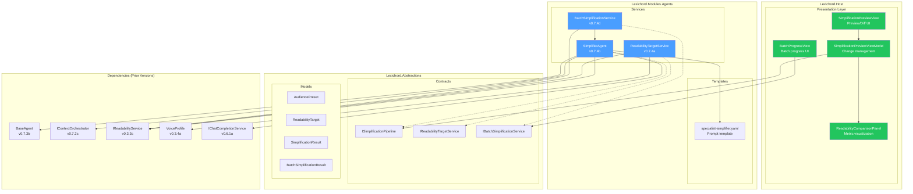
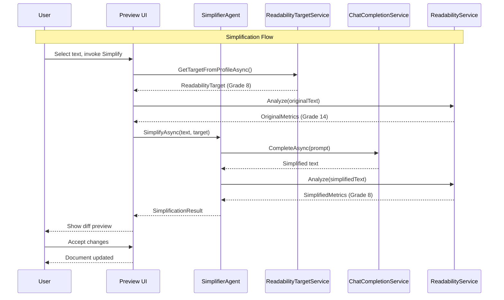

# LCS-DES-074: Design Specification Index — The Simplifier Agent

## Document Control

| Field | Value |
| :--- | :--- |
| **Document ID** | LCS-DES-074-INDEX |
| **Feature ID** | AGT-074 |
| **Feature Name** | The Simplifier Agent |
| **Target Version** | v0.7.4 |
| **Module Scope** | Lexichord.Modules.Agents, Lexichord.Host |
| **Swimlane** | Ensemble |
| **License Tier** | WriterPro |
| **Feature Gate Key** | `FeatureFlags.Agents.Simplifier` |
| **Status** | Draft |
| **Last Updated** | 2026-01-27 |

---

## 1. Executive Summary

**v0.7.4** delivers the **Simplifier Agent** — a specialized AI agent that transforms complex, jargon-laden content into clear, accessible prose tailored to specific audience reading levels.

### 1.1 The Problem

Writers frequently need to adapt content for different audiences:

- Technical documentation that general users cannot understand
- Corporate jargon that obscures meaning
- Complex sentence structures that challenge non-native speakers
- Dense academic prose that executives skip

Manual simplification is time-consuming (2-3 hours per document) and inconsistent. Writers lack objective feedback on whether their simplified content actually hits the target readability level.

### 1.2 The Solution

Implement a specialized agent that:

1. **Reads Voice Profile** to understand target audience characteristics
2. **Calculates current readability** using Flesch-Kincaid and other metrics
3. **Rewrites content** using LLM-powered simplification techniques
4. **Shows before/after comparison** with metrics and diff visualization
5. **Processes entire documents** with batch simplification and progress tracking

### 1.3 Business Value

| Value | Description |
| :--- | :--- |
| **Audience Reach** | Adapt content for different readers without manual rewriting |
| **User Experience** | One-click simplification with real-time metrics comparison |
| **Efficiency** | Batch processing reduces hours of editing to minutes |
| **Quality Control** | Preview/diff UI ensures writer maintains control over changes |
| **Enterprise Ready** | Audience presets standardize readability across teams |
| **Foundation** | Establishes patterns for Tuning and Summarizer agents |

---

## 2. Related Documents

### 2.1 Scope Breakdown Document

The detailed scope breakdown for v0.7.4, including all sub-parts, implementation checklists, user stories, and acceptance criteria:

| Document | Description |
| :--- | :--- |
| **[LCS-SBD-074](./LCS-SBD-074.md)** | Scope Breakdown — The Simplifier Agent |

### 2.2 Sub-Part Design Specifications

Each sub-part has its own detailed design specification following the LDS-01 template:

| Sub-Part | Document | Title | Description |
| :--- | :--- | :--- | :--- |
| v0.7.4a | **[LCS-DES-074a](./LCS-DES-074a.md)** | Readability Target Service | Audience presets and target configuration |
| v0.7.4b | **[LCS-DES-074b](./LCS-DES-074b.md)** | Simplification Pipeline | Core agent and LLM-powered simplification |
| v0.7.4c | **[LCS-DES-074c](./LCS-DES-074c.md)** | Preview/Diff UI | Before/after comparison and change review |
| v0.7.4d | **[LCS-DES-074d](./LCS-DES-074d.md)** | Batch Simplification | Document-wide processing with progress |

---

## 3. Architecture Overview

### 3.1 Component Diagram



### 3.2 Data Flow Overview



---

## 4. Dependencies

### 4.1 Upstream Dependencies (Systems Used)

| Interface | Source Version | Purpose |
| :--- | :--- | :--- |
| `IAgentRegistry` | v0.7.1b | Agent registration and discovery |
| `BaseAgent` | v0.7.3b | Base agent implementation |
| `IContextOrchestrator` | v0.7.2c | Context assembly for prompts |
| `IReadabilityService` | v0.3.3c | Readability metric calculation |
| `VoiceProfile` | v0.3.4a | Target audience settings |
| `IChatCompletionService` | v0.6.1a | LLM communication |
| `IPromptRenderer` | v0.6.3b | Prompt template rendering |
| `IEditorService` | v0.1.3a | Document access |
| `ILicenseContext` | v0.0.4c | WriterPro feature gating |

### 4.2 NuGet Packages

| Package | Version | Purpose |
| :--- | :--- | :--- |
| `DiffPlex` | 1.7.x | Text diff visualization (NEW) |
| (No other new) | - | - |

### 4.3 Downstream Consumers (Future)

| Version | Feature | Uses From v0.7.4 |
| :--- | :--- | :--- |
| v0.7.5 | Tuning Agent | Agent pattern, preview UI components |
| v0.7.6 | Summarizer Agent | Simplification for summary output |
| v0.7.7 | Agent Workflows | Simplifier as workflow step |

---

## 5. License Gating Strategy

The Simplifier Agent is a **WriterPro** feature.

### 5.1 Gating Behavior

| Tier | Behavior |
| :--- | :--- |
| **Core** | Agent visible in registry with lock icon; "Upgrade to WriterPro" prompt on invoke |
| **Writer** | Same as Core |
| **WriterPro** | Full access to all simplification features |
| **Teams** | Full access plus shared audience presets |
| **Enterprise** | Full access plus custom preset deployment |

### 5.2 UI Gating

```csharp
// Agent selector shows lock icon for Core/Writer tiers
public bool IsLocked => !licenseContext.HasFeature(FeatureFlags.Agents.Simplifier);

// Simplify command checks license before execution
[RelayCommand(CanExecute = nameof(CanSimplify))]
private async Task SimplifyAsync()
{
    if (!licenseContext.HasFeature(FeatureFlags.Agents.Simplifier))
    {
        await ShowUpgradePromptAsync("WriterPro");
        return;
    }
    // ... proceed with simplification
}
```

---

## 6. Sub-Part Summary

### 6.1 v0.7.4a: Readability Target Service

**Purpose:** Determine the target readability level based on Voice Profile or audience presets.

| Aspect | Details |
| :--- | :--- |
| **Key Interface** | `IReadabilityTargetService` |
| **Key Record** | `AudiencePreset`, `ReadabilityTarget` |
| **Built-in Presets** | General Public (8), Technical (12), Executive (10), International (6) |
| **Integration** | Reads Voice Profile target audience settings |

**See:** [LCS-DES-074a](./LCS-DES-074a.md)

### 6.2 v0.7.4b: Simplification Pipeline

**Purpose:** Core agent implementation with prompt templates and LLM-powered simplification.

| Aspect | Details |
| :--- | :--- |
| **Key Class** | `SimplifierAgent` extending `BaseAgent` |
| **Key Interface** | `ISimplificationPipeline` |
| **Prompt Template** | `specialist-simplifier.yaml` |
| **Techniques** | Sentence splitting, jargon replacement, passive-to-active, word simplification |

**See:** [LCS-DES-074b](./LCS-DES-074b.md)

### 6.3 v0.7.4c: Preview/Diff UI

**Purpose:** Interactive preview showing before/after comparison with change review.

| Aspect | Details |
| :--- | :--- |
| **Key View** | `SimplificationPreviewView.axaml` |
| **Key ViewModel** | `SimplificationPreviewViewModel` |
| **View Modes** | Side-by-side, inline diff, changes only |
| **Actions** | Accept All, Accept Selected, Reject, Re-simplify |

**See:** [LCS-DES-074c](./LCS-DES-074c.md)

### 6.4 v0.7.4d: Batch Simplification

**Purpose:** Process entire documents with progress tracking and cancellation support.

| Aspect | Details |
| :--- | :--- |
| **Key Interface** | `IBatchSimplificationService` |
| **Processing** | Paragraph-by-paragraph with skip for already-simple |
| **Progress** | Real-time progress reporting with time estimates |
| **Events** | `SimplificationCompletedEvent`, `ParagraphSimplifiedEvent` |

**See:** [LCS-DES-074d](./LCS-DES-074d.md)

---

## 7. Key Scenarios Summary

### 7.1 Audience Presets (v0.7.4a)

| Preset | Target Grade | Max Sentence | Jargon Handling |
| :--- | :--- | :--- | :--- |
| General Public | 8 | 20 words | Replace with plain language |
| Technical | 12 | 30 words | Explain, don't replace |
| Executive | 10 | 15 words | Use business terms |
| International (ESL) | 6 | 15 words | Replace with glossary |

### 7.2 Simplification Techniques (v0.7.4b)

| Technique | Example |
| :--- | :--- |
| Sentence Splitting | Long compound sentence -> Two simple sentences |
| Jargon Replacement | "facilitate" -> "help" |
| Passive to Active | "was written by the team" -> "the team wrote" |
| Word Simplification | "utilize" -> "use" |
| Clause Reduction | "in order to" -> "to" |

### 7.3 Change Types (v0.7.4c)

| Change Type | Description |
| :--- | :--- |
| `SentenceSplit` | Long sentence broken into shorter ones |
| `JargonReplacement` | Technical term replaced with plain language |
| `PassiveToActive` | Passive voice converted to active |
| `WordSimplification` | Complex word replaced with simpler synonym |
| `ClauseReduction` | Unnecessary clauses removed |
| `TransitionAdded` | Transitional phrase added for flow |
| `RedundancyRemoved` | Redundant words/phrases removed |

### 7.4 Performance Targets (v0.7.4d)

| Operation | Target |
| :--- | :--- |
| Single paragraph simplification | < 3 seconds |
| 10,000 word document batch | < 2 minutes |
| Memory usage (batch) | < 100MB |

---

## 8. Implementation Checklist Summary

| Sub-Part | Tasks | Est. Hours |
| :--- | :--- | :--- |
| v0.7.4a | Readability Target Service | 9 |
| v0.7.4b | Simplification Pipeline | 12.5 |
| v0.7.4c | Preview/Diff UI | 14 |
| v0.7.4d | Batch Simplification | 10.5 |
| Integration | Tests, DI, Documentation | 2 |
| **Total** | | **48 hours** |

See [LCS-SBD-074](./LCS-SBD-074.md) Section 4 for the detailed task breakdown.

---

## 9. Success Criteria Summary

| Category | Criterion | Target |
| :--- | :--- | :--- |
| **Accuracy** | Grade level reduction | Within +/-1 of target |
| **Acceptance** | User acceptance rate | > 80% of changes accepted |
| **Performance** | Single paragraph | < 3 seconds |
| **Performance** | 10,000 word document | < 2 minutes |
| **Memory** | Batch processing | < 100MB |
| **Satisfaction** | User rating | > 4.0/5.0 |

See [LCS-SBD-074](./LCS-SBD-074.md) Section 9 for full success metrics.

---

## 10. Test Coverage Summary

| Sub-Part | Test File | Coverage Area |
| :--- | :--- | :--- |
| v0.7.4a | `ReadabilityTargetServiceTests.cs` | Preset loading, target calculation |
| v0.7.4b | `SimplifierAgentTests.cs` | Simplification accuracy, response parsing |
| v0.7.4b | `SimplificationPipelineTests.cs` | End-to-end pipeline |
| v0.7.4c | `SimplificationPreviewViewModelTests.cs` | Change management, accept/reject |
| v0.7.4d | `BatchSimplificationServiceTests.cs` | Paragraph processing, progress |
| All | `SimplificationIntegrationTests.cs` | Full workflow integration |

See individual design specs for detailed test scenarios.

---

## 11. What This Enables

| Version | Feature | Uses From v0.7.4 |
| :--- | :--- | :--- |
| v0.7.5 | Tuning Agent | Agent pattern, BaseAgent extension, preview UI |
| v0.7.6 | Summarizer Agent | Simplification for readable summaries |
| v0.7.7 | Agent Workflows | Simplifier as pipeline step |
| v0.8.x | Custom Agents | Agent registration and configuration patterns |
| Future | Industry Presets | Medical, legal, financial simplification targets |

---

## 12. Risks Summary

| Risk | Impact | Mitigation |
| :--- | :--- | :--- |
| LLM inaccuracies | High | Validation step, user review required |
| Token costs | Medium | Chunking, budget limits, cost preview |
| Technical accuracy loss | High | Preserve terms with glossary option |
| Large document performance | Medium | Streaming, virtualized UI |

See [LCS-SBD-074](./LCS-SBD-074.md) Section 8 for full risk analysis.

---

## Document History

| Version | Date | Author | Changes |
| :--- | :--- | :--- | :--- |
| 1.0 | 2026-01-27 | Lead Architect | Initial draft |
