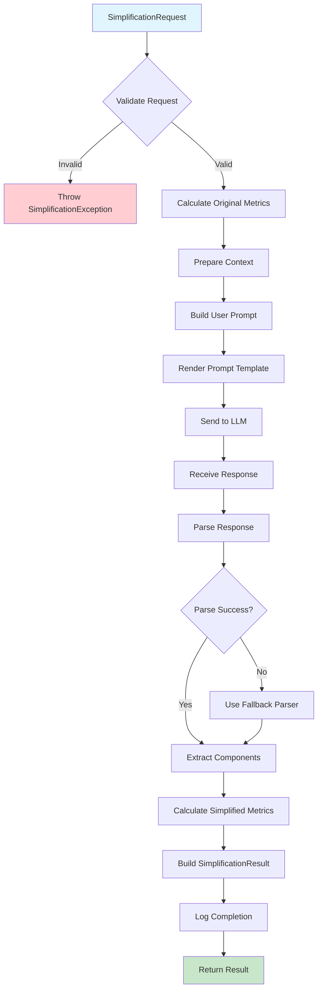
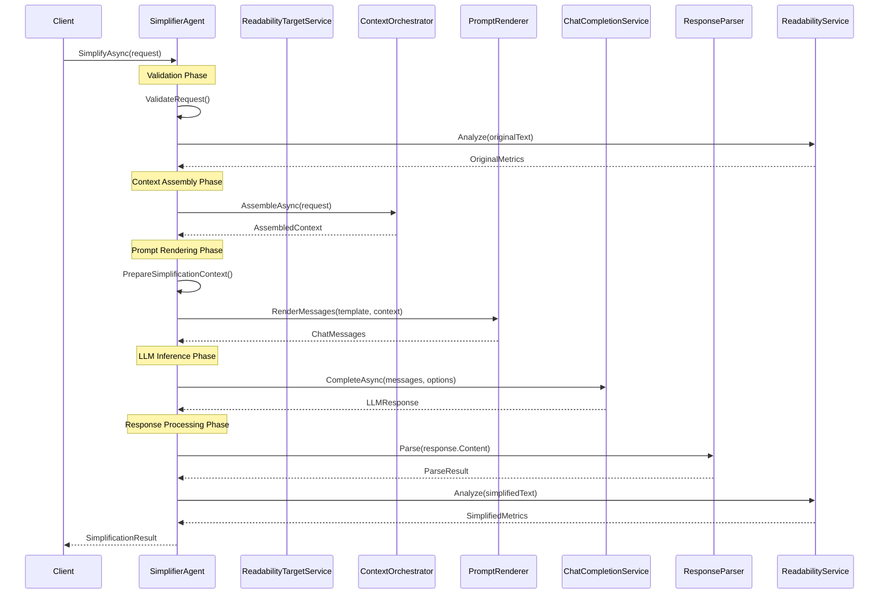

# LCS-DES-074b: Design Specification — Simplification Pipeline

## 1. Metadata & Categorization

| Field | Value | Description |
| :--- | :--- | :--- |
| **Feature ID** | `AGT-074b` | Sub-part of AGT-074 |
| **Feature Name** | `Simplification Pipeline` | Core agent and LLM-powered simplification |
| **Target Version** | `v0.7.4b` | Second sub-part of v0.7.4 |
| **Module Scope** | `Lexichord.Modules.Agents` | Agent services module |
| **Swimlane** | `Ensemble` | Part of Agents vertical |
| **License Tier** | `WriterPro` | Required for simplification features |
| **Feature Gate Key** | `FeatureFlags.Agents.Simplifier` | Shared with parent feature |
| **Author** | Lead Architect | |
| **Reviewer** | | |
| **Status** | `Draft` | |
| **Last Updated** | `2026-01-27` | |
| **Parent Document** | [LCS-DES-074-INDEX](./LCS-DES-074-INDEX.md) | |
| **Scope Breakdown** | [LCS-SBD-074 Section 3.2](./LCS-SBD-074.md#32-v074b-simplification-pipeline) | |

---

## 2. Executive Summary

### 2.1 The Requirement

The Simplifier Agent needs a core pipeline that:

- Takes input text and a readability target
- Assembles appropriate context (current metrics, style rules, document context)
- Generates a prompt that instructs the LLM to simplify effectively
- Parses structured output into usable change records
- Calculates before/after metrics to verify improvement

> **Goal:** Transform complex, jargon-laden content into clear, accessible prose that hits a specific Flesch-Kincaid grade level target.

### 2.2 The Proposed Solution

Implement `SimplifierAgent` extending `BaseAgent` that:

1. Integrates with `IReadabilityTargetService` to get configuration
2. Uses `IContextOrchestrator` to gather relevant context
3. Renders the `specialist-simplifier.yaml` prompt template
4. Communicates with `IChatCompletionService` for LLM inference
5. Parses structured response into `SimplificationResult`
6. Calculates metrics using `IReadabilityService`

---

## 3. Architecture & Modular Strategy

### 3.1 Dependencies

#### 3.1.1 Upstream Dependencies

| Interface | Source Version | Purpose |
| :--- | :--- | :--- |
| `BaseAgent` | v0.7.3b | Base agent implementation |
| `IContextOrchestrator` | v0.7.2c | Context assembly |
| `IChatCompletionService` | v0.6.1a | LLM communication |
| `IPromptRenderer` | v0.6.3b | Template rendering |
| `IPromptTemplateRepository` | v0.6.3c | Template storage |
| `IReadabilityTargetService` | v0.7.4a | Target configuration |
| `IReadabilityService` | v0.3.3c | Metrics calculation |
| `ILicenseContext` | v0.0.4c | Feature gating |

#### 3.1.2 NuGet Packages

| Package | Version | Purpose |
| :--- | :--- | :--- |
| (No new packages) | - | Uses existing dependencies |

### 3.2 Licensing Behavior

- **Load Behavior:** Soft Gate - Agent loads but invocation requires WriterPro
- **Fallback Experience:**
  - Agent visible in Agent Registry with lock icon
  - Invocation shows "Upgrade to WriterPro" modal
  - Streaming endpoints return license error

---

## 4. Data Contract (The API)

### 4.1 Core Interface

```csharp
namespace Lexichord.Abstractions.Contracts;

/// <summary>
/// Orchestrates text simplification from input to output.
/// </summary>
public interface ISimplificationPipeline
{
    /// <summary>
    /// Simplifies the given text to meet the specified readability target.
    /// </summary>
    /// <param name="request">The simplification request.</param>
    /// <param name="ct">Cancellation token.</param>
    /// <returns>The simplification result with metrics and changes.</returns>
    Task<SimplificationResult> SimplifyAsync(
        SimplificationRequest request,
        CancellationToken ct = default);

    /// <summary>
    /// Streams simplification chunks as they become available.
    /// Useful for real-time UI updates during processing.
    /// </summary>
    /// <param name="request">The simplification request.</param>
    /// <param name="ct">Cancellation token.</param>
    /// <returns>Async enumerable of simplification chunks.</returns>
    IAsyncEnumerable<SimplificationChunk> SimplifyStreamingAsync(
        SimplificationRequest request,
        CancellationToken ct = default);

    /// <summary>
    /// Validates that a simplification request is valid and achievable.
    /// </summary>
    /// <param name="request">The request to validate.</param>
    /// <returns>Validation result with any warnings.</returns>
    SimplificationValidation ValidateRequest(SimplificationRequest request);
}
```

### 4.2 Request and Response Records

```csharp
namespace Lexichord.Abstractions.Models;

/// <summary>
/// A request to simplify text content.
/// </summary>
public record SimplificationRequest
{
    /// <summary>
    /// The original text to simplify.
    /// </summary>
    public required string OriginalText { get; init; }

    /// <summary>
    /// The readability target to achieve.
    /// </summary>
    public required ReadabilityTarget Target { get; init; }

    /// <summary>
    /// Optional document path for additional context.
    /// </summary>
    public string? DocumentPath { get; init; }

    /// <summary>
    /// The simplification strategy to use.
    /// </summary>
    public SimplificationStrategy Strategy { get; init; } = SimplificationStrategy.Balanced;

    /// <summary>
    /// Whether to generate a glossary for technical terms.
    /// </summary>
    public bool GenerateGlossary { get; init; } = false;

    /// <summary>
    /// Whether to preserve formatting (headers, lists, etc.).
    /// </summary>
    public bool PreserveFormatting { get; init; } = true;

    /// <summary>
    /// Optional user instructions to include in the prompt.
    /// </summary>
    public string? AdditionalInstructions { get; init; }
}

/// <summary>
/// Simplification strategy options.
/// </summary>
public enum SimplificationStrategy
{
    /// <summary>
    /// Minimal changes, preserve author voice as much as possible.
    /// Best for small grade level gaps (1-3 grades).
    /// </summary>
    Conservative,

    /// <summary>
    /// Moderate simplification balancing clarity and voice.
    /// Best for medium gaps (3-6 grades).
    /// </summary>
    Balanced,

    /// <summary>
    /// Maximum simplification for accessibility.
    /// Best for large gaps (6+ grades) or ESL audiences.
    /// </summary>
    Aggressive
}

/// <summary>
/// The complete result of a simplification operation.
/// </summary>
public record SimplificationResult
{
    /// <summary>
    /// The simplified version of the input text.
    /// </summary>
    public required string SimplifiedText { get; init; }

    /// <summary>
    /// Readability metrics for the original text.
    /// </summary>
    public required ReadabilityMetrics OriginalMetrics { get; init; }

    /// <summary>
    /// Readability metrics for the simplified text.
    /// </summary>
    public required ReadabilityMetrics SimplifiedMetrics { get; init; }

    /// <summary>
    /// List of individual changes made during simplification.
    /// </summary>
    public required IReadOnlyList<SimplificationChange> Changes { get; init; }

    /// <summary>
    /// Optional glossary of technical terms with definitions.
    /// </summary>
    public IReadOnlyDictionary<string, string>? Glossary { get; init; }

    /// <summary>
    /// Token usage for this operation.
    /// </summary>
    public required UsageMetrics TokenUsage { get; init; }

    /// <summary>
    /// Processing time for this operation.
    /// </summary>
    public required TimeSpan ProcessingTime { get; init; }

    /// <summary>
    /// The strategy that was used.
    /// </summary>
    public SimplificationStrategy StrategyUsed { get; init; }

    /// <summary>
    /// Reduction in FK grade level achieved.
    /// </summary>
    public double GradeLevelReduction =>
        OriginalMetrics.FleschKincaidGradeLevel - SimplifiedMetrics.FleschKincaidGradeLevel;

    /// <summary>
    /// Whether the target grade was achieved (within tolerance).
    /// </summary>
    public bool TargetAchieved(ReadabilityTarget target) =>
        SimplifiedMetrics.FleschKincaidGradeLevel <= target.TargetFleschKincaidGrade + target.GradeTolerance;
}

/// <summary>
/// A single change made during simplification.
/// </summary>
public record SimplificationChange
{
    /// <summary>
    /// The original text that was changed.
    /// </summary>
    public required string OriginalText { get; init; }

    /// <summary>
    /// The simplified replacement text.
    /// </summary>
    public required string SimplifiedText { get; init; }

    /// <summary>
    /// The type of simplification change.
    /// </summary>
    public required SimplificationChangeType ChangeType { get; init; }

    /// <summary>
    /// Brief explanation of why this change was made.
    /// </summary>
    public required string Explanation { get; init; }

    /// <summary>
    /// Location in the original text (character offsets).
    /// </summary>
    public TextSpan? Location { get; init; }

    /// <summary>
    /// Confidence score for this change (0-1).
    /// </summary>
    public double Confidence { get; init; } = 1.0;
}

/// <summary>
/// Types of simplification changes.
/// </summary>
public enum SimplificationChangeType
{
    /// <summary>
    /// Long sentence broken into multiple shorter sentences.
    /// </summary>
    SentenceSplit,

    /// <summary>
    /// Technical term replaced with plain language equivalent.
    /// </summary>
    JargonReplacement,

    /// <summary>
    /// Passive voice converted to active voice.
    /// </summary>
    PassiveToActive,

    /// <summary>
    /// Complex word replaced with simpler synonym.
    /// </summary>
    WordSimplification,

    /// <summary>
    /// Nested or complex clause simplified.
    /// </summary>
    ClauseReduction,

    /// <summary>
    /// Transitional phrase added for better flow.
    /// </summary>
    TransitionAdded,

    /// <summary>
    /// Redundant words or phrases removed.
    /// </summary>
    RedundancyRemoved,

    /// <summary>
    /// Multiple changes combined.
    /// </summary>
    Combined
}

/// <summary>
/// A chunk of simplification output for streaming.
/// </summary>
public record SimplificationChunk(
    string TextDelta,
    bool IsComplete,
    SimplificationChange? CompletedChange
);

/// <summary>
/// Validation result for a simplification request.
/// </summary>
public record SimplificationValidation(
    bool IsValid,
    IReadOnlyList<string> Errors,
    IReadOnlyList<string> Warnings
);
```

---

## 5. Implementation Logic

### 5.1 SimplifierAgent Implementation

```csharp
namespace Lexichord.Modules.Agents;

/// <summary>
/// Specialized agent for simplifying complex text to target readability levels.
/// </summary>
[RequiresLicense(LicenseTier.WriterPro)]
[AgentDefinition("simplifier", "The Simplifier", "Reduces complexity for broader audiences")]
public class SimplifierAgent : BaseAgent, ISimplificationPipeline
{
    private readonly IReadabilityTargetService _targetService;
    private readonly IReadabilityService _readabilityService;
    private readonly ISimplificationResponseParser _responseParser;

    public SimplifierAgent(
        IChatCompletionService llm,
        IPromptRenderer renderer,
        IContextOrchestrator contextOrchestrator,
        IReadabilityTargetService targetService,
        IReadabilityService readabilityService,
        ISimplificationResponseParser responseParser,
        IPromptTemplateRepository templates,
        ILogger<SimplifierAgent> logger)
        : base(llm, renderer, contextOrchestrator, templates, logger)
    {
        _targetService = targetService;
        _readabilityService = readabilityService;
        _responseParser = responseParser;
    }

    #region Agent Metadata

    public override string AgentId => "simplifier";
    public override string Name => "The Simplifier";
    public override string Description => "Makes complex content accessible to wider audiences";
    public override string Icon => "zap";

    public override AgentCapabilities Capabilities =>
        AgentCapabilities.Chat |
        AgentCapabilities.DocumentContext |
        AgentCapabilities.StreamingResponse;

    protected override string GetTemplateId() => "specialist-simplifier";

    protected override ChatOptions GetDefaultOptions() => new()
    {
        Model = "gpt-4o",
        Temperature = 0.4f,  // Slightly creative for natural rewrites
        MaxTokens = 4096,
        TopP = 0.95f
    };

    #endregion

    #region ISimplificationPipeline Implementation

    public async Task<SimplificationResult> SimplifyAsync(
        SimplificationRequest request,
        CancellationToken ct = default)
    {
        var stopwatch = Stopwatch.StartNew();

        // Validate request
        var validation = ValidateRequest(request);
        if (!validation.IsValid)
        {
            throw new SimplificationException(
                $"Invalid request: {string.Join(", ", validation.Errors)}");
        }

        // Calculate original metrics
        var originalMetrics = _readabilityService.Analyze(request.OriginalText);

        Logger.LogDebug(
            "Simplifying text: {WordCount} words, target grade {TargetGrade}",
            originalMetrics.WordCount, request.Target.TargetFleschKincaidGrade);

        // Prepare context
        var context = await PrepareSimplificationContextAsync(request, originalMetrics, ct);

        // Build and send request to LLM
        var agentRequest = new AgentRequest(
            UserMessage: BuildUserPrompt(request),
            Selection: request.OriginalText,
            DocumentPath: request.DocumentPath
        );

        var response = await InvokeAsync(agentRequest, context, ct);

        // Parse structured response
        var parseResult = _responseParser.Parse(response.Content);

        // Calculate simplified metrics
        var simplifiedMetrics = _readabilityService.Analyze(parseResult.SimplifiedText);

        stopwatch.Stop();

        var result = new SimplificationResult
        {
            SimplifiedText = parseResult.SimplifiedText,
            OriginalMetrics = originalMetrics,
            SimplifiedMetrics = simplifiedMetrics,
            Changes = parseResult.Changes,
            Glossary = parseResult.Glossary,
            TokenUsage = response.Usage,
            ProcessingTime = stopwatch.Elapsed,
            StrategyUsed = request.Strategy
        };

        Logger.LogInformation(
            "Simplification completed: Grade {Before} -> {After} in {ElapsedMs}ms",
            originalMetrics.FleschKincaidGradeLevel,
            simplifiedMetrics.FleschKincaidGradeLevel,
            stopwatch.ElapsedMilliseconds);

        return result;
    }

    public async IAsyncEnumerable<SimplificationChunk> SimplifyStreamingAsync(
        SimplificationRequest request,
        [EnumeratorCancellation] CancellationToken ct = default)
    {
        var context = await PrepareSimplificationContextAsync(
            request, _readabilityService.Analyze(request.OriginalText), ct);

        var agentRequest = new AgentRequest(
            UserMessage: BuildUserPrompt(request),
            Selection: request.OriginalText,
            DocumentPath: request.DocumentPath
        );

        await foreach (var chunk in InvokeStreamingAsync(agentRequest, context, ct))
        {
            yield return new SimplificationChunk(
                TextDelta: chunk.Content,
                IsComplete: chunk.IsComplete,
                CompletedChange: null  // Parse changes from complete response
            );
        }
    }

    public SimplificationValidation ValidateRequest(SimplificationRequest request)
    {
        var errors = new List<string>();
        var warnings = new List<string>();

        // Validate text
        if (string.IsNullOrWhiteSpace(request.OriginalText))
        {
            errors.Add("Original text cannot be empty");
        }
        else if (request.OriginalText.Length < 10)
        {
            warnings.Add("Text is very short; simplification may have limited effect");
        }
        else if (request.OriginalText.Length > 50000)
        {
            errors.Add("Text exceeds maximum length (50,000 characters). Use batch processing.");
        }

        // Validate target
        if (request.Target.TargetFleschKincaidGrade < 1 ||
            request.Target.TargetFleschKincaidGrade > 18)
        {
            errors.Add("Target grade level must be between 1 and 18");
        }

        // Check grade gap
        if (!string.IsNullOrWhiteSpace(request.OriginalText))
        {
            var metrics = _readabilityService.Analyze(request.OriginalText);
            var gap = metrics.FleschKincaidGradeLevel - request.Target.TargetFleschKincaidGrade;

            if (gap > 10)
            {
                warnings.Add($"Large grade gap ({gap:F1}); consider aggressive strategy");
            }

            if (gap < 0)
            {
                warnings.Add("Text is already simpler than target; no simplification needed");
            }
        }

        return new SimplificationValidation(
            IsValid: errors.Count == 0,
            Errors: errors,
            Warnings: warnings
        );
    }

    #endregion

    #region Private Methods

    private async Task<IDictionary<string, object>> PrepareSimplificationContextAsync(
        SimplificationRequest request,
        ReadabilityMetrics originalMetrics,
        CancellationToken ct)
    {
        var context = new Dictionary<string, object>
        {
            // Target configuration
            ["target_grade_level"] = request.Target.TargetFleschKincaidGrade,
            ["max_sentence_words"] = request.Target.MaxSentenceWords,
            ["max_paragraph_sentences"] = request.Target.MaxParagraphSentences,
            ["simplify_jargon"] = request.Target.SimplifyJargon,
            ["convert_passive"] = request.Target.ConvertPassiveToActive,

            // Current metrics
            ["current_flesch_kincaid"] = originalMetrics.FleschKincaidGradeLevel,
            ["current_gunning_fog"] = originalMetrics.GunningFogIndex,
            ["current_avg_sentence_length"] = originalMetrics.AverageSentenceLength,
            ["current_passive_percentage"] = originalMetrics.PassiveVoicePercentage,
            ["current_complex_word_percentage"] = originalMetrics.ComplexWordPercentage,

            // Strategy
            ["strategy"] = request.Strategy.ToString().ToLowerInvariant(),
            ["generate_glossary"] = request.GenerateGlossary,
            ["preserve_formatting"] = request.PreserveFormatting
        };

        // Add term replacements if specified
        if (request.Target.TermReplacements?.Count > 0)
        {
            context["term_replacements"] = FormatTermReplacements(request.Target.TermReplacements);
        }

        // Gather additional context via orchestrator if document path provided
        if (!string.IsNullOrEmpty(request.DocumentPath))
        {
            var assembledContext = await ContextOrchestrator.AssembleAsync(
                new ContextGatheringRequest(
                    request.DocumentPath,
                    CursorPosition: null,
                    request.OriginalText,
                    AgentId,
                    Hints: null),
                new ContextBudget(MaxTokens: 2000, RequiredStrategies: null, ExcludedStrategies: null),
                ct);

            foreach (var (key, value) in assembledContext.Variables)
            {
                context[key] = value;
            }
        }

        return context;
    }

    private string BuildUserPrompt(SimplificationRequest request)
    {
        var sb = new StringBuilder();
        sb.AppendLine($"Please simplify the following text to approximately grade level {request.Target.TargetFleschKincaidGrade}.");
        sb.AppendLine();

        if (request.Strategy == SimplificationStrategy.Conservative)
        {
            sb.AppendLine("Use a CONSERVATIVE approach: make minimal changes while preserving the author's voice.");
        }
        else if (request.Strategy == SimplificationStrategy.Aggressive)
        {
            sb.AppendLine("Use an AGGRESSIVE approach: prioritize maximum accessibility over voice preservation.");
        }

        if (request.GenerateGlossary)
        {
            sb.AppendLine("Include a glossary of technical terms that were preserved or explained.");
        }

        if (!string.IsNullOrEmpty(request.AdditionalInstructions))
        {
            sb.AppendLine();
            sb.AppendLine($"Additional instructions: {request.AdditionalInstructions}");
        }

        return sb.ToString();
    }

    private static string FormatTermReplacements(IReadOnlyDictionary<string, string> replacements)
    {
        return string.Join("\n", replacements.Select(kvp => $"- \"{kvp.Key}\" -> \"{kvp.Value}\""));
    }

    #endregion
}
```

### 5.2 Response Parser

```csharp
namespace Lexichord.Modules.Agents.Services;

/// <summary>
/// Parses the structured response from the Simplifier LLM.
/// </summary>
public interface ISimplificationResponseParser
{
    SimplificationParseResult Parse(string llmResponse);
}

public record SimplificationParseResult(
    string SimplifiedText,
    IReadOnlyList<SimplificationChange> Changes,
    IReadOnlyDictionary<string, string>? Glossary
);

public class SimplificationResponseParser : ISimplificationResponseParser
{
    private static readonly Regex SimplifiedBlockRegex = new(
        @"```simplified\s*\n([\s\S]*?)\n```",
        RegexOptions.Compiled | RegexOptions.Multiline);

    private static readonly Regex ChangesBlockRegex = new(
        @"```changes\s*\n([\s\S]*?)\n```",
        RegexOptions.Compiled | RegexOptions.Multiline);

    private static readonly Regex GlossaryBlockRegex = new(
        @"```glossary\s*\n([\s\S]*?)\n```",
        RegexOptions.Compiled | RegexOptions.Multiline);

    private static readonly Regex ChangeLineRegex = new(
        @"^-\s*(.+?)\s*->\s*(.+?)\s*\|\s*Type:\s*(\w+)\s*\|\s*Reason:\s*(.+)$",
        RegexOptions.Compiled | RegexOptions.Multiline);

    private static readonly Regex GlossaryLineRegex = new(
        @"^-\s*(.+?):\s*(.+)$",
        RegexOptions.Compiled | RegexOptions.Multiline);

    public SimplificationParseResult Parse(string llmResponse)
    {
        // Extract simplified text
        var simplifiedMatch = SimplifiedBlockRegex.Match(llmResponse);
        var simplifiedText = simplifiedMatch.Success
            ? simplifiedMatch.Groups[1].Value.Trim()
            : ExtractFallbackText(llmResponse);

        // Extract changes
        var changes = new List<SimplificationChange>();
        var changesMatch = ChangesBlockRegex.Match(llmResponse);
        if (changesMatch.Success)
        {
            var changesContent = changesMatch.Groups[1].Value;
            var changeMatches = ChangeLineRegex.Matches(changesContent);

            foreach (Match match in changeMatches)
            {
                changes.Add(new SimplificationChange
                {
                    OriginalText = match.Groups[1].Value.Trim().Trim('"'),
                    SimplifiedText = match.Groups[2].Value.Trim().Trim('"'),
                    ChangeType = ParseChangeType(match.Groups[3].Value.Trim()),
                    Explanation = match.Groups[4].Value.Trim()
                });
            }
        }

        // Extract glossary if present
        Dictionary<string, string>? glossary = null;
        var glossaryMatch = GlossaryBlockRegex.Match(llmResponse);
        if (glossaryMatch.Success)
        {
            glossary = new Dictionary<string, string>();
            var glossaryContent = glossaryMatch.Groups[1].Value;
            var glossaryMatches = GlossaryLineRegex.Matches(glossaryContent);

            foreach (Match match in glossaryMatches)
            {
                var term = match.Groups[1].Value.Trim();
                var definition = match.Groups[2].Value.Trim();
                glossary[term] = definition;
            }
        }

        return new SimplificationParseResult(simplifiedText, changes, glossary);
    }

    private static string ExtractFallbackText(string response)
    {
        // If no structured blocks found, assume the entire response is simplified text
        // Remove any obvious metadata or instructions
        var lines = response.Split('\n')
            .Where(l => !l.TrimStart().StartsWith("Changes:") &&
                       !l.TrimStart().StartsWith("Glossary:") &&
                       !l.TrimStart().StartsWith("Note:"))
            .ToArray();

        return string.Join("\n", lines).Trim();
    }

    private static SimplificationChangeType ParseChangeType(string typeString)
    {
        return typeString.ToLowerInvariant() switch
        {
            "sentencesplit" or "sentence_split" or "split" => SimplificationChangeType.SentenceSplit,
            "jargonreplacement" or "jargon_replacement" or "jargon" => SimplificationChangeType.JargonReplacement,
            "passivetoactive" or "passive_to_active" or "passive" => SimplificationChangeType.PassiveToActive,
            "wordsimplification" or "word_simplification" or "word" => SimplificationChangeType.WordSimplification,
            "clausereduction" or "clause_reduction" or "clause" => SimplificationChangeType.ClauseReduction,
            "transitionadded" or "transition_added" or "transition" => SimplificationChangeType.TransitionAdded,
            "redundancyremoved" or "redundancy_removed" or "redundancy" => SimplificationChangeType.RedundancyRemoved,
            _ => SimplificationChangeType.Combined
        };
    }
}
```

### 5.3 Prompt Template

```yaml
# prompts/specialist-simplifier.yaml
template_id: "specialist-simplifier"
name: "Simplifier Specialist"
version: "1.0.0"
description: "Transforms complex text into accessible, clear prose"

system_prompt: |
  You are a writing coach specializing in clarity and accessibility.
  Your goal is to make complex content understandable to a wider audience
  while preserving accuracy and the author's core message.

  ## Target Reading Level
  {{#target_grade_level}}
  Target Flesch-Kincaid Grade Level: {{target_grade_level}}
  (Grade {{target_grade_level}} = approximately {{target_grade_level}}th grade education level)
  {{/target_grade_level}}
  {{^target_grade_level}}
  Target Flesch-Kincaid Grade Level: 8 (8th grade / general public)
  {{/target_grade_level}}

  ## Current Text Metrics
  {{#current_flesch_kincaid}}
  - Current Grade Level: {{current_flesch_kincaid}}
  - Current Gunning Fog Index: {{current_gunning_fog}}
  - Average Sentence Length: {{current_avg_sentence_length}} words
  - Passive Voice Usage: {{current_passive_percentage}}%
  - Complex Word Percentage: {{current_complex_word_percentage}}%
  {{/current_flesch_kincaid}}

  ## Constraints
  - Maximum sentence length: {{max_sentence_words}} words
  - Maximum paragraph length: {{max_paragraph_sentences}} sentences
  {{#simplify_jargon}}- Replace jargon with plain language (or explain if essential){{/simplify_jargon}}
  {{#convert_passive}}- Convert passive voice to active voice where appropriate{{/convert_passive}}

  ## Simplification Techniques
  Apply these techniques as needed to reach the target reading level:

  1. **Sentence Splitting**
     - Break long sentences (>{​{max_sentence_words}} words) into shorter ones
     - Each sentence should express one main idea

  2. **Jargon Handling**
     {{#simplify_jargon}}
     - Replace technical terms with plain language equivalents
     - Examples: "utilize" -> "use", "facilitate" -> "help", "subsequently" -> "then"
     {{/simplify_jargon}}
     {{^simplify_jargon}}
     - Preserve technical terms but add brief explanations if needed
     {{/simplify_jargon}}

  3. **Voice Conversion**
     {{#convert_passive}}
     - Convert passive voice to active voice
     - "The report was written by the team" -> "The team wrote the report"
     - "Mistakes were made" -> "We made mistakes" (or identify the actor)
     {{/convert_passive}}

  4. **Word Simplification**
     - Replace complex words with simpler synonyms
     - Prioritize common, everyday words over formal/academic vocabulary

  5. **Clause Reduction**
     - Simplify nested clauses
     - Remove unnecessary relative clauses
     - "in order to" -> "to"
     - "due to the fact that" -> "because"

  6. **Transition Addition**
     - Add transitional phrases for better flow between ideas
     - "First", "Next", "However", "Therefore", etc.

  ## Preservation Rules
  ALWAYS preserve:
  - Technical accuracy (facts, data, numbers)
  - Key terminology that cannot be simplified without losing meaning
  - The author's conclusions and main arguments
  - Proper nouns, names, titles, and specific references
  {{#preserve_formatting}}- Formatting markers (headers, lists, emphasis){{/preserve_formatting}}

  {{#term_replacements}}
  ## Specific Term Replacements
  Use these replacements when encountering these terms:
  {{term_replacements}}
  {{/term_replacements}}

  ## Output Format
  Structure your response as follows:

  ```simplified
  [Your simplified version of the text goes here]
  ```

  ```changes
  - "[original phrase]" -> "[simplified phrase]" | Type: [ChangeType] | Reason: [Brief explanation]
  - "[original phrase]" -> "[simplified phrase]" | Type: [ChangeType] | Reason: [Brief explanation]
  ```

  {{#generate_glossary}}
  ```glossary
  - [Technical term]: [Plain language definition]
  - [Technical term]: [Plain language definition]
  ```
  {{/generate_glossary}}

  ## Change Types
  Use these type labels for changes:
  - SentenceSplit: Sentence broken into multiple shorter sentences
  - JargonReplacement: Technical term replaced with plain language
  - PassiveToActive: Passive voice converted to active
  - WordSimplification: Complex word replaced with simpler synonym
  - ClauseReduction: Unnecessary clause removed or simplified
  - TransitionAdded: Transitional phrase added
  - RedundancyRemoved: Redundant words/phrases removed
  - Combined: Multiple types of changes in one

user_prompt: |
  {{user_input}}

  Text to simplify:
  """
  {{selection}}
  """

variables:
  - name: target_grade_level
    type: integer
    default: 8
    description: Target Flesch-Kincaid grade level
  - name: max_sentence_words
    type: integer
    default: 20
    description: Maximum words per sentence
  - name: max_paragraph_sentences
    type: integer
    default: 5
    description: Maximum sentences per paragraph
  - name: simplify_jargon
    type: boolean
    default: true
    description: Whether to replace jargon with plain language
  - name: convert_passive
    type: boolean
    default: true
    description: Whether to convert passive to active voice
  - name: generate_glossary
    type: boolean
    default: false
    description: Whether to generate a glossary of terms
  - name: preserve_formatting
    type: boolean
    default: true
    description: Whether to preserve formatting markers
```

### 5.4 Simplification Flow Diagram



---

## 6. Data Flow Diagram



---

## 7. UI/UX Specifications

This sub-part is primarily backend/service implementation. The UI integration is handled by [LCS-DES-074c](./LCS-DES-074c.md) (Preview/Diff UI).

However, the agent must expose proper metadata for the Agent Registry UI:

```csharp
// Agent metadata for UI display
public AgentDisplayInfo GetDisplayInfo() => new(
    Id: AgentId,
    Name: Name,
    Description: Description,
    Icon: "zap",
    Category: "Readability",
    LicenseTier: LicenseTier.WriterPro,
    Capabilities: new[]
    {
        "Simplify selected text",
        "Target specific grade levels",
        "Generate term glossaries",
        "Track changes with explanations"
    }
);
```

---

## 8. Observability & Logging

| Level | Message Template |
| :--- | :--- |
| Debug | `"Simplifying text: {WordCount} words, target grade {TargetGrade}"` |
| Debug | `"Context assembled with {FragmentCount} fragments, {TokenCount} tokens"` |
| Debug | `"Prompt rendered: {PromptTokenCount} tokens"` |
| Info | `"Simplification completed: Grade {Before} -> {After} in {ElapsedMs}ms"` |
| Info | `"Changes detected: {ChangeCount} modifications"` |
| Warning | `"Simplification exceeded token budget: {UsedTokens}/{MaxTokens}"` |
| Warning | `"Target grade not achieved: {Actual} vs target {Target}"` |
| Error | `"Simplification failed: {Error}"` |
| Error | `"Response parsing failed: {Error}"` |

### Metrics (OpenTelemetry)

```csharp
// Metrics to track
private static readonly Counter<long> SimplificationCounter =
    Meter.CreateCounter<long>("lexichord.agents.simplifier.invocations");

private static readonly Histogram<double> SimplificationDuration =
    Meter.CreateHistogram<double>("lexichord.agents.simplifier.duration_ms");

private static readonly Histogram<double> GradeLevelReduction =
    Meter.CreateHistogram<double>("lexichord.agents.simplifier.grade_reduction");
```

---

## 9. Security & Safety

| Risk | Level | Mitigation |
| :--- | :--- | :--- |
| Prompt injection via user text | Medium | Sanitize user instructions; use structured prompts |
| Oversimplification losing accuracy | Medium | Preserve facts rule in prompt; user review required |
| Token cost abuse | Low | Enforce character limits; track usage per user |
| Inappropriate content generation | Low | LLM safety filters; content moderation |

---

## 10. Acceptance Criteria

### 10.1 Functional Criteria

| # | Given | When | Then |
| :--- | :--- | :--- | :--- |
| 1 | Complex text at Grade 14 | Simplifying with target Grade 8 | Result achieves Grade 8 +/- 1 |
| 2 | Text with passive voice | Simplifying with ConvertPassive=true | Passive sentences converted to active |
| 3 | Text with jargon | Simplifying with SimplifyJargon=true | Jargon replaced with plain language |
| 4 | Long sentences (30+ words) | Simplifying | Sentences split to under MaxSentenceWords |
| 5 | GenerateGlossary=true | Simplifying technical text | Glossary included in result |
| 6 | Conservative strategy | Simplifying | Minimal changes, voice preserved |
| 7 | Aggressive strategy | Simplifying | Maximum simplification applied |
| 8 | Text already at target | Simplifying | Returns with minimal/no changes |
| 9 | Empty text | Simplifying | Validation error returned |
| 10 | Text > 50,000 chars | Simplifying | Validation error returned |

### 10.2 Response Format Criteria

| # | Given | When | Then |
| :--- | :--- | :--- | :--- |
| 11 | Valid LLM response | Parsing | SimplifiedText extracted correctly |
| 12 | Valid LLM response | Parsing | Changes list populated with correct types |
| 13 | Glossary requested | Parsing | Glossary dictionary populated |
| 14 | Malformed response | Parsing | Fallback parser extracts text |

---

## 11. Test Scenarios

### 11.1 Unit Tests

```csharp
[Trait("Category", "Unit")]
[Trait("Version", "v0.7.4b")]
public class SimplifierAgentTests
{
    private readonly SimplifierAgent _sut;
    private readonly Mock<IChatCompletionService> _mockLlm;
    private readonly Mock<IReadabilityService> _mockReadability;

    public SimplifierAgentTests()
    {
        _mockLlm = new Mock<IChatCompletionService>();
        _mockReadability = new Mock<IReadabilityService>();
        // ... setup
    }

    #region Validation Tests

    [Fact]
    public void ValidateRequest_EmptyText_ReturnsInvalid()
    {
        var request = new SimplificationRequest
        {
            OriginalText = "",
            Target = CreateDefaultTarget()
        };

        var result = _sut.ValidateRequest(request);

        result.IsValid.Should().BeFalse();
        result.Errors.Should().Contain(e => e.Contains("empty"));
    }

    [Fact]
    public void ValidateRequest_TextTooLong_ReturnsInvalid()
    {
        var request = new SimplificationRequest
        {
            OriginalText = new string('x', 60000),
            Target = CreateDefaultTarget()
        };

        var result = _sut.ValidateRequest(request);

        result.IsValid.Should().BeFalse();
        result.Errors.Should().Contain(e => e.Contains("50,000"));
    }

    [Fact]
    public void ValidateRequest_ValidText_ReturnsValid()
    {
        _mockReadability.Setup(r => r.Analyze(It.IsAny<string>()))
            .Returns(new ReadabilityMetrics { FleschKincaidGradeLevel = 12 });

        var request = new SimplificationRequest
        {
            OriginalText = "This is a valid text for simplification testing purposes.",
            Target = CreateDefaultTarget()
        };

        var result = _sut.ValidateRequest(request);

        result.IsValid.Should().BeTrue();
    }

    #endregion

    #region Simplification Tests

    [Fact]
    public async Task SimplifyAsync_ComplexText_ReducesGradeLevel()
    {
        // Arrange
        _mockReadability.SetupSequence(r => r.Analyze(It.IsAny<string>()))
            .Returns(new ReadabilityMetrics { FleschKincaidGradeLevel = 14 })  // Original
            .Returns(new ReadabilityMetrics { FleschKincaidGradeLevel = 8 }); // Simplified

        SetupMockLlmResponse(
            @"```simplified
The team added a new feature. It helps users work faster.
```

```changes
- ""implementation was facilitated"" -> ""added"" | Type: JargonReplacement | Reason: Simplified
```");

        var request = new SimplificationRequest
        {
            OriginalText = "The implementation was facilitated by the development team.",
            Target = new ReadabilityTarget
            {
                TargetFleschKincaidGrade = 8,
                MaxSentenceWords = 20,
                MaxParagraphSentences = 5,
                SimplifyJargon = true,
                ConvertPassiveToActive = true
            }
        };

        // Act
        var result = await _sut.SimplifyAsync(request);

        // Assert
        result.OriginalMetrics.FleschKincaidGradeLevel.Should().Be(14);
        result.SimplifiedMetrics.FleschKincaidGradeLevel.Should().Be(8);
        result.GradeLevelReduction.Should().Be(6);
    }

    [Fact]
    public async Task SimplifyAsync_WithGlossary_IncludesGlossary()
    {
        SetupMockLlmResponse(
            @"```simplified
The API lets apps talk to servers.
```

```glossary
- API: A way for programs to communicate
```");

        var request = new SimplificationRequest
        {
            OriginalText = "The API enables application-to-server communication.",
            Target = CreateDefaultTarget(),
            GenerateGlossary = true
        };

        var result = await _sut.SimplifyAsync(request);

        result.Glossary.Should().NotBeNull();
        result.Glossary.Should().ContainKey("API");
    }

    #endregion

    #region Response Parsing Tests

    [Fact]
    public void ResponseParser_ValidResponse_ParsesCorrectly()
    {
        var parser = new SimplificationResponseParser();
        var response = @"```simplified
The simplified text goes here.
```

```changes
- ""complex phrase"" -> ""simple phrase"" | Type: WordSimplification | Reason: Clearer
- ""was processed"" -> ""processed"" | Type: PassiveToActive | Reason: Active voice
```

```glossary
- Term: Definition
```";

        var result = parser.Parse(response);

        result.SimplifiedText.Should().Be("The simplified text goes here.");
        result.Changes.Should().HaveCount(2);
        result.Changes[0].ChangeType.Should().Be(SimplificationChangeType.WordSimplification);
        result.Changes[1].ChangeType.Should().Be(SimplificationChangeType.PassiveToActive);
        result.Glossary.Should().ContainKey("Term");
    }

    [Fact]
    public void ResponseParser_MissingBlocks_UsesFallback()
    {
        var parser = new SimplificationResponseParser();
        var response = "Just the simplified text without formatting.";

        var result = parser.Parse(response);

        result.SimplifiedText.Should().Be(response);
        result.Changes.Should().BeEmpty();
        result.Glossary.Should().BeNull();
    }

    #endregion

    private ReadabilityTarget CreateDefaultTarget() => new()
    {
        TargetFleschKincaidGrade = 8,
        MaxSentenceWords = 20,
        MaxParagraphSentences = 5,
        SimplifyJargon = true,
        ConvertPassiveToActive = true
    };

    private void SetupMockLlmResponse(string content)
    {
        _mockLlm.Setup(l => l.CompleteAsync(It.IsAny<ChatRequest>(), It.IsAny<CancellationToken>()))
            .ReturnsAsync(new ChatResponse(content, 100, 200));
    }
}
```

---

## 12. Deliverable Checklist

| # | Deliverable | Status |
| :--- | :--- | :--- |
| 1 | `ISimplificationPipeline.cs` interface | [ ] |
| 2 | `SimplificationRequest.cs` record | [ ] |
| 3 | `SimplificationResult.cs` record | [ ] |
| 4 | `SimplificationChange.cs` record | [ ] |
| 5 | `SimplificationStrategy.cs` enum | [ ] |
| 6 | `SimplificationChangeType.cs` enum | [ ] |
| 7 | `SimplifierAgent.cs` implementation | [ ] |
| 8 | `ISimplificationResponseParser.cs` interface | [ ] |
| 9 | `SimplificationResponseParser.cs` implementation | [ ] |
| 10 | `specialist-simplifier.yaml` prompt template | [ ] |
| 11 | `SimplifierAgentTests.cs` unit tests | [ ] |
| 12 | `SimplificationResponseParserTests.cs` unit tests | [ ] |
| 13 | DI registration in AgentsModule | [ ] |
| 14 | Agent metadata for Registry | [ ] |

---

## 13. Verification Commands

```bash
# Run all v0.7.4b tests
dotnet test --filter "Version=v0.7.4b" --logger "console;verbosity=detailed"

# Run only SimplifierAgent tests
dotnet test --filter "FullyQualifiedName~SimplifierAgentTests"

# Run only parser tests
dotnet test --filter "FullyQualifiedName~SimplificationResponseParserTests"

# Run with coverage
dotnet test --filter "Version=v0.7.4b" --collect:"XPlat Code Coverage"

# Manual verification:
# a) Open a document with complex text (Grade 12+)
# b) Select a paragraph and invoke Simplifier agent
# c) Verify response is structured with simplified text, changes, and glossary
# d) Verify metrics show grade reduction
# e) Test with different strategies (Conservative, Balanced, Aggressive)
```

---

## Document History

| Version | Date | Author | Changes |
| :--- | :--- | :--- | :--- |
| 1.0 | 2026-01-27 | Lead Architect | Initial draft |
