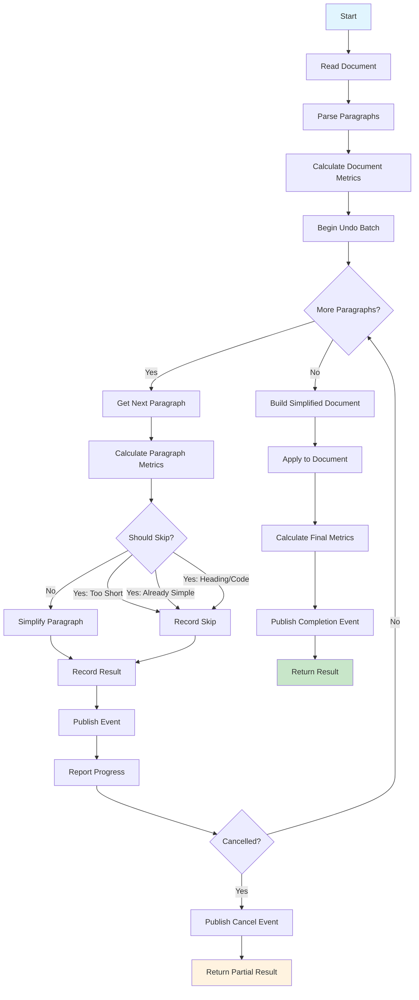

# LCS-DES-074d: Design Specification — Batch Simplification

## 1. Metadata & Categorization

| Field | Value | Description |
| :--- | :--- | :--- |
| **Feature ID** | `AGT-074d` | Sub-part of AGT-074 |
| **Feature Name** | `Batch Simplification` | Document-wide processing with progress |
| **Target Version** | `v0.7.4d` | Fourth sub-part of v0.7.4 |
| **Module Scope** | `Lexichord.Modules.Agents` | Agent services module |
| **Swimlane** | `Ensemble` | Part of Agents vertical |
| **License Tier** | `WriterPro` | Required for simplification features |
| **Feature Gate Key** | `FeatureFlags.Agents.Simplifier` | Shared with parent feature |
| **Author** | Lead Architect | |
| **Reviewer** | | |
| **Status** | `Draft` | |
| **Last Updated** | `2026-01-27` | |
| **Parent Document** | [LCS-DES-074-INDEX](./LCS-DES-074-INDEX.md) | |
| **Scope Breakdown** | [LCS-SBD-074 Section 3.4](./LCS-SBD-074.md#34-v074d-batch-simplification) | |

---

## 2. Executive Summary

### 2.1 The Requirement

Writers with long documents (10,000+ words) need to simplify entire documents, not just individual selections. This requires:

- Processing documents paragraph by paragraph
- Skipping paragraphs that are already at target reading level
- Progress tracking with time estimates
- Cancellation support for long-running operations
- Single undo for entire batch operation
- Memory-efficient streaming for large documents

> **Goal:** Enable document-wide simplification with progress tracking, cancellation, and batch undo support.

### 2.2 The Proposed Solution

Implement `IBatchSimplificationService` that:

1. Parses documents into paragraphs while preserving structure
2. Evaluates each paragraph's readability before processing
3. Skips already-simple paragraphs to save tokens and time
4. Reports progress via `IProgress<T>` for UI updates
5. Supports cancellation via `CancellationToken`
6. Integrates with undo stack for batch reversion
7. Publishes events for analytics and logging

---

## 3. Architecture & Modular Strategy

### 3.1 Dependencies

#### 3.1.1 Upstream Dependencies

| Interface | Source Version | Purpose |
| :--- | :--- | :--- |
| `ISimplificationPipeline` | v0.7.4b | Process individual paragraphs |
| `IReadabilityTargetService` | v0.7.4a | Get target configuration |
| `IReadabilityService` | v0.3.3c | Calculate paragraph metrics |
| `IEditorService` | v0.1.3a | Document access and modification |
| `IUndoService` | v0.1.4a | Batch undo integration |
| `IMediator` | v0.0.7a | Event publishing |
| `ILicenseContext` | v0.0.4c | Feature gating |

#### 3.1.2 NuGet Packages

| Package | Version | Purpose |
| :--- | :--- | :--- |
| (No new packages) | - | Uses existing dependencies |

### 3.2 Licensing Behavior

- **Load Behavior:** Soft Gate - Service loads but requires WriterPro for execution
- **Fallback Experience:**
  - "Simplify Document" command shows upgrade prompt
  - Batch simplification menu item disabled with tooltip

---

## 4. Data Contract (The API)

### 4.1 Core Interface

```csharp
namespace Lexichord.Abstractions.Contracts;

/// <summary>
/// Processes entire documents through the simplification pipeline.
/// </summary>
public interface IBatchSimplificationService
{
    /// <summary>
    /// Simplifies an entire document, processing paragraph by paragraph.
    /// </summary>
    /// <param name="documentPath">Path to the document.</param>
    /// <param name="target">Readability target to achieve.</param>
    /// <param name="options">Batch processing options.</param>
    /// <param name="progress">Progress reporter for UI updates.</param>
    /// <param name="ct">Cancellation token.</param>
    /// <returns>Batch simplification result with aggregate metrics.</returns>
    Task<BatchSimplificationResult> SimplifyDocumentAsync(
        string documentPath,
        ReadabilityTarget target,
        BatchSimplificationOptions? options = null,
        IProgress<BatchSimplificationProgress>? progress = null,
        CancellationToken ct = default);

    /// <summary>
    /// Simplifies multiple text selections in batch.
    /// </summary>
    /// <param name="selections">Selections to simplify.</param>
    /// <param name="target">Readability target to achieve.</param>
    /// <param name="options">Batch processing options.</param>
    /// <param name="progress">Progress reporter for UI updates.</param>
    /// <param name="ct">Cancellation token.</param>
    /// <returns>Batch simplification result.</returns>
    Task<BatchSimplificationResult> SimplifySelectionsAsync(
        IReadOnlyList<TextSelection> selections,
        ReadabilityTarget target,
        BatchSimplificationOptions? options = null,
        IProgress<BatchSimplificationProgress>? progress = null,
        CancellationToken ct = default);

    /// <summary>
    /// Streams simplification results as each paragraph completes.
    /// Useful for real-time document updates.
    /// </summary>
    /// <param name="documentPath">Path to the document.</param>
    /// <param name="target">Readability target.</param>
    /// <param name="options">Batch processing options.</param>
    /// <param name="ct">Cancellation token.</param>
    /// <returns>Async stream of paragraph results.</returns>
    IAsyncEnumerable<ParagraphSimplificationResult> SimplifyDocumentStreamingAsync(
        string documentPath,
        ReadabilityTarget target,
        BatchSimplificationOptions? options = null,
        CancellationToken ct = default);

    /// <summary>
    /// Estimates time and token cost for batch simplification.
    /// </summary>
    /// <param name="documentPath">Path to the document.</param>
    /// <param name="target">Readability target.</param>
    /// <returns>Cost estimate.</returns>
    Task<BatchSimplificationEstimate> EstimateCostAsync(
        string documentPath,
        ReadabilityTarget target,
        CancellationToken ct = default);
}
```

### 4.2 Data Records

```csharp
namespace Lexichord.Abstractions.Models;

/// <summary>
/// Options for batch simplification processing.
/// </summary>
public record BatchSimplificationOptions
{
    /// <summary>
    /// The scope of batch processing.
    /// </summary>
    public BatchSimplificationScope Scope { get; init; } = BatchSimplificationScope.EntireDocument;

    /// <summary>
    /// Skip paragraphs already at or below target grade level.
    /// Default: true (saves tokens and time).
    /// </summary>
    public bool SkipAlreadySimple { get; init; } = true;

    /// <summary>
    /// Maximum paragraphs to process (null = no limit).
    /// </summary>
    public int? MaxParagraphs { get; init; }

    /// <summary>
    /// Minimum paragraph length (words) to process.
    /// Paragraphs shorter than this are skipped.
    /// </summary>
    public int MinParagraphWords { get; init; } = 10;

    /// <summary>
    /// Tolerance for "already simple" check.
    /// Paragraph skipped if grade <= target + tolerance.
    /// </summary>
    public int SimpleToleranceGrades { get; init; } = 1;

    /// <summary>
    /// Simplification strategy to use.
    /// </summary>
    public SimplificationStrategy Strategy { get; init; } = SimplificationStrategy.Balanced;

    /// <summary>
    /// Whether to generate a document-wide glossary.
    /// </summary>
    public bool GenerateGlossary { get; init; } = false;

    /// <summary>
    /// Maximum concurrent paragraph processing (1 = sequential).
    /// </summary>
    public int MaxConcurrency { get; init; } = 1;

    /// <summary>
    /// Delay between paragraphs (rate limiting).
    /// </summary>
    public TimeSpan DelayBetweenParagraphs { get; init; } = TimeSpan.Zero;
}

/// <summary>
/// The scope of batch simplification.
/// </summary>
public enum BatchSimplificationScope
{
    /// <summary>
    /// Process all paragraphs in the document.
    /// </summary>
    EntireDocument,

    /// <summary>
    /// Process only the current selection.
    /// </summary>
    Selection,

    /// <summary>
    /// Process only the current section (by heading).
    /// </summary>
    CurrentSection,

    /// <summary>
    /// Process only paragraphs above target grade level.
    /// </summary>
    ComplexParagraphsOnly
}

/// <summary>
/// The complete result of a batch simplification operation.
/// </summary>
public record BatchSimplificationResult
{
    /// <summary>
    /// Total paragraphs in the document/selection.
    /// </summary>
    public required int TotalParagraphs { get; init; }

    /// <summary>
    /// Number of paragraphs that were processed.
    /// </summary>
    public required int ProcessedParagraphs { get; init; }

    /// <summary>
    /// Number of paragraphs that were simplified.
    /// </summary>
    public required int SimplifiedParagraphs { get; init; }

    /// <summary>
    /// Number of paragraphs skipped (already simple, too short, etc.).
    /// </summary>
    public required int SkippedParagraphs { get; init; }

    /// <summary>
    /// Readability metrics for the original document.
    /// </summary>
    public required ReadabilityMetrics OriginalDocumentMetrics { get; init; }

    /// <summary>
    /// Readability metrics for the simplified document.
    /// </summary>
    public required ReadabilityMetrics SimplifiedDocumentMetrics { get; init; }

    /// <summary>
    /// Results for each processed paragraph.
    /// </summary>
    public required IReadOnlyList<ParagraphSimplificationResult> ParagraphResults { get; init; }

    /// <summary>
    /// Total token usage across all paragraphs.
    /// </summary>
    public required UsageMetrics TotalTokenUsage { get; init; }

    /// <summary>
    /// Total processing time.
    /// </summary>
    public required TimeSpan TotalProcessingTime { get; init; }

    /// <summary>
    /// Whether the operation was cancelled.
    /// </summary>
    public required bool WasCancelled { get; init; }

    /// <summary>
    /// Aggregate glossary from all paragraphs (if requested).
    /// </summary>
    public IReadOnlyDictionary<string, string>? AggregateGlossary { get; init; }

    /// <summary>
    /// Average time per paragraph.
    /// </summary>
    public TimeSpan AverageTimePerParagraph =>
        ProcessedParagraphs > 0
            ? TotalProcessingTime / ProcessedParagraphs
            : TimeSpan.Zero;

    /// <summary>
    /// Document-wide grade level reduction.
    /// </summary>
    public double GradeLevelReduction =>
        OriginalDocumentMetrics.FleschKincaidGradeLevel -
        SimplifiedDocumentMetrics.FleschKincaidGradeLevel;
}

/// <summary>
/// Result for a single paragraph in batch processing.
/// </summary>
public record ParagraphSimplificationResult
{
    /// <summary>
    /// Zero-based index of the paragraph in the document.
    /// </summary>
    public required int ParagraphIndex { get; init; }

    /// <summary>
    /// The original paragraph text.
    /// </summary>
    public required string OriginalText { get; init; }

    /// <summary>
    /// The simplified paragraph text.
    /// </summary>
    public required string SimplifiedText { get; init; }

    /// <summary>
    /// Readability metrics for the original paragraph.
    /// </summary>
    public required ReadabilityMetrics OriginalMetrics { get; init; }

    /// <summary>
    /// Readability metrics for the simplified paragraph.
    /// </summary>
    public required ReadabilityMetrics SimplifiedMetrics { get; init; }

    /// <summary>
    /// Whether simplification was actually performed.
    /// </summary>
    public required bool WasSimplified { get; init; }

    /// <summary>
    /// Reason for skipping (null if simplified).
    /// </summary>
    public string? SkipReason { get; init; }

    /// <summary>
    /// Changes made to this paragraph.
    /// </summary>
    public IReadOnlyList<SimplificationChange>? Changes { get; init; }

    /// <summary>
    /// Token usage for this paragraph.
    /// </summary>
    public UsageMetrics? TokenUsage { get; init; }

    /// <summary>
    /// Processing time for this paragraph.
    /// </summary>
    public TimeSpan ProcessingTime { get; init; }
}

/// <summary>
/// Progress information for batch simplification.
/// </summary>
public record BatchSimplificationProgress
{
    /// <summary>
    /// Current paragraph being processed (1-based).
    /// </summary>
    public required int CurrentParagraph { get; init; }

    /// <summary>
    /// Total number of paragraphs.
    /// </summary>
    public required int TotalParagraphs { get; init; }

    /// <summary>
    /// Preview of the current paragraph (truncated).
    /// </summary>
    public required string CurrentParagraphPreview { get; init; }

    /// <summary>
    /// Percentage complete (0-100).
    /// </summary>
    public required double PercentComplete { get; init; }

    /// <summary>
    /// Estimated time remaining.
    /// </summary>
    public required TimeSpan EstimatedTimeRemaining { get; init; }

    /// <summary>
    /// Number of paragraphs simplified so far.
    /// </summary>
    public required int SimplifiedSoFar { get; init; }

    /// <summary>
    /// Number of paragraphs skipped so far.
    /// </summary>
    public required int SkippedSoFar { get; init; }

    /// <summary>
    /// Current status message.
    /// </summary>
    public required string StatusMessage { get; init; }

    /// <summary>
    /// Current operation phase.
    /// </summary>
    public BatchSimplificationPhase Phase { get; init; }
}

/// <summary>
/// Phases of batch simplification.
/// </summary>
public enum BatchSimplificationPhase
{
    Initializing,
    AnalyzingDocument,
    ProcessingParagraphs,
    AggregatingResults,
    Completed,
    Cancelled
}

/// <summary>
/// Cost estimate for batch simplification.
/// </summary>
public record BatchSimplificationEstimate
{
    /// <summary>
    /// Estimated number of paragraphs to process.
    /// </summary>
    public required int EstimatedParagraphs { get; init; }

    /// <summary>
    /// Estimated paragraphs that will be skipped.
    /// </summary>
    public required int EstimatedSkipped { get; init; }

    /// <summary>
    /// Estimated token usage.
    /// </summary>
    public required int EstimatedTokens { get; init; }

    /// <summary>
    /// Estimated processing time.
    /// </summary>
    public required TimeSpan EstimatedTime { get; init; }

    /// <summary>
    /// Estimated cost in USD (based on current pricing).
    /// </summary>
    public required decimal EstimatedCostUsd { get; init; }
}

/// <summary>
/// A text selection for batch processing.
/// </summary>
public record TextSelection(
    string DocumentPath,
    int StartOffset,
    int Length,
    string Text
);
```

### 4.3 Events

```csharp
namespace Lexichord.Abstractions.Events;

/// <summary>
/// Published when a batch simplification operation completes.
/// </summary>
public record SimplificationCompletedEvent(
    string DocumentPath,
    int ParagraphsSimplified,
    int TotalParagraphs,
    double GradeLevelReduction,
    TimeSpan ProcessingTime,
    UsageMetrics TokenUsage,
    bool WasCancelled
) : INotification;

/// <summary>
/// Published when a single paragraph is simplified during batch processing.
/// </summary>
public record ParagraphSimplifiedEvent(
    string DocumentPath,
    int ParagraphIndex,
    int TotalParagraphs,
    double OriginalGradeLevel,
    double SimplifiedGradeLevel,
    bool WasSimplified,
    string? SkipReason
) : INotification;

/// <summary>
/// Published when batch simplification is cancelled.
/// </summary>
public record BatchSimplificationCancelledEvent(
    string DocumentPath,
    int ProcessedParagraphs,
    int TotalParagraphs,
    string Reason
) : INotification;
```

---

## 5. Implementation Logic

### 5.1 Service Implementation

```csharp
namespace Lexichord.Modules.Agents.Services;

/// <summary>
/// Processes entire documents through the simplification pipeline.
/// </summary>
public class BatchSimplificationService : IBatchSimplificationService
{
    private readonly ISimplificationPipeline _pipeline;
    private readonly IReadabilityService _readabilityService;
    private readonly IEditorService _editorService;
    private readonly IUndoService _undoService;
    private readonly IMediator _mediator;
    private readonly ILicenseContext _licenseContext;
    private readonly ILogger<BatchSimplificationService> _logger;

    // Constants
    private const int PreviewLength = 50;
    private const double TokensPerWord = 1.3; // Rough estimate

    public BatchSimplificationService(
        ISimplificationPipeline pipeline,
        IReadabilityService readabilityService,
        IEditorService editorService,
        IUndoService undoService,
        IMediator mediator,
        ILicenseContext licenseContext,
        ILogger<BatchSimplificationService> logger)
    {
        _pipeline = pipeline;
        _readabilityService = readabilityService;
        _editorService = editorService;
        _undoService = undoService;
        _mediator = mediator;
        _licenseContext = licenseContext;
        _logger = logger;
    }

    public async Task<BatchSimplificationResult> SimplifyDocumentAsync(
        string documentPath,
        ReadabilityTarget target,
        BatchSimplificationOptions? options = null,
        IProgress<BatchSimplificationProgress>? progress = null,
        CancellationToken ct = default)
    {
        // License check
        if (!_licenseContext.HasFeature(FeatureFlags.Agents.Simplifier))
        {
            throw new LicenseRequiredException("Batch simplification requires WriterPro");
        }

        options ??= new BatchSimplificationOptions();
        var stopwatch = Stopwatch.StartNew();
        var paragraphResults = new List<ParagraphSimplificationResult>();
        var totalTokenUsage = new UsageMetrics(0, 0, 0);
        var glossaryTerms = new Dictionary<string, string>();

        // Read document content
        var content = await _editorService.ReadContentAsync(documentPath, ct);
        var paragraphs = ParseParagraphs(content, options);

        _logger.LogInformation(
            "Batch started: {DocumentPath}, {ParagraphCount} paragraphs",
            documentPath, paragraphs.Count);

        // Calculate original document metrics
        var originalDocMetrics = _readabilityService.Analyze(content);

        // Report initial progress
        progress?.Report(new BatchSimplificationProgress
        {
            CurrentParagraph = 0,
            TotalParagraphs = paragraphs.Count,
            CurrentParagraphPreview = "Initializing...",
            PercentComplete = 0,
            EstimatedTimeRemaining = EstimateTime(paragraphs.Count, TimeSpan.Zero, 0),
            SimplifiedSoFar = 0,
            SkippedSoFar = 0,
            StatusMessage = "Analyzing document...",
            Phase = BatchSimplificationPhase.AnalyzingDocument
        });

        // Begin undo batch
        using var undoBatch = _undoService.BeginBatch("Simplify Document");

        int simplified = 0;
        int skipped = 0;
        var paragraphTimes = new List<TimeSpan>();

        for (int i = 0; i < paragraphs.Count; i++)
        {
            ct.ThrowIfCancellationRequested();

            var paragraph = paragraphs[i];
            var paragraphStopwatch = Stopwatch.StartNew();

            // Calculate paragraph metrics
            var paragraphMetrics = _readabilityService.Analyze(paragraph.Text);

            // Check if should skip
            var skipReason = ShouldSkipParagraph(paragraph, paragraphMetrics, target, options);

            if (skipReason != null)
            {
                // Skip this paragraph
                paragraphResults.Add(new ParagraphSimplificationResult
                {
                    ParagraphIndex = i,
                    OriginalText = paragraph.Text,
                    SimplifiedText = paragraph.Text,
                    OriginalMetrics = paragraphMetrics,
                    SimplifiedMetrics = paragraphMetrics,
                    WasSimplified = false,
                    SkipReason = skipReason,
                    ProcessingTime = paragraphStopwatch.Elapsed
                });

                skipped++;

                await _mediator.Publish(new ParagraphSimplifiedEvent(
                    documentPath, i, paragraphs.Count,
                    paragraphMetrics.FleschKincaidGradeLevel,
                    paragraphMetrics.FleschKincaidGradeLevel,
                    false, skipReason), ct);
            }
            else
            {
                // Simplify this paragraph
                var request = new SimplificationRequest
                {
                    OriginalText = paragraph.Text,
                    Target = target,
                    DocumentPath = documentPath,
                    Strategy = options.Strategy,
                    GenerateGlossary = options.GenerateGlossary
                };

                var result = await _pipeline.SimplifyAsync(request, ct);

                paragraphResults.Add(new ParagraphSimplificationResult
                {
                    ParagraphIndex = i,
                    OriginalText = paragraph.Text,
                    SimplifiedText = result.SimplifiedText,
                    OriginalMetrics = result.OriginalMetrics,
                    SimplifiedMetrics = result.SimplifiedMetrics,
                    WasSimplified = true,
                    Changes = result.Changes,
                    TokenUsage = result.TokenUsage,
                    ProcessingTime = paragraphStopwatch.Elapsed
                });

                totalTokenUsage = totalTokenUsage.Add(result.TokenUsage);
                simplified++;

                // Aggregate glossary
                if (result.Glossary != null)
                {
                    foreach (var (term, definition) in result.Glossary)
                    {
                        glossaryTerms.TryAdd(term, definition);
                    }
                }

                await _mediator.Publish(new ParagraphSimplifiedEvent(
                    documentPath, i, paragraphs.Count,
                    result.OriginalMetrics.FleschKincaidGradeLevel,
                    result.SimplifiedMetrics.FleschKincaidGradeLevel,
                    true, null), ct);
            }

            paragraphTimes.Add(paragraphStopwatch.Elapsed);

            // Report progress
            var avgTime = paragraphTimes.Count > 0
                ? TimeSpan.FromTicks(paragraphTimes.Sum(t => t.Ticks) / paragraphTimes.Count)
                : TimeSpan.FromSeconds(2);

            progress?.Report(new BatchSimplificationProgress
            {
                CurrentParagraph = i + 1,
                TotalParagraphs = paragraphs.Count,
                CurrentParagraphPreview = Truncate(paragraph.Text, PreviewLength),
                PercentComplete = (double)(i + 1) / paragraphs.Count * 100,
                EstimatedTimeRemaining = EstimateTime(paragraphs.Count - i - 1, avgTime, 0),
                SimplifiedSoFar = simplified,
                SkippedSoFar = skipped,
                StatusMessage = $"Processing paragraph {i + 1} of {paragraphs.Count}...",
                Phase = BatchSimplificationPhase.ProcessingParagraphs
            });

            // Optional delay between paragraphs
            if (options.DelayBetweenParagraphs > TimeSpan.Zero && i < paragraphs.Count - 1)
            {
                await Task.Delay(options.DelayBetweenParagraphs, ct);
            }
        }

        // Build simplified document
        var simplifiedContent = BuildSimplifiedDocument(content, paragraphs, paragraphResults);

        // Apply to document
        await _editorService.ReplaceContentAsync(documentPath, simplifiedContent, ct);

        // Calculate simplified document metrics
        var simplifiedDocMetrics = _readabilityService.Analyze(simplifiedContent);

        stopwatch.Stop();

        var batchResult = new BatchSimplificationResult
        {
            TotalParagraphs = paragraphs.Count,
            ProcessedParagraphs = paragraphs.Count,
            SimplifiedParagraphs = simplified,
            SkippedParagraphs = skipped,
            OriginalDocumentMetrics = originalDocMetrics,
            SimplifiedDocumentMetrics = simplifiedDocMetrics,
            ParagraphResults = paragraphResults,
            TotalTokenUsage = totalTokenUsage,
            TotalProcessingTime = stopwatch.Elapsed,
            WasCancelled = false,
            AggregateGlossary = glossaryTerms.Count > 0 ? glossaryTerms : null
        };

        // Publish completion event
        await _mediator.Publish(new SimplificationCompletedEvent(
            documentPath,
            simplified,
            paragraphs.Count,
            batchResult.GradeLevelReduction,
            stopwatch.Elapsed,
            totalTokenUsage,
            false), ct);

        // Final progress report
        progress?.Report(new BatchSimplificationProgress
        {
            CurrentParagraph = paragraphs.Count,
            TotalParagraphs = paragraphs.Count,
            CurrentParagraphPreview = "Complete",
            PercentComplete = 100,
            EstimatedTimeRemaining = TimeSpan.Zero,
            SimplifiedSoFar = simplified,
            SkippedSoFar = skipped,
            StatusMessage = $"Completed: {simplified} paragraphs simplified",
            Phase = BatchSimplificationPhase.Completed
        });

        _logger.LogInformation(
            "Batch completed: {Simplified}/{Total} paragraphs in {ElapsedMs}ms",
            simplified, paragraphs.Count, stopwatch.ElapsedMilliseconds);

        return batchResult;
    }

    public async Task<BatchSimplificationEstimate> EstimateCostAsync(
        string documentPath,
        ReadabilityTarget target,
        CancellationToken ct = default)
    {
        var content = await _editorService.ReadContentAsync(documentPath, ct);
        var paragraphs = ParseParagraphs(content, new BatchSimplificationOptions());

        int toProcess = 0;
        int toSkip = 0;
        int totalWords = 0;

        foreach (var paragraph in paragraphs)
        {
            var metrics = _readabilityService.Analyze(paragraph.Text);

            if (metrics.FleschKincaidGradeLevel <= target.TargetFleschKincaidGrade + 1)
            {
                toSkip++;
            }
            else
            {
                toProcess++;
                totalWords += metrics.WordCount;
            }
        }

        // Estimate based on average processing time and token costs
        var estimatedTokens = (int)(totalWords * TokensPerWord * 2); // Input + output
        var estimatedTime = TimeSpan.FromSeconds(toProcess * 2.5); // ~2.5s per paragraph
        var estimatedCost = estimatedTokens * 0.00001m; // Example rate

        return new BatchSimplificationEstimate
        {
            EstimatedParagraphs = toProcess,
            EstimatedSkipped = toSkip,
            EstimatedTokens = estimatedTokens,
            EstimatedTime = estimatedTime,
            EstimatedCostUsd = estimatedCost
        };
    }

    public async IAsyncEnumerable<ParagraphSimplificationResult> SimplifyDocumentStreamingAsync(
        string documentPath,
        ReadabilityTarget target,
        BatchSimplificationOptions? options = null,
        [EnumeratorCancellation] CancellationToken ct = default)
    {
        options ??= new BatchSimplificationOptions();

        var content = await _editorService.ReadContentAsync(documentPath, ct);
        var paragraphs = ParseParagraphs(content, options);

        for (int i = 0; i < paragraphs.Count; i++)
        {
            ct.ThrowIfCancellationRequested();

            var paragraph = paragraphs[i];
            var paragraphMetrics = _readabilityService.Analyze(paragraph.Text);

            var skipReason = ShouldSkipParagraph(paragraph, paragraphMetrics, target, options);

            if (skipReason != null)
            {
                yield return new ParagraphSimplificationResult
                {
                    ParagraphIndex = i,
                    OriginalText = paragraph.Text,
                    SimplifiedText = paragraph.Text,
                    OriginalMetrics = paragraphMetrics,
                    SimplifiedMetrics = paragraphMetrics,
                    WasSimplified = false,
                    SkipReason = skipReason
                };
            }
            else
            {
                var request = new SimplificationRequest
                {
                    OriginalText = paragraph.Text,
                    Target = target,
                    Strategy = options.Strategy
                };

                var result = await _pipeline.SimplifyAsync(request, ct);

                yield return new ParagraphSimplificationResult
                {
                    ParagraphIndex = i,
                    OriginalText = paragraph.Text,
                    SimplifiedText = result.SimplifiedText,
                    OriginalMetrics = result.OriginalMetrics,
                    SimplifiedMetrics = result.SimplifiedMetrics,
                    WasSimplified = true,
                    Changes = result.Changes,
                    TokenUsage = result.TokenUsage
                };
            }
        }
    }

    #region Private Methods

    private record ParsedParagraph(string Text, int StartOffset, int EndOffset);

    private List<ParsedParagraph> ParseParagraphs(string content, BatchSimplificationOptions options)
    {
        var paragraphs = new List<ParsedParagraph>();
        var lines = content.Split('\n');
        var currentParagraph = new StringBuilder();
        var currentStart = 0;
        var offset = 0;

        foreach (var line in lines)
        {
            if (string.IsNullOrWhiteSpace(line))
            {
                // End of paragraph
                if (currentParagraph.Length > 0)
                {
                    var text = currentParagraph.ToString().Trim();
                    if (text.Length > 0)
                    {
                        paragraphs.Add(new ParsedParagraph(
                            text,
                            currentStart,
                            offset - 1));
                    }
                    currentParagraph.Clear();
                }
                currentStart = offset + line.Length + 1;
            }
            else
            {
                if (currentParagraph.Length > 0)
                    currentParagraph.Append(' ');
                currentParagraph.Append(line.Trim());
            }

            offset += line.Length + 1; // +1 for newline
        }

        // Don't forget the last paragraph
        if (currentParagraph.Length > 0)
        {
            paragraphs.Add(new ParsedParagraph(
                currentParagraph.ToString().Trim(),
                currentStart,
                content.Length));
        }

        // Apply max paragraphs limit
        if (options.MaxParagraphs.HasValue && paragraphs.Count > options.MaxParagraphs.Value)
        {
            paragraphs = paragraphs.Take(options.MaxParagraphs.Value).ToList();
        }

        return paragraphs;
    }

    private string? ShouldSkipParagraph(
        ParsedParagraph paragraph,
        ReadabilityMetrics metrics,
        ReadabilityTarget target,
        BatchSimplificationOptions options)
    {
        // Check word count
        if (metrics.WordCount < options.MinParagraphWords)
        {
            return $"Too short ({metrics.WordCount} words < {options.MinParagraphWords})";
        }

        // Check if already simple
        if (options.SkipAlreadySimple &&
            metrics.FleschKincaidGradeLevel <= target.TargetFleschKincaidGrade + options.SimpleToleranceGrades)
        {
            return $"Already at target level (Grade {metrics.FleschKincaidGradeLevel:F1})";
        }

        // Check if it's a heading or code block
        if (IsHeading(paragraph.Text) || IsCodeBlock(paragraph.Text))
        {
            return "Heading or code block";
        }

        return null; // Don't skip
    }

    private bool IsHeading(string text)
    {
        return text.StartsWith("#") ||
               (text.Length < 100 && !text.Contains('.'));
    }

    private bool IsCodeBlock(string text)
    {
        return text.StartsWith("```") ||
               text.StartsWith("    ") ||
               text.Contains("function ") ||
               text.Contains("class ") ||
               text.Contains("def ") ||
               text.Contains("public ") ||
               text.Contains("private ");
    }

    private string BuildSimplifiedDocument(
        string originalContent,
        List<ParsedParagraph> paragraphs,
        List<ParagraphSimplificationResult> results)
    {
        // Build document by replacing paragraphs in reverse order
        var content = originalContent;

        var sortedResults = results
            .Zip(paragraphs, (r, p) => (Result: r, Paragraph: p))
            .OrderByDescending(x => x.Paragraph.StartOffset)
            .ToList();

        foreach (var (result, paragraph) in sortedResults)
        {
            if (result.WasSimplified && result.SimplifiedText != result.OriginalText)
            {
                content = content.Remove(paragraph.StartOffset, paragraph.EndOffset - paragraph.StartOffset)
                                 .Insert(paragraph.StartOffset, result.SimplifiedText);
            }
        }

        return content;
    }

    private TimeSpan EstimateTime(int remainingParagraphs, TimeSpan avgTime, int _)
    {
        return TimeSpan.FromTicks(avgTime.Ticks * remainingParagraphs);
    }

    private static string Truncate(string text, int maxLength)
    {
        if (text.Length <= maxLength)
            return text;

        return text[..(maxLength - 3)] + "...";
    }

    #endregion
}
```

### 5.2 Processing Flow Diagram



---

## 6. UI/UX Specifications

### 6.1 Batch Progress Dialog

```text
┌──────────────────────────────────────────────────────────────────────────────┐
│  Simplifying Document                                              [Cancel]  │
├──────────────────────────────────────────────────────────────────────────────┤
│                                                                              │
│  ████████████████████████████████████░░░░░░░░░░░░░░░░░░  67%                │
│                                                                              │
│  Processing paragraph 42 of 63                                               │
│                                                                              │
│  ┌────────────────────────────────────────────────────────────────────────┐ │
│  │ "The implementation of the aforementioned feature..."                  │ │
│  └────────────────────────────────────────────────────────────────────────┘ │
│                                                                              │
│  ┌────────────────────────────────────────────────────────────────────────┐ │
│  │  Statistics                                                            │ │
│  │  ├── Paragraphs simplified:  28                                        │ │
│  │  ├── Paragraphs skipped:     14 (already at target level)              │ │
│  │  ├── Average improvement:    -4.2 grade levels                         │ │
│  │  ├── Tokens used:            12,450                                    │ │
│  │  └── Estimated time:         ~45 seconds remaining                     │ │
│  └────────────────────────────────────────────────────────────────────────┘ │
│                                                                              │
│  ┌────────────────────────────────────────────────────────────────────────┐ │
│  │  Recent Activity                                                       │ │
│  │  ├── [✓] Para 41: Grade 14 → Grade 8 (-6 levels)                       │ │
│  │  ├── [–] Para 40: Skipped (already at Grade 7)                         │ │
│  │  ├── [✓] Para 39: Grade 12 → Grade 9 (-3 levels)                       │ │
│  │  └── [–] Para 38: Skipped (too short: 8 words)                         │ │
│  └────────────────────────────────────────────────────────────────────────┘ │
│                                                                              │
└──────────────────────────────────────────────────────────────────────────────┘
```

### 6.2 Completion Summary Dialog

```text
┌──────────────────────────────────────────────────────────────────────────────┐
│  Simplification Complete                                          [×]       │
├──────────────────────────────────────────────────────────────────────────────┤
│                                                                              │
│  ✓ Document simplified successfully                                         │
│                                                                              │
│  ┌─────────────────────────────────────────────────────────────────────────┐│
│  │  Summary                                                                ││
│  │  ┌───────────────────────────────┬───────────────────────────────┐     ││
│  │  │ BEFORE                        │ AFTER                         │     ││
│  │  │ Grade Level: 14.2             │ Grade Level: 8.1              │     ││
│  │  │ Fog Index:   18.5             │ Fog Index:   10.3             │     ││
│  │  │ Passive:     34%              │ Passive:     8%               │     ││
│  │  └───────────────────────────────┴───────────────────────────────┘     ││
│  │                                                                         ││
│  │  Paragraphs:  42 simplified, 21 skipped (63 total)                      ││
│  │  Improvement: -6.1 grade levels average                                 ││
│  │  Time:        1 minute 23 seconds                                       ││
│  │  Tokens:      18,450 (estimated cost: $0.18)                            ││
│  └─────────────────────────────────────────────────────────────────────────┘│
│                                                                              │
│  ℹ️ You can undo all changes with Ctrl+Z                                    │
│                                                                              │
│                                    [View Details]  [Close]                   │
└──────────────────────────────────────────────────────────────────────────────┘
```

---

## 7. Observability & Logging

| Level | Message Template |
| :--- | :--- |
| Info | `"Batch started: {DocumentPath}, {ParagraphCount} paragraphs"` |
| Debug | `"Processing paragraph {Index}/{Total}"` |
| Debug | `"Skipping paragraph {Index}: {Reason}"` |
| Debug | `"Simplified paragraph {Index}: Grade {Before} -> {After}"` |
| Info | `"Batch completed: {Simplified}/{Total} paragraphs in {ElapsedMs}ms"` |
| Warning | `"Batch cancelled at paragraph {Index}/{Total}"` |
| Error | `"Batch failed at paragraph {Index}: {Error}"` |

### Metrics

```csharp
// Metrics to track
private static readonly Counter<long> BatchCounter =
    Meter.CreateCounter<long>("lexichord.agents.batch.invocations");

private static readonly Histogram<double> BatchDuration =
    Meter.CreateHistogram<double>("lexichord.agents.batch.duration_ms");

private static readonly Histogram<int> BatchParagraphs =
    Meter.CreateHistogram<int>("lexichord.agents.batch.paragraphs");

private static readonly Counter<long> BatchTokens =
    Meter.CreateCounter<long>("lexichord.agents.batch.tokens");
```

---

## 8. Security & Safety

| Risk | Level | Mitigation |
| :--- | :--- | :--- |
| Long-running operation blocks UI | Medium | Use async with progress reporting |
| Memory exhaustion on large docs | Medium | Stream paragraphs, limit concurrent processing |
| Runaway token costs | Medium | Show estimate before starting, allow cancel |
| Data loss on failure | Low | Undo batch integration, don't commit until complete |

---

## 9. Acceptance Criteria

### 9.1 Functional Criteria

| # | Given | When | Then |
| :--- | :--- | :--- | :--- |
| 1 | Document with 100 paragraphs | Running batch simplification | All paragraphs processed with progress |
| 2 | Document with mixed complexity | Running with SkipAlreadySimple=true | Simple paragraphs skipped |
| 3 | Long-running operation | Clicking Cancel | Operation stops, partial result returned |
| 4 | Completed batch operation | Pressing Ctrl+Z | Entire batch undone in single step |
| 5 | 10,000 word document | Running batch | Completes in < 2 minutes |
| 6 | Batch in progress | Viewing progress | Current paragraph and time estimate shown |
| 7 | Batch completed | Viewing result | Before/after metrics comparison shown |
| 8 | Core tier user | Attempting batch | Upgrade prompt shown |

### 9.2 Progress Reporting Criteria

| # | Given | When | Then |
| :--- | :--- | :--- | :--- |
| 9 | Batch running | Each paragraph completes | Progress percentage updates |
| 10 | Batch running | Each paragraph completes | Estimated time remaining updates |
| 11 | Paragraph skipped | Skip occurs | Skip reason shown in progress |

---

## 10. Test Scenarios

### 10.1 Unit Tests

```csharp
[Trait("Category", "Unit")]
[Trait("Version", "v0.7.4d")]
public class BatchSimplificationServiceTests
{
    private readonly BatchSimplificationService _sut;
    private readonly Mock<ISimplificationPipeline> _mockPipeline;
    private readonly Mock<IEditorService> _mockEditor;
    private readonly Mock<IReadabilityService> _mockReadability;
    private readonly Mock<IUndoService> _mockUndo;
    private readonly Mock<IMediator> _mockMediator;
    private readonly Mock<ILicenseContext> _mockLicense;

    public BatchSimplificationServiceTests()
    {
        // ... setup mocks
        _mockLicense.Setup(l => l.HasFeature(It.IsAny<string>())).Returns(true);
    }

    #region Happy Path Tests

    [Fact]
    public async Task SimplifyDocumentAsync_ProcessesAllParagraphs()
    {
        // Arrange
        var content = "Paragraph one.\n\nParagraph two.\n\nParagraph three.";
        _mockEditor.Setup(e => e.ReadContentAsync(It.IsAny<string>(), It.IsAny<CancellationToken>()))
            .ReturnsAsync(content);

        SetupReadabilityForGrade(14); // All paragraphs at Grade 14
        SetupPipelineResponse();

        var target = CreateTarget(gradeLevel: 8);

        // Act
        var result = await _sut.SimplifyDocumentAsync("/doc.md", target);

        // Assert
        result.TotalParagraphs.Should().Be(3);
        result.ProcessedParagraphs.Should().Be(3);
        _mockPipeline.Verify(p => p.SimplifyAsync(
            It.IsAny<SimplificationRequest>(),
            It.IsAny<CancellationToken>()), Times.Exactly(3));
    }

    [Fact]
    public async Task SimplifyDocumentAsync_SkipsSimpleParagraphs()
    {
        // Arrange
        var content = "Simple paragraph.\n\nComplex paragraph with jargon.";
        _mockEditor.Setup(e => e.ReadContentAsync(It.IsAny<string>(), It.IsAny<CancellationToken>()))
            .ReturnsAsync(content);

        // First paragraph already simple, second needs work
        _mockReadability.SetupSequence(r => r.Analyze(It.IsAny<string>()))
            .Returns(new ReadabilityMetrics { FleschKincaidGradeLevel = 14, WordCount = 100 }) // Document
            .Returns(new ReadabilityMetrics { FleschKincaidGradeLevel = 6, WordCount = 10 })   // Para 1
            .Returns(new ReadabilityMetrics { FleschKincaidGradeLevel = 14, WordCount = 20 }); // Para 2

        SetupPipelineResponse();

        var target = CreateTarget(gradeLevel: 8);
        var options = new BatchSimplificationOptions { SkipAlreadySimple = true };

        // Act
        var result = await _sut.SimplifyDocumentAsync("/doc.md", target, options);

        // Assert
        result.SimplifiedParagraphs.Should().Be(1);
        result.SkippedParagraphs.Should().Be(1);
    }

    #endregion

    #region Cancellation Tests

    [Fact]
    public async Task SimplifyDocumentAsync_CancellationStopsProcessing()
    {
        // Arrange
        var content = string.Join("\n\n", Enumerable.Range(1, 10).Select(i => $"Paragraph {i}."));
        _mockEditor.Setup(e => e.ReadContentAsync(It.IsAny<string>(), It.IsAny<CancellationToken>()))
            .ReturnsAsync(content);

        SetupReadabilityForGrade(14);

        var cts = new CancellationTokenSource();
        var callCount = 0;

        _mockPipeline.Setup(p => p.SimplifyAsync(It.IsAny<SimplificationRequest>(), It.IsAny<CancellationToken>()))
            .ReturnsAsync(() =>
            {
                callCount++;
                if (callCount == 3) cts.Cancel();
                return CreatePipelineResult();
            });

        var target = CreateTarget(gradeLevel: 8);

        // Act & Assert
        await Assert.ThrowsAsync<OperationCanceledException>(() =>
            _sut.SimplifyDocumentAsync("/doc.md", target, ct: cts.Token));

        callCount.Should().Be(3);
    }

    #endregion

    #region Progress Reporting Tests

    [Fact]
    public async Task SimplifyDocumentAsync_ReportsProgress()
    {
        // Arrange
        var content = "Para one.\n\nPara two.\n\nPara three.";
        _mockEditor.Setup(e => e.ReadContentAsync(It.IsAny<string>(), It.IsAny<CancellationToken>()))
            .ReturnsAsync(content);

        SetupReadabilityForGrade(14);
        SetupPipelineResponse();

        var progressReports = new List<BatchSimplificationProgress>();
        var progress = new Progress<BatchSimplificationProgress>(p => progressReports.Add(p));

        var target = CreateTarget(gradeLevel: 8);

        // Act
        await _sut.SimplifyDocumentAsync("/doc.md", target, progress: progress);

        // Assert
        progressReports.Should().NotBeEmpty();
        progressReports.Last().Phase.Should().Be(BatchSimplificationPhase.Completed);
        progressReports.Last().PercentComplete.Should().Be(100);
    }

    #endregion

    #region Undo Integration Tests

    [Fact]
    public async Task SimplifyDocumentAsync_CreatesUndoBatch()
    {
        // Arrange
        var content = "Paragraph one.";
        _mockEditor.Setup(e => e.ReadContentAsync(It.IsAny<string>(), It.IsAny<CancellationToken>()))
            .ReturnsAsync(content);

        SetupReadabilityForGrade(14);
        SetupPipelineResponse();

        var target = CreateTarget(gradeLevel: 8);

        // Act
        await _sut.SimplifyDocumentAsync("/doc.md", target);

        // Assert
        _mockUndo.Verify(u => u.BeginBatch("Simplify Document"), Times.Once);
    }

    #endregion

    #region Event Publishing Tests

    [Fact]
    public async Task SimplifyDocumentAsync_PublishesCompletionEvent()
    {
        // Arrange
        var content = "Paragraph one.";
        _mockEditor.Setup(e => e.ReadContentAsync(It.IsAny<string>(), It.IsAny<CancellationToken>()))
            .ReturnsAsync(content);

        SetupReadabilityForGrade(14);
        SetupPipelineResponse();

        var target = CreateTarget(gradeLevel: 8);

        // Act
        await _sut.SimplifyDocumentAsync("/doc.md", target);

        // Assert
        _mockMediator.Verify(m => m.Publish(
            It.IsAny<SimplificationCompletedEvent>(),
            It.IsAny<CancellationToken>()), Times.Once);
    }

    [Fact]
    public async Task SimplifyDocumentAsync_PublishesParagraphEvents()
    {
        // Arrange
        var content = "Para one.\n\nPara two.";
        _mockEditor.Setup(e => e.ReadContentAsync(It.IsAny<string>(), It.IsAny<CancellationToken>()))
            .ReturnsAsync(content);

        SetupReadabilityForGrade(14);
        SetupPipelineResponse();

        var target = CreateTarget(gradeLevel: 8);

        // Act
        await _sut.SimplifyDocumentAsync("/doc.md", target);

        // Assert
        _mockMediator.Verify(m => m.Publish(
            It.IsAny<ParagraphSimplifiedEvent>(),
            It.IsAny<CancellationToken>()), Times.Exactly(2));
    }

    #endregion

    #region Helper Methods

    private ReadabilityTarget CreateTarget(int gradeLevel) => new()
    {
        TargetFleschKincaidGrade = gradeLevel,
        MaxSentenceWords = 20,
        MaxParagraphSentences = 5,
        SimplifyJargon = true,
        ConvertPassiveToActive = true
    };

    private void SetupReadabilityForGrade(double grade)
    {
        _mockReadability.Setup(r => r.Analyze(It.IsAny<string>()))
            .Returns(new ReadabilityMetrics
            {
                FleschKincaidGradeLevel = grade,
                WordCount = 50
            });
    }

    private void SetupPipelineResponse()
    {
        _mockPipeline.Setup(p => p.SimplifyAsync(It.IsAny<SimplificationRequest>(), It.IsAny<CancellationToken>()))
            .ReturnsAsync(CreatePipelineResult());
    }

    private SimplificationResult CreatePipelineResult() => new()
    {
        SimplifiedText = "Simplified text.",
        OriginalMetrics = new ReadabilityMetrics { FleschKincaidGradeLevel = 14 },
        SimplifiedMetrics = new ReadabilityMetrics { FleschKincaidGradeLevel = 8 },
        Changes = Array.Empty<SimplificationChange>(),
        TokenUsage = new UsageMetrics(100, 50, 0),
        ProcessingTime = TimeSpan.FromSeconds(2)
    };

    #endregion
}
```

---

## 11. Deliverable Checklist

| # | Deliverable | Status |
| :--- | :--- | :--- |
| 1 | `IBatchSimplificationService.cs` interface | [ ] |
| 2 | `BatchSimplificationService.cs` implementation | [ ] |
| 3 | `BatchSimplificationOptions.cs` record | [ ] |
| 4 | `BatchSimplificationScope.cs` enum | [ ] |
| 5 | `BatchSimplificationResult.cs` record | [ ] |
| 6 | `ParagraphSimplificationResult.cs` record | [ ] |
| 7 | `BatchSimplificationProgress.cs` record | [ ] |
| 8 | `BatchSimplificationPhase.cs` enum | [ ] |
| 9 | `BatchSimplificationEstimate.cs` record | [ ] |
| 10 | `SimplificationCompletedEvent.cs` | [ ] |
| 11 | `ParagraphSimplifiedEvent.cs` | [ ] |
| 12 | `BatchSimplificationCancelledEvent.cs` | [ ] |
| 13 | `BatchProgressView.axaml` dialog | [ ] |
| 14 | `BatchProgressViewModel.cs` | [ ] |
| 15 | `BatchCompletionView.axaml` dialog | [ ] |
| 16 | Undo batch integration | [ ] |
| 17 | `BatchSimplificationServiceTests.cs` | [ ] |
| 18 | DI registration in AgentsModule | [ ] |

---

## 12. Verification Commands

```bash
# Run all v0.7.4d tests
dotnet test --filter "Version=v0.7.4d" --logger "console;verbosity=detailed"

# Run BatchSimplificationService tests
dotnet test --filter "FullyQualifiedName~BatchSimplificationServiceTests"

# Run with coverage
dotnet test --filter "Version=v0.7.4d" --collect:"XPlat Code Coverage"

# Manual verification:
# a) Open a document with 50+ paragraphs
# b) Invoke "Simplify Document" command
# c) Verify progress dialog shows with updates
# d) Let it complete and verify summary dialog
# e) Press Ctrl+Z to undo entire batch
# f) Repeat and cancel mid-process
# g) Verify partial result and undo works
# h) Test with Core tier - verify upgrade prompt
```

---

## Document History

| Version | Date | Author | Changes |
| :--- | :--- | :--- | :--- |
| 1.0 | 2026-01-27 | Lead Architect | Initial draft |
