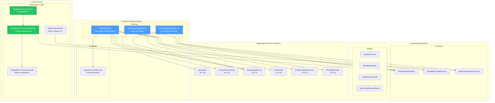
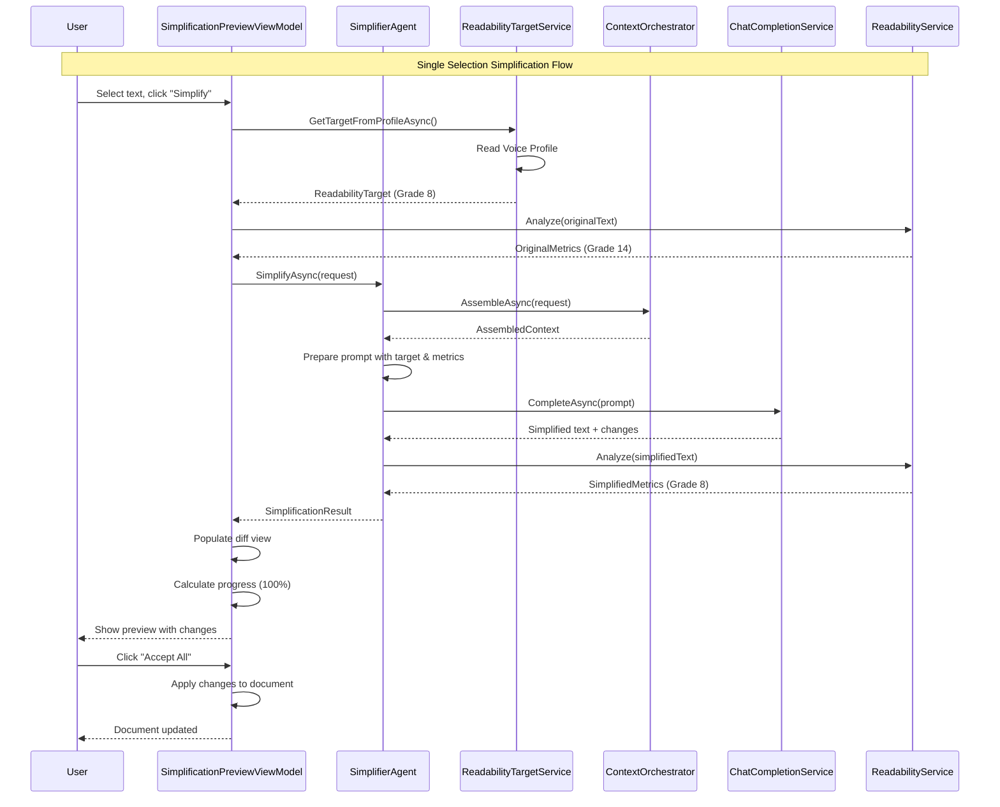
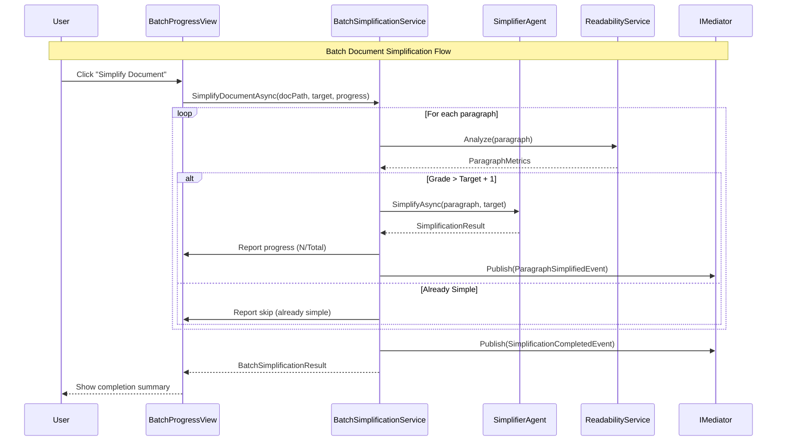

# LCS-SBD-074: Scope Breakdown — The Simplifier Agent

## Document Control

| Field            | Value                                    |
| :--------------- | :--------------------------------------- |
| **Document ID**  | LCS-SBD-074                              |
| **Version**      | v0.7.4                                   |
| **Codename**     | The Simplifier Agent                     |
| **Status**       | Draft                                    |
| **Last Updated** | 2026-01-27                               |
| **Owner**        | Lead Architect                           |
| **Depends On**   | v0.7.1 (Agent Registry), v0.7.2 (Context Assembler), v0.7.3 (Editor Agent), v0.3.3 (Readability), v0.3.4 (Voice Profiler) |

---

## 1. Executive Summary

### 1.1 The Vision

**v0.7.4** delivers the **Simplifier Agent** — a specialized AI agent that transforms complex, jargon-laden content into clear, accessible prose tailored to specific audience reading levels. This release transforms Lexichord's writing assistant from a grammar-focused tool into a comprehensive readability optimization platform, enabling writers to reach broader audiences without sacrificing accuracy.

The Simplifier Agent reads the user's Voice Profile to understand their target audience, then rewrites selected content to hit a specific Flesch-Kincaid grade level target. Writers can now say "Make this easier to read" and receive intelligent, context-aware simplification that preserves technical accuracy while dramatically improving accessibility.

### 1.2 Business Value

- **Audience Reach:** Writers can adapt content for different audiences (general public, executives, international readers) without manual rewriting.
- **User Experience:** One-click simplification with real-time readability metrics comparison (before/after).
- **Efficiency:** Batch simplification processes entire documents, reducing hours of manual editing to minutes.
- **Quality Control:** Preview/diff UI ensures writers maintain control over all changes before acceptance.
- **Enterprise Ready:** Audience presets enable teams to standardize readability targets across documentation.
- **Foundation:** Establishes the pattern for all future specialist agents (Tuning, Summarizer).

### 1.3 Success Criteria

This release succeeds when:

1. The Simplifier Agent rewrites selected text to achieve a target Flesch-Kincaid grade level within ±1 grade.
2. Users can compare before/after readability metrics via the Preview/Diff UI.
3. Voice Profile target audience settings automatically configure simplification targets.
4. Batch simplification processes documents of 10,000+ words with progress indication.
5. All UI respects license gating (WriterPro+ for Simplifier Agent).

### 1.4 License Gating

The Simplifier Agent is a **WriterPro** feature. Lower tiers will see:

- The Simplifier Agent listed in the Agent Registry with a lock icon
- "Upgrade to WriterPro" prompt when attempting to invoke the agent
- Simplification buttons disabled with upgrade tooltip
- Read-only access to readability metrics (no rewriting capability)

---

## 2. Dependencies on Prior Versions

| Component                  | Source Version | Usage in v0.7.4                                   |
| :------------------------- | :------------- | :------------------------------------------------ |
| `IAgentRegistry`           | v0.7.1b        | Register and discover the Simplifier Agent        |
| `AgentConfiguration`       | v0.7.1a        | Define agent configuration and capabilities       |
| `AgentPersona`             | v0.7.1a        | Support persona variations (strict/friendly)      |
| `IContextOrchestrator`     | v0.7.2c        | Assemble context for simplification requests      |
| `IContextStrategy`         | v0.7.2a        | Gather document and selection context             |
| `BaseAgent`                | v0.7.3b        | Inherit common agent functionality                |
| `EditSuggestion`           | v0.7.3c        | Model simplification as edit suggestions          |
| `IEditSuggestionParser`    | v0.7.3c        | Parse structured simplification responses         |
| `IReadabilityService`      | v0.3.3c        | Calculate Flesch-Kincaid and other metrics        |
| `ReadabilityMetrics`       | v0.3.3c        | Store before/after readability comparison         |
| `IVoiceMetricsService`     | v0.3.3a        | Extract readability from Voice Profile            |
| `VoiceProfile`             | v0.3.4a        | Read target audience configuration                |
| `IPromptRenderer`          | v0.6.3b        | Render simplification prompt templates            |
| `IPromptTemplateRepository`| v0.6.3c        | Store and retrieve prompt templates               |
| `IChatCompletionService`   | v0.6.1a        | Communicate with LLM backend                      |
| `ILicenseContext`          | v0.0.4c        | Gate WriterPro features                           |
| `IMediator`                | v0.0.7a        | Publish simplification events                     |
| `Serilog`                  | v0.0.3b        | Logging operations                                |

---

## 3. Sub-Part Specifications

### 3.1 v0.7.4a: Readability Target Service

| Field            | Value                                     |
| :--------------- | :---------------------------------------- |
| **Sub-Part ID**  | AGT-074a                                  |
| **Title**        | Readability Target Service                |
| **Module**       | `Lexichord.Modules.Agents`                |
| **License Tier** | WriterPro                                 |

**Goal:** Create a service that determines the target readability level based on Voice Profile settings and audience presets, providing a consistent target for the Simplifier Agent.

**Key Deliverables:**

- `IReadabilityTargetService` interface in Abstractions
- `ReadabilityTargetService` implementation with Voice Profile integration
- `AudiencePreset` record with predefined audience configurations
- `ReadabilityTarget` record with target grade level and constraints
- Built-in presets: "General Public", "Technical Audience", "Executive Summary", "International (ESL)"
- Custom preset storage in workspace settings
- Unit tests for target calculation logic

**Key Interfaces:**

```csharp
namespace Lexichord.Abstractions.Contracts;

/// <summary>
/// Determines the target readability level based on audience configuration.
/// </summary>
public interface IReadabilityTargetService
{
    /// <summary>
    /// Gets the readability target from the current Voice Profile.
    /// </summary>
    Task<ReadabilityTarget> GetTargetFromProfileAsync(CancellationToken ct = default);

    /// <summary>
    /// Gets the readability target for a specific audience preset.
    /// </summary>
    ReadabilityTarget GetTargetForPreset(string presetId);

    /// <summary>
    /// Gets all available audience presets.
    /// </summary>
    IReadOnlyList<AudiencePreset> GetAvailablePresets();

    /// <summary>
    /// Registers a custom audience preset.
    /// </summary>
    void RegisterPreset(AudiencePreset preset);
}

/// <summary>
/// Defines a target audience configuration for readability simplification.
/// </summary>
public record AudiencePreset(
    string PresetId,
    string Name,
    string Description,
    int TargetGradeLevel,
    bool AvoidJargon,
    bool PreferActiveVoice,
    int MaxSentenceLength,
    int MaxParagraphSentences,
    IReadOnlyList<string>? TermsToSimplify = null
);

/// <summary>
/// The calculated readability target for simplification.
/// </summary>
public record ReadabilityTarget(
    int TargetFleschKincaidGrade,
    int MaxSentenceWords,
    int MaxParagraphSentences,
    bool SimplifyJargon,
    bool ConvertPassiveToActive,
    string? SourcePresetId,
    IReadOnlyDictionary<string, string>? TermReplacements
);
```

**Built-in Audience Presets:**

```text
AUDIENCE PRESETS:
├── general-public
│   ├── Name: "General Public"
│   ├── Description: "Everyday readers, news articles, blog posts"
│   ├── Target Grade: 8
│   ├── Max Sentence: 20 words
│   └── Avoid Jargon: Yes
│
├── technical
│   ├── Name: "Technical Audience"
│   ├── Description: "Developers, engineers, domain experts"
│   ├── Target Grade: 12
│   ├── Max Sentence: 30 words
│   └── Avoid Jargon: No (explain instead)
│
├── executive
│   ├── Name: "Executive Summary"
│   ├── Description: "C-suite, decision makers, time-constrained readers"
│   ├── Target Grade: 10
│   ├── Max Sentence: 15 words
│   └── Avoid Jargon: Yes (use business terms)
│
└── international
    ├── Name: "International (ESL)"
    ├── Description: "Non-native English speakers"
    ├── Target Grade: 6
    ├── Max Sentence: 15 words
    └── Avoid Jargon: Yes (with glossary)
```

**Storage Location:**

- Windows: `%APPDATA%/Lexichord/agents/presets.json`
- macOS: `~/Library/Application Support/Lexichord/agents/presets.json`
- Linux: `~/.config/Lexichord/agents/presets.json`

**Dependencies:**

- v0.3.4a: `VoiceProfile` (read target audience settings)
- v0.3.3c: `IReadabilityService` (validate target feasibility)
- v0.1.6a: `ISettingsService` (store custom presets)

---

### 3.2 v0.7.4b: Simplification Pipeline

| Field            | Value                                     |
| :--------------- | :---------------------------------------- |
| **Sub-Part ID**  | AGT-074b                                  |
| **Title**        | Simplification Pipeline                   |
| **Module**       | `Lexichord.Modules.Agents`                |
| **License Tier** | WriterPro                                 |

**Goal:** Implement the core Simplifier Agent with prompt templates, context assembly, and LLM-powered text simplification that respects readability targets.

**Key Deliverables:**

- `SimplifierAgent` class extending `BaseAgent`
- `specialist-simplifier.yaml` prompt template
- `ISimplificationPipeline` interface for orchestrating simplification
- `SimplificationRequest` and `SimplificationResult` records
- Sentence-level and paragraph-level simplification strategies
- Jargon replacement with explanatory glossary generation
- Passive-to-active voice conversion integration
- Unit tests for pipeline components

**Key Interfaces:**

```csharp
namespace Lexichord.Abstractions.Contracts;

/// <summary>
/// Orchestrates the simplification process from input to output.
/// </summary>
public interface ISimplificationPipeline
{
    /// <summary>
    /// Simplifies the given text to meet the specified readability target.
    /// </summary>
    Task<SimplificationResult> SimplifyAsync(
        SimplificationRequest request,
        CancellationToken ct = default);

    /// <summary>
    /// Streams simplification results as they become available.
    /// </summary>
    IAsyncEnumerable<SimplificationChunk> SimplifyStreamingAsync(
        SimplificationRequest request,
        CancellationToken ct = default);
}

/// <summary>
/// A request to simplify text content.
/// </summary>
public record SimplificationRequest(
    string OriginalText,
    ReadabilityTarget Target,
    string? DocumentPath = null,
    SimplificationStrategy Strategy = SimplificationStrategy.Balanced,
    bool GenerateGlossary = false,
    bool PreserveFormatting = true
);

/// <summary>
/// The result of a simplification operation.
/// </summary>
public record SimplificationResult(
    string SimplifiedText,
    ReadabilityMetrics OriginalMetrics,
    ReadabilityMetrics SimplifiedMetrics,
    IReadOnlyList<SimplificationChange> Changes,
    IReadOnlyDictionary<string, string>? Glossary,
    UsageMetrics TokenUsage,
    TimeSpan ProcessingTime
);

/// <summary>
/// A single change made during simplification.
/// </summary>
public record SimplificationChange(
    string OriginalText,
    string SimplifiedText,
    SimplificationChangeType ChangeType,
    string Explanation,
    TextSpan Location
);

/// <summary>
/// Types of simplification changes.
/// </summary>
public enum SimplificationChangeType
{
    SentenceSplit,
    JargonReplacement,
    PassiveToActive,
    WordSimplification,
    ClauseReduction,
    TransitionAdded,
    RedundancyRemoved
}

/// <summary>
/// Simplification strategy options.
/// </summary>
public enum SimplificationStrategy
{
    Conservative,  // Minimal changes, preserve author voice
    Balanced,      // Moderate simplification
    Aggressive     // Maximum simplification for accessibility
}
```

**Simplifier Agent Implementation:**

```csharp
namespace Lexichord.Modules.Agents;

[RequiresLicense(LicenseTier.WriterPro)]
[AgentDefinition("simplifier", "The Simplifier", "Reduces complexity for broader audiences")]
public class SimplifierAgent(
    IChatCompletionService llm,
    IPromptRenderer renderer,
    IContextOrchestrator contextOrchestrator,
    IReadabilityTargetService targetService,
    IReadabilityService readabilityService,
    IPromptTemplateRepository templates,
    ILogger<SimplifierAgent> logger) : BaseAgent(llm, renderer, templates, logger), ISimplificationPipeline
{
    public override string AgentId => "simplifier";
    public override string Name => "The Simplifier";
    public override string Description => "Makes complex content accessible to wider audiences";

    public override AgentCapabilities Capabilities =>
        AgentCapabilities.Chat |
        AgentCapabilities.DocumentContext |
        AgentCapabilities.StreamingResponse;

    protected override string GetTemplateId() => "specialist-simplifier";

    protected override ChatOptions GetDefaultOptions() => new(
        Model: "gpt-4o",
        Temperature: 0.4f,  // Slightly higher for creative rewrites
        MaxTokens: 4096
    );

    protected override async Task<IDictionary<string, object>> PrepareContextAsync(
        AgentRequest request, CancellationToken ct)
    {
        var context = await base.PrepareContextAsync(request, ct);

        // Get readability target from Voice Profile or request
        var target = await targetService.GetTargetFromProfileAsync(ct);
        context["target_grade_level"] = target.TargetFleschKincaidGrade;
        context["max_sentence_words"] = target.MaxSentenceWords;
        context["simplify_jargon"] = target.SimplifyJargon;
        context["convert_passive"] = target.ConvertPassiveToActive;

        // Calculate current readability metrics
        if (!string.IsNullOrEmpty(request.Selection))
        {
            var metrics = readabilityService.Analyze(request.Selection);
            context["current_flesch_kincaid"] = metrics.FleschKincaidGradeLevel;
            context["current_gunning_fog"] = metrics.GunningFogIndex;
            context["current_avg_sentence_length"] = metrics.AverageSentenceLength;
            context["current_passive_percentage"] = metrics.PassiveVoicePercentage;
        }

        return context;
    }

    public async Task<SimplificationResult> SimplifyAsync(
        SimplificationRequest request, CancellationToken ct)
    {
        var stopwatch = Stopwatch.StartNew();

        // Calculate original metrics
        var originalMetrics = readabilityService.Analyze(request.OriginalText);

        // Prepare agent request
        var agentRequest = new AgentRequest(
            UserMessage: $"Simplify this text to grade level {request.Target.TargetFleschKincaidGrade}",
            Selection: request.OriginalText,
            DocumentPath: request.DocumentPath
        );

        // Invoke simplification
        var response = await InvokeAsync(agentRequest, ct);

        // Parse structured response
        var (simplifiedText, changes, glossary) = ParseSimplificationResponse(response.Content);

        // Calculate simplified metrics
        var simplifiedMetrics = readabilityService.Analyze(simplifiedText);

        stopwatch.Stop();

        return new SimplificationResult(
            SimplifiedText: simplifiedText,
            OriginalMetrics: originalMetrics,
            SimplifiedMetrics: simplifiedMetrics,
            Changes: changes,
            Glossary: glossary,
            TokenUsage: response.Usage,
            ProcessingTime: stopwatch.Elapsed
        );
    }
}
```

**Prompt Template:**

```yaml
# prompts/specialist-simplifier.yaml
template_id: "specialist-simplifier"
name: "Simplifier Specialist"
version: "1.0.0"
system_prompt: |
  You are a writing coach specializing in clarity and accessibility.
  Your goal is to make complex content understandable to a wider audience
  while preserving accuracy and the author's intent.

  ## Target Reading Level
  {{#target_grade_level}}
  Target Flesch-Kincaid Grade Level: {{target_grade_level}}
  {{/target_grade_level}}
  {{^target_grade_level}}
  Target Flesch-Kincaid Grade Level: 8 (8th grade / general public)
  {{/target_grade_level}}

  ## Current Text Metrics
  {{#current_flesch_kincaid}}
  - Current Grade Level: {{current_flesch_kincaid}}
  - Current Gunning Fog: {{current_gunning_fog}}
  - Average Sentence Length: {{current_avg_sentence_length}} words
  - Passive Voice: {{current_passive_percentage}}%
  {{/current_flesch_kincaid}}

  ## Simplification Techniques
  Apply these techniques as needed to reach the target reading level:

  1. **Sentence Splitting**: Break long sentences (>{{max_sentence_words}} words) into shorter ones
  2. **Jargon Replacement**: Replace technical terms with plain language
     {{#simplify_jargon}}- Provide a brief explanation or simpler synonym{{/simplify_jargon}}
  3. **Active Voice**: Convert passive constructions to active voice
     {{#convert_passive}}- "The report was written by the team" → "The team wrote the report"{{/convert_passive}}
  4. **Word Simplification**: Replace complex words with simpler alternatives
     - "utilize" → "use", "facilitate" → "help", "subsequently" → "then"
  5. **Clause Reduction**: Simplify nested clauses and complex structures
  6. **Transition Addition**: Add transitional phrases for better flow

  ## Preservation Rules
  - PRESERVE technical accuracy (don't oversimplify facts)
  - PRESERVE key terminology (explain rather than remove domain terms)
  - PRESERVE the author's conclusions and main arguments
  - PRESERVE proper nouns, names, and specific references
  - PRESERVE formatting markers (headers, lists, emphasis)

  ## Output Format
  Provide your response in this structured format:

  ```simplified
  [Your simplified version of the text]
  ```

  ```changes
  - [Original phrase] → [Simplified phrase] | Type: [ChangeType] | Reason: [Brief explanation]
  ```

  {{#generate_glossary}}
  ```glossary
  - [Technical term]: [Plain language definition]
  ```
  {{/generate_glossary}}

user_prompt: |
  Please simplify the following text to make it more accessible:

  {{#selection}}
  """
  {{selection}}
  """
  {{/selection}}

  {{user_input}}

  Remember to:
  - Target grade level {{target_grade_level}}
  - Maximum sentence length: {{max_sentence_words}} words
  - Preserve accuracy and meaning
```

**Dependencies:**

- v0.7.3b: `BaseAgent` (inherit agent functionality)
- v0.7.2c: `IContextOrchestrator` (gather context)
- v0.7.4a: `IReadabilityTargetService` (get target configuration)
- v0.3.3c: `IReadabilityService` (calculate metrics)
- v0.6.1a: `IChatCompletionService` (LLM communication)

---

### 3.3 v0.7.4c: Preview/Diff UI

| Field            | Value                                     |
| :--------------- | :---------------------------------------- |
| **Sub-Part ID**  | AGT-074c                                  |
| **Title**        | Preview/Diff UI                           |
| **Module**       | `Lexichord.Host`                          |
| **License Tier** | WriterPro                                 |

**Goal:** Create an interactive preview interface that shows before/after text comparison with readability metrics, enabling users to review and selectively accept simplification changes.

**Key Deliverables:**

- `SimplificationPreviewView.axaml` with split-pane diff display
- `SimplificationPreviewViewModel` with change management
- `ReadabilityComparisonPanel.axaml` showing metric improvements
- `SimplificationChangeItem.axaml` for individual change review
- Side-by-side and inline diff visualization modes
- "Accept All", "Accept Selected", "Reject" actions
- Syntax highlighting for changes (additions/removals)
- Keyboard shortcuts for efficient review
- Unit tests for ViewModel logic

**Key UI Components:**

```text
┌──────────────────────────────────────────────────────────────────────────────┐
│  Simplification Preview                                    [?] [_] [□] [×]   │
├──────────────────────────────────────────────────────────────────────────────┤
│  ┌─────────────────────────────────────────┐ ┌─────────────────────────────┐ │
│  │ Readability Comparison                  │ │ Target: Grade 8             │ │
│  │ ┌─────────────┬─────────────┐           │ │ ┌─────────────────────────┐ │ │
│  │ │  BEFORE     │   AFTER     │           │ │ │ ████████████░░░░ 78%   │ │ │
│  │ │  Grade 14   │   Grade 8   │  ↓ 6      │ │ │ Progress to target      │ │ │
│  │ │  Fog 18.2   │   Fog 10.1  │  ↓ 8.1    │ │ └─────────────────────────┘ │ │
│  │ │  Passive 34%│   Passive 8%│  ↓ 26%    │ │                             │ │
│  │ └─────────────┴─────────────┘           │ │ [General Public ▼]          │ │
│  └─────────────────────────────────────────┘ └─────────────────────────────┘ │
├──────────────────────────────────────────────────────────────────────────────┤
│  [◉ Side-by-Side] [○ Inline] [○ Changes Only]              [↺ Re-simplify]  │
├───────────────────────────────────┬──────────────────────────────────────────┤
│  Original Text                    │  Simplified Text                         │
├───────────────────────────────────┼──────────────────────────────────────────┤
│  The implementation of the        │  The new feature was added to            │
│  aforementioned feature was       │  help users work faster. It              │
│  facilitated by the development   │  was built by the development            │
│  team in order to enhance the     │  team. Testing showed that               │
│  [user experience]. Subsequently, │  users completed tasks 40%               │
│  comprehensive testing was        │  faster than before.                     │
│  conducted, which demonstrated    │                                          │
│  that users were able to complete │                                          │
│  tasks [40% more efficiently]     │                                          │
│  than had been previously         │                                          │
│  observed.                        │                                          │
├───────────────────────────────────┴──────────────────────────────────────────┤
│  Changes (6)                                                    [Expand All] │
├──────────────────────────────────────────────────────────────────────────────┤
│  ☑ "aforementioned feature was facilitated" → "new feature was added"       │
│     Type: JargonReplacement | Reason: Simplified complex phrase              │
│  ☑ "in order to enhance the user experience" → "to help users work faster"  │
│     Type: ClauseReduction | Reason: Removed unnecessary words                │
│  ☑ "Subsequently, comprehensive testing was conducted" → "Testing showed"   │
│     Type: PassiveToActive | Reason: Converted passive to active voice        │
│  ☐ "40% more efficiently than had been previously observed" → "40% faster"  │
│     Type: RedundancyRemoved | Reason: Removed redundant comparison           │
├──────────────────────────────────────────────────────────────────────────────┤
│  [Accept All (⌘⏎)] [Accept Selected] [Reject All] [Cancel]                  │
└──────────────────────────────────────────────────────────────────────────────┘
```

**Key Interfaces:**

```csharp
namespace Lexichord.Host.ViewModels;

/// <summary>
/// ViewModel for the simplification preview and diff interface.
/// </summary>
public partial class SimplificationPreviewViewModel : ViewModelBase
{
    [ObservableProperty]
    private string _originalText = string.Empty;

    [ObservableProperty]
    private string _simplifiedText = string.Empty;

    [ObservableProperty]
    private ReadabilityMetrics? _originalMetrics;

    [ObservableProperty]
    private ReadabilityMetrics? _simplifiedMetrics;

    [ObservableProperty]
    private ObservableCollection<SimplificationChangeViewModel> _changes = new();

    [ObservableProperty]
    private DiffViewMode _viewMode = DiffViewMode.SideBySide;

    [ObservableProperty]
    private bool _isProcessing;

    [ObservableProperty]
    private double _progressToTarget;

    [ObservableProperty]
    private AudiencePreset? _selectedPreset;

    public IReadOnlyList<AudiencePreset> AvailablePresets { get; }

    [RelayCommand]
    private async Task AcceptAllAsync();

    [RelayCommand]
    private async Task AcceptSelectedAsync();

    [RelayCommand]
    private async Task RejectAllAsync();

    [RelayCommand]
    private async Task ResimplifyAsync();

    [RelayCommand]
    private void ToggleChange(SimplificationChangeViewModel change);
}

/// <summary>
/// Diff visualization modes.
/// </summary>
public enum DiffViewMode
{
    SideBySide,
    Inline,
    ChangesOnly
}
```

**Styling Requirements:**

| Component | Theme Resource | Notes |
| :-------- | :------------- | :---- |
| Original text highlights | `Brush.Diff.Removed` | Red background for removed text |
| Simplified text highlights | `Brush.Diff.Added` | Green background for added text |
| Metrics improvement | `Brush.Success` | Green for improved metrics |
| Metrics regression | `Brush.Warning` | Orange for worsened metrics |
| Change checkbox | `LexCheckbox` theme | Standard checkbox styling |
| Action buttons | `LexButtonPrimary` | Accept All is primary action |

**Dependencies:**

- v0.7.4b: `SimplificationResult` (display simplification output)
- v0.3.3c: `ReadabilityMetrics` (display metric comparison)
- v0.7.4a: `AudiencePreset` (preset selection dropdown)

---

### 3.4 v0.7.4d: Batch Simplification

| Field            | Value                                     |
| :--------------- | :---------------------------------------- |
| **Sub-Part ID**  | AGT-074d                                  |
| **Title**        | Batch Simplification                      |
| **Module**       | `Lexichord.Modules.Agents`                |
| **License Tier** | WriterPro                                 |

**Goal:** Enable processing of entire documents or multiple selections through the simplification pipeline with progress tracking, cancellation support, and batch review capabilities.

**Key Deliverables:**

- `IBatchSimplificationService` interface for document-wide processing
- `BatchSimplificationService` with paragraph-level chunking
- `BatchSimplificationRequest` and `BatchSimplificationResult` records
- Progress reporting via `IProgress<BatchSimplificationProgress>`
- Cancellation support via `CancellationToken`
- Memory-efficient streaming for large documents
- Undo stack integration (single undo for entire batch)
- `SimplificationCompletedEvent` MediatR event
- Unit tests for batch processing logic

**Key Interfaces:**

```csharp
namespace Lexichord.Abstractions.Contracts;

/// <summary>
/// Processes entire documents through the simplification pipeline.
/// </summary>
public interface IBatchSimplificationService
{
    /// <summary>
    /// Simplifies an entire document, processing paragraph by paragraph.
    /// </summary>
    Task<BatchSimplificationResult> SimplifyDocumentAsync(
        string documentPath,
        ReadabilityTarget target,
        IProgress<BatchSimplificationProgress>? progress = null,
        CancellationToken ct = default);

    /// <summary>
    /// Simplifies multiple text selections.
    /// </summary>
    Task<BatchSimplificationResult> SimplifySelectionsAsync(
        IReadOnlyList<TextSelection> selections,
        ReadabilityTarget target,
        IProgress<BatchSimplificationProgress>? progress = null,
        CancellationToken ct = default);

    /// <summary>
    /// Streams simplification results as each paragraph is processed.
    /// </summary>
    IAsyncEnumerable<ParagraphSimplificationResult> SimplifyDocumentStreamingAsync(
        string documentPath,
        ReadabilityTarget target,
        CancellationToken ct = default);
}

/// <summary>
/// A request to simplify multiple items in batch.
/// </summary>
public record BatchSimplificationRequest(
    string DocumentPath,
    ReadabilityTarget Target,
    BatchSimplificationScope Scope,
    bool SkipAlreadySimple = true,
    int? MaxParagraphs = null
);

/// <summary>
/// The scope of batch simplification.
/// </summary>
public enum BatchSimplificationScope
{
    EntireDocument,
    Selection,
    CurrentSection,
    ComplexParagraphsOnly  // Only paragraphs above target grade level
}

/// <summary>
/// The result of a batch simplification operation.
/// </summary>
public record BatchSimplificationResult(
    int TotalParagraphs,
    int ProcessedParagraphs,
    int SimplifiedParagraphs,
    int SkippedParagraphs,
    ReadabilityMetrics OriginalDocumentMetrics,
    ReadabilityMetrics SimplifiedDocumentMetrics,
    IReadOnlyList<ParagraphSimplificationResult> ParagraphResults,
    UsageMetrics TotalTokenUsage,
    TimeSpan TotalProcessingTime,
    bool WasCancelled
);

/// <summary>
/// Progress information for batch simplification.
/// </summary>
public record BatchSimplificationProgress(
    int CurrentParagraph,
    int TotalParagraphs,
    string CurrentParagraphPreview,
    double PercentComplete,
    TimeSpan EstimatedTimeRemaining
);

/// <summary>
/// Result for a single paragraph in batch processing.
/// </summary>
public record ParagraphSimplificationResult(
    int ParagraphIndex,
    string OriginalText,
    string SimplifiedText,
    ReadabilityMetrics OriginalMetrics,
    ReadabilityMetrics SimplifiedMetrics,
    bool WasSimplified,
    string? SkipReason
);
```

**Batch Processing Logic:**

```text
BATCH SIMPLIFICATION FLOW:
│
├── 1. Parse document into paragraphs
│   └── Preserve paragraph boundaries and formatting
│
├── 2. For each paragraph:
│   ├── Calculate readability metrics
│   ├── IF metrics.GradeLevel <= target.GradeLevel + 1
│   │   └── SKIP (already simple enough)
│   ├── ELSE:
│   │   ├── Submit to SimplificationPipeline
│   │   ├── Yield result via IAsyncEnumerable
│   │   └── Report progress
│   └── Check CancellationToken
│
├── 3. Aggregate results
│   ├── Calculate document-wide before/after metrics
│   ├── Sum token usage
│   └── Compile paragraph results
│
├── 4. Publish SimplificationCompletedEvent
│
└── 5. Return BatchSimplificationResult
```

**MediatR Events:**

```csharp
namespace Lexichord.Abstractions.Events;

/// <summary>
/// Published when a batch simplification operation completes.
/// </summary>
public record SimplificationCompletedEvent(
    string DocumentPath,
    int ParagraphsSimplified,
    double GradeLevelReduction,
    TimeSpan ProcessingTime,
    UsageMetrics TokenUsage
) : INotification;

/// <summary>
/// Published when a single paragraph is simplified during batch processing.
/// </summary>
public record ParagraphSimplifiedEvent(
    string DocumentPath,
    int ParagraphIndex,
    double OriginalGradeLevel,
    double SimplifiedGradeLevel
) : INotification;
```

**Batch Progress UI:**

```text
┌──────────────────────────────────────────────────────────────────────────────┐
│  Simplifying Document                                              [Cancel]  │
├──────────────────────────────────────────────────────────────────────────────┤
│                                                                              │
│  ████████████████████████████████░░░░░░░░░░░░░░░░░░  67%                    │
│                                                                              │
│  Processing paragraph 42 of 63                                               │
│  "The implementation of the aforementioned feature..."                       │
│                                                                              │
│  ┌────────────────────────────────────────────────────────────────────────┐ │
│  │ Paragraphs simplified: 28                                              │ │
│  │ Paragraphs skipped:    14 (already at target level)                    │ │
│  │ Average improvement:   -4.2 grade levels                               │ │
│  │ Estimated time:        ~45 seconds remaining                           │ │
│  └────────────────────────────────────────────────────────────────────────┘ │
│                                                                              │
└──────────────────────────────────────────────────────────────────────────────┘
```

**Dependencies:**

- v0.7.4b: `ISimplificationPipeline` (process individual paragraphs)
- v0.7.4a: `ReadabilityTarget` (simplification configuration)
- v0.3.3c: `IReadabilityService` (paragraph metrics)
- v0.1.3a: `IEditorService` (document access)
- v0.0.7a: `IMediator` (publish events)

---

## 4. Implementation Checklist

| #  | Sub-Part | Task                                                      | Est. Hours |
| :- | :------- | :-------------------------------------------------------- | :--------- |
| 1  | v0.7.4a  | Create `IReadabilityTargetService` interface              | 1          |
| 2  | v0.7.4a  | Implement `ReadabilityTargetService`                      | 2          |
| 3  | v0.7.4a  | Define `AudiencePreset` and `ReadabilityTarget` records   | 1          |
| 4  | v0.7.4a  | Create built-in audience presets                          | 1          |
| 5  | v0.7.4a  | Integrate with Voice Profile settings                     | 1.5        |
| 6  | v0.7.4a  | Implement custom preset storage                           | 1          |
| 7  | v0.7.4a  | Unit tests for target calculation                         | 1.5        |
| 8  | v0.7.4b  | Create `ISimplificationPipeline` interface                | 1          |
| 9  | v0.7.4b  | Implement `SimplifierAgent` class                         | 3          |
| 10 | v0.7.4b  | Create `specialist-simplifier.yaml` prompt template       | 2          |
| 11 | v0.7.4b  | Implement response parsing for structured output          | 2          |
| 12 | v0.7.4b  | Add streaming support for real-time feedback              | 1.5        |
| 13 | v0.7.4b  | Implement jargon replacement logic                        | 1          |
| 14 | v0.7.4b  | Unit tests for simplification pipeline                    | 2          |
| 15 | v0.7.4c  | Create `SimplificationPreviewView.axaml`                  | 3          |
| 16 | v0.7.4c  | Implement `SimplificationPreviewViewModel`                | 2          |
| 17 | v0.7.4c  | Create `ReadabilityComparisonPanel.axaml`                 | 1.5        |
| 18 | v0.7.4c  | Implement side-by-side diff visualization                 | 2          |
| 19 | v0.7.4c  | Implement inline diff visualization                       | 1.5        |
| 20 | v0.7.4c  | Add change list with accept/reject controls               | 1.5        |
| 21 | v0.7.4c  | Implement keyboard shortcuts                              | 1          |
| 22 | v0.7.4c  | Unit tests for ViewModel                                  | 1.5        |
| 23 | v0.7.4d  | Create `IBatchSimplificationService` interface            | 1          |
| 24 | v0.7.4d  | Implement `BatchSimplificationService`                    | 3          |
| 25 | v0.7.4d  | Implement paragraph chunking logic                        | 1.5        |
| 26 | v0.7.4d  | Add progress reporting                                    | 1          |
| 27 | v0.7.4d  | Add cancellation support                                  | 0.5        |
| 28 | v0.7.4d  | Create batch progress UI                                  | 1.5        |
| 29 | v0.7.4d  | Implement undo stack integration                          | 1          |
| 30 | v0.7.4d  | Create MediatR events                                     | 0.5        |
| 31 | v0.7.4d  | Unit tests for batch processing                           | 2          |
| 32 | All      | Integration tests for full simplification workflow        | 2          |
| 33 | All      | DI registration in AgentsModule.cs                        | 0.5        |
| 34 | All      | Documentation and code comments                           | 1          |
| **Total** |   |                                                           | **48 hours** |

---

## 5. Dependency Matrix

### 5.1 Required Interfaces (from earlier versions)

| Interface                  | Source Version | Purpose                              |
| :------------------------- | :------------- | :----------------------------------- |
| `IAgentRegistry`           | v0.7.1b        | Agent registration and discovery     |
| `BaseAgent`                | v0.7.3b        | Base agent implementation            |
| `IContextOrchestrator`     | v0.7.2c        | Context assembly                     |
| `IReadabilityService`      | v0.3.3c        | Readability metric calculation       |
| `VoiceProfile`             | v0.3.4a        | Target audience settings             |
| `IChatCompletionService`   | v0.6.1a        | LLM communication                    |
| `IPromptRenderer`          | v0.6.3b        | Prompt template rendering            |
| `IEditorService`           | v0.1.3a        | Document access                      |
| `ISettingsService`         | v0.1.6a        | Settings storage                     |
| `ILicenseContext`          | v0.0.4c        | License gating                       |

### 5.2 New Interfaces (defined in v0.7.4)

| Interface                       | Defined In | Module        | Purpose                           |
| :------------------------------ | :--------- | :------------ | :-------------------------------- |
| `IReadabilityTargetService`     | v0.7.4a    | Abstractions  | Target readability configuration  |
| `ISimplificationPipeline`       | v0.7.4b    | Abstractions  | Core simplification orchestration |
| `IBatchSimplificationService`   | v0.7.4d    | Abstractions  | Document-wide batch processing    |

### 5.3 New Records/DTOs (defined in v0.7.4)

| Record                          | Defined In | Purpose                                |
| :------------------------------ | :--------- | :------------------------------------- |
| `AudiencePreset`                | v0.7.4a    | Audience configuration preset          |
| `ReadabilityTarget`             | v0.7.4a    | Calculated simplification target       |
| `SimplificationRequest`         | v0.7.4b    | Input for simplification operation     |
| `SimplificationResult`          | v0.7.4b    | Output of simplification operation     |
| `SimplificationChange`          | v0.7.4b    | Single change in simplification        |
| `BatchSimplificationRequest`    | v0.7.4d    | Batch processing input                 |
| `BatchSimplificationResult`     | v0.7.4d    | Batch processing output                |
| `BatchSimplificationProgress`   | v0.7.4d    | Progress reporting DTO                 |
| `ParagraphSimplificationResult` | v0.7.4d    | Single paragraph result                |

### 5.4 NuGet Packages

| Package          | Version | Purpose                    | New/Existing |
| :--------------- | :------ | :------------------------- | :----------- |
| `DiffPlex`       | 1.7.x   | Text diff visualization    | **New**      |
| (No other new)   | —       | —                          | —            |

---

## 6. Architecture Diagram



---

## 7. Data Flow Diagram





---

## 8. Risks & Mitigations

| Risk | Impact | Probability | Mitigation |
| :--- | :----- | :---------- | :--------- |
| LLM produces inaccurate simplifications | High | Medium | Add validation step comparing key facts before/after; highlight uncertainties for user review |
| Token costs for large documents | Medium | High | Implement chunking with token budget; show estimated cost before batch operations |
| Simplification loses technical accuracy | High | Medium | Preserve domain terms with explanations; allow "technical" preset that explains rather than replaces |
| Diff view performance with large texts | Medium | Low | Use virtualized scrolling; limit visible diff to viewport |
| User overwhelmed by too many changes | Medium | Medium | Group related changes; provide "Accept category" buttons |
| Voice Profile not configured | Low | Medium | Provide sensible defaults (Grade 8); prompt user to configure |

---

## 9. Success Metrics

| Metric | Target | Measurement |
| :----- | :----- | :---------- |
| Grade level reduction accuracy | ±1 grade of target | Compare target vs actual FK grade |
| Simplification acceptance rate | > 80% | Track accepted vs rejected changes |
| Processing time (single paragraph) | < 3 seconds | Stopwatch timing |
| Processing time (10,000 word doc) | < 2 minutes | End-to-end batch timing |
| Memory usage (batch processing) | < 100MB | Memory profiler |
| User satisfaction | > 4.0/5.0 | In-app feedback |

---

## 10. What This Enables

After v0.7.4, Lexichord will support:

- **v0.7.5 (The Tuning Agent):** Automatic style violation resolution using similar agent patterns
- **v0.7.6 (The Summarizer):** Document summarization and metadata generation
- **v0.7.7 (Agent Workflows):** Multi-agent pipelines combining simplification with editing and tuning
- **v0.8.x (Custom Agents):** User-defined specialist agents following the established patterns
- **Future:** Industry-specific simplification presets (medical, legal, financial)

---

## 11. Decision Trees

### 11.1 Should This Text Be Simplified?

```text
START: "Determine if text needs simplification"
│
├── Is text empty or < 10 words?
│   └── NO → Skip (too short)
│
├── Calculate current FK Grade Level
│   └── Current grade level?
│
├── Is current grade <= target + 1?
│   └── YES → Skip (already simple)
│
├── Is text a code block or technical reference?
│   └── YES → Skip (preserve technical content)
│
└── SIMPLIFY this text
```

### 11.2 Which Simplification Strategy?

```text
START: "Select simplification strategy"
│
├── What is the grade gap? (current - target)
│
├── Gap < 3 grades?
│   └── Use CONSERVATIVE strategy
│       └── Minimal changes, preserve voice
│
├── Gap 3-6 grades?
│   └── Use BALANCED strategy
│       └── Moderate simplification
│
└── Gap > 6 grades?
    └── Use AGGRESSIVE strategy
        └── Maximum simplification
```

---

## 12. User Stories

| ID    | Role            | Story                                                                                | Acceptance Criteria                    |
| :---- | :-------------- | :----------------------------------------------------------------------------------- | :------------------------------------- |
| US-01 | Content Writer  | As a content writer, I want to simplify complex paragraphs so that general audiences can understand them. | Selected text simplified to target grade level within ±1. |
| US-02 | Technical Writer| As a technical writer, I want to preserve technical terms while simplifying explanations. | Technical terms retained with explanatory glossary. |
| US-03 | Editor          | As an editor, I want to review all simplification changes before accepting them. | Preview UI shows all changes with accept/reject. |
| US-04 | Documentation Lead | As a documentation lead, I want to simplify entire documents at once. | Batch processing handles 10,000+ words with progress. |
| US-05 | International Team | As part of an international team, I want to target ESL readers specifically. | "International (ESL)" preset simplifies to Grade 6. |
| US-06 | Executive       | As an executive, I want executive summaries that busy leaders can scan quickly. | "Executive Summary" preset creates concise content. |

---

## 13. Use Cases

### UC-01: Single Selection Simplification

**Preconditions:**

- User has WriterPro license
- Document is open with text selected
- Voice Profile has target audience configured

**Flow:**

1. User selects a complex paragraph.
2. User invokes "Simplify Selection" (Ctrl+Shift+S).
3. System calculates current readability metrics.
4. System retrieves target from Voice Profile.
5. SimplifierAgent processes text.
6. Preview UI shows before/after comparison.
7. User reviews changes in diff view.
8. User clicks "Accept All".
9. Document updates with simplified text.

**Postconditions:**

- Selected text replaced with simplified version
- Readability improved toward target

---

### UC-02: Batch Document Simplification

**Preconditions:**

- User has WriterPro license
- Document is open (any length)
- Target audience preset selected

**Flow:**

1. User invokes "Simplify Document" from command palette.
2. System shows batch configuration dialog.
3. User confirms target preset (e.g., "General Public").
4. System displays progress dialog.
5. BatchSimplificationService processes paragraphs.
6. Progress updates show current paragraph and estimates.
7. System completes and shows summary.
8. User reviews aggregate metrics improvement.
9. User can undo entire batch with single Ctrl+Z.

**Postconditions:**

- Entire document simplified toward target
- Undo stack contains single entry for entire batch
- SimplificationCompletedEvent published

---

## 14. Unit Testing Requirements

### 14.1 ReadabilityTargetService Tests

```csharp
[Trait("Category", "Unit")]
[Trait("Version", "v0.7.4a")]
public class ReadabilityTargetServiceTests
{
    [Fact]
    public void GetTargetForPreset_GeneralPublic_ReturnsGrade8()
    {
        // Arrange
        var sut = new ReadabilityTargetService();

        // Act
        var result = sut.GetTargetForPreset("general-public");

        // Assert
        result.TargetFleschKincaidGrade.Should().Be(8);
        result.SimplifyJargon.Should().BeTrue();
    }

    [Fact]
    public void GetTargetForPreset_Technical_PreservesJargon()
    {
        // Arrange
        var sut = new ReadabilityTargetService();

        // Act
        var result = sut.GetTargetForPreset("technical");

        // Assert
        result.TargetFleschKincaidGrade.Should().Be(12);
        result.SimplifyJargon.Should().BeFalse();
    }

    [Theory]
    [InlineData("general-public", 8, 20)]
    [InlineData("technical", 12, 30)]
    [InlineData("executive", 10, 15)]
    [InlineData("international", 6, 15)]
    public void GetTargetForPreset_AllPresets_ReturnExpectedValues(
        string presetId, int expectedGrade, int expectedMaxSentence)
    {
        var sut = new ReadabilityTargetService();
        var result = sut.GetTargetForPreset(presetId);

        result.TargetFleschKincaidGrade.Should().Be(expectedGrade);
        result.MaxSentenceWords.Should().Be(expectedMaxSentence);
    }
}
```

### 14.2 SimplifierAgent Tests

```csharp
[Trait("Category", "Unit")]
[Trait("Version", "v0.7.4b")]
public class SimplifierAgentTests
{
    [Fact]
    public async Task SimplifyAsync_ComplexText_ReducesGradeLevel()
    {
        // Arrange
        var mockLlm = CreateMockLlm();
        var sut = CreateSimplifierAgent(mockLlm);
        var request = new SimplificationRequest(
            OriginalText: "The aforementioned implementation was facilitated by the development team.",
            Target: new ReadabilityTarget(8, 20, 5, true, true, null, null)
        );

        // Act
        var result = await sut.SimplifyAsync(request, CancellationToken.None);

        // Assert
        result.SimplifiedMetrics.FleschKincaidGradeLevel
            .Should().BeLessThan(result.OriginalMetrics.FleschKincaidGradeLevel);
    }

    [Fact]
    public async Task SimplifyAsync_AlreadySimple_ReturnsMinimalChanges()
    {
        // Arrange
        var sut = CreateSimplifierAgent();
        var request = new SimplificationRequest(
            OriginalText: "The cat sat on the mat.",
            Target: new ReadabilityTarget(8, 20, 5, true, true, null, null)
        );

        // Act
        var result = await sut.SimplifyAsync(request, CancellationToken.None);

        // Assert
        result.Changes.Should().BeEmpty();
        result.SimplifiedText.Should().Be(request.OriginalText);
    }
}
```

---

## 15. Observability & Logging

| Level   | Source                      | Message Template                                                       |
| :------ | :-------------------------- | :--------------------------------------------------------------------- |
| Debug   | SimplifierAgent             | `Simplifying text: {WordCount} words, target grade {TargetGrade}`      |
| Info    | SimplifierAgent             | `Simplification completed: Grade {Before} → {After} in {ElapsedMs}ms`  |
| Debug   | ReadabilityTargetService    | `Loaded preset: {PresetId} with grade {GradeLevel}`                    |
| Info    | BatchSimplificationService  | `Batch started: {DocumentPath}, {ParagraphCount} paragraphs`           |
| Debug   | BatchSimplificationService  | `Processing paragraph {Index}/{Total}`                                 |
| Info    | BatchSimplificationService  | `Batch completed: {Simplified}/{Total} paragraphs in {ElapsedMs}ms`    |
| Warning | SimplifierAgent             | `Simplification exceeded token budget: {UsedTokens}/{MaxTokens}`       |
| Error   | SimplifierAgent             | `Simplification failed: {Error}`                                       |

---

## 16. UI/UX Specifications

### 16.1 Simplification Preview Layout

```text
┌──────────────────────────────────────────────────────────────────────────────┐
│  Simplification Preview                                    [?] [_] [□] [×]   │
├──────────────────────────────────────────────────────────────────────────────┤
│  ┌──────────────────────────────────┐ ┌──────────────────────────────────┐  │
│  │ BEFORE              AFTER        │ │ Target: [General Public ▼]       │  │
│  │ ┌──────────┬──────────┐          │ │                                  │  │
│  │ │Grade 14  │ Grade 8  │ ↓6       │ │ ████████████████░░░░ 78%        │  │
│  │ │Fog 18.2  │ Fog 10.1 │ ↓8.1     │ │ Grade 14 → 8 (target: 8)        │  │
│  │ │Pass 34%  │ Pass 8%  │ ↓26%     │ │                                  │  │
│  │ └──────────┴──────────┘          │ │ [↺ Re-simplify with different   │  │
│  └──────────────────────────────────┘ │    settings]                     │  │
│                                       └──────────────────────────────────┘  │
├──────────────────────────────────────────────────────────────────────────────┤
│  [◉ Side-by-Side] [○ Inline Diff] [○ Changes Only]                          │
├───────────────────────────────────┬──────────────────────────────────────────┤
│  Original                         │  Simplified                              │
├───────────────────────────────────┼──────────────────────────────────────────┤
│  The [-implementation-] of the    │  The [+new feature was added to+]        │
│  [-aforementioned feature was-]   │  [+help users work faster.+] It          │
│  [-facilitated-] by the           │  was built by the development            │
│  development team [-in order to-] │  team. Testing showed that               │
│  [-enhance the user experience.-] │  users completed tasks 40%               │
│  [-Subsequently, comprehensive-]  │  faster than before.                     │
│  [-testing was conducted, which-] │                                          │
│  [-demonstrated that-] users were │                                          │
│  able to complete tasks [-40%-]   │                                          │
│  [-more efficiently than had-]    │                                          │
│  [-been previously observed.-]    │                                          │
├───────────────────────────────────┴──────────────────────────────────────────┤
│  Changes (6)                                                    [Expand All] │
├──────────────────────────────────────────────────────────────────────────────┤
│  [x] "implementation...facilitated" → "new feature was added"                │
│      JargonReplacement: Simplified complex corporate language                │
│  [x] "in order to enhance" → "to help users work faster"                     │
│      ClauseReduction: Removed unnecessary words                              │
│  [x] "Subsequently...demonstrated that" → "Testing showed that"              │
│      PassiveToActive: Converted passive voice                                │
│  [ ] "40% more efficiently than previously observed" → "40% faster"          │
│      RedundancyRemoved: Simplified comparison                                │
├──────────────────────────────────────────────────────────────────────────────┤
│        [Accept All (⌘⏎)]  [Accept Selected]  [Reject All]  [Cancel]         │
└──────────────────────────────────────────────────────────────────────────────┘
```

### 16.2 Component Styling Requirements

| Component                   | Theme Resource             | Notes                            |
| :-------------------------- | :------------------------- | :------------------------------- |
| Removed text background     | `Brush.Diff.Removed`       | `#FFE5E5` light / `#4A2020` dark |
| Added text background       | `Brush.Diff.Added`         | `#E5FFE5` light / `#204A20` dark |
| Metric improvement text     | `Brush.Success`            | Green text for improvements      |
| Metric regression text      | `Brush.Warning`            | Orange text for regressions      |
| Progress bar                | `Brush.Primary`            | Brand color for progress         |
| Accept All button           | `LexButtonPrimary` theme   | Primary action emphasis          |
| Cancel button               | `LexButtonSecondary` theme | Secondary action                 |

### 16.3 Keyboard Shortcuts

| Shortcut | Action |
| :------- | :----- |
| `⌘⏎` / `Ctrl+Enter` | Accept All changes |
| `⌘⇧⏎` / `Ctrl+Shift+Enter` | Accept Selected changes |
| `Esc` | Cancel and close |
| `Space` | Toggle selected change |
| `↑` / `↓` | Navigate changes |
| `⌘1` / `Ctrl+1` | Switch to Side-by-Side view |
| `⌘2` / `Ctrl+2` | Switch to Inline view |
| `⌘3` / `Ctrl+3` | Switch to Changes Only view |

---

## 17. Acceptance Criteria (QA)

| #   | Category            | Criterion                                                                    |
| :-- | :------------------ | :--------------------------------------------------------------------------- |
| 1   | **[Simplification]**| Text simplified from Grade 14 reaches Grade 8 ±1.                            |
| 2   | **[Simplification]**| Technical terms preserved with explanatory glossary when enabled.            |
| 3   | **[Simplification]**| Passive voice converted to active (e.g., "was written by" → "wrote").        |
| 4   | **[Presets]**       | "General Public" preset targets Grade 8 with max 20-word sentences.          |
| 5   | **[Presets]**       | "International (ESL)" preset targets Grade 6 with max 15-word sentences.     |
| 6   | **[UI]**            | Preview shows side-by-side diff with highlighted changes.                    |
| 7   | **[UI]**            | Readability metrics comparison shows before/after with delta.                |
| 8   | **[UI]**            | Individual changes can be accepted or rejected.                              |
| 9   | **[Batch]**         | Document with 100 paragraphs processes with progress indication.             |
| 10  | **[Batch]**         | Cancellation stops processing and shows partial results.                     |
| 11  | **[Batch]**         | Single undo reverts entire batch operation.                                  |
| 12  | **[License]**       | Core tier users see locked Simplifier with upgrade prompt.                   |
| 13  | **[Performance]**   | Single paragraph simplification completes in < 3 seconds.                    |
| 14  | **[Accessibility]** | All UI elements keyboard navigable with visible focus indicators.            |

---

## 18. Verification Commands

```bash
# ═══════════════════════════════════════════════════════════════════════════
# v0.7.4 Verification
# ═══════════════════════════════════════════════════════════════════════════

# 1. Verify DiffPlex package installed
dotnet list src/Lexichord.Host package | grep DiffPlex

# 2. Build solution
dotnet build

# 3. Run unit tests for v0.7.4 components
dotnet test --filter "Category=Unit&Version~v0.7.4"

# 4. Run Readability Target Service tests
dotnet test --filter "FullyQualifiedName~ReadabilityTargetServiceTests"

# 5. Run Simplifier Agent tests
dotnet test --filter "FullyQualifiedName~SimplifierAgentTests"

# 6. Run Batch Simplification tests
dotnet test --filter "FullyQualifiedName~BatchSimplificationServiceTests"

# 7. Run integration tests
dotnet test --filter "Category=Integration&Version~v0.7.4"

# 8. Manual verification:
# a) Open a document with complex text (Grade 14+)
# b) Select a paragraph and invoke "Simplify Selection"
# c) Verify Preview UI shows before/after comparison
# d) Verify target Grade 8 is achieved within ±1
# e) Accept changes and verify document updates
# f) Undo and verify original text restored
# g) Test batch simplification on 10,000 word document
# h) Verify Core tier user sees upgrade prompt
```

---

## 19. Deliverable Checklist

| #  | Deliverable                                                    | Status |
| :- | :------------------------------------------------------------- | :----- |
| 1  | `IReadabilityTargetService.cs` interface                       | [x]    |
| 2  | `ReadabilityTargetService.cs` implementation                   | [x]    |
| 3  | `AudiencePreset.cs` record                                     | [x]    |
| 4  | `ReadabilityTarget.cs` record                                  | [x]    |
| 4a | `TargetValidationResult.cs` record                             | [x]    |
| 5  | Built-in audience presets (`BuiltInPresets.cs`)                | [x]    |
| 5a | `SimplifierServiceCollectionExtensions.cs` DI extensions       | [x]    |
| 6  | `ISimplificationPipeline.cs` interface                         | [x]    |
| 7  | `SimplifierAgent.cs` implementation                            | [x]    |
| 8  | `specialist-simplifier.yaml` prompt template                   | [x]    |
| 9  | `SimplificationRequest.cs` record                              | [x]    |
| 10 | `SimplificationResult.cs` record                               | [x]    |
| 11 | `SimplificationChange.cs` record                               | [x]    |
| 12 | `SimplificationPreviewView.axaml` UI                           | [ ]    |
| 13 | `SimplificationPreviewViewModel.cs` ViewModel                  | [ ]    |
| 14 | `ReadabilityComparisonPanel.axaml` component                   | [ ]    |
| 15 | `IBatchSimplificationService.cs` interface                     | [ ]    |
| 16 | `BatchSimplificationService.cs` implementation                 | [ ]    |
| 17 | `BatchSimplificationResult.cs` record                          | [ ]    |
| 18 | `BatchSimplificationProgress.cs` record                        | [ ]    |
| 19 | `SimplificationCompletedEvent.cs` MediatR event                | [ ]    |
| 20 | Batch progress UI dialog                                       | [ ]    |
| 21 | Unit tests for ReadabilityTargetService                        | [x]    |
| 22 | Unit tests for SimplifierAgent                                 | [x]    |
| 23 | Unit tests for BatchSimplificationService                      | [ ]    |
| 24 | Integration tests for full workflow                            | [ ]    |
| 25 | DI registration in AgentsModule.cs                             | [x]    |
| 26 | DiffPlex NuGet package added                                   | [ ]    |

---

## 20. Code Examples

### 20.1 AudiencePreset Record

```csharp
namespace Lexichord.Abstractions.Models;

/// <summary>
/// Defines a target audience configuration for readability simplification.
/// Presets encapsulate common simplification targets for different reader groups.
/// </summary>
public record AudiencePreset
{
    /// <summary>
    /// Unique identifier for the preset (e.g., "general-public", "technical").
    /// </summary>
    public required string PresetId { get; init; }

    /// <summary>
    /// Human-readable name for display in UI (e.g., "General Public").
    /// </summary>
    public required string Name { get; init; }

    /// <summary>
    /// Description of the target audience (e.g., "Everyday readers, news articles").
    /// </summary>
    public required string Description { get; init; }

    /// <summary>
    /// Target Flesch-Kincaid Grade Level (1-18).
    /// </summary>
    public required int TargetGradeLevel { get; init; }

    /// <summary>
    /// Whether to replace jargon with plain language.
    /// </summary>
    public bool AvoidJargon { get; init; } = true;

    /// <summary>
    /// Whether to convert passive voice to active voice.
    /// </summary>
    public bool PreferActiveVoice { get; init; } = true;

    /// <summary>
    /// Maximum words per sentence for this audience.
    /// </summary>
    public int MaxSentenceLength { get; init; } = 20;

    /// <summary>
    /// Maximum sentences per paragraph for this audience.
    /// </summary>
    public int MaxParagraphSentences { get; init; } = 5;

    /// <summary>
    /// Optional list of specific terms to simplify.
    /// </summary>
    public IReadOnlyList<string>? TermsToSimplify { get; init; }

    /// <summary>
    /// Whether this is a built-in preset (cannot be deleted).
    /// </summary>
    public bool IsBuiltIn { get; init; }
}
```

### 20.2 SimplificationResult Record

```csharp
namespace Lexichord.Abstractions.Models;

/// <summary>
/// The complete result of a simplification operation, including
/// the simplified text, metrics comparison, and change details.
/// </summary>
public record SimplificationResult
{
    /// <summary>
    /// The simplified version of the input text.
    /// </summary>
    public required string SimplifiedText { get; init; }

    /// <summary>
    /// Readability metrics for the original text.
    /// </summary>
    public required ReadabilityMetrics OriginalMetrics { get; init; }

    /// <summary>
    /// Readability metrics for the simplified text.
    /// </summary>
    public required ReadabilityMetrics SimplifiedMetrics { get; init; }

    /// <summary>
    /// List of individual changes made during simplification.
    /// </summary>
    public required IReadOnlyList<SimplificationChange> Changes { get; init; }

    /// <summary>
    /// Optional glossary of technical terms with plain definitions.
    /// </summary>
    public IReadOnlyDictionary<string, string>? Glossary { get; init; }

    /// <summary>
    /// Token usage for this simplification operation.
    /// </summary>
    public required UsageMetrics TokenUsage { get; init; }

    /// <summary>
    /// Time taken to process this simplification.
    /// </summary>
    public required TimeSpan ProcessingTime { get; init; }

    /// <summary>
    /// The reduction in Flesch-Kincaid grade level achieved.
    /// </summary>
    public double GradeLevelReduction =>
        OriginalMetrics.FleschKincaidGradeLevel - SimplifiedMetrics.FleschKincaidGradeLevel;

    /// <summary>
    /// Whether the target grade level was achieved.
    /// </summary>
    public bool TargetAchieved(int targetGrade, int tolerance = 1) =>
        SimplifiedMetrics.FleschKincaidGradeLevel <= targetGrade + tolerance;
}
```

### 20.3 BatchSimplificationService Implementation

```csharp
namespace Lexichord.Modules.Agents.Services;

/// <summary>
/// Processes entire documents through the simplification pipeline,
/// paragraph by paragraph, with progress reporting and cancellation support.
/// </summary>
public class BatchSimplificationService(
    ISimplificationPipeline pipeline,
    IReadabilityService readabilityService,
    IEditorService editorService,
    IMediator mediator,
    ILogger<BatchSimplificationService> logger) : IBatchSimplificationService
{
    public async Task<BatchSimplificationResult> SimplifyDocumentAsync(
        string documentPath,
        ReadabilityTarget target,
        IProgress<BatchSimplificationProgress>? progress = null,
        CancellationToken ct = default)
    {
        var stopwatch = Stopwatch.StartNew();
        var paragraphResults = new List<ParagraphSimplificationResult>();
        var totalTokenUsage = new UsageMetrics(0, 0, 0);

        // Read and parse document
        var content = await editorService.ReadContentAsync(documentPath, ct);
        var paragraphs = ParseParagraphs(content);

        logger.LogInformation(
            "Batch started: {DocumentPath}, {ParagraphCount} paragraphs",
            documentPath, paragraphs.Count);

        // Calculate original document metrics
        var originalDocMetrics = readabilityService.Analyze(content);

        for (int i = 0; i < paragraphs.Count; i++)
        {
            ct.ThrowIfCancellationRequested();

            var paragraph = paragraphs[i];
            var paragraphMetrics = readabilityService.Analyze(paragraph);

            // Report progress
            progress?.Report(new BatchSimplificationProgress(
                CurrentParagraph: i + 1,
                TotalParagraphs: paragraphs.Count,
                CurrentParagraphPreview: Truncate(paragraph, 50),
                PercentComplete: (double)(i + 1) / paragraphs.Count * 100,
                EstimatedTimeRemaining: EstimateRemaining(stopwatch.Elapsed, i, paragraphs.Count)
            ));

            // Skip if already simple enough
            if (paragraphMetrics.FleschKincaidGradeLevel <= target.TargetFleschKincaidGrade + 1)
            {
                paragraphResults.Add(new ParagraphSimplificationResult(
                    ParagraphIndex: i,
                    OriginalText: paragraph,
                    SimplifiedText: paragraph,
                    OriginalMetrics: paragraphMetrics,
                    SimplifiedMetrics: paragraphMetrics,
                    WasSimplified: false,
                    SkipReason: "Already at target level"
                ));
                continue;
            }

            // Simplify paragraph
            var request = new SimplificationRequest(paragraph, target);
            var result = await pipeline.SimplifyAsync(request, ct);

            paragraphResults.Add(new ParagraphSimplificationResult(
                ParagraphIndex: i,
                OriginalText: paragraph,
                SimplifiedText: result.SimplifiedText,
                OriginalMetrics: result.OriginalMetrics,
                SimplifiedMetrics: result.SimplifiedMetrics,
                WasSimplified: true,
                SkipReason: null
            ));

            totalTokenUsage = totalTokenUsage.Add(result.TokenUsage);

            // Publish paragraph event
            await mediator.Publish(new ParagraphSimplifiedEvent(
                documentPath, i,
                result.OriginalMetrics.FleschKincaidGradeLevel,
                result.SimplifiedMetrics.FleschKincaidGradeLevel), ct);
        }

        // Build simplified document
        var simplifiedContent = BuildDocument(paragraphResults);
        var simplifiedDocMetrics = readabilityService.Analyze(simplifiedContent);

        stopwatch.Stop();

        var batchResult = new BatchSimplificationResult(
            TotalParagraphs: paragraphs.Count,
            ProcessedParagraphs: paragraphResults.Count,
            SimplifiedParagraphs: paragraphResults.Count(r => r.WasSimplified),
            SkippedParagraphs: paragraphResults.Count(r => !r.WasSimplified),
            OriginalDocumentMetrics: originalDocMetrics,
            SimplifiedDocumentMetrics: simplifiedDocMetrics,
            ParagraphResults: paragraphResults,
            TotalTokenUsage: totalTokenUsage,
            TotalProcessingTime: stopwatch.Elapsed,
            WasCancelled: false
        );

        // Publish completion event
        await mediator.Publish(new SimplificationCompletedEvent(
            documentPath,
            batchResult.SimplifiedParagraphs,
            batchResult.OriginalDocumentMetrics.FleschKincaidGradeLevel -
                batchResult.SimplifiedDocumentMetrics.FleschKincaidGradeLevel,
            stopwatch.Elapsed,
            totalTokenUsage), ct);

        logger.LogInformation(
            "Batch completed: {Simplified}/{Total} paragraphs in {ElapsedMs}ms",
            batchResult.SimplifiedParagraphs, batchResult.TotalParagraphs,
            stopwatch.ElapsedMilliseconds);

        return batchResult;
    }
}
```

---

## 21. Deferred Features

| Feature                         | Deferred To | Reason                                          |
| :------------------------------ | :---------- | :---------------------------------------------- |
| Industry-specific presets       | v0.8.x      | Requires domain expertise (medical, legal)      |
| Auto-simplification on paste    | v0.8.x      | User research needed on workflow preferences    |
| Collaborative review workflow   | v0.9.x      | Teams tier feature, requires sharing infra      |
| Translation + simplification    | v0.9.x      | Requires multi-language support                 |
| Voice-specific simplification   | v0.8.x      | Requires deeper Voice Profile integration       |
| AI-generated glossaries         | v0.7.6      | Combine with Summarizer Agent                   |

---

## 22. Changelog Entry

Upon completion of v0.7.4, the following entry will be added to `CHANGELOG.md`:

```markdown
## [0.7.4] - 2026-XX-XX

### Added

- **Simplifier Agent**: New specialist agent that transforms complex content into accessible prose
- **Readability Target Service**: Configures simplification targets from Voice Profile or presets
- **Audience Presets**: Built-in presets for General Public (Grade 8), Technical (Grade 12), Executive (Grade 10), and International/ESL (Grade 6)
- **Preview/Diff UI**: Side-by-side comparison with before/after readability metrics
- **Batch Simplification**: Process entire documents with progress tracking and cancellation
- **Simplification Changes**: Detailed change tracking with accept/reject per change

### Changed

- Agent Registry now includes Simplifier Agent with WriterPro license requirement
- Context Orchestrator extended to include readability metrics in context

### Dependencies

- Added: DiffPlex 1.7.x for text diff visualization

### Technical

- `IReadabilityTargetService` for target configuration
- `ISimplificationPipeline` for core simplification orchestration
- `IBatchSimplificationService` for document-wide processing
- `SimplifierAgent` extending `BaseAgent` for LLM-powered simplification
- `SimplificationCompletedEvent` for batch completion notifications
- `specialist-simplifier.yaml` prompt template for readability-focused rewrites
```

---
