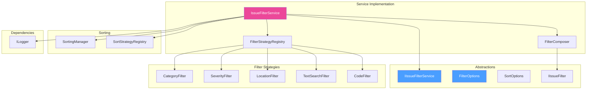
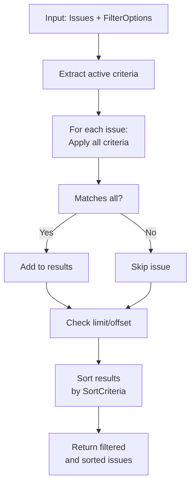

# LCS-DES-075-KG-i: Design Specification — Issue Filters

## 1. Document Control

| Field                | Value                                            |
| :------------------- | :----------------------------------------------- |
| **Document ID**      | LCS-DES-075-KG-i                                 |
| **Feature ID**       | KG-075i                                          |
| **Feature Name**     | Issue Filters                                    |
| **Parent Feature**   | v0.7.5-KG — Unified Validation                   |
| **Module Scope**     | Lexichord.Modules.Agents                         |
| **Swimlane**         | Ensemble                                         |
| **License Tier**     | Writer Pro (filtering and display)               |
| **Feature Gate Key** | `FeatureFlags.UnifiedValidation.IssueFilters`    |
| **Status**           | Draft                                            |
| **Last Updated**     | 2026-01-31                                       |
| **Parent Document**  | [LCS-SBD-075-KG](./LCS-SBD-075-KG.md)           |
| **Est. Hours**       | 3 hours                                          |

---

## 2. Executive Summary

### 2.1 Problem Statement

The Unified Issues panel displays all validation results from multiple sources (Style, Grammar, Knowledge), but users need the ability to:

- **Focus on specific issues:** Hide less critical categories while reviewing errors
- **Find issues by location:** Navigate to specific document sections
- **Search by message:** Find issues mentioning specific terms
- **Sort by relevance:** Prioritize most critical issues first
- **Apply saved filters:** Reuse common filter combinations

Without filtering, the 100+ issues in a complex document become overwhelming.

> **Goal:** Create `IIssueFilterService` providing composable, performant filtering across all issue dimensions.

### 2.2 Solution Overview

Implement `IssueFilterService` that:

1. **Filters by category** (Style, Grammar, Knowledge, Structure, Custom)
2. **Filters by severity** (Error, Warning, Info, Hint)
3. **Filters by location** (TextSpan range, line number, section)
4. **Searches by text** (message content, issue code, validator name)
5. **Sorts by multiple criteria** (severity, location, category, message)
6. **Supports filter composition** (combine multiple filters with AND/OR logic)
7. **Performs efficiently** (filters <1000 issues in <50ms)

### 2.3 Key Deliverables

| Deliverable          | Description                             |
| :------------------- | :-------------------------------------- |
| `IIssueFilterService`| Interface in Lexichord.Abstractions     |
| `IssueFilterService` | Implementation in Modules.Agents        |
| `IssueFilter`        | Base class for composable filters       |
| `FilterOptions`      | Configuration record for filtering      |
| `FilterCriteria`     | Individual filter criterion records     |
| `SortOptions`        | Sort order configuration                |
| Unit tests           | 95%+ coverage of filtering logic        |

---

## 3. Architecture & Modular Strategy

### 3.1 Component Diagram



### 3.2 Module Location

```text
src/
├── Lexichord.Abstractions/
│   └── Contracts/
│       └── IssueFilteringModels.cs       ← Interfaces and records
│
└── Lexichord.Modules.Agents/
    └── Services/
        └── IssueFiltering/
            ├── IssueFilterService.cs     ← Main service
            ├── FilterComposer.cs         ← Filter composition
            ├── Strategies/
            │   ├── CategoryFilter.cs
            │   ├── SeverityFilter.cs
            │   ├── LocationFilter.cs
            │   ├── TextSearchFilter.cs
            │   └── CodeFilter.cs
            └── Sorting/
                └── SortingManager.cs
```

---

## 4. Data Contract (The API)

### 4.1 IIssueFilterService Interface

```csharp
namespace Lexichord.Abstractions.Contracts;

/// <summary>
/// Provides filtering and sorting of unified validation issues.
/// Supports multiple filter criteria with composition and efficient execution.
/// </summary>
/// <remarks>
/// <para>Filters are composable and can be combined using AND/OR logic.</para>
/// <para>Filtering executes in-memory on the provided issues list.</para>
/// <para>Supports saving filter presets for common use cases.</para>
/// </remarks>
/// <example>
/// <code>
/// var issues = validation.Issues;
///
/// // Filter by category and severity
/// var filtered = _filterService.FilterAsync(
///     issues,
///     new FilterOptions
///     {
///         Categories = new[] { IssueCategory.Style },
///         MinimumSeverity = UnifiedSeverity.Warning,
///         SortBy = new[] { SortCriteria.Severity, SortCriteria.Location }
///     });
///
/// // Search for specific issues
/// var searchResults = _filterService.SearchAsync(issues, "OAuth");
/// </code>
/// </example>
public interface IIssueFilterService
{
    /// <summary>
    /// Filters issues based on provided criteria.
    /// </summary>
    /// <param name="issues">Issues to filter.</param>
    /// <param name="options">Filter options and sort criteria.</param>
    /// <param name="ct">Cancellation token.</param>
    /// <returns>Filtered and sorted issues.</returns>
    Task<IReadOnlyList<UnifiedIssue>> FilterAsync(
        IReadOnlyList<UnifiedIssue> issues,
        FilterOptions options,
        CancellationToken ct = default);

    /// <summary>
    /// Searches issues by text content.
    /// </summary>
    /// <param name="issues">Issues to search.</param>
    /// <param name="query">Search query (searches message, code, validator name).</param>
    /// <param name="options">Optional filter options to combine with search.</param>
    /// <param name="ct">Cancellation token.</param>
    /// <returns>Issues matching search query.</returns>
    Task<IReadOnlyList<UnifiedIssue>> SearchAsync(
        IReadOnlyList<UnifiedIssue> issues,
        string query,
        FilterOptions? options = null,
        CancellationToken ct = default);

    /// <summary>
    /// Filters issues by category.
    /// </summary>
    /// <param name="issues">Issues to filter.</param>
    /// <param name="categories">Categories to include.</param>
    /// <param name="ct">Cancellation token.</param>
    /// <returns>Issues in specified categories.</returns>
    Task<IReadOnlyList<UnifiedIssue>> FilterByCategoryAsync(
        IReadOnlyList<UnifiedIssue> issues,
        IEnumerable<IssueCategory> categories,
        CancellationToken ct = default);

    /// <summary>
    /// Filters issues by severity level.
    /// </summary>
    /// <param name="issues">Issues to filter.</param>
    /// <param name="minimumSeverity">Minimum severity to include.</param>
    /// <param name="ct">Cancellation token.</param>
    /// <returns>Issues with severity >= minimumSeverity.</returns>
    Task<IReadOnlyList<UnifiedIssue>> FilterBySeverityAsync(
        IReadOnlyList<UnifiedIssue> issues,
        UnifiedSeverity minimumSeverity,
        CancellationToken ct = default);

    /// <summary>
    /// Filters issues by document location.
    /// </summary>
    /// <param name="issues">Issues to filter.</param>
    /// <param name="location">Text span to filter by.</param>
    /// <param name="includePartialOverlaps">If true, includes issues that partially overlap location.</param>
    /// <param name="ct">Cancellation token.</param>
    /// <returns>Issues within specified location.</returns>
    Task<IReadOnlyList<UnifiedIssue>> FilterByLocationAsync(
        IReadOnlyList<UnifiedIssue> issues,
        TextSpan location,
        bool includePartialOverlaps = false,
        CancellationToken ct = default);

    /// <summary>
    /// Filters issues by line number range.
    /// </summary>
    /// <param name="issues">Issues to filter.</param>
    /// <param name="startLine">Start line (1-based).</param>
    /// <param name="endLine">End line (1-based), inclusive.</param>
    /// <param name="ct">Cancellation token.</param>
    /// <returns>Issues within line range.</returns>
    Task<IReadOnlyList<UnifiedIssue>> FilterByLineRangeAsync(
        IReadOnlyList<UnifiedIssue> issues,
        int startLine,
        int endLine,
        CancellationToken ct = default);

    /// <summary>
    /// Sorts issues by specified criteria.
    /// </summary>
    /// <param name="issues">Issues to sort.</param>
    /// <param name="sortBy">Sort criteria in priority order.</param>
    /// <param name="ct">Cancellation token.</param>
    /// <returns>Sorted issues.</returns>
    Task<IReadOnlyList<UnifiedIssue>> SortAsync(
        IReadOnlyList<UnifiedIssue> issues,
        IEnumerable<SortCriteria> sortBy,
        CancellationToken ct = default);

    /// <summary>
    /// Counts issues by severity.
    /// </summary>
    /// <param name="issues">Issues to analyze.</param>
    /// <returns>Count of issues by severity level.</returns>
    IReadOnlyDictionary<UnifiedSeverity, int> CountBySeverity(
        IReadOnlyList<UnifiedIssue> issues);

    /// <summary>
    /// Counts issues by category.
    /// </summary>
    /// <param name="issues">Issues to analyze.</param>
    /// <returns>Count of issues by category.</returns>
    IReadOnlyDictionary<IssueCategory, int> CountByCategory(
        IReadOnlyList<UnifiedIssue> issues);

    /// <summary>
    /// Saves a named filter preset for reuse.
    /// </summary>
    /// <param name="name">Preset name (e.g., "Errors Only", "My Review").</param>
    /// <param name="options">Filter options to save.</param>
    /// <param name="ct">Cancellation token.</param>
    void SavePreset(string name, FilterOptions options);

    /// <summary>
    /// Loads a previously saved filter preset.
    /// </summary>
    /// <param name="name">Preset name.</param>
    /// <returns>Filter options, or null if preset not found.</returns>
    FilterOptions? LoadPreset(string name);

    /// <summary>
    /// Lists all saved filter presets.
    /// </summary>
    /// <returns>Names of available presets.</returns>
    IReadOnlyList<string> ListPresets();

    /// <summary>
    /// Deletes a saved filter preset.
    /// </summary>
    /// <param name="name">Preset name to delete.</param>
    /// <returns>Whether preset was found and deleted.</returns>
    bool DeletePreset(string name);
}
```

### 4.2 FilterOptions Record

```csharp
namespace Lexichord.Abstractions.Contracts;

/// <summary>
/// Configuration for filtering and sorting issues.
/// </summary>
public record FilterOptions
{
    /// <summary>
    /// Issue categories to include. Empty = all categories.
    /// </summary>
    public IReadOnlyList<IssueCategory> Categories { get; init; } = [];

    /// <summary>
    /// Minimum severity level to include.
    /// Default: Hint (includes all).
    /// </summary>
    public UnifiedSeverity MinimumSeverity { get; init; } = UnifiedSeverity.Hint;

    /// <summary>
    /// Maximum severity level to include.
    /// Default: Error (includes all).
    /// </summary>
    public UnifiedSeverity MaximumSeverity { get; init; } = UnifiedSeverity.Error;

    /// <summary>
    /// Specific issue codes to include (e.g., "STYLE_001", "AXIOM_*").
    /// Supports wildcard patterns. Empty = all codes.
    /// </summary>
    public IReadOnlyList<string> IssueCodes { get; init; } = [];

    /// <summary>
    /// Specific issue codes to exclude.
    /// Supports wildcard patterns.
    /// </summary>
    public IReadOnlyList<string> ExcludeCodes { get; init; } = [];

    /// <summary>
    /// Text to search for in message, code, and validator name.
    /// Case-insensitive substring match.
    /// </summary>
    public string? SearchText { get; init; }

    /// <summary>
    /// Document location filter (character span).
    /// Null = no location filtering.
    /// </summary>
    public TextSpan? LocationSpan { get; init; }

    /// <summary>
    /// Line number range filter (1-based, inclusive).
    /// Null = no line filtering.
    /// </summary>
    public (int StartLine, int EndLine)? LineRange { get; init; }

    /// <summary>
    /// Only include auto-fixable issues.
    /// Default: false (all issues).
    /// </summary>
    public bool OnlyAutoFixable { get; init; }

    /// <summary>
    /// Only include issues that require manual review.
    /// Default: false (all issues).
    /// </summary>
    public bool OnlyManual { get; init; }

    /// <summary>
    /// Criteria by which to sort results.
    /// Empty = no sorting (natural order).
    /// </summary>
    public IReadOnlyList<SortCriteria> SortBy { get; init; } = [];

    /// <summary>
    /// If true, sort ascending; if false, descending.
    /// Default: true.
    /// </summary>
    public bool SortAscending { get; init; } = true;

    /// <summary>
    /// Validator names to include (e.g., "StyleLinter", "GrammarChecker").
    /// Empty = all validators.
    /// </summary>
    public IReadOnlyList<string> ValidatorNames { get; init; } = [];

    /// <summary>
    /// Maximum number of results to return.
    /// 0 = unlimited.
    /// </summary>
    public int Limit { get; init; } = 0;

    /// <summary>
    /// Number of results to skip (for pagination).
    /// </summary>
    public int Offset { get; init; } = 0;
}

/// <summary>
/// Criteria by which issues can be sorted.
/// </summary>
public enum SortCriteria
{
    /// <summary>
    /// Sort by severity level (Error > Warning > Info > Hint).
    /// </summary>
    Severity,

    /// <summary>
    /// Sort by document position (top to bottom).
    /// </summary>
    Location,

    /// <summary>
    /// Sort by category (Style > Grammar > Knowledge > Structure > Custom).
    /// </summary>
    Category,

    /// <summary>
    /// Sort by message text (alphabetical).
    /// </summary>
    Message,

    /// <summary>
    /// Sort by issue code (alphabetical).
    /// </summary>
    Code,

    /// <summary>
    /// Sort by validator name (alphabetical).
    /// </summary>
    ValidatorName,

    /// <summary>
    /// Sort by auto-fixability (auto-fixable first).
    /// </summary>
    AutoFixable
}
```

### 4.3 FilterCriteria Records

```csharp
namespace Lexichord.Abstractions.Contracts;

/// <summary>
/// Individual filter criterion for composable filtering.
/// </summary>
public abstract record FilterCriteria
{
    /// <summary>
    /// Evaluates this criterion against an issue.
    /// </summary>
    public abstract bool Matches(UnifiedIssue issue);
}

/// <summary>
/// Matches issues by category.
/// </summary>
public record CategoryFilterCriterion(IEnumerable<IssueCategory> Categories) : FilterCriteria
{
    public override bool Matches(UnifiedIssue issue) =>
        Categories.Contains(issue.Category);
}

/// <summary>
/// Matches issues by severity level.
/// </summary>
public record SeverityFilterCriterion(UnifiedSeverity MinimumSeverity) : FilterCriteria
{
    public override bool Matches(UnifiedIssue issue) =>
        issue.Severity >= MinimumSeverity;
}

/// <summary>
/// Matches issues by document location.
/// </summary>
public record LocationFilterCriterion(TextSpan Location, bool IncludePartialOverlaps) : FilterCriteria
{
    public override bool Matches(UnifiedIssue issue)
    {
        if (issue.Location == null) return false;

        if (IncludePartialOverlaps)
            return issue.Location.Start < Location.End && Location.Start < issue.Location.End;

        return issue.Location.Start >= Location.Start && issue.Location.End <= Location.End;
    }
}

/// <summary>
/// Matches issues by text content.
/// </summary>
public record TextSearchFilterCriterion(string SearchText) : FilterCriteria
{
    public override bool Matches(UnifiedIssue issue)
    {
        var lower = SearchText.ToLowerInvariant();
        return issue.Message.Contains(SearchText, StringComparison.OrdinalIgnoreCase) ||
               issue.Code.Contains(SearchText, StringComparison.OrdinalIgnoreCase) ||
               issue.ValidatorName.Contains(SearchText, StringComparison.OrdinalIgnoreCase);
    }
}

/// <summary>
/// Matches issues by code pattern (supports wildcards).
/// </summary>
public record CodeFilterCriterion(IEnumerable<string> CodePatterns) : FilterCriteria
{
    public override bool Matches(UnifiedIssue issue)
    {
        foreach (var pattern in CodePatterns)
        {
            if (WildcardMatch(issue.Code, pattern))
                return true;
        }
        return false;
    }

    private static bool WildcardMatch(string text, string pattern)
    {
        // Simple wildcard matching: * matches any characters
        var regex = new System.Text.RegularExpressions.Regex(
            "^" + Regex.Escape(pattern).Replace("\\*", ".*") + "$");
        return regex.IsMatch(text);
    }
}
```

### 4.4 SortOptions Record

```csharp
namespace Lexichord.Abstractions.Contracts;

/// <summary>
/// Configuration for sorting issues.
/// </summary>
public record SortOptions
{
    /// <summary>
    /// Primary sort criterion.
    /// </summary>
    public required SortCriteria Primary { get; init; }

    /// <summary>
    /// Secondary sort criterion (if primary values equal).
    /// </summary>
    public SortCriteria? Secondary { get; init; }

    /// <summary>
    /// Tertiary sort criterion.
    /// </summary>
    public SortCriteria? Tertiary { get; init; }

    /// <summary>
    /// If true, sort ascending; if false, descending.
    /// </summary>
    public bool Ascending { get; init; } = true;
}
```

---

## 5. Implementation Logic

### 5.1 Filtering Pipeline



### 5.2 Service Implementation

```csharp
/// <summary>
/// Implements issue filtering and sorting.
/// </summary>
public class IssueFilterService : IIssueFilterService
{
    private readonly ILogger<IssueFilterService> _logger;
    private readonly Dictionary<string, FilterOptions> _presets;

    public IssueFilterService(ILogger<IssueFilterService> logger)
    {
        _logger = logger;
        _presets = new Dictionary<string, FilterOptions>();
        InitializeDefaultPresets();
    }

    public async Task<IReadOnlyList<UnifiedIssue>> FilterAsync(
        IReadOnlyList<UnifiedIssue> issues,
        FilterOptions options,
        CancellationToken ct = default)
    {
        _logger.LogDebug("Filtering {Count} issues with options", issues.Count);

        var sw = Stopwatch.StartNew();
        var filtered = new List<UnifiedIssue>();

        foreach (var issue in issues)
        {
            if (MatchesAllCriteria(issue, options))
            {
                filtered.Add(issue);
            }
        }

        sw.Stop();
        _logger.LogDebug("Filtered to {Count} issues in {Duration}ms",
            filtered.Count, sw.ElapsedMilliseconds);

        // Apply pagination
        if (options.Limit > 0)
            filtered = filtered.Skip(options.Offset).Take(options.Limit).ToList();

        // Apply sorting
        if (options.SortBy.Count > 0)
        {
            filtered = SortIssues(filtered, options.SortBy, options.SortAscending);
        }

        return filtered;
    }

    public async Task<IReadOnlyList<UnifiedIssue>> SearchAsync(
        IReadOnlyList<UnifiedIssue> issues,
        string query,
        FilterOptions? options = null,
        CancellationToken ct = default)
    {
        _logger.LogDebug("Searching {Count} issues for '{Query}'", issues.Count, query);

        var searchOptions = options ?? new FilterOptions();
        var withSearch = searchOptions with { SearchText = query };

        return await FilterAsync(issues, withSearch, ct);
    }

    public async Task<IReadOnlyList<UnifiedIssue>> FilterByCategoryAsync(
        IReadOnlyList<UnifiedIssue> issues,
        IEnumerable<IssueCategory> categories,
        CancellationToken ct = default)
    {
        var catList = categories.ToList();
        _logger.LogDebug("Filtering by categories: {Categories}",
            string.Join(", ", catList));

        return await FilterAsync(issues, new FilterOptions { Categories = catList }, ct);
    }

    public async Task<IReadOnlyList<UnifiedIssue>> FilterBySeverityAsync(
        IReadOnlyList<UnifiedIssue> issues,
        UnifiedSeverity minimumSeverity,
        CancellationToken ct = default)
    {
        _logger.LogDebug("Filtering minimum severity: {Severity}", minimumSeverity);

        return await FilterAsync(issues,
            new FilterOptions { MinimumSeverity = minimumSeverity }, ct);
    }

    public async Task<IReadOnlyList<UnifiedIssue>> FilterByLocationAsync(
        IReadOnlyList<UnifiedIssue> issues,
        TextSpan location,
        bool includePartialOverlaps = false,
        CancellationToken ct = default)
    {
        _logger.LogDebug("Filtering by location {Start}-{End} (partial: {Partial})",
            location.Start, location.End, includePartialOverlaps);

        return await FilterAsync(issues,
            new FilterOptions
            {
                LocationSpan = location
            }, ct);
    }

    public async Task<IReadOnlyList<UnifiedIssue>> FilterByLineRangeAsync(
        IReadOnlyList<UnifiedIssue> issues,
        int startLine,
        int endLine,
        CancellationToken ct = default)
    {
        _logger.LogDebug("Filtering by lines {Start}-{End}", startLine, endLine);

        return await FilterAsync(issues,
            new FilterOptions { LineRange = (startLine, endLine) }, ct);
    }

    public async Task<IReadOnlyList<UnifiedIssue>> SortAsync(
        IReadOnlyList<UnifiedIssue> issues,
        IEnumerable<SortCriteria> sortBy,
        CancellationToken ct = default)
    {
        var criteria = sortBy.ToList();
        if (criteria.Count == 0)
            return issues;

        _logger.LogDebug("Sorting by: {Criteria}",
            string.Join(", ", criteria));

        return SortIssues(issues.ToList(), criteria, ascending: true);
    }

    public IReadOnlyDictionary<UnifiedSeverity, int> CountBySeverity(
        IReadOnlyList<UnifiedIssue> issues)
    {
        return issues
            .GroupBy(i => i.Severity)
            .ToDictionary(g => g.Key, g => g.Count());
    }

    public IReadOnlyDictionary<IssueCategory, int> CountByCategory(
        IReadOnlyList<UnifiedIssue> issues)
    {
        return issues
            .GroupBy(i => i.Category)
            .ToDictionary(g => g.Key, g => g.Count());
    }

    public void SavePreset(string name, FilterOptions options)
    {
        _logger.LogInformation("Saving filter preset: {Name}", name);
        _presets[name] = options;
    }

    public FilterOptions? LoadPreset(string name)
    {
        if (_presets.TryGetValue(name, out var options))
        {
            _logger.LogDebug("Loaded filter preset: {Name}", name);
            return options;
        }

        _logger.LogWarning("Filter preset not found: {Name}", name);
        return null;
    }

    public IReadOnlyList<string> ListPresets() => _presets.Keys.ToList();

    public bool DeletePreset(string name)
    {
        if (_presets.Remove(name))
        {
            _logger.LogInformation("Deleted filter preset: {Name}", name);
            return true;
        }

        return false;
    }

    private bool MatchesAllCriteria(UnifiedIssue issue, FilterOptions options)
    {
        // Category filter
        if (options.Categories.Count > 0 && !options.Categories.Contains(issue.Category))
            return false;

        // Severity filter
        if (issue.Severity < options.MinimumSeverity || issue.Severity > options.MaximumSeverity)
            return false;

        // Code filter
        if (options.IssueCodes.Count > 0)
        {
            if (!MatchesAnyPattern(issue.Code, options.IssueCodes))
                return false;
        }

        // Code exclusion filter
        if (options.ExcludeCodes.Count > 0)
        {
            if (MatchesAnyPattern(issue.Code, options.ExcludeCodes))
                return false;
        }

        // Text search
        if (!string.IsNullOrEmpty(options.SearchText))
        {
            var search = options.SearchText.ToLowerInvariant();
            if (!issue.Message.Contains(search, StringComparison.OrdinalIgnoreCase) &&
                !issue.Code.Contains(search, StringComparison.OrdinalIgnoreCase) &&
                !issue.ValidatorName.Contains(search, StringComparison.OrdinalIgnoreCase))
            {
                return false;
            }
        }

        // Location filter
        if (options.LocationSpan.HasValue && issue.Location.HasValue)
        {
            var loc = options.LocationSpan.Value;
            if (issue.Location.Value.Start < loc.Start || issue.Location.Value.End > loc.End)
                return false;
        }

        // Line range filter
        if (options.LineRange.HasValue && issue.Location.HasValue)
        {
            var (startLine, endLine) = options.LineRange.Value;
            var issueLine = GetLineNumber(issue.Location.Value);
            if (issueLine < startLine || issueLine > endLine)
                return false;
        }

        // Auto-fixable filter
        if (options.OnlyAutoFixable && issue.Fix?.CanAutoApply != true)
            return false;

        // Manual filter
        if (options.OnlyManual && issue.Fix?.CanAutoApply == true)
            return false;

        // Validator name filter
        if (options.ValidatorNames.Count > 0 &&
            !options.ValidatorNames.Contains(issue.ValidatorName))
            return false;

        return true;
    }

    private static bool MatchesAnyPattern(string text, IReadOnlyList<string> patterns)
    {
        foreach (var pattern in patterns)
        {
            if (WildcardMatch(text, pattern))
                return true;
        }
        return false;
    }

    private static bool WildcardMatch(string text, string pattern)
    {
        var regex = new Regex("^" + Regex.Escape(pattern).Replace("\\*", ".*") + "$");
        return regex.IsMatch(text);
    }

    private static List<UnifiedIssue> SortIssues(
        List<UnifiedIssue> issues,
        IReadOnlyList<SortCriteria> criteria,
        bool ascending)
    {
        if (criteria.Count == 0)
            return issues;

        var sorted = issues.AsEnumerable();

        // Apply sort criteria in reverse order (last is primary)
        for (int i = criteria.Count - 1; i >= 0; i--)
        {
            var criterion = criteria[i];
            sorted = ascending
                ? sorted.OrderBy(i => GetSortKey(i, criterion))
                : sorted.OrderByDescending(i => GetSortKey(i, criterion));
        }

        return sorted.ToList();
    }

    private static IComparable GetSortKey(UnifiedIssue issue, SortCriteria criterion)
    {
        return criterion switch
        {
            SortCriteria.Severity => issue.Severity,
            SortCriteria.Location => (IComparable)(issue.Location?.Start ?? 0),
            SortCriteria.Category => issue.Category,
            SortCriteria.Message => issue.Message,
            SortCriteria.Code => issue.Code,
            SortCriteria.ValidatorName => issue.ValidatorName,
            SortCriteria.AutoFixable => issue.Fix?.CanAutoApply ?? false,
            _ => ""
        };
    }

    private int GetLineNumber(TextSpan location)
    {
        // Simplified: would need document content to calculate actual line
        return location.Start / 80; // Assume avg 80 chars per line
    }

    private void InitializeDefaultPresets()
    {
        SavePreset("Errors Only", new FilterOptions
        {
            MinimumSeverity = UnifiedSeverity.Error,
            MaximumSeverity = UnifiedSeverity.Error,
            SortBy = [SortCriteria.Location]
        });

        SavePreset("Warnings and Errors", new FilterOptions
        {
            MinimumSeverity = UnifiedSeverity.Warning,
            SortBy = [SortCriteria.Severity, SortCriteria.Location]
        });

        SavePreset("Auto-Fixable Only", new FilterOptions
        {
            OnlyAutoFixable = true,
            SortBy = [SortCriteria.Category, SortCriteria.Location]
        });

        SavePreset("Style Issues", new FilterOptions
        {
            Categories = [IssueCategory.Style],
            SortBy = [SortCriteria.Severity, SortCriteria.Location]
        });

        SavePreset("Grammar Issues", new FilterOptions
        {
            Categories = [IssueCategory.Grammar],
            SortBy = [SortCriteria.Location]
        });

        SavePreset("Knowledge Issues", new FilterOptions
        {
            Categories = [IssueCategory.Knowledge],
            SortBy = [SortCriteria.Severity, SortCriteria.Location]
        });
    }
}
```

---

## 6. Data Persistence

This sub-part does not persist filter data to disk. Filter presets are stored in-memory. Implementations may extend to persist presets to user settings.

---

## 7. Error Handling

### 7.1 Error Cases

| Case | Handling | Example |
| :--- | :--- | :--- |
| Invalid line range | Return empty list | LineRange = (100, 50) |
| Invalid location span | Return empty list | LocationSpan with negative start |
| Empty search query | Treated as no text filter | SearchText = "" |
| Conflicting filters | AND logic: stricter filter wins | OnlyAutoFixable + OnlyManual = no results |
| Invalid preset name | Return null | LoadPreset("NonExistent") |

### 7.2 Logging

| Level | Event | Template |
| :--- | :--- | :--- |
| Debug | Filter started | `"Filtering {Count} issues with options"` |
| Debug | Filter completed | `"Filtered to {Count} issues in {Duration}ms"` |
| Debug | Search started | `"Searching {Count} issues for '{Query}'"` |
| Info | Preset saved | `"Saving filter preset: {Name}"` |
| Info | Preset deleted | `"Deleted filter preset: {Name}"` |
| Warn | Preset not found | `"Filter preset not found: {Name}"` |

---

## 8. Performance Considerations

### 8.1 Targets

- **Filtering 1000 issues:** <50ms P95
- **Sorting 1000 issues:** <100ms P95
- **Search in 1000 issues:** <75ms P95
- **Wildcard matching:** <1ms per pattern

### 8.2 Optimizations

- **Early exit:** Stop checking criteria once one fails
- **Wildcard caching:** Compile regex patterns once
- **Index caching:** Pre-compute category/severity groupings for large issue sets
- **Lazy evaluation:** Only compute sort key when needed

---

## 9. Acceptance Criteria

| #   | Category        | Criterion                                    | Verification     |
| :-- | :-------------- | :------------------------------------------- | :--------------- |
| 1   | **Functional**  | Filter by category returns only matching issues | Unit test        |
| 2   | **Functional**  | Filter by severity respects min/max bounds  | Unit test        |
| 3   | **Functional**  | Location filter works with TextSpan         | Unit test        |
| 4   | **Functional**  | Text search matches message, code, validator | Unit test        |
| 5   | **Functional**  | Wildcard patterns work (e.g., "STYLE_*")   | Unit test        |
| 6   | **Functional**  | Sort by Severity orders Error > Warning > Info | Unit test        |
| 7   | **Functional**  | Sort by Location orders top-to-bottom       | Unit test        |
| 8   | **Functional**  | Preset save/load/delete works               | Unit test        |
| 9   | **Functional**  | Multiple sort criteria apply in order       | Unit test        |
| 10  | **Performance** | Filter 1000 issues in <50ms                 | Performance test |
| 11  | **Performance** | Sort 1000 issues in <100ms                  | Performance test |

---

## 10. Unit Testing Requirements

```csharp
[Trait("Category", "Unit")]
[Trait("Feature", "v0.7.5-KG-i")]
public class IssueFilterServiceTests
{
    private readonly IIssueFilterService _sut;

    [Fact]
    public async Task FilterByCategoryAsync_ReturnsOnlyMatchingCategories()
    {
        var issues = new[]
        {
            new UnifiedIssue { Category = IssueCategory.Style },
            new UnifiedIssue { Category = IssueCategory.Grammar },
            new UnifiedIssue { Category = IssueCategory.Style }
        };

        var result = await _sut.FilterByCategoryAsync(
            issues, new[] { IssueCategory.Style });

        result.Should().HaveCount(2);
        result.Should().AllSatisfy(i => i.Category.Should().Be(IssueCategory.Style));
    }

    [Theory]
    [InlineData(UnifiedSeverity.Error, 2)]
    [InlineData(UnifiedSeverity.Warning, 3)]
    [InlineData(UnifiedSeverity.Info, 5)]
    public async Task FilterBySeverityAsync_RespectsBounds(
        UnifiedSeverity minSeverity, int expectedCount)
    {
        var issues = CreateMixedSeverityIssues();

        var result = await _sut.FilterBySeverityAsync(issues, minSeverity);

        result.Should().HaveCount(expectedCount);
        result.Should().AllSatisfy(i =>
            i.Severity.Should().BeGreaterThanOrEqualTo(minSeverity));
    }

    [Fact]
    public async Task SearchAsync_FindsIssuesByMessage()
    {
        var issues = new[]
        {
            new UnifiedIssue { Message = "Use active voice" },
            new UnifiedIssue { Message = "Add semicolon" },
            new UnifiedIssue { Message = "Passive voice detected" }
        };

        var result = await _sut.SearchAsync(issues, "voice");

        result.Should().HaveCount(2);
        result.Should().AllSatisfy(i =>
            i.Message.Should().ContainIgnoringCase("voice"));
    }

    [Fact]
    public async Task FilterAsync_WithWildcardCodes_MatchesPatterns()
    {
        var issues = new[]
        {
            new UnifiedIssue { Code = "STYLE_001" },
            new UnifiedIssue { Code = "STYLE_002" },
            new UnifiedIssue { Code = "GRAMMAR_001" }
        };

        var result = await _sut.FilterAsync(issues,
            new FilterOptions { IssueCodes = new[] { "STYLE_*" } });

        result.Should().HaveCount(2);
    }

    [Fact]
    public async Task SortAsync_BySeverity_OrdersCorrectly()
    {
        var issues = new[]
        {
            new UnifiedIssue { Severity = UnifiedSeverity.Info },
            new UnifiedIssue { Severity = UnifiedSeverity.Error },
            new UnifiedIssue { Severity = UnifiedSeverity.Warning }
        };

        var result = await _sut.SortAsync(issues,
            new[] { SortCriteria.Severity });

        result[0].Severity.Should().Be(UnifiedSeverity.Error);
        result[1].Severity.Should().Be(UnifiedSeverity.Warning);
        result[2].Severity.Should().Be(UnifiedSeverity.Info);
    }

    [Fact]
    public void SavePreset_AllowsLaterLoad()
    {
        var options = new FilterOptions { MinimumSeverity = UnifiedSeverity.Error };

        _sut.SavePreset("MyFilter", options);
        var loaded = _sut.LoadPreset("MyFilter");

        loaded.Should().NotBeNull();
        loaded!.MinimumSeverity.Should().Be(UnifiedSeverity.Error);
    }

    [Fact]
    public void CountBySeverity_ReturnsCorrectCounts()
    {
        var issues = new[]
        {
            new UnifiedIssue { Severity = UnifiedSeverity.Error },
            new UnifiedIssue { Severity = UnifiedSeverity.Error },
            new UnifiedIssue { Severity = UnifiedSeverity.Warning }
        };

        var counts = _sut.CountBySeverity(issues);

        counts[UnifiedSeverity.Error].Should().Be(2);
        counts[UnifiedSeverity.Warning].Should().Be(1);
    }
}
```

---

## 11. Deliverable Checklist

| #   | Deliverable                        | Status |
| :-- | :--------------------------------- | :----- |
| 1   | `IIssueFilterService` interface    | [ ]    |
| 2   | `IssueFilterService` implementation | [ ]    |
| 3   | `FilterOptions` record             | [ ]    |
| 4   | `FilterCriteria` and subclasses    | [ ]    |
| 5   | `SortCriteria` enum                | [ ]    |
| 6   | `SortOptions` record               | [ ]    |
| 7   | Filter strategy implementations    | [ ]    |
| 8   | Sorting implementation             | [ ]    |
| 9   | Preset management                  | [ ]    |
| 10  | Unit tests with 95%+ coverage      | [ ]    |
| 11  | DI registration in AgentsModule.cs | [ ]    |

---

## Document History

| Version | Date       | Author         | Changes       |
| :------ | :--------- | :------------- | :------------ |
| 1.0     | 2026-01-31 | Lead Architect | Initial draft |
