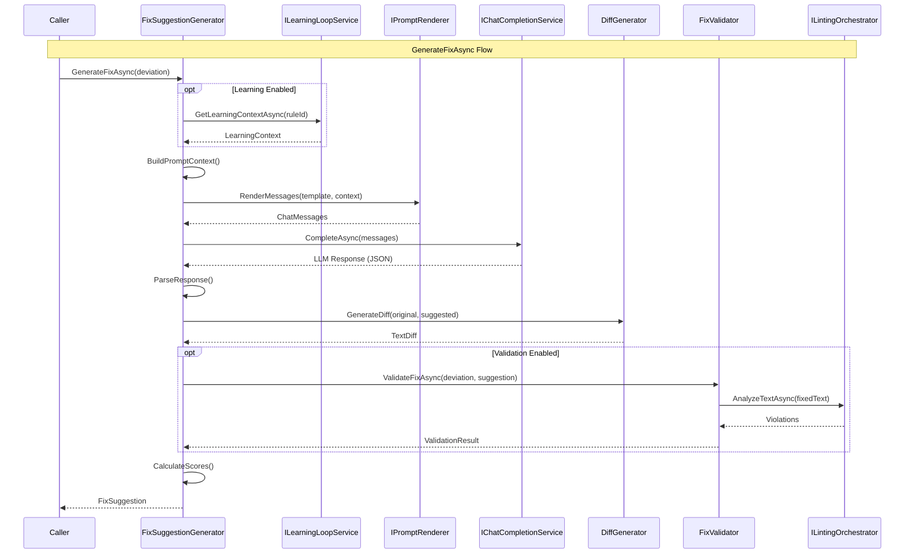

# LCS-DES-075b: Design Specification — Automatic Fix Suggestions

## 1. Metadata & Categorization

| Field | Value | Description |
| :--- | :--- | :--- |
| **Feature ID** | `AGT-075b` | Sub-part of AGT-075 |
| **Feature Name** | `Automatic Fix Suggestions` | LLM-powered contextual rewrites |
| **Target Version** | `v0.7.5b` | Second sub-part of v0.7.5 |
| **Module Scope** | `Lexichord.Modules.Agents` | Agent module |
| **Swimlane** | `Ensemble` | Part of Agents vertical |
| **License Tier** | `Writer Pro` | Minimum tier for access |
| **Feature Gate Key** | `FeatureFlags.Agents.TuningAgent` | Shared gate with parent feature |
| **Author** | Lead Architect | |
| **Status** | `Draft` | |
| **Last Updated** | `2026-01-27` | |
| **Parent Document** | [LCS-DES-075-INDEX](./LCS-DES-075-INDEX.md) | |
| **Scope Breakdown** | [LCS-SBD-075 S3.2](./LCS-SBD-075.md#32-v075b-automatic-fix-suggestions) | |

---

## 2. Executive Summary

### 2.1 The Requirement

The Style Deviation Scanner (v0.7.5a) identifies style violations, but users need intelligent fix suggestions that:

- **Understand Context:** Simple find/replace doesn't account for sentence structure or meaning
- **Preserve Meaning:** Fixes must maintain the original intent and semantic content
- **Respect Style Rules:** Suggestions must comply with the violated rule and not introduce new violations
- **Provide Confidence:** Users need to know how reliable each suggestion is
- **Offer Alternatives:** Complex violations may have multiple valid corrections

> **Goal:** Generate AI-powered fix suggestions that understand context, preserve meaning, and comply with style rules.

### 2.2 The Proposed Solution

Implement `FixSuggestionGenerator` that:

1. Takes style deviations with their context as input
2. Constructs prompts enhanced with rule details and learning context
3. Invokes LLM to generate contextually appropriate rewrites
4. Validates generated fixes against the linter
5. Computes confidence and quality scores
6. Generates visual diffs for review
7. Supports batch processing for efficiency

---

## 3. Architecture & Modular Strategy

### 3.1 Dependencies

#### 3.1.1 Upstream Dependencies

| Interface | Source Version | Purpose |
| :--- | :--- | :--- |
| `StyleDeviation` | v0.7.5a | Input deviation data |
| `IChatCompletionService` | v0.6.1a | LLM communication |
| `IPromptRenderer` | v0.6.3b | Template rendering |
| `IPromptTemplateRepository` | v0.6.3c | Template storage |
| `IContextOrchestrator` | v0.7.2c | Additional context gathering |
| `ILintingOrchestrator` | v0.2.3a | Fix validation |
| `ILearningLoopService` | v0.7.5d | Learning context (optional) |

#### 3.1.2 NuGet Packages

| Package | Version | Purpose |
| :--- | :--- | :--- |
| `DiffPlex` | 1.7.x | Text diff generation (NEW) |
| `System.Text.Json` | 8.x | JSON parsing for LLM responses |

### 3.2 Licensing Behavior

- **Load Behavior:** Soft Gate
  - Service loads for all tiers
  - License check on public methods
  - Returns error result for unlicensed users

---

## 4. Data Contract (The API)

### 4.1 Primary Interface

```csharp
namespace Lexichord.Abstractions.Contracts.Agents;

/// <summary>
/// Generates AI-powered fix suggestions for style deviations.
/// </summary>
public interface IFixSuggestionGenerator
{
    /// <summary>
    /// Generates a fix suggestion for a single deviation.
    /// </summary>
    /// <param name="deviation">The style deviation to fix.</param>
    /// <param name="options">Options controlling fix generation.</param>
    /// <param name="ct">Cancellation token.</param>
    /// <returns>A fix suggestion with confidence and quality scores.</returns>
    Task<FixSuggestion> GenerateFixAsync(
        StyleDeviation deviation,
        FixGenerationOptions? options = null,
        CancellationToken ct = default);

    /// <summary>
    /// Generates fix suggestions for multiple deviations in batch.
    /// More efficient than calling GenerateFixAsync individually due to
    /// parallel processing and context sharing.
    /// </summary>
    /// <param name="deviations">The style deviations to fix.</param>
    /// <param name="options">Options controlling fix generation.</param>
    /// <param name="ct">Cancellation token.</param>
    /// <returns>Fix suggestions for each deviation.</returns>
    Task<IReadOnlyList<FixSuggestion>> GenerateFixesAsync(
        IReadOnlyList<StyleDeviation> deviations,
        FixGenerationOptions? options = null,
        CancellationToken ct = default);

    /// <summary>
    /// Regenerates a fix suggestion with additional user guidance.
    /// Used when user rejects initial suggestion and provides feedback.
    /// </summary>
    /// <param name="deviation">The style deviation to fix.</param>
    /// <param name="userGuidance">User's feedback or preferred direction.</param>
    /// <param name="options">Options controlling fix generation.</param>
    /// <param name="ct">Cancellation token.</param>
    /// <returns>New fix suggestion incorporating user guidance.</returns>
    Task<FixSuggestion> RegenerateFixAsync(
        StyleDeviation deviation,
        string userGuidance,
        FixGenerationOptions? options = null,
        CancellationToken ct = default);

    /// <summary>
    /// Validates that a fix suggestion correctly addresses the deviation
    /// without introducing new violations.
    /// </summary>
    /// <param name="deviation">The original deviation.</param>
    /// <param name="suggestion">The suggested fix.</param>
    /// <param name="ct">Cancellation token.</param>
    /// <returns>Validation result with details.</returns>
    Task<FixValidationResult> ValidateFixAsync(
        StyleDeviation deviation,
        FixSuggestion suggestion,
        CancellationToken ct = default);
}
```

### 4.2 Data Records

```csharp
namespace Lexichord.Abstractions.Contracts.Agents;

/// <summary>
/// Represents a suggested fix for a style deviation.
/// </summary>
public record FixSuggestion
{
    /// <summary>
    /// Unique identifier for this suggestion.
    /// </summary>
    public required Guid SuggestionId { get; init; }

    /// <summary>
    /// The deviation this suggestion addresses.
    /// </summary>
    public required Guid DeviationId { get; init; }

    /// <summary>
    /// The original text with the violation.
    /// </summary>
    public required string OriginalText { get; init; }

    /// <summary>
    /// The suggested replacement text.
    /// </summary>
    public required string SuggestedText { get; init; }

    /// <summary>
    /// Human-readable explanation of the change.
    /// </summary>
    public required string Explanation { get; init; }

    /// <summary>
    /// Confidence score for the suggestion (0.0 to 1.0).
    /// Based on LLM confidence and learning patterns.
    /// </summary>
    public double Confidence { get; init; } = 0.8;

    /// <summary>
    /// Quality score based on semantic preservation (0.0 to 1.0).
    /// Higher = better meaning preservation.
    /// </summary>
    public double QualityScore { get; init; } = 0.8;

    /// <summary>
    /// The diff showing changes between original and suggested.
    /// </summary>
    public required TextDiff Diff { get; init; }

    /// <summary>
    /// Token usage for this suggestion generation.
    /// </summary>
    public UsageMetrics? TokenUsage { get; init; }

    /// <summary>
    /// Time taken to generate this suggestion.
    /// </summary>
    public TimeSpan GenerationTime { get; init; }

    /// <summary>
    /// Alternative suggestions if available.
    /// </summary>
    public IReadOnlyList<AlternativeSuggestion>? Alternatives { get; init; }

    /// <summary>
    /// Whether validation has been performed.
    /// </summary>
    public bool IsValidated { get; init; }

    /// <summary>
    /// Validation result if validated.
    /// </summary>
    public FixValidationResult? ValidationResult { get; init; }

    /// <summary>
    /// Whether this is a high-confidence automated fix.
    /// High confidence = Confidence >= 0.9 AND QualityScore >= 0.9 AND Validated.
    /// </summary>
    public bool IsHighConfidence =>
        Confidence >= 0.9 &&
        QualityScore >= 0.9 &&
        IsValidated &&
        ValidationResult?.Status == ValidationStatus.Valid;

    /// <summary>
    /// Error message if generation failed.
    /// </summary>
    public string? ErrorMessage { get; init; }

    /// <summary>
    /// Whether the suggestion was successfully generated.
    /// </summary>
    public bool Success => string.IsNullOrEmpty(ErrorMessage);

    /// <summary>
    /// Creates a failed suggestion with error message.
    /// </summary>
    public static FixSuggestion Failed(Guid deviationId, string originalText, string error) => new()
    {
        SuggestionId = Guid.NewGuid(),
        DeviationId = deviationId,
        OriginalText = originalText,
        SuggestedText = originalText, // Unchanged
        Explanation = $"Generation failed: {error}",
        ErrorMessage = error,
        Confidence = 0,
        QualityScore = 0,
        Diff = TextDiff.Empty
    };
}

/// <summary>
/// An alternative suggestion for a deviation.
/// </summary>
public record AlternativeSuggestion(
    string SuggestedText,
    string Explanation,
    double Confidence);

/// <summary>
/// Options for fix generation.
/// </summary>
public record FixGenerationOptions
{
    /// <summary>
    /// Maximum number of alternative suggestions to generate.
    /// Default: 2.
    /// </summary>
    public int MaxAlternatives { get; init; } = 2;

    /// <summary>
    /// Whether to include detailed explanations.
    /// Default: true.
    /// </summary>
    public bool IncludeExplanations { get; init; } = true;

    /// <summary>
    /// Minimum confidence threshold for suggestions.
    /// Suggestions below this are marked as low confidence.
    /// Default: 0.7.
    /// </summary>
    public double MinConfidence { get; init; } = 0.7;

    /// <summary>
    /// Whether to validate fixes against the linter.
    /// Default: true.
    /// </summary>
    public bool ValidateFixes { get; init; } = true;

    /// <summary>
    /// Custom prompt overrides for specific violation categories.
    /// </summary>
    public IReadOnlyDictionary<string, string>? CategoryPromptOverrides { get; init; }

    /// <summary>
    /// User's preferred tone for rewrites.
    /// Default: Neutral.
    /// </summary>
    public TonePreference Tone { get; init; } = TonePreference.Neutral;

    /// <summary>
    /// Whether to strongly preserve the author's voice.
    /// Default: true.
    /// </summary>
    public bool PreserveVoice { get; init; } = true;

    /// <summary>
    /// Maximum parallel LLM requests for batch processing.
    /// Default: 5.
    /// </summary>
    public int MaxParallelism { get; init; } = 5;

    /// <summary>
    /// Whether to use learning context to enhance prompts.
    /// Default: true.
    /// </summary>
    public bool UseLearningContext { get; init; } = true;

    /// <summary>
    /// Default options.
    /// </summary>
    public static FixGenerationOptions Default => new();
}

/// <summary>
/// Tone preferences for fix suggestions.
/// </summary>
public enum TonePreference
{
    /// <summary>Match the original text's tone.</summary>
    Neutral,
    /// <summary>Use formal, professional language.</summary>
    Formal,
    /// <summary>Use conversational language.</summary>
    Casual,
    /// <summary>Use precise technical language.</summary>
    Technical,
    /// <summary>Use simple, accessible language.</summary>
    Simplified
}

/// <summary>
/// Result of fix validation.
/// </summary>
public record FixValidationResult
{
    /// <summary>
    /// Whether the fix resolves the original violation.
    /// </summary>
    public bool ResolvesViolation { get; init; }

    /// <summary>
    /// Whether the fix introduces new violations.
    /// </summary>
    public bool IntroducesNewViolations { get; init; }

    /// <summary>
    /// List of any new violations introduced.
    /// </summary>
    public IReadOnlyList<LintViolation>? NewViolations { get; init; }

    /// <summary>
    /// Semantic similarity score between original and fixed text.
    /// 1.0 = identical meaning, 0.0 = completely different.
    /// </summary>
    public double SemanticSimilarity { get; init; }

    /// <summary>
    /// Overall validation status.
    /// </summary>
    public ValidationStatus Status { get; init; }

    /// <summary>
    /// Detailed validation message.
    /// </summary>
    public string Message { get; init; } = string.Empty;

    /// <summary>
    /// Creates a valid result.
    /// </summary>
    public static FixValidationResult Valid(double similarity = 0.95) => new()
    {
        ResolvesViolation = true,
        IntroducesNewViolations = false,
        SemanticSimilarity = similarity,
        Status = ValidationStatus.Valid,
        Message = "Fix resolves violation without introducing new issues."
    };

    /// <summary>
    /// Creates an invalid result.
    /// </summary>
    public static FixValidationResult Invalid(string reason, IReadOnlyList<LintViolation>? newViolations = null) => new()
    {
        ResolvesViolation = false,
        IntroducesNewViolations = newViolations?.Count > 0,
        NewViolations = newViolations,
        SemanticSimilarity = 0,
        Status = ValidationStatus.Invalid,
        Message = reason
    };
}

/// <summary>
/// Validation status for a fix.
/// </summary>
public enum ValidationStatus
{
    /// <summary>Fix is valid - resolves violation without new issues.</summary>
    Valid,
    /// <summary>Fix resolves violation but has warnings.</summary>
    ValidWithWarnings,
    /// <summary>Fix is invalid - doesn't resolve or introduces issues.</summary>
    Invalid,
    /// <summary>Validation could not be completed.</summary>
    ValidationFailed
}

/// <summary>
/// Represents a text diff between original and suggested text.
/// </summary>
public record TextDiff
{
    /// <summary>
    /// List of diff operations.
    /// </summary>
    public required IReadOnlyList<DiffOperation> Operations { get; init; }

    /// <summary>
    /// Unified diff format string.
    /// </summary>
    public required string UnifiedDiff { get; init; }

    /// <summary>
    /// HTML representation with highlighting.
    /// </summary>
    public string? HtmlDiff { get; init; }

    /// <summary>
    /// Number of additions.
    /// </summary>
    public int Additions => Operations.Count(o => o.Type == DiffType.Addition);

    /// <summary>
    /// Number of deletions.
    /// </summary>
    public int Deletions => Operations.Count(o => o.Type == DiffType.Deletion);

    /// <summary>
    /// Number of unchanged segments.
    /// </summary>
    public int Unchanged => Operations.Count(o => o.Type == DiffType.Unchanged);

    /// <summary>
    /// Total characters changed.
    /// </summary>
    public int TotalChanges => Operations
        .Where(o => o.Type != DiffType.Unchanged)
        .Sum(o => o.Text.Length);

    /// <summary>
    /// Empty diff (no changes).
    /// </summary>
    public static TextDiff Empty => new()
    {
        Operations = Array.Empty<DiffOperation>(),
        UnifiedDiff = string.Empty
    };
}

/// <summary>
/// A single diff operation.
/// </summary>
public record DiffOperation(DiffType Type, string Text, int StartIndex, int Length);

/// <summary>
/// Type of diff operation.
/// </summary>
public enum DiffType
{
    /// <summary>Text is unchanged.</summary>
    Unchanged,
    /// <summary>Text was added.</summary>
    Addition,
    /// <summary>Text was deleted.</summary>
    Deletion
}
```

---

## 5. Implementation Logic

### 5.1 Flow Diagram



### 5.2 Prompt Template

```yaml
# prompts/tuning-agent-fix.yaml
template_id: "tuning-agent-fix"
name: "Tuning Agent Fix Generator"
version: "1.0.0"
description: "Generates contextual fix suggestions for style deviations"

system_prompt: |
  You are a precise style enforcement agent for a writing assistant called Lexichord.
  Your task is to rewrite text to fix a specific style violation while preserving the exact original meaning.

  ## STYLE RULE VIOLATED
  - **Rule ID:** {{rule_id}}
  - **Rule Name:** {{rule_name}}
  - **Description:** {{rule_description}}
  - **Category:** {{rule_category}}
  - **Severity:** {{violation_severity}}

  {{#rule_examples}}
  ## EXAMPLES FROM RULE
  {{rule_examples}}
  {{/rule_examples}}

  ## VIOLATION DETAILS
  - **Message:** {{violation_message}}
  {{#linter_suggested_fix}}
  - **Linter Suggestion:** {{linter_suggested_fix}}
  {{/linter_suggested_fix}}

  ## REQUIREMENTS
  1. Fix ONLY the specific violation identified - do not make other changes
  2. Preserve the original meaning EXACTLY - do not add, remove, or alter information
  3. Maintain the author's voice and writing style
  4. Make minimal textual changes while resolving the violation
  5. Do not introduce new style violations

  {{#preserve_voice}}
  ## VOICE PRESERVATION
  Strongly preserve the author's original voice. Keep sentence structure similar where possible.
  {{/preserve_voice}}

  {{#tone}}
  ## TONE PREFERENCE
  The user prefers a {{tone}} tone. Adjust language accordingly while fixing the violation.
  {{/tone}}

  {{#learning_context}}
  ## LEARNING FROM PAST FEEDBACK
  Based on past user feedback for this rule:
  {{#accepted_patterns}}
  - Users PREFERRED: {{.}}
  {{/accepted_patterns}}
  {{#rejected_patterns}}
  - Users REJECTED: {{.}}
  {{/rejected_patterns}}
  {{#prompt_enhancement}}
  Additional guidance: {{prompt_enhancement}}
  {{/prompt_enhancement}}
  {{/learning_context}}

  ## OUTPUT FORMAT
  Respond with valid JSON in exactly this format:
  ```json
  {
    "suggested_text": "The rewritten text with the fix applied",
    "explanation": "Brief explanation (1-2 sentences) of what was changed and why",
    "confidence": 0.95,
    "alternatives": [
      {
        "text": "Alternative rewrite option",
        "explanation": "Why this alternative might be preferred",
        "confidence": 0.85
      }
    ]
  }
  ```

  Guidelines for the response:
  - `suggested_text`: Must be a complete replacement for the original text
  - `explanation`: Explain the specific change, not the general rule
  - `confidence`: 0.0-1.0 based on how certain you are this is the best fix
  - `alternatives`: {{#max_alternatives}}Provide up to {{max_alternatives}} alternatives{{/max_alternatives}}{{^max_alternatives}}Optional alternatives{{/max_alternatives}}

user_prompt: |
  Please fix the following text to resolve the style violation:

  ## ORIGINAL TEXT (to be rewritten)
  ```
  {{original_text}}
  ```

  {{#surrounding_context}}
  ## SURROUNDING CONTEXT (for understanding, not to be modified)
  ```
  {{surrounding_context}}
  ```
  {{/surrounding_context}}

  {{#user_guidance}}
  ## ADDITIONAL USER GUIDANCE
  {{user_guidance}}
  {{/user_guidance}}

  Provide a JSON response with your fix.
```

### 5.3 Response Parsing

```csharp
/// <summary>
/// Parses the LLM response into structured fix data.
/// </summary>
private record LlmFixResponse(
    string SuggestedText,
    string Explanation,
    double Confidence,
    IReadOnlyList<LlmAlternative>? Alternatives);

private record LlmAlternative(
    string Text,
    string Explanation,
    double Confidence);

private LlmFixResponse ParseLlmResponse(string responseContent)
{
    // Extract JSON from response (may be wrapped in markdown code blocks)
    var json = ExtractJson(responseContent);

    try
    {
        var response = JsonSerializer.Deserialize<LlmFixResponse>(
            json,
            new JsonSerializerOptions { PropertyNameCaseInsensitive = true });

        return response ?? throw new InvalidOperationException("Null response from JSON parse");
    }
    catch (JsonException ex)
    {
        _logger.LogWarning(ex, "Failed to parse LLM response as JSON, attempting fallback");
        return ParseFallback(responseContent);
    }
}

private static string ExtractJson(string content)
{
    // Look for JSON in code blocks
    var jsonMatch = Regex.Match(content, @"```(?:json)?\s*([\s\S]*?)\s*```");
    if (jsonMatch.Success)
        return jsonMatch.Groups[1].Value.Trim();

    // Look for raw JSON object
    var objectMatch = Regex.Match(content, @"\{[\s\S]*\}");
    if (objectMatch.Success)
        return objectMatch.Value;

    throw new InvalidOperationException("No JSON found in response");
}
```

### 5.4 Diff Generation

```csharp
using DiffPlex;
using DiffPlex.DiffBuilder;
using DiffPlex.DiffBuilder.Model;

/// <summary>
/// Generates diff between original and suggested text.
/// </summary>
public class DiffGenerator : IDiffGenerator
{
    private readonly InlineDiffBuilder _diffBuilder = new(new Differ());

    public TextDiff GenerateDiff(string original, string suggested)
    {
        var diff = _diffBuilder.BuildDiffModel(original, suggested);
        var operations = new List<DiffOperation>();
        var position = 0;

        foreach (var line in diff.Lines)
        {
            var type = line.Type switch
            {
                ChangeType.Inserted => DiffType.Addition,
                ChangeType.Deleted => DiffType.Deletion,
                _ => DiffType.Unchanged
            };

            operations.Add(new DiffOperation(
                type,
                line.Text,
                position,
                line.Text.Length));

            if (type != DiffType.Deleted)
                position += line.Text.Length;
        }

        return new TextDiff
        {
            Operations = operations,
            UnifiedDiff = GenerateUnifiedDiff(original, suggested),
            HtmlDiff = GenerateHtmlDiff(operations)
        };
    }

    private static string GenerateUnifiedDiff(string original, string suggested)
    {
        var sb = new StringBuilder();
        sb.AppendLine("--- Original");
        sb.AppendLine("+++ Suggested");

        // Simple word-level diff for unified format
        var originalWords = original.Split(' ');
        var suggestedWords = suggested.Split(' ');

        // ... diff logic ...

        return sb.ToString();
    }

    private static string GenerateHtmlDiff(IReadOnlyList<DiffOperation> operations)
    {
        var sb = new StringBuilder();
        foreach (var op in operations)
        {
            var cssClass = op.Type switch
            {
                DiffType.Addition => "diff-add",
                DiffType.Deletion => "diff-del",
                _ => "diff-unchanged"
            };
            sb.Append($"<span class=\"{cssClass}\">{HtmlEncode(op.Text)}</span>");
        }
        return sb.ToString();
    }

    private static string HtmlEncode(string text) =>
        System.Net.WebUtility.HtmlEncode(text);
}
```

### 5.5 Fix Validation

```csharp
/// <summary>
/// Validates that a fix resolves the violation without introducing new issues.
/// </summary>
public class FixValidator : IFixValidator
{
    private readonly ILintingOrchestrator _linter;
    private readonly ISemanticSimilarityService? _semanticService;

    public async Task<FixValidationResult> ValidateAsync(
        StyleDeviation deviation,
        FixSuggestion suggestion,
        CancellationToken ct = default)
    {
        // 1. Create fixed document text
        var originalDocument = deviation.SurroundingContext;
        var fixedDocument = ApplyFix(originalDocument, deviation.Location, suggestion.SuggestedText);

        // 2. Re-lint the fixed text
        var newViolations = await _linter.AnalyzeTextAsync(fixedDocument, ct);

        // 3. Check if original violation is resolved
        var originalStillPresent = newViolations.Any(v =>
            v.RuleId == deviation.RuleId &&
            TextOverlaps(v.Location, deviation.Location));

        // 4. Check for new violations in the fix area
        var newViolationsInFixArea = newViolations
            .Where(v => TextOverlaps(v.Location, deviation.Location))
            .Where(v => v.RuleId != deviation.RuleId)
            .ToList();

        // 5. Calculate semantic similarity (if service available)
        double semanticSimilarity = 0.9; // Default assumption
        if (_semanticService != null)
        {
            semanticSimilarity = await _semanticService.CalculateSimilarityAsync(
                deviation.OriginalText,
                suggestion.SuggestedText,
                ct);
        }

        // 6. Determine status
        if (originalStillPresent)
        {
            return FixValidationResult.Invalid(
                "Fix does not resolve the original violation");
        }

        if (newViolationsInFixArea.Count > 0)
        {
            return new FixValidationResult
            {
                ResolvesViolation = true,
                IntroducesNewViolations = true,
                NewViolations = newViolationsInFixArea,
                SemanticSimilarity = semanticSimilarity,
                Status = ValidationStatus.Invalid,
                Message = $"Fix introduces {newViolationsInFixArea.Count} new violation(s)"
            };
        }

        if (semanticSimilarity < 0.7)
        {
            return new FixValidationResult
            {
                ResolvesViolation = true,
                IntroducesNewViolations = false,
                SemanticSimilarity = semanticSimilarity,
                Status = ValidationStatus.ValidWithWarnings,
                Message = "Fix may significantly alter the original meaning"
            };
        }

        return FixValidationResult.Valid(semanticSimilarity);
    }

    private static bool TextOverlaps(TextSpan a, TextSpan b) =>
        a.Start < b.End && b.Start < a.End;
}
```

### 5.6 Batch Processing

```csharp
/// <summary>
/// Generates fixes for multiple deviations in parallel.
/// </summary>
public async Task<IReadOnlyList<FixSuggestion>> GenerateFixesAsync(
    IReadOnlyList<StyleDeviation> deviations,
    FixGenerationOptions? options = null,
    CancellationToken ct = default)
{
    options ??= FixGenerationOptions.Default;

    _logger.LogInformation(
        "Generating fixes for {Count} deviations (parallelism: {Parallelism})",
        deviations.Count,
        options.MaxParallelism);

    var stopwatch = Stopwatch.StartNew();

    // Use SemaphoreSlim to limit parallelism
    using var semaphore = new SemaphoreSlim(options.MaxParallelism);

    var tasks = deviations.Select(async deviation =>
    {
        await semaphore.WaitAsync(ct);
        try
        {
            return await GenerateFixAsync(deviation, options, ct);
        }
        finally
        {
            semaphore.Release();
        }
    });

    var results = await Task.WhenAll(tasks);

    stopwatch.Stop();
    _logger.LogInformation(
        "Batch generation completed: {Success}/{Total} successful in {ElapsedMs}ms",
        results.Count(r => r.Success),
        results.Length,
        stopwatch.ElapsedMilliseconds);

    return results;
}
```

---

## 6. Confidence and Quality Scoring

### 6.1 Confidence Score Calculation

```csharp
/// <summary>
/// Calculates the confidence score for a suggestion.
/// </summary>
private double CalculateConfidence(
    double llmConfidence,
    LearningContext? learning,
    FixValidationResult? validation)
{
    var confidence = llmConfidence;

    // Adjust based on learning data
    if (learning != null && learning.HasSufficientData)
    {
        // If this pattern has high acceptance rate, boost confidence
        if (learning.AcceptanceRate > 0.8)
            confidence = Math.Min(1.0, confidence * 1.1);
        // If low acceptance rate, reduce confidence
        else if (learning.AcceptanceRate < 0.5)
            confidence = confidence * 0.9;
    }

    // Adjust based on validation
    if (validation != null)
    {
        if (validation.Status == ValidationStatus.Valid)
            confidence = Math.Min(1.0, confidence * 1.05);
        else if (validation.Status == ValidationStatus.Invalid)
            confidence = confidence * 0.5;
        else if (validation.Status == ValidationStatus.ValidWithWarnings)
            confidence = confidence * 0.85;
    }

    return Math.Clamp(confidence, 0.0, 1.0);
}
```

### 6.2 Quality Score Calculation

```csharp
/// <summary>
/// Calculates the quality score based on semantic preservation.
/// </summary>
private double CalculateQuality(
    string original,
    string suggested,
    FixValidationResult? validation)
{
    // Start with semantic similarity from validation
    var quality = validation?.SemanticSimilarity ?? 0.8;

    // Penalize significant length changes
    var lengthRatio = (double)suggested.Length / original.Length;
    if (lengthRatio < 0.5 || lengthRatio > 2.0)
        quality *= 0.8;
    else if (lengthRatio < 0.7 || lengthRatio > 1.5)
        quality *= 0.9;

    // Penalize if fix changes too many words
    var originalWords = original.Split(' ', StringSplitOptions.RemoveEmptyEntries);
    var suggestedWords = suggested.Split(' ', StringSplitOptions.RemoveEmptyEntries);
    var commonWords = originalWords.Intersect(suggestedWords).Count();
    var overlapRatio = (double)commonWords / Math.Max(originalWords.Length, suggestedWords.Length);

    if (overlapRatio < 0.5)
        quality *= 0.85;

    return Math.Clamp(quality, 0.0, 1.0);
}
```

---

## 7. Full Implementation

```csharp
namespace Lexichord.Modules.Agents;

/// <summary>
/// Generates AI-powered fix suggestions for style deviations.
/// </summary>
public sealed class FixSuggestionGenerator : IFixSuggestionGenerator
{
    private readonly IChatCompletionService _llm;
    private readonly IPromptRenderer _renderer;
    private readonly IPromptTemplateRepository _templates;
    private readonly ILearningLoopService? _learningLoop;
    private readonly IFixValidator _validator;
    private readonly IDiffGenerator _diffGenerator;
    private readonly ILicenseContext _licenseContext;
    private readonly ILogger<FixSuggestionGenerator> _logger;

    private const string TemplateId = "tuning-agent-fix";

    public FixSuggestionGenerator(
        IChatCompletionService llm,
        IPromptRenderer renderer,
        IPromptTemplateRepository templates,
        ILearningLoopService? learningLoop,
        IFixValidator validator,
        IDiffGenerator diffGenerator,
        ILicenseContext licenseContext,
        ILogger<FixSuggestionGenerator> logger)
    {
        _llm = llm;
        _renderer = renderer;
        _templates = templates;
        _learningLoop = learningLoop;
        _validator = validator;
        _diffGenerator = diffGenerator;
        _licenseContext = licenseContext;
        _logger = logger;
    }

    /// <inheritdoc />
    public async Task<FixSuggestion> GenerateFixAsync(
        StyleDeviation deviation,
        FixGenerationOptions? options = null,
        CancellationToken ct = default)
    {
        ArgumentNullException.ThrowIfNull(deviation);
        options ??= FixGenerationOptions.Default;

        // License check
        if (!_licenseContext.HasFeature(LicenseTier.WriterPro))
        {
            return FixSuggestion.Failed(
                deviation.DeviationId,
                deviation.OriginalText,
                "Writer Pro license required");
        }

        var stopwatch = Stopwatch.StartNew();
        _logger.LogDebug(
            "Generating fix for deviation: {DeviationId} (Rule: {RuleId})",
            deviation.DeviationId,
            deviation.RuleId);

        try
        {
            // Get learning context if enabled
            LearningContext? learningContext = null;
            if (options.UseLearningContext && _learningLoop != null)
            {
                learningContext = await _learningLoop.GetLearningContextAsync(
                    deviation.RuleId, ct);
            }

            // Build prompt context
            var promptContext = BuildPromptContext(deviation, options, learningContext);

            // Get template
            var template = await _templates.GetTemplateAsync(TemplateId, ct)
                ?? throw new InvalidOperationException($"Template not found: {TemplateId}");

            // Render messages
            var messages = _renderer.RenderMessages(template, promptContext);

            // Call LLM
            var chatOptions = new ChatOptions
            {
                Model = "gpt-4o",
                Temperature = 0.2f, // Low for consistency
                MaxTokens = 1024
            };

            var response = await _llm.CompleteAsync(
                new ChatRequest(messages, chatOptions), ct);

            // Parse response
            var llmResponse = ParseLlmResponse(response.Content);

            // Generate diff
            var diff = _diffGenerator.GenerateDiff(
                deviation.OriginalText,
                llmResponse.SuggestedText);

            // Validate if enabled
            FixValidationResult? validationResult = null;
            if (options.ValidateFixes)
            {
                var preliminarySuggestion = new FixSuggestion
                {
                    SuggestionId = Guid.NewGuid(),
                    DeviationId = deviation.DeviationId,
                    OriginalText = deviation.OriginalText,
                    SuggestedText = llmResponse.SuggestedText,
                    Explanation = llmResponse.Explanation,
                    Diff = diff
                };

                validationResult = await _validator.ValidateAsync(
                    deviation, preliminarySuggestion, ct);
            }

            // Calculate scores
            var confidence = CalculateConfidence(
                llmResponse.Confidence,
                learningContext,
                validationResult);

            var quality = CalculateQuality(
                deviation.OriginalText,
                llmResponse.SuggestedText,
                validationResult);

            stopwatch.Stop();

            return new FixSuggestion
            {
                SuggestionId = Guid.NewGuid(),
                DeviationId = deviation.DeviationId,
                OriginalText = deviation.OriginalText,
                SuggestedText = llmResponse.SuggestedText,
                Explanation = llmResponse.Explanation,
                Confidence = confidence,
                QualityScore = quality,
                Diff = diff,
                TokenUsage = new UsageMetrics(
                    response.PromptTokens,
                    response.CompletionTokens,
                    0),
                GenerationTime = stopwatch.Elapsed,
                Alternatives = llmResponse.Alternatives?
                    .Select(a => new AlternativeSuggestion(a.Text, a.Explanation, a.Confidence))
                    .ToList(),
                IsValidated = options.ValidateFixes,
                ValidationResult = validationResult
            };
        }
        catch (Exception ex)
        {
            _logger.LogError(ex,
                "Fix generation failed for deviation: {DeviationId}",
                deviation.DeviationId);

            return FixSuggestion.Failed(
                deviation.DeviationId,
                deviation.OriginalText,
                ex.Message);
        }
    }

    /// <inheritdoc />
    public async Task<IReadOnlyList<FixSuggestion>> GenerateFixesAsync(
        IReadOnlyList<StyleDeviation> deviations,
        FixGenerationOptions? options = null,
        CancellationToken ct = default)
    {
        ArgumentNullException.ThrowIfNull(deviations);
        options ??= FixGenerationOptions.Default;

        if (deviations.Count == 0)
            return Array.Empty<FixSuggestion>();

        _logger.LogInformation(
            "Batch generating fixes for {Count} deviations",
            deviations.Count);

        using var semaphore = new SemaphoreSlim(options.MaxParallelism);

        var tasks = deviations.Select(async deviation =>
        {
            await semaphore.WaitAsync(ct);
            try
            {
                return await GenerateFixAsync(deviation, options, ct);
            }
            finally
            {
                semaphore.Release();
            }
        });

        return await Task.WhenAll(tasks);
    }

    /// <inheritdoc />
    public async Task<FixSuggestion> RegenerateFixAsync(
        StyleDeviation deviation,
        string userGuidance,
        FixGenerationOptions? options = null,
        CancellationToken ct = default)
    {
        ArgumentNullException.ThrowIfNull(deviation);
        ArgumentException.ThrowIfNullOrWhiteSpace(userGuidance);

        _logger.LogDebug(
            "Regenerating fix with user guidance: {DeviationId}",
            deviation.DeviationId);

        // Add user guidance to context
        var enhancedDeviation = deviation with
        {
            // We'll pass user guidance through options or a separate property
        };

        // Generate with guidance in prompt context
        options ??= FixGenerationOptions.Default;

        // Build context with user guidance
        var learningContext = options.UseLearningContext && _learningLoop != null
            ? await _learningLoop.GetLearningContextAsync(deviation.RuleId, ct)
            : null;

        var promptContext = BuildPromptContext(deviation, options, learningContext);
        promptContext["user_guidance"] = userGuidance;

        // Continue with generation using this enhanced context
        return await GenerateWithContextAsync(deviation, promptContext, options, ct);
    }

    /// <inheritdoc />
    public Task<FixValidationResult> ValidateFixAsync(
        StyleDeviation deviation,
        FixSuggestion suggestion,
        CancellationToken ct = default)
    {
        return _validator.ValidateAsync(deviation, suggestion, ct);
    }

    #region Private Methods

    private Dictionary<string, object> BuildPromptContext(
        StyleDeviation deviation,
        FixGenerationOptions options,
        LearningContext? learning)
    {
        var context = new Dictionary<string, object>
        {
            ["rule_id"] = deviation.RuleId,
            ["rule_name"] = deviation.ViolatedRule.Name,
            ["rule_description"] = deviation.ViolatedRule.Description,
            ["rule_category"] = deviation.Category,
            ["violation_message"] = deviation.Message,
            ["violation_severity"] = deviation.Priority.ToString(),
            ["original_text"] = deviation.OriginalText,
            ["surrounding_context"] = deviation.SurroundingContext,
            ["max_alternatives"] = options.MaxAlternatives,
            ["preserve_voice"] = options.PreserveVoice
        };

        if (!string.IsNullOrEmpty(deviation.LinterSuggestedFix))
            context["linter_suggested_fix"] = deviation.LinterSuggestedFix;

        if (deviation.ViolatedRule.Examples != null)
            context["rule_examples"] = deviation.ViolatedRule.Examples;

        if (options.Tone != TonePreference.Neutral)
            context["tone"] = options.Tone.ToString().ToLowerInvariant();

        if (learning != null && learning.HasSufficientData)
        {
            context["learning_context"] = new Dictionary<string, object>
            {
                ["accepted_patterns"] = learning.AcceptedPatterns
                    .Take(3)
                    .Select(p => $"'{p.OriginalPattern}' -> '{p.SuggestedPattern}'")
                    .ToList(),
                ["rejected_patterns"] = learning.RejectedPatterns
                    .Take(3)
                    .Select(p => $"'{p.OriginalPattern}' -> '{p.SuggestedPattern}' ({p.CommonRejectionReason})")
                    .ToList(),
                ["prompt_enhancement"] = learning.PromptEnhancement
            };
        }

        return context;
    }

    private async Task<FixSuggestion> GenerateWithContextAsync(
        StyleDeviation deviation,
        Dictionary<string, object> promptContext,
        FixGenerationOptions options,
        CancellationToken ct)
    {
        // Similar to GenerateFixAsync but uses pre-built context
        // ... implementation ...
        return await GenerateFixAsync(deviation, options, ct); // Simplified
    }

    private LlmFixResponse ParseLlmResponse(string responseContent)
    {
        var json = ExtractJson(responseContent);

        try
        {
            var response = JsonSerializer.Deserialize<LlmFixResponse>(
                json,
                new JsonSerializerOptions { PropertyNameCaseInsensitive = true });

            if (response == null)
                throw new InvalidOperationException("Null response");

            return response;
        }
        catch (JsonException ex)
        {
            _logger.LogWarning(ex, "JSON parse failed, attempting fallback");
            return ParseFallback(responseContent);
        }
    }

    private static string ExtractJson(string content)
    {
        // Try code block first
        var match = Regex.Match(content, @"```(?:json)?\s*([\s\S]*?)\s*```");
        if (match.Success)
            return match.Groups[1].Value.Trim();

        // Try raw JSON
        match = Regex.Match(content, @"\{[\s\S]*\}");
        if (match.Success)
            return match.Value;

        throw new InvalidOperationException("No JSON found in response");
    }

    private LlmFixResponse ParseFallback(string content)
    {
        // Attempt to extract key information from plain text
        return new LlmFixResponse(
            content.Trim(),
            "Unable to parse structured response",
            0.5,
            null);
    }

    private double CalculateConfidence(
        double llmConfidence,
        LearningContext? learning,
        FixValidationResult? validation)
    {
        var confidence = llmConfidence;

        if (learning?.HasSufficientData == true)
        {
            confidence *= learning.AcceptanceRate > 0.8 ? 1.1 :
                         learning.AcceptanceRate < 0.5 ? 0.9 : 1.0;
        }

        if (validation != null)
        {
            confidence *= validation.Status switch
            {
                ValidationStatus.Valid => 1.05,
                ValidationStatus.ValidWithWarnings => 0.85,
                ValidationStatus.Invalid => 0.5,
                _ => 1.0
            };
        }

        return Math.Clamp(confidence, 0.0, 1.0);
    }

    private double CalculateQuality(
        string original,
        string suggested,
        FixValidationResult? validation)
    {
        var quality = validation?.SemanticSimilarity ?? 0.8;

        var lengthRatio = (double)suggested.Length / Math.Max(original.Length, 1);
        if (lengthRatio < 0.5 || lengthRatio > 2.0)
            quality *= 0.8;

        return Math.Clamp(quality, 0.0, 1.0);
    }

    #endregion

    private record LlmFixResponse(
        [property: JsonPropertyName("suggested_text")] string SuggestedText,
        [property: JsonPropertyName("explanation")] string Explanation,
        [property: JsonPropertyName("confidence")] double Confidence,
        [property: JsonPropertyName("alternatives")] IReadOnlyList<LlmAlternative>? Alternatives);

    private record LlmAlternative(
        [property: JsonPropertyName("text")] string Text,
        [property: JsonPropertyName("explanation")] string Explanation,
        [property: JsonPropertyName("confidence")] double Confidence);
}
```

---

## 8. Observability & Logging

| Level | Message Template | Context |
| :--- | :--- | :--- |
| Debug | `"Generating fix for deviation: {DeviationId} (Rule: {RuleId})"` | Start generation |
| Debug | `"Regenerating fix with user guidance: {DeviationId}"` | Regeneration |
| Info | `"Batch generating fixes for {Count} deviations"` | Batch start |
| Info | `"Batch generation completed: {Success}/{Total} successful in {ElapsedMs}ms"` | Batch complete |
| Info | `"Fix generated: confidence={Confidence:F2}, quality={Quality:F2}"` | Single complete |
| Warning | `"JSON parse failed, attempting fallback"` | Parse issue |
| Warning | `"Fix validation failed: {Reason}"` | Validation issue |
| Error | `"Fix generation failed for deviation: {DeviationId}"` | Generation error |

---

## 9. Acceptance Criteria

### 9.1 Functional Criteria

| # | Given | When | Then |
| :--- | :--- | :--- | :--- |
| 1 | Valid deviation | Generating fix | Returns FixSuggestion with content |
| 2 | Deviation with context | Generating fix | Suggestion preserves meaning |
| 3 | Valid suggestion | Validating | Returns Valid status |
| 4 | Fix introduces violations | Validating | Returns Invalid status |
| 5 | Multiple deviations | Batch generating | All processed in parallel |
| 6 | User provides guidance | Regenerating | Incorporates guidance |
| 7 | Learning data available | Generating fix | Prompts enhanced |
| 8 | Core license user | Generating fix | Returns license error |

### 9.2 Performance Criteria

| # | Given | When | Then |
| :--- | :--- | :--- | :--- |
| 9 | Single deviation | Generating fix | Completes in < 3s |
| 10 | 10 deviations | Batch generating | Completes in < 15s |
| 11 | Complex violation | Generating with validation | Completes in < 5s |

---

## 10. Deliverable Checklist

| # | Deliverable | Status |
| :--- | :--- | :--- |
| 1 | `IFixSuggestionGenerator` interface | [ ] |
| 2 | `FixSuggestion` record | [ ] |
| 3 | `FixGenerationOptions` record | [ ] |
| 4 | `FixValidationResult` record | [ ] |
| 5 | `TextDiff` record | [ ] |
| 6 | `FixSuggestionGenerator` implementation | [ ] |
| 7 | `FixValidator` implementation | [ ] |
| 8 | `DiffGenerator` implementation | [ ] |
| 9 | Prompt templates (YAML) | [ ] |
| 10 | Response parsing logic | [ ] |
| 11 | Confidence/quality scoring | [ ] |
| 12 | Batch processing logic | [ ] |
| 13 | Unit tests | [ ] |
| 14 | DI registration | [ ] |

---

## 11. Verification Commands

```bash
# Run fix generator unit tests
dotnet test --filter "Version=v0.7.5b" --logger "console;verbosity=detailed"

# Run with mock LLM
dotnet test --filter "Category=Unit&Version=v0.7.5b"

# Run integration tests (requires LLM)
dotnet test --filter "Category=Integration&Version=v0.7.5b"

# Verify prompt template
cat prompts/tuning-agent-fix.yaml

# Manual verification:
# 1. Create test deviation with known violation
# 2. Call GenerateFixAsync
# 3. Verify suggestion resolves violation
# 4. Verify validation passes
# 5. Verify diff is accurate
```

---

## Document History

| Version | Date | Author | Changes |
| :--- | :--- | :--- | :--- |
| 1.0 | 2026-01-27 | Lead Architect | Initial draft |
