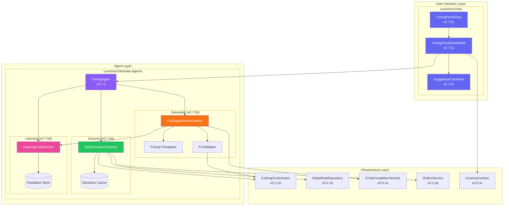
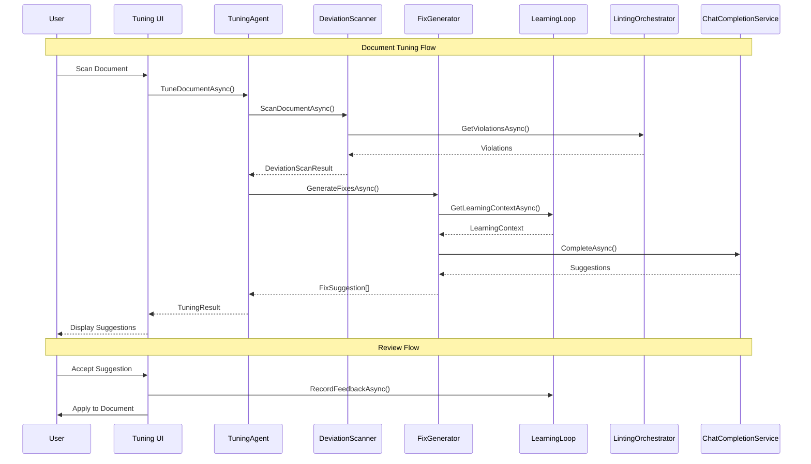

# LCS-DES-075: Design Specification Index — The Tuning Agent

## Document Control

| Field | Value |
| :--- | :--- |
| **Document ID** | LCS-DES-075-INDEX |
| **Feature ID** | AGT-075 |
| **Feature Name** | The Tuning Agent (Proactive Style Harmony) |
| **Target Version** | v0.7.5 |
| **Module Scope** | Lexichord.Modules.Agents, Lexichord.Host |
| **Swimlane** | Ensemble (Agents) |
| **License Tier** | Writer Pro (Core), Teams (Learning Loop) |
| **Feature Gate Key** | `FeatureFlags.Agents.TuningAgent` |
| **Status** | Complete |
| **Last Updated** | 2026-02-15 |

---

## 1. Executive Summary

**v0.7.5** delivers the **Tuning Agent** — a proactive style harmony system that represents the convergence of Lexichord's deterministic style enforcement (v0.2.x) with AI-powered intelligent assistance (v0.6.x-v0.7.x).

### 1.1 The Problem

Writers using Lexichord's style linting face several challenges:

- **Manual Correction Burden:** Linting identifies violations but users must manually research and apply fixes
- **Inconsistent Fixes:** Different team members may fix the same violation differently
- **Context Loss:** Simple find/replace suggestions don't understand surrounding context
- **No Learning:** The system doesn't improve based on past user decisions
- **Review Fatigue:** Many violations to review without prioritization or batch handling

### 1.2 The Solution

The Tuning Agent implements a four-part solution:

1. **Style Deviation Scanner (v0.7.5a):** Bridges linting infrastructure with AI, providing enriched violation context
2. **Automatic Fix Suggestions (v0.7.5b):** LLM-powered rewrites that understand context and preserve meaning
3. **Accept/Reject UI (v0.7.5c):** Streamlined review interface with keyboard shortcuts and bulk actions
4. **Learning Loop (v0.7.5d):** Feedback system that improves suggestions based on user decisions

### 1.3 Business Value

| Value | Description |
| :--- | :--- |
| **Proactive Quality** | Agent identifies issues before publication, not after |
| **Intelligent Fixes** | Context-aware suggestions that preserve author's voice |
| **Non-Destructive** | User maintains full control over all document changes |
| **Continuous Improvement** | System learns from user preferences over time |
| **Time Savings** | 60-80% reduction in manual style correction effort |
| **Consistency** | Organization-wide adherence to Lexicon rules |

---

## 2. Related Documents

### 2.1 Scope Breakdown Document

The detailed scope breakdown for v0.7.5, including all sub-parts, implementation checklists, user stories, and acceptance criteria:

| Document | Description |
| :--- | :--- |
| **[LCS-SBD-075](./LCS-SBD-075.md)** | Scope Breakdown — The Tuning Agent |

### 2.2 Sub-Part Design Specifications

Each sub-part has its own detailed design specification following the LDS-01 template:

| Sub-Part | Document | Title | Description |
| :--- | :--- | :--- | :--- |
| v0.7.5a | **[LCS-DES-075a](./LCS-DES-075a.md)** | Style Deviation Scanner | Bridges linting with AI fix generation |
| v0.7.5b | **[LCS-DES-075b](./LCS-DES-075b.md)** | Automatic Fix Suggestions | LLM-powered contextual rewrites |
| v0.7.5c | **[LCS-DES-075c](./LCS-DES-075c.md)** | Accept/Reject UI | Review interface with diff preview |
| v0.7.5d | **[LCS-DES-075d](./LCS-DES-075d.md)** | Learning Loop | Feedback system for continuous improvement |

---

## 3. Architecture Overview

### 3.1 Component Diagram

### 3.2 Data Flow Overview

---

## 4. Dependencies

### 4.1 Upstream Dependencies (Required Services)

| Interface | Source Version | Purpose |
| :--- | :--- | :--- |
| `IAgent` | v0.6.6a | Base agent interface |
| `BaseAgent` | v0.7.3b | Base agent implementation |
| `IAgentRegistry` | v0.7.1b | Agent registration and discovery |
| `IContextOrchestrator` | v0.7.2c | Context assembly for prompts |
| `IChatCompletionService` | v0.6.1a | LLM communication |
| `IPromptRenderer` | v0.6.3b | Template rendering |
| `IPromptTemplateRepository` | v0.6.3c | Template storage |
| `ILintingOrchestrator` | v0.2.3a | Style violation detection |
| `IStyleRuleRepository` | v0.2.1b | Style rule access |
| `IEditorService` | v0.1.3a | Document access |
| `IUndoRedoService` | v0.1.5a | Undo/redo support |
| `ILicenseContext` | v0.0.4c | License checking |
| `IMediator` | v0.0.7a | Event publishing |
| `ISettingsService` | v0.1.6a | User preferences |

### 4.2 NuGet Packages

| Package | Version | Purpose |
| :--- | :--- | :--- |
| `DiffPlex` | 1.7.x | Text diff generation (NEW) |
| `Microsoft.Data.Sqlite` | 9.0.0 | Learning data storage (adapted from spec's SQLite-net) |
| `MediatR` | 12.x | Event publishing |
| `CommunityToolkit.Mvvm` | 8.x | ViewModel generation |
| `Microsoft.Extensions.Caching.Memory` | 8.x | Deviation caching |

### 4.3 New Interfaces (defined in v0.7.5)

| Interface | Defined In | Purpose |
| :--- | :--- | :--- |
| `IStyleDeviationScanner` | v0.7.5a | Deviation detection with context |
| `IFixSuggestionGenerator` | v0.7.5b | AI fix generation |
| `ILearningLoopService` | v0.7.5d | Feedback and learning |

### 4.4 Downstream Consumers (Future)

| Version | Feature | Uses From v0.7.5 |
| :--- | :--- | :--- |
| v0.7.6 | Summarizer Agent | Pattern recognition from Learning Loop |
| v0.7.7 | Agent Workflows | Tuning Agent as workflow step |
| v0.7.8 | The Hardening | Test suites for fix accuracy |
| v0.8.x | Enterprise | Custom learning models |

---

## 5. License Gating Strategy

### 5.1 Feature Access by Tier

| Feature | Core | Writer Pro | Teams | Enterprise |
| :--- | :--- | :--- | :--- | :--- |
| Style Deviation Scanner | - | Yes | Yes | Yes |
| Automatic Fix Suggestions | - | Yes | Yes | Yes |
| Accept/Reject UI | - | Yes | Yes | Yes |
| Keyboard Shortcuts | - | Yes | Yes | Yes |
| Accept All High Confidence | - | Yes | Yes | Yes |
| Learning Loop | - | - | Yes | Yes |
| Learning Data Export/Import | - | - | Yes | Yes |
| Batch Tuning Mode | - | - | Yes | Yes |
| Custom Learning Models | - | - | - | Yes |

### 5.2 Licensing Behavior

- **Load Behavior:** Soft Gate
  - Module loads for all tiers
  - Core tier: Shows locked state with upgrade prompt
  - Writer Pro: Full access except Learning Loop
  - Teams+: Full access including Learning Loop

- **Fallback Experience:**
  - Core users see "Upgrade to Writer Pro" when clicking Tuning Agent
  - Writer Pro users see "Upgrade to Teams" when accessing Learning Loop features
  - Feature remains visible but disabled with tooltip explanation

---

## 6. Sub-Part Summary

### 6.1 v0.7.5a: Style Deviation Scanner

**Purpose:** Bridge between linting infrastructure and AI fix generation.

**Key Components:**
- `IStyleDeviationScanner` interface
- `StyleDeviationScanner` implementation
- `StyleDeviation` record with enriched context
- `DeviationScanResult` aggregation
- Intelligent caching with invalidation

**Key Behavior:**
- Subscribes to linting events for real-time updates
- Enriches violations with surrounding context
- Determines auto-fixability based on rule characteristics
- Caches results with content-hash-based invalidation

### 6.2 v0.7.5b: Automatic Fix Suggestions

**Purpose:** Generate contextually appropriate rewrites using LLM.

**Key Components:**
- `IFixSuggestionGenerator` interface
- `FixSuggestionGenerator` implementation
- `FixSuggestion` record with diff and metadata
- Specialized prompt templates per category
- Fix validation against linter

**Key Behavior:**
- Generates fixes that preserve meaning
- Validates fixes don't introduce new violations
- Provides confidence and quality scores
- Supports batch generation for efficiency

### 6.3 v0.7.5c: Accept/Reject UI

**Purpose:** Streamlined review interface for fix suggestions.

**Key Components:**
- `TuningPanelView.axaml` main panel
- `TuningPanelViewModel` with commands
- `SuggestionCardView.axaml` individual cards
- Diff preview with syntax highlighting

**Key Behavior:**
- Single-click accept/reject/modify/skip
- Keyboard navigation (j/k/a/r)
- Accept All High Confidence bulk action
- Undo integration for reverting changes

### 6.4 v0.7.5d: Learning Loop

**Purpose:** Capture user decisions to improve future suggestions.

**Key Components:**
- `ILearningLoopService` interface
- `LearningLoopService` implementation
- `FixFeedback` record for decisions
- `LearningContext` for prompt enhancement
- SQLite-based storage with privacy controls

**Key Behavior:**
- Records accept/reject/modify decisions
- Analyzes patterns for prompt enhancement
- Provides statistics dashboard
- Supports export/import for team sharing

---

## 7. Key Test Scenarios Summary

### 7.1 Scanner (v0.7.5a)

| Scenario | Expected Outcome |
| :--- | :--- |
| Scan document with violations | Returns StyleDeviations with context |
| Scan clean document | Returns empty result |
| Scan cached document | Returns cached result (IsCached = true) |
| Invalidate cache | Subsequent scan is fresh |

### 7.2 Generator (v0.7.5b)

| Scenario | Expected Outcome |
| :--- | :--- |
| Generate fix for simple violation | Returns valid FixSuggestion |
| Validate fix resolves violation | ValidationStatus.Valid |
| Validate fix introduces violation | ValidationStatus.Invalid |
| Batch generate fixes | All suggestions returned |

### 7.3 UI (v0.7.5c)

| Scenario | Expected Outcome |
| :--- | :--- |
| Accept suggestion | Document updated, feedback recorded |
| Reject suggestion | Document unchanged, feedback recorded |
| Modify suggestion | Edit dialog shown, modified text applied |
| Accept All High Confidence | Only high-confidence fixes applied |
| Undo accepted fix | Document reverted |

### 7.4 Learning (v0.7.5d)

| Scenario | Expected Outcome |
| :--- | :--- |
| Record accepted feedback | Pattern added to accepted list |
| Record rejected feedback | Pattern added to rejected list |
| Get learning context | PromptEnhancement populated when data sufficient |
| Export learning data | Valid export file generated |

---

## 8. Implementation Checklist Summary

| Sub-Part | Tasks | Est. Hours |
| :--- | :--- | :--- |
| v0.7.5a | Scanner implementation | 10.5 |
| v0.7.5b | Fix generator implementation | 16 |
| v0.7.5c | Accept/Reject UI | 16 |
| v0.7.5d | Learning Loop | 14 |
| Integration | Tests, DI, licensing | 7.5 |
| **Total** | | **64 hours** |

See [LCS-SBD-075](./LCS-SBD-075.md) Section 4 for the detailed task breakdown.

---

## 9. Success Criteria Summary

| Category | Criterion | Target |
| :--- | :--- | :--- |
| **Detection** | Deviation detection rate | 95%+ |
| **Suggestion** | Fix acceptance rate (initial) | 70%+ |
| **Suggestion** | Fix validation success rate | 95%+ |
| **Performance** | Scan time (10k words) | < 500ms |
| **Performance** | Single fix generation | < 2s |
| **Performance** | Batch fixes (10) | < 10s |
| **Learning** | Acceptance improvement | 10%+ month-over-month |
| **Satisfaction** | User satisfaction score | 4.0/5.0+ |

See [LCS-SBD-075](./LCS-SBD-075.md) Section 9 for full success metrics.

---

## 10. Risk Summary

| Risk | Impact | Probability | Mitigation |
| :--- | :--- | :--- | :--- |
| LLM suggestions don't resolve violations | High | Medium | Validate all fixes against linter |
| LLM suggestions change meaning | High | Medium | Semantic similarity scoring |
| Performance impact from LLM calls | Medium | Medium | Batch processing, caching |
| Learning data privacy concerns | High | Low | Anonymization by default |
| Users reject most suggestions | Medium | Medium | Learning loop improves over time |

See [LCS-SBD-075](./LCS-SBD-075.md) Section 8 for detailed risk analysis.

---

## 11. What This Enables

| Version | Feature | Uses From v0.7.5 |
| :--- | :--- | :--- |
| v0.7.6 | Summarizer Agent | Pattern recognition techniques |
| v0.7.7 | Agent Workflows | Tuning Agent as chainable step |
| v0.7.8 | The Hardening | Fix accuracy test suites |
| v0.8.x | Enterprise | Custom learning models per org |
| Future | Autonomous Mode | Auto-apply high-confidence fixes |

---

## Document History

| Version | Date | Author | Changes |
| :--- | :--- | :--- | :--- |
| 1.0 | 2026-01-27 | Lead Architect | Initial draft |
| 1.1 | 2026-02-15 | Implementation | All four sub-parts (v0.7.5a-d) complete |
