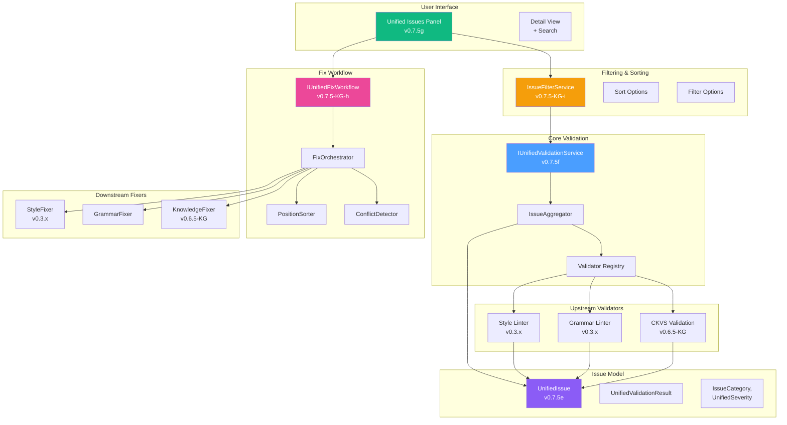
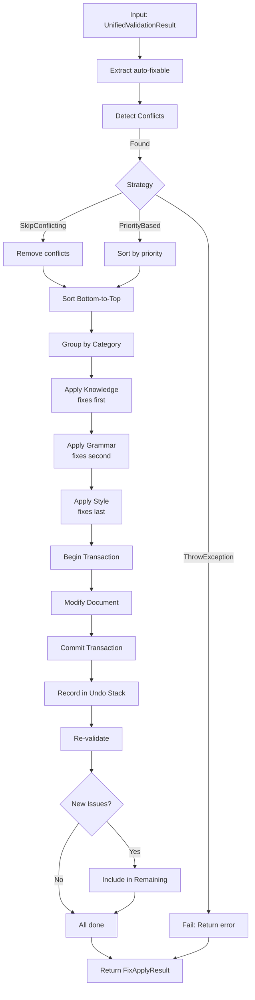

# LCS-DES-075-KG-INDEX: Design Specification Index — Unified Validation

## Document Control

| Field                | Value                                    |
| :------------------- | :--------------------------------------- |
| **Document ID**      | LCS-DES-075-KG-INDEX                     |
| **Feature ID**       | KG-075                                   |
| **Feature Name**     | Unified Validation (CKVS Phase 4b)       |
| **Target Version**   | v0.7.5-KG                                |
| **Module Scope**     | Lexichord.Modules.Agents, Lexichord.Modules.KG |
| **Swimlane**         | Ensemble                                 |
| **License Tier**     | Writer Pro, Teams                        |
| **Feature Gate Key** | `FeatureFlags.UnifiedValidation`         |
| **Status**           | Draft                                    |
| **Last Updated**     | 2026-01-31                               |
| **Parent Document**  | [LCS-SBD-075-KG](./LCS-SBD-075-KG.md)   |

---

## 1. Executive Summary

### 1.1 Vision

**v0.7.5-KG** delivers **Unified Validation** — a cohesive validation and fix workflow that merges style linting (v0.3.x), grammar checking, and CKVS knowledge validation into a single, unified user experience.

Instead of three separate panels showing different issue types with incompatible severity levels and manual fix processes, users see one unified **Issues Panel** with:

- **Combined issue findings** from all validators
- **Unified severity mapping** (Error/Warning/Info/Hint)
- **Single-click "Fix All"** workflow addressing all issue types
- **Advanced filtering** by type, severity, location, and message
- **Intelligent fix orchestration** preventing conflicts and cascading issues

### 1.2 Business Value

| Value | Impact |
| :--- | :--- |
| **Simplified UX** | One panel, one severity model, one fix workflow |
| **Faster Review** | Users no longer context-switch between panels |
| **Higher Adoption** | More users fix more issues |
| **Quality Improvement** | Unified error gates improve content consistency |
| **Reduced Cognitive Load** | Clearer prioritization of what matters |

### 1.3 Success Criteria

1. All validators report findings in unified Issues panel
2. Severity consistent across Style/Grammar/Knowledge validators
3. "Fix All" command safely applies auto-fixable issues
4. Issue filtering available by type, severity, location, text
5. Fix conflicts detected and handled appropriately
6. Total validation time <1 second
7. Performance scales to 1000+ issues

---

## 2. Scope Overview

### 2.1 Sub-Parts Summary

This feature is delivered across 5 design specifications, 21 hours of development:

| Sub-Part | Document | Title | Hours | Status |
|:---------|:---------|:------|:------|:-------|
| **v0.7.5e** | [LCS-DES-075e](./LCS-DES-075e.md) | Unified Issue Model | 3 | [Link] |
| **v0.7.5f** | [LCS-DES-075f](./LCS-DES-075f.md) | Issue Aggregator | 4 | [Link] |
| **v0.7.5g** | [LCS-DES-075g](./LCS-DES-075g.md) | Unified Issues Panel | 6 | [Link] |
| **v0.7.5h** | [LCS-DES-075-KG-h](./LCS-DES-075-KG-h.md) | Combined Fix Workflow | 5 | [Link] |
| **v0.7.5i** | [LCS-DES-075-KG-i](./LCS-DES-075-KG-i.md) | Issue Filters | 3 | [Link] |

### 2.2 Parts Covered in This Index

**This document** provides:

- Architecture overview connecting all 5 sub-parts
- Key interface summary across all components
- Severity mapping table and logic
- Fix workflow diagram and orchestration
- Performance targets for the complete system
- License gating model
- Related documents and dependencies

---

## 3. Architecture Overview

### 3.1 Complete System Diagram



### 3.2 Data Flow: Validation Pipeline

```
User: Request Validation
    ↓
IUnifiedValidationService.ValidateAsync(document)
    ↓
Validate with all registered validators:
    ├─ ILinterService (Style violations)
    ├─ IGrammarService (Grammar violations)
    └─ IValidationEngine (Knowledge violations)
    ↓
Aggregate results via IssueAggregator
    ├─ Map to UnifiedIssue
    ├─ Normalize severity
    └─ Group by location
    ↓
Return UnifiedValidationResult
    ├─ All issues unified
    ├─ Issues by category
    └─ Issues by severity
    ↓
Display in Unified Issues Panel
    ├─ Filter issues (IIssueFilterService)
    ├─ Sort issues
    └─ Show counts by severity
```

### 3.3 Data Flow: Fix Application Pipeline

```
User: Click "Fix All"
    ↓
IUnifiedFixWorkflow.FixAllAsync(document, validation)
    ↓
Extract auto-fixable issues from validation result
    ↓
Detect conflicts:
    ├─ Overlapping positions
    ├─ Contradictory suggestions
    └─ Cascading dependencies
    ↓
Handle conflicts per ConflictHandlingStrategy
    ├─ ThrowException (fail-fast)
    ├─ SkipConflicting (apply rest)
    └─ PriorityBased (override by priority)
    ↓
Sort fixes bottom-to-top by position
    (prevents offset drift during application)
    ↓
Group by category:
    ├─ Knowledge fixes (apply first, complex validators)
    ├─ Grammar fixes (apply second, text structure)
    └─ Style fixes (apply last, simplest fixes)
    ↓
Apply fixes atomically:
    ├─ Begin transaction
    ├─ Apply each fix in order
    └─ Commit transaction
    ↓
Re-validate document:
    ├─ Check for new issues created by fixes
    ├─ Check for issues resolved
    └─ Repeat if new issues found (max 3 iterations)
    ↓
Return FixApplyResult:
    ├─ AppliedCount (fixes applied)
    ├─ ResolvedIssues (what was fixed)
    ├─ RemainingIssues (new issues found)
    └─ TransactionId (for undo)
```

---

## 4. Key Interfaces Summary

### 4.1 Unified Issue Model (v0.7.5e)

```csharp
public record UnifiedIssue
{
    public Guid Id { get; init; }
    public IssueCategory Category { get; init; }      // Style, Grammar, Knowledge, etc.
    public string ValidatorName { get; init; }        // "StyleLinter", "AxiomValidator"
    public string Code { get; init; }                 // "STYLE_001", "AXIOM_VIOLATION"
    public UnifiedSeverity Severity { get; init; }    // Error, Warning, Info, Hint
    public string Message { get; init; }
    public TextSpan? Location { get; init; }
    public UnifiedFix? Fix { get; init; }
    public object? Context { get; init; }
}

public enum IssueCategory { Style, Grammar, Knowledge, Structure, Custom }
public enum UnifiedSeverity { Error, Warning, Info, Hint }
```

### 4.2 Aggregation Service (v0.7.5f)

```csharp
public interface IUnifiedValidationService
{
    Task<UnifiedValidationResult> ValidateAsync(
        Document document,
        UnifiedValidationOptions options,
        CancellationToken ct = default);

    Task<FixResult> FixAllAsync(
        Document document,
        UnifiedValidationResult validation,
        CancellationToken ct = default);
}

public record UnifiedValidationResult
{
    public IReadOnlyList<UnifiedIssue> Issues { get; init; }
    public TimeSpan Duration { get; init; }
    public IReadOnlyDictionary<IssueCategory, IReadOnlyList<UnifiedIssue>> ByCategory { get; }
    public IReadOnlyDictionary<UnifiedSeverity, int> CountBySeverity { get; }
    public bool CanPublish => !Issues.Any(i => i.Severity == UnifiedSeverity.Error);
    public int AutoFixableCount { get; }
}
```

### 4.3 Fix Workflow (v0.7.5-KG-h)

```csharp
public interface IUnifiedFixWorkflow
{
    Task<FixApplyResult> FixAllAsync(
        Document document,
        UnifiedValidationResult validation,
        FixWorkflowOptions options,
        CancellationToken ct = default);

    Task<FixApplyResult> FixByCategoryAsync(
        Document document,
        UnifiedValidationResult validation,
        IEnumerable<IssueCategory> categories,
        CancellationToken ct = default);

    IReadOnlyList<FixConflictCase> DetectConflicts(
        IReadOnlyList<UnifiedIssue> issues);

    Task<bool> UndoLastFixesAsync(CancellationToken ct = default);
}

public record FixApplyResult
{
    public bool Success { get; init; }
    public int AppliedCount { get; init; }
    public int FailedCount { get; init; }
    public Document? ModifiedDocument { get; init; }
    public IReadOnlyList<UnifiedIssue> ResolvedIssues { get; init; }
    public IReadOnlyList<UnifiedIssue> RemainingIssues { get; init; }
    public IReadOnlyList<FixConflictCase> DetectedConflicts { get; init; }
    public TimeSpan Duration { get; init; }
}
```

### 4.4 Filtering Service (v0.7.5-KG-i)

```csharp
public interface IIssueFilterService
{
    Task<IReadOnlyList<UnifiedIssue>> FilterAsync(
        IReadOnlyList<UnifiedIssue> issues,
        FilterOptions options,
        CancellationToken ct = default);

    Task<IReadOnlyList<UnifiedIssue>> SearchAsync(
        IReadOnlyList<UnifiedIssue> issues,
        string query,
        FilterOptions? options = null,
        CancellationToken ct = default);

    Task<IReadOnlyList<UnifiedIssue>> FilterByCategoryAsync(
        IReadOnlyList<UnifiedIssue> issues,
        IEnumerable<IssueCategory> categories,
        CancellationToken ct = default);

    Task<IReadOnlyList<UnifiedIssue>> FilterBySeverityAsync(
        IReadOnlyList<UnifiedIssue> issues,
        UnifiedSeverity minimumSeverity,
        CancellationToken ct = default);

    IReadOnlyDictionary<UnifiedSeverity, int> CountBySeverity(
        IReadOnlyList<UnifiedIssue> issues);

    void SavePreset(string name, FilterOptions options);
    FilterOptions? LoadPreset(string name);
    IReadOnlyList<string> ListPresets();
}

public record FilterOptions
{
    public IReadOnlyList<IssueCategory> Categories { get; init; }
    public UnifiedSeverity MinimumSeverity { get; init; }
    public string? SearchText { get; init; }
    public TextSpan? LocationSpan { get; init; }
    public (int StartLine, int EndLine)? LineRange { get; init; }
    public bool OnlyAutoFixable { get; init; }
    public IReadOnlyList<SortCriteria> SortBy { get; init; }
}
```

---

## 5. Severity Mapping Table

The unified validation system maps disparate severity models into a consistent 4-level hierarchy:

### 5.1 Mapping Matrix

| Source Validator | Original Model | Maps To | Reasoning |
|:---|:---|:---|:---|
| **Style Linter (v0.3.x)** | error | Error | Blocks publication |
| **Style Linter** | warning | Warning | Should fix |
| **Style Linter** | info | Info | Optional improvement |
| **Grammar Linter (v0.3.x)** | error | Error | Blocks publication |
| **Grammar Linter** | warning | Warning | Should fix |
| **Grammar Linter** | suggestion | Info | Optional improvement |
| **CKVS Validation (v0.6.5-KG)** | ValidationSeverity.Error | Error | Blocks publication |
| **CKVS Validation** | ValidationSeverity.Warning | Warning | Should fix |
| **CKVS Validation** | ValidationSeverity.Info | Info | Optional improvement |
| **CKVS Validation** | ValidationSeverity.Hint | Hint | Nice to have |

### 5.2 Severity Semantics

| Level | Symbol | Color | Meaning | Action |
|:---|:---|:---|:---|:---|
| **Error** | ⛔ | Red | Blocks publication or causes failure | **Must fix before publishing** |
| **Warning** | ⚠️ | Yellow | Indicates a problem that should be fixed | Should fix before review |
| **Info** | ℹ️ | Blue | Suggests improvement or clarification | Consider fixing |
| **Hint** | 💡 | Green | Offers optional enhancement | Can ignore |

### 5.3 Publication Logic

```csharp
// Document can be published only if:
public bool CanPublish => !Issues.Any(i => i.Severity == UnifiedSeverity.Error);

// Summary for user:
var errorCount = issues.Count(i => i.Severity == UnifiedSeverity.Error);
var warningCount = issues.Count(i => i.Severity == UnifiedSeverity.Warning);

if (errorCount > 0)
    return "Cannot publish: {errorCount} error(s) must be fixed";
else if (warningCount > 0)
    return "Ready to publish. Warning: {warningCount} warning(s) detected";
else
    return "Ready to publish";
```

---

## 6. Fix Workflow Architecture

### 6.1 Orchestration Diagram



### 6.2 Position-Based Sorting Example

**Problem:** Without careful ordering, fixing earlier positions shifts later positions.

```
Original: "The quick brown fox jumps over lazy dog"
           012345678901234567890123456789...

Fix 1: Replace "quick" (4-9) with "speedy"
Fix 2: Replace "lazy" (35-39) with "sleepy"

WRONG ORDER (top-to-bottom):
- Apply Fix 1: "The speedy brown fox jumps over lazy dog"
               (Now Fix 2 position is wrong: was 35-39, now 36-40)
- Apply Fix 2: "The speedy brown fox jumps over sleepy dog" ✓ Luck!

CORRECT ORDER (bottom-to-top):
- Apply Fix 2: "The quick brown fox jumps over sleepy dog"
               (Fix 1 position unchanged: still 4-9)
- Apply Fix 1: "The speedy brown fox jumps over sleepy dog" ✓ Correct!
```

**Solution:** Sort all fixes by position descending (highest position first).

### 6.3 Category Application Order

```
Knowledge Fixes     ← Apply FIRST
                      (Most complex, may restructure content)
        ↓
Grammar Fixes       ← Apply SECOND
                      (Medium complexity, may change text flow)
        ↓
Style Fixes         ← Apply LAST
                      (Simplest, text replacements only)
```

**Rationale:**
1. Knowledge fixes may restructure sections or reorganize content
2. Grammar fixes that follow may depend on new structure
3. Style fixes are local and don't affect structure
4. Dependencies flow Knowledge → Grammar → Style

### 6.4 Conflict Detection

| Conflict Type | Detection | Resolution |
|:---|:---|:---|
| **Overlapping Positions** | Two fixes target same or overlapping spans | Skip both or apply higher priority |
| **Contradictory Suggestions** | Different fixes suggest different text for same location | Skip, or choose by priority |
| **Dependent Fixes** | One fix's success depends on another | Apply in dependency order |
| **Creates New Issue** | Fix would create new validation error | Warn user, let them decide |

---

## 7. Performance Targets

### 7.1 Timing Budgets

| Operation | Target | Measurement | Acceptable Range |
|:---|:---|:---|:---|
| **Validation** | <1s | P95 on 500-issue document | 800ms - 1200ms |
| **Issue Aggregation** | <50ms | P95 combining 3 validators | 30ms - 70ms |
| **Fix Detection** | <100ms | P95 analyzing 100 auto-fixable | 75ms - 150ms |
| **Fix Application** | <200ms | P95 applying 50 fixes | 150ms - 300ms |
| **Re-validation** | <500ms | P95 validating post-fix | 400ms - 600ms |
| **Filter+Sort** | <50ms | P95 filtering 1000 issues | 30ms - 70ms |
| **UI Render** | <100ms | P95 rendering issues panel | 75ms - 150ms |
| **Total Fix Workflow** | <500ms | P95 "Fix All" on 50 issues | 400ms - 600ms |

### 7.2 Scaling Characteristics

| Metric | 10 Issues | 100 Issues | 1000 Issues |
|:---|:---|:---|:---|
| **Validation** | 50ms | 200ms | 900ms |
| **Fix Application** | 20ms | 50ms | 200ms |
| **Filtering** | 5ms | 20ms | 45ms |
| **Sorting** | 3ms | 15ms | 40ms |

### 7.3 Optimization Strategies

- **Batching:** Group fixes by category for bulk processing
- **Caching:** Pre-compute category/severity groupings
- **Early Exit:** Stop validation after N errors found (configurable)
- **Parallel Validators:** Run Style + Grammar in parallel (Knowledge sequential)
- **Incremental Re-validation:** Only re-validate affected regions post-fix

---

## 8. License Gating

### 8.1 Feature Availability by Tier

| Feature | Core | WriterPro | Teams | Enterprise |
|:---|:---:|:---:|:---:|:---:|
| **View Style Issues** | ✓ | ✓ | ✓ | ✓ |
| **Style Auto-Fix** | ✗ | ✓ | ✓ | ✓ |
| **Grammar Issues** | ✗ | ✓ | ✓ | ✓ |
| **Grammar Auto-Fix** | ✗ | ✓ | ✓ | ✓ |
| **Knowledge Validation** | ✗ | ✗ | ✓ | ✓ |
| **Fix All** | ✗ | ✓ | ✓ | ✓ |
| **Advanced Filtering** | ✗ | ✓ | ✓ | ✓ |
| **Filter Presets** | ✗ | ✗ | ✓ | ✓ |
| **Custom Validators** | ✗ | ✗ | ✗ | ✓ |

### 8.2 License Gate Keys

```csharp
public static class UnifiedValidationGates
{
    public const string ViewIssues = "FeatureFlags.UnifiedValidation.ViewIssues";
    public const string AutoFixStyle = "FeatureFlags.UnifiedValidation.AutoFixStyle";
    public const string GrammarValidation = "FeatureFlags.UnifiedValidation.GrammarValidation";
    public const string KnowledgeValidation = "FeatureFlags.UnifiedValidation.KnowledgeValidation";
    public const string FixOrchestrator = "FeatureFlags.UnifiedValidation.FixOrchestrator";
    public const string AdvancedFiltering = "FeatureFlags.UnifiedValidation.AdvancedFiltering";
    public const string FilterPresets = "FeatureFlags.UnifiedValidation.FilterPresets";
}
```

### 8.3 Gate Checking Pattern

```csharp
public async Task<UnifiedValidationResult> ValidateAsync(Document doc)
{
    var results = new List<UnifiedIssue>();

    // Always available: Soft Gate
    if (_licenseContext.CanUse(UnifiedValidationGates.ViewIssues))
    {
        var styleIssues = await _styleLinter.LintAsync(doc);
        results.AddRange(MapToUnified(styleIssues, IssueCategory.Style));
    }

    // WriterPro+: Soft Gate
    if (_licenseContext.CanUse(UnifiedValidationGates.GrammarValidation))
    {
        var grammarIssues = await _grammarChecker.CheckAsync(doc);
        results.AddRange(MapToUnified(grammarIssues, IssueCategory.Grammar));
    }

    // Teams+: Hard Gate
    if (!_licenseContext.CanUse(UnifiedValidationGates.KnowledgeValidation))
        throw new LicenseRequiredException("Knowledge validation requires Teams license");

    var knowledgeIssues = await _validationEngine.ValidateAsync(doc);
    results.AddRange(MapToUnified(knowledgeIssues, IssueCategory.Knowledge));

    return new UnifiedValidationResult { Issues = results };
}
```

---

## 9. Dependencies & Related Systems

### 9.1 Upstream Dependencies

| Component | Source | Purpose | Status |
|:---|:---|:---|:---|
| `ILinterService` | v0.3.x | Style violation detection | ✓ Stable |
| `IGrammarService` | v0.3.x | Grammar checking | ✓ Stable |
| `IValidationEngine` | v0.6.5-KG | Knowledge validation | ⚠️ New |
| `IEditorService` | v0.1.3a | Document modification | ✓ Stable |
| `ILicenseContext` | v0.0.9b | License checking | ✓ Stable |

### 9.2 Downstream Dependents

| Component | Target | Purpose |
|:---|:---|:---|
| v0.7.6 — Sync Service | Unified validation | Feed issues into sync decisions |
| v0.7.7 — Validation Workflows | Unified validation | Build automated validation pipelines |
| Publication Gates | Unified validation | Block on error count before publish |
| Quality Metrics | Unified validation | Track issue trends over time |

### 9.3 Related Documents

| Document | Purpose |
|:---|:---|
| [LCS-SBD-075-KG](./LCS-SBD-075-KG.md) | Scope breakdown and acceptance criteria |
| [LCS-DES-075-KG-h](./LCS-DES-075-KG-h.md) | Combined Fix Workflow specification |
| [LCS-DES-075-KG-i](./LCS-DES-075-KG-i.md) | Issue Filters specification |
| [LCS-SBD-075](./LCS-SBD-075.md) | Tuning Agent scope (v0.7.5a-d) |

---

## 10. API Reference Summary

### 10.1 Main Entry Points

```csharp
// Validate document with all validators
var validation = await unifiedValidationService.ValidateAsync(document);

// Filter and display issues
var filtered = await filterService.FilterAsync(validation.Issues, filterOptions);

// Apply auto-fixes
var fixResult = await fixWorkflow.FixAllAsync(document, validation, fixOptions);

// Undo if needed
await fixWorkflow.UndoLastFixesAsync();
```

### 10.2 UI Integration Pattern

```csharp
public class UnifiedIssuesPanelViewModel : INotifyPropertyChanged
{
    private readonly IUnifiedValidationService _validationService;
    private readonly IIssueFilterService _filterService;
    private readonly IUnifiedFixWorkflow _fixWorkflow;

    public async Task RefreshAsync()
    {
        var validation = await _validationService.ValidateAsync(_document);
        AllIssues = validation.Issues;
        FilteredIssues = await _filterService.FilterAsync(AllIssues, CurrentFilter);
        UpdateSummary(validation);
    }

    public async Task FixAllAsync()
    {
        var result = await _fixWorkflow.FixAllAsync(_document, _validation);
        if (result.Success)
            await RefreshAsync();
    }

    public async Task UndoAsync()
    {
        await _fixWorkflow.UndoLastFixesAsync();
        await RefreshAsync();
    }
}
```

---

## 11. Implementation Roadmap

### 11.1 Phase 1: Data Model (v0.7.5e) — Week 1
- Define `UnifiedIssue`, `UnifiedValidationResult`, severity enums
- Create mapping functions from legacy models
- Unit tests for all data types

### 11.2 Phase 2: Aggregation (v0.7.5f) — Weeks 1-2
- Implement `IUnifiedValidationService`
- Build validator registry and composition
- Create severity mapping engine
- Integration tests with real validators

### 11.3 Phase 3: UI Panel (v0.7.5g) — Weeks 2-3
- Design Unified Issues Panel view
- Implement grouping and collapsing
- Add summary statistics
- E2E testing with real documents

### 11.4 Phase 4: Fix Workflow (v0.7.5-KG-h) — Week 3
- Implement `IUnifiedFixWorkflow` and orchestrator
- Build conflict detection
- Add position-based sorting
- Undo support with transaction stack

### 11.5 Phase 5: Filtering (v0.7.5-KG-i) — Week 4
- Implement `IIssueFilterService`
- Build filter strategies and composition
- Add search functionality
- Preset save/load

### 11.6 Phase 6: Polish & Testing — Week 4
- Performance testing and optimization
- License gate validation
- Documentation and training materials
- Bug fixes and edge case handling

---

## 12. Acceptance Criteria

### 12.1 Functional Acceptance

| # | Criterion | Verification |
|:---:|:---|:---|
| 1 | All validators' issues appear in unified panel | Integration test |
| 2 | Severity consistently mapped across validators | Unit test |
| 3 | "Fix All" applies auto-fixable issues safely | Integration test |
| 4 | Fix conflicts detected and reported | Unit test |
| 5 | Position-based sorting prevents offset drift | Integration test |
| 6 | Filter by category/severity/location works | Unit test |
| 7 | Text search finds issues by message/code | Unit test |
| 8 | Undo restores pre-fix document state | Integration test |
| 9 | Re-validation detects new post-fix issues | Integration test |
| 10 | License gates restrict features by tier | Unit test |

### 12.2 Performance Acceptance

| # | Criterion | Target | Measurement |
|:---:|:---|:---|:---|
| 1 | Validation completes within time budget | <1s | P95 on 500 issues |
| 2 | Fix All completes within time budget | <500ms | P95 on 50 issues |
| 3 | UI renders issues within time budget | <100ms | P95 render time |
| 4 | Filtering scales to 1000+ issues | <50ms | P95 filter time |
| 5 | No memory leaks during fix workflow | N/A | Memory profiling |

### 12.3 Quality Acceptance

| # | Criterion | Target |
|:---:|:---|:---|
| 1 | Unit test coverage | ≥95% |
| 2 | Integration test coverage | Key paths |
| 3 | Code review sign-off | 2 reviewers |
| 4 | Documentation completeness | 100% public APIs |
| 5 | No known critical bugs | Zero |

---

## 13. What This Enables

### 13.1 Immediate (v0.7.5)

- **Better user experience:** Single panel for all validation issues
- **Higher fix adoption:** More users fix more issues
- **Consistent severity model:** Clear understanding of issue importance
- **Intelligent fix orchestration:** Automated, safe fix application

### 13.2 v0.7.6 and Beyond

- **Sync service:** Unified issues feed into content sync decisions
- **Validation workflows:** Automated validation pipeline execution
- **Quality gates:** Block publication on error count
- **Analytics:** Track issue trends over time
- **Custom validators:** Extend with organization-specific rules

---

## 14. Related Documents

| Document | Purpose |
|:---|:---|
| [LCS-SBD-075-KG](./LCS-SBD-075-KG.md) | Full scope breakdown with user stories |
| [LCS-DES-075-KG-h](./LCS-DES-075-KG-h.md) | Combined Fix Workflow design |
| [LCS-DES-075-KG-i](./LCS-DES-075-KG-i.md) | Issue Filters design |
| [LCS-SBD-075](./LCS-SBD-075.md) | Tuning Agent scope (v0.7.5a-d) |
| [LCS-DES-075-INDEX](./LCS-DES-075-INDEX.md) | Tuning Agent index |

---

## Document History

| Version | Date       | Author         | Changes                      |
| :------ | :--------- | :------------- | :--------------------------- |
| 1.0     | 2026-01-31 | Lead Architect | Initial draft with all components |
