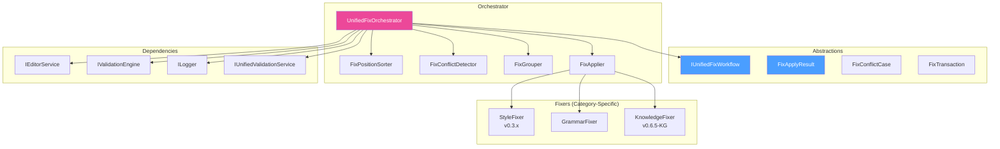
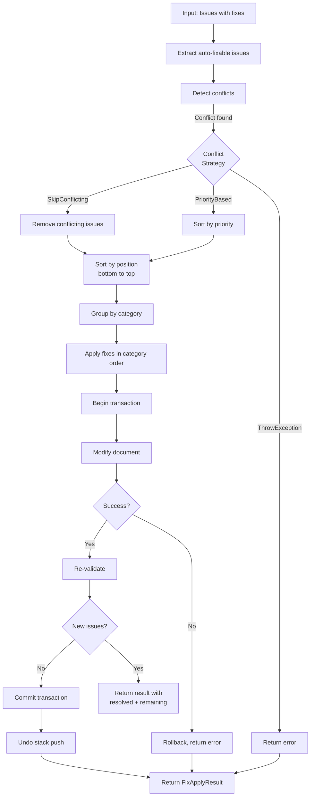

# LCS-DES-075-KG-h: Design Specification — Combined Fix Workflow

## 1. Document Control

| Field                | Value                                            |
| :------------------- | :----------------------------------------------- |
| **Document ID**      | LCS-DES-075-KG-h                                 |
| **Feature ID**       | KG-075h                                          |
| **Feature Name**     | Combined Fix Workflow                            |
| **Parent Feature**   | v0.7.5-KG — Unified Validation                   |
| **Module Scope**     | Lexichord.Modules.Agents, Lexichord.Modules.KG   |
| **Swimlane**         | Ensemble                                         |
| **License Tier**     | Writer Pro (fix coordination)                    |
| **Feature Gate Key** | `FeatureFlags.UnifiedValidation.FixOrchestrator` |
| **Status**           | Draft                                            |
| **Last Updated**     | 2026-01-31                                       |
| **Parent Document**  | [LCS-SBD-075-KG](./LCS-SBD-075-KG.md)           |
| **Est. Hours**       | 5 hours                                          |

---

## 2. Executive Summary

### 2.1 Problem Statement

The Unified Validation system aggregates issues from multiple sources (Style Linter, Grammar Linter, CKVS Validation Engine), but applying fixes across multiple validators presents challenges:

- **Position Tracking:** Multiple fixes at overlapping positions cause offset drift
- **Category Coordination:** Style fixes must be applied before Grammar checks (content changes)
- **Conflict Detection:** Fixes that contradict each other or create new violations
- **Atomic Operations:** All-or-nothing fix application with undo support
- **Cascading Validation:** Some fixes may create new issues that need re-validation

> **Goal:** Create a `IUnifiedFixWorkflow` that safely coordinates fixes across all validator types while preserving document integrity.

### 2.2 Solution Overview

Implement `UnifiedFixOrchestrator` that:

1. **Collects auto-fixable issues** from `UnifiedValidationResult`
2. **Sorts fixes bottom-to-top** to prevent offset drift
3. **Detects conflicts** between fixes (overlapping positions, contradictory suggestions)
4. **Groups by category** for appropriate validation order
5. **Applies atomically** with transaction support and undo stack
6. **Re-validates** after fixes to catch cascading issues
7. **Reports results** with before/after comparison

### 2.3 Key Deliverables

| Deliverable              | Description                                 |
| :----------------------- | :------------------------------------------ |
| `IUnifiedFixWorkflow`    | Interface in Lexichord.Abstractions         |
| `UnifiedFixOrchestrator` | Implementation in Modules.Agents/Services   |
| `FixConflictDetector`    | Identifies conflicting fixes                |
| `FixPositionSorter`      | Sorts fixes bottom-to-top                   |
| `FixApplyResult`         | Result record with fix metrics              |
| `FixTransaction`         | Transactional fix application               |
| Unit tests               | 95%+ coverage of orchestration logic        |

---

## 3. Architecture & Modular Strategy

### 3.1 Component Diagram



### 3.2 Module Location

```text
src/
├── Lexichord.Abstractions/
│   └── Contracts/
│       └── FixWorkflowModels.cs          ← Interfaces and records
│
└── Lexichord.Modules.Agents/
    └── Services/
        ├── FixOrchestration/
        │   ├── UnifiedFixOrchestrator.cs ← Main orchestrator
        │   ├── FixPositionSorter.cs      ← Position-based sorting
        │   ├── FixConflictDetector.cs    ← Conflict detection
        │   ├── FixGrouper.cs             ← Category grouping
        │   └── FixApplier.cs             ← Atomic application
```

---

## 4. Data Contract (The API)

### 4.1 IUnifiedFixWorkflow Interface

```csharp
namespace Lexichord.Abstractions.Contracts;

/// <summary>
/// Orchestrates the application of auto-fixable issues from unified validation.
/// Coordinates across multiple fix types (Style, Grammar, Knowledge) while
/// maintaining document integrity and preventing conflicts.
/// </summary>
/// <remarks>
/// <para>Fix workflow follows these principles:</para>
/// <para>1. Position-based sorting (bottom-to-top) prevents offset drift</para>
/// <para>2. Conflict detection identifies incompatible fixes</para>
/// <para>3. Atomic application ensures all-or-nothing semantics</para>
/// <para>4. Re-validation after fixes catches cascading issues</para>
/// <para>5. Transaction support enables undo operations</para>
/// </remarks>
/// <example>
/// <code>
/// var validation = _validationService.ValidateAsync(doc, options);
/// var result = await _fixWorkflow.FixAllAsync(doc, validation);
///
/// if (result.Success)
/// {
///     Console.WriteLine($"Applied {result.AppliedCount} fixes");
///     if (result.RemainingIssues.Count > 0)
///         Console.WriteLine($"Re-validation found {result.RemainingIssues.Count} new issues");
/// }
/// </code>
/// </example>
public interface IUnifiedFixWorkflow
{
    /// <summary>
    /// Attempts to apply all auto-fixable issues from validation result.
    /// </summary>
    /// <param name="document">Document to fix.</param>
    /// <param name="validation">Validation result with issues and fixes.</param>
    /// <param name="options">Fix workflow options (dry-run, conflict handling, etc.).</param>
    /// <param name="ct">Cancellation token.</param>
    /// <returns>Result indicating success, applied fixes, and any remaining issues.</returns>
    /// <remarks>
    /// Applies fixes in this order:
    /// 1. Detect conflicts between fixes
    /// 2. Sort fixes bottom-to-top by position
    /// 3. Group by category (Knowledge, Grammar, Style)
    /// 4. Apply in category order (Knowledge first, Style last)
    /// 5. Re-validate to detect cascading issues
    /// </remarks>
    Task<FixApplyResult> FixAllAsync(
        Document document,
        UnifiedValidationResult validation,
        FixWorkflowOptions options,
        CancellationToken ct = default);

    /// <summary>
    /// Applies a specific subset of fixes by category.
    /// </summary>
    /// <param name="document">Document to fix.</param>
    /// <param name="validation">Validation result with issues and fixes.</param>
    /// <param name="categories">Categories to fix (e.g., only Style and Grammar, not Knowledge).</param>
    /// <param name="ct">Cancellation token.</param>
    /// <returns>Result of selective fix application.</returns>
    Task<FixApplyResult> FixByCategoryAsync(
        Document document,
        UnifiedValidationResult validation,
        IEnumerable<IssueCategory> categories,
        CancellationToken ct = default);

    /// <summary>
    /// Applies a specific subset of fixes by severity level.
    /// </summary>
    /// <param name="document">Document to fix.</param>
    /// <param name="validation">Validation result with issues and fixes.</param>
    /// <param name="minSeverity">Minimum severity to fix (e.g., fix Errors and Warnings, not Info).</param>
    /// <param name="ct">Cancellation token.</param>
    /// <returns>Result of severity-based fix application.</returns>
    Task<FixApplyResult> FixBySeverityAsync(
        Document document,
        UnifiedValidationResult validation,
        UnifiedSeverity minSeverity,
        CancellationToken ct = default);

    /// <summary>
    /// Applies a specific subset of fixes by their IDs.
    /// </summary>
    /// <param name="document">Document to fix.</param>
    /// <param name="validation">Validation result with issues and fixes.</param>
    /// <param name="issueIds">Specific issue IDs to fix.</param>
    /// <param name="ct">Cancellation token.</param>
    /// <returns>Result of selective fix application.</returns>
    Task<FixApplyResult> FixByIdAsync(
        Document document,
        UnifiedValidationResult validation,
        IEnumerable<Guid> issueIds,
        CancellationToken ct = default);

    /// <summary>
    /// Detects conflicts between the fixes that would be applied.
    /// </summary>
    /// <param name="issues">Issues with fixes to analyze.</param>
    /// <returns>List of detected conflicts.</returns>
    /// <remarks>
    /// Conflict types include:
    /// - OverlappingFixes: Two fixes target overlapping text regions
    /// - ContradictoryFixes: Fixes suggest incompatible changes
    /// - DependentFixes: One fix's success depends on another's outcome
    /// </remarks>
    IReadOnlyList<FixConflictCase> DetectConflicts(
        IReadOnlyList<UnifiedIssue> issues);

    /// <summary>
    /// Dry-run: simulates fix application without modifying the document.
    /// </summary>
    /// <param name="document">Document to analyze.</param>
    /// <param name="validation">Validation result with issues and fixes.</param>
    /// <param name="ct">Cancellation token.</param>
    /// <returns>Result showing what would be fixed without actually fixing.</returns>
    Task<FixApplyResult> DryRunAsync(
        Document document,
        UnifiedValidationResult validation,
        CancellationToken ct = default);

    /// <summary>
    /// Undoes the last set of applied fixes.
    /// </summary>
    /// <param name="ct">Cancellation token.</param>
    /// <returns>Whether undo was successful.</returns>
    /// <remarks>
    /// Maintains a stack of fix transactions. Each call to FixAllAsync pushes
    /// a transaction onto the stack. Undo pops and reverses the most recent.
    /// </remarks>
    Task<bool> UndoLastFixesAsync(CancellationToken ct = default);

    /// <summary>
    /// Event raised when fixes are successfully applied.
    /// </summary>
    event EventHandler<FixesAppliedEventArgs>? FixesApplied;

    /// <summary>
    /// Event raised when conflict is detected during fix application.
    /// </summary>
    event EventHandler<FixConflictDetectedEventArgs>? ConflictDetected;
}
```

### 4.2 FixWorkflowOptions Record

```csharp
namespace Lexichord.Abstractions.Contracts;

/// <summary>
/// Options for controlling fix workflow behavior.
/// </summary>
public record FixWorkflowOptions
{
    /// <summary>
    /// If true, simulates fix application without modifying document.
    /// Default: false.
    /// </summary>
    public bool DryRun { get; init; }

    /// <summary>
    /// How to handle detected conflicts.
    /// Default: ThrowException.
    /// </summary>
    public ConflictHandlingStrategy ConflictStrategy { get; init; } = ConflictHandlingStrategy.ThrowException;

    /// <summary>
    /// If true, re-validates document after fixes applied.
    /// Default: true.
    /// </summary>
    public bool ReValidateAfterFixes { get; init; } = true;

    /// <summary>
    /// Maximum number of fix attempts (for re-validation cycles).
    /// Default: 3.
    /// </summary>
    public int MaxFixIterations { get; init; } = 3;

    /// <summary>
    /// If true, maintains undo stack for this operation.
    /// Default: true.
    /// </summary>
    public bool EnableUndo { get; init; } = true;

    /// <summary>
    /// Timeout for entire fix workflow.
    /// Default: 5 seconds.
    /// </summary>
    public TimeSpan Timeout { get; init; } = TimeSpan.FromSeconds(5);

    /// <summary>
    /// If true, logs detailed fix application trace.
    /// Default: false.
    /// </summary>
    public bool Verbose { get; init; }
}

/// <summary>
/// Strategy for handling conflicts between fixes.
/// </summary>
public enum ConflictHandlingStrategy
{
    /// <summary>
    /// Throw exception when conflicts detected (fail-fast).
    /// </summary>
    ThrowException,

    /// <summary>
    /// Skip conflicting fixes, apply rest.
    /// </summary>
    SkipConflicting,

    /// <summary>
    /// Ask user for resolution (requires interactive mode).
    /// </summary>
    PromptUser,

    /// <summary>
    /// Apply fixes in priority order, later fixes override earlier ones.
    /// </summary>
    PriorityBased
}
```

### 4.3 FixApplyResult Record

```csharp
namespace Lexichord.Abstractions.Contracts;

/// <summary>
/// Result of a fix workflow operation.
/// </summary>
public record FixApplyResult
{
    /// <summary>
    /// Whether all fixes were applied successfully.
    /// </summary>
    public required bool Success { get; init; }

    /// <summary>
    /// Number of fixes actually applied.
    /// </summary>
    public required int AppliedCount { get; init; }

    /// <summary>
    /// Number of fixes skipped due to conflicts or errors.
    /// </summary>
    public required int SkippedCount { get; init; }

    /// <summary>
    /// Number of fixes that could not be applied.
    /// </summary>
    public required int FailedCount { get; init; }

    /// <summary>
    /// The modified document after fixes (null if DryRun or no fixes applied).
    /// </summary>
    public Document? ModifiedDocument { get; init; }

    /// <summary>
    /// Issues that were resolved by fixes.
    /// </summary>
    public IReadOnlyList<UnifiedIssue> ResolvedIssues { get; init; } = [];

    /// <summary>
    /// New issues detected after fixes (from re-validation).
    /// </summary>
    public IReadOnlyList<UnifiedIssue> RemainingIssues { get; init; } = [];

    /// <summary>
    /// Issues that created conflicts and were not applied.
    /// </summary>
    public IReadOnlyList<UnifiedIssue> ConflictingIssues { get; init; } = [];

    /// <summary>
    /// Detailed error messages for failed fixes.
    /// </summary>
    public IReadOnlyDictionary<Guid, string> ErrorsByIssueId { get; init; } =
        new Dictionary<Guid, string>();

    /// <summary>
    /// Detected conflicts between fixes.
    /// </summary>
    public IReadOnlyList<FixConflictCase> DetectedConflicts { get; init; } = [];

    /// <summary>
    /// Total duration of fix application.
    /// </summary>
    public TimeSpan Duration { get; init; }

    /// <summary>
    /// Transaction ID for undo operations.
    /// </summary>
    public Guid TransactionId { get; init; } = Guid.NewGuid();

    /// <summary>
    /// Detailed trace of fix operations (if Verbose option enabled).
    /// </summary>
    public IReadOnlyList<FixOperationTrace> OperationTrace { get; init; } = [];
}

/// <summary>
/// Trace of a single fix operation for debugging.
/// </summary>
public record FixOperationTrace(
    Guid IssueId,
    DateTime Timestamp,
    string Operation,
    string? Status,
    string? ErrorMessage);
```

### 4.4 FixConflictCase Record

```csharp
namespace Lexichord.Abstractions.Contracts;

/// <summary>
/// Represents a conflict detected between two or more fixes.
/// </summary>
public record FixConflictCase
{
    /// <summary>
    /// Type of conflict detected.
    /// </summary>
    public required FixConflictType Type { get; init; }

    /// <summary>
    /// IDs of issues involved in the conflict.
    /// </summary>
    public required IReadOnlyList<Guid> ConflictingIssueIds { get; init; }

    /// <summary>
    /// Human-readable description of the conflict.
    /// </summary>
    public required string Description { get; init; }

    /// <summary>
    /// Suggested resolution strategy.
    /// </summary>
    public string? SuggestedResolution { get; init; }

    /// <summary>
    /// Severity of this conflict.
    /// </summary>
    public FixConflictSeverity Severity { get; init; }
}

/// <summary>
/// Types of conflicts that can occur between fixes.
/// </summary>
public enum FixConflictType
{
    /// <summary>
    /// Two fixes target overlapping text regions.
    /// </summary>
    OverlappingPositions,

    /// <summary>
    /// Fixes suggest contradictory changes to same location.
    /// </summary>
    ContradictorySuggestions,

    /// <summary>
    /// One fix depends on another's successful application.
    /// </summary>
    DependentFixes,

    /// <summary>
    /// Fix would create a new validation error.
    /// </summary>
    CreatesNewIssue,

    /// <summary>
    /// Fix location is invalid or inaccessible.
    /// </summary>
    InvalidLocation
}

/// <summary>
/// Severity level of a detected conflict.
/// </summary>
public enum FixConflictSeverity
{
    Info,           // Conflict noted but can be ignored
    Warning,        // Conflict should be reviewed
    Error           // Conflict prevents fix application
}
```

### 4.5 FixTransaction Record

```csharp
namespace Lexichord.Abstractions.Contracts;

/// <summary>
/// Represents a transaction of applied fixes for undo support.
/// </summary>
public record FixTransaction
{
    /// <summary>
    /// Unique transaction identifier.
    /// </summary>
    public required Guid Id { get; init; }

    /// <summary>
    /// Document state before fixes applied.
    /// </summary>
    public required string DocumentBefore { get; init; }

    /// <summary>
    /// Document state after fixes applied.
    /// </summary>
    public required string DocumentAfter { get; init; }

    /// <summary>
    /// Issues that were fixed in this transaction.
    /// </summary>
    public required IReadOnlyList<Guid> FixedIssueIds { get; init; }

    /// <summary>
    /// Timestamp when fixes were applied.
    /// </summary>
    public required DateTime AppliedAt { get; init; }

    /// <summary>
    /// Whether this transaction has been undone.
    /// </summary>
    public bool IsUndone { get; init; }
}
```

---

## 5. Implementation Logic

### 5.1 Fix Orchestration Pipeline



### 5.2 Position-Based Sorting Implementation

```csharp
/// <summary>
/// Sorts fixes by text position (bottom-to-top) to prevent offset drift.
/// </summary>
internal class FixPositionSorter
{
    /// <summary>
    /// Sorts issues by position descending (highest position first).
    /// </summary>
    public static IReadOnlyList<UnifiedIssue> SortBottomToTop(
        IEnumerable<UnifiedIssue> issues)
    {
        return issues
            .Where(i => i.Location != null && i.Fix != null)
            .OrderByDescending(i => i.Location!.Start)
            .ThenByDescending(i => i.Location!.End)
            .ToList();
    }

    /// <summary>
    /// Validates that sorted fixes don't overlap (excluding identical positions).
    /// </summary>
    public static IReadOnlyList<FixConflictCase> ValidateNoOverlaps(
        IReadOnlyList<UnifiedIssue> sortedIssues)
    {
        var conflicts = new List<FixConflictCase>();

        for (int i = 0; i < sortedIssues.Count - 1; i++)
        {
            var current = sortedIssues[i];
            var next = sortedIssues[i + 1];

            if (current.Location == null || next.Location == null)
                continue;

            // Check if next fix's end position overlaps with current fix's start
            if (next.Location.End > current.Location.Start)
            {
                conflicts.Add(new FixConflictCase
                {
                    Type = FixConflictType.OverlappingPositions,
                    ConflictingIssueIds = [current.Id, next.Id],
                    Description = $"Fix at position {current.Location.Start}-{current.Location.End} " +
                                 $"overlaps with fix at {next.Location.Start}-{next.Location.End}",
                    Severity = FixConflictSeverity.Error
                });
            }
        }

        return conflicts;
    }
}
```

### 5.3 Conflict Detection

```csharp
/// <summary>
/// Detects conflicts between fixes before application.
/// </summary>
internal class FixConflictDetector
{
    private readonly IValidationEngine _validationEngine;
    private readonly ILogger<FixConflictDetector> _logger;

    /// <summary>
    /// Runs all conflict detection heuristics.
    /// </summary>
    public async Task<IReadOnlyList<FixConflictCase>> DetectAsync(
        IReadOnlyList<UnifiedIssue> issues,
        Document document,
        CancellationToken ct)
    {
        var conflicts = new List<FixConflictCase>();

        // 1. Check for overlapping positions
        conflicts.AddRange(DetectOverlappingFixes(issues));

        // 2. Check for contradictory suggestions
        conflicts.AddRange(DetectContradictorySuggestions(issues));

        // 3. Check for dependent fixes
        conflicts.AddRange(DetectDependentFixes(issues));

        // 4. Dry-run each fix to check if it creates new issues
        conflicts.AddRange(await DetectIssueCausingFixesAsync(
            issues, document, ct));

        return conflicts;
    }

    private IReadOnlyList<FixConflictCase> DetectOverlappingFixes(
        IReadOnlyList<UnifiedIssue> issues)
    {
        var conflicts = new List<FixConflictCase>();
        var issuesWithLocations = issues
            .Where(i => i.Location != null)
            .OrderBy(i => i.Location!.Start)
            .ToList();

        for (int i = 0; i < issuesWithLocations.Count; i++)
        {
            for (int j = i + 1; j < issuesWithLocations.Count; j++)
            {
                var issue1 = issuesWithLocations[i];
                var issue2 = issuesWithLocations[j];

                if (Overlaps(issue1.Location!, issue2.Location!))
                {
                    conflicts.Add(new FixConflictCase
                    {
                        Type = FixConflictType.OverlappingPositions,
                        ConflictingIssueIds = [issue1.Id, issue2.Id],
                        Description = $"Issues {issue1.Code} and {issue2.Code} " +
                                     $"overlap at positions {issue1.Location.Start}-{issue2.Location.End}",
                        Severity = FixConflictSeverity.Error
                    });
                }
            }
        }

        return conflicts;
    }

    private IReadOnlyList<FixConflictCase> DetectContradictorySuggestions(
        IReadOnlyList<UnifiedIssue> issues)
    {
        var conflicts = new List<FixConflictCase>();
        var grouped = issues
            .Where(i => i.Location != null && i.Fix != null)
            .GroupBy(i => (i.Location!.Start, i.Location!.End));

        foreach (var group in grouped.Where(g => g.Count() > 1))
        {
            var distinctSuggestions = group
                .Select(i => i.Fix!.ReplacementText)
                .Distinct()
                .ToList();

            if (distinctSuggestions.Count > 1)
            {
                conflicts.Add(new FixConflictCase
                {
                    Type = FixConflictType.ContradictorySuggestions,
                    ConflictingIssueIds = group.Select(i => i.Id).ToList(),
                    Description = $"Multiple fixes at position {group.Key.Start} " +
                                 $"suggest different replacements: {string.Join(", ", distinctSuggestions)}",
                    Severity = FixConflictSeverity.Error
                });
            }
        }

        return conflicts;
    }

    private IReadOnlyList<FixConflictCase> DetectDependentFixes(
        IReadOnlyList<UnifiedIssue> issues)
    {
        // Detect when one fix's success depends on another
        // For example: Grammar fix depends on Style fix of same sentence first
        var conflicts = new List<FixConflictCase>();

        var styleIssues = issues.Where(i => i.Category == IssueCategory.Style).ToList();
        var grammarIssues = issues.Where(i => i.Category == IssueCategory.Grammar).ToList();

        // If Grammar and Style issues are in same location, suggest applying Style first
        var overlappingLocations = styleIssues
            .Where(s => grammarIssues.Any(g =>
                s.Location != null && g.Location != null &&
                DoPositionsSuggestDependency(s.Location, g.Location)))
            .ToList();

        foreach (var style in overlappingLocations)
        {
            var dependent = grammarIssues.First(g =>
                g.Location != null && style.Location != null &&
                DoPositionsSuggestDependency(style.Location, g.Location));

            conflicts.Add(new FixConflictCase
            {
                Type = FixConflictType.DependentFixes,
                ConflictingIssueIds = [style.Id, dependent.Id],
                Description = $"Grammar fix {dependent.Code} may depend on " +
                             $"Style fix {style.Code} being applied first",
                SuggestedResolution = "Apply Style fixes before Grammar fixes",
                Severity = FixConflictSeverity.Warning
            });
        }

        return conflicts;
    }

    private async Task<IReadOnlyList<FixConflictCase>> DetectIssueCausingFixesAsync(
        IReadOnlyList<UnifiedIssue> issues,
        Document document,
        CancellationToken ct)
    {
        var conflicts = new List<FixConflictCase>();

        foreach (var issue in issues.Where(i => i.Fix != null))
        {
            // Apply fix to a copy of document
            var testDoc = new Document(document.Content);
            ApplySingleFix(testDoc, issue);

            // Re-validate to see if fix creates new issues
            var newValidation = await _validationEngine.ValidateAsync(
                testDoc, ct);

            var createdIssues = newValidation.Issues
                .Where(i => i.Location != null && issue.Fix != null &&
                           i.Location.Start >= issue.Fix.Location.Start &&
                           i.Location.Start <= issue.Fix.Location.End)
                .ToList();

            if (createdIssues.Any())
            {
                conflicts.Add(new FixConflictCase
                {
                    Type = FixConflictType.CreatesNewIssue,
                    ConflictingIssueIds = [issue.Id],
                    Description = $"Fix for {issue.Code} would create " +
                                 $"{createdIssues.Count} new validation issue(s)",
                    Severity = FixConflictSeverity.Warning
                });
            }
        }

        return conflicts;
    }

    private static bool Overlaps(TextSpan span1, TextSpan span2)
    {
        return span1.Start < span2.End && span2.Start < span1.End;
    }

    private static bool DoPositionsSuggestDependency(TextSpan span1, TextSpan span2)
    {
        // Same sentence or very close = dependency
        return Math.Abs(span1.Start - span2.Start) < 200;
    }

    private static void ApplySingleFix(Document doc, UnifiedIssue issue)
    {
        if (issue.Fix?.ReplacementText == null) return;

        var before = doc.Content;
        var replacement = issue.Fix.ReplacementText;
        var after = before.Substring(0, issue.Fix.Location.Start) +
                   replacement +
                   before.Substring(issue.Fix.Location.End);
        doc.SetContent(after);
    }
}
```

### 5.4 Fix Application with Undo Support

```csharp
/// <summary>
/// Applies fixes to document with transaction and undo support.
/// </summary>
internal class FixApplier
{
    private readonly IEditorService _editor;
    private readonly Stack<FixTransaction> _undoStack;
    private readonly ILogger<FixApplier> _logger;

    /// <summary>
    /// Applies sorted fixes atomically.
    /// </summary>
    public async Task<FixApplyResult> ApplyFixesAsync(
        Document document,
        IReadOnlyList<UnifiedIssue> sortedIssues,
        FixWorkflowOptions options,
        CancellationToken ct)
    {
        var sw = Stopwatch.StartNew();
        var appliedCount = 0;
        var failedCount = 0;
        var resolvedIssues = new List<UnifiedIssue>();
        var errorsByIssueId = new Dictionary<Guid, string>();
        var operationTrace = new List<FixOperationTrace>();

        var documentBefore = document.Content;

        try
        {
            // Apply fixes in order (already sorted bottom-to-top)
            foreach (var issue in sortedIssues)
            {
                if (issue.Fix == null) continue;

                try
                {
                    var traceStart = DateTime.UtcNow;

                    _logger.LogDebug("Applying fix for {Code} at {Location}",
                        issue.Code, issue.Location);

                    // Apply the fix
                    var newContent = ApplyFix(document.Content, issue.Fix);
                    document.SetContent(newContent);

                    appliedCount++;
                    resolvedIssues.Add(issue);

                    if (options.Verbose)
                    {
                        operationTrace.Add(new FixOperationTrace(
                            issue.Id,
                            traceStart,
                            $"Applied fix: {issue.Code}",
                            "Success",
                            null));
                    }

                    _logger.LogDebug("Fix applied successfully. Document length: {Length}",
                        document.Content.Length);
                }
                catch (Exception ex)
                {
                    failedCount++;
                    errorsByIssueId[issue.Id] = ex.Message;

                    _logger.LogWarning(ex, "Failed to apply fix for {Code}: {Error}",
                        issue.Code, ex.Message);

                    if (options.Verbose)
                    {
                        operationTrace.Add(new FixOperationTrace(
                            issue.Id,
                            DateTime.UtcNow,
                            $"Apply fix: {issue.Code}",
                            "Failed",
                            ex.Message));
                    }
                }
            }

            // Record transaction if not dry-run and undo enabled
            if (!options.DryRun && options.EnableUndo && appliedCount > 0)
            {
                var transaction = new FixTransaction
                {
                    Id = Guid.NewGuid(),
                    DocumentBefore = documentBefore,
                    DocumentAfter = document.Content,
                    FixedIssueIds = resolvedIssues.Select(i => i.Id).ToList(),
                    AppliedAt = DateTime.UtcNow,
                    IsUndone = false
                };

                _undoStack.Push(transaction);

                _logger.LogInformation("Fix transaction recorded: {TransactionId}",
                    transaction.Id);
            }

            sw.Stop();

            return new FixApplyResult
            {
                Success = failedCount == 0,
                AppliedCount = appliedCount,
                SkippedCount = 0,
                FailedCount = failedCount,
                ModifiedDocument = options.DryRun ? null : document,
                ResolvedIssues = resolvedIssues,
                ErrorsByIssueId = errorsByIssueId,
                Duration = sw.Elapsed,
                OperationTrace = operationTrace
            };
        }
        catch (Exception ex)
        {
            _logger.LogError(ex, "Critical error during fix application");
            throw;
        }
    }

    /// <summary>
    /// Undoes the most recent fix transaction.
    /// </summary>
    public async Task<bool> UndoLastFixesAsync(CancellationToken ct)
    {
        if (_undoStack.Count == 0)
        {
            _logger.LogWarning("No undo transactions available");
            return false;
        }

        var transaction = _undoStack.Pop();

        if (transaction.IsUndone)
        {
            _logger.LogWarning("Transaction {Id} already undone", transaction.Id);
            return false;
        }

        try
        {
            // Restore document to pre-fix state
            await _editor.ReplaceContentAsync(transaction.DocumentBefore, ct);

            _logger.LogInformation("Undone transaction {Id}: restored {Count} fixes",
                transaction.Id, transaction.FixedIssueIds.Count);

            return true;
        }
        catch (Exception ex)
        {
            _logger.LogError(ex, "Failed to undo transaction {Id}", transaction.Id);
            _undoStack.Push(transaction); // Restore to stack on failure
            return false;
        }
    }

    private static string ApplyFix(string documentContent, UnifiedFix fix)
    {
        if (fix.Location.Start < 0 || fix.Location.End > documentContent.Length)
        {
            throw new ArgumentException(
                $"Fix location {fix.Location} is outside document bounds [0, {documentContent.Length})");
        }

        var before = documentContent.Substring(0, fix.Location.Start);
        var after = documentContent.Substring(fix.Location.End);
        return before + fix.ReplacementText + after;
    }
}
```

---

## 6. Data Persistence

This sub-part does not persist data. Fix workflows operate in-memory with optional transaction recording for undo support.

---

## 7. Error Handling

### 7.1 Exception Types

```csharp
/// <summary>
/// Raised when unresolvable conflicts detected between fixes.
/// </summary>
public class FixConflictException : Exception
{
    public IReadOnlyList<FixConflictCase> Conflicts { get; }

    public FixConflictException(
        IReadOnlyList<FixConflictCase> conflicts,
        string message) : base(message)
    {
        Conflicts = conflicts;
    }
}

/// <summary>
/// Raised when fix application exceeds timeout.
/// </summary>
public class FixApplicationTimeoutException : OperationCanceledException
{
    public int AppliedCount { get; }

    public FixApplicationTimeoutException(int appliedCount, TimeSpan duration)
        : base($"Fix application timed out after {duration.TotalSeconds:F1}s " +
               $"with {appliedCount} fixes applied")
    {
        AppliedCount = appliedCount;
    }
}

/// <summary>
/// Raised when document becomes invalid during fix application.
/// </summary>
public class DocumentCorruptionException : Exception
{
    public DocumentCorruptionException(string message) : base(message) { }
}
```

### 7.2 Error Logging

| Level | Event                  | Template                                                   |
| :---- | :--------------------- | :-------------------------------------------------------- |
| Info  | Fixes applied          | `"Applied {Count} fixes in {Duration}ms"`                 |
| Info  | Transaction recorded   | `"Fix transaction {Id} recorded for undo"`                |
| Warn  | Conflicts detected     | `"Detected {Count} conflicts: {Types}"`                   |
| Warn  | Fix failed             | `"Failed to apply fix {Code} at {Location}: {Error}"`     |
| Warn  | Re-validation found    | `"Re-validation found {Count} new issues after fixes"`    |
| Error | Conflict unresolvable  | `"Unresolvable conflict between fixes {Ids}"`             |
| Error | Application timeout    | `"Fix application timed out after {Duration}ms"`          |

---

## 8. Security & Safety

### 8.1 Constraints

- **Document Validation:** All modified documents must remain valid after fixes
- **Position Bounds:** All fix locations validated before application
- **Conflict Prevention:** Overlapping fixes rejected before application
- **Undo Safety:** Transaction stack limited to last 50 operations
- **Timeout Protection:** Fix workflows have configurable timeout (default 5s)

### 8.2 Performance Considerations

- **Position Sorting:** O(n log n) for n fixes
- **Conflict Detection:** O(n²) worst case for n issues (optimized with spatial indexing)
- **Fix Application:** O(n) for n fixes after sorting
- **Re-validation:** Scales with document size and validator complexity

---

## 9. Acceptance Criteria

| #   | Category        | Criterion                                          | Verification     |
| :-- | :-------------- | :------------------------------------------------- | :--------------- |
| 1   | **Functional**  | Fixes applied in bottom-to-top order               | Unit test        |
| 2   | **Functional**  | Position-based sorting prevents offset drift       | Integration test |
| 3   | **Functional**  | Overlapping fixes detected and rejected            | Unit test        |
| 4   | **Functional**  | Contradictory fixes identified                     | Unit test        |
| 5   | **Functional**  | Fix transaction recorded for undo                  | Unit test        |
| 6   | **Functional**  | Undo restores document to pre-fix state            | Integration test |
| 7   | **Functional**  | Re-validation runs after fixes applied             | Integration test |
| 8   | **Functional**  | FixAllAsync, FixByCategoryAsync, FixBySeverityAsync work correctly | Unit test |
| 9   | **Performance** | Fix orchestration completes in <500ms for 10 issues | Performance test |
| 10  | **Edge Case**   | Empty issue list handled gracefully                | Unit test        |
| 11  | **Edge Case**   | Timeout prevents runaway fix application           | Unit test        |

---

## 10. Unit Testing Requirements

```csharp
[Trait("Category", "Unit")]
[Trait("Feature", "v0.7.5-KG-h")]
public class UnifiedFixOrchestrationTests
{
    private readonly IUnifiedFixWorkflow _sut;
    private readonly Mock<IEditorService> _editorMock;
    private readonly Mock<IValidationEngine> _validationMock;

    [Fact]
    public async Task FixAllAsync_AppliesSortedBottomToTop()
    {
        // Arrange
        var issues = new[]
        {
            new UnifiedIssue { Id = Guid.NewGuid(), Location = new TextSpan(10, 15), Fix = new() { ReplacementText = "A" } },
            new UnifiedIssue { Id = Guid.NewGuid(), Location = new TextSpan(20, 25), Fix = new() { ReplacementText = "B" } }
        };
        var doc = new Document("0123456789ABCDEFGHIJKLMNOPQRSTUVWXYZ");
        var validation = new UnifiedValidationResult { Issues = issues };

        // Act
        var result = await _sut.FixAllAsync(doc, validation, new(), CancellationToken.None);

        // Assert
        result.AppliedCount.Should().Be(2);
        result.Success.Should().BeTrue();
        // Verify position [20,25] was applied before [10,15]
    }

    [Fact]
    public async Task DetectConflicts_FindsOverlappingFixes()
    {
        // Arrange
        var issues = new[]
        {
            new UnifiedIssue { Id = Guid.NewGuid(), Location = new TextSpan(10, 20), Fix = new() },
            new UnifiedIssue { Id = Guid.NewGuid(), Location = new TextSpan(15, 25), Fix = new() }
        };

        // Act
        var conflicts = _sut.DetectConflicts(issues);

        // Assert
        conflicts.Should().HaveCount(1);
        conflicts[0].Type.Should().Be(FixConflictType.OverlappingPositions);
    }

    [Fact]
    public async Task UndoLastFixesAsync_RestoresDocument()
    {
        // Arrange
        var originalContent = "The quick brown fox";
        var doc = new Document(originalContent);
        var issues = new[] { new UnifiedIssue { /* ... */ } };
        var validation = new UnifiedValidationResult { Issues = issues };

        // Act
        await _sut.FixAllAsync(doc, validation, new(), CancellationToken.None);
        var undoSuccess = await _sut.UndoLastFixesAsync(CancellationToken.None);

        // Assert
        undoSuccess.Should().BeTrue();
        doc.Content.Should().Be(originalContent);
    }

    [Fact]
    public async Task FixByCategoryAsync_OnlyFixesSelectedCategories()
    {
        // Arrange
        var issues = new[]
        {
            new UnifiedIssue { Id = Guid.NewGuid(), Category = IssueCategory.Style, Fix = new() },
            new UnifiedIssue { Id = Guid.NewGuid(), Category = IssueCategory.Grammar, Fix = new() }
        };
        var doc = new Document("...");
        var validation = new UnifiedValidationResult { Issues = issues };

        // Act
        var result = await _sut.FixByCategoryAsync(
            doc, validation,
            new[] { IssueCategory.Style },
            CancellationToken.None);

        // Assert
        result.AppliedCount.Should().Be(1);
    }
}
```

---

## 11. Deliverable Checklist

| #   | Deliverable                               | Status |
| :-- | :---------------------------------------- | :----- |
| 1   | `IUnifiedFixWorkflow` interface           | [ ]    |
| 2   | `UnifiedFixOrchestrator` implementation   | [ ]    |
| 3   | `FixWorkflowOptions` record               | [ ]    |
| 4   | `FixApplyResult` record                   | [ ]    |
| 5   | `FixConflictCase` and related enums       | [ ]    |
| 6   | `FixTransaction` record                   | [ ]    |
| 7   | `FixPositionSorter` implementation        | [ ]    |
| 8   | `FixConflictDetector` implementation      | [ ]    |
| 9   | `FixApplier` with undo support            | [ ]    |
| 10  | Exception types and logging               | [ ]    |
| 11  | Unit tests with 95%+ coverage            | [ ]    |
| 12  | DI registration in AgentsModule.cs        | [ ]    |

---

## Document History

| Version | Date       | Author         | Changes       |
| :------ | :--------- | :------------- | :------------ |
| 1.0     | 2026-01-31 | Lead Architect | Initial draft |
