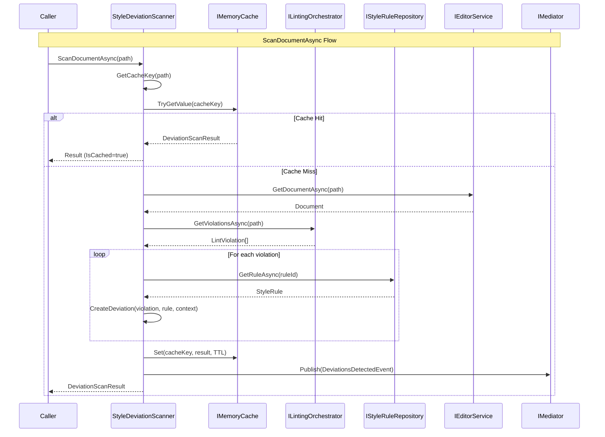

# LCS-DES-075a: Design Specification — Style Deviation Scanner

## 1. Metadata & Categorization

| Field | Value | Description |
| :--- | :--- | :--- |
| **Feature ID** | `AGT-075a` | Sub-part of AGT-075 |
| **Feature Name** | `Style Deviation Scanner` | Bridges linting with AI fix generation |
| **Target Version** | `v0.7.5a` | First sub-part of v0.7.5 |
| **Module Scope** | `Lexichord.Modules.Agents` | Agent module |
| **Swimlane** | `Ensemble` | Part of Agents vertical |
| **License Tier** | `Writer Pro` | Minimum tier for access |
| **Feature Gate Key** | `FeatureFlags.Agents.TuningAgent` | Shared gate with parent feature |
| **Author** | Lead Architect | |
| **Status** | `Draft` | |
| **Last Updated** | `2026-01-27` | |
| **Parent Document** | [LCS-DES-075-INDEX](./LCS-DES-075-INDEX.md) | |
| **Scope Breakdown** | [LCS-SBD-075 S3.1](./LCS-SBD-075.md#31-v075a-style-deviation-scanner) | |

---

## 2. Executive Summary

### 2.1 The Requirement

The Tuning Agent needs to identify style violations in documents and provide enriched context for AI-powered fix generation. The existing `ILintingOrchestrator` (v0.2.3a) provides raw violation data, but it lacks:

- **Context Window:** Surrounding text needed for AI understanding
- **Auto-Fixability Classification:** Determination of which violations can be AI-fixed
- **Caching:** Performance optimization for repeated scans
- **Real-time Updates:** Event-driven notification of new violations
- **Priority Mapping:** Severity-based prioritization for review workflow

> **Goal:** Create a scanner that bridges raw linting violations with the enriched context needed for intelligent fix generation.

### 2.2 The Proposed Solution

Implement `StyleDeviationScanner` that:

1. Wraps `ILintingOrchestrator` to get raw violations
2. Enriches each violation with surrounding context and rule details
3. Classifies violations as auto-fixable or manual-only
4. Caches results with content-hash-based invalidation
5. Subscribes to linting events for real-time updates
6. Publishes events when new deviations are detected

---

## 3. Architecture & Modular Strategy

### 3.1 Dependencies

#### 3.1.1 Upstream Dependencies

| Interface | Source Version | Purpose |
| :--- | :--- | :--- |
| `ILintingOrchestrator` | v0.2.3a | Raw violation detection |
| `LintViolation` | v0.2.3b | Violation data structure |
| `LintingCompletedEvent` | v0.2.3b | Real-time linting events |
| `IStyleRuleRepository` | v0.2.1b | Style rule access |
| `StyleRule` | v0.2.1a | Rule data structure |
| `IEditorService` | v0.1.3a | Document content access |
| `IMediator` | v0.0.7a | Event publishing |
| `IMemoryCache` | .NET | Result caching |

#### 3.1.2 NuGet Packages

| Package | Version | Purpose |
| :--- | :--- | :--- |
| `Microsoft.Extensions.Caching.Memory` | 8.x | In-memory caching |
| `MediatR` | 12.x | Event publishing |

### 3.2 Licensing Behavior

- **Load Behavior:** Soft Gate
  - Scanner loads but requires Writer Pro to invoke
  - `ILicenseContext` checked on public method entry
  - Returns empty result with "license required" flag for lower tiers

---

## 4. Data Contract (The API)

### 4.1 Primary Interface

```csharp
namespace Lexichord.Abstractions.Contracts.Agents;

/// <summary>
/// Scans documents for style deviations that can be addressed by the Tuning Agent.
/// Bridges the linting infrastructure with AI-powered fix generation by providing
/// enriched context for each violation.
/// </summary>
public interface IStyleDeviationScanner
{
    /// <summary>
    /// Scans the entire document for style deviations.
    /// </summary>
    /// <param name="documentPath">Path to the document to scan.</param>
    /// <param name="ct">Cancellation token.</param>
    /// <returns>Scan result with all detected deviations.</returns>
    Task<DeviationScanResult> ScanDocumentAsync(
        string documentPath,
        CancellationToken ct = default);

    /// <summary>
    /// Scans a specific range within the document.
    /// </summary>
    /// <param name="documentPath">Path to the document.</param>
    /// <param name="range">Text range to scan.</param>
    /// <param name="ct">Cancellation token.</param>
    /// <returns>Scan result for the specified range.</returns>
    Task<DeviationScanResult> ScanRangeAsync(
        string documentPath,
        TextSpan range,
        CancellationToken ct = default);

    /// <summary>
    /// Gets cached scan result for a document if available.
    /// </summary>
    /// <param name="documentPath">Path to the document.</param>
    /// <param name="ct">Cancellation token.</param>
    /// <returns>Cached result or null if not cached.</returns>
    Task<DeviationScanResult?> GetCachedResultAsync(
        string documentPath,
        CancellationToken ct = default);

    /// <summary>
    /// Invalidates the cache for a specific document.
    /// Called when document content or style rules change.
    /// </summary>
    /// <param name="documentPath">Path to the document.</param>
    void InvalidateCache(string documentPath);

    /// <summary>
    /// Invalidates all cached results.
    /// Called when global style rules change.
    /// </summary>
    void InvalidateAllCaches();

    /// <summary>
    /// Event raised when new deviations are detected (from real-time linting).
    /// </summary>
    event EventHandler<DeviationsDetectedEventArgs>? DeviationsDetected;
}
```

### 4.2 Data Records

```csharp
namespace Lexichord.Abstractions.Contracts.Agents;

/// <summary>
/// Represents a single style deviation detected in a document.
/// Enriched with context information needed for AI fix generation.
/// </summary>
public record StyleDeviation
{
    /// <summary>
    /// Unique identifier for this deviation instance.
    /// </summary>
    public required Guid DeviationId { get; init; }

    /// <summary>
    /// The underlying lint violation from the linting system.
    /// </summary>
    public required LintViolation Violation { get; init; }

    /// <summary>
    /// The text span where the deviation occurs.
    /// </summary>
    public required TextSpan Location { get; init; }

    /// <summary>
    /// The original text containing the violation.
    /// </summary>
    public required string OriginalText { get; init; }

    /// <summary>
    /// Surrounding context for AI analysis.
    /// Typically includes text before and after the violation.
    /// </summary>
    public required string SurroundingContext { get; init; }

    /// <summary>
    /// The style rule that was violated.
    /// Contains rule details needed for fix generation.
    /// </summary>
    public required StyleRule ViolatedRule { get; init; }

    /// <summary>
    /// Whether this deviation can be auto-fixed by AI.
    /// False for violations requiring manual intervention.
    /// </summary>
    public bool IsAutoFixable { get; init; } = true;

    /// <summary>
    /// Priority for fixing based on rule severity and impact.
    /// </summary>
    public DeviationPriority Priority { get; init; } = DeviationPriority.Normal;

    /// <summary>
    /// Category of the deviation for grouping in UI.
    /// </summary>
    public string Category => ViolatedRule.Category ?? "General";

    /// <summary>
    /// Rule ID for quick reference.
    /// </summary>
    public string RuleId => ViolatedRule.RuleId;

    /// <summary>
    /// Human-readable message describing the violation.
    /// </summary>
    public string Message => Violation.Message;

    /// <summary>
    /// Suggested fix from the linter (if any).
    /// May be null if linter doesn't provide suggestions.
    /// </summary>
    public string? LinterSuggestedFix => Violation.SuggestedFix;
}

/// <summary>
/// Result of a deviation scan operation.
/// </summary>
public record DeviationScanResult
{
    /// <summary>
    /// Path to the scanned document.
    /// </summary>
    public required string DocumentPath { get; init; }

    /// <summary>
    /// All detected deviations.
    /// </summary>
    public required IReadOnlyList<StyleDeviation> Deviations { get; init; }

    /// <summary>
    /// Total number of deviations found.
    /// </summary>
    public int TotalCount => Deviations.Count;

    /// <summary>
    /// Number of deviations that can be auto-fixed.
    /// </summary>
    public int AutoFixableCount => Deviations.Count(d => d.IsAutoFixable);

    /// <summary>
    /// Number of deviations requiring manual review.
    /// </summary>
    public int ManualOnlyCount => Deviations.Count(d => !d.IsAutoFixable);

    /// <summary>
    /// Timestamp when the scan was performed.
    /// </summary>
    public DateTimeOffset ScannedAt { get; init; } = DateTimeOffset.UtcNow;

    /// <summary>
    /// Duration of the scan operation.
    /// </summary>
    public TimeSpan ScanDuration { get; init; }

    /// <summary>
    /// Whether the result was retrieved from cache.
    /// </summary>
    public bool IsCached { get; init; }

    /// <summary>
    /// Content hash of the document at scan time.
    /// Used for cache validation.
    /// </summary>
    public string? ContentHash { get; init; }

    /// <summary>
    /// Style rules version at scan time.
    /// Used for cache validation.
    /// </summary>
    public string? RulesVersion { get; init; }

    /// <summary>
    /// Groups deviations by category for UI display.
    /// </summary>
    public IReadOnlyDictionary<string, IReadOnlyList<StyleDeviation>> ByCategory =>
        Deviations
            .GroupBy(d => d.Category)
            .ToDictionary(
                g => g.Key,
                g => (IReadOnlyList<StyleDeviation>)g.OrderBy(d => d.Location.Start).ToList());

    /// <summary>
    /// Groups deviations by priority for review ordering.
    /// </summary>
    public IReadOnlyDictionary<DeviationPriority, IReadOnlyList<StyleDeviation>> ByPriority =>
        Deviations
            .GroupBy(d => d.Priority)
            .ToDictionary(
                g => g.Key,
                g => (IReadOnlyList<StyleDeviation>)g.OrderBy(d => d.Location.Start).ToList());

    /// <summary>
    /// Gets deviations sorted by document position (top to bottom).
    /// </summary>
    public IReadOnlyList<StyleDeviation> ByPosition =>
        Deviations.OrderBy(d => d.Location.Start).ToList();

    /// <summary>
    /// Creates an empty result for documents with no violations.
    /// </summary>
    public static DeviationScanResult Empty(string documentPath, TimeSpan duration) => new()
    {
        DocumentPath = documentPath,
        Deviations = Array.Empty<StyleDeviation>(),
        ScanDuration = duration,
        IsCached = false
    };
}

/// <summary>
/// Priority levels for style deviations.
/// Maps from lint severity with additional context.
/// </summary>
public enum DeviationPriority
{
    /// <summary>Minor style suggestion, can be safely ignored.</summary>
    Low = 0,

    /// <summary>Standard style violation, should be addressed.</summary>
    Normal = 1,

    /// <summary>Significant style issue, address before publishing.</summary>
    High = 2,

    /// <summary>Critical violation, must be fixed immediately.</summary>
    Critical = 3
}

/// <summary>
/// Event arguments for deviations detected event.
/// </summary>
public class DeviationsDetectedEventArgs : EventArgs
{
    /// <summary>Path to the document with new deviations.</summary>
    public required string DocumentPath { get; init; }

    /// <summary>Newly detected deviations.</summary>
    public required IReadOnlyList<StyleDeviation> NewDeviations { get; init; }

    /// <summary>Total count including previously detected.</summary>
    public required int TotalDeviationCount { get; init; }

    /// <summary>Whether this is from a fresh scan or incremental update.</summary>
    public bool IsIncremental { get; init; }
}
```

### 4.3 Configuration Options

```csharp
namespace Lexichord.Modules.Agents.Configuration;

/// <summary>
/// Configuration options for the Style Deviation Scanner.
/// </summary>
public class ScannerOptions
{
    /// <summary>
    /// Number of characters of context to include before and after violation.
    /// Default: 500 characters each direction.
    /// </summary>
    public int ContextWindowSize { get; set; } = 500;

    /// <summary>
    /// Cache time-to-live in minutes.
    /// Default: 5 minutes.
    /// </summary>
    public int CacheTtlMinutes { get; set; } = 5;

    /// <summary>
    /// Maximum number of deviations to return per scan.
    /// Default: 100. Set to 0 for unlimited.
    /// </summary>
    public int MaxDeviationsPerScan { get; set; } = 100;

    /// <summary>
    /// Whether to include manual-only violations in results.
    /// Default: true.
    /// </summary>
    public bool IncludeManualOnly { get; set; } = true;

    /// <summary>
    /// Minimum severity to include in results.
    /// Default: Hint (include all).
    /// </summary>
    public LintSeverity MinimumSeverity { get; set; } = LintSeverity.Hint;

    /// <summary>
    /// Whether to subscribe to real-time linting events.
    /// Default: true.
    /// </summary>
    public bool EnableRealTimeUpdates { get; set; } = true;

    /// <summary>
    /// Categories to exclude from scanning.
    /// Default: empty (include all).
    /// </summary>
    public IReadOnlyList<string> ExcludedCategories { get; set; } = Array.Empty<string>();
}
```

---

## 5. Implementation Logic

### 5.1 Flow Diagram



### 5.2 Cache Key Generation

```csharp
/// <summary>
/// Cache key format: {DocumentPath}:{ContentHash}:{RulesVersion}
/// This ensures cache is invalidated when:
/// - Document content changes (different hash)
/// - Style rules are modified (different version)
/// </summary>
private async Task<string> GetCacheKeyAsync(string documentPath, CancellationToken ct)
{
    var document = await _editorService.GetDocumentAsync(documentPath, ct);
    var contentHash = ComputeContentHash(document.Content);
    var rulesVersion = await _styleRuleRepository.GetVersionAsync(ct);

    return $"deviation-scan:{documentPath}:{contentHash}:{rulesVersion}";
}

private static string ComputeContentHash(string content)
{
    using var sha256 = SHA256.Create();
    var hashBytes = sha256.ComputeHash(Encoding.UTF8.GetBytes(content));
    return Convert.ToBase64String(hashBytes)[..16]; // First 16 chars for brevity
}
```

### 5.3 Auto-Fixability Determination

```csharp
/// <summary>
/// Determines whether a violation can be auto-fixed by AI.
/// </summary>
private static bool DetermineAutoFixability(LintViolation violation, StyleRule rule)
{
    // 1. Rules explicitly marked as AI-fixable
    if (rule.IsAiFixable)
        return true;

    // 2. Rules with deterministic replacement patterns
    if (!string.IsNullOrEmpty(violation.SuggestedFix))
        return true;

    // 3. Pattern-based rules (find/replace style)
    if (rule.RuleType == StyleRuleType.PatternMatch ||
        rule.RuleType == StyleRuleType.Terminology)
        return true;

    // 4. Grammar/readability rules (AI can handle)
    if (rule.Category is "Grammar" or "Readability" or "Voice")
        return true;

    // 5. Structure rules usually need manual intervention
    if (rule.RuleType == StyleRuleType.Structure ||
        rule.RuleType == StyleRuleType.Formatting)
        return false;

    // 6. Complex semantic rules may not be auto-fixable
    if (rule.Complexity == RuleComplexity.High)
        return false;

    // Default: assume fixable, let validation catch failures
    return true;
}
```

### 5.4 Priority Mapping

```csharp
/// <summary>
/// Maps lint severity to deviation priority.
/// </summary>
private static DeviationPriority MapSeverityToPriority(LintSeverity severity) =>
    severity switch
    {
        LintSeverity.Error => DeviationPriority.Critical,
        LintSeverity.Warning => DeviationPriority.High,
        LintSeverity.Information => DeviationPriority.Normal,
        LintSeverity.Hint => DeviationPriority.Low,
        _ => DeviationPriority.Normal
    };
```

### 5.5 Context Extraction

```csharp
/// <summary>
/// Extracts surrounding context for a violation.
/// </summary>
private string ExtractSurroundingContext(
    string documentContent,
    TextSpan violationLocation,
    int windowSize)
{
    // Calculate context bounds
    var contextStart = Math.Max(0, violationLocation.Start - windowSize);
    var contextEnd = Math.Min(documentContent.Length, violationLocation.End + windowSize);

    // Adjust to paragraph boundaries if possible
    contextStart = AdjustToNearestParagraphStart(documentContent, contextStart, violationLocation.Start);
    contextEnd = AdjustToNearestParagraphEnd(documentContent, contextEnd, violationLocation.End);

    return documentContent.Substring(contextStart, contextEnd - contextStart);
}

private static int AdjustToNearestParagraphStart(string content, int start, int max)
{
    // Look for paragraph break within range
    var searchRange = content.AsSpan(start, Math.Min(max - start, 100));
    var newlineIndex = searchRange.IndexOf("\n\n");

    if (newlineIndex >= 0)
        return start + newlineIndex + 2;

    return start;
}
```

---

## 6. Real-Time Updates

### 6.1 Event Subscription

```csharp
/// <summary>
/// Subscribes to linting events for real-time deviation updates.
/// </summary>
public class StyleDeviationScanner : IStyleDeviationScanner, INotificationHandler<LintingCompletedEvent>
{
    public async Task Handle(LintingCompletedEvent notification, CancellationToken ct)
    {
        if (!_options.EnableRealTimeUpdates)
            return;

        var documentPath = notification.DocumentPath;

        // Invalidate cache for this document
        InvalidateCache(documentPath);

        // Create deviations from new violations
        var deviations = new List<StyleDeviation>();
        foreach (var violation in notification.Violations)
        {
            var deviation = await CreateDeviationAsync(documentPath, violation, ct);
            if (deviation != null)
            {
                deviations.Add(deviation);
            }
        }

        // Raise event for UI update
        if (deviations.Count > 0)
        {
            DeviationsDetected?.Invoke(this, new DeviationsDetectedEventArgs
            {
                DocumentPath = documentPath,
                NewDeviations = deviations,
                TotalDeviationCount = deviations.Count,
                IsIncremental = true
            });
        }
    }
}
```

### 6.2 Cache Invalidation Events

```csharp
/// <summary>
/// Handles style rules changed event to invalidate all caches.
/// </summary>
public class StyleDeviationScanner : INotificationHandler<StyleRulesChangedEvent>
{
    public Task Handle(StyleRulesChangedEvent notification, CancellationToken ct)
    {
        _logger.LogInformation("Style rules changed, invalidating all deviation caches");
        InvalidateAllCaches();
        return Task.CompletedTask;
    }
}
```

---

## 7. Implementation

### 7.1 Full Implementation

```csharp
namespace Lexichord.Modules.Agents;

/// <summary>
/// Scans documents for style deviations by bridging the linting infrastructure
/// with the Tuning Agent's fix generation system.
/// </summary>
public sealed class StyleDeviationScanner :
    IStyleDeviationScanner,
    INotificationHandler<LintingCompletedEvent>,
    INotificationHandler<StyleRulesChangedEvent>,
    INotificationHandler<DocumentChangedEvent>,
    IDisposable
{
    private readonly ILintingOrchestrator _lintingOrchestrator;
    private readonly IStyleRuleRepository _styleRuleRepository;
    private readonly IEditorService _editorService;
    private readonly IMemoryCache _cache;
    private readonly IMediator _mediator;
    private readonly ILicenseContext _licenseContext;
    private readonly ILogger<StyleDeviationScanner> _logger;
    private readonly ScannerOptions _options;

    private readonly SemaphoreSlim _scanLock = new(1, 1);
    private bool _disposed;

    public event EventHandler<DeviationsDetectedEventArgs>? DeviationsDetected;

    public StyleDeviationScanner(
        ILintingOrchestrator lintingOrchestrator,
        IStyleRuleRepository styleRuleRepository,
        IEditorService editorService,
        IMemoryCache cache,
        IMediator mediator,
        ILicenseContext licenseContext,
        IOptions<ScannerOptions> options,
        ILogger<StyleDeviationScanner> logger)
    {
        _lintingOrchestrator = lintingOrchestrator;
        _styleRuleRepository = styleRuleRepository;
        _editorService = editorService;
        _cache = cache;
        _mediator = mediator;
        _licenseContext = licenseContext;
        _logger = logger;
        _options = options.Value;
    }

    /// <inheritdoc />
    public async Task<DeviationScanResult> ScanDocumentAsync(
        string documentPath,
        CancellationToken ct = default)
    {
        ObjectDisposedException.ThrowIf(_disposed, this);
        ArgumentException.ThrowIfNullOrWhiteSpace(documentPath);

        // License check
        if (!_licenseContext.HasFeature(LicenseTier.WriterPro))
        {
            _logger.LogWarning("License check failed: Writer Pro required for deviation scanning");
            return DeviationScanResult.Empty(documentPath, TimeSpan.Zero) with
            {
                // Could add a flag here for UI to show upgrade prompt
            };
        }

        var stopwatch = Stopwatch.StartNew();
        _logger.LogDebug("Scanning document for deviations: {Path}", documentPath);

        // Check cache
        var cacheKey = await GetCacheKeyAsync(documentPath, ct);
        if (_cache.TryGetValue(cacheKey, out DeviationScanResult? cachedResult))
        {
            _logger.LogDebug("Cache hit for document: {Path}", documentPath);
            stopwatch.Stop();
            return cachedResult! with { IsCached = true, ScanDuration = stopwatch.Elapsed };
        }

        // Acquire lock for this document to prevent duplicate scans
        await _scanLock.WaitAsync(ct);
        try
        {
            // Double-check cache after acquiring lock
            if (_cache.TryGetValue(cacheKey, out cachedResult))
            {
                stopwatch.Stop();
                return cachedResult! with { IsCached = true, ScanDuration = stopwatch.Elapsed };
            }

            // Get document content for context extraction
            var document = await _editorService.GetDocumentAsync(documentPath, ct);
            var contentHash = ComputeContentHash(document.Content);

            // Get lint violations
            var violations = await _lintingOrchestrator.GetViolationsAsync(documentPath, ct);

            // Filter by minimum severity
            violations = violations
                .Where(v => v.Severity >= _options.MinimumSeverity)
                .ToList();

            // Convert to deviations
            var deviations = new List<StyleDeviation>();
            foreach (var violation in violations)
            {
                if (_options.ExcludedCategories.Contains(violation.RuleCategory ?? ""))
                    continue;

                var deviation = await CreateDeviationAsync(documentPath, violation, document.Content, ct);
                if (deviation != null)
                {
                    if (_options.IncludeManualOnly || deviation.IsAutoFixable)
                    {
                        deviations.Add(deviation);
                    }
                }

                // Respect max limit
                if (_options.MaxDeviationsPerScan > 0 &&
                    deviations.Count >= _options.MaxDeviationsPerScan)
                {
                    _logger.LogWarning(
                        "Max deviations limit reached ({Max}), some violations may be omitted",
                        _options.MaxDeviationsPerScan);
                    break;
                }
            }

            stopwatch.Stop();

            var result = new DeviationScanResult
            {
                DocumentPath = documentPath,
                Deviations = deviations,
                ScannedAt = DateTimeOffset.UtcNow,
                ScanDuration = stopwatch.Elapsed,
                IsCached = false,
                ContentHash = contentHash,
                RulesVersion = await _styleRuleRepository.GetVersionAsync(ct)
            };

            // Cache the result
            var cacheEntryOptions = new MemoryCacheEntryOptions
            {
                AbsoluteExpirationRelativeToNow = TimeSpan.FromMinutes(_options.CacheTtlMinutes),
                SlidingExpiration = TimeSpan.FromMinutes(_options.CacheTtlMinutes / 2)
            };
            _cache.Set(cacheKey, result, cacheEntryOptions);

            _logger.LogInformation(
                "Scan completed: {Count} deviations ({AutoFixable} auto-fixable) in {ElapsedMs}ms",
                result.TotalCount,
                result.AutoFixableCount,
                stopwatch.ElapsedMilliseconds);

            // Raise event
            OnDeviationsDetected(result, isIncremental: false);

            return result;
        }
        finally
        {
            _scanLock.Release();
        }
    }

    /// <inheritdoc />
    public async Task<DeviationScanResult> ScanRangeAsync(
        string documentPath,
        TextSpan range,
        CancellationToken ct = default)
    {
        ObjectDisposedException.ThrowIf(_disposed, this);
        ArgumentException.ThrowIfNullOrWhiteSpace(documentPath);

        if (!_licenseContext.HasFeature(LicenseTier.WriterPro))
        {
            return DeviationScanResult.Empty(documentPath, TimeSpan.Zero);
        }

        var stopwatch = Stopwatch.StartNew();
        _logger.LogDebug(
            "Scanning range for deviations: {Path} [{Start}-{End}]",
            documentPath, range.Start, range.End);

        // Range scans are not cached (too granular)
        var document = await _editorService.GetDocumentAsync(documentPath, ct);
        var violations = await _lintingOrchestrator.GetViolationsForRangeAsync(documentPath, range, ct);

        var deviations = new List<StyleDeviation>();
        foreach (var violation in violations)
        {
            var deviation = await CreateDeviationAsync(documentPath, violation, document.Content, ct);
            if (deviation != null)
            {
                deviations.Add(deviation);
            }
        }

        stopwatch.Stop();

        return new DeviationScanResult
        {
            DocumentPath = documentPath,
            Deviations = deviations,
            ScannedAt = DateTimeOffset.UtcNow,
            ScanDuration = stopwatch.Elapsed,
            IsCached = false
        };
    }

    /// <inheritdoc />
    public Task<DeviationScanResult?> GetCachedResultAsync(
        string documentPath,
        CancellationToken ct = default)
    {
        ObjectDisposedException.ThrowIf(_disposed, this);

        // Try to find any cached result for this document
        // Note: This is a simplified lookup; production code might use a registry
        var cacheKey = $"deviation-scan:{documentPath}:";
        // Memory cache doesn't support prefix search, so we'd need a different approach
        // For now, return null and let caller do a fresh scan
        return Task.FromResult<DeviationScanResult?>(null);
    }

    /// <inheritdoc />
    public void InvalidateCache(string documentPath)
    {
        ArgumentException.ThrowIfNullOrWhiteSpace(documentPath);

        // Remove all cache entries for this document
        // This is a simplified approach; production code might track keys
        _logger.LogDebug("Cache invalidated for document: {Path}", documentPath);

        // In practice, we'd maintain a registry of cache keys per document
        // For now, the content-hash-based key naturally invalidates on content change
    }

    /// <inheritdoc />
    public void InvalidateAllCaches()
    {
        _logger.LogInformation("All deviation caches invalidated");
        // IMemoryCache doesn't have a Clear() method
        // Production code would use a custom cache with key tracking
    }

    #region Event Handlers

    public async Task Handle(LintingCompletedEvent notification, CancellationToken ct)
    {
        if (!_options.EnableRealTimeUpdates)
            return;

        _logger.LogDebug(
            "Real-time linting completed for: {Path}",
            notification.DocumentPath);

        // Invalidate and re-scan
        InvalidateCache(notification.DocumentPath);

        // Only re-scan if document is currently being edited
        // (checked via editor service's active document list)
        if (await _editorService.IsDocumentOpenAsync(notification.DocumentPath, ct))
        {
            var result = await ScanDocumentAsync(notification.DocumentPath, ct);
            // DeviationsDetected event already raised in ScanDocumentAsync
        }
    }

    public Task Handle(StyleRulesChangedEvent notification, CancellationToken ct)
    {
        _logger.LogInformation(
            "Style rules changed ({ChangeType}), invalidating all caches",
            notification.ChangeType);

        InvalidateAllCaches();
        return Task.CompletedTask;
    }

    public Task Handle(DocumentChangedEvent notification, CancellationToken ct)
    {
        // Document content changed, invalidate its cache
        InvalidateCache(notification.DocumentPath);
        return Task.CompletedTask;
    }

    #endregion

    #region Private Methods

    private async Task<StyleDeviation?> CreateDeviationAsync(
        string documentPath,
        LintViolation violation,
        string documentContent,
        CancellationToken ct)
    {
        try
        {
            // Get the violated rule
            var rule = await _styleRuleRepository.GetRuleAsync(violation.RuleId, ct);
            if (rule == null)
            {
                _logger.LogWarning("Rule not found: {RuleId}", violation.RuleId);
                return null;
            }

            // Extract original text
            var originalText = documentContent.Substring(
                violation.Location.Start,
                violation.Location.Length);

            // Extract surrounding context
            var surroundingContext = ExtractSurroundingContext(
                documentContent,
                violation.Location,
                _options.ContextWindowSize);

            return new StyleDeviation
            {
                DeviationId = Guid.NewGuid(),
                Violation = violation,
                Location = violation.Location,
                OriginalText = originalText,
                SurroundingContext = surroundingContext,
                ViolatedRule = rule,
                IsAutoFixable = DetermineAutoFixability(violation, rule),
                Priority = MapSeverityToPriority(violation.Severity)
            };
        }
        catch (Exception ex)
        {
            _logger.LogError(
                ex,
                "Failed to create deviation for violation: {RuleId} at {Location}",
                violation.RuleId,
                violation.Location);
            return null;
        }
    }

    private async Task<string> GetCacheKeyAsync(string documentPath, CancellationToken ct)
    {
        var document = await _editorService.GetDocumentAsync(documentPath, ct);
        var contentHash = ComputeContentHash(document.Content);
        var rulesVersion = await _styleRuleRepository.GetVersionAsync(ct);

        return $"deviation-scan:{documentPath}:{contentHash}:{rulesVersion}";
    }

    private static string ComputeContentHash(string content)
    {
        var hashBytes = SHA256.HashData(Encoding.UTF8.GetBytes(content));
        return Convert.ToBase64String(hashBytes)[..16];
    }

    private string ExtractSurroundingContext(
        string documentContent,
        TextSpan violationLocation,
        int windowSize)
    {
        var contextStart = Math.Max(0, violationLocation.Start - windowSize);
        var contextEnd = Math.Min(documentContent.Length, violationLocation.End + windowSize);

        // Try to expand to sentence/paragraph boundaries
        contextStart = FindPreviousBoundary(documentContent, contextStart, violationLocation.Start);
        contextEnd = FindNextBoundary(documentContent, contextEnd, violationLocation.End);

        return documentContent.Substring(contextStart, contextEnd - contextStart);
    }

    private static int FindPreviousBoundary(string content, int start, int max)
    {
        for (var i = start; i < max && i < content.Length; i++)
        {
            if (content[i] == '\n' && i + 1 < content.Length && content[i + 1] == '\n')
                return i + 2;
            if (content[i] == '.' && i + 1 < content.Length && char.IsWhiteSpace(content[i + 1]))
                return i + 2;
        }
        return start;
    }

    private static int FindNextBoundary(string content, int end, int min)
    {
        for (var i = end - 1; i > min && i > 0; i--)
        {
            if (content[i] == '\n' && i - 1 >= 0 && content[i - 1] == '\n')
                return i - 1;
            if (content[i] == '.' && char.IsWhiteSpace(content[i - 1] == '\0' ? ' ' : content[i - 1]))
                return i + 1;
        }
        return end;
    }

    private static bool DetermineAutoFixability(LintViolation violation, StyleRule rule)
    {
        if (rule.IsAiFixable)
            return true;

        if (!string.IsNullOrEmpty(violation.SuggestedFix))
            return true;

        if (rule.RuleType is StyleRuleType.PatternMatch or StyleRuleType.Terminology)
            return true;

        if (rule.Category is "Grammar" or "Readability" or "Voice")
            return true;

        if (rule.RuleType is StyleRuleType.Structure or StyleRuleType.Formatting)
            return false;

        if (rule.Complexity == RuleComplexity.High)
            return false;

        return true;
    }

    private static DeviationPriority MapSeverityToPriority(LintSeverity severity) =>
        severity switch
        {
            LintSeverity.Error => DeviationPriority.Critical,
            LintSeverity.Warning => DeviationPriority.High,
            LintSeverity.Information => DeviationPriority.Normal,
            LintSeverity.Hint => DeviationPriority.Low,
            _ => DeviationPriority.Normal
        };

    private void OnDeviationsDetected(DeviationScanResult result, bool isIncremental)
    {
        if (result.TotalCount == 0)
            return;

        DeviationsDetected?.Invoke(this, new DeviationsDetectedEventArgs
        {
            DocumentPath = result.DocumentPath,
            NewDeviations = result.Deviations,
            TotalDeviationCount = result.TotalCount,
            IsIncremental = isIncremental
        });
    }

    #endregion

    #region IDisposable

    public void Dispose()
    {
        if (_disposed)
            return;

        _scanLock.Dispose();
        _disposed = true;
    }

    #endregion
}
```

---

## 8. Observability & Logging

| Level | Message Template | Context |
| :--- | :--- | :--- |
| Debug | `"Scanning document for deviations: {Path}"` | Start of scan |
| Debug | `"Cache hit for document: {Path}"` | Cache hit |
| Debug | `"Real-time linting completed for: {Path}"` | Event handling |
| Info | `"Scan completed: {Count} deviations ({AutoFixable} auto-fixable) in {ElapsedMs}ms"` | Scan complete |
| Info | `"Style rules changed ({ChangeType}), invalidating all caches"` | Rules changed |
| Warning | `"Max deviations limit reached ({Max}), some violations may be omitted"` | Limit hit |
| Warning | `"Rule not found: {RuleId}"` | Missing rule |
| Warning | `"License check failed: Writer Pro required for deviation scanning"` | License issue |
| Error | `"Failed to create deviation for violation: {RuleId} at {Location}"` | Processing error |

---

## 9. Security & Safety

| Risk | Level | Mitigation |
| :--- | :--- | :--- |
| Cache poisoning | Low | Content hash in cache key prevents stale data |
| Memory exhaustion | Medium | Max deviations limit; TTL-based cache expiry |
| Race conditions | Low | Semaphore lock on scan operations |
| Information leakage | None | No external data transmission |

---

## 10. Acceptance Criteria

### 10.1 Functional Criteria

| # | Given | When | Then |
| :--- | :--- | :--- | :--- |
| 1 | Document with violations | Scanning | Returns StyleDeviations with context |
| 2 | Document without violations | Scanning | Returns empty result |
| 3 | Previously scanned document | Scanning again | Returns cached result |
| 4 | Document content changed | Scanning | Returns fresh result (cache miss) |
| 5 | Style rules changed | Scanning any document | All caches invalidated |
| 6 | Range with violations | Scanning range | Returns only range deviations |
| 7 | Core license user | Scanning | Returns empty result |
| 8 | Writer Pro user | Scanning | Returns full results |

### 10.2 Performance Criteria

| # | Given | When | Then |
| :--- | :--- | :--- | :--- |
| 9 | 10,000 word document | Scanning (cold) | Completes in < 500ms |
| 10 | 10,000 word document | Scanning (cached) | Completes in < 50ms |
| 11 | Document with 100 violations | Scanning | All 100 processed |

### 10.3 CI Criteria

| # | Given | When | Then |
| :--- | :--- | :--- | :--- |
| 12 | Any test failure | CI runs | Build fails |
| 13 | All tests pass | CI runs | Build succeeds |

---

## 11. Deliverable Checklist

| # | Deliverable | Status |
| :--- | :--- | :--- |
| 1 | `IStyleDeviationScanner` interface | [ ] |
| 2 | `StyleDeviation` record | [ ] |
| 3 | `DeviationScanResult` record | [ ] |
| 4 | `DeviationPriority` enum | [ ] |
| 5 | `DeviationsDetectedEventArgs` class | [ ] |
| 6 | `ScannerOptions` configuration | [ ] |
| 7 | `StyleDeviationScanner` implementation | [ ] |
| 8 | Event handlers (Linting, Rules, Document) | [ ] |
| 9 | Cache key generation | [ ] |
| 10 | Context extraction logic | [ ] |
| 11 | Auto-fixability determination | [ ] |
| 12 | Priority mapping | [ ] |
| 13 | Unit tests for scanner | [ ] |
| 14 | DI registration | [ ] |

---

## 12. Verification Commands

```bash
# Run scanner unit tests
dotnet test --filter "Version=v0.7.5a" --logger "console;verbosity=detailed"

# Run scanner integration tests
dotnet test --filter "Category=Integration&Version=v0.7.5a"

# Verify DI registration
dotnet build && dotnet run --project tests/Lexichord.Tests.Host -- --verify-services IStyleDeviationScanner

# Manual verification:
# 1. Open document with known style violations
# 2. Call ScanDocumentAsync via test harness
# 3. Verify deviations match expected violations
# 4. Modify document, verify cache invalidated
# 5. Modify style rules, verify all caches invalidated
```

---

## Document History

| Version | Date | Author | Changes |
| :--- | :--- | :--- | :--- |
| 1.0 | 2026-01-27 | Lead Architect | Initial draft |
