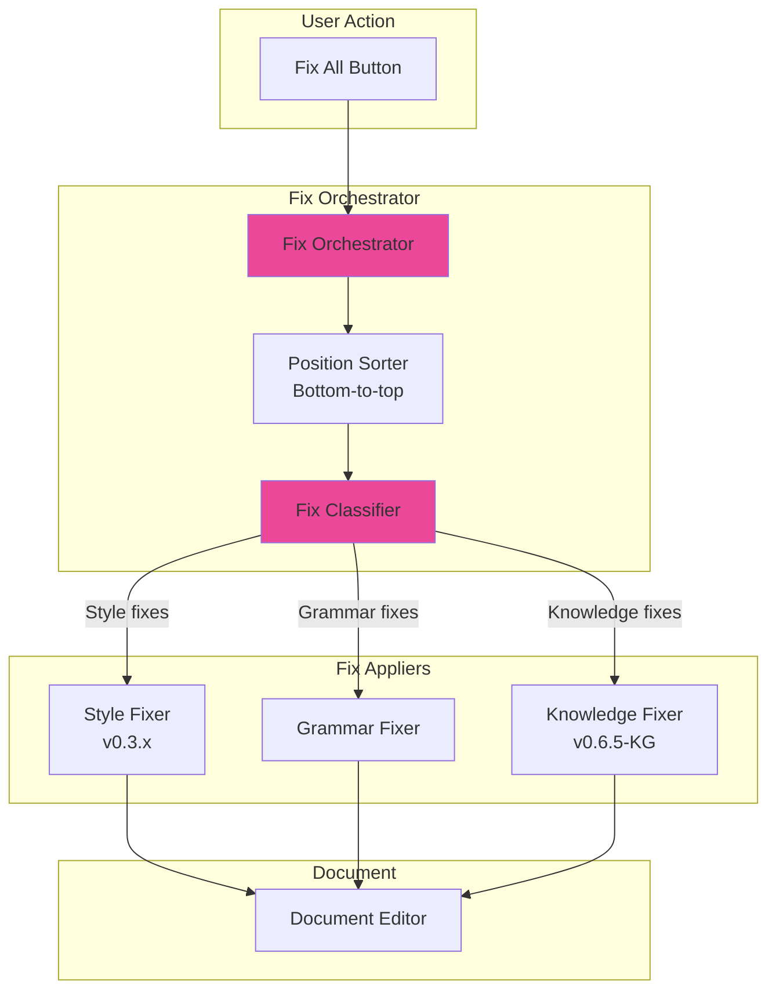

# LCS-SBD-075-KG: Scope Overview — Unified Validation

## Document Control

| Field            | Value                                                        |
| :--------------- | :----------------------------------------------------------- |
| **Document ID**  | LCS-SBD-075-KG                                               |
| **Version**      | v0.7.5                                                       |
| **Codename**     | Unified Validation (CKVS Phase 4b)                           |
| **Status**       | Draft                                                        |
| **Last Updated** | 2026-01-31                                                   |
| **Owner**        | Lead Architect                                               |
| **Depends On**   | v0.7.5 (Tuning Agent), v0.6.5-KG (Validation Engine), v0.3.x (Linter) |

---

## 1. Executive Summary

### 1.1 The Vision

**v0.7.5-KG** delivers **Unified Validation** — a combined validation and fix workflow that merges the existing Style Linter (v0.3.x), Grammar Linter, and CKVS Validation Engine into a single, coherent user experience.

Instead of three separate panels showing different issues, users see one unified "Issues" panel with combined findings, severity levels, and a single "Fix" workflow that addresses all issue types.

### 1.2 Business Value

- **Simplified UX:** One panel for all document issues.
- **Unified Severity:** Consistent error/warning/info across validators.
- **Single Fix Workflow:** "Fix All" addresses style + grammar + knowledge.
- **Prioritized Issues:** Most critical issues surfaced first.
- **Reduced Cognitive Load:** No need to check multiple panels.

### 1.3 Success Criteria

1. Unified Issues panel shows findings from all validators.
2. Consistent severity mapping across validator types.
3. "Fix All" command applies all auto-fixable issues.
4. Manual fixes grouped by location in document.
5. Filter by issue type (Style, Grammar, Knowledge).
6. Performance: <1s total validation time.

---

## 2. Relationship to Existing v0.7.5

The existing v0.7.5 spec covers the **Tuning Agent** for style adjustments. Unified Validation:

- **Integrates Tuning:** Style issues from Tuning Agent unified with others.
- **Enhances UX:** All agents benefit from unified issue display.
- **Shared Fixes:** Tuning Agent can fix multiple issue types.

---

## 3. Key Deliverables

### 3.1 Sub-Parts

| Sub-Part | Title | Description | Est. Hours |
|:---------|:------|:------------|:-----------|
| v0.7.5e | Unified Issue Model | Common issue record for all validators | 3 |
| v0.7.5f | Issue Aggregator | Combines results from all validators | 4 |
| v0.7.5g | Unified Issues Panel | Single UI panel for all issues | 6 |
| v0.7.5h | Combined Fix Workflow | "Fix All" across validator types | 5 |
| v0.7.5i | Issue Filters | Filter by type, severity, location | 3 |
| **Total** | | | **21 hours** |

### 3.2 Key Interfaces

```csharp
/// <summary>
/// Aggregates validation results from multiple sources.
/// </summary>
public interface IUnifiedValidationService
{
    /// <summary>
    /// Validates document with all registered validators.
    /// </summary>
    Task<UnifiedValidationResult> ValidateAsync(
        Document document,
        UnifiedValidationOptions options,
        CancellationToken ct = default);

    /// <summary>
    /// Applies all auto-fixable issues.
    /// </summary>
    Task<FixResult> FixAllAsync(
        Document document,
        UnifiedValidationResult validation,
        CancellationToken ct = default);
}

/// <summary>
/// Unified issue from any validator.
/// </summary>
public record UnifiedIssue
{
    /// <summary>Unique issue ID.</summary>
    public Guid Id { get; init; } = Guid.NewGuid();

    /// <summary>Issue source category.</summary>
    public IssueCategory Category { get; init; }

    /// <summary>Source validator name.</summary>
    public required string ValidatorName { get; init; }

    /// <summary>Issue code (e.g., "STYLE_001", "AXIOM_VIOLATION").</summary>
    public required string Code { get; init; }

    /// <summary>Unified severity.</summary>
    public UnifiedSeverity Severity { get; init; }

    /// <summary>Human-readable message.</summary>
    public required string Message { get; init; }

    /// <summary>Location in document.</summary>
    public TextSpan? Location { get; init; }

    /// <summary>Suggested fix (if available).</summary>
    public UnifiedFix? Fix { get; init; }

    /// <summary>Additional context (varies by category).</summary>
    public object? Context { get; init; }
}

public enum IssueCategory
{
    Style,      // From Style Linter
    Grammar,    // From Grammar Linter
    Knowledge,  // From CKVS Validation Engine
    Structure,  // From structural validators
    Custom      // From custom validators
}

public enum UnifiedSeverity
{
    Error,      // Must fix before publish
    Warning,    // Should fix
    Info,       // Consider fixing
    Hint        // Optional improvement
}

/// <summary>
/// Combined validation result.
/// </summary>
public record UnifiedValidationResult
{
    /// <summary>All issues from all validators.</summary>
    public required IReadOnlyList<UnifiedIssue> Issues { get; init; }

    /// <summary>Total validation duration.</summary>
    public TimeSpan Duration { get; init; }

    /// <summary>Issues grouped by category.</summary>
    public IReadOnlyDictionary<IssueCategory, IReadOnlyList<UnifiedIssue>> ByCategory =>
        Issues.GroupBy(i => i.Category)
              .ToDictionary(g => g.Key, g => (IReadOnlyList<UnifiedIssue>)g.ToList());

    /// <summary>Issues grouped by severity.</summary>
    public IReadOnlyDictionary<UnifiedSeverity, int> CountBySeverity =>
        Issues.GroupBy(i => i.Severity)
              .ToDictionary(g => g.Key, g => g.Count());

    /// <summary>Whether document can be published (no errors).</summary>
    public bool CanPublish => !Issues.Any(i => i.Severity == UnifiedSeverity.Error);

    /// <summary>Number of auto-fixable issues.</summary>
    public int AutoFixableCount => Issues.Count(i => i.Fix?.CanAutoApply == true);
}
```

### 3.3 Unified Issues Panel UI

```
┌────────────────────────────────────────────────────────────────┐
│ Issues (12)                                    [Fix All (8)]   │
├────────────────────────────────────────────────────────────────┤
│ Filter: [All ▼] [Errors ▼] [Knowledge ✓] [Style ✓] [Grammar ✓] │
├────────────────────────────────────────────────────────────────┤
│                                                                │
│ ⛔ ERRORS (2)                                                   │
│ ├── Line 15: Endpoint '/users' missing required method         │
│ │   └── [Fix: Add "method: GET"]                              │
│ └── Line 42: Claim conflicts with knowledge base               │
│     └── [View Conflict]                                        │
│                                                                │
│ ⚠️ WARNINGS (5)                                                 │
│ ├── Line 8: Passive voice detected                            │
│ │   └── [Fix: "The API returns..." → "Returns..."]            │
│ ├── Line 23: Parameter 'limit' type mismatch                  │
│ │   └── [Fix: Change type to "integer"]                       │
│ └── ... 3 more                                                │
│                                                                │
│ 💡 INFO (5)                                                     │
│ └── ... 5 suggestions                                          │
│                                                                │
├────────────────────────────────────────────────────────────────┤
│ Summary: 2 errors, 5 warnings, 5 info | 8 auto-fixable        │
│ [Fix All] [Fix Errors Only] [Dismiss All Info]                │
└────────────────────────────────────────────────────────────────┘
```

---

## 4. Severity Mapping

| Source Validator | Original Severity | Unified Mapping |
|:-----------------|:------------------|:----------------|
| Style Linter | error | Error |
| Style Linter | warning | Warning |
| Style Linter | info | Info |
| Grammar Linter | error | Error |
| Grammar Linter | suggestion | Info |
| CKVS Validation | ValidationSeverity.Error | Error |
| CKVS Validation | ValidationSeverity.Warning | Warning |
| CKVS Validation | ValidationSeverity.Info | Info |
| CKVS Validation | ValidationSeverity.Hint | Hint |

---

## 5. Fix Workflow



**Fix Application Order:**
1. Sort fixes by position (bottom to top) to preserve offsets.
2. Group by category for batch processing.
3. Apply fixes atomically with undo support.
4. Re-validate after fixes to catch cascading issues.

---

## 6. Dependencies

| Component | Source | Usage |
|:----------|:-------|:------|
| `ILinterService` | v0.3.x | Style linting |
| `IGrammarService` | v0.3.x | Grammar checking |
| `IValidationEngine` | v0.6.5-KG | Knowledge validation |
| `IEditorService` | v0.1.3a | Apply fixes to document |
| `ITuningAgent` | v0.7.5 | Style fix suggestions |

---

## 7. License Gating

| Tier | Unified Validation |
|:-----|:-------------------|
| Core | Style linting only |
| WriterPro | Style + Grammar + Schema validation |
| Teams | Full (all validators including CKVS) |
| Enterprise | Full + custom validators |

---

## 8. Performance Targets

| Metric | Target | Measurement |
|:-------|:-------|:------------|
| Total validation | <1s | P95 timing |
| Issue aggregation | <50ms | P95 timing |
| Fix All (10 issues) | <500ms | P95 timing |
| UI render | <100ms | P95 timing |

---

## 9. What This Enables

- **v0.7.6 Sync Service:** Unified issues feed into sync decisions.
- **v0.7.7 Validation Workflows:** Automated validation pipelines.
- **Publication Gates:** Block on unified error count.
- **Quality Metrics:** Track issue trends over time.

---
