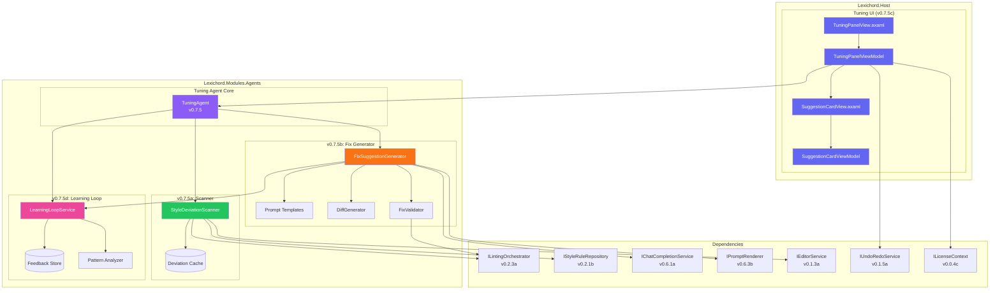
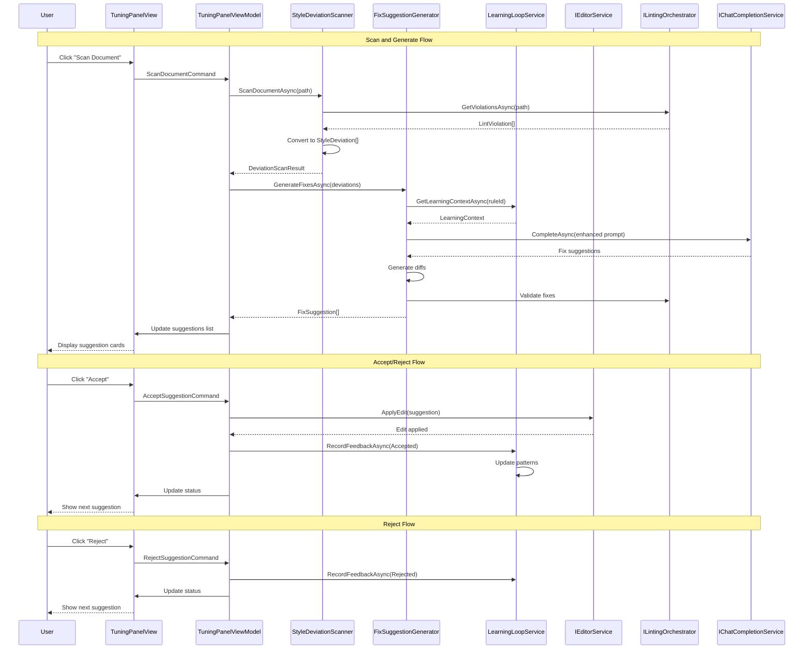

# LCS-SBD-075: Scope Breakdown — The Tuning Agent

## Document Control

| Field            | Value                                    |
| :--------------- | :--------------------------------------- |
| **Document ID**  | LCS-SBD-075                              |
| **Version**      | v0.7.5                                   |
| **Codename**     | The Tuning Agent (Proactive Style Harmony) |
| **Status**       | Draft                                    |
| **Last Updated** | 2026-01-27                               |
| **Owner**        | Lead Architect                           |
| **Depends On**   | v0.7.1 (Agent Registry), v0.7.2 (Context Assembler), v0.7.3 (Editor Agent), v0.2.x (Linting), v0.6.x (LLM Gateway) |

---

## 1. Executive Summary

### 1.1 The Vision

**v0.7.5** delivers the **Tuning Agent** — a proactive style harmony system that automatically scans documents for style violations from the Lexicon and offers intelligent, non-destructive fix suggestions. This release transforms Lexichord from a reactive style checking tool into an intelligent writing assistant that actively helps users maintain consistent style across their documents.

The Tuning Agent represents the convergence of Lexichord's style enforcement capabilities (v0.2.x) with its AI-powered agent infrastructure (v0.6.x-v0.7.x). By combining deterministic linting rules with LLM-powered rewriting, users receive context-aware suggestions that not only identify problems but provide ready-to-apply solutions that preserve their original meaning and voice.

### 1.2 Business Value

- **Proactive Quality:** Agent automatically identifies style deviations before documents are published, reducing manual review cycles.
- **Intelligent Fixes:** LLM-powered suggestions understand context, offering rewrites that maintain meaning while conforming to style rules.
- **Non-Destructive Workflow:** Accept/Reject UI ensures users maintain full control over all changes to their documents.
- **Continuous Improvement:** Learning Loop captures user preferences to improve future suggestions based on acceptance patterns.
- **Time Savings:** Reduces manual style correction effort by 60-80% through automated fix generation.
- **Style Consistency:** Ensures organization-wide adherence to Lexicon rules across all documents.

### 1.3 Success Criteria

This release succeeds when:

1. Style Deviation Scanner identifies 95%+ of Lexicon-defined style violations in documents.
2. Automatic Fix Suggestions generate contextually appropriate rewrites for 90%+ of detected violations.
3. Accept/Reject UI allows users to review, accept, reject, or modify suggestions with single-click interactions.
4. Learning Loop stores acceptance/rejection patterns and demonstrably improves suggestion quality over time.
5. All features respect license gating (Writer Pro for core features, Teams for Learning Loop).

### 1.4 License Gating

The Tuning Agent is a **Writer Pro** feature with advanced capabilities in higher tiers:

| Feature | Writer Pro | Teams | Enterprise |
| :--- | :--- | :--- | :--- |
| Style Deviation Scanner | Yes | Yes | Yes |
| Automatic Fix Suggestions | Yes | Yes | Yes |
| Accept/Reject UI | Yes | Yes | Yes |
| Learning Loop | No | Yes | Yes |
| Custom Learning Models | No | No | Yes |
| Batch Tuning Mode | No | Yes | Yes |

Lower tiers will see:

- "Upgrade to Writer Pro" prompt when attempting to use Tuning Agent
- Tuning Agent button disabled with upgrade tooltip in Core tier
- "Upgrade to Teams" prompt when attempting to access Learning Loop features

---

## 2. Dependencies on Prior Versions

| Component                  | Source Version | Usage in v0.7.5                                   |
| :------------------------- | :------------- | :------------------------------------------------ |
| `IAgent`                   | v0.6.6a        | Base interface for TuningAgent implementation     |
| `IAgentRegistry`           | v0.7.1b        | Agent discovery and persona management            |
| `AgentConfiguration`       | v0.7.1a        | Agent configuration model                         |
| `IContextOrchestrator`     | v0.7.2c        | Context assembly for fix generation               |
| `IChatCompletionService`   | v0.6.1a        | LLM communication for fix suggestions             |
| `IPromptRenderer`          | v0.6.3b        | Template rendering for tuning prompts             |
| `IPromptTemplateRepository`| v0.6.3c        | Template storage and retrieval                    |
| `ILintingOrchestrator`     | v0.2.3a        | Style violation detection                         |
| `LintViolation`            | v0.2.3b        | Violation data structure                          |
| `IStyleRuleRepository`     | v0.2.1b        | Style rule access for context                     |
| `IEditorService`           | v0.1.3a        | Document access and manipulation                  |
| `ILicenseContext`          | v0.0.4c        | Feature gating by license tier                    |
| `IMediator`                | v0.0.7a        | Event publishing for learning loop                |
| `ISettingsService`         | v0.1.6a        | User preference storage                           |
| `BaseAgent`                | v0.7.3b        | Base agent implementation class                   |

---

## 3. Sub-Part Specifications

### 3.1 v0.7.5a: Style Deviation Scanner

| Field            | Value                                     |
| :--------------- | :---------------------------------------- |
| **Sub-Part ID**  | AGT-075a                                  |
| **Title**        | Style Deviation Scanner                   |
| **Module**       | `Lexichord.Modules.Agents`                |
| **License Tier** | Writer Pro                                |

**Goal:** Create a specialized scanner that bridges the linting infrastructure with the Tuning Agent to identify style violations requiring AI-powered fixes.

**Key Deliverables:**

- `IStyleDeviationScanner` interface in Abstractions
- `StyleDeviationScanner` implementation connecting to `ILintingOrchestrator`
- `StyleDeviation` record with violation details and context
- `DeviationScanResult` record with aggregated scan results
- Real-time violation subscription via `LintingCompletedEvent`
- Violation caching per document for performance optimization
- Filtering logic for AI-fixable vs. manual-only violations
- Unit tests for scanner accuracy and caching behavior

**Key Interfaces:**

```csharp
namespace Lexichord.Abstractions.Contracts.Agents;

/// <summary>
/// Scans documents for style deviations that can be addressed by the Tuning Agent.
/// Bridges the linting infrastructure with AI-powered fix generation.
/// </summary>
public interface IStyleDeviationScanner
{
    /// <summary>
    /// Scans the entire document for style deviations.
    /// </summary>
    Task<DeviationScanResult> ScanDocumentAsync(
        string documentPath,
        CancellationToken ct = default);

    /// <summary>
    /// Scans a specific range within the document.
    /// </summary>
    Task<DeviationScanResult> ScanRangeAsync(
        string documentPath,
        TextSpan range,
        CancellationToken ct = default);

    /// <summary>
    /// Gets cached violations for a document if available.
    /// </summary>
    Task<DeviationScanResult?> GetCachedResultAsync(
        string documentPath,
        CancellationToken ct = default);

    /// <summary>
    /// Invalidates the cache for a specific document.
    /// </summary>
    void InvalidateCache(string documentPath);

    /// <summary>
    /// Event raised when new deviations are detected.
    /// </summary>
    event EventHandler<DeviationsDetectedEventArgs> DeviationsDetected;
}

/// <summary>
/// Represents a single style deviation detected in a document.
/// </summary>
public record StyleDeviation
{
    /// <summary>Unique identifier for this deviation instance.</summary>
    public required Guid DeviationId { get; init; }

    /// <summary>The underlying lint violation.</summary>
    public required LintViolation Violation { get; init; }

    /// <summary>The text span where the deviation occurs.</summary>
    public required TextSpan Location { get; init; }

    /// <summary>The original text containing the violation.</summary>
    public required string OriginalText { get; init; }

    /// <summary>Surrounding context for AI analysis (configurable window).</summary>
    public required string SurroundingContext { get; init; }

    /// <summary>The style rule that was violated.</summary>
    public required StyleRule ViolatedRule { get; init; }

    /// <summary>Whether this deviation can be auto-fixed by AI.</summary>
    public bool IsAutoFixable { get; init; } = true;

    /// <summary>Priority for fixing (based on rule severity).</summary>
    public DeviationPriority Priority { get; init; } = DeviationPriority.Normal;

    /// <summary>Category of the deviation for grouping.</summary>
    public string Category => ViolatedRule.Category ?? "General";
}

/// <summary>
/// Result of a deviation scan operation.
/// </summary>
public record DeviationScanResult
{
    /// <summary>Path to the scanned document.</summary>
    public required string DocumentPath { get; init; }

    /// <summary>All detected deviations.</summary>
    public required IReadOnlyList<StyleDeviation> Deviations { get; init; }

    /// <summary>Total number of deviations found.</summary>
    public int TotalCount => Deviations.Count;

    /// <summary>Number of auto-fixable deviations.</summary>
    public int AutoFixableCount => Deviations.Count(d => d.IsAutoFixable);

    /// <summary>Timestamp when the scan was performed.</summary>
    public DateTimeOffset ScannedAt { get; init; } = DateTimeOffset.UtcNow;

    /// <summary>Duration of the scan operation.</summary>
    public TimeSpan ScanDuration { get; init; }

    /// <summary>Whether the result is from cache.</summary>
    public bool IsCached { get; init; }

    /// <summary>Groups deviations by category.</summary>
    public IReadOnlyDictionary<string, IReadOnlyList<StyleDeviation>> ByCategory =>
        Deviations.GroupBy(d => d.Category)
            .ToDictionary(g => g.Key, g => (IReadOnlyList<StyleDeviation>)g.ToList());

    /// <summary>Groups deviations by priority.</summary>
    public IReadOnlyDictionary<DeviationPriority, IReadOnlyList<StyleDeviation>> ByPriority =>
        Deviations.GroupBy(d => d.Priority)
            .ToDictionary(g => g.Key, g => (IReadOnlyList<StyleDeviation>)g.ToList());
}

/// <summary>
/// Priority levels for style deviations.
/// </summary>
public enum DeviationPriority
{
    Low = 0,
    Normal = 1,
    High = 2,
    Critical = 3
}

/// <summary>
/// Event args for deviations detected event.
/// </summary>
public class DeviationsDetectedEventArgs : EventArgs
{
    public required string DocumentPath { get; init; }
    public required IReadOnlyList<StyleDeviation> NewDeviations { get; init; }
    public required int TotalDeviationCount { get; init; }
}
```

**Caching Strategy:**

```text
CACHE INVALIDATION TRIGGERS:
├── Document content changed (via IEditorService events)
├── Style rules modified (via StyleRulesChangedEvent)
├── Explicit invalidation via InvalidateCache()
├── Cache TTL expired (configurable, default: 5 minutes)
└── Memory pressure (LRU eviction)

CACHE KEY FORMAT:
"{DocumentPath}:{ContentHash}:{StyleRulesVersion}"
```

**Dependencies:**

- v0.2.3a: `ILintingOrchestrator` (violation detection)
- v0.2.3b: `LintViolation` (violation data structure)
- v0.2.1b: `IStyleRuleRepository` (rule access)
- v0.1.3a: `IEditorService` (document access)

---

### 3.2 v0.7.5b: Automatic Fix Suggestions

| Field            | Value                                     |
| :--------------- | :---------------------------------------- |
| **Sub-Part ID**  | AGT-075b                                  |
| **Title**        | Automatic Fix Suggestions                 |
| **Module**       | `Lexichord.Modules.Agents`                |
| **License Tier** | Writer Pro                                |

**Goal:** Implement the AI-powered fix suggestion engine that generates contextually appropriate rewrites for detected style deviations.

**Key Deliverables:**

- `IFixSuggestionGenerator` interface in Abstractions
- `FixSuggestionGenerator` implementation using LLM
- `FixSuggestion` record with suggested rewrite and metadata
- `FixGenerationOptions` for customizing suggestion behavior
- Specialized prompt templates for different violation categories
- Batch suggestion generation for multiple violations
- Suggestion quality scoring based on semantic similarity
- Diff generation for visual comparison
- Unit tests for suggestion quality and edge cases

**Key Interfaces:**

```csharp
namespace Lexichord.Abstractions.Contracts.Agents;

/// <summary>
/// Generates AI-powered fix suggestions for style deviations.
/// </summary>
public interface IFixSuggestionGenerator
{
    /// <summary>
    /// Generates a fix suggestion for a single deviation.
    /// </summary>
    Task<FixSuggestion> GenerateFixAsync(
        StyleDeviation deviation,
        FixGenerationOptions? options = null,
        CancellationToken ct = default);

    /// <summary>
    /// Generates fix suggestions for multiple deviations in batch.
    /// More efficient than calling GenerateFixAsync individually.
    /// </summary>
    Task<IReadOnlyList<FixSuggestion>> GenerateFixesAsync(
        IReadOnlyList<StyleDeviation> deviations,
        FixGenerationOptions? options = null,
        CancellationToken ct = default);

    /// <summary>
    /// Regenerates a fix suggestion with additional user guidance.
    /// </summary>
    Task<FixSuggestion> RegenerateFixAsync(
        StyleDeviation deviation,
        string userGuidance,
        FixGenerationOptions? options = null,
        CancellationToken ct = default);

    /// <summary>
    /// Validates that a fix suggestion correctly addresses the deviation.
    /// </summary>
    Task<FixValidationResult> ValidateFixAsync(
        StyleDeviation deviation,
        FixSuggestion suggestion,
        CancellationToken ct = default);
}

/// <summary>
/// Represents a suggested fix for a style deviation.
/// </summary>
public record FixSuggestion
{
    /// <summary>Unique identifier for this suggestion.</summary>
    public required Guid SuggestionId { get; init; }

    /// <summary>The deviation this suggestion addresses.</summary>
    public required Guid DeviationId { get; init; }

    /// <summary>The original text with the violation.</summary>
    public required string OriginalText { get; init; }

    /// <summary>The suggested replacement text.</summary>
    public required string SuggestedText { get; init; }

    /// <summary>Explanation of why this fix is suggested.</summary>
    public required string Explanation { get; init; }

    /// <summary>Confidence score for the suggestion (0.0 to 1.0).</summary>
    public double Confidence { get; init; } = 0.8;

    /// <summary>Quality score based on semantic preservation (0.0 to 1.0).</summary>
    public double QualityScore { get; init; } = 0.8;

    /// <summary>The diff showing changes between original and suggested.</summary>
    public required TextDiff Diff { get; init; }

    /// <summary>Token usage for this suggestion generation.</summary>
    public UsageMetrics? TokenUsage { get; init; }

    /// <summary>Time taken to generate this suggestion.</summary>
    public TimeSpan GenerationTime { get; init; }

    /// <summary>Alternative suggestions if available.</summary>
    public IReadOnlyList<AlternativeSuggestion>? Alternatives { get; init; }

    /// <summary>Whether this is a high-confidence automated fix.</summary>
    public bool IsHighConfidence => Confidence >= 0.9 && QualityScore >= 0.9;
}

/// <summary>
/// An alternative suggestion for a deviation.
/// </summary>
public record AlternativeSuggestion(
    string SuggestedText,
    string Explanation,
    double Confidence);

/// <summary>
/// Options for fix generation.
/// </summary>
public record FixGenerationOptions
{
    /// <summary>Maximum number of alternative suggestions to generate.</summary>
    public int MaxAlternatives { get; init; } = 2;

    /// <summary>Whether to include detailed explanations.</summary>
    public bool IncludeExplanations { get; init; } = true;

    /// <summary>Minimum confidence threshold for suggestions.</summary>
    public double MinConfidence { get; init; } = 0.7;

    /// <summary>Whether to validate fixes against the linter.</summary>
    public bool ValidateFixes { get; init; } = true;

    /// <summary>Custom prompt overrides for specific violation categories.</summary>
    public IReadOnlyDictionary<string, string>? CategoryPromptOverrides { get; init; }

    /// <summary>User's preferred tone for rewrites.</summary>
    public TonePreference Tone { get; init; } = TonePreference.Neutral;

    /// <summary>Whether to preserve the author's voice as much as possible.</summary>
    public bool PreserveVoice { get; init; } = true;
}

/// <summary>
/// Tone preferences for fix suggestions.
/// </summary>
public enum TonePreference
{
    Neutral,
    Formal,
    Casual,
    Technical,
    Simplified
}

/// <summary>
/// Result of fix validation.
/// </summary>
public record FixValidationResult
{
    /// <summary>Whether the fix resolves the original violation.</summary>
    public bool ResolvesViolation { get; init; }

    /// <summary>Whether the fix introduces new violations.</summary>
    public bool IntroducesNewViolations { get; init; }

    /// <summary>List of any new violations introduced.</summary>
    public IReadOnlyList<LintViolation>? NewViolations { get; init; }

    /// <summary>Semantic similarity score between original and fixed text.</summary>
    public double SemanticSimilarity { get; init; }

    /// <summary>Overall validation status.</summary>
    public ValidationStatus Status { get; init; }

    /// <summary>Detailed validation message.</summary>
    public string Message { get; init; } = string.Empty;
}

/// <summary>
/// Validation status for a fix.
/// </summary>
public enum ValidationStatus
{
    Valid,
    ValidWithWarnings,
    Invalid,
    ValidationFailed
}

/// <summary>
/// Represents a text diff between original and suggested text.
/// </summary>
public record TextDiff
{
    /// <summary>List of diff operations.</summary>
    public required IReadOnlyList<DiffOperation> Operations { get; init; }

    /// <summary>Unified diff format string.</summary>
    public required string UnifiedDiff { get; init; }

    /// <summary>Number of additions.</summary>
    public int Additions => Operations.Count(o => o.Type == DiffType.Addition);

    /// <summary>Number of deletions.</summary>
    public int Deletions => Operations.Count(o => o.Type == DiffType.Deletion);

    /// <summary>Number of unchanged segments.</summary>
    public int Unchanged => Operations.Count(o => o.Type == DiffType.Unchanged);
}

/// <summary>
/// A single diff operation.
/// </summary>
public record DiffOperation(DiffType Type, string Text, int StartIndex, int Length);

/// <summary>
/// Type of diff operation.
/// </summary>
public enum DiffType { Unchanged, Addition, Deletion }
```

**Prompt Template Structure:**

```yaml
# prompts/tuning-agent-fix.yaml
template_id: "tuning-agent-fix"
name: "Tuning Agent Fix Generator"
version: "1.0.0"
system_prompt: |
  You are a precise style enforcement agent for Lexichord. Your task is to rewrite text to fix style violations while preserving the original meaning exactly.

  STYLE RULE VIOLATED:
  Rule ID: {{rule_id}}
  Rule Name: {{rule_name}}
  Rule Description: {{rule_description}}
  {{#rule_examples}}
  Examples:
  {{rule_examples}}
  {{/rule_examples}}

  VIOLATION DETAILS:
  Message: {{violation_message}}
  Severity: {{violation_severity}}

  REQUIREMENTS:
  1. Fix ONLY the specific violation identified
  2. Preserve the original meaning EXACTLY
  3. Make minimal changes beyond the violation fix
  4. Maintain the author's voice and tone
  5. Do not introduce new style violations
  {{#preserve_voice}}
  6. Strongly preserve the author's original voice
  {{/preserve_voice}}
  {{#tone}}
  7. Maintain a {{tone}} tone in the rewrite
  {{/tone}}

  OUTPUT FORMAT:
  Provide your response in the following JSON format:
  {
    "suggested_text": "The rewritten text with the fix applied",
    "explanation": "Brief explanation of what was changed and why",
    "confidence": 0.95,
    "alternatives": [
      {
        "text": "Alternative rewrite option",
        "explanation": "Why this alternative might be preferred"
      }
    ]
  }

user_prompt: |
  Please fix the following text to resolve the style violation:

  ORIGINAL TEXT:
  """
  {{original_text}}
  """

  {{#surrounding_context}}
  SURROUNDING CONTEXT:
  """
  {{surrounding_context}}
  """
  {{/surrounding_context}}

  {{#user_guidance}}
  ADDITIONAL GUIDANCE FROM USER:
  {{user_guidance}}
  {{/user_guidance}}

  Provide a rewrite that fixes the violation while preserving meaning.
```

**Dependencies:**

- v0.7.5a: `StyleDeviation` (deviation data)
- v0.6.1a: `IChatCompletionService` (LLM communication)
- v0.6.3b: `IPromptRenderer` (template rendering)
- v0.7.2c: `IContextOrchestrator` (context assembly)
- v0.2.3a: `ILintingOrchestrator` (fix validation)

---

### 3.3 v0.7.5c: Accept/Reject UI

| Field            | Value                                     |
| :--------------- | :---------------------------------------- |
| **Sub-Part ID**  | AGT-075c                                  |
| **Title**        | Accept/Reject UI                          |
| **Module**       | `Lexichord.Host`                          |
| **License Tier** | Writer Pro                                |

**Goal:** Create a user-friendly interface for reviewing, accepting, rejecting, or modifying AI-generated fix suggestions.

**Key Deliverables:**

- `TuningPanelView.axaml` with suggestion list and controls
- `TuningPanelViewModel` with command handling and state management
- `SuggestionCardView.axaml` for individual suggestion display
- `SuggestionCardViewModel` for suggestion state and actions
- Inline diff preview with syntax highlighting
- Accept/Reject/Modify/Skip button actions
- "Accept All High Confidence" bulk action
- Progress indicator for batch processing
- Keyboard navigation support (j/k for navigation, a/r for accept/reject)
- Undo support via `IUndoRedoService`
- Unit tests for ViewModel logic

**Key UI Components:**

```text
+------------------------------------------------------------------+
|  Tuning Agent                                    [?] [Settings]   |
+------------------------------------------------------------------+
| [Scan Document] [Accept All (High Confidence)] | Filter: [All v] |
+------------------------------------------------------------------+
|                                                                   |
| +----- Suggestion Card (Expanded) ------------------------------+ |
| | Rule: No Passive Voice                         Priority: High | |
| |---------------------------------------------------------------| |
| | Original:                                                     | |
| | "The report was submitted by the team yesterday."             | |
| |---------------------------------------------------------------| |
| | Suggested:                                                    | |
| | "The team submitted the report yesterday."                    | |
| |---------------------------------------------------------------| |
| | [-Delete-] [+Add+] (Diff View)                               | |
| |---------------------------------------------------------------| |
| | Explanation: Converted passive voice to active voice.         | |
| | Confidence: 95%  |  Quality: 92%                              | |
| |---------------------------------------------------------------| |
| | [Accept] [Reject] [Modify] [Skip] | Alternatives: [2 more v]  | |
| +---------------------------------------------------------------+ |
|                                                                   |
| +----- Suggestion Card (Collapsed) -----------------------------+ |
| | "whitelist" -> "allowlist" (Inclusive Terminology)    [Accept]| |
| +---------------------------------------------------------------+ |
|                                                                   |
| +----- Suggestion Card (Collapsed) -----------------------------+ |
| | "very important" -> "critical" (Remove Weasel Words)  [Accept]| |
| +---------------------------------------------------------------+ |
|                                                                   |
+------------------------------------------------------------------+
| Reviewed: 5/12 | Accepted: 3 | Rejected: 2 | Remaining: 7        |
+------------------------------------------------------------------+
```

**Key Interfaces:**

```csharp
namespace Lexichord.Host.ViewModels.Agents;

/// <summary>
/// ViewModel for the Tuning Panel that displays and manages fix suggestions.
/// </summary>
public partial class TuningPanelViewModel : ViewModelBase
{
    private readonly IStyleDeviationScanner _scanner;
    private readonly IFixSuggestionGenerator _suggestionGenerator;
    private readonly IEditorService _editorService;
    private readonly IUndoRedoService _undoService;
    private readonly IMediator _mediator;
    private readonly ILicenseContext _licenseContext;

    [ObservableProperty]
    private ObservableCollection<SuggestionCardViewModel> _suggestions = new();

    [ObservableProperty]
    private SuggestionCardViewModel? _selectedSuggestion;

    [ObservableProperty]
    private bool _isScanning;

    [ObservableProperty]
    private bool _isGeneratingFixes;

    [ObservableProperty]
    private int _totalDeviations;

    [ObservableProperty]
    private int _reviewedCount;

    [ObservableProperty]
    private int _acceptedCount;

    [ObservableProperty]
    private int _rejectedCount;

    [ObservableProperty]
    private SuggestionFilter _currentFilter = SuggestionFilter.All;

    [ObservableProperty]
    private string _statusMessage = "Ready to scan";

    [RelayCommand]
    private async Task ScanDocumentAsync(CancellationToken ct);

    [RelayCommand]
    private async Task AcceptSuggestionAsync(SuggestionCardViewModel suggestion, CancellationToken ct);

    [RelayCommand]
    private async Task RejectSuggestionAsync(SuggestionCardViewModel suggestion);

    [RelayCommand]
    private async Task ModifySuggestionAsync(SuggestionCardViewModel suggestion);

    [RelayCommand]
    private void SkipSuggestion(SuggestionCardViewModel suggestion);

    [RelayCommand]
    private async Task AcceptAllHighConfidenceAsync(CancellationToken ct);

    [RelayCommand]
    private async Task RegenerateSuggestionAsync(SuggestionCardViewModel suggestion, CancellationToken ct);

    [RelayCommand]
    private void NavigateNext();

    [RelayCommand]
    private void NavigatePrevious();
}

/// <summary>
/// ViewModel for an individual suggestion card.
/// </summary>
public partial class SuggestionCardViewModel : ViewModelBase
{
    [ObservableProperty]
    private StyleDeviation _deviation;

    [ObservableProperty]
    private FixSuggestion _suggestion;

    [ObservableProperty]
    private bool _isExpanded;

    [ObservableProperty]
    private bool _isReviewed;

    [ObservableProperty]
    private SuggestionStatus _status = SuggestionStatus.Pending;

    [ObservableProperty]
    private string _modifiedText;

    [ObservableProperty]
    private bool _showAlternatives;

    [ObservableProperty]
    private AlternativeSuggestion? _selectedAlternative;

    public string RuleName => Deviation.ViolatedRule.Name;
    public string RuleCategory => Deviation.Category;
    public DeviationPriority Priority => Deviation.Priority;
    public double Confidence => Suggestion.Confidence;
    public double QualityScore => Suggestion.QualityScore;
    public bool IsHighConfidence => Suggestion.IsHighConfidence;
    public TextDiff Diff => Suggestion.Diff;
    public IReadOnlyList<AlternativeSuggestion>? Alternatives => Suggestion.Alternatives;
}

/// <summary>
/// Status of a suggestion in the review workflow.
/// </summary>
public enum SuggestionStatus
{
    Pending,
    Accepted,
    Rejected,
    Modified,
    Skipped
}

/// <summary>
/// Filter options for suggestion display.
/// </summary>
public enum SuggestionFilter
{
    All,
    Pending,
    HighConfidence,
    HighPriority,
    ByCategory
}
```

**Keyboard Shortcuts:**

| Key | Action |
| :--- | :--- |
| `j` / `Down` | Navigate to next suggestion |
| `k` / `Up` | Navigate to previous suggestion |
| `a` | Accept current suggestion |
| `r` | Reject current suggestion |
| `m` | Open modify dialog |
| `s` | Skip current suggestion |
| `Enter` | Expand/collapse suggestion |
| `Ctrl+A` | Accept all high confidence |
| `Ctrl+Z` | Undo last action |

**Dependencies:**

- v0.7.5a: `IStyleDeviationScanner` (deviation detection)
- v0.7.5b: `IFixSuggestionGenerator` (fix generation)
- v0.1.3a: `IEditorService` (document manipulation)
- v0.1.5a: `IUndoRedoService` (undo support)
- v0.0.4c: `ILicenseContext` (feature gating)

---

### 3.4 v0.7.5d: Learning Loop

| Field            | Value                                     |
| :--------------- | :---------------------------------------- |
| **Sub-Part ID**  | AGT-075d                                  |
| **Title**        | Learning Loop                             |
| **Module**       | `Lexichord.Modules.Agents`                |
| **License Tier** | Teams                                     |

**Goal:** Implement a feedback system that captures user acceptance/rejection patterns to improve future fix suggestion quality.

**Key Deliverables:**

- `ILearningLoopService` interface in Abstractions
- `LearningLoopService` implementation with feedback storage
- `FixFeedback` record for capturing user decisions
- `LearningContext` for prompt enhancement based on patterns
- Feedback aggregation by rule, category, and user
- Prompt refinement based on acceptance patterns
- Analytics dashboard data for learning effectiveness
- Privacy-conscious data handling (anonymization options)
- Export/import of learning data for team sharing
- Unit tests for feedback processing and prompt enhancement

**Key Interfaces:**

```csharp
namespace Lexichord.Abstractions.Contracts.Agents;

/// <summary>
/// Service for capturing and utilizing user feedback to improve fix suggestions.
/// </summary>
public interface ILearningLoopService
{
    /// <summary>
    /// Records user feedback for a fix suggestion.
    /// </summary>
    Task RecordFeedbackAsync(
        FixFeedback feedback,
        CancellationToken ct = default);

    /// <summary>
    /// Gets learning context to enhance prompts for a specific rule.
    /// </summary>
    Task<LearningContext> GetLearningContextAsync(
        string ruleId,
        CancellationToken ct = default);

    /// <summary>
    /// Gets aggregated learning statistics.
    /// </summary>
    Task<LearningStatistics> GetStatisticsAsync(
        LearningStatisticsFilter? filter = null,
        CancellationToken ct = default);

    /// <summary>
    /// Exports learning data for team sharing.
    /// </summary>
    Task<LearningExport> ExportLearningDataAsync(
        LearningExportOptions options,
        CancellationToken ct = default);

    /// <summary>
    /// Imports learning data from team export.
    /// </summary>
    Task ImportLearningDataAsync(
        LearningExport data,
        CancellationToken ct = default);

    /// <summary>
    /// Clears learning data (with confirmation).
    /// </summary>
    Task ClearLearningDataAsync(
        ClearLearningDataOptions options,
        CancellationToken ct = default);
}

/// <summary>
/// Feedback record for a fix suggestion decision.
/// </summary>
public record FixFeedback
{
    /// <summary>Unique feedback identifier.</summary>
    public required Guid FeedbackId { get; init; }

    /// <summary>The suggestion that received feedback.</summary>
    public required Guid SuggestionId { get; init; }

    /// <summary>The deviation that was addressed.</summary>
    public required Guid DeviationId { get; init; }

    /// <summary>The rule that was violated.</summary>
    public required string RuleId { get; init; }

    /// <summary>Category of the violation.</summary>
    public required string Category { get; init; }

    /// <summary>User's decision.</summary>
    public required FeedbackDecision Decision { get; init; }

    /// <summary>Original text before fix.</summary>
    public required string OriginalText { get; init; }

    /// <summary>Suggested text from AI.</summary>
    public required string SuggestedText { get; init; }

    /// <summary>Final text after user decision (may be modified).</summary>
    public string? FinalText { get; init; }

    /// <summary>User's modification if they edited the suggestion.</summary>
    public string? UserModification { get; init; }

    /// <summary>Confidence of the original suggestion.</summary>
    public double OriginalConfidence { get; init; }

    /// <summary>Timestamp of the feedback.</summary>
    public DateTimeOffset Timestamp { get; init; } = DateTimeOffset.UtcNow;

    /// <summary>Optional user comment explaining their decision.</summary>
    public string? UserComment { get; init; }

    /// <summary>Anonymized user identifier for aggregation.</summary>
    public string? AnonymizedUserId { get; init; }
}

/// <summary>
/// User's decision on a fix suggestion.
/// </summary>
public enum FeedbackDecision
{
    Accepted,
    Rejected,
    Modified,
    Skipped
}

/// <summary>
/// Context derived from learning data to enhance prompts.
/// </summary>
public record LearningContext
{
    /// <summary>The rule this context applies to.</summary>
    public required string RuleId { get; init; }

    /// <summary>Overall acceptance rate for this rule.</summary>
    public double AcceptanceRate { get; init; }

    /// <summary>Total feedback samples for this rule.</summary>
    public int SampleCount { get; init; }

    /// <summary>Patterns that were frequently accepted.</summary>
    public IReadOnlyList<AcceptedPattern> AcceptedPatterns { get; init; } = Array.Empty<AcceptedPattern>();

    /// <summary>Patterns that were frequently rejected.</summary>
    public IReadOnlyList<RejectedPattern> RejectedPatterns { get; init; } = Array.Empty<RejectedPattern>();

    /// <summary>User modifications that improved suggestions.</summary>
    public IReadOnlyList<UserModificationExample> UsefulModifications { get; init; } = Array.Empty<UserModificationExample>();

    /// <summary>Prompt enhancement text derived from learning.</summary>
    public string? PromptEnhancement { get; init; }

    /// <summary>Adjusted confidence baseline for this rule.</summary>
    public double? AdjustedConfidenceBaseline { get; init; }

    /// <summary>Whether there's enough data to be meaningful.</summary>
    public bool HasSufficientData => SampleCount >= 10;
}

/// <summary>
/// A pattern that was frequently accepted.
/// </summary>
public record AcceptedPattern(
    string OriginalPattern,
    string SuggestedPattern,
    int AcceptCount,
    double SuccessRate);

/// <summary>
/// A pattern that was frequently rejected.
/// </summary>
public record RejectedPattern(
    string OriginalPattern,
    string SuggestedPattern,
    int RejectCount,
    string? CommonRejectionReason);

/// <summary>
/// An example of a user modification that improved a suggestion.
/// </summary>
public record UserModificationExample(
    string OriginalSuggestion,
    string UserModification,
    string Improvement);

/// <summary>
/// Statistics about learning effectiveness.
/// </summary>
public record LearningStatistics
{
    /// <summary>Total feedback samples.</summary>
    public int TotalFeedback { get; init; }

    /// <summary>Overall acceptance rate.</summary>
    public double OverallAcceptanceRate { get; init; }

    /// <summary>Acceptance rate trend (positive = improving).</summary>
    public double AcceptanceRateTrend { get; init; }

    /// <summary>Statistics by rule.</summary>
    public IReadOnlyDictionary<string, RuleLearningStats> ByRule { get; init; } =
        new Dictionary<string, RuleLearningStats>();

    /// <summary>Statistics by category.</summary>
    public IReadOnlyDictionary<string, CategoryLearningStats> ByCategory { get; init; } =
        new Dictionary<string, CategoryLearningStats>();

    /// <summary>Time period for these statistics.</summary>
    public required DateRange Period { get; init; }
}

/// <summary>
/// Learning statistics for a specific rule.
/// </summary>
public record RuleLearningStats(
    string RuleId,
    string RuleName,
    int FeedbackCount,
    double AcceptanceRate,
    double ModificationRate,
    double ConfidenceAccuracy);

/// <summary>
/// Learning statistics for a category.
/// </summary>
public record CategoryLearningStats(
    string Category,
    int FeedbackCount,
    double AcceptanceRate,
    IReadOnlyList<string> TopAcceptedRules,
    IReadOnlyList<string> TopRejectedRules);
```

**Learning Data Flow:**

```mermaid
sequenceDiagram
    participant User
    participant UI as Accept/Reject UI
    participant Loop as LearningLoopService
    participant Store as FeedbackStore
    participant Generator as FixSuggestionGenerator

    Note over User,Generator: Feedback Collection Flow
    User->>UI: Accept/Reject/Modify suggestion
    UI->>Loop: RecordFeedbackAsync(feedback)
    Loop->>Store: Persist feedback
    Loop->>Loop: Update aggregated patterns

    Note over User,Generator: Learning Application Flow
    Generator->>Loop: GetLearningContextAsync(ruleId)
    Loop->>Store: Query relevant feedback
    Loop->>Loop: Analyze patterns
    Loop-->>Generator: LearningContext
    Generator->>Generator: Enhance prompt with learning
    Generator-->>User: Improved suggestion
```

**Privacy Controls:**

```csharp
/// <summary>
/// Options for learning data privacy.
/// </summary>
public record LearningPrivacyOptions
{
    /// <summary>Whether to anonymize user identifiers.</summary>
    public bool AnonymizeUsers { get; init; } = true;

    /// <summary>Whether to store original text (vs. patterns only).</summary>
    public bool StoreOriginalText { get; init; } = false;

    /// <summary>Maximum age for learning data.</summary>
    public TimeSpan? MaxDataAge { get; init; } = TimeSpan.FromDays(365);

    /// <summary>Whether to participate in team learning sharing.</summary>
    public bool ParticipateInTeamLearning { get; init; } = true;
}
```

**Storage Location:**

- Windows: `%APPDATA%/Lexichord/Learning/feedback.db`
- macOS: `~/Library/Application Support/Lexichord/Learning/feedback.db`
- Linux: `~/.config/Lexichord/Learning/feedback.db`

**Dependencies:**

- v0.7.5b: `FixSuggestion` (suggestion data)
- v0.7.5c: UI events for feedback capture
- v0.0.7a: `IMediator` (event publishing)
- v0.1.6a: `ISettingsService` (privacy settings)

---

## 4. Implementation Checklist

| #  | Sub-Part | Task                                                      | Est. Hours |
| :- | :------- | :-------------------------------------------------------- | :--------- |
| 1  | v0.7.5a  | Define `IStyleDeviationScanner` interface                 | 1          |
| 2  | v0.7.5a  | Define `StyleDeviation` and `DeviationScanResult` records | 1.5        |
| 3  | v0.7.5a  | Implement `StyleDeviationScanner` with linter bridge      | 3          |
| 4  | v0.7.5a  | Implement violation caching with invalidation             | 2          |
| 5  | v0.7.5a  | Subscribe to `LintingCompletedEvent` for real-time updates| 1          |
| 6  | v0.7.5a  | Unit tests for scanner accuracy                           | 2          |
| 7  | v0.7.5b  | Define `IFixSuggestionGenerator` interface                | 1          |
| 8  | v0.7.5b  | Define `FixSuggestion` and related records                | 1.5        |
| 9  | v0.7.5b  | Create tuning prompt templates (YAML)                     | 2          |
| 10 | v0.7.5b  | Implement `FixSuggestionGenerator` with LLM integration   | 4          |
| 11 | v0.7.5b  | Implement batch suggestion generation                     | 2          |
| 12 | v0.7.5b  | Implement diff generation for suggestions                 | 1.5        |
| 13 | v0.7.5b  | Implement fix validation against linter                   | 2          |
| 14 | v0.7.5b  | Unit tests for suggestion quality                         | 2.5        |
| 15 | v0.7.5c  | Create `TuningPanelView.axaml` layout                     | 3          |
| 16 | v0.7.5c  | Create `TuningPanelViewModel` with commands               | 3          |
| 17 | v0.7.5c  | Create `SuggestionCardView.axaml` component               | 2          |
| 18 | v0.7.5c  | Create `SuggestionCardViewModel` with state               | 1.5        |
| 19 | v0.7.5c  | Implement inline diff preview with highlighting           | 2          |
| 20 | v0.7.5c  | Implement Accept/Reject/Modify actions                    | 2          |
| 21 | v0.7.5c  | Implement "Accept All High Confidence" bulk action        | 1          |
| 22 | v0.7.5c  | Implement keyboard navigation                             | 1.5        |
| 23 | v0.7.5c  | Integrate with `IUndoRedoService`                         | 1          |
| 24 | v0.7.5c  | Unit tests for ViewModel commands                         | 2          |
| 25 | v0.7.5d  | Define `ILearningLoopService` interface                   | 1          |
| 26 | v0.7.5d  | Define feedback and learning context records              | 1.5        |
| 27 | v0.7.5d  | Implement `LearningLoopService` with SQLite storage       | 3          |
| 28 | v0.7.5d  | Implement feedback aggregation logic                      | 2          |
| 29 | v0.7.5d  | Implement prompt enhancement from learning                | 2.5        |
| 30 | v0.7.5d  | Implement learning data export/import                     | 1.5        |
| 31 | v0.7.5d  | Implement privacy controls                                | 1          |
| 32 | v0.7.5d  | Unit tests for learning loop                              | 2          |
| 33 | All      | Integration tests for full tuning workflow                | 3          |
| 34 | All      | DI registration in AgentsModule.cs                        | 1          |
| 35 | All      | License gating implementation and tests                   | 1.5        |
| **Total** |   |                                                           | **64 hours** |

---

## 5. Dependency Matrix

### 5.1 Required Interfaces (from earlier versions)

| Interface                  | Source Version | Purpose                              |
| :------------------------- | :------------- | :----------------------------------- |
| `IAgent`                   | v0.6.6a        | Base agent interface                 |
| `BaseAgent`                | v0.7.3b        | Base agent implementation            |
| `IAgentRegistry`           | v0.7.1b        | Agent registration                   |
| `IContextOrchestrator`     | v0.7.2c        | Context gathering                    |
| `IChatCompletionService`   | v0.6.1a        | LLM communication                    |
| `IPromptRenderer`          | v0.6.3b        | Template rendering                   |
| `ILintingOrchestrator`     | v0.2.3a        | Style violation detection            |
| `IStyleRuleRepository`     | v0.2.1b        | Style rule access                    |
| `IEditorService`           | v0.1.3a        | Document access                      |
| `ILicenseContext`          | v0.0.4c        | License checking                     |
| `IMediator`                | v0.0.7a        | Event publishing                     |
| `IUndoRedoService`         | v0.1.5a        | Undo/redo support                    |

### 5.2 New Interfaces (defined in v0.7.5)

| Interface                   | Defined In | Module          | Purpose                      |
| :-------------------------- | :--------- | :-------------- | :--------------------------- |
| `IStyleDeviationScanner`    | v0.7.5a    | Abstractions    | Deviation detection          |
| `IFixSuggestionGenerator`   | v0.7.5b    | Abstractions    | AI fix generation            |
| `ILearningLoopService`      | v0.7.5d    | Abstractions    | Feedback and learning        |

### 5.3 New Records/DTOs (defined in v0.7.5)

| Record                    | Defined In | Purpose                                |
| :------------------------ | :--------- | :------------------------------------- |
| `StyleDeviation`          | v0.7.5a    | Deviation with context                 |
| `DeviationScanResult`     | v0.7.5a    | Aggregated scan results                |
| `FixSuggestion`           | v0.7.5b    | AI-generated fix suggestion            |
| `FixGenerationOptions`    | v0.7.5b    | Customization options for fixes        |
| `FixValidationResult`     | v0.7.5b    | Validation result for a fix            |
| `TextDiff`                | v0.7.5b    | Diff between original and suggested    |
| `FixFeedback`             | v0.7.5d    | User feedback on suggestion            |
| `LearningContext`         | v0.7.5d    | Learning data for prompt enhancement   |
| `LearningStatistics`      | v0.7.5d    | Aggregated learning metrics            |

### 5.4 NuGet Packages

| Package          | Version | Purpose                    | New/Existing |
| :--------------- | :------ | :------------------------- | :----------- |
| `DiffPlex`       | 1.7.x   | Text diff generation       | **New**      |
| `SQLite-net`     | 1.8.x   | Learning data storage      | Existing     |
| `MediatR`        | 12.x    | Event publishing           | Existing     |
| `CommunityToolkit.Mvvm` | 8.x | ViewModel generation  | Existing     |

---

## 6. Architecture Diagram



---

## 7. Data Flow Diagram



---

## 8. Risks & Mitigations

| Risk | Impact | Probability | Mitigation |
| :--- | :----- | :---------- | :--------- |
| LLM suggestions may not resolve violations | High | Medium | Validate all fixes against linter before presenting to user |
| LLM suggestions may change meaning | High | Medium | Semantic similarity scoring; user review required |
| Performance impact from LLM calls | Medium | Medium | Batch processing; caching; background generation |
| Learning data privacy concerns | High | Low | Anonymization by default; configurable privacy settings |
| Users may reject most suggestions | Medium | Medium | Learning loop improves over time; provide modification option |
| UI overwhelming with many violations | Medium | Medium | Filtering, prioritization, pagination |
| Cache invalidation race conditions | Low | Medium | Versioned cache keys; optimistic invalidation |
| License bypass attempts | Medium | Low | Server-side validation for Teams features |

---

## 9. Success Metrics

| Metric | Target | Measurement |
| :----- | :----- | :---------- |
| Deviation detection rate | 95%+ | Comparison with manual linting |
| Fix suggestion acceptance rate | 70%+ initial, 85%+ after learning | Feedback tracking |
| Fix validation success rate | 95%+ | Automated linter validation |
| Scan time (10,000 words) | < 500ms | Stopwatch timing |
| Fix generation time (single) | < 2s | LLM response timing |
| Batch fix generation (10 violations) | < 10s | Parallel processing timing |
| Learning improvement | 10%+ acceptance increase | Month-over-month comparison |
| User satisfaction | 4.0/5.0+ | In-app feedback |

---

## 10. What This Enables

After v0.7.5, Lexichord will support:

- **v0.7.6:** Summarizer Agent can use Tuning Agent patterns for metadata extraction
- **v0.7.7:** Agent Workflows can chain Tuning Agent with Editor/Simplifier for comprehensive document review
- **v0.7.8:** The Hardening will add test suites for Tuning Agent accuracy
- **v0.8.x:** Enterprise features like custom learning models per organization
- **Future:** Autonomous document polishing mode (with user consent) that applies high-confidence fixes automatically

---

## 11. Decision Trees

### 11.1 Should a Deviation be Auto-Fixable?

```text
START: "Can this deviation be fixed by AI?"
│
├── Is there a clear rule definition?
│   ├── NO → Mark as manual-only
│   └── YES → Continue
│
├── Is the fix pattern-based (find/replace)?
│   ├── YES → Auto-fixable (high confidence)
│   └── NO → Continue
│
├── Does the fix require semantic understanding?
│   ├── YES → Continue
│   └── NO → Auto-fixable
│
├── Is there training data (learning loop)?
│   ├── YES with high acceptance → Auto-fixable
│   └── NO or low acceptance → Mark as needs review
│
└── DEFAULT: Auto-fixable with user verification
```

### 11.2 Should a Fix be Presented to User?

```text
START: "Should this fix be shown to user?"
│
├── Did fix generation succeed?
│   ├── NO → Skip (log error)
│   └── YES → Continue
│
├── Does fix pass linter validation?
│   ├── NO → Skip (would introduce new violations)
│   └── YES → Continue
│
├── Is confidence above minimum threshold?
│   ├── NO → Skip
│   └── YES → Continue
│
├── Is semantic similarity acceptable (> 0.8)?
│   ├── NO → Mark as low quality
│   └── YES → Continue
│
└── PRESENT to user with appropriate confidence badge
```

### 11.3 Accept All High Confidence Logic

```text
START: "User clicked Accept All High Confidence"
│
├── Filter suggestions where:
│   ├── Confidence >= 0.9
│   ├── QualityScore >= 0.9
│   ├── Status == Pending
│   └── ValidationStatus == Valid
│
├── Sort by document position (top to bottom)
│
├── For each filtered suggestion:
│   ├── Apply edit to document
│   ├── Record feedback (Accepted, batch=true)
│   ├── Update UI status
│   └── Continue to next
│
├── Create single undo group for all changes
│
└── Show summary: "Applied X of Y suggestions"
```

---

## 12. User Stories

| ID    | Role            | Story                                                                                | Acceptance Criteria                    |
| :---- | :-------------- | :----------------------------------------------------------------------------------- | :------------------------------------- |
| US-01 | Technical Writer| As a writer, I want the agent to scan my document for style violations so I can maintain consistency. | Scan completes in < 5s for typical documents |
| US-02 | Technical Writer| As a writer, I want to see suggested fixes with explanations so I understand the changes. | Each suggestion shows original, suggested, and why |
| US-03 | Technical Writer| As a writer, I want to accept/reject fixes with single clicks so I can review quickly. | One-click accept/reject for all suggestions |
| US-04 | Technical Writer| As a writer, I want to modify suggestions before accepting so I can customize the fix. | Modify dialog with editable text |
| US-05 | Technical Writer| As a writer, I want to undo accepted fixes so I can revert mistakes. | Ctrl+Z reverts last accepted fix |
| US-06 | Team Lead       | As a team lead, I want the system to learn from our decisions so fixes improve over time. | Acceptance rate increases month-over-month |
| US-07 | Team Lead       | As a team lead, I want to export learning data so new team members benefit from our patterns. | Export/import functionality works |
| US-08 | Writer (Free)   | As a free-tier user, I want to see the feature exists so I know what I'm missing. | Upgrade prompt shown, not hidden |
| US-09 | Technical Writer| As a writer, I want to filter suggestions by category so I can focus on specific issues. | Filter dropdown works correctly |
| US-10 | Technical Writer| As a writer, I want keyboard shortcuts so I can review suggestions efficiently. | j/k/a/r shortcuts work as documented |

---

## 13. Use Cases

### UC-01: Full Document Tuning

**Preconditions:**

- User has Writer Pro license
- Document is open in editor
- Lexicon has style rules defined

**Flow:**

1. User clicks "Scan Document" in Tuning Panel.
2. System scans document for style deviations.
3. System displays count of deviations found.
4. System generates fix suggestions in background.
5. Suggestions appear in panel as they're generated.
6. User reviews first suggestion (expanded view).
7. User clicks "Accept" to apply fix.
8. Document is updated, suggestion marked as accepted.
9. Next suggestion is auto-selected.
10. User continues until all suggestions reviewed.

**Postconditions:**

- All accepted fixes applied to document
- Feedback recorded in learning loop
- Document modified (undoable)

---

### UC-02: Partial Document Tuning

**Preconditions:**

- User has selected text in document
- User has Writer Pro license

**Flow:**

1. User selects portion of document.
2. User right-clicks and selects "Tune Selection".
3. System scans only selected range.
4. System generates fixes for detected deviations.
5. User reviews and accepts/rejects suggestions.
6. Only selected range is modified.

**Postconditions:**

- Fixes applied only within selection
- Rest of document unchanged

---

### UC-03: Learning from Rejection

**Preconditions:**

- User has Teams license (Learning Loop enabled)
- Suggestion has been presented

**Flow:**

1. User reviews suggestion.
2. User clicks "Reject".
3. Optional: User provides reason for rejection.
4. System records rejection with context.
5. System updates rejection patterns for rule.
6. Future suggestions for similar patterns adjusted.

**Postconditions:**

- Rejection recorded with metadata
- Learning context updated
- Future suggestions may differ for similar patterns

---

## 14. Unit Testing Requirements

### 14.1 StyleDeviationScanner Tests

```csharp
[Trait("Category", "Unit")]
[Trait("Version", "v0.7.5a")]
public class StyleDeviationScannerTests
{
    [Fact]
    public async Task ScanDocumentAsync_WithViolations_ReturnsDeviations()
    {
        // Arrange
        var mockLinter = CreateMockLinter(violations: 3);
        var sut = new StyleDeviationScanner(mockLinter, /* ... */);

        // Act
        var result = await sut.ScanDocumentAsync("/test/doc.md");

        // Assert
        result.Deviations.Should().HaveCount(3);
        result.AutoFixableCount.Should().BeGreaterThan(0);
    }

    [Fact]
    public async Task ScanDocumentAsync_CachesResults()
    {
        // Arrange
        var mockLinter = CreateMockLinter(violations: 2);
        var sut = new StyleDeviationScanner(mockLinter, /* ... */);

        // Act
        await sut.ScanDocumentAsync("/test/doc.md");
        var cached = await sut.GetCachedResultAsync("/test/doc.md");

        // Assert
        cached.Should().NotBeNull();
        cached!.IsCached.Should().BeTrue();
    }

    [Fact]
    public void InvalidateCache_RemovesCachedResult()
    {
        // Arrange
        var sut = new StyleDeviationScanner(/* ... */);
        // ... populate cache

        // Act
        sut.InvalidateCache("/test/doc.md");
        var cached = await sut.GetCachedResultAsync("/test/doc.md");

        // Assert
        cached.Should().BeNull();
    }
}
```

### 14.2 FixSuggestionGenerator Tests

```csharp
[Trait("Category", "Unit")]
[Trait("Version", "v0.7.5b")]
public class FixSuggestionGeneratorTests
{
    [Fact]
    public async Task GenerateFixAsync_ValidDeviation_ReturnsSuggestion()
    {
        // Arrange
        var deviation = CreateTestDeviation();
        var mockLLM = CreateMockLLM(response: "{ \"suggested_text\": \"fixed\" }");
        var sut = new FixSuggestionGenerator(mockLLM, /* ... */);

        // Act
        var result = await sut.GenerateFixAsync(deviation);

        // Assert
        result.SuggestedText.Should().NotBeEmpty();
        result.Explanation.Should().NotBeEmpty();
        result.Confidence.Should().BeGreaterThan(0);
    }

    [Fact]
    public async Task ValidateFixAsync_FixResolvesViolation_ReturnsValid()
    {
        // Arrange
        var deviation = CreateTestDeviation();
        var suggestion = CreateTestSuggestion();
        var mockLinter = CreateMockLinter(newViolations: 0);
        var sut = new FixSuggestionGenerator(/* ... */, mockLinter);

        // Act
        var result = await sut.ValidateFixAsync(deviation, suggestion);

        // Assert
        result.ResolvesViolation.Should().BeTrue();
        result.IntroducesNewViolations.Should().BeFalse();
        result.Status.Should().Be(ValidationStatus.Valid);
    }

    [Fact]
    public async Task GenerateFixesAsync_BatchMode_ProcessesInParallel()
    {
        // Arrange
        var deviations = Enumerable.Range(0, 5).Select(_ => CreateTestDeviation()).ToList();
        var sut = new FixSuggestionGenerator(/* ... */);
        var sw = Stopwatch.StartNew();

        // Act
        var results = await sut.GenerateFixesAsync(deviations);

        // Assert
        sw.Stop();
        results.Should().HaveCount(5);
        sw.ElapsedMilliseconds.Should().BeLessThan(10000, "batch should be faster than sequential");
    }
}
```

### 14.3 LearningLoopService Tests

```csharp
[Trait("Category", "Unit")]
[Trait("Version", "v0.7.5d")]
public class LearningLoopServiceTests
{
    [Fact]
    public async Task RecordFeedbackAsync_AcceptedFix_UpdatesPatterns()
    {
        // Arrange
        var feedback = CreateTestFeedback(FeedbackDecision.Accepted);
        var sut = new LearningLoopService(/* ... */);

        // Act
        await sut.RecordFeedbackAsync(feedback);
        var context = await sut.GetLearningContextAsync(feedback.RuleId);

        // Assert
        context.AcceptedPatterns.Should().NotBeEmpty();
        context.SampleCount.Should().Be(1);
    }

    [Fact]
    public async Task GetLearningContextAsync_SufficientData_GeneratesPromptEnhancement()
    {
        // Arrange
        var sut = new LearningLoopService(/* ... */);
        // Record 10+ feedback samples
        for (int i = 0; i < 15; i++)
        {
            await sut.RecordFeedbackAsync(CreateTestFeedback(FeedbackDecision.Accepted));
        }

        // Act
        var context = await sut.GetLearningContextAsync("test-rule");

        // Assert
        context.HasSufficientData.Should().BeTrue();
        context.PromptEnhancement.Should().NotBeNullOrEmpty();
    }

    [Fact]
    public async Task GetStatisticsAsync_ReturnsAggregatedMetrics()
    {
        // Arrange
        var sut = new LearningLoopService(/* ... */);
        // Record mixed feedback
        await sut.RecordFeedbackAsync(CreateTestFeedback(FeedbackDecision.Accepted));
        await sut.RecordFeedbackAsync(CreateTestFeedback(FeedbackDecision.Rejected));

        // Act
        var stats = await sut.GetStatisticsAsync();

        // Assert
        stats.TotalFeedback.Should().Be(2);
        stats.OverallAcceptanceRate.Should().Be(0.5);
    }
}
```

---

## 15. Observability & Logging

| Level   | Source                  | Message Template                                                       |
| :------ | :---------------------- | :--------------------------------------------------------------------- |
| Debug   | StyleDeviationScanner   | `Scanning document: {DocumentPath}`                                    |
| Debug   | StyleDeviationScanner   | `Cache hit for document: {DocumentPath}`                               |
| Info    | StyleDeviationScanner   | `Scan completed: {DeviationCount} deviations in {ElapsedMs}ms`         |
| Debug   | FixSuggestionGenerator  | `Generating fix for deviation: {DeviationId}`                          |
| Info    | FixSuggestionGenerator  | `Fix generated: confidence={Confidence}, quality={QualityScore}`       |
| Warning | FixSuggestionGenerator  | `Fix validation failed: {ValidationMessage}`                           |
| Debug   | LearningLoopService     | `Recording feedback: {Decision} for rule {RuleId}`                     |
| Info    | LearningLoopService     | `Learning context updated: {SampleCount} samples for rule {RuleId}`    |
| Warning | TuningPanelViewModel    | `License check failed: {RequiredTier} required`                        |
| Error   | FixSuggestionGenerator  | `LLM request failed: {Error}`                                          |
| Info    | TuningPanelViewModel    | `Batch accept completed: {AcceptedCount}/{TotalCount} suggestions`     |

---

## 16. UI/UX Specifications

### 16.1 TuningPanel Layout

```text
┌──────────────────────────────────────────────────────────────────────────┐
│  Tuning Agent                                           [?] [Settings]   │ ← Header
├──────────────────────────────────────────────────────────────────────────┤
│  [Scan Document]  [Accept All High Confidence]  │  Filter: [All      v]  │ ← Toolbar
├──────────────────────────────────────────────────────────────────────────┤
│                                                                          │
│  ┌─────────────────────────────────────────────────────────────────────┐│
│  │ [▼] No Passive Voice                                     High       ││ ← Expanded Card
│  │─────────────────────────────────────────────────────────────────────││
│  │ Original:                                                           ││
│  │ ┌─────────────────────────────────────────────────────────────────┐ ││
│  │ │ The report was submitted by the team yesterday.                 │ ││
│  │ └─────────────────────────────────────────────────────────────────┘ ││
│  │ Suggested:                                                          ││
│  │ ┌─────────────────────────────────────────────────────────────────┐ ││
│  │ │ The team submitted the report yesterday.                        │ ││
│  │ └─────────────────────────────────────────────────────────────────┘ ││
│  │ Diff: [-was submitted by the team-] [+team submitted the report+]   ││
│  │─────────────────────────────────────────────────────────────────────││
│  │ Explanation: Converted passive voice to active voice by making     ││
│  │ "team" the subject of the sentence.                                 ││
│  │                                                                     ││
│  │ Confidence: [████████░░] 87%    Quality: [█████████░] 92%          ││
│  │─────────────────────────────────────────────────────────────────────││
│  │ [Accept]  [Reject]  [Modify...]  [Skip]    │  [2 alternatives v]   ││
│  └─────────────────────────────────────────────────────────────────────┘│
│                                                                          │
│  ┌─────────────────────────────────────────────────────────────────────┐│
│  │ [▶] Use Inclusive Language        "whitelist" → "allowlist"  [Acc] ││ ← Collapsed
│  └─────────────────────────────────────────────────────────────────────┘│
│                                                                          │
│  ┌─────────────────────────────────────────────────────────────────────┐│
│  │ [▶] Remove Weasel Words           "very important" → "critical"     ││
│  │                                                             [Acc]   ││
│  └─────────────────────────────────────────────────────────────────────┘│
│                                                                          │
├──────────────────────────────────────────────────────────────────────────┤
│  Reviewed: 3/8  │  Accepted: 2  │  Rejected: 1  │  Remaining: 5         │ ← Status
└──────────────────────────────────────────────────────────────────────────┘
```

### 16.2 Component Styling Requirements

| Component           | Theme Resource             | Notes                            |
| :------------------ | :------------------------- | :------------------------------- |
| Panel Background    | `Brush.Surface.Default`    | Standard panel background        |
| Card Background     | `Brush.Surface.Elevated`   | Slightly elevated from panel     |
| Original Text       | `Brush.Text.Secondary`     | De-emphasized original           |
| Suggested Text      | `Brush.Text.Primary`       | Emphasized suggestion            |
| Diff Addition       | `Brush.Semantic.Success`   | Green for additions              |
| Diff Deletion       | `Brush.Semantic.Error`     | Red for deletions                |
| Accept Button       | `LexButtonPrimary`         | Primary action                   |
| Reject Button       | `LexButtonSecondary`       | Secondary action                 |
| Confidence Bar      | `Brush.Accent.Primary`     | Progress bar fill                |
| High Priority Badge | `Brush.Semantic.Warning`   | Orange/yellow badge              |

### 16.3 Accessibility Requirements

| Requirement | Implementation |
| :--- | :--- |
| Screen Reader | All interactive elements have AutomationProperties.Name |
| Keyboard Navigation | Full keyboard support (Tab, Arrow keys, Enter, Space) |
| High Contrast | All colors pass WCAG AA contrast ratios |
| Focus Indicators | Visible focus rings on all interactive elements |
| Reduced Motion | Animations respect prefers-reduced-motion |

---

## 17. Acceptance Criteria (QA)

| #   | Category            | Criterion                                                                    |
| :-- | :------------------ | :--------------------------------------------------------------------------- |
| 1   | **[Scanner]**       | Scan detects 95%+ of Lexicon-defined violations                              |
| 2   | **[Scanner]**       | Scan completes in < 500ms for 10,000 word document                           |
| 3   | **[Scanner]**       | Cache invalidates when document content changes                              |
| 4   | **[Generator]**     | Fix suggestions resolve 90%+ of detected violations                          |
| 5   | **[Generator]**     | Fix suggestions do not introduce new violations (validated)                  |
| 6   | **[Generator]**     | Single fix generation completes in < 3 seconds                               |
| 7   | **[Generator]**     | Batch of 10 fixes completes in < 15 seconds                                  |
| 8   | **[UI]**            | Accept applies fix to document correctly                                     |
| 9   | **[UI]**            | Reject marks suggestion as rejected without document change                  |
| 10  | **[UI]**            | Modify allows editing before accepting                                       |
| 11  | **[UI]**            | Undo reverts last accepted fix                                               |
| 12  | **[UI]**            | Keyboard shortcuts work as documented                                        |
| 13  | **[UI]**            | "Accept All High Confidence" processes correct subset                        |
| 14  | **[Learning]**      | Feedback is recorded for all user decisions                                  |
| 15  | **[Learning]**      | Learning context improves prompt when sufficient data                        |
| 16  | **[Learning]**      | Export/import of learning data works correctly                               |
| 17  | **[License]**       | Core users see upgrade prompt (not hidden feature)                           |
| 18  | **[License]**       | Writer Pro users can use Scanner, Generator, UI                              |
| 19  | **[License]**       | Teams users can access Learning Loop features                                |
| 20  | **[Accessibility]** | All UI elements accessible via keyboard                                      |

---

## 18. Verification Commands

```bash
# ═══════════════════════════════════════════════════════════════════════════
# v0.7.5 Verification
# ═══════════════════════════════════════════════════════════════════════════

# 1. Verify NuGet packages installed
dotnet list src/Lexichord.Modules.Agents package | grep DiffPlex

# 2. Build solution
dotnet build

# 3. Run unit tests for v0.7.5a (Scanner)
dotnet test --filter "Category=Unit&Version=v0.7.5a" --logger "console;verbosity=detailed"

# 4. Run unit tests for v0.7.5b (Generator)
dotnet test --filter "Category=Unit&Version=v0.7.5b" --logger "console;verbosity=detailed"

# 5. Run unit tests for v0.7.5c (UI)
dotnet test --filter "Category=Unit&Version=v0.7.5c" --logger "console;verbosity=detailed"

# 6. Run unit tests for v0.7.5d (Learning Loop)
dotnet test --filter "Category=Unit&Version=v0.7.5d" --logger "console;verbosity=detailed"

# 7. Run all v0.7.5 tests
dotnet test --filter "Version~v0.7.5" --logger "trx;LogFileName=v075-results.trx"

# 8. Manual verification:
# a) Open document with known style violations
# b) Click "Scan Document" in Tuning Panel
# c) Verify deviations detected and suggestions generated
# d) Accept a suggestion, verify document updated
# e) Reject a suggestion, verify document unchanged
# f) Press Ctrl+Z, verify last accept undone
# g) Use keyboard shortcuts (j/k/a/r)
# h) Click "Accept All High Confidence"
# i) (Teams) Verify learning data export/import
```

---

## 19. Deliverable Checklist

| #  | Deliverable                                                    | Status |
| :- | :------------------------------------------------------------- | :----- |
| 1  | `IStyleDeviationScanner` interface                             | [x]    |
| 2  | `StyleDeviationScanner` implementation                         | [x]    |
| 3  | `StyleDeviation` and `DeviationScanResult` records             | [x]    |
| 4  | `IFixSuggestionGenerator` interface                            | [x]    |
| 5  | `FixSuggestionGenerator` implementation                        | [x]    |
| 6  | `FixSuggestion` and related records                            | [x]    |
| 7  | Tuning prompt templates (YAML)                                 | [x]    |
| 8  | `TextDiff` and diff generation                                 | [x]    |
| 9  | Fix validation against linter                                  | [x]    |
| 10 | `TuningPanelView.axaml`                                        | [ ]    |
| 11 | `TuningPanelViewModel`                                         | [ ]    |
| 12 | `SuggestionCardView.axaml`                                     | [ ]    |
| 13 | `SuggestionCardViewModel`                                      | [ ]    |
| 14 | Keyboard navigation support                                    | [ ]    |
| 15 | Undo integration                                               | [ ]    |
| 16 | `ILearningLoopService` interface                               | [ ]    |
| 17 | `LearningLoopService` implementation                           | [ ]    |
| 18 | `FixFeedback` and `LearningContext` records                    | [ ]    |
| 19 | Learning data export/import                                    | [ ]    |
| 20 | Privacy controls                                               | [ ]    |
| 21 | Unit tests for all components                                  | [ ]    |
| 22 | Integration tests for full workflow                            | [ ]    |
| 23 | DI registration complete                                       | [ ]    |
| 24 | License gating implemented                                     | [ ]    |

---

## 20. Code Examples

### 20.1 TuningAgent Implementation

```csharp
namespace Lexichord.Modules.Agents;

/// <summary>
/// The Tuning Agent provides proactive style harmony by scanning documents
/// for style violations and offering AI-powered fix suggestions.
/// </summary>
[RequiresLicense(LicenseTier.WriterPro)]
[AgentDefinition("tuning", "The Tuning Agent", "Automatically resolves style violations")]
public class TuningAgent(
    IChatCompletionService llm,
    IPromptRenderer renderer,
    IStyleDeviationScanner scanner,
    IFixSuggestionGenerator suggestionGenerator,
    ILearningLoopService? learningLoop,
    IPromptTemplateRepository templates,
    ILogger<TuningAgent> logger) : BaseAgent(llm, renderer, templates, logger)
{
    public override string AgentId => "tuning";
    public override string Name => "The Tuning Agent";
    public override string Description => "Scans for style violations and offers intelligent fixes";

    public override AgentCapabilities Capabilities =>
        AgentCapabilities.Chat |
        AgentCapabilities.DocumentContext |
        AgentCapabilities.StyleEnforcement;

    protected override ChatOptions GetDefaultOptions() => new(
        Model: "gpt-4o",
        Temperature: 0.2f,  // Low temperature for consistent fixes
        MaxTokens: 1024
    );

    /// <summary>
    /// Performs a full tuning pass on the document.
    /// </summary>
    public async Task<TuningResult> TuneDocumentAsync(
        string documentPath,
        TuningOptions? options = null,
        CancellationToken ct = default)
    {
        options ??= TuningOptions.Default;
        var stopwatch = Stopwatch.StartNew();

        // 1. Scan for deviations
        logger.LogDebug("Scanning document for deviations: {Path}", documentPath);
        var scanResult = await scanner.ScanDocumentAsync(documentPath, ct);

        if (scanResult.TotalCount == 0)
        {
            logger.LogInformation("No deviations found in document");
            return TuningResult.NoDeviations(documentPath, stopwatch.Elapsed);
        }

        logger.LogInformation(
            "Found {Count} deviations ({AutoFixable} auto-fixable)",
            scanResult.TotalCount,
            scanResult.AutoFixableCount);

        // 2. Filter to auto-fixable deviations
        var fixableDeviations = scanResult.Deviations
            .Where(d => d.IsAutoFixable)
            .ToList();

        if (fixableDeviations.Count == 0)
        {
            return TuningResult.NoAutoFixable(documentPath, scanResult, stopwatch.Elapsed);
        }

        // 3. Generate fix suggestions
        logger.LogDebug("Generating fixes for {Count} deviations", fixableDeviations.Count);
        var fixOptions = new FixGenerationOptions
        {
            IncludeExplanations = options.IncludeExplanations,
            ValidateFixes = options.ValidateFixes,
            MinConfidence = options.MinConfidence,
            PreserveVoice = options.PreserveVoice
        };

        var suggestions = await suggestionGenerator.GenerateFixesAsync(
            fixableDeviations,
            fixOptions,
            ct);

        stopwatch.Stop();

        return new TuningResult
        {
            DocumentPath = documentPath,
            ScanResult = scanResult,
            Suggestions = suggestions,
            Duration = stopwatch.Elapsed,
            Success = true
        };
    }

    /// <summary>
    /// Tunes a specific range within the document.
    /// </summary>
    public async Task<TuningResult> TuneRangeAsync(
        string documentPath,
        TextSpan range,
        TuningOptions? options = null,
        CancellationToken ct = default)
    {
        var scanResult = await scanner.ScanRangeAsync(documentPath, range, ct);

        if (scanResult.TotalCount == 0)
        {
            return TuningResult.NoDeviations(documentPath, TimeSpan.Zero);
        }

        var suggestions = await suggestionGenerator.GenerateFixesAsync(
            scanResult.Deviations.Where(d => d.IsAutoFixable).ToList(),
            new FixGenerationOptions { ValidateFixes = options?.ValidateFixes ?? true },
            ct);

        return new TuningResult
        {
            DocumentPath = documentPath,
            ScanResult = scanResult,
            Suggestions = suggestions,
            Success = true
        };
    }
}

/// <summary>
/// Options for tuning operations.
/// </summary>
public record TuningOptions
{
    public bool IncludeExplanations { get; init; } = true;
    public bool ValidateFixes { get; init; } = true;
    public double MinConfidence { get; init; } = 0.7;
    public bool PreserveVoice { get; init; } = true;
    public int MaxSuggestions { get; init; } = 50;

    public static TuningOptions Default => new();
}

/// <summary>
/// Result of a tuning operation.
/// </summary>
public record TuningResult
{
    public required string DocumentPath { get; init; }
    public DeviationScanResult? ScanResult { get; init; }
    public IReadOnlyList<FixSuggestion> Suggestions { get; init; } = Array.Empty<FixSuggestion>();
    public TimeSpan Duration { get; init; }
    public bool Success { get; init; }
    public string? ErrorMessage { get; init; }

    public int DeviationCount => ScanResult?.TotalCount ?? 0;
    public int SuggestionCount => Suggestions.Count;
    public int HighConfidenceCount => Suggestions.Count(s => s.IsHighConfidence);

    public static TuningResult NoDeviations(string path, TimeSpan duration) => new()
    {
        DocumentPath = path,
        Duration = duration,
        Success = true
    };

    public static TuningResult NoAutoFixable(
        string path,
        DeviationScanResult scanResult,
        TimeSpan duration) => new()
    {
        DocumentPath = path,
        ScanResult = scanResult,
        Duration = duration,
        Success = true
    };
}
```

### 20.2 StyleDeviationScanner Implementation

```csharp
namespace Lexichord.Modules.Agents;

/// <summary>
/// Scans documents for style deviations by bridging the linting infrastructure
/// with the Tuning Agent's fix generation system.
/// </summary>
public class StyleDeviationScanner(
    ILintingOrchestrator lintingOrchestrator,
    IStyleRuleRepository styleRuleRepository,
    IEditorService editorService,
    IMemoryCache cache,
    IOptions<ScannerOptions> options,
    ILogger<StyleDeviationScanner> logger) : IStyleDeviationScanner
{
    private readonly ScannerOptions _options = options.Value;
    private readonly TimeSpan _cacheTtl = TimeSpan.FromMinutes(5);

    public event EventHandler<DeviationsDetectedEventArgs>? DeviationsDetected;

    public async Task<DeviationScanResult> ScanDocumentAsync(
        string documentPath,
        CancellationToken ct = default)
    {
        var stopwatch = Stopwatch.StartNew();
        logger.LogDebug("Scanning document: {Path}", documentPath);

        // Check cache first
        var cacheKey = await GetCacheKeyAsync(documentPath, ct);
        if (cache.TryGetValue(cacheKey, out DeviationScanResult? cachedResult))
        {
            logger.LogDebug("Cache hit for document: {Path}", documentPath);
            return cachedResult! with { IsCached = true };
        }

        // Get lint violations
        var violations = await lintingOrchestrator.GetViolationsAsync(documentPath, ct);

        // Convert to deviations with context
        var deviations = new List<StyleDeviation>();
        foreach (var violation in violations)
        {
            var deviation = await CreateDeviationAsync(documentPath, violation, ct);
            if (deviation != null)
            {
                deviations.Add(deviation);
            }
        }

        stopwatch.Stop();

        var result = new DeviationScanResult
        {
            DocumentPath = documentPath,
            Deviations = deviations,
            ScannedAt = DateTimeOffset.UtcNow,
            ScanDuration = stopwatch.Elapsed,
            IsCached = false
        };

        // Cache the result
        cache.Set(cacheKey, result, _cacheTtl);

        logger.LogInformation(
            "Scan completed: {Count} deviations in {ElapsedMs}ms",
            result.TotalCount,
            stopwatch.ElapsedMilliseconds);

        // Raise event
        DeviationsDetected?.Invoke(this, new DeviationsDetectedEventArgs
        {
            DocumentPath = documentPath,
            NewDeviations = deviations,
            TotalDeviationCount = deviations.Count
        });

        return result;
    }

    public async Task<DeviationScanResult> ScanRangeAsync(
        string documentPath,
        TextSpan range,
        CancellationToken ct = default)
    {
        var violations = await lintingOrchestrator.GetViolationsForRangeAsync(
            documentPath,
            range,
            ct);

        var deviations = new List<StyleDeviation>();
        foreach (var violation in violations)
        {
            var deviation = await CreateDeviationAsync(documentPath, violation, ct);
            if (deviation != null)
            {
                deviations.Add(deviation);
            }
        }

        return new DeviationScanResult
        {
            DocumentPath = documentPath,
            Deviations = deviations,
            ScannedAt = DateTimeOffset.UtcNow,
            IsCached = false
        };
    }

    public Task<DeviationScanResult?> GetCachedResultAsync(
        string documentPath,
        CancellationToken ct = default)
    {
        var cacheKey = GetCacheKeySync(documentPath);
        cache.TryGetValue(cacheKey, out DeviationScanResult? result);
        return Task.FromResult(result);
    }

    public void InvalidateCache(string documentPath)
    {
        var cacheKey = GetCacheKeySync(documentPath);
        cache.Remove(cacheKey);
        logger.LogDebug("Cache invalidated for document: {Path}", documentPath);
    }

    private async Task<StyleDeviation?> CreateDeviationAsync(
        string documentPath,
        LintViolation violation,
        CancellationToken ct)
    {
        // Get the violated rule
        var rule = await styleRuleRepository.GetRuleAsync(violation.RuleId, ct);
        if (rule == null)
        {
            logger.LogWarning("Rule not found: {RuleId}", violation.RuleId);
            return null;
        }

        // Get the original text
        var document = await editorService.GetDocumentAsync(documentPath, ct);
        var originalText = document.GetText(violation.Location);

        // Get surrounding context
        var contextWindow = _options.ContextWindowSize;
        var contextStart = Math.Max(0, violation.Location.Start - contextWindow);
        var contextEnd = Math.Min(document.Length, violation.Location.End + contextWindow);
        var surroundingContext = document.GetText(new TextSpan(contextStart, contextEnd - contextStart));

        return new StyleDeviation
        {
            DeviationId = Guid.NewGuid(),
            Violation = violation,
            Location = violation.Location,
            OriginalText = originalText,
            SurroundingContext = surroundingContext,
            ViolatedRule = rule,
            IsAutoFixable = DetermineAutoFixability(violation, rule),
            Priority = MapSeverityToPriority(violation.Severity)
        };
    }

    private static bool DetermineAutoFixability(LintViolation violation, StyleRule rule)
    {
        // Rules with suggested fixes are auto-fixable
        if (!string.IsNullOrEmpty(violation.SuggestedFix))
            return true;

        // Rules marked as AI-fixable
        if (rule.IsAiFixable)
            return true;

        // Pattern-based rules are usually auto-fixable
        if (rule.RuleType == StyleRuleType.PatternMatch)
            return true;

        return false;
    }

    private static DeviationPriority MapSeverityToPriority(LintSeverity severity) =>
        severity switch
        {
            LintSeverity.Error => DeviationPriority.Critical,
            LintSeverity.Warning => DeviationPriority.High,
            LintSeverity.Information => DeviationPriority.Normal,
            LintSeverity.Hint => DeviationPriority.Low,
            _ => DeviationPriority.Normal
        };

    private async Task<string> GetCacheKeyAsync(string documentPath, CancellationToken ct)
    {
        var document = await editorService.GetDocumentAsync(documentPath, ct);
        var contentHash = document.GetContentHash();
        var rulesVersion = await styleRuleRepository.GetVersionAsync(ct);
        return $"{documentPath}:{contentHash}:{rulesVersion}";
    }

    private string GetCacheKeySync(string documentPath)
    {
        // Simplified key for cache lookup when we don't need full validation
        return $"{documentPath}:*:*";
    }
}

/// <summary>
/// Configuration options for the scanner.
/// </summary>
public class ScannerOptions
{
    public int ContextWindowSize { get; set; } = 500;
    public int CacheTtlMinutes { get; set; } = 5;
    public int MaxDeviationsPerScan { get; set; } = 100;
}
```

---

## 21. Deferred Features

| Feature                      | Deferred To | Reason                                         |
| :--------------------------- | :---------- | :--------------------------------------------- |
| Custom learning models per org | v0.8.x    | Requires Enterprise infrastructure             |
| Real-time inline suggestions | v0.8.x      | Requires editor integration work               |
| Multi-language support       | v0.9.x      | English-only focus in v0.7.x                   |
| Autonomous polishing mode    | v0.8.x      | Requires high confidence thresholds first      |
| Team learning aggregation    | v0.8.x      | Requires server-side infrastructure            |
| A/B testing for suggestions  | v0.9.x      | Requires analytics infrastructure              |

---

## 22. Changelog Entry

Upon completion of v0.7.5, the following entry will be added to `CHANGELOG.md`:

```markdown
## [0.7.5] - YYYY-MM-DD

### Added

- **Tuning Agent**: Proactive style harmony agent that scans documents for style violations and offers AI-powered fix suggestions
- **Style Deviation Scanner**: Bridges linting infrastructure with AI fix generation, with intelligent caching
- **Automatic Fix Suggestions**: LLM-powered rewrites that preserve meaning while conforming to style rules
- **Accept/Reject UI**: Comprehensive review interface with diff preview, keyboard shortcuts, and bulk actions
- **Learning Loop**: Feedback system that captures user decisions to improve future suggestions (Teams+)

### Changed

- Agent Registry now includes Tuning Agent as a registered specialist
- Linting events now support subscription for real-time deviation updates

### Dependencies

- Added: DiffPlex 1.7.x for text diff generation

### Technical

- `IStyleDeviationScanner` interface for deviation detection
- `IFixSuggestionGenerator` interface for AI fix generation
- `ILearningLoopService` interface for feedback and learning
- `TuningAgent` specialist implementation
- `TuningPanelView` and `TuningPanelViewModel` for UI
- SQLite-based learning data storage with privacy controls
```

---
