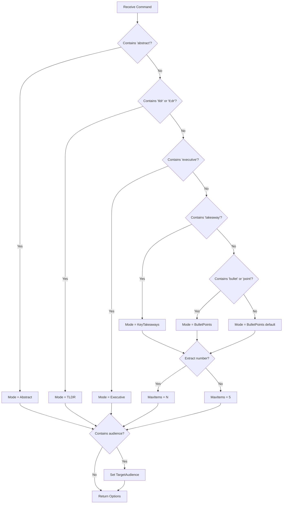
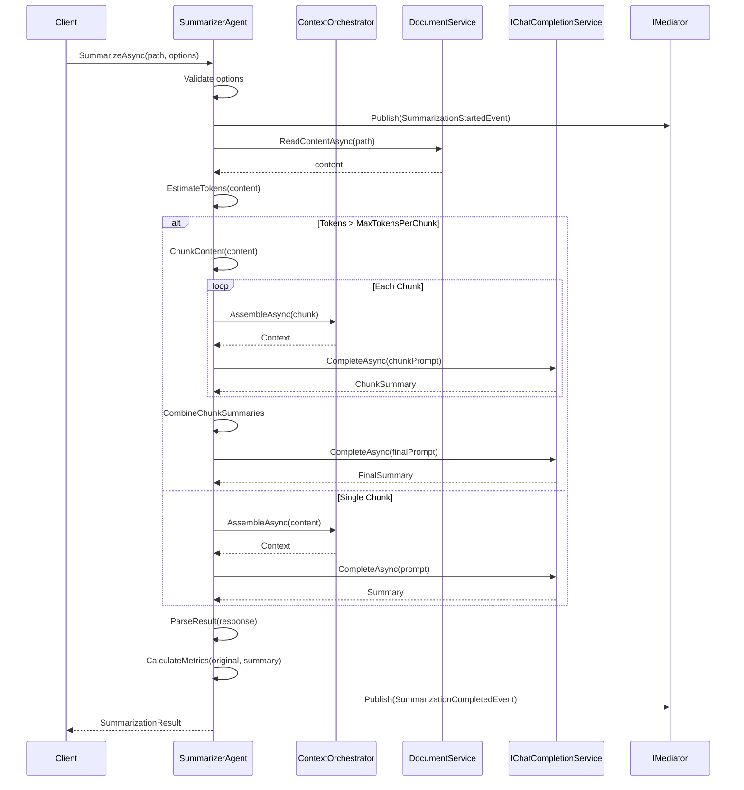

# LCS-DES-076a: Design Specification — Summarization Modes

## 1. Metadata & Categorization

| Field | Value | Description |
| :--- | :--- | :--- |
| **Feature ID** | `AGT-076a` | Sub-part of AGT-076 |
| **Feature Name** | `Summarization Modes (Abstract, TLDR, Bullet Points)` | Multiple output format support |
| **Target Version** | `v0.7.6a` | First sub-part of v0.7.6 |
| **Module Scope** | `Lexichord.Modules.Agents` | Agents module |
| **Swimlane** | `Ensemble` | Agent vertical |
| **License Tier** | `WriterPro` | Premium feature |
| **Feature Gate Key** | `FeatureFlags.Agents.Summarizer` | License gate key |
| **Author** | Lead Architect | |
| **Status** | `Draft` | |
| **Last Updated** | `2026-01-27` | |
| **Parent Document** | [LCS-DES-076-INDEX](./LCS-DES-076-INDEX.md) | |
| **Scope Breakdown** | [LCS-SBD-076 Section 3.1](./LCS-SBD-076.md#31-v076a-summarization-modes) | |

---

## 2. Executive Summary

### 2.1 The Requirement

Writers need flexible summarization options that match their specific use case:

- **Academic authors** require formal abstracts following scholarly conventions
- **Content creators** need quick TL;DR summaries for social sharing
- **Documentation teams** want structured bullet points for quick scanning
- **Business users** need executive summaries for stakeholders
- **All users** want natural language commands without memorizing specific syntax

Current manual summarization is time-consuming (30+ minutes) and inconsistent across documents.

### 2.2 The Proposed Solution

Implement a multi-mode summarization system that:

1. Supports six distinct output modes (Abstract, TLDR, BulletPoints, KeyTakeaways, Executive, Custom)
2. Parses natural language commands to infer the appropriate mode
3. Handles long documents through intelligent chunking
4. Maintains consistent output quality through carefully crafted prompts
5. Tracks token usage and compression ratios for transparency

---

## 3. Architecture & Modular Strategy

### 3.1 Dependencies

#### 3.1.1 Upstream Dependencies

| Interface | Source Version | Purpose |
| :--- | :--- | :--- |
| `IChatCompletionService` | v0.6.1a | LLM communication |
| `IPromptRenderer` | v0.6.3b | Template rendering |
| `IPromptTemplateRepository` | v0.6.3c | Template storage |
| `IAgent` | v0.6.6a | Base agent interface |
| `BaseAgent` | v0.7.3b | Agent base class |
| `IContextOrchestrator` | v0.7.2c | Context assembly |
| `IDocumentService` | v0.1.4a | Document access |
| `ILicenseContext` | v0.0.4c | License verification |

#### 3.1.2 NuGet Packages

| Package | Version | Purpose |
| :--- | :--- | :--- |
| (No new packages) | — | Uses existing dependencies |

### 3.2 Licensing Behavior

- **Load Behavior:** Soft Gate - Agent loads but returns "NotAuthorized" for unlicensed users
- **UI Gate:** Commands in Co-pilot show lock icon with "Upgrade to WriterPro" tooltip
- **Fallback Experience:**
  - Command "Summarize this" shows upgrade modal with feature description
  - Previously cached summaries viewable but not regeneratable

---

## 4. Data Contract (The API)

### 4.1 Enumerations

```csharp
namespace Lexichord.Modules.Agents.Abstractions;

/// <summary>
/// Defines the available summarization output formats.
/// Each mode produces a distinct summary style optimized for specific use cases.
/// </summary>
public enum SummarizationMode
{
    /// <summary>
    /// Academic-style abstract suitable for papers and formal documents.
    /// Output: 150-300 words in prose format.
    /// Structure: Purpose, methodology/approach, findings, implications.
    /// </summary>
    Abstract,

    /// <summary>
    /// Quick "Too Long; Didn't Read" summary for fast consumption.
    /// Output: 50-100 words in a single paragraph.
    /// Focus: Core takeaway in first sentence, essential context following.
    /// </summary>
    TLDR,

    /// <summary>
    /// Bullet-point list of key points.
    /// Output: 3-7 items (configurable via MaxItems).
    /// Format: Each bullet is one sentence, starts with action verb or key noun.
    /// </summary>
    BulletPoints,

    /// <summary>
    /// Numbered actionable insights with explanations.
    /// Output: 3-7 takeaways (configurable via MaxItems).
    /// Format: "**Takeaway N:** [insight]" followed by 1-2 sentence explanation.
    /// </summary>
    KeyTakeaways,

    /// <summary>
    /// Executive summary for stakeholders and decision-makers.
    /// Output: 100-200 words in business prose.
    /// Structure: Context, key findings, risks/opportunities, recommended actions.
    /// </summary>
    Executive,

    /// <summary>
    /// Custom format defined by user's own instructions.
    /// Output: Varies based on CustomPrompt.
    /// Requires: CustomPrompt field to be populated in options.
    /// </summary>
    Custom
}
```

### 4.2 Configuration Records

```csharp
namespace Lexichord.Modules.Agents.Abstractions;

/// <summary>
/// Configuration options for summarization requests.
/// Combines mode selection with output constraints and style preferences.
/// </summary>
public record SummarizationOptions
{
    /// <summary>
    /// The output format mode.
    /// Default: BulletPoints (most common use case).
    /// </summary>
    public SummarizationMode Mode { get; init; } = SummarizationMode.BulletPoints;

    /// <summary>
    /// Maximum number of items for list-based modes (BulletPoints, KeyTakeaways).
    /// Ignored for prose modes (Abstract, TLDR, Executive).
    /// Range: 1-10. Default: 5.
    /// </summary>
    public int MaxItems { get; init; } = 5;

    /// <summary>
    /// Target word count for prose modes (Abstract, TLDR, Executive).
    /// Null uses mode-specific defaults (Abstract: 200, TLDR: 75, Executive: 150).
    /// Ignored for list modes.
    /// </summary>
    public int? TargetWordCount { get; init; }

    /// <summary>
    /// Custom prompt override for Custom mode.
    /// Required when Mode = Custom; ignored otherwise.
    /// Example: "Summarize focusing on security implications"
    /// </summary>
    public string? CustomPrompt { get; init; }

    /// <summary>
    /// Whether to include section-level summaries for long documents.
    /// When true, each major heading gets its own mini-summary before final summary.
    /// Default: false (single unified summary).
    /// </summary>
    public bool IncludeSectionSummaries { get; init; } = false;

    /// <summary>
    /// Target audience for tone and complexity adjustment.
    /// Examples: "software developers", "executives", "general public"
    /// Null uses neutral tone suitable for general audience.
    /// </summary>
    public string? TargetAudience { get; init; }

    /// <summary>
    /// Whether to preserve technical terminology without simplification.
    /// When true, domain-specific terms retained as-is.
    /// When false, technical terms may be explained or replaced.
    /// Default: true.
    /// </summary>
    public bool PreserveTechnicalTerms { get; init; } = true;

    /// <summary>
    /// Maximum tokens to allocate for summarization response.
    /// Default: 2048 (sufficient for most summaries).
    /// Increase for IncludeSectionSummaries or very long KeyTakeaways.
    /// </summary>
    public int MaxResponseTokens { get; init; } = 2048;

    /// <summary>
    /// Validates the options configuration.
    /// </summary>
    /// <exception cref="ArgumentException">Thrown for invalid configuration.</exception>
    public void Validate()
    {
        if (MaxItems < 1 || MaxItems > 10)
            throw new ArgumentException("MaxItems must be between 1 and 10", nameof(MaxItems));

        if (TargetWordCount.HasValue && (TargetWordCount.Value < 10 || TargetWordCount.Value > 1000))
            throw new ArgumentException("TargetWordCount must be between 10 and 1000", nameof(TargetWordCount));

        if (Mode == SummarizationMode.Custom && string.IsNullOrWhiteSpace(CustomPrompt))
            throw new ArgumentException("CustomPrompt is required when Mode is Custom", nameof(CustomPrompt));
    }
}
```

### 4.3 Result Records

```csharp
namespace Lexichord.Modules.Agents.Abstractions;

/// <summary>
/// The result of a summarization operation.
/// Contains the generated summary along with metadata about the operation.
/// </summary>
public record SummarizationResult
{
    /// <summary>
    /// The generated summary content in Markdown format.
    /// For list modes, contains bullet/numbered list.
    /// For prose modes, contains paragraphs.
    /// </summary>
    public required string Summary { get; init; }

    /// <summary>
    /// The mode used to generate this summary.
    /// </summary>
    public SummarizationMode Mode { get; init; }

    /// <summary>
    /// Individual items extracted from the summary.
    /// Populated only for BulletPoints and KeyTakeaways modes.
    /// Each item is the text without bullet/number prefix.
    /// </summary>
    public IReadOnlyList<string>? Items { get; init; }

    /// <summary>
    /// Estimated reading time of the original document in minutes.
    /// Calculated at 200 words per minute.
    /// </summary>
    public int OriginalReadingMinutes { get; init; }

    /// <summary>
    /// Word count of the original document.
    /// </summary>
    public int OriginalWordCount { get; init; }

    /// <summary>
    /// Word count of the generated summary.
    /// </summary>
    public int SummaryWordCount { get; init; }

    /// <summary>
    /// Compression ratio (original words / summary words).
    /// Higher values indicate more aggressive summarization.
    /// Typical range: 5x - 20x.
    /// </summary>
    public double CompressionRatio { get; init; }

    /// <summary>
    /// Token usage for this summarization operation.
    /// </summary>
    public required UsageMetrics Usage { get; init; }

    /// <summary>
    /// Timestamp when the summary was generated.
    /// </summary>
    public DateTimeOffset GeneratedAt { get; init; } = DateTimeOffset.UtcNow;

    /// <summary>
    /// Model used to generate the summary.
    /// Example: "gpt-4o"
    /// </summary>
    public string? Model { get; init; }

    /// <summary>
    /// Whether the document required chunking due to length.
    /// True if document exceeded single-chunk token limit.
    /// </summary>
    public bool WasChunked { get; init; }

    /// <summary>
    /// Number of chunks the document was split into (if chunked).
    /// </summary>
    public int ChunkCount { get; init; } = 1;
}
```

### 4.4 Interface Definition

```csharp
namespace Lexichord.Modules.Agents.Abstractions;

/// <summary>
/// Specialized agent interface for document summarization.
/// Extends base IAgent with summarization-specific operations.
/// </summary>
public interface ISummarizerAgent : IAgent
{
    /// <summary>
    /// Generates a summary of the document at the specified path.
    /// </summary>
    /// <param name="documentPath">Absolute path to the document to summarize.</param>
    /// <param name="options">Summarization configuration options.</param>
    /// <param name="ct">Cancellation token.</param>
    /// <returns>The summarization result with generated summary and metadata.</returns>
    /// <exception cref="FileNotFoundException">Document not found at path.</exception>
    /// <exception cref="UnauthorizedException">User lacks WriterPro license.</exception>
    Task<SummarizationResult> SummarizeAsync(
        string documentPath,
        SummarizationOptions options,
        CancellationToken ct = default);

    /// <summary>
    /// Generates a summary of the provided content directly.
    /// Use for selections, excerpts, or content not stored in files.
    /// </summary>
    /// <param name="content">Text content to summarize.</param>
    /// <param name="options">Summarization configuration options.</param>
    /// <param name="ct">Cancellation token.</param>
    /// <returns>The summarization result with generated summary and metadata.</returns>
    /// <exception cref="ArgumentException">Content is null or empty.</exception>
    /// <exception cref="UnauthorizedException">User lacks WriterPro license.</exception>
    Task<SummarizationResult> SummarizeContentAsync(
        string content,
        SummarizationOptions options,
        CancellationToken ct = default);

    /// <summary>
    /// Parses a natural language command and returns appropriate summarization options.
    /// </summary>
    /// <param name="naturalLanguageCommand">User's natural language request.</param>
    /// <returns>Parsed options matching the user's intent.</returns>
    /// <example>
    /// "Summarize in 3 bullets" -> SummarizationOptions { Mode = BulletPoints, MaxItems = 3 }
    /// "Create an abstract" -> SummarizationOptions { Mode = Abstract }
    /// "TLDR for developers" -> SummarizationOptions { Mode = TLDR, TargetAudience = "developers" }
    /// </example>
    SummarizationOptions ParseCommand(string naturalLanguageCommand);

    /// <summary>
    /// Gets the default options for a given mode.
    /// </summary>
    /// <param name="mode">The summarization mode.</param>
    /// <returns>Default options optimized for the mode.</returns>
    SummarizationOptions GetDefaultOptions(SummarizationMode mode);
}
```

---

## 5. Implementation Logic

### 5.1 Command Parsing Flow



### 5.2 Summarization Flow



### 5.3 Document Chunking Strategy

```text
CHUNKING ALGORITHM:
│
├── Constants:
│   ├── MaxTokensPerChunk = 4000
│   ├── ChunkOverlapTokens = 100
│   └── TargetChunksPerSummary = 3
│
├── Input: document content
│
├── Step 1: Estimate total tokens
│   └── tokens = content.Length / 4 (approximation)
│
├── Step 2: Determine chunking need
│   ├── tokens <= MaxTokensPerChunk?
│   │   └── Return [content] (single chunk)
│   └── tokens > MaxTokensPerChunk?
│       └── Proceed to chunking
│
├── Step 3: Identify chunk boundaries
│   ├── Primary: Split on section headings (## or ###)
│   ├── Secondary: Split on paragraph breaks (\n\n)
│   └── Tertiary: Split on sentence boundaries (. )
│
├── Step 4: Build chunks
│   ├── Initialize currentChunk = empty
│   ├── For each segment:
│   │   ├── If currentChunk + segment > MaxTokensPerChunk:
│   │   │   ├── Finalize currentChunk
│   │   │   ├── Add overlap from end of previous chunk
│   │   │   └── Start new chunk with overlap + segment
│   │   └── Else:
│   │       └── Append segment to currentChunk
│   └── Finalize last chunk
│
├── Step 5: Preserve context
│   ├── Each chunk includes document title (if available)
│   ├── Each chunk includes current section heading
│   └── Each chunk includes position indicator (Chunk N of M)
│
└── Output: List<string> chunks
```

### 5.4 Mode-Specific Prompt Construction

| Mode | System Prompt Focus | User Prompt Structure | Output Constraints |
| :--- | :--- | :--- | :--- |
| **Abstract** | Academic writing conventions, structure (purpose, method, findings, implications) | "Generate an abstract for..." | 150-300 words, prose |
| **TLDR** | Brevity, core message first, accessible language | "Generate a TL;DR summary..." | 50-100 words, single paragraph |
| **BulletPoints** | Parallel structure, action verbs, one sentence per bullet | "Summarize in {N} bullet points..." | Exactly N items, max 25 words each |
| **KeyTakeaways** | Actionable insights, practical implications | "Extract {N} key takeaways..." | N numbered items with explanations |
| **Executive** | Business context, strategic importance, next steps | "Generate an executive summary..." | 100-200 words, business prose |
| **Custom** | Follow user instructions precisely | "{CustomPrompt}" | User-defined |

---

## 6. Prompt Templates

### 6.1 System Prompt Template

```yaml
template_id: "specialist-summarizer"
name: "Summarizer Specialist"
version: "1.0.0"

system_prompt: |
  You are a professional content summarizer focused on distilling documents into clear, actionable summaries.
  Your role is to extract the essential information while preserving accuracy and the author's intent.

  ## Core Guidelines

  1. **Accuracy First**: Never invent or assume information not present in the source document.
  2. **Preserve Key Terms**: Retain proper nouns, technical terms, and domain-specific vocabulary exactly as written.
  3. **Capture Essence**: Identify the main thesis, supporting arguments, and conclusions.
  4. **Maintain Objectivity**: Summarize what the author says, not your interpretation.

  {{#target_audience}}
  ## Target Audience
  Adapt your summary for: {{target_audience}}
  - Use vocabulary appropriate for this audience
  - Emphasize aspects most relevant to their needs
  - Adjust technical depth accordingly
  {{/target_audience}}

  {{#preserve_technical_terms}}
  ## Technical Terms
  Preserve all technical terms and domain-specific vocabulary exactly as they appear in the source.
  Do not simplify or explain technical terms unless explicitly asked.
  {{/preserve_technical_terms}}
  {{^preserve_technical_terms}}
  ## Technical Terms
  You may explain or simplify technical terms for broader accessibility.
  Consider adding brief parenthetical definitions for specialized vocabulary.
  {{/preserve_technical_terms}}

  ## Mode-Specific Instructions
  {{mode_instructions}}

mode_instructions:
  abstract: |
    Generate an academic-style abstract following this structure:

    1. **Opening**: State the document's purpose or problem addressed in the first sentence
    2. **Approach**: Briefly describe the methodology, framework, or approach used
    3. **Findings**: Present the key findings, arguments, or contributions
    4. **Implications**: Conclude with significance, applications, or future directions

    Requirements:
    - Length: {{target_word_count}} words (target range: 150-300 words)
    - Style: Formal, third-person, passive voice acceptable
    - Tense: Present tense for general claims, past tense for specific findings
    - No citations or references in the abstract itself

  tldr: |
    Generate a TL;DR (Too Long; Didn't Read) summary with these characteristics:

    1. **First Sentence**: The single most important takeaway or conclusion
    2. **Supporting Context**: 2-3 additional sentences providing essential context
    3. **Accessibility**: Use clear, accessible language suitable for quick scanning

    Requirements:
    - Length: {{target_word_count}} words (target range: 50-100 words)
    - Format: Single paragraph, no bullet points or headers
    - Tone: Direct and informative, slightly informal acceptable
    - Focus: "What do I need to know?" perspective

  bullet_points: |
    Generate a bullet-point summary with exactly {{max_items}} items:

    Requirements for each bullet:
    1. Start with an action verb or key noun (not "This document..." or "The author...")
    2. One complete thought per bullet, maximum 25 words
    3. Cover distinct aspects - avoid redundancy between bullets
    4. Order by importance (most critical point first)

    Format:
    - Use "•" for bullet markers
    - No sub-bullets or nested lists
    - No bold or italic formatting within bullets
    - Each bullet should stand alone as a complete statement

  key_takeaways: |
    Extract exactly {{max_items}} actionable key takeaways:

    Format for each takeaway:
    ```
    **Takeaway N:** [One-sentence insight that can be acted upon]

    [1-2 sentence explanation of why this matters or how to apply it]
    ```

    Requirements:
    - Focus on practical, actionable insights
    - Each takeaway should be independently valuable
    - Order by actionability and impact
    - Include concrete recommendations where applicable

  executive: |
    Generate an executive summary suitable for stakeholders and decision-makers:

    Structure:
    1. **Context**: One sentence on what this document addresses
    2. **Key Findings**: 2-3 sentences on the most important outcomes
    3. **Strategic Implications**: Risks, opportunities, or decisions required
    4. **Recommended Actions**: Clear next steps if applicable

    Requirements:
    - Length: {{target_word_count}} words (target range: 100-200 words)
    - Tone: Professional, confident, action-oriented
    - Focus: Business impact and strategic relevance
    - Avoid: Technical jargon unless essential for understanding

  custom: |
    Follow the user's custom instructions precisely:

    {{custom_prompt}}

    Apply general summarization best practices while adhering to the specific requirements above.
```

### 6.2 User Prompt Template

```yaml
user_prompt: |
  {{#mode_is_abstract}}
  Generate an academic-style abstract for the following document.
  Target length: approximately {{target_word_count}} words.
  {{/mode_is_abstract}}

  {{#mode_is_tldr}}
  Generate a TL;DR summary for the following document.
  Keep it concise: approximately {{target_word_count}} words in a single paragraph.
  {{/mode_is_tldr}}

  {{#mode_is_bullets}}
  Summarize the following document in exactly {{max_items}} bullet points.
  Start each bullet with an action verb or key concept.
  {{/mode_is_bullets}}

  {{#mode_is_takeaways}}
  Extract exactly {{max_items}} key takeaways from the following document.
  Format each as "**Takeaway N:** [insight]" followed by a brief explanation.
  {{/mode_is_takeaways}}

  {{#mode_is_executive}}
  Generate an executive summary of the following document for stakeholders.
  Target length: approximately {{target_word_count}} words.
  Focus on strategic implications and recommended actions.
  {{/mode_is_executive}}

  {{#mode_is_custom}}
  {{custom_prompt}}
  {{/mode_is_custom}}

  ---

  **Document Content:**

  {{#document_title}}
  # {{document_title}}

  {{/document_title}}
  {{document_content}}

  ---

  {{#is_chunked}}
  Note: This is part {{chunk_number}} of {{total_chunks}} chunks from a longer document.
  {{#chunk_context}}
  Current section: {{chunk_context}}
  {{/chunk_context}}
  {{/is_chunked}}
```

---

## 7. Test Scenarios

### 7.1 Command Parsing Tests

```csharp
[Trait("Category", "Unit")]
[Trait("Version", "v0.7.6a")]
public class SummarizationCommandParserTests
{
    private readonly ISummarizerAgent _sut;

    public SummarizationCommandParserTests()
    {
        _sut = CreateSummarizerAgent();
    }

    #region Mode Detection Tests

    [Theory]
    [InlineData("Summarize this", SummarizationMode.BulletPoints)]
    [InlineData("Summarize", SummarizationMode.BulletPoints)]
    [InlineData("Can you summarize this document?", SummarizationMode.BulletPoints)]
    public void ParseCommand_DefaultCommand_ReturnsBulletPoints(
        string command, SummarizationMode expectedMode)
    {
        var result = _sut.ParseCommand(command);

        result.Mode.Should().Be(expectedMode);
        result.MaxItems.Should().Be(5);
    }

    [Theory]
    [InlineData("Create an abstract", SummarizationMode.Abstract)]
    [InlineData("Write an abstract for this paper", SummarizationMode.Abstract)]
    [InlineData("Generate academic abstract", SummarizationMode.Abstract)]
    public void ParseCommand_AbstractKeywords_ReturnsAbstractMode(
        string command, SummarizationMode expectedMode)
    {
        var result = _sut.ParseCommand(command);

        result.Mode.Should().Be(expectedMode);
    }

    [Theory]
    [InlineData("TLDR", SummarizationMode.TLDR)]
    [InlineData("TL;DR please", SummarizationMode.TLDR)]
    [InlineData("Give me a tldr", SummarizationMode.TLDR)]
    [InlineData("Too long didn't read version", SummarizationMode.TLDR)]
    public void ParseCommand_TLDRKeywords_ReturnsTLDRMode(
        string command, SummarizationMode expectedMode)
    {
        var result = _sut.ParseCommand(command);

        result.Mode.Should().Be(expectedMode);
    }

    [Theory]
    [InlineData("Executive summary", SummarizationMode.Executive)]
    [InlineData("Summarize for stakeholders", SummarizationMode.Executive)]
    [InlineData("Summary for management", SummarizationMode.Executive)]
    public void ParseCommand_ExecutiveKeywords_ReturnsExecutiveMode(
        string command, SummarizationMode expectedMode)
    {
        var result = _sut.ParseCommand(command);

        result.Mode.Should().Be(expectedMode);
    }

    [Theory]
    [InlineData("Key takeaways", SummarizationMode.KeyTakeaways)]
    [InlineData("What are the insights?", SummarizationMode.KeyTakeaways)]
    [InlineData("Main learnings from this", SummarizationMode.KeyTakeaways)]
    public void ParseCommand_TakeawayKeywords_ReturnsKeyTakeawaysMode(
        string command, SummarizationMode expectedMode)
    {
        var result = _sut.ParseCommand(command);

        result.Mode.Should().Be(expectedMode);
    }

    #endregion

    #region Item Count Extraction Tests

    [Theory]
    [InlineData("Summarize in 3 bullets", 3)]
    [InlineData("Give me 5 key points", 5)]
    [InlineData("7 bullet summary", 7)]
    [InlineData("Summarize in three points", 5)] // "three" not parsed as number
    public void ParseCommand_WithNumber_ExtractsMaxItems(
        string command, int expectedMaxItems)
    {
        var result = _sut.ParseCommand(command);

        result.MaxItems.Should().Be(expectedMaxItems);
    }

    [Theory]
    [InlineData("3 key takeaways", 3)]
    [InlineData("Give me 10 takeaways", 10)]
    public void ParseCommand_TakeawaysWithNumber_ExtractsMaxItems(
        string command, int expectedMaxItems)
    {
        var result = _sut.ParseCommand(command);

        result.Mode.Should().Be(SummarizationMode.KeyTakeaways);
        result.MaxItems.Should().Be(expectedMaxItems);
    }

    #endregion

    #region Audience Extraction Tests

    [Theory]
    [InlineData("Summarize for developers", "developers")]
    [InlineData("TLDR for a technical audience", "technical audience")]
    [InlineData("Executive summary for the board", "the board")]
    public void ParseCommand_WithAudience_ExtractsTargetAudience(
        string command, string expectedAudienceContains)
    {
        var result = _sut.ParseCommand(command);

        result.TargetAudience.Should().Contain(expectedAudienceContains);
    }

    #endregion
}
```

### 7.2 Summarization Output Tests

```csharp
[Trait("Category", "Unit")]
[Trait("Version", "v0.7.6a")]
public class SummarizationOutputTests
{
    [Fact]
    public async Task SummarizeAsync_BulletPointsMode_ReturnsExactItemCount()
    {
        // Arrange
        var options = new SummarizationOptions
        {
            Mode = SummarizationMode.BulletPoints,
            MaxItems = 5
        };
        var mockLlm = CreateMockLlmReturning(FiveBulletResponse);
        var sut = CreateSummarizerAgent(mockLlm);

        // Act
        var result = await sut.SummarizeContentAsync(SampleDocument, options);

        // Assert
        result.Mode.Should().Be(SummarizationMode.BulletPoints);
        result.Items.Should().HaveCount(5);
        result.Summary.Should().Contain("•");
    }

    [Fact]
    public async Task SummarizeAsync_AbstractMode_ReturnsProseInTargetRange()
    {
        // Arrange
        var options = new SummarizationOptions
        {
            Mode = SummarizationMode.Abstract,
            TargetWordCount = 200
        };
        var mockLlm = CreateMockLlmReturning(AbstractResponse);
        var sut = CreateSummarizerAgent(mockLlm);

        // Act
        var result = await sut.SummarizeContentAsync(SampleDocument, options);

        // Assert
        result.Mode.Should().Be(SummarizationMode.Abstract);
        result.SummaryWordCount.Should().BeInRange(150, 300);
        result.Items.Should().BeNull(); // Prose mode, no items
    }

    [Fact]
    public async Task SummarizeAsync_TLDRMode_ReturnsSingleParagraph()
    {
        // Arrange
        var options = new SummarizationOptions { Mode = SummarizationMode.TLDR };
        var mockLlm = CreateMockLlmReturning(TLDRResponse);
        var sut = CreateSummarizerAgent(mockLlm);

        // Act
        var result = await sut.SummarizeContentAsync(SampleDocument, options);

        // Assert
        result.Mode.Should().Be(SummarizationMode.TLDR);
        result.Summary.Should().NotContain("\n\n"); // Single paragraph
        result.SummaryWordCount.Should().BeInRange(50, 100);
    }

    [Fact]
    public async Task SummarizeAsync_KeyTakeawaysMode_ReturnsFormattedTakeaways()
    {
        // Arrange
        var options = new SummarizationOptions
        {
            Mode = SummarizationMode.KeyTakeaways,
            MaxItems = 3
        };
        var mockLlm = CreateMockLlmReturning(KeyTakeawaysResponse);
        var sut = CreateSummarizerAgent(mockLlm);

        // Act
        var result = await sut.SummarizeContentAsync(SampleDocument, options);

        // Assert
        result.Mode.Should().Be(SummarizationMode.KeyTakeaways);
        result.Summary.Should().Contain("**Takeaway 1:**");
        result.Summary.Should().Contain("**Takeaway 2:**");
        result.Summary.Should().Contain("**Takeaway 3:**");
    }

    [Fact]
    public async Task SummarizeAsync_CalculatesCompressionRatio()
    {
        // Arrange
        var content = GenerateWords(1000); // 1000 word document
        var options = new SummarizationOptions { Mode = SummarizationMode.TLDR };
        var mockLlm = CreateMockLlmReturning("This is a 50 word summary..."); // ~50 words
        var sut = CreateSummarizerAgent(mockLlm);

        // Act
        var result = await sut.SummarizeContentAsync(content, options);

        // Assert
        result.OriginalWordCount.Should().BeCloseTo(1000, 50);
        result.CompressionRatio.Should().BeGreaterThan(10); // At least 10x compression
    }
}
```

### 7.3 Chunking Tests

```csharp
[Trait("Category", "Unit")]
[Trait("Version", "v0.7.6a")]
public class DocumentChunkingTests
{
    [Fact]
    public async Task SummarizeAsync_ShortDocument_ProcessesAsSingleChunk()
    {
        // Arrange
        var content = GenerateWords(500); // Well under token limit
        var options = new SummarizationOptions { Mode = SummarizationMode.BulletPoints };
        var mockLlm = new Mock<IChatCompletionService>();
        mockLlm.Setup(l => l.CompleteAsync(It.IsAny<ChatRequest>(), It.IsAny<CancellationToken>()))
            .ReturnsAsync(new ChatResponse("• Point 1\n• Point 2", 100, 50));
        var sut = CreateSummarizerAgent(mockLlm.Object);

        // Act
        var result = await sut.SummarizeContentAsync(content, options);

        // Assert
        result.WasChunked.Should().BeFalse();
        result.ChunkCount.Should().Be(1);
        mockLlm.Verify(l => l.CompleteAsync(It.IsAny<ChatRequest>(), It.IsAny<CancellationToken>()),
            Times.Once());
    }

    [Fact]
    public async Task SummarizeAsync_LongDocument_ChunksAndCombines()
    {
        // Arrange
        var content = GenerateWords(10000); // Exceeds token limit
        var options = new SummarizationOptions { Mode = SummarizationMode.BulletPoints };
        var mockLlm = new Mock<IChatCompletionService>();
        mockLlm.Setup(l => l.CompleteAsync(It.IsAny<ChatRequest>(), It.IsAny<CancellationToken>()))
            .ReturnsAsync(new ChatResponse("• Summary point", 100, 50));
        var sut = CreateSummarizerAgent(mockLlm.Object);

        // Act
        var result = await sut.SummarizeContentAsync(content, options);

        // Assert
        result.WasChunked.Should().BeTrue();
        result.ChunkCount.Should().BeGreaterThan(1);
        // LLM called multiple times: once per chunk + final combination
        mockLlm.Verify(l => l.CompleteAsync(It.IsAny<ChatRequest>(), It.IsAny<CancellationToken>()),
            Times.AtLeast(2));
    }

    [Fact]
    public void ChunkContent_PreservesSectionBoundaries()
    {
        // Arrange
        var content = @"
## Section 1
Content for section 1...

## Section 2
Content for section 2...

## Section 3
Content for section 3...
";
        var sut = CreateSummarizerAgent();

        // Act (using reflection or internal method if needed)
        var chunks = sut.ChunkContent(content);

        // Assert
        // Each chunk should start at a section boundary where possible
        foreach (var chunk in chunks.Skip(1)) // First chunk may not start with heading
        {
            chunk.TrimStart().Should().StartWith("##");
        }
    }
}
```

---

## 8. Observability & Logging

| Level | Source | Message Template |
| :--- | :--- | :--- |
| Debug | SummarizerAgent | `"Summarization started: Mode={Mode}, MaxItems={MaxItems}, DocumentLength={Length}"` |
| Debug | SummarizerAgent | `"Token estimate: {TokenCount}, requires chunking: {RequiresChunking}"` |
| Debug | SummarizerAgent | `"Processing chunk {ChunkNumber} of {TotalChunks}"` |
| Info | SummarizerAgent | `"Summarization completed: {OriginalWords} -> {SummaryWords} words ({CompressionRatio:F1}x compression)"` |
| Info | SummarizerAgent | `"Command parsed: '{Command}' -> Mode={Mode}, MaxItems={MaxItems}"` |
| Warning | SummarizerAgent | `"Summary exceeds target word count: {ActualWords} > {TargetWords}"` |
| Warning | SummarizerAgent | `"Chunk {ChunkNumber} exceeds recommended size: {TokenCount} tokens"` |
| Error | SummarizerAgent | `"Summarization failed: {ErrorMessage}"` |

---

## 9. Security & Safety

| Risk | Level | Mitigation |
| :--- | :--- | :--- |
| Prompt injection via document | Medium | Sanitize document content before embedding in prompt |
| PII in summaries | Low | Summaries reflect document content; user controls source |
| Token exhaustion | Medium | Enforce MaxResponseTokens limit; chunking for long docs |
| Cost overruns | Medium | Track and report token usage; configurable limits |

---

## 10. Acceptance Criteria

### 10.1 Functional Criteria

| # | Given | When | Then |
| :--- | :--- | :--- | :--- |
| 1 | User with WriterPro license | "Summarize this" | Returns BulletPoints with 5 items |
| 2 | User with WriterPro license | "Summarize in 3 bullets" | Returns exactly 3 bullet items |
| 3 | User with WriterPro license | "Create an abstract" | Returns 150-300 word abstract |
| 4 | User with WriterPro license | "TLDR" | Returns 50-100 word single paragraph |
| 5 | User with WriterPro license | "5 key takeaways" | Returns 5 numbered takeaways with explanations |
| 6 | User with WriterPro license | "Executive summary" | Returns 100-200 word business summary |
| 7 | User with Free license | Any summarize command | Returns "Upgrade to WriterPro" message |
| 8 | Document > 10,000 words | Summarize request | Chunks document and combines results |
| 9 | Invalid MaxItems (> 10) | Create options | Throws ArgumentException |
| 10 | Custom mode without prompt | Create options | Throws ArgumentException |

### 10.2 Performance Criteria

| # | Scenario | Target |
| :--- | :--- | :--- |
| 1 | Command parsing | < 10ms |
| 2 | 1,000 word document summarization | < 5 seconds (excluding LLM time) |
| 3 | 10,000 word document summarization | < 15 seconds (excluding LLM time) |
| 4 | Token estimation | < 50ms for 50,000 words |

---

## 11. Deliverable Checklist

| # | Deliverable | Status |
| :--- | :--- | :--- |
| 1 | `SummarizationMode.cs` enumeration | [ ] |
| 2 | `SummarizationOptions.cs` record | [ ] |
| 3 | `SummarizationResult.cs` record | [ ] |
| 4 | `ISummarizerAgent.cs` interface | [ ] |
| 5 | `SummarizerAgent.cs` implementation | [ ] |
| 6 | `specialist-summarizer.yaml` prompt template | [ ] |
| 7 | Command parser implementation | [ ] |
| 8 | Document chunking implementation | [ ] |
| 9 | Unit tests for command parsing | [ ] |
| 10 | Unit tests for summarization output | [ ] |
| 11 | Unit tests for chunking | [ ] |
| 12 | Integration with IAgentRegistry | [ ] |

---

## 12. Verification Commands

```bash
# Run all v0.7.6a tests
dotnet test --filter "Version=v0.7.6a" --logger "console;verbosity=detailed"

# Run command parsing tests only
dotnet test --filter "FullyQualifiedName~SummarizationCommandParserTests"

# Run output format tests only
dotnet test --filter "FullyQualifiedName~SummarizationOutputTests"

# Run chunking tests only
dotnet test --filter "FullyQualifiedName~DocumentChunkingTests"

# Verify template file exists
ls src/Lexichord.Modules.Agents/Prompts/specialist-summarizer.yaml

# Verify DI registration
dotnet run --project src/Lexichord.Host -- --verify-services ISummarizerAgent
```

---

## Document History

| Version | Date | Author | Changes |
| :--- | :--- | :--- | :--- |
| 1.0 | 2026-01-27 | Lead Architect | Initial draft |

---
