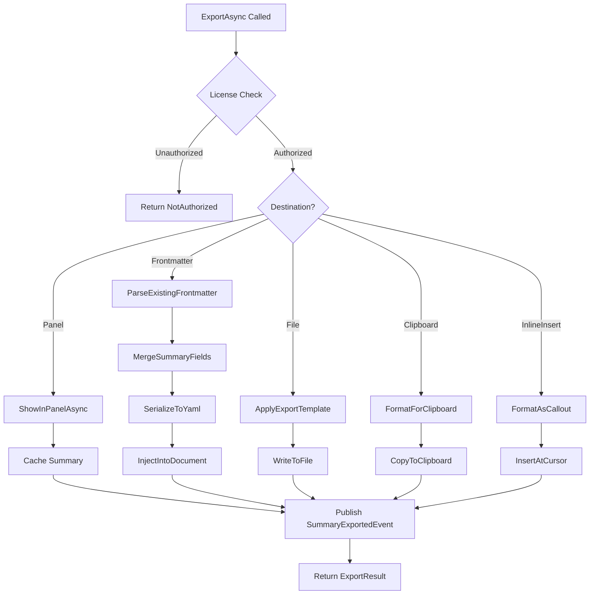

# LCS-DES-076c: Design Specification — Export Formats

## 1. Metadata & Categorization

| Field | Value | Description |
| :--- | :--- | :--- |
| **Feature ID** | `AGT-076c` | Sub-part of AGT-076 |
| **Feature Name** | `Export Formats (Markdown Summary Panel)` | Multi-destination summary export |
| **Target Version** | `v0.7.6c` | Third sub-part of v0.7.6 |
| **Module Scope** | `Lexichord.Modules.Agents` | Agents module |
| **Swimlane** | `Ensemble` | Agent vertical |
| **License Tier** | `WriterPro` | Premium feature |
| **Feature Gate Key** | `FeatureFlags.Agents.Summarizer` | License gate key |
| **Author** | Lead Architect | |
| **Status** | `Draft` | |
| **Last Updated** | `2026-01-27` | |
| **Parent Document** | [LCS-DES-076-INDEX](./LCS-DES-076-INDEX.md) | |
| **Scope Breakdown** | [LCS-SBD-076 Section 3.3](./LCS-SBD-076.md#33-v076c-export-formats) | |

---

## 2. Executive Summary

### 2.1 The Requirement

Generated summaries and metadata need to be accessible in multiple contexts:

- **Panel display** for quick reference while editing
- **Frontmatter injection** for embedded document metadata
- **File export** for standalone summary documents
- **Clipboard** for pasting into other applications
- **Inline insertion** for adding summaries directly into documents

Users need flexibility in how and where they use generated content.

### 2.2 The Proposed Solution

Implement a unified export system with:

1. Dedicated Summary Panel UI for persistent display
2. YAML frontmatter injection with intelligent merging
3. Standalone file export with configurable templates
4. Clipboard export for quick sharing
5. Inline insertion at cursor position
6. Persistent caching for previously generated summaries

---

## 3. Architecture & Modular Strategy

### 3.1 Dependencies

#### 3.1.1 Upstream Dependencies

| Interface | Source Version | Purpose |
| :--- | :--- | :--- |
| `SummarizationResult` | v0.7.6a | Summary data to export |
| `DocumentMetadata` | v0.7.6b | Metadata to export |
| `IDocumentService` | v0.1.4a | File operations |
| `IEditorService` | v0.1.3a | Cursor insertion, frontmatter |
| `IClipboardService` | v0.1.x | Clipboard operations |
| `ILayoutService` | v0.0.5a | Panel management |
| `ILicenseContext` | v0.0.4c | License verification |
| `IMediator` | v0.0.7a | Event publishing |

#### 3.1.2 NuGet Packages

| Package | Version | Purpose |
| :--- | :--- | :--- |
| `YamlDotNet` | 15.x | Frontmatter serialization |
| `Avalonia.Controls` | 11.x | UI components (existing) |

### 3.2 Licensing Behavior

- **Load Behavior:** Soft Gate - Export functions return "NotAuthorized" for lower tiers
- **UI Gate:** Export buttons show lock icons; panel shows "WriterPro" badge
- **Fallback Experience:** Cached summaries viewable but not exportable or regeneratable

---

## 4. Data Contract (The API)

### 4.1 Enumerations

```csharp
namespace Lexichord.Modules.Agents.Abstractions;

/// <summary>
/// Destination options for summary export.
/// </summary>
public enum ExportDestination
{
    /// <summary>
    /// Display in the dedicated Summary Panel.
    /// Summary persists in panel until document changes or user clears.
    /// </summary>
    Panel,

    /// <summary>
    /// Inject into document's YAML frontmatter.
    /// Creates or updates the frontmatter block at document start.
    /// </summary>
    Frontmatter,

    /// <summary>
    /// Create a standalone summary file.
    /// File created alongside source document or at specified path.
    /// </summary>
    File,

    /// <summary>
    /// Copy formatted summary to system clipboard.
    /// Ready for pasting into other applications.
    /// </summary>
    Clipboard,

    /// <summary>
    /// Insert at current cursor position in editor.
    /// Creates a formatted summary block in the document.
    /// </summary>
    InlineInsert
}

/// <summary>
/// Flags for which frontmatter fields to include.
/// </summary>
[Flags]
public enum FrontmatterFields
{
    /// <summary>No fields (clear summary from frontmatter).</summary>
    None = 0,

    /// <summary>Include abstract/summary text.</summary>
    Abstract = 1,

    /// <summary>Include suggested tags.</summary>
    Tags = 2,

    /// <summary>Include key terms.</summary>
    KeyTerms = 4,

    /// <summary>Include reading time estimate.</summary>
    ReadingTime = 8,

    /// <summary>Include primary category.</summary>
    Category = 16,

    /// <summary>Include target audience.</summary>
    Audience = 32,

    /// <summary>Include generation timestamp.</summary>
    GeneratedAt = 64,

    /// <summary>Include all available fields.</summary>
    All = Abstract | Tags | KeyTerms | ReadingTime | Category | Audience | GeneratedAt
}
```

### 4.2 Configuration Records

```csharp
namespace Lexichord.Modules.Agents.Abstractions;

/// <summary>
/// Configuration for summary export operations.
/// </summary>
public record ExportOptions
{
    /// <summary>
    /// Where to export the summary.
    /// </summary>
    public ExportDestination Destination { get; init; } = ExportDestination.Panel;

    /// <summary>
    /// For File destination: the output file path.
    /// If null, auto-generates as "{document-name}.summary.md".
    /// </summary>
    public string? OutputPath { get; init; }

    /// <summary>
    /// For Frontmatter destination: which fields to include.
    /// Default: All fields.
    /// </summary>
    public FrontmatterFields Fields { get; init; } = FrontmatterFields.All;

    /// <summary>
    /// Whether to overwrite existing summary data.
    /// When false, merges with existing data.
    /// </summary>
    public bool Overwrite { get; init; } = true;

    /// <summary>
    /// For File destination: include document metadata in export.
    /// </summary>
    public bool IncludeMetadata { get; init; } = true;

    /// <summary>
    /// For File destination: include source document reference.
    /// </summary>
    public bool IncludeSourceReference { get; init; } = true;

    /// <summary>
    /// Custom template for file export format.
    /// Uses Mustache-style placeholders: {{summary}}, {{metadata}}, etc.
    /// </summary>
    public string? ExportTemplate { get; init; }

    /// <summary>
    /// For Clipboard: format as Markdown (true) or plain text (false).
    /// </summary>
    public bool ClipboardAsMarkdown { get; init; } = true;

    /// <summary>
    /// For InlineInsert: wrap summary in a callout/admonition block.
    /// </summary>
    public bool UseCalloutBlock { get; init; } = true;

    /// <summary>
    /// For InlineInsert: callout type (info, note, tip, warning).
    /// </summary>
    public string CalloutType { get; init; } = "info";
}

/// <summary>
/// Result of an export operation.
/// </summary>
public record ExportResult
{
    /// <summary>
    /// Whether the export succeeded.
    /// </summary>
    public bool Success { get; init; }

    /// <summary>
    /// The destination where content was exported.
    /// </summary>
    public ExportDestination Destination { get; init; }

    /// <summary>
    /// For File exports: the path to the created file.
    /// </summary>
    public string? OutputPath { get; init; }

    /// <summary>
    /// Error message if export failed.
    /// </summary>
    public string? ErrorMessage { get; init; }

    /// <summary>
    /// Number of bytes written (for file exports).
    /// </summary>
    public long? BytesWritten { get; init; }

    /// <summary>
    /// Number of characters written (for clipboard/inline).
    /// </summary>
    public int? CharactersWritten { get; init; }

    /// <summary>
    /// Whether existing content was overwritten.
    /// </summary>
    public bool DidOverwrite { get; init; }

    /// <summary>
    /// Export timestamp.
    /// </summary>
    public DateTimeOffset ExportedAt { get; init; } = DateTimeOffset.UtcNow;

    /// <summary>
    /// Creates a successful result.
    /// </summary>
    public static ExportResult Succeeded(ExportDestination destination, string? outputPath = null) =>
        new() { Success = true, Destination = destination, OutputPath = outputPath };

    /// <summary>
    /// Creates a failed result.
    /// </summary>
    public static ExportResult Failed(ExportDestination destination, string errorMessage) =>
        new() { Success = false, Destination = destination, ErrorMessage = errorMessage };
}

/// <summary>
/// Cached summary with metadata for persistence.
/// </summary>
public record CachedSummary
{
    /// <summary>
    /// The source document path.
    /// </summary>
    public required string DocumentPath { get; init; }

    /// <summary>
    /// Hash of document content when summary was generated.
    /// Used to detect if document has changed.
    /// </summary>
    public required string ContentHash { get; init; }

    /// <summary>
    /// The generated summary result.
    /// </summary>
    public required SummarizationResult Summary { get; init; }

    /// <summary>
    /// The extracted metadata (if available).
    /// </summary>
    public DocumentMetadata? Metadata { get; init; }

    /// <summary>
    /// When the cache entry was created.
    /// </summary>
    public DateTimeOffset CachedAt { get; init; } = DateTimeOffset.UtcNow;

    /// <summary>
    /// Cache entry expiration (default: 7 days).
    /// </summary>
    public DateTimeOffset ExpiresAt { get; init; } = DateTimeOffset.UtcNow.AddDays(7);
}
```

### 4.3 Interface Definition

```csharp
namespace Lexichord.Modules.Agents.Abstractions;

/// <summary>
/// Interface for exporting summaries to various destinations.
/// </summary>
public interface ISummaryExporter
{
    /// <summary>
    /// Exports a summarization result to the specified destination.
    /// </summary>
    /// <param name="summary">The summary to export.</param>
    /// <param name="sourceDocumentPath">Path to the source document.</param>
    /// <param name="options">Export configuration options.</param>
    /// <param name="ct">Cancellation token.</param>
    /// <returns>Result of the export operation.</returns>
    Task<ExportResult> ExportAsync(
        SummarizationResult summary,
        string sourceDocumentPath,
        ExportOptions options,
        CancellationToken ct = default);

    /// <summary>
    /// Exports document metadata to the specified destination.
    /// </summary>
    /// <param name="metadata">The metadata to export.</param>
    /// <param name="sourceDocumentPath">Path to the source document.</param>
    /// <param name="options">Export configuration options.</param>
    /// <param name="ct">Cancellation token.</param>
    /// <returns>Result of the export operation.</returns>
    Task<ExportResult> ExportMetadataAsync(
        DocumentMetadata metadata,
        string sourceDocumentPath,
        ExportOptions options,
        CancellationToken ct = default);

    /// <summary>
    /// Updates existing frontmatter with new summary and/or metadata.
    /// Preserves other frontmatter fields not related to summary.
    /// </summary>
    /// <param name="documentPath">Path to the document.</param>
    /// <param name="summary">Summary to add (null to skip).</param>
    /// <param name="metadata">Metadata to add (null to skip).</param>
    /// <param name="ct">Cancellation token.</param>
    /// <returns>Result of the update operation.</returns>
    Task<ExportResult> UpdateFrontmatterAsync(
        string documentPath,
        SummarizationResult? summary,
        DocumentMetadata? metadata,
        CancellationToken ct = default);

    /// <summary>
    /// Retrieves a previously cached summary for a document.
    /// Returns null if no cache exists or cache is stale.
    /// </summary>
    /// <param name="documentPath">Path to the document.</param>
    /// <param name="ct">Cancellation token.</param>
    /// <returns>Cached summary or null.</returns>
    Task<CachedSummary?> GetCachedSummaryAsync(
        string documentPath,
        CancellationToken ct = default);

    /// <summary>
    /// Caches a summary for later retrieval.
    /// </summary>
    /// <param name="documentPath">Path to the source document.</param>
    /// <param name="summary">Summary to cache.</param>
    /// <param name="metadata">Optional metadata to cache.</param>
    /// <param name="ct">Cancellation token.</param>
    Task CacheSummaryAsync(
        string documentPath,
        SummarizationResult summary,
        DocumentMetadata? metadata,
        CancellationToken ct = default);

    /// <summary>
    /// Clears cached summary for a document.
    /// </summary>
    /// <param name="documentPath">Path to the document.</param>
    /// <param name="ct">Cancellation token.</param>
    Task ClearCacheAsync(string documentPath, CancellationToken ct = default);

    /// <summary>
    /// Shows the summary in the Summary Panel.
    /// </summary>
    /// <param name="summary">Summary to display.</param>
    /// <param name="metadata">Optional metadata to display.</param>
    /// <param name="sourceDocumentPath">Path to source document.</param>
    Task ShowInPanelAsync(
        SummarizationResult summary,
        DocumentMetadata? metadata,
        string sourceDocumentPath);
}
```

---

## 5. Implementation Logic

### 5.1 Export Flow Diagram



### 5.2 Frontmatter Merge Logic

```csharp
/// <summary>
/// Merges summary data into existing frontmatter, preserving other fields.
/// </summary>
public async Task<ExportResult> UpdateFrontmatterAsync(
    string documentPath,
    SummarizationResult? summary,
    DocumentMetadata? metadata,
    CancellationToken ct = default)
{
    var content = await _documentService.ReadContentAsync(documentPath, ct);

    // Parse existing frontmatter
    var (existingFrontmatter, bodyContent) = ParseFrontmatter(content);

    // Merge summary data
    var mergedFrontmatter = new Dictionary<string, object>(existingFrontmatter);

    if (summary != null)
    {
        mergedFrontmatter["summary"] = new Dictionary<string, object>
        {
            ["text"] = summary.Summary,
            ["mode"] = summary.Mode.ToString().ToLowerInvariant(),
            ["word_count"] = summary.SummaryWordCount,
            ["compression_ratio"] = summary.CompressionRatio,
            ["generated_at"] = summary.GeneratedAt.ToString("O"),
            ["model"] = summary.Model ?? "unknown"
        };

        if (summary.Items != null)
        {
            ((Dictionary<string, object>)mergedFrontmatter["summary"])["items"] = summary.Items;
        }
    }

    if (metadata != null)
    {
        mergedFrontmatter["metadata"] = new Dictionary<string, object>
        {
            ["reading_time_minutes"] = metadata.EstimatedReadingMinutes,
            ["complexity_score"] = metadata.ComplexityScore,
            ["document_type"] = metadata.DocumentType.ToString().ToLowerInvariant(),
            ["target_audience"] = metadata.TargetAudience ?? "",
            ["key_terms"] = metadata.KeyTerms.Take(5).Select(t => new Dictionary<string, object>
            {
                ["term"] = t.Term,
                ["importance"] = t.Importance
            }),
            ["tags"] = metadata.SuggestedTags,
            ["category"] = metadata.PrimaryCategory ?? ""
        };
    }

    // Serialize and write
    var yaml = SerializeToYaml(mergedFrontmatter);
    var newContent = $"---\n{yaml}---\n{bodyContent}";

    await _documentService.WriteContentAsync(documentPath, newContent, ct);

    return ExportResult.Succeeded(ExportDestination.Frontmatter);
}

private (Dictionary<string, object> Frontmatter, string Body) ParseFrontmatter(string content)
{
    if (!content.StartsWith("---"))
        return (new Dictionary<string, object>(), content);

    var endIndex = content.IndexOf("---", 3);
    if (endIndex < 0)
        return (new Dictionary<string, object>(), content);

    var yamlContent = content.Substring(3, endIndex - 3).Trim();
    var bodyContent = content.Substring(endIndex + 3).TrimStart('\n', '\r');

    try
    {
        var deserializer = new DeserializerBuilder()
            .WithNamingConvention(UnderscoredNamingConvention.Instance)
            .Build();
        var frontmatter = deserializer.Deserialize<Dictionary<string, object>>(yamlContent)
            ?? new Dictionary<string, object>();
        return (frontmatter, bodyContent);
    }
    catch
    {
        return (new Dictionary<string, object>(), content);
    }
}
```

### 5.3 File Export Template

```text
DEFAULT EXPORT TEMPLATE:
─────────────────────────────────────────────────────────────────────

# Summary: {{document_title}}

{{#source_reference}}
**Source:** [{{source_name}}]({{source_path}})
**Generated:** {{generated_at}}
**Model:** {{model}}
{{/source_reference}}

---

## Summary

{{summary}}

{{#has_metadata}}
---

## Metadata

| Property | Value |
|:---------|:------|
| Reading Time | {{reading_time}} min |
| Complexity | {{complexity}}/10 |
| Type | {{document_type}} |
| Audience | {{target_audience}} |
| Category | {{category}} |

### Key Terms

{{#key_terms}}
- **{{term}}** ({{importance}})
{{/key_terms}}

### Tags

{{#tags}}
`{{.}}` {{/tags}}

{{/has_metadata}}

---

*Generated by Lexichord Summarizer Agent*
```

### 5.4 Cache Storage

```text
CACHE STORAGE LOCATIONS:

User-level cache (for personal documents):
├── Windows:   %APPDATA%/Lexichord/cache/summaries/{hash}.json
├── macOS:     ~/Library/Application Support/Lexichord/cache/summaries/{hash}.json
└── Linux:     ~/.config/Lexichord/cache/summaries/{hash}.json

Workspace-level cache (for project documents):
└── .lexichord/cache/summaries/{relative-path-hash}.json

CACHE FILE STRUCTURE:
{
  "document_path": "/path/to/document.md",
  "content_hash": "sha256:abc123...",
  "summary": { /* SummarizationResult */ },
  "metadata": { /* DocumentMetadata or null */ },
  "cached_at": "2026-01-27T10:30:00Z",
  "expires_at": "2026-02-03T10:30:00Z"
}

CACHE INVALIDATION:
├── Document content hash changes
├── Cache entry expires (default: 7 days)
├── User manually clears cache
└── Document is deleted
```

---

## 6. UI Specifications

### 6.1 Summary Panel View

```text
┌──────────────────────────────────────────────────────────────────────────┐
│  Summary                                    [Mode v] [Refresh] [X]       │ ← Header
├──────────────────────────────────────────────────────────────────────────┤
│  📄 ProjectSpec.md                                                       │ ← Document
│  Generated 2 min ago • gpt-4o • 847 → 127 words (6.7x compression)       │ ← Stats
├──────────────────────────────────────────────────────────────────────────┤
│                                                                          │
│  Summary (Bullet Points)                                    [Copy]       │ ← Section
│  ─────────────────────────────────────────────────────────────────────── │
│  • First key point extracted from the document                           │
│  • Second key point with important details                               │
│  • Third key point summarizing conclusions                               │
│  • Fourth point covering implementation                                  │
│  • Fifth point about future considerations                               │
│                                                                          │
├──────────────────────────────────────────────────────────────────────────┤
│  Key Terms                                                  [Copy]       │ ← Section
│  ─────────────────────────────────────────────────────────────────────── │
│  [API Design ⬤⬤⬤⬤⬤] [REST ⬤⬤⬤⬤○] [Auth ⬤⬤⬤○○]                        │ ← Chips
│  [Rate Limiting ⬤⬤⬤○○] [Versioning ⬤⬤○○○]                               │
│                                                                          │
├──────────────────────────────────────────────────────────────────────────┤
│  Metadata                                                                │ ← Section
│  ─────────────────────────────────────────────────────────────────────── │
│  📖 12 min read  •  🎯 Developers  •  📊 7/10 complexity                 │
│  📁 API Reference  •  🏷️ api-design, rest, auth                          │
│                                                                          │
├──────────────────────────────────────────────────────────────────────────┤
│  [Copy Summary] [Add to Frontmatter] [Export File...] [More v]          │ ← Actions
└──────────────────────────────────────────────────────────────────────────┘
```

### 6.2 Component Hierarchy

```text
SummaryPanelView.axaml
├── Header
│   ├── TitleBlock ("Summary")
│   ├── ModeDropdown
│   ├── RefreshButton
│   └── CloseButton
├── DocumentInfo
│   ├── DocumentName
│   └── GenerationStats
├── SummarySection
│   ├── SectionHeader ("Summary")
│   ├── CopyButton
│   └── SummaryContent (TextBlock or ItemsControl)
├── KeyTermsSection
│   ├── SectionHeader ("Key Terms")
│   ├── CopyButton
│   └── TermChipsPanel (WrapPanel)
│       └── KeyTermChip[] (importance visualization)
├── MetadataSection
│   ├── SectionHeader ("Metadata")
│   └── MetadataGrid
│       ├── ReadingTime
│       ├── Audience
│       ├── Complexity
│       ├── Category
│       └── Tags
└── ActionBar
    ├── CopySummaryButton
    ├── AddToFrontmatterButton
    ├── ExportFileButton
    └── MoreDropdown
        ├── GenerateDifferentFormat
        ├── CompareVersions
        └── ClearCache
```

### 6.3 ViewModel Definition

```csharp
namespace Lexichord.Modules.Agents.ViewModels;

public partial class SummaryPanelViewModel : ViewModelBase
{
    private readonly ISummaryExporter _exporter;
    private readonly ISummarizerAgent _summarizer;
    private readonly IMetadataExtractor _metadataExtractor;
    private readonly IDocumentService _documentService;

    [ObservableProperty]
    private string? _documentPath;

    [ObservableProperty]
    private string? _documentName;

    [ObservableProperty]
    private SummarizationResult? _summary;

    [ObservableProperty]
    private DocumentMetadata? _metadata;

    [ObservableProperty]
    private SummarizationMode _selectedMode = SummarizationMode.BulletPoints;

    [ObservableProperty]
    private bool _isLoading;

    [ObservableProperty]
    private string? _generationInfo;

    [ObservableProperty]
    private ObservableCollection<KeyTermViewModel> _keyTerms = new();

    [ObservableProperty]
    private string? _errorMessage;

    public ICommand RefreshCommand { get; }
    public ICommand CopySummaryCommand { get; }
    public ICommand AddToFrontmatterCommand { get; }
    public ICommand ExportFileCommand { get; }
    public ICommand CloseCommand { get; }

    public SummaryPanelViewModel(
        ISummaryExporter exporter,
        ISummarizerAgent summarizer,
        IMetadataExtractor metadataExtractor,
        IDocumentService documentService)
    {
        _exporter = exporter;
        _summarizer = summarizer;
        _metadataExtractor = metadataExtractor;
        _documentService = documentService;

        RefreshCommand = new AsyncRelayCommand(RefreshAsync);
        CopySummaryCommand = new AsyncRelayCommand(CopyToClipboardAsync);
        AddToFrontmatterCommand = new AsyncRelayCommand(AddToFrontmatterAsync);
        ExportFileCommand = new AsyncRelayCommand(ExportToFileAsync);
        CloseCommand = new RelayCommand(Close);
    }

    public async Task LoadSummaryAsync(SummarizationResult summary,
        DocumentMetadata? metadata, string documentPath)
    {
        DocumentPath = documentPath;
        DocumentName = Path.GetFileName(documentPath);
        Summary = summary;
        Metadata = metadata;

        GenerationInfo = $"Generated {FormatTimeAgo(summary.GeneratedAt)} • " +
                        $"{summary.Model ?? "unknown"} • " +
                        $"{summary.OriginalWordCount} → {summary.SummaryWordCount} words " +
                        $"({summary.CompressionRatio:F1}x)";

        KeyTerms.Clear();
        if (metadata?.KeyTerms != null)
        {
            foreach (var term in metadata.KeyTerms.Take(8))
            {
                KeyTerms.Add(new KeyTermViewModel(term));
            }
        }
    }

    private async Task RefreshAsync()
    {
        if (string.IsNullOrEmpty(DocumentPath)) return;

        IsLoading = true;
        ErrorMessage = null;

        try
        {
            var options = new SummarizationOptions { Mode = SelectedMode };
            var newSummary = await _summarizer.SummarizeAsync(DocumentPath, options);
            var newMetadata = await _metadataExtractor.ExtractAsync(DocumentPath);

            await LoadSummaryAsync(newSummary, newMetadata, DocumentPath);
            await _exporter.CacheSummaryAsync(DocumentPath, newSummary, newMetadata);
        }
        catch (Exception ex)
        {
            ErrorMessage = $"Failed to refresh: {ex.Message}";
        }
        finally
        {
            IsLoading = false;
        }
    }

    private async Task CopyToClipboardAsync()
    {
        if (Summary == null) return;

        var options = new ExportOptions
        {
            Destination = ExportDestination.Clipboard,
            ClipboardAsMarkdown = true
        };

        await _exporter.ExportAsync(Summary, DocumentPath!, options);
    }

    private async Task AddToFrontmatterAsync()
    {
        if (Summary == null || DocumentPath == null) return;

        await _exporter.UpdateFrontmatterAsync(DocumentPath, Summary, Metadata);
    }

    private async Task ExportToFileAsync()
    {
        if (Summary == null || DocumentPath == null) return;

        var options = new ExportOptions
        {
            Destination = ExportDestination.File,
            IncludeMetadata = Metadata != null
        };

        await _exporter.ExportAsync(Summary, DocumentPath, options);
    }
}

public class KeyTermViewModel
{
    public string Term { get; }
    public double Importance { get; }
    public int ImportanceLevel { get; } // 1-5 for visual display
    public bool IsTechnical { get; }

    public KeyTermViewModel(KeyTerm term)
    {
        Term = term.Term;
        Importance = term.Importance;
        ImportanceLevel = (int)Math.Ceiling(term.Importance * 5);
        IsTechnical = term.IsTechnical;
    }
}
```

### 6.4 Styling Requirements

| Component | Theme Resource | Notes |
| :--- | :--- | :--- |
| Panel Container | `Brush.Surface.Primary` | Main panel background |
| Header | `Brush.Surface.Secondary` | Slightly darker header |
| Section Header | `Brush.Text.Primary` | Bold, larger font |
| Summary Text | `Brush.Text.Primary` | Standard text |
| Term Chip | `Brush.Accent.Tertiary` | Subtle colored background |
| Term Chip (Technical) | `Brush.Accent.Secondary` | Distinct color for technical |
| Importance Dots | `Brush.Accent.Primary` | Filled dots |
| Importance Dots (Empty) | `Brush.Surface.Tertiary` | Unfilled dots |
| Action Button | `LexButtonSecondary` | Standard secondary button |
| Primary Action | `LexButtonPrimary` | For main action |
| Stats Text | `Brush.Text.Secondary` | Muted for metadata |

---

## 7. Test Scenarios

### 7.1 Export Tests

```csharp
[Trait("Category", "Unit")]
[Trait("Version", "v0.7.6c")]
public class SummaryExportTests
{
    [Fact]
    public async Task ExportAsync_ToPanel_CallsShowInPanel()
    {
        // Arrange
        var summary = CreateTestSummary();
        var options = new ExportOptions { Destination = ExportDestination.Panel };
        var mockPanel = new Mock<ISummaryPanel>();
        var sut = CreateExporter(mockPanel.Object);

        // Act
        var result = await sut.ExportAsync(summary, "/test/doc.md", options);

        // Assert
        result.Success.Should().BeTrue();
        result.Destination.Should().Be(ExportDestination.Panel);
        mockPanel.Verify(p => p.ShowAsync(summary, null, "/test/doc.md"), Times.Once());
    }

    [Fact]
    public async Task ExportAsync_ToClipboard_CopiesFormattedText()
    {
        // Arrange
        var summary = CreateTestSummary(SummarizationMode.BulletPoints);
        var options = new ExportOptions
        {
            Destination = ExportDestination.Clipboard,
            ClipboardAsMarkdown = true
        };
        var mockClipboard = new Mock<IClipboardService>();
        var sut = CreateExporter(clipboard: mockClipboard.Object);

        // Act
        var result = await sut.ExportAsync(summary, "/test/doc.md", options);

        // Assert
        result.Success.Should().BeTrue();
        mockClipboard.Verify(c => c.SetTextAsync(It.Is<string>(s =>
            s.Contains("•") || s.Contains("-"))), Times.Once());
    }

    [Fact]
    public async Task ExportAsync_ToFile_CreatesFile()
    {
        // Arrange
        var summary = CreateTestSummary();
        var options = new ExportOptions { Destination = ExportDestination.File };
        var mockDocService = new Mock<IDocumentService>();
        var sut = CreateExporter(documentService: mockDocService.Object);

        // Act
        var result = await sut.ExportAsync(summary, "/test/doc.md", options);

        // Assert
        result.Success.Should().BeTrue();
        result.OutputPath.Should().EndWith(".summary.md");
        mockDocService.Verify(d => d.WriteContentAsync(
            It.Is<string>(p => p.EndsWith(".summary.md")),
            It.IsAny<string>(),
            It.IsAny<CancellationToken>()), Times.Once());
    }

    [Fact]
    public async Task ExportAsync_ToFile_UsesCustomPath()
    {
        // Arrange
        var summary = CreateTestSummary();
        var options = new ExportOptions
        {
            Destination = ExportDestination.File,
            OutputPath = "/custom/output.md"
        };
        var mockDocService = new Mock<IDocumentService>();
        var sut = CreateExporter(documentService: mockDocService.Object);

        // Act
        var result = await sut.ExportAsync(summary, "/test/doc.md", options);

        // Assert
        result.OutputPath.Should().Be("/custom/output.md");
    }
}
```

### 7.2 Frontmatter Tests

```csharp
[Trait("Category", "Unit")]
[Trait("Version", "v0.7.6c")]
public class FrontmatterExportTests
{
    [Fact]
    public async Task UpdateFrontmatterAsync_NoExisting_CreatesNewFrontmatter()
    {
        // Arrange
        var summary = CreateTestSummary();
        var originalContent = "# Document\n\nContent here.";
        var mockDocService = new Mock<IDocumentService>();
        mockDocService.Setup(d => d.ReadContentAsync(It.IsAny<string>(), It.IsAny<CancellationToken>()))
            .ReturnsAsync(originalContent);
        var sut = CreateExporter(documentService: mockDocService.Object);

        // Act
        var result = await sut.UpdateFrontmatterAsync("/test/doc.md", summary, null);

        // Assert
        result.Success.Should().BeTrue();
        mockDocService.Verify(d => d.WriteContentAsync(
            It.IsAny<string>(),
            It.Is<string>(c => c.StartsWith("---\n") && c.Contains("summary:")),
            It.IsAny<CancellationToken>()), Times.Once());
    }

    [Fact]
    public async Task UpdateFrontmatterAsync_ExistingFrontmatter_MergesFields()
    {
        // Arrange
        var summary = CreateTestSummary();
        var originalContent = @"---
title: My Document
author: Test User
---

# Document

Content here.";
        var mockDocService = new Mock<IDocumentService>();
        mockDocService.Setup(d => d.ReadContentAsync(It.IsAny<string>(), It.IsAny<CancellationToken>()))
            .ReturnsAsync(originalContent);
        string? writtenContent = null;
        mockDocService.Setup(d => d.WriteContentAsync(It.IsAny<string>(), It.IsAny<string>(), It.IsAny<CancellationToken>()))
            .Callback<string, string, CancellationToken>((_, c, _) => writtenContent = c)
            .Returns(Task.CompletedTask);
        var sut = CreateExporter(documentService: mockDocService.Object);

        // Act
        var result = await sut.UpdateFrontmatterAsync("/test/doc.md", summary, null);

        // Assert
        result.Success.Should().BeTrue();
        writtenContent.Should().Contain("title: My Document"); // Preserved
        writtenContent.Should().Contain("author: Test User");  // Preserved
        writtenContent.Should().Contain("summary:");           // Added
    }

    [Fact]
    public async Task UpdateFrontmatterAsync_ProducesValidYaml()
    {
        // Arrange
        var summary = CreateTestSummary();
        var metadata = CreateTestMetadata();
        var mockDocService = new Mock<IDocumentService>();
        mockDocService.Setup(d => d.ReadContentAsync(It.IsAny<string>(), It.IsAny<CancellationToken>()))
            .ReturnsAsync("# Document");
        string? writtenContent = null;
        mockDocService.Setup(d => d.WriteContentAsync(It.IsAny<string>(), It.IsAny<string>(), It.IsAny<CancellationToken>()))
            .Callback<string, string, CancellationToken>((_, c, _) => writtenContent = c);
        var sut = CreateExporter(documentService: mockDocService.Object);

        // Act
        await sut.UpdateFrontmatterAsync("/test/doc.md", summary, metadata);

        // Assert
        var (frontmatter, _) = ParseFrontmatter(writtenContent!);
        frontmatter.Should().ContainKey("summary");
        frontmatter.Should().ContainKey("metadata");
    }
}
```

### 7.3 Cache Tests

```csharp
[Trait("Category", "Unit")]
[Trait("Version", "v0.7.6c")]
public class SummaryCacheTests
{
    [Fact]
    public async Task CacheSummaryAsync_StoresSummary()
    {
        // Arrange
        var summary = CreateTestSummary();
        var sut = CreateExporter();

        // Act
        await sut.CacheSummaryAsync("/test/doc.md", summary, null);
        var cached = await sut.GetCachedSummaryAsync("/test/doc.md");

        // Assert
        cached.Should().NotBeNull();
        cached!.Summary.Summary.Should().Be(summary.Summary);
    }

    [Fact]
    public async Task GetCachedSummaryAsync_Expired_ReturnsNull()
    {
        // Arrange
        var summary = CreateTestSummary();
        var cache = new CachedSummary
        {
            DocumentPath = "/test/doc.md",
            ContentHash = "abc123",
            Summary = summary,
            CachedAt = DateTimeOffset.UtcNow.AddDays(-10),
            ExpiresAt = DateTimeOffset.UtcNow.AddDays(-3)
        };
        var sut = CreateExporterWithCache(cache);

        // Act
        var cached = await sut.GetCachedSummaryAsync("/test/doc.md");

        // Assert
        cached.Should().BeNull();
    }

    [Fact]
    public async Task GetCachedSummaryAsync_ContentChanged_ReturnsNull()
    {
        // Arrange
        var summary = CreateTestSummary();
        var cache = new CachedSummary
        {
            DocumentPath = "/test/doc.md",
            ContentHash = "old_hash",
            Summary = summary,
            CachedAt = DateTimeOffset.UtcNow,
            ExpiresAt = DateTimeOffset.UtcNow.AddDays(7)
        };
        var mockDocService = new Mock<IDocumentService>();
        mockDocService.Setup(d => d.ReadContentAsync(It.IsAny<string>(), It.IsAny<CancellationToken>()))
            .ReturnsAsync("new content with different hash");
        var sut = CreateExporterWithCache(cache, mockDocService.Object);

        // Act
        var cached = await sut.GetCachedSummaryAsync("/test/doc.md");

        // Assert
        cached.Should().BeNull();
    }

    [Fact]
    public async Task ClearCacheAsync_RemovesEntry()
    {
        // Arrange
        var summary = CreateTestSummary();
        var sut = CreateExporter();
        await sut.CacheSummaryAsync("/test/doc.md", summary, null);

        // Act
        await sut.ClearCacheAsync("/test/doc.md");
        var cached = await sut.GetCachedSummaryAsync("/test/doc.md");

        // Assert
        cached.Should().BeNull();
    }
}
```

---

## 8. Observability & Logging

| Level | Source | Message Template |
| :--- | :--- | :--- |
| Debug | SummaryExporter | `"Exporting summary to {Destination}: {DocumentPath}"` |
| Info | SummaryExporter | `"Export completed: {Destination}, {BytesWritten} bytes"` |
| Info | SummaryExporter | `"Frontmatter updated: {FieldCount} fields added/updated"` |
| Warning | SummaryExporter | `"Frontmatter merge conflict: {Field} already exists, overwriting"` |
| Warning | SummaryExporter | `"Cache miss for {DocumentPath}: content hash changed"` |
| Debug | SummaryExporter | `"Cache hit for {DocumentPath}, age={CacheAge}"` |
| Error | SummaryExporter | `"Export failed: {Destination}, {ErrorMessage}"` |
| Debug | SummaryPanel | `"Summary panel opened for {DocumentPath}"` |
| Info | SummaryPanel | `"Summary copied to clipboard: {CharacterCount} chars"` |

---

## 9. Acceptance Criteria

### 9.1 Functional Criteria

| # | Given | When | Then |
| :--- | :--- | :--- | :--- |
| 1 | Summary generated | Export to Panel | Summary displays in panel |
| 2 | Summary in panel | Click "Copy" | Summary copied to clipboard |
| 3 | Summary generated | Export to Frontmatter | Valid YAML frontmatter created |
| 4 | Existing frontmatter | Export to Frontmatter | Original fields preserved |
| 5 | Summary generated | Export to File | File created at expected path |
| 6 | Custom output path | Export to File | File created at custom path |
| 7 | Summary generated | Export to Clipboard | Clipboard contains formatted summary |
| 8 | Summary cached | Request same document | Returns cached summary |
| 9 | Document content changed | Request cached summary | Returns null (cache invalid) |
| 10 | Cache expired | Request cached summary | Returns null |

### 9.2 UI Criteria

| # | Scenario | Expected |
| :--- | :--- | :--- |
| 1 | Panel opened | Shows document name, generation info, summary |
| 2 | Key terms displayed | Shows importance visualization (1-5 dots) |
| 3 | Metadata displayed | Shows reading time, complexity, type |
| 4 | Refresh clicked | Shows loading state, updates summary |
| 5 | Free tier user | Shows "WriterPro" badge, actions disabled |

---

## 10. Deliverable Checklist

| # | Deliverable | Status |
| :--- | :--- | :--- |
| 1 | `ExportDestination.cs` enumeration | [ ] |
| 2 | `FrontmatterFields.cs` enumeration | [ ] |
| 3 | `ExportOptions.cs` record | [ ] |
| 4 | `ExportResult.cs` record | [ ] |
| 5 | `CachedSummary.cs` record | [ ] |
| 6 | `ISummaryExporter.cs` interface | [ ] |
| 7 | `SummaryExporter.cs` implementation | [ ] |
| 8 | `SummaryPanelView.axaml` | [ ] |
| 9 | `SummaryPanelViewModel.cs` | [ ] |
| 10 | `KeyTermChip.axaml` component | [ ] |
| 11 | Frontmatter merge logic | [ ] |
| 12 | Cache storage implementation | [ ] |
| 13 | Unit tests for export destinations | [ ] |
| 14 | Unit tests for frontmatter | [ ] |
| 15 | Unit tests for caching | [ ] |

---

## 11. Verification Commands

```bash
# Run all v0.7.6c tests
dotnet test --filter "Version=v0.7.6c" --logger "console;verbosity=detailed"

# Run export tests only
dotnet test --filter "FullyQualifiedName~SummaryExportTests"

# Run frontmatter tests only
dotnet test --filter "FullyQualifiedName~FrontmatterExportTests"

# Run cache tests only
dotnet test --filter "FullyQualifiedName~SummaryCacheTests"

# Verify AXAML compiles
dotnet build src/Lexichord.Modules.Agents --no-restore
```

---

## Document History

| Version | Date | Author | Changes |
| :--- | :--- | :--- | :--- |
| 1.0 | 2026-01-27 | Lead Architect | Initial draft |

---
