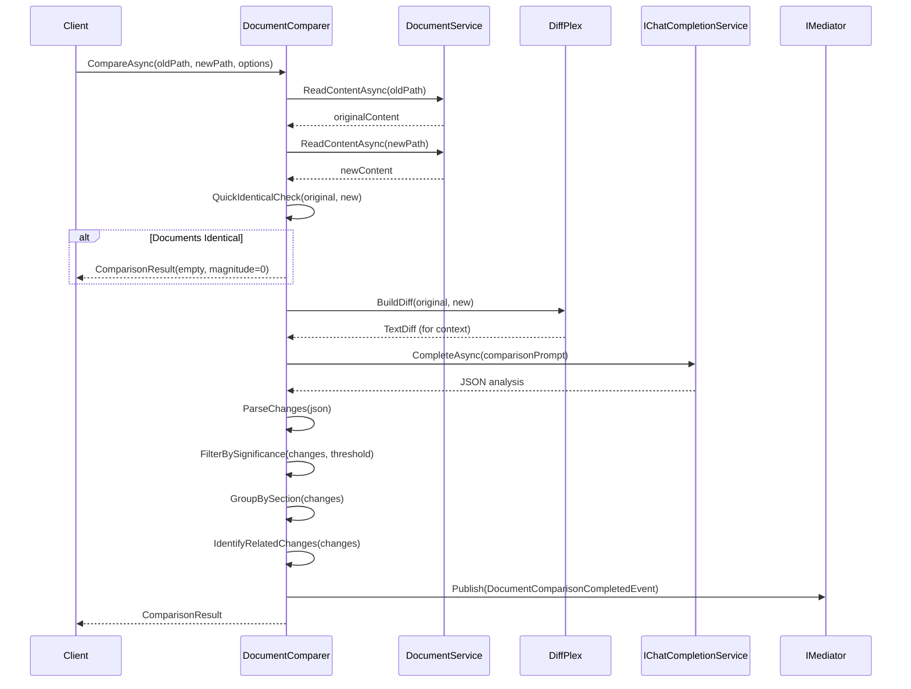

# LCS-DES-076d: Design Specification — Document Comparison

## 1. Metadata & Categorization

| Field | Value | Description |
| :--- | :--- | :--- |
| **Feature ID** | `AGT-076d` | Sub-part of AGT-076 |
| **Feature Name** | `Document Comparison ("What Changed?")` | Semantic version comparison |
| **Target Version** | `v0.7.6d` | Fourth sub-part of v0.7.6 |
| **Module Scope** | `Lexichord.Modules.Agents` | Agents module |
| **Swimlane** | `Ensemble` | Agent vertical |
| **License Tier** | `WriterPro` | Premium feature |
| **Feature Gate Key** | `FeatureFlags.Agents.Summarizer` | License gate key |
| **Author** | Lead Architect | |
| **Status** | `Draft` | |
| **Last Updated** | `2026-01-27` | |
| **Parent Document** | [LCS-DES-076-INDEX](./LCS-DES-076-INDEX.md) | |
| **Scope Breakdown** | [LCS-SBD-076 Section 3.4](./LCS-SBD-076.md#34-v076d-document-comparison) | |

---

## 2. Executive Summary

### 2.1 The Requirement

Document version comparison is essential for:

- **Content evolution tracking** across document revisions
- **Change review** before publishing or merging
- **Stakeholder communication** about what was updated
- **Quality assurance** to verify intended changes were made
- **Audit trails** for compliance and governance

Traditional text diff tools show line-by-line changes but lack semantic understanding of *what* changed and *why* it matters.

### 2.2 The Proposed Solution

Implement intelligent document comparison that:

1. Uses LLM analysis to understand semantic changes (not just text diff)
2. Categorizes changes by type (Added, Removed, Modified, Restructured, etc.)
3. Scores changes by significance (critical to trivial)
4. Generates human-readable "What changed?" summaries
5. Identifies affected sections for targeted review
6. Integrates with git for version history comparison

---

## 3. Architecture & Modular Strategy

### 3.1 Dependencies

#### 3.1.1 Upstream Dependencies

| Interface | Source Version | Purpose |
| :--- | :--- | :--- |
| `IChatCompletionService` | v0.6.1a | LLM for semantic analysis |
| `IPromptRenderer` | v0.6.3b | Template rendering |
| `IPromptTemplateRepository` | v0.6.3c | Template storage |
| `ISummarizerAgent` | v0.7.6a | Summary generation for changes |
| `IDocumentService` | v0.1.4a | Document content access |
| `IGitService` | v0.x.x | Git history access (optional) |
| `ILicenseContext` | v0.0.4c | License verification |
| `IMediator` | v0.0.7a | Event publishing |

#### 3.1.2 NuGet Packages

| Package | Version | Purpose |
| :--- | :--- | :--- |
| `DiffPlex` | 1.7.x | Text diff for hybrid analysis |
| `System.Text.Json` | 8.x | JSON parsing |

### 3.2 Licensing Behavior

- **Load Behavior:** Soft Gate - Returns "NotAuthorized" for lower tiers
- **UI Gate:** "Compare Versions" button shows lock icon
- **Fallback Experience:** Comparison unavailable; shows upgrade prompt

---

## 4. Data Contract (The API)

### 4.1 Enumerations

```csharp
namespace Lexichord.Modules.Agents.Abstractions;

/// <summary>
/// Categories of document changes.
/// Each category represents a distinct type of modification.
/// </summary>
public enum ChangeCategory
{
    /// <summary>
    /// New content was added that didn't exist before.
    /// Examples: New sections, new paragraphs, new list items.
    /// </summary>
    Added,

    /// <summary>
    /// Existing content was removed entirely.
    /// Examples: Deleted sections, removed paragraphs.
    /// </summary>
    Removed,

    /// <summary>
    /// Content was modified while staying in the same location.
    /// Examples: Rephrased sentences, updated facts, changed values.
    /// </summary>
    Modified,

    /// <summary>
    /// Content was moved to a different location.
    /// Examples: Reordered sections, moved paragraphs between sections.
    /// </summary>
    Restructured,

    /// <summary>
    /// Content was clarified without changing core meaning.
    /// Examples: Better explanations, additional context, examples added.
    /// </summary>
    Clarified,

    /// <summary>
    /// Only formatting or style changes, no semantic change.
    /// Examples: Heading level changes, list formatting, code formatting.
    /// </summary>
    Formatting,

    /// <summary>
    /// Factual corrections or error fixes.
    /// Examples: Fixed typos, corrected data, updated outdated info.
    /// </summary>
    Correction,

    /// <summary>
    /// Terminology or vocabulary changes.
    /// Examples: Renamed concepts, updated naming conventions.
    /// </summary>
    Terminology
}

/// <summary>
/// Significance level for quick filtering.
/// </summary>
public enum ChangeSignificance
{
    /// <summary>Trivial changes (typos, formatting). Score: 0.0-0.3</summary>
    Low,

    /// <summary>Notable changes (clarifications, minor additions). Score: 0.3-0.6</summary>
    Medium,

    /// <summary>Important changes (new sections, major modifications). Score: 0.6-0.8</summary>
    High,

    /// <summary>Critical changes (core message, breaking changes). Score: 0.8-1.0</summary>
    Critical
}
```

### 4.2 Core Records

```csharp
namespace Lexichord.Modules.Agents.Abstractions;

/// <summary>
/// Represents a single change detected between document versions.
/// </summary>
public record DocumentChange
{
    /// <summary>
    /// Category of the change.
    /// </summary>
    public ChangeCategory Category { get; init; }

    /// <summary>
    /// Section or heading where the change occurred.
    /// Null if change is at document level or in untitled section.
    /// </summary>
    public string? Section { get; init; }

    /// <summary>
    /// Human-readable description of the change.
    /// Should be a complete sentence describing what changed.
    /// </summary>
    public required string Description { get; init; }

    /// <summary>
    /// Significance score (0.0 to 1.0).
    /// Higher values indicate more significant changes.
    /// </summary>
    public double Significance { get; init; }

    /// <summary>
    /// Significance level derived from score.
    /// </summary>
    public ChangeSignificance SignificanceLevel => Significance switch
    {
        >= 0.8 => ChangeSignificance.Critical,
        >= 0.6 => ChangeSignificance.High,
        >= 0.3 => ChangeSignificance.Medium,
        _ => ChangeSignificance.Low
    };

    /// <summary>
    /// Original text that was changed or removed.
    /// Null for Added changes.
    /// </summary>
    public string? OriginalText { get; init; }

    /// <summary>
    /// New text after the change.
    /// Null for Removed changes.
    /// </summary>
    public string? NewText { get; init; }

    /// <summary>
    /// Line numbers affected in the original document.
    /// </summary>
    public LineRange? OriginalLineRange { get; init; }

    /// <summary>
    /// Line numbers affected in the new document.
    /// </summary>
    public LineRange? NewLineRange { get; init; }

    /// <summary>
    /// Additional context about why this change matters.
    /// </summary>
    public string? Impact { get; init; }

    /// <summary>
    /// Related changes (by index in the changes list).
    /// </summary>
    public IReadOnlyList<int>? RelatedChangeIndices { get; init; }
}

/// <summary>
/// Represents a range of line numbers.
/// </summary>
public record LineRange(int Start, int End)
{
    public int LineCount => End - Start + 1;

    public override string ToString() => Start == End
        ? $"line {Start}"
        : $"lines {Start}-{End}";
}

/// <summary>
/// Result of comparing two document versions.
/// </summary>
public record ComparisonResult
{
    /// <summary>
    /// Path to the original (older) document.
    /// </summary>
    public required string OriginalPath { get; init; }

    /// <summary>
    /// Path to the new (current) document.
    /// </summary>
    public required string NewPath { get; init; }

    /// <summary>
    /// Label for the original version (e.g., "v1.0", "Jan 15", "HEAD~1").
    /// </summary>
    public string? OriginalLabel { get; init; }

    /// <summary>
    /// Label for the new version (e.g., "v1.1", "Jan 27", "HEAD").
    /// </summary>
    public string? NewLabel { get; init; }

    /// <summary>
    /// Overall summary of changes in natural language.
    /// 2-3 sentences describing the major changes.
    /// </summary>
    public required string Summary { get; init; }

    /// <summary>
    /// List of individual changes detected.
    /// Ordered by significance (highest first).
    /// </summary>
    public required IReadOnlyList<DocumentChange> Changes { get; init; }

    /// <summary>
    /// Overall change magnitude (0.0 = identical, 1.0 = completely different).
    /// </summary>
    public double ChangeMagnitude { get; init; }

    /// <summary>
    /// Word count of the original document.
    /// </summary>
    public int OriginalWordCount { get; init; }

    /// <summary>
    /// Word count of the new document.
    /// </summary>
    public int NewWordCount { get; init; }

    /// <summary>
    /// Net change in word count (positive = added, negative = removed).
    /// </summary>
    public int WordCountDelta => NewWordCount - OriginalWordCount;

    /// <summary>
    /// Number of additions.
    /// </summary>
    public int AdditionCount => Changes.Count(c => c.Category == ChangeCategory.Added);

    /// <summary>
    /// Number of deletions.
    /// </summary>
    public int DeletionCount => Changes.Count(c => c.Category == ChangeCategory.Removed);

    /// <summary>
    /// Number of modifications.
    /// </summary>
    public int ModificationCount => Changes.Count(c => c.Category == ChangeCategory.Modified);

    /// <summary>
    /// Sections that were significantly changed.
    /// </summary>
    public required IReadOnlyList<string> AffectedSections { get; init; }

    /// <summary>
    /// Token usage for the comparison.
    /// </summary>
    public required UsageMetrics Usage { get; init; }

    /// <summary>
    /// Comparison timestamp.
    /// </summary>
    public DateTimeOffset ComparedAt { get; init; } = DateTimeOffset.UtcNow;

    /// <summary>
    /// Whether documents are identical.
    /// </summary>
    public bool AreIdentical => ChangeMagnitude == 0 && Changes.Count == 0;
}

/// <summary>
/// Options for document comparison.
/// </summary>
public record ComparisonOptions
{
    /// <summary>
    /// Minimum significance score to include a change (0.0 to 1.0).
    /// Changes below this threshold are filtered out.
    /// Default: 0.2 (show all but trivial changes).
    /// </summary>
    public double SignificanceThreshold { get; init; } = 0.2;

    /// <summary>
    /// Whether to include formatting-only changes.
    /// Default: false (focus on semantic changes).
    /// </summary>
    public bool IncludeFormattingChanges { get; init; } = false;

    /// <summary>
    /// Whether to group changes by section in output.
    /// Default: true.
    /// </summary>
    public bool GroupBySection { get; init; } = true;

    /// <summary>
    /// Maximum number of changes to report.
    /// Changes beyond this limit are summarized.
    /// Default: 20.
    /// </summary>
    public int MaxChanges { get; init; } = 20;

    /// <summary>
    /// Focus on specific sections (null = all sections).
    /// </summary>
    public IReadOnlyList<string>? FocusSections { get; init; }

    /// <summary>
    /// Whether to include the full text diff alongside semantic analysis.
    /// Useful for detailed review.
    /// </summary>
    public bool IncludeTextDiff { get; init; } = false;

    /// <summary>
    /// Whether to identify related/grouped changes.
    /// </summary>
    public bool IdentifyRelatedChanges { get; init; } = true;

    /// <summary>
    /// Labels for the versions being compared.
    /// </summary>
    public string? OriginalVersionLabel { get; init; }
    public string? NewVersionLabel { get; init; }
}
```

### 4.3 Interface Definition

```csharp
namespace Lexichord.Modules.Agents.Abstractions;

/// <summary>
/// Interface for comparing document versions.
/// </summary>
public interface IDocumentComparer
{
    /// <summary>
    /// Compares two document versions by file path.
    /// </summary>
    /// <param name="originalPath">Path to the original (older) document.</param>
    /// <param name="newPath">Path to the new (current) document.</param>
    /// <param name="options">Comparison configuration options.</param>
    /// <param name="ct">Cancellation token.</param>
    /// <returns>Structured comparison result.</returns>
    Task<ComparisonResult> CompareAsync(
        string originalPath,
        string newPath,
        ComparisonOptions? options = null,
        CancellationToken ct = default);

    /// <summary>
    /// Compares two content strings directly.
    /// </summary>
    /// <param name="originalContent">Original document content.</param>
    /// <param name="newContent">New document content.</param>
    /// <param name="options">Comparison configuration options.</param>
    /// <param name="ct">Cancellation token.</param>
    /// <returns>Structured comparison result.</returns>
    Task<ComparisonResult> CompareContentAsync(
        string originalContent,
        string newContent,
        ComparisonOptions? options = null,
        CancellationToken ct = default);

    /// <summary>
    /// Compares a document with a git history version.
    /// </summary>
    /// <param name="documentPath">Path to the document.</param>
    /// <param name="gitRef">Git reference (e.g., "HEAD~1", "abc123", "v1.0").</param>
    /// <param name="options">Comparison configuration options.</param>
    /// <param name="ct">Cancellation token.</param>
    /// <returns>Structured comparison result.</returns>
    /// <exception cref="GitException">Git operation failed.</exception>
    Task<ComparisonResult> CompareWithGitVersionAsync(
        string documentPath,
        string gitRef,
        ComparisonOptions? options = null,
        CancellationToken ct = default);

    /// <summary>
    /// Generates a natural language summary of changes.
    /// Useful for notifications or quick overviews.
    /// </summary>
    /// <param name="comparison">The comparison result to summarize.</param>
    /// <param name="ct">Cancellation token.</param>
    /// <returns>Natural language summary of changes.</returns>
    Task<string> GenerateChangeSummaryAsync(
        ComparisonResult comparison,
        CancellationToken ct = default);

    /// <summary>
    /// Gets text diff between two documents.
    /// Lightweight operation without LLM analysis.
    /// </summary>
    /// <param name="originalContent">Original content.</param>
    /// <param name="newContent">New content.</param>
    /// <returns>Unified diff format string.</returns>
    string GetTextDiff(string originalContent, string newContent);
}
```

---

## 5. Implementation Logic

### 5.1 Comparison Flow



### 5.2 Hybrid Analysis Approach

```text
HYBRID ANALYSIS STRATEGY:

Step 1: Text Diff (DiffPlex)
├── Fast, deterministic text comparison
├── Identifies added/removed/changed lines
├── Provides line number mapping
└── Used as input context for LLM

Step 2: LLM Semantic Analysis
├── Understands meaning behind changes
├── Categorizes change types
├── Scores significance
├── Generates human-readable descriptions
└── Identifies section context

Step 3: Merge & Enhance
├── Combine text diff line numbers with LLM insights
├── Link related changes
├── Filter by significance threshold
└── Generate final summary

BENEFITS:
- Text diff provides accuracy for location
- LLM provides semantic understanding
- Hybrid approach balances speed and insight
```

### 5.3 Significance Scoring

```text
SIGNIFICANCE SCORING GUIDE:

CRITICAL (0.8 - 1.0):
├── Changes to document title or main thesis
├── Modifications to key conclusions
├── Breaking changes to APIs or interfaces
├── Significant factual corrections
└── Major structural reorganization

HIGH (0.6 - 0.8):
├── New major sections added
├── Significant content removed
├── Important details updated
├── New requirements or constraints
└── Key arguments modified

MEDIUM (0.3 - 0.6):
├── Supporting details changed
├── Examples added or modified
├── Clarifications to existing content
├── Minor reorganization within sections
└── Updated references or links

LOW (0.0 - 0.3):
├── Typo corrections
├── Formatting changes
├── Minor word choice changes
├── Whitespace adjustments
└── Comment updates

CONTEXT MODIFIERS:
├── Changes in introduction/conclusion: +0.2
├── Changes to headings: +0.1
├── Changes in code blocks: +0.1 (for technical docs)
├── Changes in lists/tables: +0.05
└── Isolated sentence changes: -0.1
```

---

## 6. Prompt Templates

### 6.1 Document Comparison Prompt

```yaml
template_id: "document-comparer"
name: "Document Comparer"
version: "1.0.0"

system_prompt: |
  You are a document analyst specializing in version comparison.
  Your task is to identify and explain changes between two versions of a document.

  ## Analysis Guidelines

  ### Change Detection
  - Focus on semantic changes, not just textual differences
  - Identify the intent behind changes (clarification, correction, expansion, etc.)
  - Note changes that affect the document's core message vs. supporting details
  - Consider the impact of each change on the reader's understanding

  ### Categorization
  Use these categories precisely:
  - **Added**: Entirely new content that didn't exist before
  - **Removed**: Content that was deleted entirely
  - **Modified**: Existing content that was changed in place
  - **Restructured**: Content moved to a different location
  - **Clarified**: Better explanation without changing meaning
  - **Formatting**: Style changes only (headings, lists, code blocks)
  - **Correction**: Factual fixes or error corrections
  - **Terminology**: Vocabulary or naming changes

  ### Significance Scoring
  Score each change from 0.0 to 1.0:
  - 0.9-1.0: Critical changes affecting core message or purpose
  - 0.7-0.9: Major changes to important sections or arguments
  - 0.5-0.7: Moderate changes adding/removing significant content
  - 0.3-0.5: Minor changes refining existing content
  - 0.0-0.3: Trivial changes (typos, formatting, word choice)

  ### Section Identification
  - Identify the section or heading where each change occurred
  - Use the nearest heading above the change
  - Use "Introduction" for content before first heading
  - Use "Conclusion" for final summary sections

user_prompt: |
  Compare the following two document versions and identify what changed.

  {{#original_label}}
  ## Original Version ({{original_label}})
  {{/original_label}}
  {{^original_label}}
  ## Original Version
  {{/original_label}}
  """
  {{original_content}}
  """

  {{#new_label}}
  ## New Version ({{new_label}})
  {{/new_label}}
  {{^new_label}}
  ## New Version
  {{/new_label}}
  """
  {{new_content}}
  """

  {{#text_diff}}
  ## Text Diff (for reference)
  ```diff
  {{text_diff}}
  ```
  {{/text_diff}}

  Analyze these versions and provide your response in the following JSON format:

  ```json
  {
    "summary": "2-3 sentence overall summary of what changed",
    "change_magnitude": 0.45,
    "changes": [
      {
        "category": "Modified|Added|Removed|Restructured|Clarified|Formatting|Correction|Terminology",
        "section": "Section name or null",
        "description": "Human-readable description of what changed",
        "significance": 0.75,
        "original_text": "Original text if applicable, or null",
        "new_text": "New text if applicable, or null",
        "impact": "Why this change matters (optional)"
      }
    ],
    "affected_sections": ["Section 1", "Section 2"]
  }
  ```

  Requirements:
  - Order changes by significance (highest first)
  - Include at most {{max_changes}} individual changes
  - Provide concise but complete descriptions
  - Ensure all JSON is valid and properly escaped
  {{#focus_sections}}
  - Focus primarily on these sections: {{focus_sections}}
  {{/focus_sections}}
```

---

## 7. UI Specifications

### 7.1 Comparison View Layout

```text
┌──────────────────────────────────────────────────────────────────────────┐
│  What Changed?                     [Filter v] [Export] [Show Diff] [X]   │
├────────────────────────────────┬─────────────────────────────────────────┤
│  Original                      │  Current                                │
│  📄 v1.0 (Jan 15)              │  📄 v1.1 (Jan 27)                       │
│  847 words                     │  912 words (+65)                        │
├────────────────────────────────┴─────────────────────────────────────────┤
│                                                                          │
│  Summary                                                                 │
│  ─────────────────────────────────────────────────────────────────────── │
│  This version updates the project timeline from Q1 to Q2 2026, adds a   │
│  new Budget section with infrastructure costs, and incorporates         │
│  stakeholder feedback in the introduction.                               │
│                                                                          │
│  Change Magnitude: ████████░░ 45%                                        │
│  Additions: 3  •  Modifications: 5  •  Deletions: 1                      │
│                                                                          │
├──────────────────────────────────────────────────────────────────────────┤
│  Changes (9 total)                          [Sort: Significance v]       │
│  ─────────────────────────────────────────────────────────────────────── │
│                                                                          │
│  🔴 CRITICAL                                                             │
│  ┌──────────────────────────────────────────────────────────────────────┐│
│  │ [!] MODIFIED in "Timeline" (0.92)                                    ││
│  │     Changed project launch date from Q1 2026 to Q2 2026              ││
│  │     ───────────────────────────────────────────────────────────────  ││
│  │     - The project launches in Q1 2026 with full feature set         ││
│  │     + The project launches in Q2 2026 with full feature set         ││
│  │     ───────────────────────────────────────────────────────────────  ││
│  │     Impact: Affects all downstream planning and stakeholder          ││
│  │     expectations                                                      ││
│  └──────────────────────────────────────────────────────────────────────┘│
│                                                                          │
│  🟠 HIGH                                                                  │
│  ┌──────────────────────────────────────────────────────────────────────┐│
│  │ [+] ADDED in "Budget" (0.78)                                         ││
│  │     New section detailing infrastructure cost breakdown               ││
│  │     ───────────────────────────────────────────────────────────────  ││
│  │     + ## Budget                                                       ││
│  │     + Infrastructure costs are estimated at $50,000 for...           ││
│  │     [Expand to see full text...]                                      ││
│  └──────────────────────────────────────────────────────────────────────┘│
│                                                                          │
│  🟡 MEDIUM (3 changes)                                                   │
│  ┌──────────────────────────────────────────────────────────────────────┐│
│  │ [~] CLARIFIED in "Requirements" (0.55)                               ││
│  │     Expanded definition of user authentication requirements          ││
│  │     [Click to expand...]                                              ││
│  ├──────────────────────────────────────────────────────────────────────┤│
│  │ [~] MODIFIED in "Architecture" (0.48)                                ││
│  │     Updated diagram references to match new component names          ││
│  │     [Click to expand...]                                              ││
│  ├──────────────────────────────────────────────────────────────────────┤│
│  │ [→] RESTRUCTURED in "Overview" (0.42)                                ││
│  │     Moved objectives section before scope section                     ││
│  │     [Click to expand...]                                              ││
│  └──────────────────────────────────────────────────────────────────────┘│
│                                                                          │
│  🟢 LOW (2 changes)                                                      │
│  [Show 2 low-significance changes...]                                    │
│                                                                          │
└──────────────────────────────────────────────────────────────────────────┘
```

### 7.2 Component Hierarchy

```text
ComparisonView.axaml
├── Header
│   ├── TitleBlock ("What Changed?")
│   ├── FilterDropdown
│   ├── ExportButton
│   ├── ShowDiffToggle
│   └── CloseButton
├── VersionInfo
│   ├── OriginalVersion
│   │   ├── Label
│   │   └── WordCount
│   └── NewVersion
│       ├── Label
│       ├── WordCount
│       └── Delta
├── SummarySection
│   ├── SummaryText
│   ├── MagnitudeBar
│   └── ChangeStats
│       ├── AdditionCount
│       ├── ModificationCount
│       └── DeletionCount
├── ChangesSection
│   ├── SectionHeader
│   ├── SortDropdown
│   └── ChangeGroups
│       ├── CriticalGroup (collapsible)
│       │   └── ChangeCard[]
│       ├── HighGroup (collapsible)
│       │   └── ChangeCard[]
│       ├── MediumGroup (collapsible)
│       │   └── ChangeCard[]
│       └── LowGroup (collapsed by default)
│           └── ChangeCard[]
└── ChangeCard
    ├── CategoryIcon
    ├── ChangeHeader
    │   ├── Category badge
    │   ├── Section name
    │   └── Significance score
    ├── Description
    ├── DiffView (expandable)
    │   ├── OriginalText (red background)
    │   └── NewText (green background)
    └── ImpactNote (if present)
```

### 7.3 Styling Requirements

| Component | Theme Resource | Notes |
| :--- | :--- | :--- |
| View Container | `Brush.Surface.Primary` | Main background |
| Header | `Brush.Surface.Secondary` | Darker header |
| Summary Section | `Brush.Surface.Tertiary` | Subtle highlight |
| Critical Badge | `Brush.Error.Primary` | Red badge |
| High Badge | `Brush.Warning.Primary` | Orange badge |
| Medium Badge | `Brush.Info.Primary` | Blue badge |
| Low Badge | `Brush.Text.Tertiary` | Muted gray |
| Added Icon | `Brush.Success.Primary` | Green + icon |
| Removed Icon | `Brush.Error.Primary` | Red - icon |
| Modified Icon | `Brush.Warning.Primary` | Orange ~ icon |
| Original Text | `Brush.Error.Surface` | Light red background |
| New Text | `Brush.Success.Surface` | Light green background |
| Magnitude Bar (filled) | `Brush.Accent.Primary` | Primary accent |
| Magnitude Bar (empty) | `Brush.Surface.Tertiary` | Muted |

---

## 8. Test Scenarios

### 8.1 Core Comparison Tests

```csharp
[Trait("Category", "Unit")]
[Trait("Version", "v0.7.6d")]
public class DocumentComparisonTests
{
    [Fact]
    public async Task CompareAsync_IdenticalDocuments_ReturnsZeroMagnitude()
    {
        // Arrange
        var content = "# Document\n\nThis is the content.";
        var sut = CreateDocumentComparer();

        // Act
        var result = await sut.CompareContentAsync(content, content);

        // Assert
        result.AreIdentical.Should().BeTrue();
        result.ChangeMagnitude.Should().Be(0.0);
        result.Changes.Should().BeEmpty();
    }

    [Fact]
    public async Task CompareAsync_AddedContent_IdentifiesAsAdded()
    {
        // Arrange
        var original = "# Document\n\nOriginal content.";
        var updated = "# Document\n\nOriginal content.\n\n## New Section\n\nNew content.";
        var mockLlm = CreateMockLlmWithChanges(new[]
        {
            new DocumentChange
            {
                Category = ChangeCategory.Added,
                Section = "New Section",
                Description = "Added new section about...",
                Significance = 0.7
            }
        });
        var sut = CreateDocumentComparer(mockLlm);

        // Act
        var result = await sut.CompareContentAsync(original, updated);

        // Assert
        result.Changes.Should().ContainSingle();
        result.Changes[0].Category.Should().Be(ChangeCategory.Added);
        result.AdditionCount.Should().Be(1);
    }

    [Fact]
    public async Task CompareAsync_RemovedContent_IdentifiesAsRemoved()
    {
        // Arrange
        var original = "# Document\n\n## Section 1\nContent 1\n\n## Section 2\nContent 2";
        var updated = "# Document\n\n## Section 1\nContent 1";
        var mockLlm = CreateMockLlmWithChanges(new[]
        {
            new DocumentChange
            {
                Category = ChangeCategory.Removed,
                Section = "Section 2",
                Description = "Removed Section 2",
                Significance = 0.6,
                OriginalText = "## Section 2\nContent 2"
            }
        });
        var sut = CreateDocumentComparer(mockLlm);

        // Act
        var result = await sut.CompareContentAsync(original, updated);

        // Assert
        result.DeletionCount.Should().Be(1);
        result.Changes[0].OriginalText.Should().Contain("Section 2");
    }

    [Fact]
    public async Task CompareAsync_ModifiedContent_ShowsBeforeAndAfter()
    {
        // Arrange
        var original = "The project launches in Q1 2026.";
        var updated = "The project launches in Q2 2026.";
        var mockLlm = CreateMockLlmWithChanges(new[]
        {
            new DocumentChange
            {
                Category = ChangeCategory.Modified,
                Description = "Changed launch date from Q1 to Q2",
                Significance = 0.9,
                OriginalText = "Q1 2026",
                NewText = "Q2 2026"
            }
        });
        var sut = CreateDocumentComparer(mockLlm);

        // Act
        var result = await sut.CompareContentAsync(original, updated);

        // Assert
        result.Changes.Should().ContainSingle();
        result.Changes[0].OriginalText.Should().Contain("Q1");
        result.Changes[0].NewText.Should().Contain("Q2");
    }
}
```

### 8.2 Filtering and Options Tests

```csharp
[Trait("Category", "Unit")]
[Trait("Version", "v0.7.6d")]
public class ComparisonFilteringTests
{
    [Fact]
    public async Task CompareAsync_WithSignificanceThreshold_FiltersTrivialChanges()
    {
        // Arrange
        var options = new ComparisonOptions { SignificanceThreshold = 0.5 };
        var mockLlm = CreateMockLlmWithChanges(new[]
        {
            new DocumentChange { Significance = 0.8, Description = "Important" },
            new DocumentChange { Significance = 0.3, Description = "Trivial" }
        });
        var sut = CreateDocumentComparer(mockLlm);

        // Act
        var result = await sut.CompareContentAsync("a", "b", options);

        // Assert
        result.Changes.Should().ContainSingle();
        result.Changes[0].Description.Should().Be("Important");
    }

    [Fact]
    public async Task CompareAsync_ExcludeFormatting_FiltersFormattingChanges()
    {
        // Arrange
        var options = new ComparisonOptions { IncludeFormattingChanges = false };
        var mockLlm = CreateMockLlmWithChanges(new[]
        {
            new DocumentChange { Category = ChangeCategory.Modified, Significance = 0.7 },
            new DocumentChange { Category = ChangeCategory.Formatting, Significance = 0.2 }
        });
        var sut = CreateDocumentComparer(mockLlm);

        // Act
        var result = await sut.CompareContentAsync("a", "b", options);

        // Assert
        result.Changes.Should().OnlyContain(c => c.Category != ChangeCategory.Formatting);
    }

    [Fact]
    public async Task CompareAsync_MaxChanges_LimitsOutput()
    {
        // Arrange
        var options = new ComparisonOptions { MaxChanges = 5 };
        var changes = Enumerable.Range(0, 10)
            .Select(i => new DocumentChange
            {
                Category = ChangeCategory.Modified,
                Description = $"Change {i}",
                Significance = 0.5
            })
            .ToList();
        var mockLlm = CreateMockLlmWithChanges(changes);
        var sut = CreateDocumentComparer(mockLlm);

        // Act
        var result = await sut.CompareContentAsync("a", "b", options);

        // Assert
        result.Changes.Should().HaveCount(5);
    }

    [Fact]
    public async Task CompareAsync_GroupBySection_OrdersBySection()
    {
        // Arrange
        var options = new ComparisonOptions { GroupBySection = true };
        var mockLlm = CreateMockLlmWithChanges(new[]
        {
            new DocumentChange { Section = "Zebra", Significance = 0.5 },
            new DocumentChange { Section = "Alpha", Significance = 0.5 },
            new DocumentChange { Section = "Alpha", Significance = 0.6 }
        });
        var sut = CreateDocumentComparer(mockLlm);

        // Act
        var result = await sut.CompareContentAsync("a", "b", options);

        // Assert
        var sections = result.Changes.Select(c => c.Section).ToList();
        sections.Should().BeEquivalentTo(new[] { "Alpha", "Alpha", "Zebra" });
    }
}
```

### 8.3 Text Diff Tests

```csharp
[Trait("Category", "Unit")]
[Trait("Version", "v0.7.6d")]
public class TextDiffTests
{
    [Fact]
    public void GetTextDiff_ReturnsUnifiedDiffFormat()
    {
        // Arrange
        var original = "Line 1\nLine 2\nLine 3";
        var updated = "Line 1\nLine 2 modified\nLine 3";
        var sut = CreateDocumentComparer();

        // Act
        var diff = sut.GetTextDiff(original, updated);

        // Assert
        diff.Should().Contain("-Line 2");
        diff.Should().Contain("+Line 2 modified");
    }

    [Fact]
    public void GetTextDiff_IdenticalContent_ReturnsEmpty()
    {
        // Arrange
        var content = "Same content";
        var sut = CreateDocumentComparer();

        // Act
        var diff = sut.GetTextDiff(content, content);

        // Assert
        diff.Should().BeEmpty();
    }
}
```

### 8.4 Summary Generation Tests

```csharp
[Trait("Category", "Unit")]
[Trait("Version", "v0.7.6d")]
public class ChangeSummaryTests
{
    [Fact]
    public async Task GenerateChangeSummaryAsync_NoChanges_ReturnsNoChangesMessage()
    {
        // Arrange
        var comparison = new ComparisonResult
        {
            OriginalPath = "/old.md",
            NewPath = "/new.md",
            Summary = "",
            Changes = Array.Empty<DocumentChange>(),
            AffectedSections = Array.Empty<string>(),
            ChangeMagnitude = 0,
            Usage = new UsageMetrics(0, 0, 0)
        };
        var sut = CreateDocumentComparer();

        // Act
        var summary = await sut.GenerateChangeSummaryAsync(comparison);

        // Assert
        summary.Should().Contain("No significant changes");
    }

    [Fact]
    public async Task GenerateChangeSummaryAsync_WithChanges_IncludesKeyChanges()
    {
        // Arrange
        var comparison = new ComparisonResult
        {
            OriginalPath = "/old.md",
            NewPath = "/new.md",
            Summary = "Major timeline update.",
            Changes = new[]
            {
                new DocumentChange
                {
                    Category = ChangeCategory.Modified,
                    Description = "Updated project launch from Q1 to Q2",
                    Significance = 0.9
                }
            },
            AffectedSections = new[] { "Timeline" },
            ChangeMagnitude = 0.5,
            Usage = new UsageMetrics(0, 0, 0)
        };
        var sut = CreateDocumentComparer();

        // Act
        var summary = await sut.GenerateChangeSummaryAsync(comparison);

        // Assert
        summary.Should().Contain("Q1");
        summary.Should().Contain("Q2");
    }
}
```

---

## 9. Observability & Logging

| Level | Source | Message Template |
| :--- | :--- | :--- |
| Debug | DocumentComparer | `"Comparison started: {OriginalPath} vs {NewPath}"` |
| Debug | DocumentComparer | `"Text diff generated: {AddedLines} added, {RemovedLines} removed"` |
| Info | DocumentComparer | `"Comparison completed: {ChangeCount} changes, magnitude={Magnitude:F2}"` |
| Info | DocumentComparer | `"Changes by category: Added={Added}, Modified={Modified}, Removed={Removed}"` |
| Warning | DocumentComparer | `"LLM response missing expected fields, using fallback"` |
| Warning | DocumentComparer | `"Truncating changes: {TotalChanges} detected, showing {MaxChanges}"` |
| Error | DocumentComparer | `"Comparison failed: {ErrorMessage}"` |
| Debug | DocumentComparer | `"Git comparison: {DocumentPath} at {GitRef}"` |

---

## 10. Acceptance Criteria

### 10.1 Functional Criteria

| # | Given | When | Then |
| :--- | :--- | :--- | :--- |
| 1 | Two identical documents | Compare | ChangeMagnitude = 0, no changes |
| 2 | Added content | Compare | Category = Added, NewText populated |
| 3 | Removed content | Compare | Category = Removed, OriginalText populated |
| 4 | Modified content | Compare | Both OriginalText and NewText populated |
| 5 | SignificanceThreshold = 0.5 | Compare | Only changes >= 0.5 included |
| 6 | MaxChanges = 5 | Compare | At most 5 changes returned |
| 7 | IncludeFormattingChanges = false | Compare | No Formatting changes |
| 8 | GroupBySection = true | Compare | Changes ordered by section |
| 9 | Git ref provided | Compare with git | Retrieves historical version |
| 10 | Comparison complete | Generate summary | Returns human-readable summary |

### 10.2 UI Criteria

| # | Scenario | Expected |
| :--- | :--- | :--- |
| 1 | Comparison view opened | Shows version labels, word counts, summary |
| 2 | Critical changes present | Displayed first with red indicator |
| 3 | Change card clicked | Expands to show original/new text |
| 4 | Filter dropdown used | Filters changes by category |
| 5 | Show Diff toggled | Displays unified text diff |
| 6 | Export clicked | Exports comparison as Markdown |

---

## 11. Deliverable Checklist

| # | Deliverable | Status |
| :--- | :--- | :--- |
| 1 | `ChangeCategory.cs` enumeration | [ ] |
| 2 | `ChangeSignificance.cs` enumeration | [ ] |
| 3 | `DocumentChange.cs` record | [ ] |
| 4 | `LineRange.cs` record | [ ] |
| 5 | `ComparisonResult.cs` record | [ ] |
| 6 | `ComparisonOptions.cs` record | [ ] |
| 7 | `IDocumentComparer.cs` interface | [ ] |
| 8 | `DocumentComparer.cs` implementation | [ ] |
| 9 | `document-comparer.yaml` prompt template | [ ] |
| 10 | `ComparisonView.axaml` | [ ] |
| 11 | `ComparisonViewModel.cs` | [ ] |
| 12 | `ChangeCard.axaml` component | [ ] |
| 13 | Git integration | [ ] |
| 14 | DiffPlex integration | [ ] |
| 15 | Unit tests for comparison | [ ] |
| 16 | Unit tests for filtering | [ ] |
| 17 | Unit tests for summary generation | [ ] |

---

## 12. Verification Commands

```bash
# Run all v0.7.6d tests
dotnet test --filter "Version=v0.7.6d" --logger "console;verbosity=detailed"

# Run core comparison tests
dotnet test --filter "FullyQualifiedName~DocumentComparisonTests"

# Run filtering tests
dotnet test --filter "FullyQualifiedName~ComparisonFilteringTests"

# Run text diff tests
dotnet test --filter "FullyQualifiedName~TextDiffTests"

# Run summary tests
dotnet test --filter "FullyQualifiedName~ChangeSummaryTests"

# Verify DiffPlex package
dotnet list src/Lexichord.Modules.Agents package | grep DiffPlex

# Verify AXAML compiles
dotnet build src/Lexichord.Modules.Agents --no-restore
```

---

## Document History

| Version | Date | Author | Changes |
| :--- | :--- | :--- | :--- |
| 1.0 | 2026-01-27 | Lead Architect | Initial draft |

---
