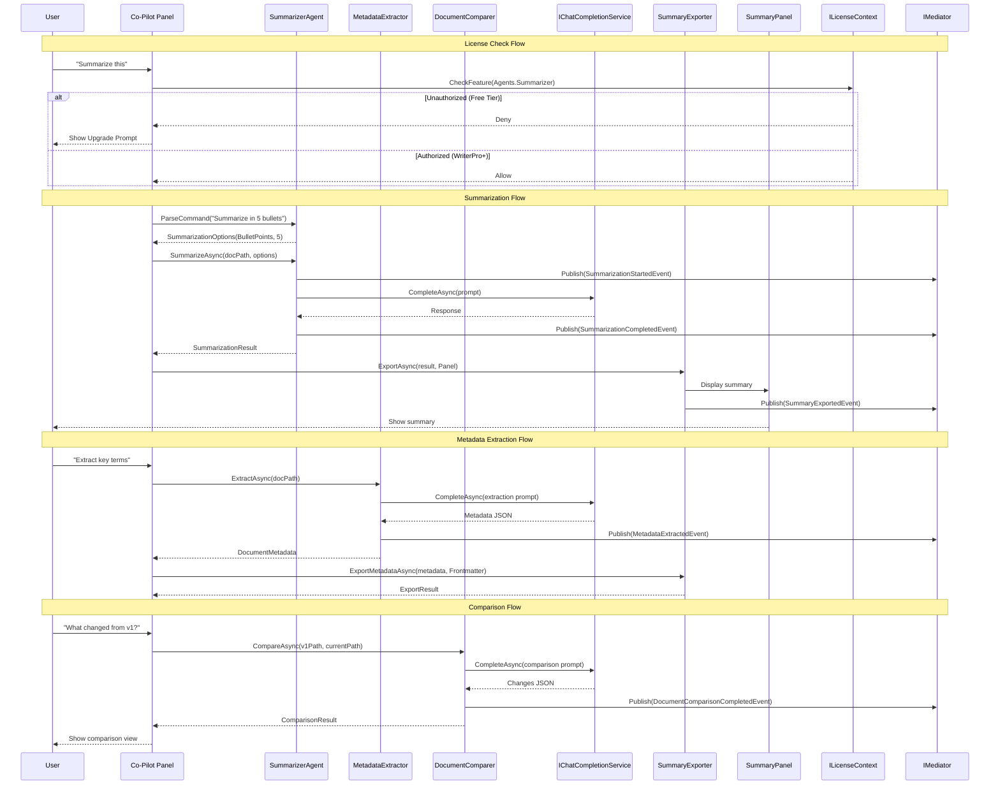

# LCS-DES-076: Design Specification Index — The Summarizer Agent

## Document Control

| Field | Value |
| :--- | :--- |
| **Document ID** | LCS-DES-076-INDEX |
| **Feature ID** | AGT-076 |
| **Feature Name** | The Summarizer Agent |
| **Target Version** | v0.7.6 |
| **Module Scope** | Lexichord.Modules.Agents |
| **Swimlane** | Ensemble |
| **License Tier** | WriterPro |
| **Feature Gate Key** | FeatureFlags.Agents.Summarizer |
| **Status** | Draft |
| **Last Updated** | 2026-01-27 |

---

## 1. Executive Summary

**v0.7.6** delivers the **Summarizer Agent** — a specialized AI agent that distills documents into executive summaries, key takeaways, abstracts, and structured metadata. This release enables writers to rapidly extract insights from long-form content and compare document versions.

### 1.1 The Problem

Writers and content managers face significant challenges with document analysis:

- Manual abstract/summary creation is time-consuming (30+ minutes per document)
- Key term extraction for searchability requires domain expertise
- Version comparison beyond simple text diff lacks semantic understanding
- Metadata enrichment for document management is inconsistent
- No unified workflow for distilling documents into actionable insights

### 1.2 The Solution

Implement the Summarizer Agent with four key capabilities:

1. **Summarization Modes** — Multiple output formats (Abstract, TLDR, Bullet Points, Key Takeaways, Executive)
2. **Metadata Extraction** — Automated key terms, concepts, tags, and reading time
3. **Export Formats** — Panel display, frontmatter injection, file export, clipboard
4. **Document Comparison** — Semantic "What changed?" analysis between versions

### 1.3 Business Value

| Value | Description |
| :--- | :--- |
| **Time Savings** | Reduce summary creation from 30+ minutes to under 30 seconds |
| **Consistency** | Uniform summary formats across all workspace documents |
| **Metadata Enrichment** | Automatic key terms, tags, and reading time |
| **Version Intelligence** | Rapid comparison of document versions |
| **Export Flexibility** | Multiple output destinations for integration |
| **Foundation** | Patterns for future metadata-generating agents |

---

## 2. Related Documents

### 2.1 Scope Breakdown Document

The detailed scope breakdown for v0.7.6, including all sub-parts, implementation checklists, user stories, and acceptance criteria:

| Document | Description |
| :--- | :--- |
| **[LCS-SBD-076](./LCS-SBD-076.md)** | Scope Breakdown — The Summarizer Agent |

### 2.2 Sub-Part Design Specifications

Each sub-part has its own detailed design specification following the LDS-01 template:

| Sub-Part | Document | Title | Description |
| :--- | :--- | :--- | :--- |
| v0.7.6a | **[LCS-DES-076a](./LCS-DES-076a.md)** | Summarization Modes | Abstract, TLDR, Bullet Points output formats |
| v0.7.6b | **[LCS-DES-076b](./LCS-DES-076b.md)** | Metadata Extraction | Key terms, concepts, tags extraction |
| v0.7.6c | **[LCS-DES-076c](./LCS-DES-076c.md)** | Export Formats | Markdown summary panel, frontmatter, files |
| v0.7.6d | **[LCS-DES-076d](./LCS-DES-076d.md)** | Document Comparison | "What changed between v1 and v2?" |

---

## 3. Architecture Overview

### 3.1 Component Diagram

```mermaid
graph TB
    subgraph "Lexichord.Modules.Agents"
        subgraph "v0.7.6a: Summarization"
            SA[SummarizerAgent]
            SM[SummarizationMode]
            SO[SummarizationOptions]
            SR[SummarizationResult]
        end

        subgraph "v0.7.6b: Metadata"
            ME[MetadataExtractor]
            DM[DocumentMetadata]
            KT[KeyTerm]
            MEO[MetadataExtractionOptions]
        end

        subgraph "v0.7.6c: Export"
            SE[SummaryExporter]
            EO[ExportOptions]
            ER[ExportResult]
        end

        subgraph "v0.7.6d: Comparison"
            DC[DocumentComparer]
            CR[ComparisonResult]
            DCH[DocumentChange]
            CO[ComparisonOptions]
        end

        subgraph "UI Components"
            SP[SummaryPanelView]
            SPV[SummaryPanelViewModel]
            CV[ComparisonView]
            CVM[ComparisonViewModel]
        end
    end

    subgraph "Dependencies"
        LLM[IChatCompletionService<br/>v0.6.1a]
        PR[IPromptRenderer<br/>v0.6.3b]
        CTX[IContextOrchestrator<br/>v0.7.2c]
        AR[IAgentRegistry<br/>v0.7.1b]
        DS[IDocumentService<br/>v0.1.4a]
        ES[IEditorService<br/>v0.1.3a]
        LC[ILicenseContext<br/>v0.0.4c]
        MED[IMediator<br/>v0.0.7a]
    end

    subgraph "Co-Pilot Integration"
        CP[CoPilotPanel]
    end

    SA --> SM
    SA --> SO
    SA --> SR
    SA --> LLM
    SA --> PR
    SA --> CTX

    ME --> DM
    ME --> KT
    ME --> MEO
    ME --> LLM

    SE --> EO
    SE --> ER
    SE --> DS
    SE --> ES

    DC --> CR
    DC --> DCH
    DC --> CO
    DC --> LLM
    DC --> SA

    SP --> SPV
    SPV --> SA
    SPV --> ME
    SPV --> SE

    CV --> CVM
    CVM --> DC

    CP --> SA
    CP --> ME
    CP --> DC

    AR --> SA

    SA --> LC
    ME --> LC
    SE --> LC
    DC --> LC

    SA --> MED
    ME --> MED
    SE --> MED
    DC --> MED

    style SA fill:#4a9eff,color:#fff
    style ME fill:#4a9eff,color:#fff
    style SE fill:#4a9eff,color:#fff
    style DC fill:#4a9eff,color:#fff
    style SP fill:#22c55e,color:#fff
    style CV fill:#22c55e,color:#fff
```



### 3.2 Data Flow Diagram



---

## 4. Dependencies

### 4.1 Upstream Dependencies

| Interface | Source Version | Purpose |
| :--- | :--- | :--- |
| `IChatCompletionService` | v0.6.1a | LLM communication for all agent operations |
| `IPromptRenderer` | v0.6.3b | Template rendering for prompts |
| `IPromptTemplateRepository` | v0.6.3c | Storage for summarizer prompt templates |
| `IContextInjector` | v0.6.3d | Document context injection |
| `IAgent` | v0.6.6a | Base agent interface |
| `IAgentRegistry` | v0.7.1b | Agent registration and discovery |
| `AgentConfiguration` | v0.7.1a | Agent persona configuration |
| `IContextOrchestrator` | v0.7.2c | Intelligent context assembly |
| `IDocumentService` | v0.1.4a | Document content access |
| `IEditorService` | v0.1.3a | Editor integration |
| `ISettingsService` | v0.1.6a | User preferences |
| `ILicenseContext` | v0.0.4c | License verification |
| `IMediator` | v0.0.7a | Event publishing |

### 4.2 NuGet Packages

| Package | Version | Purpose |
| :--- | :--- | :--- |
| `YamlDotNet` | 15.x | Frontmatter parsing and generation |
| (No new packages) | — | Uses existing dependencies |

### 4.3 Downstream Consumers (Future)

| Version | Feature | Uses From v0.7.6 |
| :--- | :--- | :--- |
| v0.7.7 | Agent Workflows | Chain Summarizer in multi-agent pipelines |
| v0.7.8 | Hardening | Test suites for summarization accuracy |
| v0.8.x | Publishing | Auto-generated abstracts for publication |
| v0.9.x | Collaboration | Team-wide document summaries |

---

## 5. License Gating Strategy

The Summarizer Agent is a **WriterPro** feature.

| Tier | Access Level |
| :--- | :--- |
| **Core** | No access. Upgrade prompt shown on invocation. |
| **Writer** | No access. Upgrade prompt shown on invocation. |
| **WriterPro** | Full access to all summarization features. |
| **Teams** | Full access + future collaborative features. |
| **Enterprise** | Full access + audit logging + SSO integration. |

### 5.1 Licensing Behavior

- **Load Behavior:** Soft Gate - Module loads, service returns "NotAuthorized" for lower tiers
- **UI Gate:** Summarization commands in Co-pilot show lock icon with upgrade tooltip
- **Fallback Experience:**
  - "Summarize this" shows: "Upgrade to WriterPro to unlock document summarization"
  - Summary Panel header shows: "WriterPro Feature" badge
  - Previously generated summaries (if cached) remain viewable but not regeneratable

### 5.2 Feature Gate Keys

```csharp
public static class FeatureFlags
{
    public static class Agents
    {
        public const string Summarizer = "agents.summarizer";
        public const string SummarizerModes = "agents.summarizer.modes";
        public const string MetadataExtraction = "agents.summarizer.metadata";
        public const string DocumentComparison = "agents.summarizer.comparison";
        public const string ExportFormats = "agents.summarizer.export";
    }
}
```

---

## 6. Key Features Summary

### 6.1 Summarization Modes (v0.7.6a)

| Mode | Description | Output Format |
| :--- | :--- | :--- |
| **Abstract** | Academic-style abstract | 150-300 word prose |
| **TLDR** | Quick summary | 50-100 word paragraph |
| **BulletPoints** | Key points list | 3-7 bullet items |
| **KeyTakeaways** | Actionable insights | Numbered list with explanations |
| **Executive** | Stakeholder summary | 100-200 word business prose |
| **Custom** | User-defined format | Based on custom prompt |

### 6.2 Natural Language Commands

| Command Pattern | Parsed Mode | MaxItems |
| :--- | :--- | :--- |
| "Summarize this" | BulletPoints | 5 |
| "Summarize in N bullets" | BulletPoints | N |
| "Create an abstract" | Abstract | — |
| "TLDR" / "TL;DR" | TLDR | — |
| "Key takeaways" | KeyTakeaways | 5 |
| "Executive summary" | Executive | — |

### 6.3 Metadata Extraction (v0.7.6b)

| Extracted Field | Description |
| :--- | :--- |
| **Key Terms** | Important terms with importance scores |
| **Concepts** | High-level topic concepts |
| **Suggested Tags** | Categorization tags |
| **Reading Time** | Estimated minutes to read |
| **Complexity Score** | 1-10 difficulty rating |
| **Target Audience** | Inferred reader profile |
| **Document Type** | Article, tutorial, reference, etc. |
| **Named Entities** | People, organizations, products |

### 6.4 Export Destinations (v0.7.6c)

| Destination | Description |
| :--- | :--- |
| **Panel** | Display in Summary Panel UI |
| **Frontmatter** | Inject into document YAML frontmatter |
| **File** | Create standalone summary file |
| **Clipboard** | Copy to system clipboard |
| **InlineInsert** | Insert at cursor position |

### 6.5 Document Comparison (v0.7.6d)

| Change Category | Description |
| :--- | :--- |
| **Added** | New content added |
| **Removed** | Existing content removed |
| **Modified** | Content changed |
| **Restructured** | Content moved |
| **Clarified** | Content clarified without meaning change |
| **Formatting** | Style/formatting only |
| **Correction** | Factual corrections |

---

## 7. Implementation Checklist Summary

| Sub-Part | Tasks | Est. Hours |
| :--- | :--- | :--- |
| v0.7.6a | Summarization Modes | 13 |
| v0.7.6b | Metadata Extraction | 9 |
| v0.7.6c | Export Formats | 12 |
| v0.7.6d | Document Comparison | 11.5 |
| Integration | Tests, DI, License | 3.5 |
| **Total** | | **48 hours** |

See [LCS-SBD-076](./LCS-SBD-076.md) Section 4 for the detailed task breakdown.

---

## 8. Success Criteria Summary

| Category | Criterion | Target |
| :--- | :--- | :--- |
| **Summarization** | Mode parsing accuracy | 100% for documented patterns |
| **Summarization** | Output format compliance | Matches mode specification |
| **Summarization** | Long document handling | Chunks >4000 tokens correctly |
| **Metadata** | Key term relevance | >75% precision |
| **Metadata** | Reading time accuracy | Within 1 minute of manual calculation |
| **Export** | Frontmatter validity | Produces parseable YAML |
| **Comparison** | Change categorization | >85% accuracy |
| **Performance** | 10,000 word summary | <15 seconds |
| **License** | Gate enforcement | 100% compliance |

See [LCS-SBD-076](./LCS-SBD-076.md) Section 9 for full success metrics.

---

## 9. Interface Summary

### 9.1 New Interfaces

| Interface | Sub-Part | Purpose |
| :--- | :--- | :--- |
| `ISummarizerAgent` | v0.7.6a | Summarization operations |
| `IMetadataExtractor` | v0.7.6b | Metadata extraction |
| `ISummaryExporter` | v0.7.6c | Export operations |
| `IDocumentComparer` | v0.7.6d | Version comparison |

### 9.2 New Records/DTOs

| Record | Sub-Part | Purpose |
| :--- | :--- | :--- |
| `SummarizationOptions` | v0.7.6a | Summarization configuration |
| `SummarizationResult` | v0.7.6a | Summary output |
| `DocumentMetadata` | v0.7.6b | Extracted metadata |
| `KeyTerm` | v0.7.6b | Term with importance score |
| `MetadataExtractionOptions` | v0.7.6b | Extraction configuration |
| `ExportOptions` | v0.7.6c | Export configuration |
| `ExportResult` | v0.7.6c | Export operation result |
| `ComparisonResult` | v0.7.6d | Comparison output |
| `DocumentChange` | v0.7.6d | Individual change record |
| `ComparisonOptions` | v0.7.6d | Comparison configuration |

### 9.3 New Enums

| Enum | Sub-Part | Values |
| :--- | :--- | :--- |
| `SummarizationMode` | v0.7.6a | Abstract, TLDR, BulletPoints, KeyTakeaways, Executive, Custom |
| `ExportDestination` | v0.7.6c | Panel, Frontmatter, File, Clipboard, InlineInsert |
| `FrontmatterFields` | v0.7.6c | Abstract, Tags, KeyTerms, ReadingTime, Category, Audience, All |
| `ChangeCategory` | v0.7.6d | Added, Removed, Modified, Restructured, Clarified, Formatting, Correction |

---

## 10. UI Components Summary

| Component | Sub-Part | Description |
| :--- | :--- | :--- |
| `SummaryPanelView.axaml` | v0.7.6c | Dedicated summary display panel |
| `SummaryPanelViewModel.cs` | v0.7.6c | Summary panel view model |
| `ComparisonView.axaml` | v0.7.6d | Document comparison view |
| `ComparisonViewModel.cs` | v0.7.6d | Comparison view model |
| `KeyTermChip.axaml` | v0.7.6b | Key term display chip |
| `ChangeCard.axaml` | v0.7.6d | Individual change display |

---

## 11. Events Summary

| Event | Published By | Description |
| :--- | :--- | :--- |
| `SummarizationStartedEvent` | SummarizerAgent | Summarization initiated |
| `SummarizationCompletedEvent` | SummarizerAgent | Summary generated |
| `SummarizationFailedEvent` | SummarizerAgent | Summarization error |
| `MetadataExtractedEvent` | MetadataExtractor | Metadata extraction complete |
| `SummaryExportedEvent` | SummaryExporter | Summary exported |
| `DocumentComparisonCompletedEvent` | DocumentComparer | Comparison finished |

---

## 12. What This Enables

| Version | Feature | Uses From v0.7.6 |
| :--- | :--- | :--- |
| v0.7.7 | Agent Workflows | Chain Summarizer with Editor/Simplifier agents |
| v0.7.8 | Hardening | Test suites for summarization accuracy |
| v0.8.x | Publishing | Auto-generated abstracts for publication |
| v0.9.x | Collaboration | Team-wide document summaries |
| Future | Content Intelligence | Topic clustering, recommendations |

---

## Document History

| Version | Date | Author | Changes |
| :--- | :--- | :--- | :--- |
| 1.0 | 2026-01-27 | Lead Architect | Initial draft |

---
