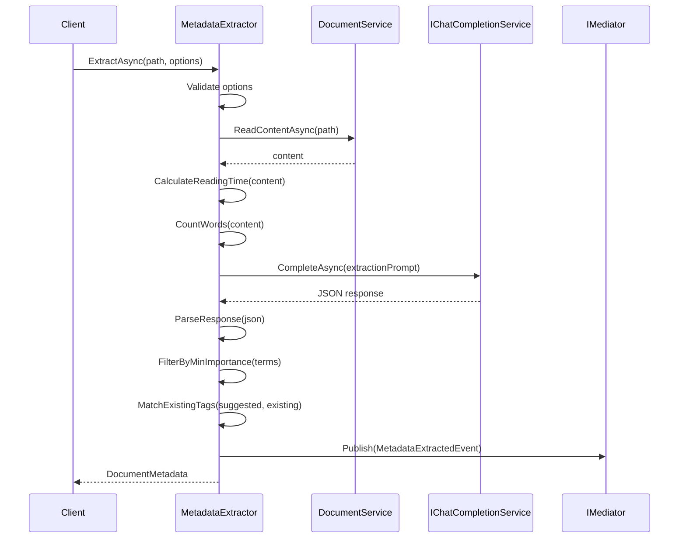

# LCS-DES-076b: Design Specification — Metadata Extraction

## 1. Metadata & Categorization

| Field | Value | Description |
| :--- | :--- | :--- |
| **Feature ID** | `AGT-076b` | Sub-part of AGT-076 |
| **Feature Name** | `Metadata Extraction (Key Terms, Concepts)` | Automated document metadata generation |
| **Target Version** | `v0.7.6b` | Second sub-part of v0.7.6 |
| **Module Scope** | `Lexichord.Modules.Agents` | Agents module |
| **Swimlane** | `Ensemble` | Agent vertical |
| **License Tier** | `WriterPro` | Premium feature |
| **Feature Gate Key** | `FeatureFlags.Agents.Summarizer` | License gate key |
| **Author** | Lead Architect | |
| **Status** | `Draft` | |
| **Last Updated** | `2026-01-27` | |
| **Parent Document** | [LCS-DES-076-INDEX](./LCS-DES-076-INDEX.md) | |
| **Scope Breakdown** | [LCS-SBD-076 Section 3.2](./LCS-SBD-076.md#32-v076b-metadata-extraction) | |

---

## 2. Executive Summary

### 2.1 The Requirement

Effective document management requires rich metadata for searchability, categorization, and discovery:

- **Key terms** enable precise search and indexing
- **Concepts** allow hierarchical organization and topic clustering
- **Tags** support faceted navigation and filtering
- **Reading time** helps users plan their reading
- **Audience inference** guides content recommendations
- **Complexity scoring** matches content to reader skill level

Manual metadata creation is time-consuming, inconsistent, and often skipped entirely.

### 2.2 The Proposed Solution

Implement automated metadata extraction that:

1. Extracts key terms with importance scoring and frequency analysis
2. Identifies high-level concepts for categorization
3. Suggests tags consistent with existing workspace taxonomy
4. Calculates reading time based on word count and complexity
5. Infers target audience from vocabulary and style
6. Scores document complexity on a 1-10 scale

---

## 3. Architecture & Modular Strategy

### 3.1 Dependencies

#### 3.1.1 Upstream Dependencies

| Interface | Source Version | Purpose |
| :--- | :--- | :--- |
| `IChatCompletionService` | v0.6.1a | LLM for metadata extraction |
| `IPromptRenderer` | v0.6.3b | Template rendering |
| `IPromptTemplateRepository` | v0.6.3c | Template storage |
| `IDocumentService` | v0.1.4a | Document content access |
| `ISettingsService` | v0.1.6a | User preferences |
| `ILicenseContext` | v0.0.4c | License verification |
| `IMediator` | v0.0.7a | Event publishing |

#### 3.1.2 NuGet Packages

| Package | Version | Purpose |
| :--- | :--- | :--- |
| `System.Text.Json` | 8.x | JSON parsing for LLM responses |
| (No new packages) | — | Uses existing dependencies |

### 3.2 Licensing Behavior

- **Load Behavior:** Soft Gate - Service returns "NotAuthorized" for unlicensed users
- **UI Gate:** "Extract Metadata" button shows lock icon
- **Fallback Experience:** Previously extracted metadata remains viewable but not regeneratable

---

## 4. Data Contract (The API)

### 4.1 Core Records

```csharp
namespace Lexichord.Modules.Agents.Abstractions;

/// <summary>
/// A key term extracted from the document with scoring and metadata.
/// Terms are ranked by importance to the document's main topic.
/// </summary>
public record KeyTerm
{
    /// <summary>
    /// The extracted term (single word or short phrase).
    /// Normalized to lowercase unless proper noun.
    /// </summary>
    public required string Term { get; init; }

    /// <summary>
    /// Importance score indicating centrality to the document's topic.
    /// Range: 0.0 (tangential) to 1.0 (core topic).
    /// </summary>
    public double Importance { get; init; }

    /// <summary>
    /// Number of occurrences in the document.
    /// Higher frequency often (but not always) indicates importance.
    /// </summary>
    public int Frequency { get; init; }

    /// <summary>
    /// Whether this is a technical or domain-specific term.
    /// Technical terms may require specialized knowledge to understand.
    /// </summary>
    public bool IsTechnical { get; init; }

    /// <summary>
    /// Brief definition if the term is defined within the document.
    /// Null if no definition found.
    /// </summary>
    public string? Definition { get; init; }

    /// <summary>
    /// Broader category this term belongs to (e.g., "programming", "finance").
    /// </summary>
    public string? Category { get; init; }

    /// <summary>
    /// Related terms also found in the document.
    /// </summary>
    public IReadOnlyList<string>? RelatedTerms { get; init; }
}

/// <summary>
/// Comprehensive metadata extracted from a document.
/// Provides structured information for indexing, categorization, and discovery.
/// </summary>
public record DocumentMetadata
{
    /// <summary>
    /// Suggested title if document lacks one or has a poor title.
    /// Null if existing title is adequate.
    /// </summary>
    public string? SuggestedTitle { get; init; }

    /// <summary>
    /// One-line description of the document (max 150 characters).
    /// Suitable for search result snippets or previews.
    /// </summary>
    public required string OneLiner { get; init; }

    /// <summary>
    /// Key terms extracted from the document, ordered by importance.
    /// </summary>
    public required IReadOnlyList<KeyTerm> KeyTerms { get; init; }

    /// <summary>
    /// High-level concepts identified in the document.
    /// More abstract than key terms; suitable for topic modeling.
    /// </summary>
    public required IReadOnlyList<string> Concepts { get; init; }

    /// <summary>
    /// Suggested tags for categorization.
    /// Formatted as lowercase with hyphens (e.g., "api-design").
    /// </summary>
    public required IReadOnlyList<string> SuggestedTags { get; init; }

    /// <summary>
    /// Inferred primary category for the document.
    /// Examples: "Tutorial", "API Reference", "Architecture", "Report"
    /// </summary>
    public string? PrimaryCategory { get; init; }

    /// <summary>
    /// Inferred target audience for the document.
    /// Examples: "software developers", "data scientists", "executives"
    /// </summary>
    public string? TargetAudience { get; init; }

    /// <summary>
    /// Estimated reading time in minutes.
    /// Based on word count with complexity adjustments.
    /// </summary>
    public int EstimatedReadingMinutes { get; init; }

    /// <summary>
    /// Document complexity score.
    /// Range: 1 (elementary) to 10 (expert-level).
    /// </summary>
    public int ComplexityScore { get; init; }

    /// <summary>
    /// Detected document type based on structure and content.
    /// </summary>
    public DocumentType DocumentType { get; init; }

    /// <summary>
    /// Named entities (people, organizations, products) found in the document.
    /// </summary>
    public IReadOnlyList<string>? NamedEntities { get; init; }

    /// <summary>
    /// Primary language of the document (ISO 639-1 code).
    /// </summary>
    public string Language { get; init; } = "en";

    /// <summary>
    /// Word count of the document.
    /// </summary>
    public int WordCount { get; init; }

    /// <summary>
    /// Timestamp when metadata was extracted.
    /// </summary>
    public DateTimeOffset ExtractedAt { get; init; } = DateTimeOffset.UtcNow;

    /// <summary>
    /// Token usage for the extraction operation.
    /// </summary>
    public required UsageMetrics Usage { get; init; }

    /// <summary>
    /// Model used for extraction.
    /// </summary>
    public string? Model { get; init; }
}

/// <summary>
/// Document type classification.
/// </summary>
public enum DocumentType
{
    Unknown,
    Article,
    Tutorial,
    HowTo,
    Reference,
    APIDocumentation,
    Specification,
    Report,
    Whitepaper,
    Proposal,
    Meeting,
    Notes,
    Readme,
    Changelog,
    Other
}
```

### 4.2 Configuration Records

```csharp
namespace Lexichord.Modules.Agents.Abstractions;

/// <summary>
/// Configuration options for metadata extraction.
/// </summary>
public record MetadataExtractionOptions
{
    /// <summary>
    /// Maximum number of key terms to extract.
    /// Range: 1-20. Default: 10.
    /// </summary>
    public int MaxKeyTerms { get; init; } = 10;

    /// <summary>
    /// Maximum number of concepts to identify.
    /// Range: 1-10. Default: 5.
    /// </summary>
    public int MaxConcepts { get; init; } = 5;

    /// <summary>
    /// Maximum number of tags to suggest.
    /// Range: 1-15. Default: 8.
    /// </summary>
    public int MaxTags { get; init; } = 8;

    /// <summary>
    /// Whether to extract named entities (people, organizations, products).
    /// May increase extraction time.
    /// </summary>
    public bool ExtractNamedEntities { get; init; } = true;

    /// <summary>
    /// Whether to infer target audience.
    /// </summary>
    public bool InferAudience { get; init; } = true;

    /// <summary>
    /// Whether to calculate complexity score.
    /// </summary>
    public bool CalculateComplexity { get; init; } = true;

    /// <summary>
    /// Domain context for improved term extraction.
    /// Examples: "software engineering", "machine learning", "finance"
    /// </summary>
    public string? DomainContext { get; init; }

    /// <summary>
    /// Existing tags in the workspace for consistency.
    /// Suggested tags will prefer matching existing tags.
    /// </summary>
    public IReadOnlyList<string>? ExistingTags { get; init; }

    /// <summary>
    /// Minimum importance score for including a key term.
    /// Range: 0.0-1.0. Default: 0.3.
    /// </summary>
    public double MinimumTermImportance { get; init; } = 0.3;

    /// <summary>
    /// Whether to include term definitions when found in document.
    /// </summary>
    public bool IncludeDefinitions { get; init; } = true;

    /// <summary>
    /// Words per minute for reading time calculation.
    /// Default: 200 (average adult reading speed).
    /// </summary>
    public int ReadingWordsPerMinute { get; init; } = 200;

    /// <summary>
    /// Validates the options configuration.
    /// </summary>
    public void Validate()
    {
        if (MaxKeyTerms < 1 || MaxKeyTerms > 20)
            throw new ArgumentOutOfRangeException(nameof(MaxKeyTerms), "Must be between 1 and 20");
        if (MaxConcepts < 1 || MaxConcepts > 10)
            throw new ArgumentOutOfRangeException(nameof(MaxConcepts), "Must be between 1 and 10");
        if (MaxTags < 1 || MaxTags > 15)
            throw new ArgumentOutOfRangeException(nameof(MaxTags), "Must be between 1 and 15");
        if (MinimumTermImportance < 0 || MinimumTermImportance > 1)
            throw new ArgumentOutOfRangeException(nameof(MinimumTermImportance), "Must be between 0.0 and 1.0");
        if (ReadingWordsPerMinute < 50 || ReadingWordsPerMinute > 500)
            throw new ArgumentOutOfRangeException(nameof(ReadingWordsPerMinute), "Must be between 50 and 500");
    }
}
```

### 4.3 Interface Definition

```csharp
namespace Lexichord.Modules.Agents.Abstractions;

/// <summary>
/// Interface for extracting structured metadata from documents.
/// </summary>
public interface IMetadataExtractor
{
    /// <summary>
    /// Extracts comprehensive metadata from a document at the specified path.
    /// </summary>
    /// <param name="documentPath">Absolute path to the document.</param>
    /// <param name="options">Extraction configuration options. Null uses defaults.</param>
    /// <param name="ct">Cancellation token.</param>
    /// <returns>Extracted document metadata.</returns>
    /// <exception cref="FileNotFoundException">Document not found.</exception>
    /// <exception cref="UnauthorizedException">User lacks WriterPro license.</exception>
    Task<DocumentMetadata> ExtractAsync(
        string documentPath,
        MetadataExtractionOptions? options = null,
        CancellationToken ct = default);

    /// <summary>
    /// Extracts metadata from provided content directly.
    /// </summary>
    /// <param name="content">Text content to analyze.</param>
    /// <param name="options">Extraction configuration options. Null uses defaults.</param>
    /// <param name="ct">Cancellation token.</param>
    /// <returns>Extracted document metadata.</returns>
    /// <exception cref="ArgumentException">Content is null or empty.</exception>
    /// <exception cref="UnauthorizedException">User lacks WriterPro license.</exception>
    Task<DocumentMetadata> ExtractFromContentAsync(
        string content,
        MetadataExtractionOptions? options = null,
        CancellationToken ct = default);

    /// <summary>
    /// Suggests tags for a document based on content and existing workspace tags.
    /// Prefers tags that match existing taxonomy.
    /// </summary>
    /// <param name="documentPath">Path to the document.</param>
    /// <param name="existingWorkspaceTags">Tags already used in the workspace.</param>
    /// <param name="maxSuggestions">Maximum number of suggestions.</param>
    /// <param name="ct">Cancellation token.</param>
    /// <returns>List of suggested tags, ordered by relevance.</returns>
    Task<IReadOnlyList<string>> SuggestTagsAsync(
        string documentPath,
        IReadOnlyList<string> existingWorkspaceTags,
        int maxSuggestions = 5,
        CancellationToken ct = default);

    /// <summary>
    /// Calculates reading time for content using word count and complexity heuristics.
    /// Does not use LLM; purely algorithmic.
    /// </summary>
    /// <param name="content">Text content to analyze.</param>
    /// <param name="wordsPerMinute">Base reading speed. Default: 200.</param>
    /// <returns>Estimated reading time in minutes.</returns>
    int CalculateReadingTime(string content, int wordsPerMinute = 200);

    /// <summary>
    /// Extracts only key terms from content (lighter-weight than full extraction).
    /// </summary>
    /// <param name="content">Text content to analyze.</param>
    /// <param name="maxTerms">Maximum terms to return.</param>
    /// <param name="ct">Cancellation token.</param>
    /// <returns>List of key terms with importance scores.</returns>
    Task<IReadOnlyList<KeyTerm>> ExtractKeyTermsAsync(
        string content,
        int maxTerms = 10,
        CancellationToken ct = default);
}
```

---

## 5. Implementation Logic

### 5.1 Extraction Flow



### 5.2 Reading Time Algorithm

```csharp
/// <summary>
/// Calculates reading time with complexity adjustments.
/// </summary>
public int CalculateReadingTime(string content, int wordsPerMinute = 200)
{
    if (string.IsNullOrWhiteSpace(content))
        return 0;

    // Count words
    var wordCount = CountWords(content);

    // Base time
    var baseMinutes = (double)wordCount / wordsPerMinute;

    // Complexity adjustments
    var complexityMultiplier = 1.0;

    // Technical content: code blocks
    var codeBlockCount = CountCodeBlocks(content);
    if (codeBlockCount > 0)
    {
        // Code blocks read at ~50% speed, but estimate 50 words per block
        baseMinutes += codeBlockCount * 0.5;
    }

    // Complex sentences: average > 25 words per sentence
    var avgSentenceLength = CalculateAverageSentenceLength(content);
    if (avgSentenceLength > 25)
    {
        complexityMultiplier += 0.1; // 10% slower for complex sentences
    }

    // Technical vocabulary
    var technicalDensity = EstimateTechnicalDensity(content);
    if (technicalDensity > 0.1) // More than 10% technical terms
    {
        complexityMultiplier += 0.2; // 20% slower for technical content
    }

    // Tables and structured content
    var tableCount = CountTables(content);
    baseMinutes += tableCount * 0.5; // 30 seconds per table

    // Images (if Markdown with image refs)
    var imageCount = CountImages(content);
    baseMinutes += imageCount * 0.2; // 12 seconds per image

    return Math.Max(1, (int)Math.Ceiling(baseMinutes * complexityMultiplier));
}

private static int CountWords(string content)
{
    return content.Split(new[] { ' ', '\n', '\r', '\t' },
        StringSplitOptions.RemoveEmptyEntries).Length;
}

private static int CountCodeBlocks(string content)
{
    return Regex.Matches(content, @"```[\s\S]*?```").Count;
}

private static double CalculateAverageSentenceLength(string content)
{
    var sentences = Regex.Split(content, @"[.!?]+\s+");
    if (sentences.Length == 0) return 0;

    var totalWords = sentences.Sum(s => CountWords(s));
    return (double)totalWords / sentences.Length;
}

private static double EstimateTechnicalDensity(string content)
{
    // Simple heuristic: count camelCase/PascalCase words, acronyms, etc.
    var words = content.Split(new[] { ' ', '\n', '\r', '\t' },
        StringSplitOptions.RemoveEmptyEntries);
    if (words.Length == 0) return 0;

    var technicalCount = words.Count(w =>
        Regex.IsMatch(w, @"[a-z][A-Z]") || // camelCase
        Regex.IsMatch(w, @"^[A-Z]{2,}$") || // ACRONYM
        Regex.IsMatch(w, @"^\w+\(\)$") // function()
    );

    return (double)technicalCount / words.Length;
}
```

### 5.3 Complexity Scoring Algorithm

```text
COMPLEXITY SCORING (1-10):
│
├── Base Score: Start at 5 (neutral)
│
├── Vocabulary Factors:
│   ├── Average word length > 7 chars: +1
│   ├── Technical term density > 10%: +1
│   ├── Jargon/acronym density > 5%: +1
│   └── Simple vocabulary (< 5 char avg): -1
│
├── Sentence Structure:
│   ├── Average sentence > 25 words: +1
│   ├── Average sentence < 12 words: -1
│   └── Complex punctuation (semicolons, em-dashes): +0.5
│
├── Document Structure:
│   ├── Deep heading nesting (h4+): +0.5
│   ├── Tables and diagrams: +0.5
│   └── Bullet lists (easier to scan): -0.5
│
├── Content Type:
│   ├── Code blocks present: +1
│   ├── Mathematical notation: +1
│   ├── Citations/references: +0.5
│   └── Examples/tutorials: -0.5
│
├── Normalization:
│   └── Clamp to range 1-10
│
└── LLM Verification:
    └── Cross-check with LLM assessment for final score
```

### 5.4 Tag Matching Algorithm

```csharp
/// <summary>
/// Matches suggested tags against existing workspace tags.
/// Prefers exact matches, then fuzzy matches, then novel suggestions.
/// </summary>
private IReadOnlyList<string> MatchExistingTags(
    IReadOnlyList<string> suggestedTags,
    IReadOnlyList<string>? existingTags,
    int maxTags)
{
    if (existingTags == null || existingTags.Count == 0)
        return suggestedTags.Take(maxTags).ToList();

    var result = new List<string>();
    var existingSet = new HashSet<string>(existingTags, StringComparer.OrdinalIgnoreCase);

    foreach (var suggested in suggestedTags)
    {
        // Exact match
        if (existingSet.Contains(suggested))
        {
            result.Add(suggested);
            continue;
        }

        // Fuzzy match: find similar existing tag
        var similar = existingTags.FirstOrDefault(e =>
            LevenshteinSimilarity(e, suggested) > 0.8);
        if (similar != null)
        {
            result.Add(similar); // Use existing tag spelling
            continue;
        }

        // Novel tag (add if room)
        result.Add(suggested);

        if (result.Count >= maxTags)
            break;
    }

    return result.Take(maxTags).ToList();
}
```

---

## 6. Prompt Templates

### 6.1 Metadata Extraction Prompt

```yaml
template_id: "metadata-extractor"
name: "Metadata Extractor"
version: "1.0.0"

system_prompt: |
  You are a document analysis specialist focused on extracting structured metadata from text.
  Your task is to identify key information that helps categorize, index, and discover documents.

  ## Guidelines

  ### Key Terms
  - Extract terms central to the document's topic
  - Score importance based on prominence and relevance to main thesis
  - Identify whether terms are technical (require domain expertise)
  - Include definitions when explicitly provided in the document
  - Prefer noun phrases over single words when the phrase is meaningful

  ### Concepts
  - Identify high-level themes at a more abstract level than key terms
  - Concepts should enable topic clustering across documents
  - Limit to truly distinct concepts (avoid overlapping concepts)

  ### Tags
  - Format: lowercase with hyphens (e.g., "machine-learning")
  - Prefer single or hyphenated terms over long phrases
  - Consider both topic tags and format tags (e.g., "tutorial", "reference")
  {{#existing_tags}}
  - Prefer matching these existing workspace tags when relevant: {{existing_tags}}
  {{/existing_tags}}

  ### Document Analysis
  - One-liner: A single sentence capturing the document's purpose (max 150 chars)
  - Audience: Infer who would benefit most from reading this
  - Complexity: Score 1-10 based on vocabulary, structure, and prerequisites
  - Type: Classify the document format/purpose

  {{#domain_context}}
  ## Domain Context
  This document is in the domain of: {{domain_context}}
  Consider terminology specific to this domain when scoring importance.
  {{/domain_context}}

user_prompt: |
  Analyze the following document and extract structured metadata.

  Document content:
  """
  {{document_content}}
  """

  Extract the following information and return as valid JSON:

  ```json
  {
    "suggested_title": "A better title if the current one is missing or poor, or null",
    "one_liner": "Single sentence describing the document's purpose (max 150 chars)",
    "key_terms": [
      {
        "term": "the extracted term",
        "importance": 0.95,
        "frequency": 5,
        "is_technical": true,
        "definition": "definition if found in document, or null",
        "category": "broader category this term belongs to"
      }
    ],
    "concepts": ["High-level concept 1", "Concept 2"],
    "suggested_tags": ["tag-one", "tag-two"],
    "primary_category": "Tutorial|Reference|Report|Specification|etc",
    "target_audience": "Description of ideal reader",
    "complexity_score": 7,
    "document_type": "article|tutorial|howto|reference|api|specification|report|whitepaper|proposal|meeting|notes|readme|changelog|other",
    "named_entities": ["Entity 1", "Entity 2"]
  }
  ```

  Requirements:
  - Return exactly {{max_key_terms}} key terms, ordered by importance
  - Return exactly {{max_concepts}} concepts
  - Return up to {{max_tags}} tags
  - Importance scores must be between 0.0 and 1.0
  - Complexity score must be between 1 and 10
  - All JSON must be valid and properly escaped
```

---

## 7. Test Scenarios

### 7.1 Key Term Extraction Tests

```csharp
[Trait("Category", "Unit")]
[Trait("Version", "v0.7.6b")]
public class KeyTermExtractionTests
{
    [Fact]
    public async Task ExtractAsync_TechnicalDocument_ReturnsRelevantTerms()
    {
        // Arrange
        var content = @"
# REST API Design Guide

This guide covers REST API design principles including authentication,
rate limiting, and versioning. OAuth 2.0 is recommended for authentication.
";
        var sut = CreateMetadataExtractor();

        // Act
        var result = await sut.ExtractFromContentAsync(content);

        // Assert
        result.KeyTerms.Should().Contain(t =>
            t.Term.Contains("REST", StringComparison.OrdinalIgnoreCase) ||
            t.Term.Contains("API", StringComparison.OrdinalIgnoreCase));
        result.KeyTerms.Should().Contain(t =>
            t.Term.Contains("OAuth", StringComparison.OrdinalIgnoreCase) ||
            t.Term.Contains("authentication", StringComparison.OrdinalIgnoreCase));
    }

    [Fact]
    public async Task ExtractAsync_ReturnsTermsOrderedByImportance()
    {
        // Arrange
        var content = "Sample document about machine learning and data science.";
        var mockLlm = CreateMockLlmWithTerms(new[]
        {
            new KeyTerm { Term = "machine learning", Importance = 0.95 },
            new KeyTerm { Term = "data science", Importance = 0.85 },
            new KeyTerm { Term = "algorithms", Importance = 0.70 }
        });
        var sut = CreateMetadataExtractor(mockLlm);

        // Act
        var result = await sut.ExtractFromContentAsync(content);

        // Assert
        result.KeyTerms.Should().BeInDescendingOrder(t => t.Importance);
    }

    [Fact]
    public async Task ExtractAsync_FiltersByMinimumImportance()
    {
        // Arrange
        var options = new MetadataExtractionOptions { MinimumTermImportance = 0.5 };
        var mockLlm = CreateMockLlmWithTerms(new[]
        {
            new KeyTerm { Term = "important", Importance = 0.9 },
            new KeyTerm { Term = "marginal", Importance = 0.3 }
        });
        var sut = CreateMetadataExtractor(mockLlm);

        // Act
        var result = await sut.ExtractFromContentAsync("content", options);

        // Assert
        result.KeyTerms.Should().OnlyContain(t => t.Importance >= 0.5);
    }

    [Fact]
    public async Task ExtractAsync_IdentifiesTechnicalTerms()
    {
        // Arrange
        var content = "Use kubectl to manage Kubernetes clusters with gRPC.";
        var sut = CreateMetadataExtractor();

        // Act
        var result = await sut.ExtractFromContentAsync(content);

        // Assert
        result.KeyTerms.Where(t => t.IsTechnical).Should().NotBeEmpty();
    }
}
```

### 7.2 Reading Time Tests

```csharp
[Trait("Category", "Unit")]
[Trait("Version", "v0.7.6b")]
public class ReadingTimeTests
{
    [Theory]
    [InlineData(200, 1)]
    [InlineData(400, 2)]
    [InlineData(600, 3)]
    [InlineData(1000, 5)]
    [InlineData(2000, 10)]
    public void CalculateReadingTime_PlainText_ReturnsExpectedMinutes(
        int wordCount, int expectedMinutes)
    {
        // Arrange
        var content = GenerateWords(wordCount);
        var sut = CreateMetadataExtractor();

        // Act
        var result = sut.CalculateReadingTime(content, wordsPerMinute: 200);

        // Assert
        result.Should().Be(expectedMinutes);
    }

    [Fact]
    public void CalculateReadingTime_WithCodeBlocks_AddsExtraTime()
    {
        // Arrange
        var content = GenerateWords(200) + "\n```csharp\nvar x = 1;\n```\n" + GenerateWords(200);
        var sut = CreateMetadataExtractor();

        // Act
        var result = sut.CalculateReadingTime(content);

        // Assert
        result.Should().BeGreaterThan(2); // Plain 400 words = 2 min, code should add more
    }

    [Fact]
    public void CalculateReadingTime_TechnicalContent_AddsComplexityMultiplier()
    {
        // Arrange: Content with technical density
        var content = "Use kubectl to deploy Pods via gRPC. " +
                      "Configure RBAC with YAML manifests. " +
                      "Monitor with Prometheus and Grafana.";
        // ~15 words, but highly technical
        var plainContent = GenerateWords(15);
        var sut = CreateMetadataExtractor();

        // Act
        var technicalTime = sut.CalculateReadingTime(content + GenerateWords(200));
        var plainTime = sut.CalculateReadingTime(plainContent + GenerateWords(200));

        // Assert
        technicalTime.Should().BeGreaterThan(plainTime);
    }

    [Fact]
    public void CalculateReadingTime_EmptyContent_ReturnsZero()
    {
        var sut = CreateMetadataExtractor();

        var result = sut.CalculateReadingTime("");

        result.Should().Be(0);
    }

    [Fact]
    public void CalculateReadingTime_MinimumOneMinute()
    {
        var sut = CreateMetadataExtractor();

        var result = sut.CalculateReadingTime("Hello world.");

        result.Should().Be(1); // Minimum 1 minute
    }
}
```

### 7.3 Tag Suggestion Tests

```csharp
[Trait("Category", "Unit")]
[Trait("Version", "v0.7.6b")]
public class TagSuggestionTests
{
    [Fact]
    public async Task SuggestTagsAsync_PrefersExistingTags()
    {
        // Arrange
        var existingTags = new[] { "api-design", "rest", "authentication" };
        var sut = CreateMetadataExtractor();
        // Mock LLM suggests similar tags
        SetupMockToSuggest(new[] { "api", "rest-api", "auth" });

        // Act
        var result = await sut.SuggestTagsAsync("/doc.md", existingTags);

        // Assert
        // Should prefer "rest" (existing) over "rest-api" (suggested)
        result.Should().Contain("rest");
    }

    [Fact]
    public async Task SuggestTagsAsync_FormatsTagsCorrectly()
    {
        // Arrange
        var sut = CreateMetadataExtractor();

        // Act
        var result = await sut.SuggestTagsAsync("/doc.md", Array.Empty<string>());

        // Assert
        result.Should().OnlyContain(tag =>
            tag == tag.ToLowerInvariant() &&
            !tag.Contains(' ') &&
            Regex.IsMatch(tag, @"^[a-z0-9-]+$"));
    }

    [Fact]
    public async Task SuggestTagsAsync_RespectsMaxSuggestions()
    {
        // Arrange
        var sut = CreateMetadataExtractor();

        // Act
        var result = await sut.SuggestTagsAsync("/doc.md", Array.Empty<string>(), maxSuggestions: 3);

        // Assert
        result.Should().HaveCountLessOrEqualTo(3);
    }
}
```

### 7.4 Complexity Scoring Tests

```csharp
[Trait("Category", "Unit")]
[Trait("Version", "v0.7.6b")]
public class ComplexityScoringTests
{
    [Fact]
    public async Task ExtractAsync_SimpleContent_ReturnsLowComplexity()
    {
        // Arrange
        var content = "The cat sat on the mat. It was a nice day.";
        var sut = CreateMetadataExtractor();

        // Act
        var result = await sut.ExtractFromContentAsync(content);

        // Assert
        result.ComplexityScore.Should().BeLessThan(4);
    }

    [Fact]
    public async Task ExtractAsync_TechnicalContent_ReturnsHighComplexity()
    {
        // Arrange
        var content = @"
Implementing distributed consensus via Raft requires understanding leader election,
log replication, and safety guarantees. The algorithm maintains strong consistency
through quorum-based voting and term numbers.
";
        var sut = CreateMetadataExtractor();

        // Act
        var result = await sut.ExtractFromContentAsync(content);

        // Assert
        result.ComplexityScore.Should().BeGreaterThan(6);
    }

    [Fact]
    public async Task ExtractAsync_ComplexityInValidRange()
    {
        // Arrange
        var sut = CreateMetadataExtractor();

        // Act
        var result = await sut.ExtractFromContentAsync("Any content here.");

        // Assert
        result.ComplexityScore.Should().BeInRange(1, 10);
    }
}
```

---

## 8. Observability & Logging

| Level | Source | Message Template |
| :--- | :--- | :--- |
| Debug | MetadataExtractor | `"Metadata extraction started: {DocumentPath}"` |
| Debug | MetadataExtractor | `"Reading time calculated: {WordCount} words = {ReadingMinutes} min"` |
| Info | MetadataExtractor | `"Metadata extracted: {KeyTermCount} terms, {TagCount} tags, complexity={Complexity}"` |
| Info | MetadataExtractor | `"Tag matching: {MatchedCount} existing, {NewCount} new tags"` |
| Warning | MetadataExtractor | `"Failed to parse LLM response as JSON, using fallback"` |
| Warning | MetadataExtractor | `"Complexity score {Score} outside expected range, clamping"` |
| Error | MetadataExtractor | `"Metadata extraction failed: {ErrorMessage}"` |

---

## 9. Security & Safety

| Risk | Level | Mitigation |
| :--- | :--- | :--- |
| PII in metadata | Low | Metadata reflects document content; user controls source |
| Sensitive terms exposed | Low | Key terms are document content, not new data |
| Prompt injection | Medium | Sanitize content before embedding in prompt |
| Tag pollution | Low | Match against existing tags; format validation |

---

## 10. Acceptance Criteria

### 10.1 Functional Criteria

| # | Given | When | Then |
| :--- | :--- | :--- | :--- |
| 1 | Technical document | Extract metadata | Returns relevant technical key terms |
| 2 | MaxKeyTerms = 5 | Extract metadata | Returns at most 5 key terms |
| 3 | MinimumTermImportance = 0.5 | Extract metadata | All terms have importance >= 0.5 |
| 4 | ExistingTags provided | Suggest tags | Prefers matching existing tags |
| 5 | 200 word document | Calculate reading time | Returns 1 minute |
| 6 | 2000 word document | Calculate reading time | Returns ~10 minutes |
| 7 | Document with code blocks | Calculate reading time | Adds extra time for code |
| 8 | Simple vocabulary | Extract metadata | Complexity score < 4 |
| 9 | Complex academic paper | Extract metadata | Complexity score > 6 |
| 10 | Any document | Extract metadata | OneLiner is <= 150 characters |

### 10.2 Performance Criteria

| # | Scenario | Target |
| :--- | :--- | :--- |
| 1 | Reading time calculation | < 50ms for 10,000 words |
| 2 | Full metadata extraction | < 10 seconds (excluding LLM) |
| 3 | Tag matching | < 10ms for 100 existing tags |

---

## 11. Deliverable Checklist

| # | Deliverable | Status |
| :--- | :--- | :--- |
| 1 | `KeyTerm.cs` record | [ ] |
| 2 | `DocumentMetadata.cs` record | [ ] |
| 3 | `MetadataExtractionOptions.cs` record | [ ] |
| 4 | `DocumentType.cs` enumeration | [ ] |
| 5 | `IMetadataExtractor.cs` interface | [ ] |
| 6 | `MetadataExtractor.cs` implementation | [ ] |
| 7 | `metadata-extractor.yaml` prompt template | [ ] |
| 8 | Reading time algorithm | [ ] |
| 9 | Complexity scoring algorithm | [ ] |
| 10 | Tag matching algorithm | [ ] |
| 11 | Unit tests for key term extraction | [ ] |
| 12 | Unit tests for reading time | [ ] |
| 13 | Unit tests for complexity scoring | [ ] |
| 14 | Unit tests for tag suggestion | [ ] |

---

## 12. Verification Commands

```bash
# Run all v0.7.6b tests
dotnet test --filter "Version=v0.7.6b" --logger "console;verbosity=detailed"

# Run key term tests only
dotnet test --filter "FullyQualifiedName~KeyTermExtractionTests"

# Run reading time tests only
dotnet test --filter "FullyQualifiedName~ReadingTimeTests"

# Run complexity tests only
dotnet test --filter "FullyQualifiedName~ComplexityScoringTests"

# Run tag suggestion tests only
dotnet test --filter "FullyQualifiedName~TagSuggestionTests"

# Verify template file exists
ls src/Lexichord.Modules.Agents/Prompts/metadata-extractor.yaml
```

---

## Document History

| Version | Date | Author | Changes |
| :--- | :--- | :--- | :--- |
| 1.0 | 2026-01-27 | Lead Architect | Initial draft |

---
