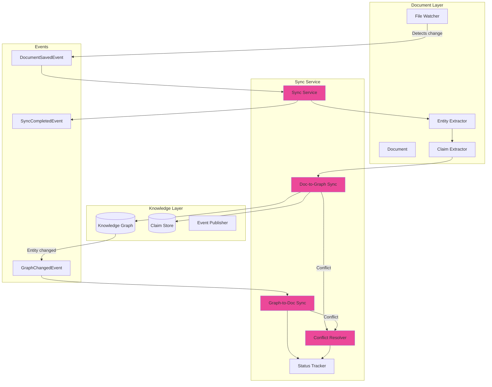
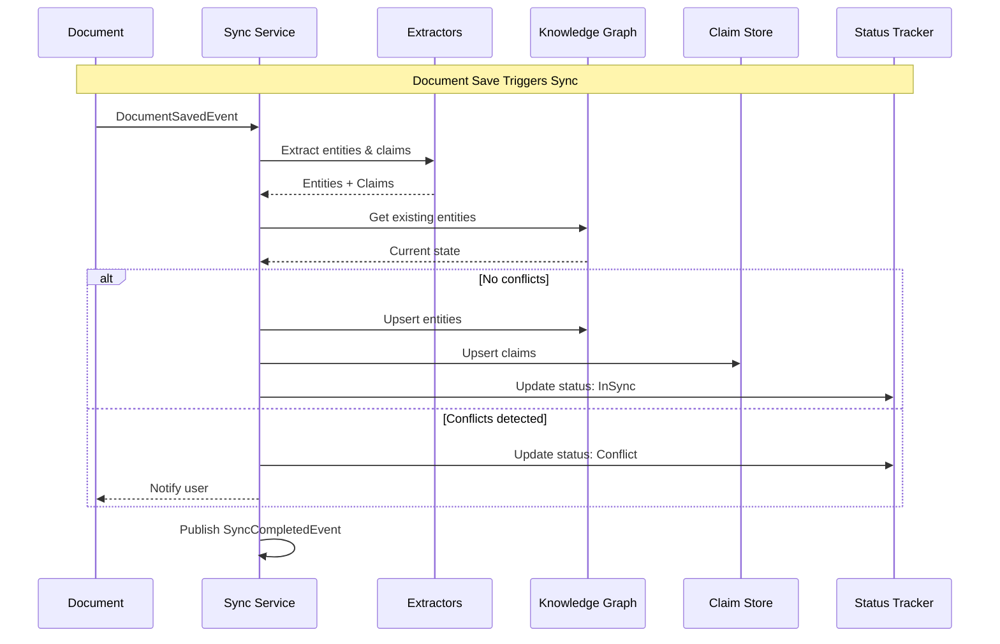
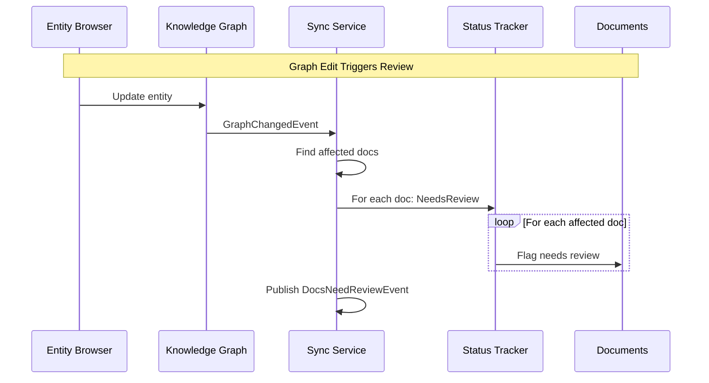

# LCS-SBD-076-KG: Scope Overview — Sync Service

## Document Control

| Field            | Value                                                        |
| :--------------- | :----------------------------------------------------------- |
| **Document ID**  | LCS-SBD-076-KG                                               |
| **Version**      | v0.7.6                                                       |
| **Codename**     | Sync Service (CKVS Phase 4c)                                 |
| **Status**       | Draft                                                        |
| **Last Updated** | 2026-01-31                                                   |
| **Owner**        | Lead Architect                                               |
| **Depends On**   | v0.7.5-KG (Unified Validation), v0.5.6-KG (Claims), v0.4.5-KG (Graph) |

---

## 1. Executive Summary

### 1.1 The Vision

**v0.7.6-KG** delivers the **Sync Service** — bidirectional synchronization between documents and the Knowledge Graph. When documents change, the graph updates. When the graph changes (e.g., via Entity Browser), affected documents are flagged.

This closes the loop on CKVS: documents feed the graph, and the graph validates documents.

### 1.2 Business Value

- **Automatic Graph Updates:** Document edits propagate to graph.
- **Stale Detection:** Know when docs are out of sync with graph.
- **Change Propagation:** Graph updates suggest doc changes.
- **Audit Trail:** Track who changed what and when.
- **Consistency Guarantee:** Single source of truth maintained.

### 1.3 Success Criteria

1. Document saves trigger claim re-extraction and graph updates.
2. Graph edits flag affected documents as "needs review".
3. Conflict detection when both doc and graph changed.
4. Sync lag <5 minutes for typical workspaces.
5. Event-driven architecture for scalability.
6. Idempotent operations for reliability.

---

## 2. Relationship to Existing v0.7.6

The existing v0.7.6 spec covers the **Summarizer Agent**. Sync Service operates independently but:

- **Summarizer Benefits:** Can summarize sync status and changes.
- **Shared Events:** Uses same MediatR event infrastructure.
- **Background Processing:** Non-blocking sync operations.

---

## 3. Key Deliverables

### 3.1 Sub-Parts

| Sub-Part | Title | Description | Est. Hours |
|:---------|:------|:------------|:-----------|
| v0.7.6e | Sync Service Core | Orchestrates sync operations | 6 |
| v0.7.6f | Doc-to-Graph Sync | Updates graph from doc changes | 8 |
| v0.7.6g | Graph-to-Doc Sync | Flags docs from graph changes | 6 |
| v0.7.6h | Conflict Resolver | Handles simultaneous changes | 6 |
| v0.7.6i | Sync Status Tracker | Tracks sync state per document | 4 |
| v0.7.6j | Sync Event Publisher | Publishes sync events | 3 |
| **Total** | | | **33 hours** |

### 3.2 Key Interfaces

```csharp
/// <summary>
/// Bidirectional sync between documents and knowledge graph.
/// </summary>
public interface ISyncService
{
    /// <summary>
    /// Syncs a document's changes to the knowledge graph.
    /// </summary>
    Task<SyncResult> SyncDocumentToGraphAsync(
        Document document,
        SyncOptions options,
        CancellationToken ct = default);

    /// <summary>
    /// Gets documents affected by a graph change.
    /// </summary>
    Task<IReadOnlyList<AffectedDocument>> GetAffectedDocumentsAsync(
        GraphChange change,
        CancellationToken ct = default);

    /// <summary>
    /// Gets sync status for a document.
    /// </summary>
    Task<SyncStatus> GetSyncStatusAsync(
        Guid documentId,
        CancellationToken ct = default);

    /// <summary>
    /// Resolves conflicts between doc and graph.
    /// </summary>
    Task<ConflictResolution> ResolveConflictAsync(
        SyncConflict conflict,
        ConflictResolutionStrategy strategy,
        CancellationToken ct = default);
}

/// <summary>
/// Result of a sync operation.
/// </summary>
public record SyncResult
{
    /// <summary>Sync operation status.</summary>
    public SyncResultStatus Status { get; init; }

    /// <summary>Entities created or updated.</summary>
    public int EntitiesAffected { get; init; }

    /// <summary>Claims created or updated.</summary>
    public int ClaimsAffected { get; init; }

    /// <summary>Relationships created or updated.</summary>
    public int RelationshipsAffected { get; init; }

    /// <summary>Conflicts detected.</summary>
    public IReadOnlyList<SyncConflict> Conflicts { get; init; } = Array.Empty<SyncConflict>();

    /// <summary>Sync duration.</summary>
    public TimeSpan Duration { get; init; }
}

public enum SyncResultStatus { Success, PartialSuccess, Conflict, Failed }

/// <summary>
/// Sync status for a document.
/// </summary>
public record SyncStatus
{
    /// <summary>Document ID.</summary>
    public Guid DocumentId { get; init; }

    /// <summary>Current sync state.</summary>
    public SyncState State { get; init; }

    /// <summary>Last sync timestamp.</summary>
    public DateTimeOffset? LastSyncAt { get; init; }

    /// <summary>Pending changes count.</summary>
    public int PendingChanges { get; init; }

    /// <summary>Unresolved conflicts.</summary>
    public int ConflictCount { get; init; }

    /// <summary>Graph entities linked to this doc.</summary>
    public int LinkedEntityCount { get; init; }
}

public enum SyncState
{
    InSync,         // Document and graph aligned
    PendingSync,    // Document changed, graph not updated
    NeedsReview,    // Graph changed, document may need update
    Conflict,       // Both changed, needs resolution
    NeverSynced     // New document, not yet synced
}

/// <summary>
/// A conflict between document and graph state.
/// </summary>
public record SyncConflict
{
    /// <summary>Conflict ID.</summary>
    public Guid Id { get; init; } = Guid.NewGuid();

    /// <summary>Document ID.</summary>
    public Guid DocumentId { get; init; }

    /// <summary>Entity involved in conflict.</summary>
    public Guid? EntityId { get; init; }

    /// <summary>Claim involved in conflict.</summary>
    public Guid? ClaimId { get; init; }

    /// <summary>Value in document.</summary>
    public required object DocumentValue { get; init; }

    /// <summary>Value in graph.</summary>
    public required object GraphValue { get; init; }

    /// <summary>When conflict was detected.</summary>
    public DateTimeOffset DetectedAt { get; init; } = DateTimeOffset.UtcNow;
}

public enum ConflictResolutionStrategy
{
    UseDocument,    // Document wins
    UseGraph,       // Graph wins
    Manual,         // User decides
    Merge           // Attempt to merge
}
```

### 3.3 Sync Architecture



---

## 4. Sync Flow: Document to Graph



---

## 5. Sync Flow: Graph to Document



---

## 6. Conflict Resolution UI

```
┌────────────────────────────────────────────────────────────────┐
│ Sync Conflict Detected                                         │
├────────────────────────────────────────────────────────────────┤
│                                                                │
│ Entity: GET /users                                             │
│ Property: description                                          │
│                                                                │
│ ┌─────────────────────────────┐ ┌─────────────────────────────┐│
│ │ Document Value              │ │ Graph Value                 ││
│ ├─────────────────────────────┤ ├─────────────────────────────┤│
│ │ "Returns a list of all     │ │ "Returns paginated list of  ││
│ │  users in the system"      │ │  users with filtering"      ││
│ └─────────────────────────────┘ └─────────────────────────────┘│
│                                                                │
│ Changed in doc: 2 hours ago by alice@company.com              │
│ Changed in graph: 1 hour ago by bob@company.com               │
│                                                                │
│ Resolution:                                                    │
│ ○ Use document value                                          │
│ ● Use graph value (recommended - more recent)                 │
│ ○ Merge manually                                              │
│                                                                │
│ [Cancel] [Apply Resolution]                                    │
└────────────────────────────────────────────────────────────────┘
```

---

## 7. Dependencies

| Component | Source | Usage |
|:----------|:-------|:------|
| `IEntityExtractionPipeline` | v0.4.5g | Extract entities from docs |
| `IClaimExtractionService` | v0.5.6-KG | Extract claims from docs |
| `IGraphRepository` | v0.4.5e | Graph CRUD operations |
| `IDocumentRepository` | v0.4.1c | Document metadata |
| `IMediator` | v0.0.7a | Event publishing |

---

## 8. License Gating

| Tier | Sync Service |
|:-----|:-------------|
| Core | Not available |
| WriterPro | Doc-to-graph only (manual) |
| Teams | Full bidirectional sync |
| Enterprise | Full + conflict workflows |

---

## 9. Performance Targets

| Metric | Target | Measurement |
|:-------|:-------|:------------|
| Sync trigger to completion | <5min | P95 timing |
| Single doc sync | <30s | P95 timing |
| Conflict detection | <1s | P95 timing |
| Affected doc lookup | <500ms | P95 timing |

---

## 10. Risks & Mitigations

| Risk | Mitigation |
|:-----|:-----------|
| Sync storms (many docs) | Debouncing, rate limiting |
| Conflict fatigue | Smart defaults, batch resolution |
| Data loss on bad merge | Versioning, undo support |
| Performance at scale | Event-driven, async processing |

---

## 11. What This Enables

- **v0.7.7 Validation Workflows:** Sync triggers validation.
- **Continuous Consistency:** Always-current knowledge base.
- **Change Tracking:** Full audit trail of changes.
- **Team Collaboration:** Multiple editors, one truth.

---
