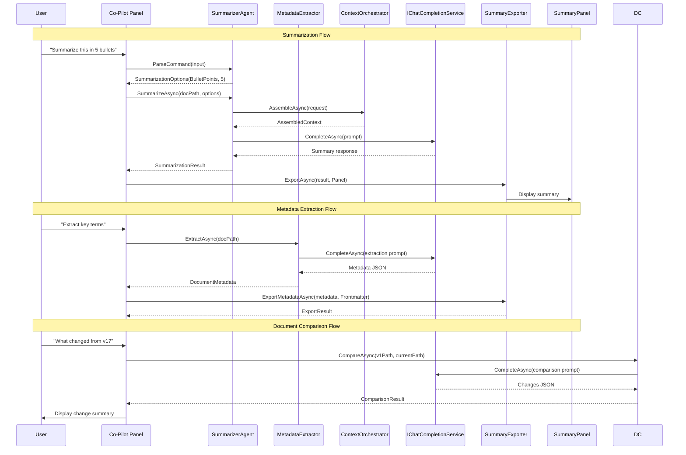

# LCS-SBD-076: Scope Breakdown — The Summarizer Agent

## Document Control

| Field            | Value                                    |
| :--------------- | :--------------------------------------- |
| **Document ID**  | LCS-SBD-076                              |
| **Version**      | v0.7.6                                   |
| **Codename**     | The Summarizer Agent                     |
| **Status**       | Draft                                    |
| **Last Updated** | 2026-01-27                               |
| **Owner**        | Lead Architect                           |
| **Depends On**   | v0.6.1 (LLM Gateway), v0.6.3 (Prompt Templating), v0.6.6 (Agent Abstraction), v0.7.1 (Agent Registry), v0.7.2 (Context Assembler) |

---

## 1. Executive Summary

### 1.1 The Vision

**v0.7.6** delivers the **Summarizer Agent** — a specialized AI agent that distills documents into executive summaries, key takeaways, and structured metadata. This release transforms Lexichord from a document editing platform into an intelligent content analysis system, enabling writers to extract insights, compare document versions, and generate publication-ready abstracts with minimal effort.

The Summarizer Agent addresses a critical writer workflow pain point: the tedious process of manually creating abstracts, TL;DRs, and bullet-point summaries for long-form content. By leveraging the LLM infrastructure established in v0.6.x and the agent framework from v0.7.1-v0.7.2, the Summarizer provides instant, context-aware summarization that respects document structure and maintains authorial voice.

### 1.2 Business Value

- **Time Savings:** Reduces abstract/summary creation from 30+ minutes to under 30 seconds for typical documents.
- **Consistency:** Generates uniform summary formats across all documents in a workspace or project.
- **Metadata Enrichment:** Automatically extracts key terms, concepts, and reading time estimates for document management.
- **Version Intelligence:** Enables rapid comparison between document versions to identify what changed.
- **Export Flexibility:** Produces summaries in multiple formats (Markdown panel, frontmatter, standalone files).
- **Foundation:** Establishes patterns for future metadata-generating agents (tagging, categorization, citation extraction).

### 1.3 Success Criteria

This release succeeds when:

1. Users can generate abstracts, TL;DRs, and bullet-point summaries via natural language commands ("Summarize this in 3 bullets").
2. The agent extracts key terms and concepts from documents and presents them as actionable metadata.
3. Summaries can be exported to a Markdown summary panel, document frontmatter, or standalone files.
4. Users can compare two document versions and receive a structured "What changed?" analysis.
5. All summarization features are gated to WriterPro+ license tier with appropriate upgrade prompts for lower tiers.

### 1.4 License Gating

The Summarizer Agent is a **WriterPro** feature. Lower tiers will see:

- Read-only access to any previously generated summaries (no regeneration capability)
- "Upgrade to WriterPro" prompt when attempting to invoke summarization
- Summarization commands disabled in Co-pilot with upgrade tooltip
- Document comparison feature locked with "WriterPro Feature" badge

---

## 2. Dependencies on Prior Versions

| Component                  | Source Version | Usage in v0.7.6                                   |
| :------------------------- | :------------- | :------------------------------------------------ |
| `IChatCompletionService`   | v0.6.1a        | LLM communication for summarization requests      |
| `IPromptRenderer`          | v0.6.3b        | Template rendering for summarization prompts      |
| `IPromptTemplateRepository`| v0.6.3c        | Storage for summarizer prompt templates           |
| `IContextInjector`         | v0.6.3d        | Injecting document context into prompts           |
| `IAgent`                   | v0.6.6a        | Base agent interface for SummarizerAgent          |
| `IAgentRegistry`           | v0.7.1b        | Agent registration and discovery                  |
| `AgentConfiguration`       | v0.7.1a        | Agent persona configuration                       |
| `IContextOrchestrator`     | v0.7.2c        | Intelligent context assembly for summarization    |
| `IDocumentService`         | v0.1.4a        | Document content access                           |
| `IEditorService`           | v0.1.3a        | Editor integration for summary insertion          |
| `ISettingsService`         | v0.1.6a        | User preferences for summarization defaults       |
| `ILicenseContext`          | v0.0.4c        | License tier verification                         |
| `IMediator`                | v0.0.7a        | Event publishing for summarization events         |
| `Serilog`                  | v0.0.3b        | Logging summarization operations                  |

---

## 3. Sub-Part Specifications

### 3.1 v0.7.6a: Summarization Modes

| Field            | Value                                     |
| :--------------- | :---------------------------------------- |
| **Sub-Part ID**  | AGT-076a                                  |
| **Title**        | Summarization Modes (Abstract, TLDR, Bullet Points) |
| **Module**       | `Lexichord.Modules.Agents`                |
| **License Tier** | WriterPro                                 |

**Goal:** Implement multiple summarization output formats that users can invoke via natural language commands or explicit mode selection.

**Key Deliverables:**

- `SummarizationMode` enum with Abstract, TLDR, BulletPoints, KeyTakeaways, Executive variants
- `SummarizationOptions` record with mode, length constraints, and style preferences
- `ISummarizerAgent` interface extending `IAgent` with mode-specific methods
- `SummarizerAgent` implementation with prompt templates per mode
- Natural language command parsing for summarization intents
- Token budget management for long documents (chunking strategy)
- Unit tests for mode selection and output format validation

**Key Interfaces:**

```csharp
namespace Lexichord.Modules.Agents.Abstractions;

/// <summary>
/// Defines the available summarization output formats.
/// </summary>
public enum SummarizationMode
{
    /// <summary>Academic-style abstract (150-300 words).</summary>
    Abstract,

    /// <summary>One-paragraph TL;DR summary (50-100 words).</summary>
    TLDR,

    /// <summary>Bullet-point key points (3-7 items).</summary>
    BulletPoints,

    /// <summary>Numbered key takeaways with explanations.</summary>
    KeyTakeaways,

    /// <summary>Executive summary for stakeholders (100-200 words).</summary>
    Executive,

    /// <summary>Custom format defined by user prompt.</summary>
    Custom
}

/// <summary>
/// Configuration options for summarization requests.
/// </summary>
public record SummarizationOptions
{
    /// <summary>The output format mode.</summary>
    public SummarizationMode Mode { get; init; } = SummarizationMode.BulletPoints;

    /// <summary>Maximum number of items for list-based modes (BulletPoints, KeyTakeaways).</summary>
    public int MaxItems { get; init; } = 5;

    /// <summary>Target word count for prose modes (Abstract, TLDR, Executive).</summary>
    public int? TargetWordCount { get; init; }

    /// <summary>Custom prompt override for Custom mode.</summary>
    public string? CustomPrompt { get; init; }

    /// <summary>Whether to include section-level summaries for long documents.</summary>
    public bool IncludeSectionSummaries { get; init; } = false;

    /// <summary>Target audience for tone adjustment.</summary>
    public string? TargetAudience { get; init; }

    /// <summary>Whether to preserve technical terminology.</summary>
    public bool PreserveTechnicalTerms { get; init; } = true;
}

/// <summary>
/// The result of a summarization operation.
/// </summary>
public record SummarizationResult
{
    /// <summary>The generated summary content.</summary>
    public required string Summary { get; init; }

    /// <summary>The mode used to generate this summary.</summary>
    public SummarizationMode Mode { get; init; }

    /// <summary>Individual bullet points if mode is BulletPoints or KeyTakeaways.</summary>
    public IReadOnlyList<string>? Items { get; init; }

    /// <summary>Estimated reading time of the original document in minutes.</summary>
    public int OriginalReadingMinutes { get; init; }

    /// <summary>Word count of the generated summary.</summary>
    public int SummaryWordCount { get; init; }

    /// <summary>Compression ratio (original words / summary words).</summary>
    public double CompressionRatio { get; init; }

    /// <summary>Token usage for this summarization.</summary>
    public UsageMetrics Usage { get; init; }

    /// <summary>Timestamp when the summary was generated.</summary>
    public DateTimeOffset GeneratedAt { get; init; } = DateTimeOffset.UtcNow;
}

/// <summary>
/// Specialized agent interface for document summarization.
/// </summary>
public interface ISummarizerAgent : IAgent
{
    /// <summary>
    /// Generates a summary of the specified document.
    /// </summary>
    Task<SummarizationResult> SummarizeAsync(
        string documentPath,
        SummarizationOptions options,
        CancellationToken ct = default);

    /// <summary>
    /// Generates a summary of the provided content (for selections or excerpts).
    /// </summary>
    Task<SummarizationResult> SummarizeContentAsync(
        string content,
        SummarizationOptions options,
        CancellationToken ct = default);

    /// <summary>
    /// Parses a natural language command and returns the appropriate summarization options.
    /// </summary>
    SummarizationOptions ParseCommand(string naturalLanguageCommand);
}
```

**Prompt Template Structure:**

```yaml
# prompts/specialist-summarizer.yaml
template_id: "specialist-summarizer"
name: "Summarizer Specialist"
system_prompt: |
  You are a professional content summarizer focused on distilling documents into clear, actionable summaries.
  Your role is to extract the essential information while preserving accuracy and the author's intent.

  Guidelines:
  - Maintain factual accuracy - never invent or assume information not in the source
  - Preserve key terminology and proper nouns exactly as written
  - Capture the main thesis, supporting points, and conclusions
  - Adapt tone and complexity to the target audience
  {{#target_audience}}
  - Target audience: {{target_audience}}
  {{/target_audience}}
  {{#preserve_technical_terms}}
  - Preserve all technical terms and domain-specific vocabulary
  {{/preserve_technical_terms}}

  {{#mode_instructions}}
  {{mode_instructions}}
  {{/mode_instructions}}

mode_prompts:
  abstract: |
    Generate an academic-style abstract that:
    1. States the document's purpose in the opening sentence
    2. Summarizes the methodology or approach (if applicable)
    3. Presents key findings or arguments
    4. Concludes with implications or significance
    Target length: {{target_word_count}} words (default: 150-300 words)

  tldr: |
    Generate a TL;DR (Too Long; Didn't Read) summary that:
    1. Captures the single most important takeaway in the first sentence
    2. Provides essential context in 2-3 additional sentences
    3. Uses accessible language suitable for quick scanning
    Target length: {{target_word_count}} words (default: 50-100 words)

  bullet_points: |
    Generate a bullet-point summary that:
    1. Lists exactly {{max_items}} key points (default: 5)
    2. Starts each bullet with an action verb or key noun
    3. Keeps each bullet to one sentence (max 25 words)
    4. Orders bullets by importance (most critical first)
    5. Covers different aspects rather than repeating themes

  key_takeaways: |
    Generate numbered key takeaways that:
    1. Identifies {{max_items}} actionable insights (default: 5)
    2. Formats each as: "**Takeaway N:** [One-sentence insight]"
    3. Includes a brief explanation (1-2 sentences) under each
    4. Focuses on practical implications and applications

  executive: |
    Generate an executive summary suitable for stakeholders that:
    1. Opens with the business context and objective
    2. Presents key findings in order of strategic importance
    3. Highlights risks, opportunities, or decisions required
    4. Concludes with recommended next steps
    Target length: {{target_word_count}} words (default: 100-200 words)

user_prompt: |
  {{#mode_is_abstract}}Generate an abstract for the following document.{{/mode_is_abstract}}
  {{#mode_is_tldr}}Generate a TL;DR summary for the following document.{{/mode_is_tldr}}
  {{#mode_is_bullets}}Summarize the following document in {{max_items}} bullet points.{{/mode_is_bullets}}
  {{#mode_is_takeaways}}Extract {{max_items}} key takeaways from the following document.{{/mode_is_takeaways}}
  {{#mode_is_executive}}Generate an executive summary of the following document.{{/mode_is_executive}}
  {{#mode_is_custom}}{{custom_prompt}}{{/mode_is_custom}}

  Document content:
  """
  {{document_content}}
  """
```

**Natural Language Command Patterns:**

```text
SUMMARIZATION COMMAND PARSING:
│
├── "Summarize this" / "Summarize" → Default to BulletPoints (5 items)
├── "Create an abstract" / "Write an abstract" → Abstract mode
├── "Give me a TLDR" / "TL;DR" / "Too long didn't read" → TLDR mode
├── "Summarize in N bullets/points" → BulletPoints with MaxItems=N
├── "What are the key takeaways?" → KeyTakeaways mode
├── "Executive summary" / "For stakeholders" → Executive mode
├── "Summarize for [audience]" → Default mode with TargetAudience set
└── "[Custom instruction]" → Custom mode with instruction as prompt

EXAMPLES:
- "Summarize this in 3 bullet points" → BulletPoints, MaxItems=3
- "Create an abstract for this paper" → Abstract, default length
- "TL;DR this for a technical audience" → TLDR, TargetAudience="technical"
- "Give me 7 key takeaways" → KeyTakeaways, MaxItems=7
- "Executive summary, keep it under 100 words" → Executive, TargetWordCount=100
```

**Dependencies:**

- v0.6.6a: `IAgent` (base interface)
- v0.6.3b: `IPromptRenderer` (template rendering)
- v0.7.2c: `IContextOrchestrator` (document context assembly)

---

### 3.2 v0.7.6b: Metadata Extraction

| Field            | Value                                     |
| :--------------- | :---------------------------------------- |
| **Sub-Part ID**  | AGT-076b                                  |
| **Title**        | Metadata Extraction (Key Terms, Concepts) |
| **Module**       | `Lexichord.Modules.Agents`                |
| **License Tier** | WriterPro                                 |

**Goal:** Implement automated extraction of document metadata including key terms, concepts, categories, and reading time estimates to enrich document management capabilities.

**Key Deliverables:**

- `DocumentMetadata` record for structured metadata output
- `IMetadataExtractor` interface for metadata extraction operations
- `MetadataExtractionOptions` for configurable extraction behavior
- Key term extraction with frequency and importance scoring
- Concept identification and hierarchical categorization
- Reading time estimation algorithm
- Target audience inference
- Integration with document frontmatter for persistence
- Unit tests for extraction accuracy and consistency

**Key Interfaces:**

```csharp
namespace Lexichord.Modules.Agents.Abstractions;

/// <summary>
/// Comprehensive metadata extracted from a document.
/// </summary>
public record DocumentMetadata
{
    /// <summary>Suggested title if document lacks one.</summary>
    public string? SuggestedTitle { get; init; }

    /// <summary>One-line description of the document.</summary>
    public required string OneLiner { get; init; }

    /// <summary>Key terms extracted from the document with importance scores.</summary>
    public required IReadOnlyList<KeyTerm> KeyTerms { get; init; }

    /// <summary>High-level concepts identified in the document.</summary>
    public required IReadOnlyList<string> Concepts { get; init; }

    /// <summary>Suggested tags for categorization.</summary>
    public required IReadOnlyList<string> SuggestedTags { get; init; }

    /// <summary>Inferred primary category.</summary>
    public string? PrimaryCategory { get; init; }

    /// <summary>Inferred target audience.</summary>
    public string? TargetAudience { get; init; }

    /// <summary>Estimated reading time in minutes.</summary>
    public int EstimatedReadingMinutes { get; init; }

    /// <summary>Document complexity score (1-10).</summary>
    public int ComplexityScore { get; init; }

    /// <summary>Detected document type (article, tutorial, reference, etc.).</summary>
    public string? DocumentType { get; init; }

    /// <summary>List of proper nouns and named entities.</summary>
    public IReadOnlyList<string>? NamedEntities { get; init; }

    /// <summary>Extraction timestamp.</summary>
    public DateTimeOffset ExtractedAt { get; init; } = DateTimeOffset.UtcNow;

    /// <summary>Token usage for extraction.</summary>
    public UsageMetrics Usage { get; init; }
}

/// <summary>
/// A key term extracted from the document with scoring.
/// </summary>
public record KeyTerm
{
    /// <summary>The extracted term.</summary>
    public required string Term { get; init; }

    /// <summary>Importance score (0.0 to 1.0).</summary>
    public double Importance { get; init; }

    /// <summary>Number of occurrences in the document.</summary>
    public int Frequency { get; init; }

    /// <summary>Whether this is a technical/domain-specific term.</summary>
    public bool IsTechnical { get; init; }

    /// <summary>Brief definition if the term is defined in the document.</summary>
    public string? Definition { get; init; }
}

/// <summary>
/// Configuration options for metadata extraction.
/// </summary>
public record MetadataExtractionOptions
{
    /// <summary>Maximum number of key terms to extract.</summary>
    public int MaxKeyTerms { get; init; } = 10;

    /// <summary>Maximum number of concepts to identify.</summary>
    public int MaxConcepts { get; init; } = 5;

    /// <summary>Maximum number of tags to suggest.</summary>
    public int MaxTags { get; init; } = 8;

    /// <summary>Whether to extract named entities.</summary>
    public bool ExtractNamedEntities { get; init; } = true;

    /// <summary>Whether to infer target audience.</summary>
    public bool InferAudience { get; init; } = true;

    /// <summary>Whether to calculate complexity score.</summary>
    public bool CalculateComplexity { get; init; } = true;

    /// <summary>Domain context for better term extraction (e.g., "software engineering").</summary>
    public string? DomainContext { get; init; }

    /// <summary>Existing tags to consider for consistency.</summary>
    public IReadOnlyList<string>? ExistingTags { get; init; }
}

/// <summary>
/// Interface for document metadata extraction operations.
/// </summary>
public interface IMetadataExtractor
{
    /// <summary>
    /// Extracts comprehensive metadata from a document.
    /// </summary>
    Task<DocumentMetadata> ExtractAsync(
        string documentPath,
        MetadataExtractionOptions? options = null,
        CancellationToken ct = default);

    /// <summary>
    /// Extracts metadata from provided content.
    /// </summary>
    Task<DocumentMetadata> ExtractFromContentAsync(
        string content,
        MetadataExtractionOptions? options = null,
        CancellationToken ct = default);

    /// <summary>
    /// Suggests tags for a document based on its content and existing workspace tags.
    /// </summary>
    Task<IReadOnlyList<string>> SuggestTagsAsync(
        string documentPath,
        IReadOnlyList<string> existingWorkspaceTags,
        int maxSuggestions = 5,
        CancellationToken ct = default);

    /// <summary>
    /// Calculates reading time for content.
    /// </summary>
    int CalculateReadingTime(string content, int wordsPerMinute = 200);
}
```

**Metadata Extraction Prompt Template:**

```yaml
# prompts/metadata-extractor.yaml
template_id: "metadata-extractor"
name: "Metadata Extractor"
system_prompt: |
  You are a document analysis specialist focused on extracting structured metadata from text.
  Your task is to identify key information that helps categorize and discover documents.

  Guidelines:
  - Extract terms that are central to the document's topic
  - Score importance based on prominence and relevance to the main thesis
  - Identify concepts at a higher abstraction level than individual terms
  - Suggest tags that would help users find this document
  - Be precise with named entities (people, organizations, products)

  {{#domain_context}}
  Domain context: {{domain_context}}
  Consider terminology specific to this domain.
  {{/domain_context}}

user_prompt: |
  Analyze the following document and extract structured metadata.

  Document content:
  """
  {{document_content}}
  """

  Provide your analysis in the following JSON format:
  ```json
  {
    "suggested_title": "Title if not obvious from content, or null",
    "one_liner": "Single sentence describing the document",
    "key_terms": [
      {"term": "term1", "importance": 0.95, "is_technical": true, "definition": "if defined"},
      ...
    ],
    "concepts": ["High-level concept 1", "Concept 2", ...],
    "suggested_tags": ["tag1", "tag2", ...],
    "primary_category": "Category name",
    "target_audience": "Inferred audience",
    "complexity_score": 7,
    "document_type": "article|tutorial|reference|report|documentation|other",
    "named_entities": ["Entity 1", "Entity 2", ...]
  }
  ```
```

**Reading Time Algorithm:**

```text
READING TIME CALCULATION:
│
├── Base rate: 200 words per minute (configurable)
├── Adjustments:
│   ├── Technical content: +20% time (detected via term analysis)
│   ├── Code blocks: 400 words per minute equivalent
│   ├── Tables: 30 seconds per table
│   ├── Images: 12 seconds per image
│   └── Complex sentences: +10% for avg sentence > 25 words
│
└── Formula:
    reading_time = (word_count / base_rate) * complexity_multiplier
                 + (code_blocks * code_factor)
                 + (tables * 0.5)
                 + (images * 0.2)
```

**Dependencies:**

- v0.7.6a: `ISummarizerAgent` (for one-liner generation)
- v0.6.1a: `IChatCompletionService` (LLM for extraction)
- v0.1.4a: `IDocumentService` (document access)

---

### 3.3 v0.7.6c: Export Formats

| Field            | Value                                     |
| :--------------- | :---------------------------------------- |
| **Sub-Part ID**  | AGT-076c                                  |
| **Title**        | Export Formats (Markdown Summary Panel)   |
| **Module**       | `Lexichord.Modules.Agents`                |
| **License Tier** | WriterPro                                 |

**Goal:** Implement multiple export destinations for generated summaries and metadata, including a dedicated Markdown summary panel, document frontmatter injection, and standalone file export.

**Key Deliverables:**

- `ISummaryExporter` interface for export operations
- `ExportDestination` enum with Panel, Frontmatter, File, Clipboard variants
- `SummaryPanelView.axaml` for dedicated summary display
- `SummaryPanelViewModel` with summary management operations
- Frontmatter injection/update logic for YAML frontmatter
- Standalone file export with configurable naming
- Clipboard export for quick sharing
- Summary persistence in `.lexichord/summaries/` sidecar files
- Unit tests for export format correctness

**Key Interfaces:**

```csharp
namespace Lexichord.Modules.Agents.Abstractions;

/// <summary>
/// Destination options for summary export.
/// </summary>
public enum ExportDestination
{
    /// <summary>Display in the dedicated summary panel.</summary>
    Panel,

    /// <summary>Inject into document YAML frontmatter.</summary>
    Frontmatter,

    /// <summary>Create a standalone summary file.</summary>
    File,

    /// <summary>Copy to system clipboard.</summary>
    Clipboard,

    /// <summary>Insert at cursor position in editor.</summary>
    InlineInsert
}

/// <summary>
/// Configuration for summary export operations.
/// </summary>
public record ExportOptions
{
    /// <summary>Where to export the summary.</summary>
    public ExportDestination Destination { get; init; } = ExportDestination.Panel;

    /// <summary>For File destination: the output file path (auto-generated if null).</summary>
    public string? OutputPath { get; init; }

    /// <summary>For Frontmatter: which fields to include.</summary>
    public FrontmatterFields Fields { get; init; } = FrontmatterFields.All;

    /// <summary>Whether to overwrite existing summary data.</summary>
    public bool Overwrite { get; init; } = true;

    /// <summary>For File: include document metadata in export.</summary>
    public bool IncludeMetadata { get; init; } = true;

    /// <summary>Custom template for file export format.</summary>
    public string? ExportTemplate { get; init; }
}

/// <summary>
/// Flags for which frontmatter fields to include.
/// </summary>
[Flags]
public enum FrontmatterFields
{
    None = 0,
    Abstract = 1,
    Tags = 2,
    KeyTerms = 4,
    ReadingTime = 8,
    Category = 16,
    Audience = 32,
    All = Abstract | Tags | KeyTerms | ReadingTime | Category | Audience
}

/// <summary>
/// Interface for exporting summaries to various destinations.
/// </summary>
public interface ISummaryExporter
{
    /// <summary>
    /// Exports a summarization result to the specified destination.
    /// </summary>
    Task<ExportResult> ExportAsync(
        SummarizationResult summary,
        string sourceDocumentPath,
        ExportOptions options,
        CancellationToken ct = default);

    /// <summary>
    /// Exports document metadata to the specified destination.
    /// </summary>
    Task<ExportResult> ExportMetadataAsync(
        DocumentMetadata metadata,
        string sourceDocumentPath,
        ExportOptions options,
        CancellationToken ct = default);

    /// <summary>
    /// Updates existing frontmatter with new summary data.
    /// </summary>
    Task<ExportResult> UpdateFrontmatterAsync(
        string documentPath,
        SummarizationResult? summary,
        DocumentMetadata? metadata,
        CancellationToken ct = default);

    /// <summary>
    /// Retrieves a previously exported summary for a document.
    /// </summary>
    Task<SummarizationResult?> GetCachedSummaryAsync(
        string documentPath,
        CancellationToken ct = default);
}

/// <summary>
/// Result of an export operation.
/// </summary>
public record ExportResult
{
    /// <summary>Whether the export succeeded.</summary>
    public bool Success { get; init; }

    /// <summary>The destination where content was exported.</summary>
    public ExportDestination Destination { get; init; }

    /// <summary>For File exports: the path to the created file.</summary>
    public string? OutputPath { get; init; }

    /// <summary>Error message if export failed.</summary>
    public string? ErrorMessage { get; init; }

    /// <summary>Number of bytes written (for file exports).</summary>
    public long? BytesWritten { get; init; }
}
```

**Summary Panel UI Layout:**

```text
┌──────────────────────────────────────────────────────────────────────────┐
│  Summary Panel                              [Refresh] [Export v] [Close] │
├──────────────────────────────────────────────────────────────────────────┤
│  Document: ProjectSpec.md                                                │
│  Generated: 2 minutes ago | Model: gpt-4o                               │
├──────────────────────────────────────────────────────────────────────────┤
│                                                                          │
│  ┌─ Summary (Bullet Points) ────────────────────────────────────────────┐│
│  │ • First key point extracted from the document                        ││
│  │ • Second key point with important details                            ││
│  │ • Third key point summarizing conclusions                            ││
│  └──────────────────────────────────────────────────────────────────────┘│
│                                                                          │
│  ┌─ Key Terms ──────────────────────────────────────────────────────────┐│
│  │ [API Design] [REST] [Authentication] [Rate Limiting] [Versioning]   ││
│  └──────────────────────────────────────────────────────────────────────┘│
│                                                                          │
│  ┌─ Metadata ───────────────────────────────────────────────────────────┐│
│  │ Reading Time: 12 min  |  Complexity: 7/10  |  Type: Documentation    ││
│  │ Audience: Software developers  |  Category: API Reference            ││
│  └──────────────────────────────────────────────────────────────────────┘│
│                                                                          │
│  [Copy Summary] [Add to Frontmatter] [Generate Different Format v]      │
└──────────────────────────────────────────────────────────────────────────┘
```

**Frontmatter YAML Structure:**

```yaml
---
title: "Document Title"
summary:
  abstract: |
    This document describes the API design principles
    and implementation guidelines for the project.
  tldr: "API design guidelines for RESTful services."
  key_points:
    - "Use consistent naming conventions"
    - "Implement proper authentication"
    - "Version your APIs"
  generated_at: "2026-01-27T10:30:00Z"
  model: "gpt-4o"
metadata:
  reading_time_minutes: 12
  complexity_score: 7
  document_type: "documentation"
  target_audience: "software developers"
  key_terms:
    - term: "REST API"
      importance: 0.95
    - term: "Authentication"
      importance: 0.85
  tags:
    - api-design
    - rest
    - documentation
  category: "API Reference"
---
```

**Storage Location:**

- Windows: `%APPDATA%/Lexichord/summaries/{document-hash}.json`
- macOS: `~/Library/Application Support/Lexichord/summaries/{document-hash}.json`
- Linux: `~/.config/Lexichord/summaries/{document-hash}.json`
- Workspace: `.lexichord/summaries/{relative-path}.summary.json`

**Dependencies:**

- v0.7.6a: `SummarizationResult` (summary data)
- v0.7.6b: `DocumentMetadata` (metadata data)
- v0.1.3a: `IEditorService` (frontmatter injection)
- v0.1.4a: `IDocumentService` (file operations)

---

### 3.4 v0.7.6d: Document Comparison

| Field            | Value                                     |
| :--------------- | :---------------------------------------- |
| **Sub-Part ID**  | AGT-076d                                  |
| **Title**        | Document Comparison ("What Changed?")     |
| **Module**       | `Lexichord.Modules.Agents`                |
| **License Tier** | WriterPro                                 |

**Goal:** Implement intelligent document comparison that generates human-readable summaries of changes between two document versions, going beyond simple diff output.

**Key Deliverables:**

- `IDocumentComparer` interface for version comparison
- `ComparisonResult` record with structured change analysis
- `ChangeCategory` enum (Added, Removed, Modified, Restructured, Clarified)
- Semantic diff analysis using LLM (not just text diff)
- Section-level change tracking
- Significance scoring for changes
- "What changed?" natural language summary generation
- Comparison view UI component
- Unit tests for change detection accuracy

**Key Interfaces:**

```csharp
namespace Lexichord.Modules.Agents.Abstractions;

/// <summary>
/// Categories of document changes.
/// </summary>
public enum ChangeCategory
{
    /// <summary>New content was added.</summary>
    Added,

    /// <summary>Existing content was removed.</summary>
    Removed,

    /// <summary>Content was modified or rewritten.</summary>
    Modified,

    /// <summary>Content was moved or restructured.</summary>
    Restructured,

    /// <summary>Content was clarified without changing meaning.</summary>
    Clarified,

    /// <summary>Formatting or style changes only.</summary>
    Formatting,

    /// <summary>Factual or data corrections.</summary>
    Correction
}

/// <summary>
/// Represents a single change detected between document versions.
/// </summary>
public record DocumentChange
{
    /// <summary>Category of the change.</summary>
    public ChangeCategory Category { get; init; }

    /// <summary>Section or heading where the change occurred.</summary>
    public string? Section { get; init; }

    /// <summary>Human-readable description of the change.</summary>
    public required string Description { get; init; }

    /// <summary>Significance score (0.0 to 1.0, higher = more significant).</summary>
    public double Significance { get; init; }

    /// <summary>Original text (for Modified/Removed).</summary>
    public string? OriginalText { get; init; }

    /// <summary>New text (for Added/Modified).</summary>
    public string? NewText { get; init; }

    /// <summary>Line numbers affected in the original document.</summary>
    public (int Start, int End)? OriginalLineRange { get; init; }

    /// <summary>Line numbers affected in the new document.</summary>
    public (int Start, int End)? NewLineRange { get; init; }
}

/// <summary>
/// Result of comparing two document versions.
/// </summary>
public record ComparisonResult
{
    /// <summary>Path to the original (older) document.</summary>
    public required string OriginalPath { get; init; }

    /// <summary>Path to the new (current) document.</summary>
    public required string NewPath { get; init; }

    /// <summary>Overall summary of changes in natural language.</summary>
    public required string Summary { get; init; }

    /// <summary>List of significant changes detected.</summary>
    public required IReadOnlyList<DocumentChange> Changes { get; init; }

    /// <summary>Overall change magnitude (0.0 = identical, 1.0 = completely different).</summary>
    public double ChangeMagnitude { get; init; }

    /// <summary>Number of additions.</summary>
    public int AdditionCount { get; init; }

    /// <summary>Number of deletions.</summary>
    public int DeletionCount { get; init; }

    /// <summary>Number of modifications.</summary>
    public int ModificationCount { get; init; }

    /// <summary>Sections that were significantly changed.</summary>
    public IReadOnlyList<string> AffectedSections { get; init; }

    /// <summary>Token usage for the comparison.</summary>
    public UsageMetrics Usage { get; init; }

    /// <summary>Comparison timestamp.</summary>
    public DateTimeOffset ComparedAt { get; init; } = DateTimeOffset.UtcNow;
}

/// <summary>
/// Options for document comparison.
/// </summary>
public record ComparisonOptions
{
    /// <summary>Minimum significance score to include a change (0.0 to 1.0).</summary>
    public double SignificanceThreshold { get; init; } = 0.2;

    /// <summary>Whether to include formatting-only changes.</summary>
    public bool IncludeFormattingChanges { get; init; } = false;

    /// <summary>Whether to group changes by section.</summary>
    public bool GroupBySection { get; init; } = true;

    /// <summary>Maximum number of changes to report.</summary>
    public int MaxChanges { get; init; } = 20;

    /// <summary>Focus on specific sections (null = all sections).</summary>
    public IReadOnlyList<string>? FocusSections { get; init; }

    /// <summary>Whether to include the full text diff alongside semantic analysis.</summary>
    public bool IncludeTextDiff { get; init; } = false;
}

/// <summary>
/// Interface for comparing document versions.
/// </summary>
public interface IDocumentComparer
{
    /// <summary>
    /// Compares two document versions and generates a change summary.
    /// </summary>
    Task<ComparisonResult> CompareAsync(
        string originalPath,
        string newPath,
        ComparisonOptions? options = null,
        CancellationToken ct = default);

    /// <summary>
    /// Compares two content strings directly.
    /// </summary>
    Task<ComparisonResult> CompareContentAsync(
        string originalContent,
        string newContent,
        ComparisonOptions? options = null,
        CancellationToken ct = default);

    /// <summary>
    /// Compares a document with its git history version.
    /// </summary>
    Task<ComparisonResult> CompareWithGitVersionAsync(
        string documentPath,
        string gitRef,
        ComparisonOptions? options = null,
        CancellationToken ct = default);

    /// <summary>
    /// Generates a natural language summary of changes.
    /// </summary>
    Task<string> GenerateChangeSummaryAsync(
        ComparisonResult comparison,
        CancellationToken ct = default);
}
```

**Comparison Prompt Template:**

```yaml
# prompts/document-comparer.yaml
template_id: "document-comparer"
name: "Document Comparer"
system_prompt: |
  You are a document analyst specializing in version comparison.
  Your task is to identify and explain changes between two versions of a document.

  Guidelines:
  - Focus on semantic changes, not just textual differences
  - Categorize each change by type (Added, Removed, Modified, Restructured, Clarified, Formatting, Correction)
  - Score significance based on impact to the document's meaning and purpose
  - Identify which sections are affected
  - Provide clear, concise descriptions of what changed

  Significance scoring guide:
  - 0.9-1.0: Critical changes that alter the document's core message or purpose
  - 0.7-0.9: Major changes to important sections or key arguments
  - 0.5-0.7: Moderate changes that add/remove significant content
  - 0.3-0.5: Minor changes that refine or clarify existing content
  - 0.0-0.3: Trivial changes (typos, formatting, word choice)

user_prompt: |
  Compare the following two document versions and identify what changed.

  ORIGINAL VERSION:
  """
  {{original_content}}
  """

  NEW VERSION:
  """
  {{new_content}}
  """

  Provide your analysis in the following JSON format:
  ```json
  {
    "summary": "Overall natural language summary of changes (2-3 sentences)",
    "change_magnitude": 0.45,
    "changes": [
      {
        "category": "Modified",
        "section": "Introduction",
        "description": "Updated the project timeline from Q1 to Q2",
        "significance": 0.7,
        "original_text": "Launch planned for Q1 2026",
        "new_text": "Launch planned for Q2 2026"
      },
      ...
    ],
    "affected_sections": ["Introduction", "Timeline", "Budget"]
  }
  ```
```

**Comparison View UI Layout:**

```text
┌──────────────────────────────────────────────────────────────────────────┐
│  Document Comparison                           [Export] [Copy] [Close]   │
├────────────────────────────────┬─────────────────────────────────────────┤
│  Original: v1.0 (Jan 15)       │  New: v1.1 (Jan 27)                     │
├────────────────────────────────┴─────────────────────────────────────────┤
│                                                                          │
│  What Changed?                                                           │
│  ─────────────────────────────────────────────────────────────────────── │
│  The document was updated with revised timelines and expanded budget     │
│  section. Key stakeholder feedback was incorporated into the intro.      │
│                                                                          │
│  ┌─ Changes (12 total, showing 5 significant) ──────────────────────────┐│
│  │                                                                      ││
│  │  [!] MODIFIED in "Introduction" (Significance: High)                 ││
│  │      Updated the project timeline from Q1 to Q2 2026                 ││
│  │      - "Launch planned for Q1 2026"                                  ││
│  │      + "Launch planned for Q2 2026"                                  ││
│  │                                                                      ││
│  │  [+] ADDED in "Budget" (Significance: High)                          ││
│  │      New section detailing infrastructure costs                      ││
│  │                                                                      ││
│  │  [~] CLARIFIED in "Requirements" (Significance: Medium)              ││
│  │      Expanded definition of "user authentication"                    ││
│  │                                                                      ││
│  └──────────────────────────────────────────────────────────────────────┘│
│                                                                          │
│  [Show All Changes] [Filter by Section v] [Show Text Diff]              │
└──────────────────────────────────────────────────────────────────────────┘
```

**Dependencies:**

- v0.7.6a: `ISummarizerAgent` (for summary generation)
- v0.6.1a: `IChatCompletionService` (LLM for semantic analysis)
- v0.1.4a: `IDocumentService` (file access)

---

## 4. Implementation Checklist

| #  | Sub-Part | Task                                                      | Est. Hours |
| :- | :------- | :-------------------------------------------------------- | :--------- |
| 1  | v0.7.6a  | Create `SummarizationMode` enum and options records       | 1          |
| 2  | v0.7.6a  | Implement `ISummarizerAgent` interface                    | 1          |
| 3  | v0.7.6a  | Create summarization prompt templates (all modes)         | 2          |
| 4  | v0.7.6a  | Implement `SummarizerAgent` with mode routing             | 3          |
| 5  | v0.7.6a  | Implement natural language command parser                 | 2          |
| 6  | v0.7.6a  | Implement document chunking for long documents            | 2          |
| 7  | v0.7.6a  | Unit tests for summarization modes                        | 2          |
| 8  | v0.7.6b  | Create `DocumentMetadata` and related records             | 1          |
| 9  | v0.7.6b  | Implement `IMetadataExtractor` interface                  | 1          |
| 10 | v0.7.6b  | Create metadata extraction prompt template                | 1.5        |
| 11 | v0.7.6b  | Implement `MetadataExtractor` service                     | 2.5        |
| 12 | v0.7.6b  | Implement reading time algorithm                          | 1          |
| 13 | v0.7.6b  | Unit tests for metadata extraction                        | 2          |
| 14 | v0.7.6c  | Create `ISummaryExporter` interface                       | 1          |
| 15 | v0.7.6c  | Implement `SummaryExporter` with all destinations         | 3          |
| 16 | v0.7.6c  | Create `SummaryPanelView.axaml` UI                        | 2          |
| 17 | v0.7.6c  | Implement `SummaryPanelViewModel`                         | 2          |
| 18 | v0.7.6c  | Implement frontmatter injection logic                     | 1.5        |
| 19 | v0.7.6c  | Implement summary caching and persistence                 | 1.5        |
| 20 | v0.7.6c  | Unit tests for export operations                          | 2          |
| 21 | v0.7.6d  | Create `IDocumentComparer` interface and records          | 1          |
| 22 | v0.7.6d  | Create comparison prompt template                         | 1.5        |
| 23 | v0.7.6d  | Implement `DocumentComparer` service                      | 3          |
| 24 | v0.7.6d  | Implement change categorization and scoring               | 2          |
| 25 | v0.7.6d  | Create comparison view UI component                       | 2          |
| 26 | v0.7.6d  | Implement git version comparison                          | 1.5        |
| 27 | v0.7.6d  | Unit tests for comparison accuracy                        | 2          |
| 28 | All      | Integration tests for full summarization workflow         | 2          |
| 29 | All      | License gating implementation and tests                   | 1          |
| 30 | All      | DI registration in AgentsModule.cs                        | 0.5        |
| **Total** |   |                                                           | **48 hours** |

---

## 5. Dependency Matrix

### 5.1 Required Interfaces (from earlier versions)

| Interface                  | Source Version | Purpose                              |
| :------------------------- | :------------- | :----------------------------------- |
| `IChatCompletionService`   | v0.6.1a        | LLM communication                    |
| `IPromptRenderer`          | v0.6.3b        | Template rendering                   |
| `IPromptTemplateRepository`| v0.6.3c        | Template storage                     |
| `IAgent`                   | v0.6.6a        | Base agent interface                 |
| `IAgentRegistry`           | v0.7.1b        | Agent registration                   |
| `IContextOrchestrator`     | v0.7.2c        | Context assembly                     |
| `IDocumentService`         | v0.1.4a        | Document access                      |
| `IEditorService`           | v0.1.3a        | Editor integration                   |
| `ILicenseContext`          | v0.0.4c        | License verification                 |
| `IMediator`                | v0.0.7a        | Event publishing                     |

### 5.2 New Interfaces (defined in v0.7.6)

| Interface                   | Defined In | Module        | Purpose                    |
| :-------------------------- | :--------- | :------------ | :------------------------- |
| `ISummarizerAgent`          | v0.7.6a    | Agents        | Summarization operations   |
| `IMetadataExtractor`        | v0.7.6b    | Agents        | Metadata extraction        |
| `ISummaryExporter`          | v0.7.6c    | Agents        | Export operations          |
| `IDocumentComparer`         | v0.7.6d    | Agents        | Version comparison         |

### 5.3 New Records/DTOs (defined in v0.7.6)

| Record                   | Defined In | Purpose                                |
| :----------------------- | :--------- | :------------------------------------- |
| `SummarizationOptions`   | v0.7.6a    | Summarization configuration            |
| `SummarizationResult`    | v0.7.6a    | Summary output                         |
| `DocumentMetadata`       | v0.7.6b    | Extracted metadata                     |
| `KeyTerm`                | v0.7.6b    | Key term with scoring                  |
| `ExportOptions`          | v0.7.6c    | Export configuration                   |
| `ExportResult`           | v0.7.6c    | Export operation result                |
| `ComparisonResult`       | v0.7.6d    | Comparison output                      |
| `DocumentChange`         | v0.7.6d    | Individual change record               |

### 5.4 NuGet Packages

| Package     | Version | Purpose                    | New/Existing |
| :---------- | :------ | :------------------------- | :----------- |
| `YamlDotNet`| 15.x    | Frontmatter parsing        | Existing     |
| (No new packages) | — | v0.7.6 uses existing deps  | —            |

---

## 6. Architecture Diagram

```mermaid
graph TB
    subgraph "Lexichord.Modules.Agents"
        subgraph "v0.7.6a: Summarization Modes"
            SA[SummarizerAgent]
            SM[SummarizationMode]
            SO[SummarizationOptions]
            SR[SummarizationResult]
        end

        subgraph "v0.7.6b: Metadata Extraction"
            ME[MetadataExtractor]
            DM[DocumentMetadata]
            KT[KeyTerm]
        end

        subgraph "v0.7.6c: Export Formats"
            SE[SummaryExporter]
            SP[SummaryPanelView]
            SPV[SummaryPanelViewModel]
        end

        subgraph "v0.7.6d: Document Comparison"
            DC[DocumentComparer]
            CR[ComparisonResult]
            CV[ComparisonView]
        end
    end

    subgraph "Dependencies (Prior Versions)"
        LLM[IChatCompletionService<br/>v0.6.1a]
        PR[IPromptRenderer<br/>v0.6.3b]
        CO[IContextOrchestrator<br/>v0.7.2c]
        AR[IAgentRegistry<br/>v0.7.1b]
        DS[IDocumentService<br/>v0.1.4a]
        ES[IEditorService<br/>v0.1.3a]
        LC[ILicenseContext<br/>v0.0.4c]
    end

    SA --> SM
    SA --> SO
    SA --> SR
    SA --> LLM
    SA --> PR
    SA --> CO

    ME --> DM
    ME --> KT
    ME --> LLM
    ME --> DS

    SE --> SR
    SE --> DM
    SE --> DS
    SE --> ES
    SP --> SPV
    SPV --> SE

    DC --> CR
    DC --> SA
    DC --> LLM
    DC --> DS
    CV --> DC

    AR --> SA

    SA --> LC
    ME --> LC
    SE --> LC
    DC --> LC

    style SA fill:#4a9eff,color:#fff
    style ME fill:#4a9eff,color:#fff
    style SE fill:#4a9eff,color:#fff
    style DC fill:#4a9eff,color:#fff
    style SP fill:#22c55e,color:#fff
    style CV fill:#22c55e,color:#fff
```



---

## 7. Data Flow Diagram



---

## 8. Risks & Mitigations

| Risk | Impact | Probability | Mitigation |
| :--- | :----- | :---------- | :--------- |
| Long documents exceed token limits | High | High | Implement chunking with hierarchical summarization |
| LLM produces inaccurate summaries | High | Medium | Provide clear instructions, allow user editing, show source context |
| Metadata extraction produces irrelevant terms | Medium | Medium | Score terms by importance, allow user curation |
| Frontmatter injection corrupts existing YAML | High | Low | Parse and merge carefully, backup before modification |
| Document comparison misidentifies changes | Medium | Medium | Combine LLM analysis with text diff for accuracy |
| Performance degradation with large documents | Medium | Medium | Cache results, show progress, allow cancellation |
| License bypass attempts | Medium | Low | Server-side validation for Teams tier features |

---

## 9. Success Metrics

| Metric | Target | Measurement |
| :----- | :----- | :---------- |
| Summarization time (10,000 words) | < 15 seconds | Stopwatch timing |
| Metadata extraction time | < 10 seconds | Stopwatch timing |
| Summary accuracy (user approval rate) | > 80% | User feedback tracking |
| Key term relevance score | > 75% precision | Manual review of samples |
| Document comparison accuracy | > 85% | Manual review vs actual changes |
| Export success rate | > 99% | Error logging |
| Memory usage during summarization | < 100MB | Memory profiler |

---

## 10. What This Enables

After v0.7.6, Lexichord will support:

- **v0.7.7 (Agent Workflows):** Chain the Summarizer with other agents for complex document processing pipelines.
- **v0.7.8 (Hardening):** Test suites for summarization accuracy and performance baselines.
- **v0.8.x (Publishing):** Auto-generated abstracts and metadata for publication-ready documents.
- **v0.9.x (Collaboration):** Team-wide document summaries and change notifications.
- **Future:** AI-powered document clustering, topic modeling, and content recommendations based on extracted metadata.

---

## 11. Decision Trees

### 11.1 Summarization Mode Selection

```text
START: "User invokes summarization"
│
├── Command contains "abstract" or "academic"?
│   └── YES → Mode = Abstract
│
├── Command contains "tldr" or "too long" or "quick"?
│   └── YES → Mode = TLDR
│
├── Command contains "bullet" or "points" or number?
│   ├── Extract number N if present
│   └── YES → Mode = BulletPoints, MaxItems = N or 5
│
├── Command contains "takeaway" or "insight" or "learn"?
│   └── YES → Mode = KeyTakeaways
│
├── Command contains "executive" or "stakeholder" or "management"?
│   └── YES → Mode = Executive
│
├── Command is custom instruction?
│   └── YES → Mode = Custom, CustomPrompt = command
│
└── DEFAULT → Mode = BulletPoints, MaxItems = 5
```

### 11.2 Document Chunking Strategy

```text
START: "Document received for summarization"
│
├── Estimate token count
│   ├── < 4000 tokens?
│   │   └── Process as single chunk
│   │
│   ├── 4000-16000 tokens?
│   │   └── Split by sections/headings, summarize each, then combine
│   │
│   └── > 16000 tokens?
│       └── Hierarchical: split → summarize chunks → summarize summaries
│
├── For each chunk:
│   ├── Preserve heading context
│   ├── Include overlap with adjacent chunks (100 tokens)
│   └── Track position for reassembly
│
└── Combine chunk summaries respecting mode format
```

### 11.3 Export Destination Selection

```text
START: "User exports summary"
│
├── Destination = Panel (default)?
│   └── Display in SummaryPanel, cache for future access
│
├── Destination = Frontmatter?
│   ├── Parse existing frontmatter (if any)
│   ├── Merge new fields with existing
│   ├── Handle conflicts (overwrite if Overwrite=true)
│   └── Write updated frontmatter to document
│
├── Destination = File?
│   ├── Generate filename if not provided
│   ├── Apply export template
│   ├── Include metadata if IncludeMetadata=true
│   └── Write to output path
│
├── Destination = Clipboard?
│   └── Copy formatted summary to system clipboard
│
└── Destination = InlineInsert?
    └── Insert at cursor position in active editor
```

---

## 12. User Stories

| ID    | Role            | Story                                                                                | Acceptance Criteria                    |
| :---- | :-------------- | :----------------------------------------------------------------------------------- | :------------------------------------- |
| US-01 | Technical Writer | As a technical writer, I want to generate a 3-bullet summary so I can quickly review a document's key points. | Summary contains exactly 3 bullets from document content. |
| US-02 | Academic Author | As an academic author, I want to create an abstract so I can include it in my paper submission. | Abstract is 150-300 words in academic style. |
| US-03 | Content Manager | As a content manager, I want to extract key terms so I can improve document searchability. | Key terms include importance scores and frequency. |
| US-04 | Project Manager | As a project manager, I want to see what changed between document versions so I can track project evolution. | Changes are categorized and scored by significance. |
| US-05 | Documentation Lead | As a documentation lead, I want to export summaries to frontmatter so they're embedded in documents. | YAML frontmatter is correctly formatted and parseable. |
| US-06 | Free Tier User | As a free user, I want to see upgrade prompts when trying to summarize so I understand the value of WriterPro. | Clear upgrade prompt appears with feature description. |

---

## 13. Use Cases

### UC-01: Generate Bullet Point Summary

**Preconditions:**

- User has WriterPro license or higher
- Document is open in the editor
- Document contains at least 100 words

**Flow:**

1. User types "Summarize this in 5 bullets" in Co-pilot.
2. System parses command and identifies BulletPoints mode with MaxItems=5.
3. System assembles document context via ContextOrchestrator.
4. System sends summarization request to LLM.
5. LLM returns structured bullet point summary.
6. System displays summary in Summary Panel.
7. User can copy, export to frontmatter, or regenerate.

**Postconditions:**

- Summary is displayed in panel
- Summary is cached for future access
- SummarizationCompletedEvent is published

---

### UC-02: Compare Document Versions

**Preconditions:**

- User has WriterPro license or higher
- Two document versions are available (current and previous)

**Flow:**

1. User asks "What changed from the previous version?"
2. System identifies current document and prompts for comparison source.
3. User selects previous version file or git reference.
4. System retrieves both document contents.
5. System sends comparison request to LLM.
6. LLM returns structured change analysis.
7. System displays comparison in dedicated view.
8. User can filter changes by category or significance.

**Postconditions:**

- Comparison result displayed with change summary
- Changes categorized and scored
- User can export comparison report

---

### UC-03: Extract and Apply Metadata

**Preconditions:**

- User has WriterPro license or higher
- Document is open in the editor

**Flow:**

1. User requests metadata extraction via command or menu.
2. System analyzes document content via LLM.
3. System returns extracted metadata (terms, tags, audience, etc.).
4. System displays metadata in Summary Panel.
5. User reviews and optionally edits metadata.
6. User clicks "Add to Frontmatter".
7. System injects metadata into document's YAML frontmatter.

**Postconditions:**

- Document contains valid YAML frontmatter with metadata
- Metadata is cached for future reference
- MetadataExtractedEvent is published

---

## 14. Unit Testing Requirements

### 14.1 Summarization Mode Tests

```csharp
[Trait("Category", "Unit")]
[Trait("Version", "v0.7.6a")]
public class SummarizationModeTests
{
    [Theory]
    [InlineData("Summarize this", SummarizationMode.BulletPoints, 5)]
    [InlineData("Summarize in 3 bullets", SummarizationMode.BulletPoints, 3)]
    [InlineData("Create an abstract", SummarizationMode.Abstract, null)]
    [InlineData("TLDR please", SummarizationMode.TLDR, null)]
    [InlineData("Give me 7 key takeaways", SummarizationMode.KeyTakeaways, 7)]
    [InlineData("Executive summary", SummarizationMode.Executive, null)]
    public void ParseCommand_RecognizesMode_ReturnsCorrectOptions(
        string command, SummarizationMode expectedMode, int? expectedItems)
    {
        // Arrange
        var sut = new SummarizerAgent(/* mock dependencies */);

        // Act
        var result = sut.ParseCommand(command);

        // Assert
        result.Mode.Should().Be(expectedMode);
        if (expectedItems.HasValue)
            result.MaxItems.Should().Be(expectedItems.Value);
    }

    [Fact]
    public async Task SummarizeAsync_BulletPointsMode_ReturnsCorrectItemCount()
    {
        // Arrange
        var options = new SummarizationOptions { Mode = SummarizationMode.BulletPoints, MaxItems = 5 };
        var mockLlm = CreateMockLlmWithBulletResponse(5);
        var sut = new SummarizerAgent(mockLlm, /* other deps */);

        // Act
        var result = await sut.SummarizeContentAsync(SampleDocument, options);

        // Assert
        result.Items.Should().HaveCount(5);
        result.Mode.Should().Be(SummarizationMode.BulletPoints);
    }
}
```

### 14.2 Metadata Extraction Tests

```csharp
[Trait("Category", "Unit")]
[Trait("Version", "v0.7.6b")]
public class MetadataExtractionTests
{
    [Fact]
    public async Task ExtractAsync_TechnicalDocument_ReturnsRelevantKeyTerms()
    {
        // Arrange
        var content = "This document covers REST API design, authentication mechanisms, and rate limiting.";
        var sut = new MetadataExtractor(/* mock dependencies */);

        // Act
        var result = await sut.ExtractFromContentAsync(content);

        // Assert
        result.KeyTerms.Should().Contain(t => t.Term.Contains("REST") || t.Term.Contains("API"));
        result.KeyTerms.Should().Contain(t => t.Term.Contains("authentication"));
    }

    [Theory]
    [InlineData(200, 1)]
    [InlineData(400, 2)]
    [InlineData(1000, 5)]
    [InlineData(2000, 10)]
    public void CalculateReadingTime_VariousLengths_ReturnsExpectedMinutes(
        int wordCount, int expectedMinutes)
    {
        // Arrange
        var content = GenerateWordsContent(wordCount);
        var sut = new MetadataExtractor(/* mock dependencies */);

        // Act
        var result = sut.CalculateReadingTime(content);

        // Assert
        result.Should().Be(expectedMinutes);
    }
}
```

### 14.3 Export Tests

```csharp
[Trait("Category", "Unit")]
[Trait("Version", "v0.7.6c")]
public class SummaryExportTests
{
    [Fact]
    public async Task ExportAsync_ToFrontmatter_InjectsValidYaml()
    {
        // Arrange
        var summary = new SummarizationResult { Summary = "Test summary", Mode = SummarizationMode.TLDR };
        var options = new ExportOptions { Destination = ExportDestination.Frontmatter };
        var mockDocService = new Mock<IDocumentService>();
        var sut = new SummaryExporter(mockDocService.Object, /* other deps */);

        // Act
        var result = await sut.ExportAsync(summary, "/test/doc.md", options);

        // Assert
        result.Success.Should().BeTrue();
        mockDocService.Verify(d => d.WriteContentAsync(
            It.IsAny<string>(),
            It.Is<string>(c => c.Contains("summary:") && c.Contains("tldr:")),
            It.IsAny<CancellationToken>()));
    }

    [Fact]
    public async Task ExportAsync_ToClipboard_CopiesFormattedContent()
    {
        // Arrange
        var summary = new SummarizationResult
        {
            Summary = "- Point 1\n- Point 2",
            Mode = SummarizationMode.BulletPoints,
            Items = new[] { "Point 1", "Point 2" }
        };
        var options = new ExportOptions { Destination = ExportDestination.Clipboard };
        var mockClipboard = new Mock<IClipboardService>();
        var sut = new SummaryExporter(/* deps */, mockClipboard.Object);

        // Act
        var result = await sut.ExportAsync(summary, "/test/doc.md", options);

        // Assert
        result.Success.Should().BeTrue();
        mockClipboard.Verify(c => c.SetTextAsync(It.Is<string>(s => s.Contains("Point 1"))));
    }
}
```

### 14.4 Document Comparison Tests

```csharp
[Trait("Category", "Unit")]
[Trait("Version", "v0.7.6d")]
public class DocumentComparisonTests
{
    [Fact]
    public async Task CompareAsync_IdenticalDocuments_ReturnsZeroChangeMagnitude()
    {
        // Arrange
        var content = "This is the document content.";
        var sut = new DocumentComparer(/* mock dependencies */);

        // Act
        var result = await sut.CompareContentAsync(content, content);

        // Assert
        result.ChangeMagnitude.Should().Be(0.0);
        result.Changes.Should().BeEmpty();
    }

    [Fact]
    public async Task CompareAsync_ModifiedSection_IdentifiesChange()
    {
        // Arrange
        var original = "# Introduction\nThe project launches in Q1 2026.";
        var updated = "# Introduction\nThe project launches in Q2 2026.";
        var mockLlm = CreateMockLlmWithChangeResponse(ChangeCategory.Modified, "Introduction");
        var sut = new DocumentComparer(mockLlm, /* other deps */);

        // Act
        var result = await sut.CompareContentAsync(original, updated);

        // Assert
        result.Changes.Should().ContainSingle();
        result.Changes[0].Category.Should().Be(ChangeCategory.Modified);
        result.Changes[0].Section.Should().Be("Introduction");
    }

    [Theory]
    [InlineData(ChangeCategory.Added, "New section")]
    [InlineData(ChangeCategory.Removed, "Deleted content")]
    [InlineData(ChangeCategory.Clarified, "Expanded explanation")]
    public async Task CompareAsync_VariousChangeTypes_CategorizesCorrectly(
        ChangeCategory expectedCategory, string changeDescription)
    {
        // Arrange
        var mockLlm = CreateMockLlmWithChangeResponse(expectedCategory, "Section");
        var sut = new DocumentComparer(mockLlm, /* other deps */);

        // Act
        var result = await sut.CompareContentAsync("original", "updated");

        // Assert
        result.Changes.Should().Contain(c => c.Category == expectedCategory);
    }
}
```

---

## 15. Observability & Logging

| Level   | Source              | Message Template                                                       |
| :------ | :------------------ | :--------------------------------------------------------------------- |
| Debug   | SummarizerAgent     | `Summarization started: {DocumentPath}, Mode={Mode}, MaxItems={MaxItems}` |
| Info    | SummarizerAgent     | `Summarization completed: {WordCount} words → {SummaryWordCount} words, ratio={CompressionRatio:F2}` |
| Debug   | MetadataExtractor   | `Metadata extraction started: {DocumentPath}` |
| Info    | MetadataExtractor   | `Metadata extracted: {KeyTermCount} terms, {TagCount} tags, reading time={ReadingMinutes}min` |
| Debug   | SummaryExporter     | `Exporting summary to {Destination}: {DocumentPath}` |
| Info    | SummaryExporter     | `Export completed: {Destination}, {BytesWritten} bytes` |
| Warning | SummaryExporter     | `Frontmatter merge conflict: {Field} already exists, overwriting` |
| Debug   | DocumentComparer    | `Comparison started: {OriginalPath} vs {NewPath}` |
| Info    | DocumentComparer    | `Comparison completed: {ChangeCount} changes, magnitude={ChangeMagnitude:F2}` |
| Error   | All                 | `{Operation} failed: {ErrorMessage}` |
| Warning | All                 | `License check failed: {Feature} requires {RequiredTier}` |

---

## 16. UI/UX Specifications

### 16.1 Summary Panel Layout

```text
┌──────────────────────────────────────────────────────────────────────────┐
│  Summary                                    [Mode v] [Refresh] [X]       │ ← Header
├──────────────────────────────────────────────────────────────────────────┤
│  📄 ProjectSpec.md                                                       │ ← Document info
│  Generated 2 min ago • gpt-4o • 847 → 127 words (6.7x compression)       │
├──────────────────────────────────────────────────────────────────────────┤
│                                                                          │
│  Summary                                                                 │ ← Summary section
│  ─────────────────────────────────────────────────────────────────────── │
│  • The project defines a REST API for document management                │
│  • Authentication uses OAuth 2.0 with JWT tokens                         │
│  • Rate limiting is enforced at 100 requests per minute                  │
│  • Version 2.0 introduces breaking changes to the endpoint structure     │
│  • Migration guide provided for existing integrations                    │
│                                                                          │
├──────────────────────────────────────────────────────────────────────────┤
│  Key Terms                                                               │ ← Terms section
│  ─────────────────────────────────────────────────────────────────────── │
│  [REST API (0.95)] [OAuth 2.0 (0.87)] [JWT (0.82)] [Rate Limiting (0.78)]│
│  [Document Management (0.71)] [Migration (0.65)]                         │
│                                                                          │
├──────────────────────────────────────────────────────────────────────────┤
│  Metadata                                                                │ ← Metadata section
│  ─────────────────────────────────────────────────────────────────────── │
│  📖 Reading: 12 min    🎯 Audience: Developers    📊 Complexity: 7/10    │
│  📁 Type: API Reference    🏷️ Category: Documentation                    │
│                                                                          │
├──────────────────────────────────────────────────────────────────────────┤
│  [Copy] [Add to Frontmatter] [Export File...] [Compare Versions...]     │ ← Actions
└──────────────────────────────────────────────────────────────────────────┘
```

### 16.2 Component Styling Requirements

| Component           | Theme Resource             | Notes                            |
| :------------------ | :------------------------- | :------------------------------- |
| Panel Header        | `Brush.Surface.Secondary`  | Darker header with controls      |
| Summary Text        | `Brush.Text.Primary`       | High contrast for readability    |
| Key Term Chips      | `Brush.Accent.Tertiary`    | Subtle background, score badge   |
| Metadata Row        | `Brush.Surface.Tertiary`   | Light background for separation  |
| Action Buttons      | `LexButtonSecondary` theme | Secondary style, primary for main action |
| Compression Badge   | `Brush.Success.Light`      | Green tint for positive ratio    |

### 16.3 Comparison View Layout

```text
┌──────────────────────────────────────────────────────────────────────────┐
│  What Changed?                              [Filter v] [Export] [X]      │
├────────────────────────────────┬─────────────────────────────────────────┤
│  📄 Original: v1.0 (Jan 15)    │  📄 Current: v1.1 (Jan 27)              │
│  847 words                     │  912 words (+65)                        │
├────────────────────────────────┴─────────────────────────────────────────┤
│                                                                          │
│  Summary                                                                 │
│  ─────────────────────────────────────────────────────────────────────── │
│  This version includes updated timelines, expanded budget section, and   │
│  incorporates stakeholder feedback in the introduction.                  │
│                                                                          │
├──────────────────────────────────────────────────────────────────────────┤
│  Changes (8 total) [Sort: Significance v]                               │
│  ─────────────────────────────────────────────────────────────────────── │
│                                                                          │
│  🔴 HIGH SIGNIFICANCE                                                    │
│  ┌──────────────────────────────────────────────────────────────────────┐│
│  │ [!] MODIFIED in "Timeline"                                           ││
│  │     Changed project launch from Q1 2026 to Q2 2026                   ││
│  │     - "The project launches in Q1 2026"                              ││
│  │     + "The project launches in Q2 2026"                              ││
│  └──────────────────────────────────────────────────────────────────────┘│
│                                                                          │
│  🟡 MEDIUM SIGNIFICANCE                                                  │
│  ┌──────────────────────────────────────────────────────────────────────┐│
│  │ [+] ADDED in "Budget"                                                ││
│  │     New section detailing infrastructure cost breakdown              ││
│  │     (Click to expand...)                                             ││
│  └──────────────────────────────────────────────────────────────────────┘│
│                                                                          │
│  🟢 LOW SIGNIFICANCE (3 more)                                           │
│  [Show low significance changes]                                         │
│                                                                          │
└──────────────────────────────────────────────────────────────────────────┘
```

---

## 17. Acceptance Criteria (QA)

| #   | Category            | Criterion                                                                    |
| :-- | :------------------ | :--------------------------------------------------------------------------- |
| 1   | **[Summarization]** | "Summarize in 3 bullets" produces exactly 3 bullet points.                   |
| 2   | **[Summarization]** | "Create an abstract" produces 150-300 word academic-style abstract.          |
| 3   | **[Summarization]** | "TLDR" produces 50-100 word summary in one paragraph.                        |
| 4   | **[Summarization]** | Long documents (>10,000 words) are chunked and summarized hierarchically.    |
| 5   | **[Metadata]**      | Key terms are extracted with importance scores between 0.0 and 1.0.          |
| 6   | **[Metadata]**      | Reading time calculation matches word count / 200 (±1 minute).               |
| 7   | **[Metadata]**      | Suggested tags are relevant to document content.                             |
| 8   | **[Export]**        | Export to frontmatter produces valid YAML that doesn't break document.       |
| 9   | **[Export]**        | Export to clipboard copies formatted summary text.                           |
| 10  | **[Export]**        | Summary panel displays all summary components correctly.                     |
| 11  | **[Comparison]**    | Identical documents show 0.0 change magnitude and no changes.                |
| 12  | **[Comparison]**    | Modified content is categorized as "Modified" with original/new text.        |
| 13  | **[Comparison]**    | Changes are scored by significance (0.0 to 1.0).                             |
| 14  | **[License]**       | Free tier users see upgrade prompt when invoking summarization.              |
| 15  | **[License]**       | WriterPro users can access all summarization features.                       |
| 16  | **[Performance]**   | 10,000 word document summarizes in < 15 seconds.                             |
| 17  | **[Accessibility]** | Summary panel is keyboard navigable.                                         |
| 18  | **[Accessibility]** | Key term chips have accessible labels.                                       |

---

## 18. Verification Commands

```bash
# ═══════════════════════════════════════════════════════════════════════════
# v0.7.6 Verification
# ═══════════════════════════════════════════════════════════════════════════

# 1. Build the Agents module
dotnet build src/Lexichord.Modules.Agents

# 2. Run unit tests for v0.7.6 components
dotnet test --filter "Version=v0.7.6a" --logger "console;verbosity=detailed"
dotnet test --filter "Version=v0.7.6b" --logger "console;verbosity=detailed"
dotnet test --filter "Version=v0.7.6c" --logger "console;verbosity=detailed"
dotnet test --filter "Version=v0.7.6d" --logger "console;verbosity=detailed"

# 3. Run all v0.7.6 tests
dotnet test --filter "Version~v0.7.6" --logger "trx;LogFileName=v076-results.trx"

# 4. Verify DI registration
dotnet run --project src/Lexichord.Host -- --verify-services ISummarizerAgent,IMetadataExtractor,ISummaryExporter,IDocumentComparer

# 5. Manual verification:
# a) Open a document and invoke "Summarize in 5 bullets" in Co-pilot
# b) Verify Summary Panel displays 5 bullet points
# c) Click "Add to Frontmatter" and verify YAML is valid
# d) Open two versions of a document and invoke "What changed?"
# e) Verify comparison view shows categorized changes
# f) Test with free tier account to verify license gating
```

---

## 19. Deliverable Checklist

| #  | Deliverable                                                    | Status |
| :- | :------------------------------------------------------------- | :----- |
| 1  | `SummarizationMode.cs` enum and options records                | [ ]    |
| 2  | `ISummarizerAgent.cs` interface                                | [ ]    |
| 3  | `SummarizerAgent.cs` implementation                            | [ ]    |
| 4  | `specialist-summarizer.yaml` prompt template                   | [ ]    |
| 5  | `IMetadataExtractor.cs` interface                              | [ ]    |
| 6  | `MetadataExtractor.cs` implementation                          | [ ]    |
| 7  | `metadata-extractor.yaml` prompt template                      | [ ]    |
| 8  | `ISummaryExporter.cs` interface                                | [ ]    |
| 9  | `SummaryExporter.cs` implementation                            | [ ]    |
| 10 | `SummaryPanelView.axaml` UI component                          | [ ]    |
| 11 | `SummaryPanelViewModel.cs` view model                          | [ ]    |
| 12 | `IDocumentComparer.cs` interface                               | [ ]    |
| 13 | `DocumentComparer.cs` implementation                           | [ ]    |
| 14 | `document-comparer.yaml` prompt template                       | [ ]    |
| 15 | `ComparisonView.axaml` UI component                            | [ ]    |
| 16 | Unit tests for summarization modes                             | [ ]    |
| 17 | Unit tests for metadata extraction                             | [ ]    |
| 18 | Unit tests for export operations                               | [ ]    |
| 19 | Unit tests for document comparison                             | [ ]    |
| 20 | Integration tests for full workflow                            | [ ]    |
| 21 | License gating tests                                           | [ ]    |
| 22 | DI registration in AgentsModule.cs                             | [ ]    |

---

## 20. Code Examples

### 20.1 SummarizerAgent Implementation

```csharp
namespace Lexichord.Modules.Agents;

/// <summary>
/// Specialized agent for document summarization with multiple output modes.
/// </summary>
[RequiresLicense(LicenseTier.WriterPro)]
[AgentDefinition("summarizer", "The Summarizer", "Generates summaries, abstracts, and key takeaways")]
public class SummarizerAgent(
    IChatCompletionService llm,
    IPromptRenderer renderer,
    IContextOrchestrator contextOrchestrator,
    IDocumentService documentService,
    IPromptTemplateRepository templates,
    ILogger<SummarizerAgent> logger) : BaseAgent(llm, renderer, templates, logger), ISummarizerAgent
{
    private const int MaxTokensPerChunk = 4000;
    private const int ChunkOverlapTokens = 100;

    public override string AgentId => "summarizer";
    public override string Name => "The Summarizer";
    public override string Description => "Distill & Digest - Generate executive summaries and key takeaways";
    public override AgentCapabilities Capabilities =>
        AgentCapabilities.Chat | AgentCapabilities.DocumentContext;

    protected override ChatOptions GetDefaultOptions() => new(
        Model: "gpt-4o",
        Temperature: 0.3f,
        MaxTokens: 2048
    );

    public async Task<SummarizationResult> SummarizeAsync(
        string documentPath,
        SummarizationOptions options,
        CancellationToken ct = default)
    {
        logger.LogDebug("Summarization started: {DocumentPath}, Mode={Mode}, MaxItems={MaxItems}",
            documentPath, options.Mode, options.MaxItems);

        var content = await documentService.ReadContentAsync(documentPath, ct);
        return await SummarizeContentAsync(content, options, ct);
    }

    public async Task<SummarizationResult> SummarizeContentAsync(
        string content,
        SummarizationOptions options,
        CancellationToken ct = default)
    {
        var tokenEstimate = EstimateTokens(content);
        var originalWordCount = CountWords(content);
        var startTime = DateTimeOffset.UtcNow;

        string summary;
        UsageMetrics usage;

        if (tokenEstimate > MaxTokensPerChunk)
        {
            (summary, usage) = await SummarizeChunkedAsync(content, options, ct);
        }
        else
        {
            (summary, usage) = await SummarizeSingleAsync(content, options, ct);
        }

        var summaryWordCount = CountWords(summary);
        var items = options.Mode is SummarizationMode.BulletPoints or SummarizationMode.KeyTakeaways
            ? ParseListItems(summary)
            : null;

        logger.LogInformation(
            "Summarization completed: {WordCount} words → {SummaryWordCount} words, ratio={CompressionRatio:F2}",
            originalWordCount, summaryWordCount, (double)originalWordCount / summaryWordCount);

        return new SummarizationResult
        {
            Summary = summary,
            Mode = options.Mode,
            Items = items,
            OriginalReadingMinutes = originalWordCount / 200,
            SummaryWordCount = summaryWordCount,
            CompressionRatio = (double)originalWordCount / summaryWordCount,
            Usage = usage,
            GeneratedAt = startTime
        };
    }

    public SummarizationOptions ParseCommand(string naturalLanguageCommand)
    {
        var command = naturalLanguageCommand.ToLowerInvariant();

        if (command.Contains("abstract") || command.Contains("academic"))
            return new SummarizationOptions { Mode = SummarizationMode.Abstract };

        if (command.Contains("tldr") || command.Contains("too long") || command.Contains("tl;dr"))
            return new SummarizationOptions { Mode = SummarizationMode.TLDR };

        if (command.Contains("executive") || command.Contains("stakeholder"))
            return new SummarizationOptions { Mode = SummarizationMode.Executive };

        if (command.Contains("takeaway") || command.Contains("insight"))
        {
            var count = ExtractNumber(command) ?? 5;
            return new SummarizationOptions { Mode = SummarizationMode.KeyTakeaways, MaxItems = count };
        }

        if (command.Contains("bullet") || command.Contains("point"))
        {
            var count = ExtractNumber(command) ?? 5;
            return new SummarizationOptions { Mode = SummarizationMode.BulletPoints, MaxItems = count };
        }

        // Default to bullet points
        var defaultCount = ExtractNumber(command) ?? 5;
        return new SummarizationOptions { Mode = SummarizationMode.BulletPoints, MaxItems = defaultCount };
    }

    private async Task<(string Summary, UsageMetrics Usage)> SummarizeSingleAsync(
        string content,
        SummarizationOptions options,
        CancellationToken ct)
    {
        var context = BuildContext(content, options);
        var messages = renderer.RenderMessages(Template, context);
        var response = await llm.CompleteAsync(new ChatRequest(messages, GetDefaultOptions()), ct);

        return (response.Content, new UsageMetrics(response.PromptTokens, response.CompletionTokens, 0));
    }

    private async Task<(string Summary, UsageMetrics Usage)> SummarizeChunkedAsync(
        string content,
        SummarizationOptions options,
        CancellationToken ct)
    {
        var chunks = ChunkContent(content);
        var chunkSummaries = new List<string>();
        var totalUsage = new UsageMetrics(0, 0, 0);

        foreach (var chunk in chunks)
        {
            var (chunkSummary, chunkUsage) = await SummarizeSingleAsync(chunk, options with
            {
                Mode = SummarizationMode.BulletPoints,
                MaxItems = 3
            }, ct);

            chunkSummaries.Add(chunkSummary);
            totalUsage = totalUsage.Add(chunkUsage);
        }

        // Summarize the summaries
        var combinedSummaries = string.Join("\n\n", chunkSummaries);
        var (finalSummary, finalUsage) = await SummarizeSingleAsync(combinedSummaries, options, ct);

        return (finalSummary, totalUsage.Add(finalUsage));
    }

    private Dictionary<string, object> BuildContext(string content, SummarizationOptions options)
    {
        return new Dictionary<string, object>
        {
            ["document_content"] = content,
            ["mode_is_abstract"] = options.Mode == SummarizationMode.Abstract,
            ["mode_is_tldr"] = options.Mode == SummarizationMode.TLDR,
            ["mode_is_bullets"] = options.Mode == SummarizationMode.BulletPoints,
            ["mode_is_takeaways"] = options.Mode == SummarizationMode.KeyTakeaways,
            ["mode_is_executive"] = options.Mode == SummarizationMode.Executive,
            ["mode_is_custom"] = options.Mode == SummarizationMode.Custom,
            ["max_items"] = options.MaxItems,
            ["target_word_count"] = options.TargetWordCount ?? GetDefaultWordCount(options.Mode),
            ["custom_prompt"] = options.CustomPrompt ?? "",
            ["target_audience"] = options.TargetAudience ?? "",
            ["preserve_technical_terms"] = options.PreserveTechnicalTerms
        };
    }

    private static int GetDefaultWordCount(SummarizationMode mode) => mode switch
    {
        SummarizationMode.Abstract => 200,
        SummarizationMode.TLDR => 75,
        SummarizationMode.Executive => 150,
        _ => 100
    };

    private static int? ExtractNumber(string text)
    {
        var match = System.Text.RegularExpressions.Regex.Match(text, @"\b(\d+)\b");
        return match.Success && int.TryParse(match.Groups[1].Value, out var n) ? n : null;
    }

    private IReadOnlyList<string> ChunkContent(string content)
    {
        // Simple chunking by paragraphs, respecting token limits
        var paragraphs = content.Split(new[] { "\n\n", "\r\n\r\n" }, StringSplitOptions.RemoveEmptyEntries);
        var chunks = new List<string>();
        var currentChunk = new StringBuilder();
        var currentTokens = 0;

        foreach (var paragraph in paragraphs)
        {
            var paraTokens = EstimateTokens(paragraph);

            if (currentTokens + paraTokens > MaxTokensPerChunk && currentChunk.Length > 0)
            {
                chunks.Add(currentChunk.ToString());
                currentChunk.Clear();
                currentTokens = 0;
            }

            currentChunk.AppendLine(paragraph);
            currentChunk.AppendLine();
            currentTokens += paraTokens;
        }

        if (currentChunk.Length > 0)
            chunks.Add(currentChunk.ToString());

        return chunks;
    }

    private static IReadOnlyList<string>? ParseListItems(string summary)
    {
        var lines = summary.Split('\n', StringSplitOptions.RemoveEmptyEntries);
        return lines
            .Where(l => l.TrimStart().StartsWith("•") ||
                       l.TrimStart().StartsWith("-") ||
                       l.TrimStart().StartsWith("*") ||
                       System.Text.RegularExpressions.Regex.IsMatch(l.TrimStart(), @"^\d+[\.\)]"))
            .Select(l => System.Text.RegularExpressions.Regex.Replace(l.TrimStart(), @"^[\•\-\*]|\d+[\.\)]\s*", "").Trim())
            .ToList();
    }

    private static int EstimateTokens(string text) => text.Length / 4;
    private static int CountWords(string text) => text.Split(
        new[] { ' ', '\n', '\r', '\t' },
        StringSplitOptions.RemoveEmptyEntries).Length;
}
```

### 20.2 DocumentComparer Implementation

```csharp
namespace Lexichord.Modules.Agents;

/// <summary>
/// Compares document versions and generates structured change analysis.
/// </summary>
public class DocumentComparer(
    IChatCompletionService llm,
    IPromptRenderer renderer,
    IPromptTemplateRepository templates,
    IDocumentService documentService,
    ILogger<DocumentComparer> logger) : IDocumentComparer
{
    public async Task<ComparisonResult> CompareAsync(
        string originalPath,
        string newPath,
        ComparisonOptions? options = null,
        CancellationToken ct = default)
    {
        logger.LogDebug("Comparison started: {OriginalPath} vs {NewPath}", originalPath, newPath);

        var originalContent = await documentService.ReadContentAsync(originalPath, ct);
        var newContent = await documentService.ReadContentAsync(newPath, ct);

        var result = await CompareContentAsync(originalContent, newContent, options, ct);

        return result with
        {
            OriginalPath = originalPath,
            NewPath = newPath
        };
    }

    public async Task<ComparisonResult> CompareContentAsync(
        string originalContent,
        string newContent,
        ComparisonOptions? options = null,
        CancellationToken ct = default)
    {
        options ??= new ComparisonOptions();

        // Quick check for identical content
        if (originalContent == newContent)
        {
            return new ComparisonResult
            {
                OriginalPath = "",
                NewPath = "",
                Summary = "The documents are identical. No changes detected.",
                Changes = Array.Empty<DocumentChange>(),
                ChangeMagnitude = 0.0,
                AdditionCount = 0,
                DeletionCount = 0,
                ModificationCount = 0,
                AffectedSections = Array.Empty<string>(),
                Usage = new UsageMetrics(0, 0, 0)
            };
        }

        var template = templates.GetTemplate("document-comparer");
        var context = new Dictionary<string, object>
        {
            ["original_content"] = originalContent,
            ["new_content"] = newContent
        };

        var messages = renderer.RenderMessages(template, context);
        var response = await llm.CompleteAsync(new ChatRequest(messages, new ChatOptions(
            Model: "gpt-4o",
            Temperature: 0.2f,
            MaxTokens: 4096
        )), ct);

        var analysis = ParseComparisonResponse(response.Content);

        // Filter by significance threshold
        var filteredChanges = analysis.Changes
            .Where(c => c.Significance >= options.SignificanceThreshold)
            .Where(c => options.IncludeFormattingChanges || c.Category != ChangeCategory.Formatting)
            .Take(options.MaxChanges)
            .ToList();

        if (options.GroupBySection)
        {
            filteredChanges = filteredChanges
                .OrderBy(c => c.Section ?? "")
                .ThenByDescending(c => c.Significance)
                .ToList();
        }

        logger.LogInformation(
            "Comparison completed: {ChangeCount} changes, magnitude={ChangeMagnitude:F2}",
            filteredChanges.Count, analysis.ChangeMagnitude);

        return new ComparisonResult
        {
            OriginalPath = "",
            NewPath = "",
            Summary = analysis.Summary,
            Changes = filteredChanges,
            ChangeMagnitude = analysis.ChangeMagnitude,
            AdditionCount = filteredChanges.Count(c => c.Category == ChangeCategory.Added),
            DeletionCount = filteredChanges.Count(c => c.Category == ChangeCategory.Removed),
            ModificationCount = filteredChanges.Count(c => c.Category == ChangeCategory.Modified),
            AffectedSections = filteredChanges
                .Where(c => c.Section != null)
                .Select(c => c.Section!)
                .Distinct()
                .ToList(),
            Usage = new UsageMetrics(response.PromptTokens, response.CompletionTokens, 0)
        };
    }

    public async Task<ComparisonResult> CompareWithGitVersionAsync(
        string documentPath,
        string gitRef,
        ComparisonOptions? options = null,
        CancellationToken ct = default)
    {
        // Implementation would use IGitService to retrieve historical version
        throw new NotImplementedException("Git comparison requires IGitService integration");
    }

    public async Task<string> GenerateChangeSummaryAsync(
        ComparisonResult comparison,
        CancellationToken ct = default)
    {
        if (comparison.Changes.Count == 0)
            return "No significant changes were detected between the two versions.";

        var highSignificance = comparison.Changes.Where(c => c.Significance >= 0.7).ToList();
        var mediumSignificance = comparison.Changes.Where(c => c.Significance >= 0.4 && c.Significance < 0.7).ToList();

        var summary = new StringBuilder();
        summary.AppendLine(comparison.Summary);
        summary.AppendLine();

        if (highSignificance.Any())
        {
            summary.AppendLine("**Key Changes:**");
            foreach (var change in highSignificance.Take(3))
            {
                summary.AppendLine($"- {change.Description}");
            }
        }

        if (mediumSignificance.Any())
        {
            summary.AppendLine();
            summary.AppendLine($"Additionally, {mediumSignificance.Count} moderate changes were made across " +
                $"{comparison.AffectedSections.Count} sections.");
        }

        return summary.ToString();
    }

    private static ComparisonAnalysis ParseComparisonResponse(string response)
    {
        // Parse JSON response from LLM
        try
        {
            var jsonMatch = System.Text.RegularExpressions.Regex.Match(
                response, @"```json\s*([\s\S]*?)\s*```");

            if (jsonMatch.Success)
            {
                var json = jsonMatch.Groups[1].Value;
                return System.Text.Json.JsonSerializer.Deserialize<ComparisonAnalysis>(json)
                    ?? new ComparisonAnalysis();
            }
        }
        catch (Exception)
        {
            // Fallback to simple parsing
        }

        return new ComparisonAnalysis
        {
            Summary = response,
            ChangeMagnitude = 0.5,
            Changes = new List<DocumentChange>()
        };
    }

    private record ComparisonAnalysis
    {
        public string Summary { get; init; } = "";
        public double ChangeMagnitude { get; init; }
        public List<DocumentChange> Changes { get; init; } = new();
    }
}
```

---

## 21. Deferred Features

| Feature                         | Deferred To | Reason                                          |
| :------------------------------ | :---------- | :---------------------------------------------- |
| Multi-document summarization    | v0.8.x      | Requires batch processing infrastructure        |
| Audio/video transcript summary  | v0.9.x      | Requires multimedia processing                  |
| Summary translation             | v0.8.x      | Requires i18n infrastructure                    |
| Collaborative summary editing   | v0.9.x      | Teams tier feature                              |
| Summary quality scoring         | v0.7.8      | Part of hardening/quality phase                 |
| Real-time summary streaming     | v0.8.x      | SSE infrastructure not ready                    |
| Custom summary templates        | v0.8.x      | User template management                        |

---

## 22. Changelog Entry

Upon completion of v0.7.6, the following entry will be added to `CHANGELOG.md`:

```markdown
## [0.7.6] - YYYY-MM-DD

### Added

- **Summarizer Agent**: Specialized AI agent for document summarization with multiple output modes
- **Summarization Modes**: Abstract, TLDR, Bullet Points, Key Takeaways, Executive Summary
- **Natural Language Commands**: "Summarize in 3 bullets", "Create an abstract", "TLDR please"
- **Metadata Extraction**: Automatic extraction of key terms, concepts, tags, and reading time
- **Export Destinations**: Summary Panel, YAML frontmatter injection, standalone files, clipboard
- **Document Comparison**: Semantic change analysis with "What changed?" summaries
- **Change Categorization**: Added, Removed, Modified, Restructured, Clarified, Formatting, Correction
- **Significance Scoring**: Changes scored 0.0-1.0 for prioritization
- **Summary Panel UI**: Dedicated panel for viewing and managing document summaries
- **Comparison View UI**: Visual diff with categorized changes and filtering

### Changed

- Extended `IAgent` with `ISummarizerAgent` specialized interface
- Added summarization prompt templates to template repository

### Technical

- `SummarizerAgent` for multi-mode summarization with document chunking
- `MetadataExtractor` for key term and concept extraction
- `SummaryExporter` for multi-destination export operations
- `DocumentComparer` for semantic version comparison
- `SummaryPanelView` and `ComparisonView` Avalonia UI components

### License

- Summarizer Agent requires WriterPro tier or higher
- Free tier shows upgrade prompts for summarization features
```

---

## 23. MediatR Events Introduced

| Event | Description |
| :---- | :---------- |
| `SummarizationStartedEvent` | Summarization operation initiated |
| `SummarizationCompletedEvent` | Summary generated successfully |
| `SummarizationFailedEvent` | Summarization failed with error |
| `MetadataExtractedEvent` | Document metadata extraction completed |
| `SummaryExportedEvent` | Summary exported to destination |
| `DocumentComparisonCompletedEvent` | Document comparison finished |

---
