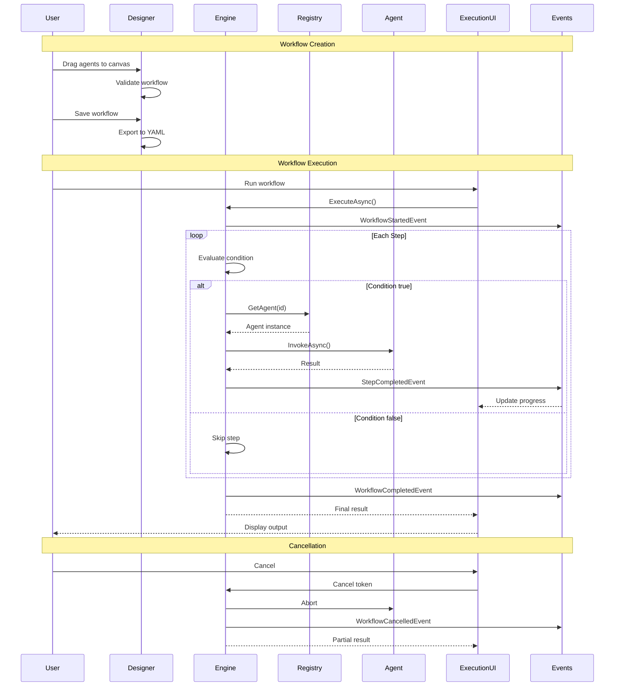

# LCS-DES-077: Design Specification Index — Agent Workflows

## Document Control

| Field | Value |
| :--- | :--- |
| **Document ID** | LCS-DES-077-INDEX |
| **Feature ID** | AGT-077 |
| **Feature Name** | Agent Workflows (Orchestration Lite) |
| **Target Version** | v0.7.7 |
| **Module Scope** | Lexichord.Modules.Agents |
| **Swimlane** | Ensemble |
| **License Tier** | Teams (create) / WriterPro (execute presets) |
| **Feature Gate Key** | `FeatureFlags.Agents.Workflows` |
| **Status** | Draft |
| **Last Updated** | 2026-01-27 |

---

## 1. Executive Summary

**v0.7.7** delivers **Agent Workflows** — the capability to chain multiple specialized agents into reusable, shareable pipelines for complex document processing. This feature transforms Lexichord from individual agent interactions into a true orchestration platform.

### 1.1 The Problem

Writers and content teams face repetitive multi-step document processing:

- Technical documents require grammar check, then simplification, then style compliance
- Marketing content needs simplification, then polish, then brand voice alignment
- Academic papers require formal editing, citation checks, then abstract generation

Currently, users must manually invoke each agent sequentially, losing time and risking inconsistency between processing sessions. Teams cannot standardize their quality processes.

### 1.2 The Solution

Implement a visual workflow system that:

1. **Enables Composition** — Drag-and-drop workflow designer for creating agent pipelines
2. **Executes Reliably** — Sequential engine with data passing, conditions, and cancellation
3. **Provides Value Immediately** — Pre-built workflows for common use cases
4. **Shows Progress** — Real-time execution UI with step-by-step visibility

### 1.3 Business Value

| Value | Description |
| :--- | :--- |
| **Productivity** | 70%+ reduction in repetitive agent invocations |
| **Consistency** | Standardized quality pipelines across teams |
| **Knowledge Capture** | Expert processes encoded in shareable recipes |
| **User Delight** | One-click complex document processing |
| **Team Enablement** | Process standardization across organizations |
| **Platform Foundation** | Orchestration patterns for future automation |

---

## 2. Related Documents

### 2.1 Scope Breakdown Document

The detailed scope breakdown for v0.7.7, including all sub-parts, implementation checklists, user stories, and acceptance criteria:

| Document | Description |
| :--- | :--- |
| **[LCS-SBD-077](./LCS-SBD-077.md)** | Scope Breakdown — Agent Workflows |

### 2.2 Sub-Part Design Specifications

Each sub-part has its own detailed design specification:

| Sub-Part | Document | Title | Description |
| :--- | :--- | :--- | :--- |
| v0.7.7a | **[LCS-DES-077a](./LCS-DES-077a.md)** | Workflow Designer UI | Visual drag-and-drop workflow builder |
| v0.7.7b | **[LCS-DES-077b](./LCS-DES-077b.md)** | Workflow Engine | Sequential step execution with data passing |
| v0.7.7c | **[LCS-DES-077c](./LCS-DES-077c.md)** | Preset Workflows | Built-in "Technical Review", "Marketing Polish", etc. |
| v0.7.7d | **[LCS-DES-077d](./LCS-DES-077d.md)** | Workflow Execution UI | Progress tracking and cancellation |

---

## 3. Architecture Overview

### 3.1 Component Diagram

```mermaid
graph TB
    subgraph "Agent Workflows Module"
        subgraph "v0.7.7a: Designer"
            DV[WorkflowDesignerView<br/>Drag-drop canvas]
            DVM[WorkflowDesignerViewModel<br/>Design state]
            DS[WorkflowDesignerService<br/>Validation & export]
        end

        subgraph "v0.7.7b: Engine"
            WE[WorkflowEngine<br/>Step execution]
            EE[ExpressionEvaluator<br/>Conditions]
            DM[DataMapper<br/>Variable flow]
        end

        subgraph "v0.7.7c: Presets"
            PR[PresetWorkflowRepository<br/>Built-in workflows]
            YML[YAML Definitions<br/>Embedded resources]
        end

        subgraph "v0.7.7d: Execution UI"
            EV[WorkflowExecutionView<br/>Progress display]
            EVM[WorkflowExecutionViewModel<br/>State management]
            HS[ExecutionHistoryService<br/>Run tracking]
        end
    end

    subgraph "Specialist Agents (v0.7.1-v0.7.6)"
        AR[IAgentRegistry]
        AGT[Editor | Simplifier | Tuning | Summarizer]
    end

    subgraph "Infrastructure"
        LC[ILicenseContext<br/>Teams gating]
        MED[IMediator<br/>Events]
        CFG[IConfigurationService<br/>Storage]
    end

    DV --> DVM
    DVM --> DS
    DVM --> WE
    DVM --> PR

    EV --> EVM
    EVM --> WE
    EVM --> HS

    WE --> EE
    WE --> DM
    WE --> AR

    AR --> AGT
    PR --> YML

    DS --> LC
    WE --> MED
    HS --> CFG

    style DV fill:#4a9eff,color:#fff
    style DVM fill:#4a9eff,color:#fff
    style DS fill:#4a9eff,color:#fff
    style WE fill:#22c55e,color:#fff
    style EE fill:#22c55e,color:#fff
    style DM fill:#22c55e,color:#fff
    style PR fill:#f97316,color:#fff
    style YML fill:#f97316,color:#fff
    style EV fill:#a855f7,color:#fff
    style EVM fill:#a855f7,color:#fff
    style HS fill:#a855f7,color:#fff
```

### 3.2 Execution Flow



---

## 4. Dependencies

### 4.1 Upstream Dependencies

| Interface | Source Version | Purpose |
| :--- | :--- | :--- |
| `IAgent` | v0.6.6a | Base agent interface for all specialists |
| `IAgentRegistry` | v0.7.1b | Agent discovery and instantiation |
| `AgentConfiguration` | v0.7.1a | Agent metadata for workflow steps |
| `AgentPersona` | v0.7.1a | Persona selection per step |
| `IContextOrchestrator` | v0.7.2c | Context assembly between steps |
| `EditorAgent` | v0.7.3b | Built-in editing agent |
| `SimplifierAgent` | v0.7.4b | Built-in simplification agent |
| `TuningAgent` | v0.7.5b | Built-in style tuning agent |
| `SummarizerAgent` | v0.7.6b | Built-in summarization agent |
| `IChatCompletionService` | v0.6.1a | LLM communication |
| `IPromptRenderer` | v0.6.3b | Template rendering |
| `ILicenseContext` | v0.0.4c | License tier checking |
| `IMediator` | v0.0.7a | Event publishing |
| `IConfigurationService` | v0.0.3d | Configuration storage |

### 4.2 NuGet Packages

| Package | Version | Purpose |
| :--- | :--- | :--- |
| `YamlDotNet` | 15.x | Workflow YAML serialization |
| `DynamicExpresso` | 2.x | Expression evaluation for conditions (NEW) |
| `CommunityToolkit.Mvvm` | 8.x | MVVM infrastructure |
| `Avalonia.Controls.DataGrid` | 11.x | History display |

### 4.3 Downstream Consumers

| Version | Feature | Uses From v0.7.7 |
| :--- | :--- | :--- |
| v0.7.8 | Hardening | Performance optimization and error handling |
| v0.8.x | Advanced Orchestration | Parallel execution, branching, loops |
| v0.9.x | Workflow Marketplace | Team sharing, versioning |

---

## 5. License Gating Strategy

### 5.1 Tier Permissions

| Feature | Core | WriterPro | Teams | Enterprise |
| :--- | :--- | :--- | :--- | :--- |
| View preset workflows | [checkmark] | [checkmark] | [checkmark] | [checkmark] |
| Execute preset workflows | [x] | [checkmark] (3/day) | [checkmark] | [checkmark] |
| Create custom workflows | [x] | [x] | [checkmark] | [checkmark] |
| Edit preset workflows | [x] | [x] | [checkmark] | [checkmark] |
| Export/import workflows | [x] | [x] | [checkmark] | [checkmark] |
| Workflow execution history | [x] | [x] | [checkmark] | [checkmark] |
| Workflow statistics | [x] | [x] | [x] | [checkmark] |

### 5.2 UI Behavior by Tier

**Core Tier:**
- Workflow tab visible but shows "Upgrade to WriterPro" message
- Preset workflow cards visible but disabled
- "Upgrade" button prominent

**WriterPro Tier:**
- Preset workflows executable (3 runs/day limit)
- Usage counter displayed: "2 of 3 runs remaining today"
- "Create Workflow" button shows "Upgrade to Teams" tooltip
- Designer opens but shows upgrade modal

**Teams Tier:**
- Full workflow functionality
- Unlimited preset execution
- Custom workflow creation
- Export/import enabled

---

## 6. Sub-Part Summary

### 6.1 v0.7.7a: Workflow Designer UI

**Goal:** Create a visual drag-and-drop workflow builder for composing multi-agent pipelines.

**Key Components:**
- `WorkflowDesignerView.axaml` — Canvas with drag-drop support
- `WorkflowDesignerViewModel` — Design state management
- `WorkflowDesignerService` — Validation and YAML export
- Agent palette with draggable agent cards
- Step configuration panel
- Visual connectors between steps

**See:** [LCS-DES-077a](./LCS-DES-077a.md)

### 6.2 v0.7.7b: Workflow Engine

**Goal:** Implement the core execution engine that orchestrates sequential agent invocation.

**Key Components:**
- `IWorkflowEngine` — Execution interface
- `WorkflowEngine` — Step-by-step execution
- `IExpressionEvaluator` — Condition evaluation
- Data mapping between steps
- Cancellation support
- Token usage aggregation

**See:** [LCS-DES-077b](./LCS-DES-077b.md)

### 6.3 v0.7.7c: Preset Workflows

**Goal:** Provide pre-built workflows that deliver immediate value.

**Key Components:**
- `IPresetWorkflowRepository` — Built-in workflow access
- `technical-review.yaml` — 4-step technical document review
- `marketing-polish.yaml` — 4-step marketing content enhancement
- `quick-edit.yaml` — 1-step fast grammar check
- `academic-review.yaml` — 3-step scholarly document review
- `executive-summary.yaml` — 3-step executive briefing generation

**See:** [LCS-DES-077c](./LCS-DES-077c.md)

### 6.4 v0.7.7d: Workflow Execution UI

**Goal:** Provide a rich execution experience with real-time progress tracking.

**Key Components:**
- `WorkflowExecutionView.axaml` — Progress display
- `WorkflowExecutionViewModel` — Execution state management
- Step progress indicators
- Step result cards with expandable output
- Cancel button with graceful termination
- Execution history tracking

**See:** [LCS-DES-077d](./LCS-DES-077d.md)

---

## 7. Key Interfaces Summary

### 7.1 Core Interfaces

| Interface | Sub-Part | Purpose |
| :--- | :--- | :--- |
| `IWorkflowEngine` | v0.7.7b | Workflow execution |
| `IWorkflowDesignerService` | v0.7.7a | Workflow creation/validation |
| `IPresetWorkflowRepository` | v0.7.7c | Built-in workflow access |
| `IExpressionEvaluator` | v0.7.7b | Condition evaluation |
| `IWorkflowExecutionHistoryService` | v0.7.7d | Execution tracking |

### 7.2 Core Records

| Record | Sub-Part | Purpose |
| :--- | :--- | :--- |
| `WorkflowDefinition` | v0.7.7a | Complete workflow specification |
| `WorkflowStepDefinition` | v0.7.7a | Single step specification |
| `WorkflowExecutionContext` | v0.7.7b | Execution input |
| `WorkflowExecutionResult` | v0.7.7b | Complete execution result |
| `WorkflowStepExecutionResult` | v0.7.7b | Single step result |

---

## 8. MediatR Events

| Event | Published By | Description |
| :--- | :--- | :--- |
| `WorkflowStartedEvent` | WorkflowEngine | Workflow execution begun |
| `WorkflowStepCompletedEvent` | WorkflowEngine | Individual step completed |
| `WorkflowCompletedEvent` | WorkflowEngine | Full workflow finished |
| `WorkflowCancelledEvent` | WorkflowEngine | Workflow cancelled by user |
| `WorkflowSavedEvent` | DesignerService | Workflow saved to storage |
| `WorkflowDeletedEvent` | DesignerService | Workflow removed |

---

## 9. Implementation Checklist Summary

| Sub-Part | Tasks | Est. Hours |
| :--- | :--- | :--- |
| v0.7.7a | Workflow Designer UI | 22 |
| v0.7.7b | Workflow Engine | 17 |
| v0.7.7c | Preset Workflows | 8.5 |
| v0.7.7d | Workflow Execution UI | 17 |
| Integration | Tests, DI, Events | 5.5 |
| **Total** | | **68 hours** |

See [LCS-SBD-077](./LCS-SBD-077.md) Section 4 for the detailed task breakdown.

---

## 10. Success Criteria Summary

| Category | Criterion | Target |
| :--- | :--- | :--- |
| **Usability** | Workflow creation time | < 5 minutes |
| **Reliability** | Workflow execution success rate | > 90% |
| **Adoption** | Preset workflow usage (new users) | > 50% |
| **Value** | Custom workflow creation (Teams) | > 30% of Teams users |
| **Performance** | Cancellation response time | < 5 seconds |
| **Accuracy** | Token usage estimate vs actual | < 10% variance |

See [LCS-SBD-077](./LCS-SBD-077.md) Section 9 for full success metrics.

---

## 11. Test Coverage Summary

| Sub-Part | Test File | Coverage Area |
| :--- | :--- | :--- |
| v0.7.7a | `WorkflowDesignerServiceTests.cs` | Validation, export/import |
| v0.7.7a | `WorkflowDesignerViewModelTests.cs` | Design state management |
| v0.7.7b | `WorkflowEngineTests.cs` | Execution, conditions, cancellation |
| v0.7.7b | `ExpressionEvaluatorTests.cs` | Condition parsing |
| v0.7.7c | `PresetWorkflowRepositoryTests.cs` | Preset loading |
| v0.7.7c | `PresetWorkflowExecutionTests.cs` | End-to-end preset runs |
| v0.7.7d | `WorkflowExecutionViewModelTests.cs` | UI state management |
| v0.7.7d | `WorkflowExecutionHistoryTests.cs` | History tracking |

See individual design specs for detailed test scenarios.

---

## 12. What This Enables

| Version | Feature | Uses From v0.7.7 |
| :--- | :--- | :--- |
| v0.7.8 | Hardening | Error handling and performance optimization |
| v0.8.x | Advanced Orchestration | Parallel steps, branching, loops, sub-workflows |
| v0.9.x | Workflow Marketplace | Team sharing, versioning, curation |
| v1.0.x | Automation | Scheduled and event-triggered workflows |

---

## Document History

| Version | Date | Author | Changes |
| :--- | :--- | :--- | :--- |
| 1.0 | 2026-01-27 | Lead Architect | Initial draft |
