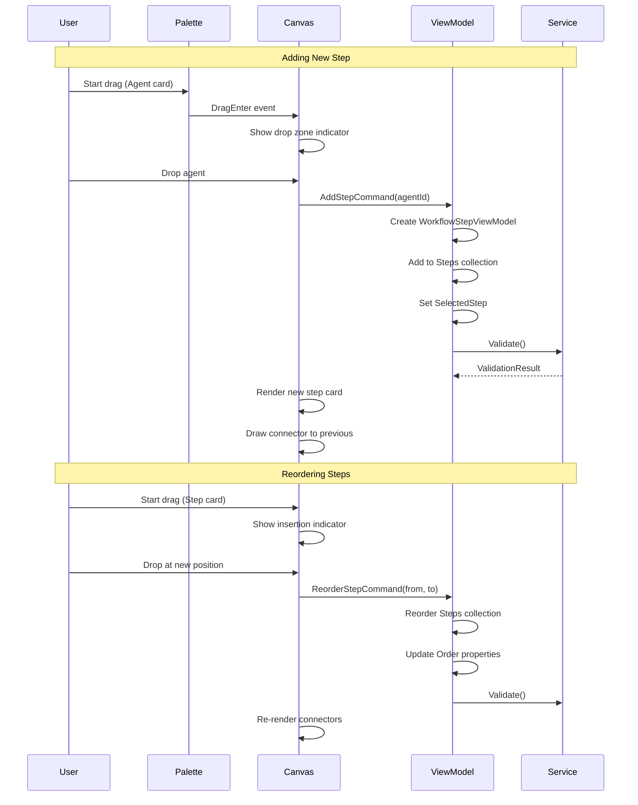

# LCS-DES-077a: Design Specification — Workflow Designer UI

## 1. Metadata & Categorization

| Field | Value | Description |
| :--- | :--- | :--- |
| **Feature ID** | `AGT-077a` | Sub-part of AGT-077 |
| **Feature Name** | `Workflow Designer UI` | Visual workflow builder |
| **Target Version** | `v0.7.7a` | First sub-part of v0.7.7 |
| **Module Scope** | `Lexichord.Modules.Agents` | Agents module |
| **Swimlane** | `Ensemble` | Agent orchestration vertical |
| **License Tier** | `Teams` | Required for workflow creation |
| **Feature Gate Key** | `FeatureFlags.Agents.WorkflowDesigner` | |
| **Author** | Lead Architect | |
| **Status** | `Draft` | |
| **Last Updated** | `2026-01-27` | |
| **Parent Document** | [LCS-DES-077-INDEX](./LCS-DES-077-INDEX.md) | |
| **Scope Breakdown** | [LCS-SBD-077 Section 3.1](./LCS-SBD-077.md#31-v077a-workflow-designer-ui) | |

---

## 2. Executive Summary

### 2.1 The Requirement

Users need to create custom multi-agent workflows without writing code. Current workflow creation would require:

- Manual YAML editing with precise syntax
- Understanding of agent IDs, personas, and configuration options
- No visual feedback on workflow structure
- High error rate and poor discoverability

> **Goal:** Enable Teams users to visually compose agent workflows through an intuitive drag-and-drop interface.

### 2.2 The Proposed Solution

Implement a visual workflow designer that:

1. **Provides Agent Palette** — Draggable agent cards showing available agents
2. **Enables Visual Composition** — Canvas where agents can be dropped and connected
3. **Supports Step Configuration** — Side panel for per-step settings
4. **Validates in Real-Time** — Immediate feedback on workflow validity
5. **Exports to YAML** — Portable format for sharing and version control

---

## 3. Architecture & Modular Strategy

### 3.1 Dependencies

#### 3.1.1 Upstream Modules

| Interface | Source Version | Purpose |
| :--- | :--- | :--- |
| `IAgentRegistry` | v0.7.1b | Available agents for palette |
| `AgentConfiguration` | v0.7.1a | Agent metadata display |
| `AgentPersona` | v0.7.1a | Persona options per step |
| `ILicenseContext` | v0.0.4c | Teams tier verification |
| `IConfigurationService` | v0.0.3d | Workflow storage |

#### 3.1.2 NuGet Packages

| Package | Version | Purpose |
| :--- | :--- | :--- |
| `YamlDotNet` | 15.x | YAML serialization |
| `CommunityToolkit.Mvvm` | 8.x | MVVM infrastructure |
| `Avalonia.Controls` | 11.x | UI controls |

### 3.2 Licensing Behavior

**Soft Gate** implementation:

- Designer UI loads for all users
- Non-Teams users see upgrade prompt when attempting to:
  - Add steps to canvas
  - Save workflows
  - Run custom workflows
- Read-only mode allows viewing existing workflows
- "Upgrade to Teams" modal with feature benefits

---

## 4. Data Contract (The API)

### 4.1 Core Records

```csharp
namespace Lexichord.Modules.Agents.Workflows;

/// <summary>
/// Complete workflow definition that can be persisted and executed.
/// </summary>
public record WorkflowDefinition(
    string WorkflowId,
    string Name,
    string Description,
    string? IconName,
    IReadOnlyList<WorkflowStepDefinition> Steps,
    WorkflowMetadata Metadata
);

/// <summary>
/// Represents a single step in a workflow definition.
/// </summary>
public record WorkflowStepDefinition(
    string StepId,
    string AgentId,
    string? PersonaId,
    string? PromptOverride,
    int Order,
    WorkflowStepCondition? Condition,
    IReadOnlyDictionary<string, string>? InputMappings,
    IReadOnlyDictionary<string, string>? OutputMappings
);

/// <summary>
/// Condition that determines whether a workflow step should execute.
/// </summary>
public record WorkflowStepCondition(
    string Expression,
    ConditionType Type = ConditionType.Expression
);

/// <summary>
/// Types of conditions supported in workflow steps.
/// </summary>
public enum ConditionType
{
    Expression,      // e.g., "violations.Count > 0"
    PreviousSuccess, // Execute only if previous step succeeded
    PreviousFailed,  // Execute only if previous step failed
    Always           // Always execute (default)
}

/// <summary>
/// Metadata about a workflow definition.
/// </summary>
public record WorkflowMetadata(
    string Author,
    DateTime CreatedAt,
    DateTime ModifiedAt,
    string? Version,
    IReadOnlyList<string> Tags,
    WorkflowCategory Category,
    bool IsBuiltIn,
    LicenseTier RequiredTier
);

/// <summary>
/// Categories for organizing workflows.
/// </summary>
public enum WorkflowCategory
{
    General,
    Technical,
    Marketing,
    Academic,
    Legal,
    Custom
}
```

### 4.2 Designer Service Interface

```csharp
namespace Lexichord.Modules.Agents.Workflows;

/// <summary>
/// Service for managing workflow definitions in the designer.
/// </summary>
public interface IWorkflowDesignerService
{
    /// <summary>
    /// Creates a new empty workflow definition.
    /// </summary>
    /// <param name="name">Workflow name.</param>
    /// <returns>New workflow with generated ID.</returns>
    WorkflowDefinition CreateNew(string name);

    /// <summary>
    /// Validates a workflow definition and returns any errors.
    /// </summary>
    /// <param name="workflow">Workflow to validate.</param>
    /// <returns>Validation result with errors and warnings.</returns>
    WorkflowValidationResult Validate(WorkflowDefinition workflow);

    /// <summary>
    /// Saves a workflow definition to storage.
    /// </summary>
    /// <param name="workflow">Workflow to save.</param>
    /// <param name="ct">Cancellation token.</param>
    Task SaveAsync(WorkflowDefinition workflow, CancellationToken ct = default);

    /// <summary>
    /// Loads a workflow definition from storage.
    /// </summary>
    /// <param name="workflowId">Workflow ID.</param>
    /// <param name="ct">Cancellation token.</param>
    /// <returns>Workflow definition or null if not found.</returns>
    Task<WorkflowDefinition?> LoadAsync(string workflowId, CancellationToken ct = default);

    /// <summary>
    /// Lists all user-created workflows.
    /// </summary>
    /// <param name="ct">Cancellation token.</param>
    /// <returns>List of workflow summaries.</returns>
    Task<IReadOnlyList<WorkflowSummary>> ListAsync(CancellationToken ct = default);

    /// <summary>
    /// Deletes a workflow definition.
    /// </summary>
    /// <param name="workflowId">Workflow ID.</param>
    /// <param name="ct">Cancellation token.</param>
    Task DeleteAsync(string workflowId, CancellationToken ct = default);

    /// <summary>
    /// Exports a workflow definition to YAML format.
    /// </summary>
    /// <param name="workflow">Workflow to export.</param>
    /// <returns>YAML string.</returns>
    string ExportToYaml(WorkflowDefinition workflow);

    /// <summary>
    /// Imports a workflow definition from YAML format.
    /// </summary>
    /// <param name="yaml">YAML string.</param>
    /// <returns>Parsed workflow definition.</returns>
    /// <exception cref="WorkflowImportException">If YAML is invalid.</exception>
    WorkflowDefinition ImportFromYaml(string yaml);

    /// <summary>
    /// Duplicates an existing workflow with a new ID and name.
    /// </summary>
    /// <param name="workflowId">Source workflow ID.</param>
    /// <param name="newName">Name for the duplicate.</param>
    /// <param name="ct">Cancellation token.</param>
    /// <returns>Duplicated workflow definition.</returns>
    Task<WorkflowDefinition> DuplicateAsync(string workflowId, string newName, CancellationToken ct = default);
}

/// <summary>
/// Summary of a workflow for listing.
/// </summary>
public record WorkflowSummary(
    string WorkflowId,
    string Name,
    string? Description,
    int StepCount,
    DateTime ModifiedAt,
    WorkflowCategory Category,
    bool IsBuiltIn
);

/// <summary>
/// Result of workflow validation.
/// </summary>
public record WorkflowValidationResult(
    bool IsValid,
    IReadOnlyList<WorkflowValidationError> Errors,
    IReadOnlyList<WorkflowValidationWarning> Warnings
);

/// <summary>
/// A validation error in a workflow definition.
/// </summary>
public record WorkflowValidationError(
    string? StepId,
    string Code,
    string Message
);

/// <summary>
/// A validation warning in a workflow definition.
/// </summary>
public record WorkflowValidationWarning(
    string? StepId,
    string Code,
    string Message
);
```

### 4.3 ViewModel Interface

```csharp
namespace Lexichord.Modules.Agents.ViewModels;

/// <summary>
/// ViewModel for the workflow designer.
/// </summary>
public interface IWorkflowDesignerViewModel
{
    /// <summary>
    /// Current workflow being edited.
    /// </summary>
    WorkflowDefinition? CurrentWorkflow { get; }

    /// <summary>
    /// Workflow name (bindable).
    /// </summary>
    string WorkflowName { get; set; }

    /// <summary>
    /// Workflow description (bindable).
    /// </summary>
    string WorkflowDescription { get; set; }

    /// <summary>
    /// Steps in the current workflow.
    /// </summary>
    ObservableCollection<WorkflowStepViewModel> Steps { get; }

    /// <summary>
    /// Currently selected step (or null).
    /// </summary>
    WorkflowStepViewModel? SelectedStep { get; set; }

    /// <summary>
    /// Available agents for the palette.
    /// </summary>
    IReadOnlyList<AgentPaletteItemViewModel> AvailableAgents { get; }

    /// <summary>
    /// Current validation result.
    /// </summary>
    WorkflowValidationResult? ValidationResult { get; }

    /// <summary>
    /// Whether the workflow has unsaved changes.
    /// </summary>
    bool HasUnsavedChanges { get; }

    /// <summary>
    /// Whether the current user can edit (Teams license).
    /// </summary>
    bool CanEdit { get; }

    // Commands
    IRelayCommand NewWorkflowCommand { get; }
    IRelayCommand SaveWorkflowCommand { get; }
    IRelayCommand<WorkflowSummary> LoadWorkflowCommand { get; }
    IRelayCommand ValidateCommand { get; }
    IRelayCommand<string> AddStepCommand { get; }
    IRelayCommand<WorkflowStepViewModel> RemoveStepCommand { get; }
    IRelayCommand<(int from, int to)> ReorderStepCommand { get; }
    IRelayCommand ExportYamlCommand { get; }
    IRelayCommand ImportYamlCommand { get; }
    IAsyncRelayCommand RunWorkflowCommand { get; }
}

/// <summary>
/// ViewModel for a single workflow step.
/// </summary>
public class WorkflowStepViewModel : ObservableObject
{
    public string StepId { get; }
    public string AgentId { get; set; }
    public string AgentName { get; }
    public string AgentIcon { get; }
    public string? PersonaId { get; set; }
    public IReadOnlyList<PersonaOption> AvailablePersonas { get; }
    public string? PromptOverride { get; set; }
    public int Order { get; set; }
    public ConditionType ConditionType { get; set; }
    public string? ConditionExpression { get; set; }
    public bool IsSelected { get; set; }
    public bool HasValidationError { get; set; }
    public string? ValidationErrorMessage { get; set; }
}

/// <summary>
/// ViewModel for an agent in the palette.
/// </summary>
public record AgentPaletteItemViewModel(
    string AgentId,
    string Name,
    string Description,
    string Icon,
    bool IsAvailable,
    LicenseTier RequiredTier
);

/// <summary>
/// Persona option for step configuration.
/// </summary>
public record PersonaOption(
    string PersonaId,
    string DisplayName,
    string? Description
);
```

---

## 5. Implementation Logic

### 5.1 Drag-and-Drop Flow



### 5.2 Validation Logic

```text
VALIDATE WORKFLOW:
│
├── 1. Check workflow has name
│   └── Empty name → Error: MISSING_NAME
│
├── 2. Check workflow has steps
│   └── No steps → Error: EMPTY_WORKFLOW
│
├── 3. FOR EACH step:
│   │
│   ├── Check agent exists in registry
│   │   └── Unknown agent → Error: UNKNOWN_AGENT (stepId)
│   │
│   ├── Check persona exists (if specified)
│   │   └── Unknown persona → Error: UNKNOWN_PERSONA (stepId)
│   │
│   ├── Check condition expression is valid
│   │   └── Parse error → Error: INVALID_CONDITION (stepId)
│   │
│   └── Check for circular references in mappings
│       └── Circular ref → Error: CIRCULAR_MAPPING (stepId)
│
├── 4. Check for duplicate step IDs
│   └── Duplicate → Error: DUPLICATE_STEP_ID
│
├── 5. Generate warnings:
│   ├── Single step workflow → Warning: SINGLE_STEP
│   ├── All steps have same agent → Warning: SAME_AGENT
│   └── No conditions used → Warning: NO_CONDITIONS
│
└── 6. Return WorkflowValidationResult
```

### 5.3 YAML Export Format

```yaml
# Exported workflow format
workflow_id: "wf-abc123def"
name: "My Technical Review"
description: "Custom review workflow for technical documentation"
icon: "file-code"
category: Technical

steps:
  - step_id: "step-1"
    agent_id: "editor"
    persona_id: "strict"
    order: 1
    prompt_override: |
      Review this technical document focusing on:
      - Grammar and punctuation
      - Technical accuracy
      - Terminology consistency
    condition:
      type: Always

  - step_id: "step-2"
    agent_id: "simplifier"
    order: 2
    prompt_override: |
      Simplify complex explanations.
      Target: 10th grade reading level.
    condition:
      type: PreviousSuccess

  - step_id: "step-3"
    agent_id: "tuning"
    order: 3
    condition:
      type: Expression
      expression: "violations.Count > 0"

metadata:
  author: "user@example.com"
  created_at: "2026-01-27T10:30:00Z"
  modified_at: "2026-01-27T14:15:00Z"
  version: "1.0"
  tags:
    - technical
    - documentation
  is_built_in: false
  required_tier: Teams
```

---

## 6. UI/UX Specifications

### 6.1 Designer Layout

```text
+------------------------------------------------------------------------------+
|  WORKFLOW DESIGNER                                                           |
+------------------------------------------------------------------------------+
| [<- Back] [New v] [Open v] [Import]              [Validate] [Save] [Run >]   |
+------------------------------------------------------------------------------+
| +------------------+ +------------------------------------------------------+|
| | AGENT PALETTE    | | Name: [My Technical Review                      ]    ||
| |------------------| | Description: [Custom review for tech docs       ]    ||
| |                  | | Category: [Technical v]  Tags: [tech, docs    ]      ||
| | SPECIALISTS      | +------------------------------------------------------+|
| | +-------------+  | |                                                      ||
| | |[icon]Editor |  | |  +-------------+                                     ||
| | |Grammar/Style|  | |  |   START     |                                     ||
| | +-------------+  | |  +------+------+                                     ||
| | +-------------+  | |         |                                            ||
| | |[icon]Simplfy|  | |         v                                            ||
| | |Readability  |  | |  +-----------+     +-----------+     +-----------+   ||
| | +-------------+  | |  | 1.Editor  |---->|2.Simplify |---->| 3.Tuning  |   ||
| | +-------------+  | |  | Strict    |     | Default   |     | Default   |   ||
| | |[icon]Tuning |  | |  +-----------+     +-----------+     +-----------+   ||
| | |Style Rules  |  | |         ^                |                |          ||
| | +-------------+  | |    [selected]       [hover]          [normal]        ||
| | +-------------+  | |                                                      ||
| | |[icon]Summrze|  | |  +-------------+                                     ||
| | |Metadata     |  | |  |    END      |                                     ||
| | +-------------+  | |  +-------------+                                     ||
| |                  | |                                                      ||
| | CO-PILOT         | |                                                      ||
| | +-------------+  | |                                                      ||
| | |[icon]Co-pilt|  | |                                                      ||
| | |General Chat |  | |                                                      ||
| | +-------------+  | |                                                      ||
| +------------------+ +------------------------------------------------------+|
+------------------------------------------------------------------------------+
| STEP CONFIGURATION                                            [Delete Step]  |
+------------------------------------------------------------------------------+
| Selected: Step 1 - Editor                                                    |
| +--------------------------------------------------------------------------+ |
| | Agent: [Editor           v]    Persona: [Strict Editor     v]            | |
| +--------------------------------------------------------------------------+ |
| | Prompt Override:                                                         | |
| | +----------------------------------------------------------------------+ | |
| | | Review this technical document focusing on:                          | | |
| | | - Grammar and punctuation                                            | | |
| | | - Technical accuracy                                                 | | |
| | | - Terminology consistency                                            | | |
| | +----------------------------------------------------------------------+ | |
| | [x] Use custom prompt                                                    | |
| +--------------------------------------------------------------------------+ |
| | Condition: [Always execute       v]                                      | |
| | Expression: [                                           ] (disabled)     | |
| +--------------------------------------------------------------------------+ |
| | Input Mapping:  [Add mapping +]                                          | |
| | Output Mapping: [Add mapping +]                                          | |
| +--------------------------------------------------------------------------+ |
+------------------------------------------------------------------------------+
| [checkmark] Workflow valid | 3 steps | Est. ~2,100 tokens | Teams required   |
+------------------------------------------------------------------------------+
```

### 6.2 Step Card States

```text
STEP CARD STATES:

Normal:
+------------------+
| [icon] Editor    |
| Strict           |
+------------------+
Background: Surface.Primary
Border: transparent

Selected:
+------------------+
| [icon] Editor    |  <- Blue highlight border
| Strict           |
+------------------+
Background: Accent.Light (10%)
Border: Accent.Primary (2px)

Hover:
+------------------+
| [icon] Editor    |  <- Subtle elevation
| Strict           |
+------------------+
Background: Surface.Primary
Border: Text.Tertiary (1px)
Shadow: elevation-1

Error:
+------------------+
| [icon] Editor    |  <- Red highlight border
| [!] Unknown agent|
+------------------+
Background: Danger.Light (10%)
Border: Danger.Primary (2px)

Dragging:
+------------------+
| [icon] Editor    |  <- Semi-transparent
| Strict           |
+------------------+
Opacity: 0.6
Transform: scale(1.02)
```

### 6.3 Connector Visualization

```text
CONNECTOR TYPES:

Sequential (default):
[Step 1] ────────> [Step 2]
Solid line with arrow

Conditional:
[Step 1] - - - - > [Step 2]
Dashed line with arrow
Label: "if success" / "if failed" / expression

CONNECTOR RENDERING:
- Start: Center-right of source step
- End: Center-left of target step
- Path: Bezier curve for visual flow
- Arrow: Filled triangle at end
- Color: Text.Tertiary (normal), Accent.Primary (active)
```

### 6.4 Component Styling

| Component | Theme Resource | Notes |
| :--- | :--- | :--- |
| Designer Canvas | `Brush.Surface.Secondary` | Grid pattern background |
| Step Card | `Brush.Surface.Primary` | Elevated with shadow |
| Step Card (Selected) | `Brush.Accent.Light` | Blue highlight |
| Step Card (Error) | `Brush.Danger.Light` | Red highlight |
| Connector | `Brush.Text.Tertiary` | Bezier path |
| Drop Zone | `Brush.Accent.Light` | Dashed border |
| Palette Header | `Brush.Surface.Tertiary` | Section divider |
| Agent Card | `Brush.Surface.Primary` | Draggable |
| Config Panel | `Brush.Surface.Primary` | Fixed height |
| Status Bar | `Brush.Surface.Tertiary` | Bottom fixed |

---

## 7. Observability & Logging

| Level | Message Template |
| :--- | :--- |
| Debug | `"Workflow designer opened for {WorkflowId}"` |
| Debug | `"Step {StepId} added to workflow: agent={AgentId}"` |
| Debug | `"Step {StepId} removed from workflow"` |
| Debug | `"Steps reordered: {FromIndex} -> {ToIndex}"` |
| Info | `"Workflow {WorkflowId} validation: {IsValid}"` |
| Info | `"Workflow {WorkflowId} saved by user"` |
| Info | `"Workflow exported to YAML: {WorkflowId}"` |
| Warning | `"Workflow validation warning: {Code} - {Message}"` |
| Error | `"Workflow validation failed: {ErrorCount} errors"` |
| Error | `"Failed to save workflow {WorkflowId}: {Error}"` |

---

## 8. Security & Safety

| Risk | Level | Mitigation |
| :--- | :--- | :--- |
| YAML injection on import | Medium | Schema validation, allowlist agent IDs |
| Malicious condition expressions | Medium | Sandboxed expression evaluator |
| Workflow exceeds token limits | Low | Token estimation and warnings |
| Unauthorized workflow access | Low | User-scoped storage paths |

---

## 9. Acceptance Criteria

### 9.1 Functional Criteria

| # | Given | When | Then |
| :--- | :--- | :--- | :--- |
| 1 | Designer is open | User drags agent from palette | Agent appears as step on canvas |
| 2 | Workflow has steps | User drags step to new position | Steps reorder correctly |
| 3 | Step is selected | User changes persona | Persona updates in step config |
| 4 | Step is selected | User enters prompt override | Prompt saves with step |
| 5 | Workflow is valid | User clicks Save | Workflow persists to storage |
| 6 | Workflow is invalid | User clicks Validate | Errors shown with step highlighting |
| 7 | Workflow exists | User clicks Export | YAML downloads correctly |
| 8 | YAML file exists | User clicks Import | Workflow loads into designer |
| 9 | Step has condition | User selects Expression type | Expression input enabled |
| 10 | User is not Teams tier | User tries to add step | Upgrade modal appears |

### 9.2 UI Criteria

| # | Given | When | Then |
| :--- | :--- | :--- | :--- |
| 11 | Canvas is empty | User opens designer | "Drag agents here" placeholder shown |
| 12 | Step is selected | User presses Delete | Confirmation dialog appears |
| 13 | Workflow has changes | User tries to close | "Unsaved changes" warning shown |
| 14 | Validation error exists | User hovers error step | Error tooltip displays |
| 15 | Designer is loading | Async operation in progress | Loading indicator visible |

---

## 10. Deliverable Checklist

| # | Deliverable | Status |
| :--- | :--- | :--- |
| 1 | `WorkflowDefinition.cs` and related records | [ ] |
| 2 | `WorkflowStepDefinition.cs` | [ ] |
| 3 | `WorkflowMetadata.cs` | [ ] |
| 4 | `WorkflowValidationResult.cs` | [ ] |
| 5 | `IWorkflowDesignerService.cs` interface | [ ] |
| 6 | `WorkflowDesignerService.cs` implementation | [ ] |
| 7 | `WorkflowDesignerView.axaml` | [ ] |
| 8 | `WorkflowDesignerView.axaml.cs` code-behind | [ ] |
| 9 | `WorkflowDesignerViewModel.cs` | [ ] |
| 10 | `WorkflowStepViewModel.cs` | [ ] |
| 11 | `AgentPaletteItemViewModel.cs` | [ ] |
| 12 | `WorkflowYamlSerializer.cs` | [ ] |
| 13 | Unit tests for `WorkflowDesignerService` | [ ] |
| 14 | Unit tests for `WorkflowDesignerViewModel` | [ ] |
| 15 | Unit tests for YAML serialization | [ ] |

---

## 11. Verification Commands

```bash
# Run designer service tests
dotnet test --filter "FullyQualifiedName~WorkflowDesignerService"

# Run designer ViewModel tests
dotnet test --filter "FullyQualifiedName~WorkflowDesignerViewModel"

# Run YAML serialization tests
dotnet test --filter "FullyQualifiedName~WorkflowYaml"

# Run all v0.7.7a tests
dotnet test --filter "Version=v0.7.7a"

# Manual verification:
# a) Open Designer from Agents panel
# b) Drag Editor agent to canvas
# c) Verify step card appears
# d) Select step, verify config panel populates
# e) Change persona, verify step updates
# f) Add second step, verify connector drawn
# g) Reorder steps by dragging
# h) Click Validate, verify status bar
# i) Save workflow
# j) Close and reopen, verify persistence
# k) Export to YAML, verify format
# l) Import YAML, verify loads correctly
```

---

## 12. Unit Tests

### 12.1 Designer Service Tests

```csharp
[Trait("Category", "Unit")]
[Trait("Version", "v0.7.7a")]
public class WorkflowDesignerServiceTests
{
    private readonly Mock<IAgentRegistry> _registryMock;
    private readonly Mock<IConfigurationService> _configMock;
    private readonly WorkflowDesignerService _sut;

    public WorkflowDesignerServiceTests()
    {
        _registryMock = new Mock<IAgentRegistry>();
        _configMock = new Mock<IConfigurationService>();
        _sut = new WorkflowDesignerService(_registryMock.Object, _configMock.Object);

        // Setup available agents
        _registryMock.Setup(r => r.AvailableAgents).Returns(new[]
        {
            new AgentConfiguration("editor", "Editor", "Grammar", "edit", "tpl-editor",
                AgentCapabilities.Chat, new ChatOptions(), null),
            new AgentConfiguration("simplifier", "Simplifier", "Readability", "zap", "tpl-simp",
                AgentCapabilities.Chat, new ChatOptions(), null),
        });
    }

    [Fact]
    public void CreateNew_GeneratesUniqueId()
    {
        var workflow1 = _sut.CreateNew("Test 1");
        var workflow2 = _sut.CreateNew("Test 2");

        workflow1.WorkflowId.Should().NotBe(workflow2.WorkflowId);
    }

    [Fact]
    public void CreateNew_SetsNameAndEmptySteps()
    {
        var workflow = _sut.CreateNew("My Workflow");

        workflow.Name.Should().Be("My Workflow");
        workflow.Steps.Should().BeEmpty();
        workflow.Metadata.IsBuiltIn.Should().BeFalse();
    }

    [Fact]
    public void Validate_EmptyWorkflow_ReturnsError()
    {
        var workflow = _sut.CreateNew("Test");

        var result = _sut.Validate(workflow);

        result.IsValid.Should().BeFalse();
        result.Errors.Should().Contain(e => e.Code == "EMPTY_WORKFLOW");
    }

    [Fact]
    public void Validate_MissingName_ReturnsError()
    {
        var workflow = new WorkflowDefinition(
            "wf-1", "", "", null,
            new[] { CreateStep("editor") },
            CreateMetadata());

        var result = _sut.Validate(workflow);

        result.IsValid.Should().BeFalse();
        result.Errors.Should().Contain(e => e.Code == "MISSING_NAME");
    }

    [Fact]
    public void Validate_UnknownAgent_ReturnsError()
    {
        var workflow = new WorkflowDefinition(
            "wf-1", "Test", "", null,
            new[] { CreateStep("unknown-agent") },
            CreateMetadata());

        var result = _sut.Validate(workflow);

        result.IsValid.Should().BeFalse();
        result.Errors.Should().Contain(e => e.Code == "UNKNOWN_AGENT");
    }

    [Fact]
    public void Validate_ValidWorkflow_ReturnsValid()
    {
        var workflow = new WorkflowDefinition(
            "wf-1", "Test", "Description", null,
            new[] { CreateStep("editor"), CreateStep("simplifier") },
            CreateMetadata());

        var result = _sut.Validate(workflow);

        result.IsValid.Should().BeTrue();
        result.Errors.Should().BeEmpty();
    }

    [Fact]
    public void Validate_SingleStep_ReturnsWarning()
    {
        var workflow = new WorkflowDefinition(
            "wf-1", "Test", "", null,
            new[] { CreateStep("editor") },
            CreateMetadata());

        var result = _sut.Validate(workflow);

        result.IsValid.Should().BeTrue();
        result.Warnings.Should().Contain(w => w.Code == "SINGLE_STEP");
    }

    [Fact]
    public void ExportToYaml_ValidWorkflow_ProducesValidYaml()
    {
        var workflow = new WorkflowDefinition(
            "wf-1", "Test Workflow", "A test", "file-code",
            new[]
            {
                new WorkflowStepDefinition("s1", "editor", "strict", "Review text", 1, null, null, null),
                new WorkflowStepDefinition("s2", "simplifier", null, null, 2,
                    new WorkflowStepCondition("", ConditionType.PreviousSuccess), null, null),
            },
            CreateMetadata());

        var yaml = _sut.ExportToYaml(workflow);

        yaml.Should().Contain("workflow_id: \"wf-1\"");
        yaml.Should().Contain("name: \"Test Workflow\"");
        yaml.Should().Contain("agent_id: \"editor\"");
        yaml.Should().Contain("persona_id: \"strict\"");
        yaml.Should().Contain("type: PreviousSuccess");
    }

    [Fact]
    public void ImportFromYaml_ValidYaml_ParsesCorrectly()
    {
        var yaml = @"
workflow_id: ""wf-test""
name: ""Imported Workflow""
description: ""Test import""
steps:
  - step_id: ""s1""
    agent_id: ""editor""
    order: 1
metadata:
  author: ""test""
  is_built_in: false
  required_tier: Teams
";

        var workflow = _sut.ImportFromYaml(yaml);

        workflow.WorkflowId.Should().Be("wf-test");
        workflow.Name.Should().Be("Imported Workflow");
        workflow.Steps.Should().HaveCount(1);
        workflow.Steps[0].AgentId.Should().Be("editor");
    }

    [Fact]
    public void ImportFromYaml_InvalidYaml_ThrowsException()
    {
        var invalidYaml = "not: valid: yaml: content:";

        var act = () => _sut.ImportFromYaml(invalidYaml);

        act.Should().Throw<WorkflowImportException>();
    }

    private WorkflowStepDefinition CreateStep(string agentId) =>
        new($"step-{Guid.NewGuid():N}"[..12], agentId, null, null, 1, null, null, null);

    private WorkflowMetadata CreateMetadata() =>
        new("test", DateTime.UtcNow, DateTime.UtcNow, "1.0", Array.Empty<string>(),
            WorkflowCategory.Custom, false, LicenseTier.Teams);
}
```

### 12.2 ViewModel Tests

```csharp
[Trait("Category", "Unit")]
[Trait("Version", "v0.7.7a")]
public class WorkflowDesignerViewModelTests
{
    private readonly Mock<IWorkflowDesignerService> _serviceMock;
    private readonly Mock<IAgentRegistry> _registryMock;
    private readonly Mock<ILicenseContext> _licenseMock;
    private readonly WorkflowDesignerViewModel _sut;

    public WorkflowDesignerViewModelTests()
    {
        _serviceMock = new Mock<IWorkflowDesignerService>();
        _registryMock = new Mock<IAgentRegistry>();
        _licenseMock = new Mock<ILicenseContext>();

        _licenseMock.Setup(l => l.CurrentTier).Returns(LicenseTier.Teams);
        _registryMock.Setup(r => r.AvailableAgents).Returns(CreateTestAgents());

        _sut = new WorkflowDesignerViewModel(
            _serviceMock.Object,
            _registryMock.Object,
            _licenseMock.Object);
    }

    [Fact]
    public void AvailableAgents_PopulatedFromRegistry()
    {
        _sut.AvailableAgents.Should().HaveCount(2);
        _sut.AvailableAgents.Should().Contain(a => a.AgentId == "editor");
        _sut.AvailableAgents.Should().Contain(a => a.AgentId == "simplifier");
    }

    [Fact]
    public void AddStepCommand_AddsStepToCollection()
    {
        _sut.NewWorkflowCommand.Execute(null);

        _sut.AddStepCommand.Execute("editor");

        _sut.Steps.Should().HaveCount(1);
        _sut.Steps[0].AgentId.Should().Be("editor");
    }

    [Fact]
    public void AddStepCommand_SetsSelectedStep()
    {
        _sut.NewWorkflowCommand.Execute(null);

        _sut.AddStepCommand.Execute("editor");

        _sut.SelectedStep.Should().NotBeNull();
        _sut.SelectedStep!.AgentId.Should().Be("editor");
    }

    [Fact]
    public void AddStepCommand_IncrementsOrder()
    {
        _sut.NewWorkflowCommand.Execute(null);

        _sut.AddStepCommand.Execute("editor");
        _sut.AddStepCommand.Execute("simplifier");

        _sut.Steps[0].Order.Should().Be(1);
        _sut.Steps[1].Order.Should().Be(2);
    }

    [Fact]
    public void RemoveStepCommand_RemovesFromCollection()
    {
        _sut.NewWorkflowCommand.Execute(null);
        _sut.AddStepCommand.Execute("editor");
        var step = _sut.Steps[0];

        _sut.RemoveStepCommand.Execute(step);

        _sut.Steps.Should().BeEmpty();
    }

    [Fact]
    public void ReorderStepCommand_UpdatesOrderProperties()
    {
        _sut.NewWorkflowCommand.Execute(null);
        _sut.AddStepCommand.Execute("editor");
        _sut.AddStepCommand.Execute("simplifier");

        _sut.ReorderStepCommand.Execute((0, 1));

        _sut.Steps[0].AgentId.Should().Be("simplifier");
        _sut.Steps[1].AgentId.Should().Be("editor");
        _sut.Steps[0].Order.Should().Be(1);
        _sut.Steps[1].Order.Should().Be(2);
    }

    [Fact]
    public void HasUnsavedChanges_TrueAfterModification()
    {
        _sut.NewWorkflowCommand.Execute(null);
        _sut.HasUnsavedChanges.Should().BeFalse();

        _sut.AddStepCommand.Execute("editor");

        _sut.HasUnsavedChanges.Should().BeTrue();
    }

    [Fact]
    public void CanEdit_FalseWhenNotTeamsTier()
    {
        _licenseMock.Setup(l => l.CurrentTier).Returns(LicenseTier.WriterPro);
        var vm = new WorkflowDesignerViewModel(
            _serviceMock.Object,
            _registryMock.Object,
            _licenseMock.Object);

        vm.CanEdit.Should().BeFalse();
    }

    [Fact]
    public void ValidateCommand_UpdatesValidationResult()
    {
        _sut.NewWorkflowCommand.Execute(null);
        _sut.AddStepCommand.Execute("editor");
        _serviceMock.Setup(s => s.Validate(It.IsAny<WorkflowDefinition>()))
            .Returns(new WorkflowValidationResult(true, Array.Empty<WorkflowValidationError>(),
                Array.Empty<WorkflowValidationWarning>()));

        _sut.ValidateCommand.Execute(null);

        _sut.ValidationResult.Should().NotBeNull();
        _sut.ValidationResult!.IsValid.Should().BeTrue();
    }

    private IReadOnlyList<AgentConfiguration> CreateTestAgents() => new[]
    {
        new AgentConfiguration("editor", "Editor", "Grammar", "edit", "tpl-editor",
            AgentCapabilities.Chat, new ChatOptions(), null),
        new AgentConfiguration("simplifier", "Simplifier", "Readability", "zap", "tpl-simp",
            AgentCapabilities.Chat, new ChatOptions(), null),
    };
}
```

---

## Document History

| Version | Date | Author | Changes |
| :--- | :--- | :--- | :--- |
| 1.0 | 2026-01-27 | Lead Architect | Initial draft |
