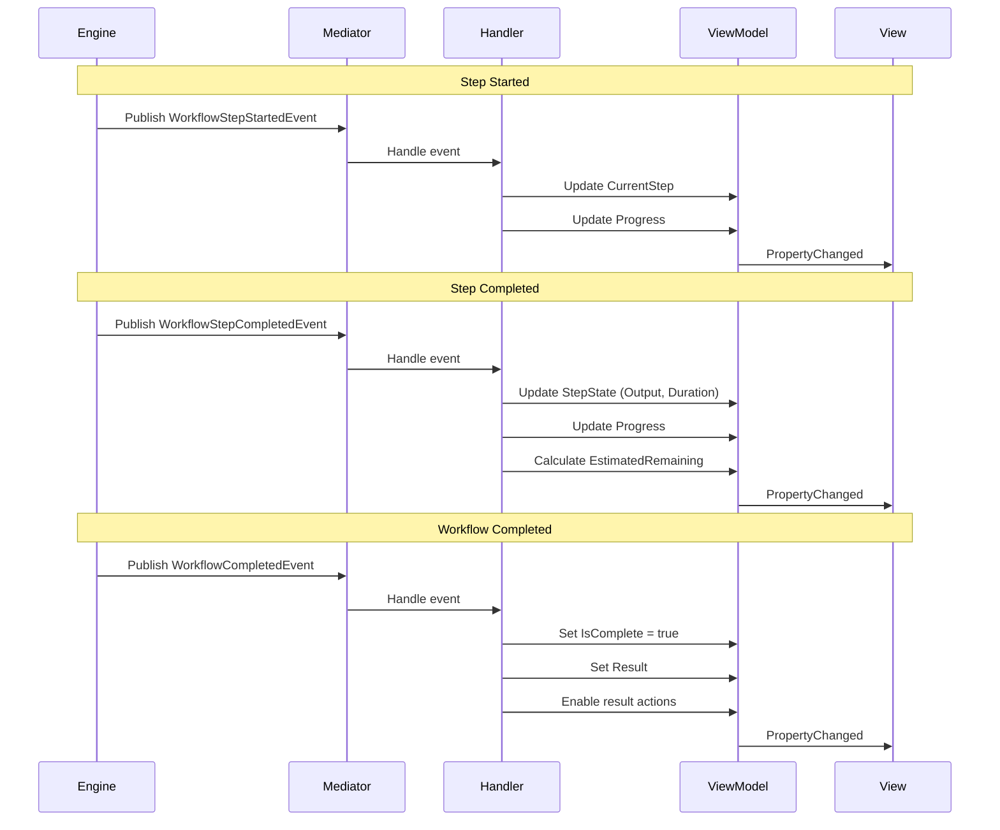

# LCS-DES-077d: Design Specification — Workflow Execution UI

## 1. Metadata & Categorization

| Field | Value | Description |
| :--- | :--- | :--- |
| **Feature ID** | `AGT-077d` | Sub-part of AGT-077 |
| **Feature Name** | `Workflow Execution UI` | Progress tracking and cancellation |
| **Target Version** | `v0.7.7d` | Fourth sub-part of v0.7.7 |
| **Module Scope** | `Lexichord.Modules.Agents` | Agents module |
| **Swimlane** | `Ensemble` | Agent orchestration vertical |
| **License Tier** | `WriterPro` (execute) / `Teams` (full) | Tiered access |
| **Feature Gate Key** | `FeatureFlags.Agents.WorkflowExecution` | |
| **Author** | Lead Architect | |
| **Status** | `Draft` | |
| **Last Updated** | `2026-01-27` | |
| **Parent Document** | [LCS-DES-077-INDEX](./LCS-DES-077-INDEX.md) | |
| **Scope Breakdown** | [LCS-SBD-077 Section 3.4](./LCS-SBD-077.md#34-v077d-workflow-execution-ui) | |

---

## 2. Executive Summary

### 2.1 The Requirement

Users executing workflows need visibility into:

- Which step is currently running
- Progress through the overall workflow
- Output from completed steps
- Ability to cancel long-running workflows
- Actions to apply or copy the final result
- History of past executions

> **Goal:** Provide a rich, real-time execution experience that keeps users informed and in control of their workflow runs.

### 2.2 The Proposed Solution

Implement a comprehensive execution UI that:

1. **Shows Real-Time Progress** — Progress bar, step indicators, elapsed time
2. **Displays Step Results** — Expandable cards showing each step's output
3. **Enables Cancellation** — Cancel button with graceful termination
4. **Provides Result Actions** — Apply to document, copy to clipboard, export
5. **Tracks History** — Record past executions for review and statistics

---

## 3. Architecture & Modular Strategy

### 3.1 Dependencies

#### 3.1.1 Upstream Modules

| Interface | Source Version | Purpose |
| :--- | :--- | :--- |
| `IWorkflowEngine` | v0.7.7b | Workflow execution |
| `IMediator` | v0.0.7a | Event subscription |
| `IEditorService` | v0.1.3a | Apply results to document |
| `IConfigurationService` | v0.0.3d | History storage |
| `ILicenseContext` | v0.0.4c | License verification |

#### 3.1.2 NuGet Packages

| Package | Version | Purpose |
| :--- | :--- | :--- |
| `CommunityToolkit.Mvvm` | 8.x | MVVM infrastructure |
| `Avalonia.Controls` | 11.x | UI controls |

### 3.2 Licensing Behavior

| Feature | WriterPro | Teams | Enterprise |
| :--- | :--- | :--- | :--- |
| Execute workflows | Yes (3/day presets) | Yes | Yes |
| View execution progress | Yes | Yes | Yes |
| Cancel execution | Yes | Yes | Yes |
| Apply results | Yes | Yes | Yes |
| Execution history | No | Yes | Yes |
| Execution statistics | No | No | Yes |

---

## 4. Data Contract (The API)

### 4.1 ViewModel Interface

```csharp
namespace Lexichord.Modules.Agents.ViewModels;

/// <summary>
/// ViewModel for workflow execution UI.
/// Manages execution state, progress, and user actions.
/// </summary>
public interface IWorkflowExecutionViewModel
{
    /// <summary>
    /// The workflow being executed.
    /// </summary>
    WorkflowDefinition? Workflow { get; }

    /// <summary>
    /// Current execution status.
    /// </summary>
    WorkflowExecutionStatus Status { get; }

    /// <summary>
    /// Progress percentage (0-100).
    /// </summary>
    int Progress { get; }

    /// <summary>
    /// Elapsed time since execution started.
    /// </summary>
    TimeSpan ElapsedTime { get; }

    /// <summary>
    /// Estimated remaining time (if available).
    /// </summary>
    TimeSpan? EstimatedRemaining { get; }

    /// <summary>
    /// Currently executing step (if any).
    /// </summary>
    WorkflowStepExecutionState? CurrentStep { get; }

    /// <summary>
    /// All step states for display.
    /// </summary>
    ObservableCollection<WorkflowStepExecutionState> StepStates { get; }

    /// <summary>
    /// Whether the workflow can be cancelled.
    /// </summary>
    bool CanCancel { get; }

    /// <summary>
    /// Whether execution is complete (success, failed, or cancelled).
    /// </summary>
    bool IsComplete { get; }

    /// <summary>
    /// Final result after completion.
    /// </summary>
    WorkflowExecutionResult? Result { get; }

    /// <summary>
    /// Status message for display.
    /// </summary>
    string StatusMessage { get; }

    /// <summary>
    /// Error message if execution failed.
    /// </summary>
    string? ErrorMessage { get; }

    // Commands
    IAsyncRelayCommand ExecuteCommand { get; }
    IRelayCommand CancelCommand { get; }
    IAsyncRelayCommand ApplyResultCommand { get; }
    IAsyncRelayCommand CopyResultCommand { get; }
    IRelayCommand ExportResultCommand { get; }
    IRelayCommand CloseCommand { get; }
}

/// <summary>
/// State of a single workflow step for UI display.
/// </summary>
public class WorkflowStepExecutionState : ObservableObject
{
    /// <summary>
    /// Step identifier.
    /// </summary>
    public string StepId { get; init; }

    /// <summary>
    /// Step number (1-based).
    /// </summary>
    public int StepNumber { get; init; }

    /// <summary>
    /// Agent name for display.
    /// </summary>
    public string AgentName { get; init; }

    /// <summary>
    /// Agent icon for display.
    /// </summary>
    public string AgentIcon { get; init; }

    /// <summary>
    /// Persona name if applied.
    /// </summary>
    public string? PersonaName { get; init; }

    /// <summary>
    /// Current step status.
    /// </summary>
    public WorkflowStepStatus Status { get; set; }

    /// <summary>
    /// Human-readable status message.
    /// </summary>
    public string StatusMessage { get; set; }

    /// <summary>
    /// Progress within step (0-100) if available.
    /// </summary>
    public int? ProgressPercent { get; set; }

    /// <summary>
    /// Step duration after completion.
    /// </summary>
    public TimeSpan? Duration { get; set; }

    /// <summary>
    /// Step output text.
    /// </summary>
    public string? Output { get; set; }

    /// <summary>
    /// Output preview (first 200 chars).
    /// </summary>
    public string? OutputPreview => Output?.Length > 200
        ? Output[..200] + "..."
        : Output;

    /// <summary>
    /// Error message if step failed.
    /// </summary>
    public string? ErrorMessage { get; set; }

    /// <summary>
    /// Token usage for this step.
    /// </summary>
    public AgentUsageMetrics? Usage { get; set; }

    /// <summary>
    /// Whether the output is expanded in UI.
    /// </summary>
    public bool IsExpanded { get; set; }

    /// <summary>
    /// Whether this step has output to show.
    /// </summary>
    public bool HasOutput => !string.IsNullOrEmpty(Output);
}
```

### 4.2 History Service Interface

```csharp
namespace Lexichord.Modules.Agents.Workflows;

/// <summary>
/// Service for tracking workflow execution history.
/// </summary>
public interface IWorkflowExecutionHistoryService
{
    /// <summary>
    /// Records a workflow execution result.
    /// </summary>
    /// <param name="result">Execution result to record.</param>
    /// <param name="workflowName">Workflow name for display.</param>
    /// <param name="ct">Cancellation token.</param>
    Task RecordAsync(
        WorkflowExecutionResult result,
        string workflowName,
        CancellationToken ct = default);

    /// <summary>
    /// Gets recent execution history for a workflow.
    /// </summary>
    /// <param name="workflowId">Workflow ID (null for all workflows).</param>
    /// <param name="limit">Maximum entries to return.</param>
    /// <param name="ct">Cancellation token.</param>
    /// <returns>List of execution summaries.</returns>
    Task<IReadOnlyList<WorkflowExecutionSummary>> GetHistoryAsync(
        string? workflowId = null,
        int limit = 10,
        CancellationToken ct = default);

    /// <summary>
    /// Gets execution statistics for a workflow.
    /// </summary>
    /// <param name="workflowId">Workflow ID.</param>
    /// <param name="ct">Cancellation token.</param>
    /// <returns>Aggregated statistics.</returns>
    Task<WorkflowExecutionStatistics> GetStatisticsAsync(
        string workflowId,
        CancellationToken ct = default);

    /// <summary>
    /// Clears execution history older than specified date.
    /// </summary>
    /// <param name="olderThan">Clear entries before this date.</param>
    /// <param name="ct">Cancellation token.</param>
    Task ClearHistoryAsync(DateTime olderThan, CancellationToken ct = default);
}

/// <summary>
/// Summary of a past workflow execution.
/// </summary>
public record WorkflowExecutionSummary(
    string ExecutionId,
    string WorkflowId,
    string WorkflowName,
    DateTime ExecutedAt,
    TimeSpan Duration,
    WorkflowExecutionStatus Status,
    int StepsCompleted,
    int TotalSteps,
    int TotalTokens,
    string? FinalOutputPreview
);

/// <summary>
/// Aggregated statistics for workflow executions.
/// </summary>
public record WorkflowExecutionStatistics(
    int TotalExecutions,
    int SuccessfulExecutions,
    int FailedExecutions,
    int CancelledExecutions,
    double SuccessRate,
    TimeSpan AverageDuration,
    TimeSpan MinDuration,
    TimeSpan MaxDuration,
    int AverageTokensPerExecution,
    int TotalTokensUsed,
    DateTime? FirstExecution,
    DateTime? LastExecution
);
```

---

## 5. Implementation Logic

### 5.1 Progress Calculation

```text
PROGRESS CALCULATION:
│
├── Total steps = workflow.Steps.Count
│
├── Completed steps = steps with Status = Completed or Skipped
│
├── Current step weight:
│   ├── Running → 0.5 (halfway credit)
│   └── Other → 0.0
│
├── Formula:
│   progress = ((completed + currentWeight) / total) * 100
│
├── Examples:
│   │
│   ├── 4 steps, 0 done, step 1 running:
│   │   (0 + 0.5) / 4 * 100 = 12.5%
│   │
│   ├── 4 steps, 1 done, step 2 running:
│   │   (1 + 0.5) / 4 * 100 = 37.5%
│   │
│   ├── 4 steps, 3 done, step 4 running:
│   │   (3 + 0.5) / 4 * 100 = 87.5%
│   │
│   └── 4 steps, all done:
│       4 / 4 * 100 = 100%
│
└── Round to nearest integer for display
```

### 5.2 Estimated Time Calculation

```text
ESTIMATED REMAINING TIME:
│
├── Collect timing data:
│   └── completedStepDurations: List<TimeSpan>
│
├── Calculate average step duration:
│   └── avgDuration = completedStepDurations.Average()
│
├── Calculate remaining steps:
│   └── remaining = totalSteps - completedSteps - (currentRunning ? 0 : 1)
│
├── Estimate:
│   └── estimatedRemaining = avgDuration * remaining
│
├── Adjust for current step:
│   ├── If current step running longer than average:
│   │   └── Add (currentElapsed - avgDuration) to estimate
│   └── Otherwise:
│       └── Subtract (avgDuration - currentElapsed)
│
└── Return null if < 2 steps completed (not enough data)
```

### 5.3 Event Handling Flow



### 5.4 Cancellation Flow

```text
USER CLICKS CANCEL:
│
├── 1. Check CanCancel
│   └── If false → Ignore click (already cancelling)
│
├── 2. Set CanCancel = false
│   └── Prevents double-click
│
├── 3. Update StatusMessage = "Cancelling..."
│
├── 4. Trigger CancellationTokenSource.Cancel()
│
├── 5. Engine receives cancellation:
│   ├── If step running → Send cancel to agent
│   └── If between steps → Stop before next step
│
├── 6. Wait for engine to respond:
│   ├── Graceful timeout: 5 seconds
│   └── After timeout: Force complete
│
├── 7. Mark current step as Cancelled
│
├── 8. Mark remaining steps as Cancelled
│
├── 9. Receive WorkflowCancelledEvent
│
├── 10. Update UI:
│   ├── Status = Cancelled
│   ├── StatusMessage = "Workflow cancelled"
│   ├── IsComplete = true
│   └── Show partial results
│
└── 11. Enable result actions for completed steps
```

---

## 6. UI/UX Specifications

### 6.1 Execution Panel Layout

```text
+------------------------------------------------------------------------------+
|  EXECUTING WORKFLOW                                                          |
+------------------------------------------------------------------------------+
| Workflow: Technical Review                               [Cancel]            |
+------------------------------------------------------------------------------+
| Progress: [=========================>                        ] 62%           |
| Elapsed: 00:01:23 | Estimated remaining: ~00:00:45                           |
+------------------------------------------------------------------------------+

+------------------------------------------------------------------------------+
| EXECUTION STEPS                                                              |
+------------------------------------------------------------------------------+
|                                                                              |
| [checkmark] STEP 1: Editor (Strict)                     Completed (18.2s)    |
|     +--------------------------------------------------------------------+   |
|     | Found 5 issues:                                                    |   |
|     | - Line 12: Subject-verb agreement error in "The data are..."       |   |
|     | - Line 34: Unclear reference for "it" - specify the antecedent     |   |
|     |                                            [Show more v] [Copy]    |   |
|     +--------------------------------------------------------------------+   |
|     Tokens: 523 prompt + 187 completion = 710 total                          |
|                                                                              |
+------------------------------------------------------------------------------+
|                                                                              |
| [spinner] STEP 2: Simplifier                             Running... (12.4s)  |
|     +--------------------------------------------------------------------+   |
|     | Analyzing sentence complexity in paragraph 4 of 7...               |   |
|     +--------------------------------------------------------------------+   |
|                                                                              |
+------------------------------------------------------------------------------+
|                                                                              |
| [clock] STEP 3: Tuning                                   Pending             |
|     Waiting for previous step to complete                                    |
|     Condition: Execute if previous step succeeded                            |
|                                                                              |
+------------------------------------------------------------------------------+
|                                                                              |
| [clock] STEP 4: Summarizer                               Pending             |
|     Waiting for step 3 to complete                                           |
|                                                                              |
+------------------------------------------------------------------------------+
```

### 6.2 Completed State Layout

```text
+------------------------------------------------------------------------------+
|  WORKFLOW COMPLETED                                                          |
+------------------------------------------------------------------------------+
| Workflow: Technical Review                           Status: [check] Success |
+------------------------------------------------------------------------------+
| Duration: 00:02:08 | Total tokens: 2,847 | Steps: 4/4 completed              |
+------------------------------------------------------------------------------+

+------------------------------------------------------------------------------+
| FINAL OUTPUT                                                                 |
+------------------------------------------------------------------------------+
| +------------------------------------------------------------------------+   |
| | ## Technical Abstract                                                  |   |
| |                                                                        |   |
| | This document provides a comprehensive overview of the authentication  |   |
| | system architecture, covering OAuth 2.0 implementation details,        |   |
| | security considerations, and integration guidelines...                 |   |
| |                                                                        |   |
| | ## Key Points                                                          |   |
| | - OAuth 2.0 with PKCE recommended for all client types                |   |
| | - Token rotation every 15 minutes for security                         |   |
| | - Rate limiting: 100 requests/minute per client                        |   |
| |                                                    [Show full output]  |   |
| +------------------------------------------------------------------------+   |
+------------------------------------------------------------------------------+
| [Apply to Document]     [Copy to Clipboard]     [Export as Markdown]         |
+------------------------------------------------------------------------------+

+------------------------------------------------------------------------------+
| STEP DETAILS                                                   [Collapse All]|
+------------------------------------------------------------------------------+
| [v] STEP 1: Editor (Strict)                                   18.2s | 710 tk |
| [v] STEP 2: Simplifier                                        24.1s | 892 tk |
| [v] STEP 3: Tuning                                            31.4s | 634 tk |
| [v] STEP 4: Summarizer                                        14.5s | 611 tk |
+------------------------------------------------------------------------------+
```

### 6.3 Error State Layout

```text
+------------------------------------------------------------------------------+
|  WORKFLOW FAILED                                                             |
+------------------------------------------------------------------------------+
| Workflow: Technical Review                             Status: [x] Failed    |
+------------------------------------------------------------------------------+
| Duration: 00:00:45 | Total tokens: 710 | Steps: 1/4 completed                |
+------------------------------------------------------------------------------+

+------------------------------------------------------------------------------+
| ERROR                                                                        |
+------------------------------------------------------------------------------+
| [!] Step 2 (Simplifier) failed: API rate limit exceeded. Please try again    |
|     in 60 seconds.                                                           |
+------------------------------------------------------------------------------+

+------------------------------------------------------------------------------+
| PARTIAL RESULTS                                                              |
+------------------------------------------------------------------------------+
| Step 1 completed successfully. You can view and use the partial output.      |
|                                                                              |
| [View Step 1 Output]     [Copy Step 1 Output]     [Retry Workflow]           |
+------------------------------------------------------------------------------+
```

### 6.4 Step Status Icons

```text
STATUS INDICATORS:

Pending:
  Icon: [clock] (gray)
  Background: Surface.Tertiary (subtle)
  Message: "Waiting for previous step" or "Queued"

Running:
  Icon: [spinner] (blue, animated)
  Background: Accent.Light (10%)
  Message: "Processing..." or streaming agent message

Completed:
  Icon: [checkmark] (green)
  Background: Success.Light (10%)
  Message: Duration + token count

Failed:
  Icon: [x-circle] (red)
  Background: Danger.Light (10%)
  Message: Error message

Skipped:
  Icon: [skip-forward] (yellow/amber)
  Background: Warning.Light (10%)
  Message: "Condition not met" or "Previous step failed"

Cancelled:
  Icon: [stop-circle] (orange)
  Background: Warning.Light (10%)
  Message: "Cancelled by user"
```

### 6.5 Component Styling

| Component | Theme Resource | Notes |
| :--- | :--- | :--- |
| Execution Panel | `Brush.Surface.Primary` | Full-width card |
| Progress Bar Track | `Brush.Surface.Tertiary` | Rounded corners |
| Progress Bar Fill | `Brush.Accent.Primary` | Animated gradient |
| Step Card | `Brush.Surface.Secondary` | Subtle border |
| Step Card (Running) | `Brush.Accent.Light` | Blue border |
| Step Card (Error) | `Brush.Danger.Light` | Red border |
| Output Box | `Brush.Surface.Tertiary` | Monospace font |
| Cancel Button | `LexButtonDanger` | Red with hover |
| Action Buttons | `LexButtonPrimary` | Blue accent |
| Token Count | `Brush.Text.Secondary` | Smaller font |

---

## 7. Implementation

### 7.1 ViewModel Implementation

```csharp
namespace Lexichord.Modules.Agents.ViewModels;

/// <summary>
/// ViewModel for workflow execution panel.
/// </summary>
public partial class WorkflowExecutionViewModel : ObservableObject, IWorkflowExecutionViewModel
{
    private readonly IWorkflowEngine _engine;
    private readonly IEditorService _editorService;
    private readonly IWorkflowExecutionHistoryService _historyService;
    private readonly IClipboardService _clipboardService;
    private readonly IMediator _mediator;
    private readonly ILogger<WorkflowExecutionViewModel> _logger;

    private CancellationTokenSource? _cancellationTokenSource;
    private readonly Stopwatch _stopwatch = new();
    private readonly Timer _elapsedTimer;

    [ObservableProperty]
    private WorkflowDefinition? _workflow;

    [ObservableProperty]
    private WorkflowExecutionStatus _status = WorkflowExecutionStatus.Pending;

    [ObservableProperty]
    private int _progress;

    [ObservableProperty]
    private TimeSpan _elapsedTime;

    [ObservableProperty]
    private TimeSpan? _estimatedRemaining;

    [ObservableProperty]
    private WorkflowStepExecutionState? _currentStep;

    [ObservableProperty]
    private bool _canCancel;

    [ObservableProperty]
    private bool _isComplete;

    [ObservableProperty]
    private WorkflowExecutionResult? _result;

    [ObservableProperty]
    private string _statusMessage = "Ready to execute";

    [ObservableProperty]
    private string? _errorMessage;

    public ObservableCollection<WorkflowStepExecutionState> StepStates { get; } = new();

    public WorkflowExecutionViewModel(
        IWorkflowEngine engine,
        IEditorService editorService,
        IWorkflowExecutionHistoryService historyService,
        IClipboardService clipboardService,
        IMediator mediator,
        ILogger<WorkflowExecutionViewModel> logger)
    {
        _engine = engine;
        _editorService = editorService;
        _historyService = historyService;
        _clipboardService = clipboardService;
        _mediator = mediator;
        _logger = logger;

        _elapsedTimer = new Timer(UpdateElapsedTime, null, Timeout.Infinite, Timeout.Infinite);

        // Subscribe to workflow events
        _mediator.Subscribe<WorkflowStepStartedEvent>(OnStepStarted);
        _mediator.Subscribe<WorkflowStepCompletedEvent>(OnStepCompleted);
        _mediator.Subscribe<WorkflowCompletedEvent>(OnWorkflowCompleted);
        _mediator.Subscribe<WorkflowCancelledEvent>(OnWorkflowCancelled);
    }

    public void Initialize(WorkflowDefinition workflow, string? documentPath, string? selection)
    {
        Workflow = workflow;
        InitializeStepStates(workflow);
        Status = WorkflowExecutionStatus.Pending;
        Progress = 0;
        IsComplete = false;
        CanCancel = false;
        Result = null;
        ErrorMessage = null;
        StatusMessage = $"Ready to run: {workflow.Name}";

        _context = new WorkflowExecutionContext(
            documentPath,
            selection,
            new Dictionary<string, object>(),
            new WorkflowExecutionOptions());
    }

    private WorkflowExecutionContext _context;

    private void InitializeStepStates(WorkflowDefinition workflow)
    {
        StepStates.Clear();
        var stepNumber = 0;
        foreach (var step in workflow.Steps.OrderBy(s => s.Order))
        {
            stepNumber++;
            StepStates.Add(new WorkflowStepExecutionState
            {
                StepId = step.StepId,
                StepNumber = stepNumber,
                AgentName = GetAgentName(step.AgentId),
                AgentIcon = GetAgentIcon(step.AgentId),
                PersonaName = step.PersonaId,
                Status = WorkflowStepStatus.Pending,
                StatusMessage = "Waiting..."
            });
        }
    }

    [RelayCommand]
    private async Task ExecuteAsync()
    {
        if (Workflow is null) return;

        _cancellationTokenSource = new CancellationTokenSource();
        CanCancel = true;
        Status = WorkflowExecutionStatus.Running;
        StatusMessage = "Executing workflow...";

        _stopwatch.Restart();
        _elapsedTimer.Change(TimeSpan.Zero, TimeSpan.FromMilliseconds(100));

        try
        {
            Result = await _engine.ExecuteAsync(Workflow, _context, _cancellationTokenSource.Token);

            // Record history
            await _historyService.RecordAsync(Result, Workflow.Name);
        }
        catch (Exception ex)
        {
            _logger.LogError(ex, "Workflow execution failed");
            ErrorMessage = ex.Message;
            Status = WorkflowExecutionStatus.Failed;
        }
        finally
        {
            _stopwatch.Stop();
            _elapsedTimer.Change(Timeout.Infinite, Timeout.Infinite);
            CanCancel = false;
            IsComplete = true;
        }
    }

    [RelayCommand]
    private void Cancel()
    {
        if (!CanCancel) return;

        CanCancel = false;
        StatusMessage = "Cancelling...";
        _cancellationTokenSource?.Cancel();
    }

    [RelayCommand]
    private async Task ApplyResultAsync()
    {
        if (Result?.FinalOutput is null) return;

        await _editorService.ReplaceSelectionAsync(Result.FinalOutput);
        StatusMessage = "Result applied to document";
    }

    [RelayCommand]
    private async Task CopyResultAsync()
    {
        if (Result?.FinalOutput is null) return;

        await _clipboardService.SetTextAsync(Result.FinalOutput);
        StatusMessage = "Result copied to clipboard";
    }

    [RelayCommand]
    private void ExportResult()
    {
        // Opens save dialog for markdown export
        // Implementation depends on file dialog service
    }

    private void OnStepStarted(WorkflowStepStartedEvent evt)
    {
        if (evt.WorkflowId != Workflow?.WorkflowId) return;

        var stepState = StepStates.FirstOrDefault(s => s.StepId == evt.StepId);
        if (stepState is null) return;

        stepState.Status = WorkflowStepStatus.Running;
        stepState.StatusMessage = "Processing...";
        CurrentStep = stepState;

        UpdateProgress();
        StatusMessage = $"Running step {evt.StepNumber} of {evt.TotalSteps}: {stepState.AgentName}";
    }

    private void OnStepCompleted(WorkflowStepCompletedEvent evt)
    {
        if (evt.WorkflowId != Workflow?.WorkflowId) return;

        var stepState = StepStates.FirstOrDefault(s => s.StepId == evt.StepId);
        if (stepState is null) return;

        stepState.Status = evt.Status;
        stepState.Duration = evt.Duration;

        stepState.StatusMessage = evt.Status switch
        {
            WorkflowStepStatus.Completed => $"Completed ({evt.Duration.TotalSeconds:F1}s)",
            WorkflowStepStatus.Skipped => "Skipped (condition not met)",
            WorkflowStepStatus.Failed => "Failed",
            _ => evt.Status.ToString()
        };

        UpdateProgress();
        CalculateEstimatedRemaining();
    }

    private void OnWorkflowCompleted(WorkflowCompletedEvent evt)
    {
        if (evt.WorkflowId != Workflow?.WorkflowId) return;

        Status = evt.Status;
        IsComplete = true;
        CanCancel = false;

        StatusMessage = evt.Status switch
        {
            WorkflowExecutionStatus.Completed => "Workflow completed successfully",
            WorkflowExecutionStatus.Failed => "Workflow failed",
            WorkflowExecutionStatus.PartialSuccess => "Workflow completed with some failures",
            _ => "Workflow finished"
        };

        Progress = 100;
    }

    private void OnWorkflowCancelled(WorkflowCancelledEvent evt)
    {
        if (evt.WorkflowId != Workflow?.WorkflowId) return;

        Status = WorkflowExecutionStatus.Cancelled;
        IsComplete = true;
        CanCancel = false;
        StatusMessage = "Workflow cancelled by user";

        // Mark remaining steps as cancelled
        foreach (var step in StepStates.Where(s => s.Status == WorkflowStepStatus.Pending))
        {
            step.Status = WorkflowStepStatus.Cancelled;
            step.StatusMessage = "Cancelled";
        }
    }

    private void UpdateProgress()
    {
        var total = StepStates.Count;
        if (total == 0) { Progress = 0; return; }

        var completed = StepStates.Count(s =>
            s.Status is WorkflowStepStatus.Completed or WorkflowStepStatus.Skipped);
        var currentWeight = StepStates.Any(s => s.Status == WorkflowStepStatus.Running) ? 0.5 : 0;

        Progress = (int)Math.Round((completed + currentWeight) / total * 100);
    }

    private void CalculateEstimatedRemaining()
    {
        var completedSteps = StepStates
            .Where(s => s.Duration.HasValue && s.Status == WorkflowStepStatus.Completed)
            .ToList();

        if (completedSteps.Count < 2)
        {
            EstimatedRemaining = null;
            return;
        }

        var avgDuration = completedSteps.Average(s => s.Duration!.Value.TotalSeconds);
        var remaining = StepStates.Count(s => s.Status == WorkflowStepStatus.Pending);

        EstimatedRemaining = TimeSpan.FromSeconds(avgDuration * remaining);
    }

    private void UpdateElapsedTime(object? state)
    {
        ElapsedTime = _stopwatch.Elapsed;
    }

    private static string GetAgentName(string agentId) => agentId switch
    {
        "editor" => "Editor",
        "simplifier" => "Simplifier",
        "tuning" => "Tuning Agent",
        "summarizer" => "Summarizer",
        _ => agentId
    };

    private static string GetAgentIcon(string agentId) => agentId switch
    {
        "editor" => "edit-3",
        "simplifier" => "zap",
        "tuning" => "sliders",
        "summarizer" => "file-text",
        _ => "cpu"
    };
}
```

### 7.2 History Service Implementation

```csharp
namespace Lexichord.Modules.Agents.Workflows;

/// <summary>
/// Tracks workflow execution history in local storage.
/// </summary>
public class WorkflowExecutionHistoryService : IWorkflowExecutionHistoryService
{
    private readonly IConfigurationService _config;
    private readonly ILogger<WorkflowExecutionHistoryService> _logger;
    private readonly string _historyPath;
    private const int MaxHistoryEntries = 100;

    public WorkflowExecutionHistoryService(
        IConfigurationService config,
        ILogger<WorkflowExecutionHistoryService> logger)
    {
        _config = config;
        _logger = logger;
        _historyPath = Path.Combine(_config.DataDirectory, "workflow-history.json");
    }

    public async Task RecordAsync(
        WorkflowExecutionResult result,
        string workflowName,
        CancellationToken ct = default)
    {
        var history = await LoadHistoryAsync(ct);

        var summary = new WorkflowExecutionSummary(
            result.ExecutionId,
            result.WorkflowId,
            workflowName,
            DateTime.UtcNow,
            result.TotalDuration,
            result.Status,
            result.StepResults.Count(s => s.Status == WorkflowStepStatus.Completed),
            result.StepResults.Count,
            result.TotalUsage.TotalTokens,
            result.FinalOutput?.Length > 100 ? result.FinalOutput[..100] + "..." : result.FinalOutput
        );

        history.Insert(0, summary);

        // Trim to max entries
        if (history.Count > MaxHistoryEntries)
        {
            history.RemoveRange(MaxHistoryEntries, history.Count - MaxHistoryEntries);
        }

        await SaveHistoryAsync(history, ct);
        _logger.LogDebug("Recorded workflow execution: {ExecutionId}", result.ExecutionId);
    }

    public async Task<IReadOnlyList<WorkflowExecutionSummary>> GetHistoryAsync(
        string? workflowId = null,
        int limit = 10,
        CancellationToken ct = default)
    {
        var history = await LoadHistoryAsync(ct);

        var query = history.AsEnumerable();
        if (workflowId is not null)
        {
            query = query.Where(h => h.WorkflowId == workflowId);
        }

        return query.Take(limit).ToList();
    }

    public async Task<WorkflowExecutionStatistics> GetStatisticsAsync(
        string workflowId,
        CancellationToken ct = default)
    {
        var history = await LoadHistoryAsync(ct);
        var entries = history.Where(h => h.WorkflowId == workflowId).ToList();

        if (entries.Count == 0)
        {
            return new WorkflowExecutionStatistics(
                0, 0, 0, 0, 0, TimeSpan.Zero, TimeSpan.Zero, TimeSpan.Zero, 0, 0, null, null);
        }

        var successful = entries.Count(e => e.Status == WorkflowExecutionStatus.Completed);
        var failed = entries.Count(e => e.Status == WorkflowExecutionStatus.Failed);
        var cancelled = entries.Count(e => e.Status == WorkflowExecutionStatus.Cancelled);

        return new WorkflowExecutionStatistics(
            TotalExecutions: entries.Count,
            SuccessfulExecutions: successful,
            FailedExecutions: failed,
            CancelledExecutions: cancelled,
            SuccessRate: (double)successful / entries.Count,
            AverageDuration: TimeSpan.FromSeconds(entries.Average(e => e.Duration.TotalSeconds)),
            MinDuration: entries.Min(e => e.Duration),
            MaxDuration: entries.Max(e => e.Duration),
            AverageTokensPerExecution: (int)entries.Average(e => e.TotalTokens),
            TotalTokensUsed: entries.Sum(e => e.TotalTokens),
            FirstExecution: entries.Min(e => e.ExecutedAt),
            LastExecution: entries.Max(e => e.ExecutedAt)
        );
    }

    public async Task ClearHistoryAsync(DateTime olderThan, CancellationToken ct = default)
    {
        var history = await LoadHistoryAsync(ct);
        history.RemoveAll(h => h.ExecutedAt < olderThan);
        await SaveHistoryAsync(history, ct);
    }

    private async Task<List<WorkflowExecutionSummary>> LoadHistoryAsync(CancellationToken ct)
    {
        if (!File.Exists(_historyPath))
            return new List<WorkflowExecutionSummary>();

        var json = await File.ReadAllTextAsync(_historyPath, ct);
        return JsonSerializer.Deserialize<List<WorkflowExecutionSummary>>(json) ?? new();
    }

    private async Task SaveHistoryAsync(List<WorkflowExecutionSummary> history, CancellationToken ct)
    {
        var json = JsonSerializer.Serialize(history, new JsonSerializerOptions { WriteIndented = true });
        await File.WriteAllTextAsync(_historyPath, json, ct);
    }
}
```

---

## 8. Observability & Logging

| Level | Message Template |
| :--- | :--- |
| Debug | `"Workflow execution started: {WorkflowId}"` |
| Debug | `"Step {StepId} status changed to {Status}"` |
| Debug | `"Progress updated: {Progress}%"` |
| Debug | `"Estimated remaining: {EstimatedRemaining}"` |
| Info | `"Workflow execution completed: {Status} in {Duration}"` |
| Info | `"Recorded workflow execution: {ExecutionId}"` |
| Warning | `"Workflow cancelled by user"` |
| Error | `"Workflow execution failed: {Error}"` |

---

## 9. Acceptance Criteria

### 9.1 Progress Display

| # | Given | When | Then |
| :--- | :--- | :--- | :--- |
| 1 | Workflow running | Step 1 of 4 starts | Progress shows ~12% |
| 2 | Workflow running | Step 2 of 4 completes | Progress shows ~50% |
| 3 | Workflow running | All steps complete | Progress shows 100% |
| 4 | Workflow running | 1+ steps complete | Estimated remaining shown |
| 5 | Workflow running | Timer active | Elapsed time updates live |

### 9.2 Step Display

| # | Given | When | Then |
| :--- | :--- | :--- | :--- |
| 6 | Step pending | Waiting | Shows clock icon, gray |
| 7 | Step running | Executing | Shows spinner, blue highlight |
| 8 | Step completed | Done | Shows checkmark, duration |
| 9 | Step failed | Error | Shows X, error message |
| 10 | Step skipped | Condition false | Shows skip icon, reason |
| 11 | Step has output | Completed | Output preview shown |
| 12 | Output > 200 chars | Displayed | "Show more" available |

### 9.3 Cancellation

| # | Given | When | Then |
| :--- | :--- | :--- | :--- |
| 13 | Workflow running | User clicks Cancel | Cancel button disabled |
| 14 | Cancel clicked | Waiting | Status shows "Cancelling..." |
| 15 | Cancel processing | Within 5s | Workflow stops gracefully |
| 16 | Workflow cancelled | Complete | Status = Cancelled |
| 17 | Partial results | After cancel | Completed step outputs available |

### 9.4 Result Actions

| # | Given | When | Then |
| :--- | :--- | :--- | :--- |
| 18 | Workflow complete | Success | "Apply to Document" enabled |
| 19 | User clicks Apply | Result exists | Document selection replaced |
| 20 | User clicks Copy | Result exists | Result on clipboard |
| 21 | Workflow failed | Partial output | "View Step N Output" available |

### 9.5 History

| # | Given | When | Then |
| :--- | :--- | :--- | :--- |
| 22 | Workflow completes | Any status | Execution recorded |
| 23 | Teams user | Views history | Last 10 executions shown |
| 24 | History > 100 | New entry | Oldest entries trimmed |

---

## 10. Unit Tests

```csharp
[Trait("Category", "Unit")]
[Trait("Version", "v0.7.7d")]
public class WorkflowExecutionViewModelTests
{
    private readonly Mock<IWorkflowEngine> _engineMock;
    private readonly Mock<IEditorService> _editorMock;
    private readonly Mock<IWorkflowExecutionHistoryService> _historyMock;
    private readonly Mock<IMediator> _mediatorMock;
    private readonly WorkflowExecutionViewModel _sut;

    public WorkflowExecutionViewModelTests()
    {
        _engineMock = new Mock<IWorkflowEngine>();
        _editorMock = new Mock<IEditorService>();
        _historyMock = new Mock<IWorkflowExecutionHistoryService>();
        _mediatorMock = new Mock<IMediator>();

        _sut = new WorkflowExecutionViewModel(
            _engineMock.Object,
            _editorMock.Object,
            _historyMock.Object,
            Mock.Of<IClipboardService>(),
            _mediatorMock.Object,
            Mock.Of<ILogger<WorkflowExecutionViewModel>>());
    }

    [Fact]
    public void Initialize_SetsWorkflowAndCreatesStepStates()
    {
        var workflow = CreateTestWorkflow(3);

        _sut.Initialize(workflow, null, "Test content");

        _sut.Workflow.Should().Be(workflow);
        _sut.StepStates.Should().HaveCount(3);
        _sut.Status.Should().Be(WorkflowExecutionStatus.Pending);
        _sut.Progress.Should().Be(0);
    }

    [Fact]
    public void Progress_CalculatesCorrectly_OneOfFourRunning()
    {
        var workflow = CreateTestWorkflow(4);
        _sut.Initialize(workflow, null, "Test");

        // Simulate step 1 started
        _sut.StepStates[0].Status = WorkflowStepStatus.Running;
        InvokeProgressUpdate();

        _sut.Progress.Should().Be(13); // (0 + 0.5) / 4 * 100 = 12.5 -> 13
    }

    [Fact]
    public void Progress_CalculatesCorrectly_TwoOfFourComplete()
    {
        var workflow = CreateTestWorkflow(4);
        _sut.Initialize(workflow, null, "Test");

        _sut.StepStates[0].Status = WorkflowStepStatus.Completed;
        _sut.StepStates[1].Status = WorkflowStepStatus.Completed;
        _sut.StepStates[2].Status = WorkflowStepStatus.Running;
        InvokeProgressUpdate();

        _sut.Progress.Should().Be(63); // (2 + 0.5) / 4 * 100 = 62.5 -> 63
    }

    [Fact]
    public void Progress_Is100_WhenAllComplete()
    {
        var workflow = CreateTestWorkflow(4);
        _sut.Initialize(workflow, null, "Test");

        foreach (var step in _sut.StepStates)
        {
            step.Status = WorkflowStepStatus.Completed;
        }
        InvokeProgressUpdate();

        _sut.Progress.Should().Be(100);
    }

    [Fact]
    public void CancelCommand_SetsCancellingState()
    {
        var workflow = CreateTestWorkflow(2);
        _sut.Initialize(workflow, null, "Test");
        _sut.GetType().GetProperty("CanCancel")!.SetValue(_sut, true);

        _sut.CancelCommand.Execute(null);

        _sut.CanCancel.Should().BeFalse();
        _sut.StatusMessage.Should().Contain("Cancelling");
    }

    [Fact]
    public async Task ApplyResultCommand_ReplacesSelection()
    {
        var workflow = CreateTestWorkflow(1);
        _sut.Initialize(workflow, null, "Test");

        var result = new WorkflowExecutionResult(
            "wf-1", "exec-1", true, WorkflowExecutionStatus.Completed,
            Array.Empty<WorkflowStepExecutionResult>(),
            "Final output text",
            TimeSpan.FromSeconds(10),
            WorkflowUsageMetrics.Empty,
            new Dictionary<string, object>(),
            null);

        _sut.GetType().GetProperty("Result")!.SetValue(_sut, result);

        await _sut.ApplyResultCommand.ExecuteAsync(null);

        _editorMock.Verify(e => e.ReplaceSelectionAsync("Final output text"), Times.Once);
    }

    [Fact]
    public void OnStepStarted_UpdatesStepState()
    {
        var workflow = CreateTestWorkflow(2);
        _sut.Initialize(workflow, null, "Test");

        var evt = new WorkflowStepStartedEvent(
            workflow.WorkflowId, "exec-1", "step-1", "editor", 1, 2);

        InvokeEventHandler(evt);

        _sut.StepStates[0].Status.Should().Be(WorkflowStepStatus.Running);
        _sut.CurrentStep.Should().Be(_sut.StepStates[0]);
    }

    [Fact]
    public void OnStepCompleted_UpdatesStepStateAndDuration()
    {
        var workflow = CreateTestWorkflow(2);
        _sut.Initialize(workflow, null, "Test");
        _sut.StepStates[0].Status = WorkflowStepStatus.Running;

        var evt = new WorkflowStepCompletedEvent(
            workflow.WorkflowId, "exec-1", "step-1", true,
            WorkflowStepStatus.Completed, TimeSpan.FromSeconds(5.5));

        InvokeEventHandler(evt);

        _sut.StepStates[0].Status.Should().Be(WorkflowStepStatus.Completed);
        _sut.StepStates[0].Duration.Should().Be(TimeSpan.FromSeconds(5.5));
    }

    [Fact]
    public void OnWorkflowCompleted_SetsIsComplete()
    {
        var workflow = CreateTestWorkflow(2);
        _sut.Initialize(workflow, null, "Test");

        var evt = new WorkflowCompletedEvent(
            workflow.WorkflowId, "exec-1", true,
            WorkflowExecutionStatus.Completed, TimeSpan.FromSeconds(30), 2, 0);

        InvokeEventHandler(evt);

        _sut.IsComplete.Should().BeTrue();
        _sut.Status.Should().Be(WorkflowExecutionStatus.Completed);
        _sut.Progress.Should().Be(100);
    }

    private WorkflowDefinition CreateTestWorkflow(int stepCount)
    {
        var steps = Enumerable.Range(1, stepCount)
            .Select(i => new WorkflowStepDefinition($"step-{i}", "editor", null, null, i, null, null, null))
            .ToList();

        return new WorkflowDefinition(
            "wf-test", "Test Workflow", "", null, steps,
            new WorkflowMetadata("test", DateTime.UtcNow, DateTime.UtcNow, null,
                Array.Empty<string>(), WorkflowCategory.General, false, LicenseTier.Teams));
    }

    private void InvokeProgressUpdate()
    {
        // Use reflection to call private UpdateProgress method
        var method = _sut.GetType().GetMethod("UpdateProgress",
            System.Reflection.BindingFlags.NonPublic | System.Reflection.BindingFlags.Instance);
        method?.Invoke(_sut, null);
    }

    private void InvokeEventHandler<T>(T evt) where T : INotification
    {
        var method = _sut.GetType().GetMethod($"On{typeof(T).Name.Replace("Event", "")}",
            System.Reflection.BindingFlags.NonPublic | System.Reflection.BindingFlags.Instance);
        method?.Invoke(_sut, new object[] { evt });
    }
}
```

---

## 11. Deliverable Checklist

| # | Deliverable | Status |
| :--- | :--- | :--- |
| 1 | `IWorkflowExecutionViewModel.cs` interface | [ ] |
| 2 | `WorkflowExecutionViewModel.cs` implementation | [ ] |
| 3 | `WorkflowStepExecutionState.cs` | [ ] |
| 4 | `WorkflowExecutionView.axaml` | [ ] |
| 5 | `WorkflowExecutionView.axaml.cs` | [ ] |
| 6 | `IWorkflowExecutionHistoryService.cs` interface | [ ] |
| 7 | `WorkflowExecutionHistoryService.cs` implementation | [ ] |
| 8 | `WorkflowExecutionSummary.cs` record | [ ] |
| 9 | `WorkflowExecutionStatistics.cs` record | [ ] |
| 10 | MediatR event handlers | [ ] |
| 11 | Unit tests for ViewModel | [ ] |
| 12 | Unit tests for HistoryService | [ ] |

---

## 12. Verification Commands

```bash
# Run execution ViewModel tests
dotnet test --filter "FullyQualifiedName~WorkflowExecutionViewModel"

# Run history service tests
dotnet test --filter "FullyQualifiedName~WorkflowExecutionHistory"

# Run all v0.7.7d tests
dotnet test --filter "Version=v0.7.7d"

# Manual verification:
# a) Start workflow execution
# b) Verify progress bar animates
# c) Verify step cards update in real-time
# d) Verify elapsed time counts
# e) Test Cancel button mid-execution
# f) Verify partial results after cancel
# g) Complete workflow and test Apply button
# h) Test Copy to clipboard
# i) Check history (Teams user)
# j) Verify history persists across app restarts
```

---

## Document History

| Version | Date | Author | Changes |
| :--- | :--- | :--- | :--- |
| 1.0 | 2026-01-27 | Lead Architect | Initial draft |
