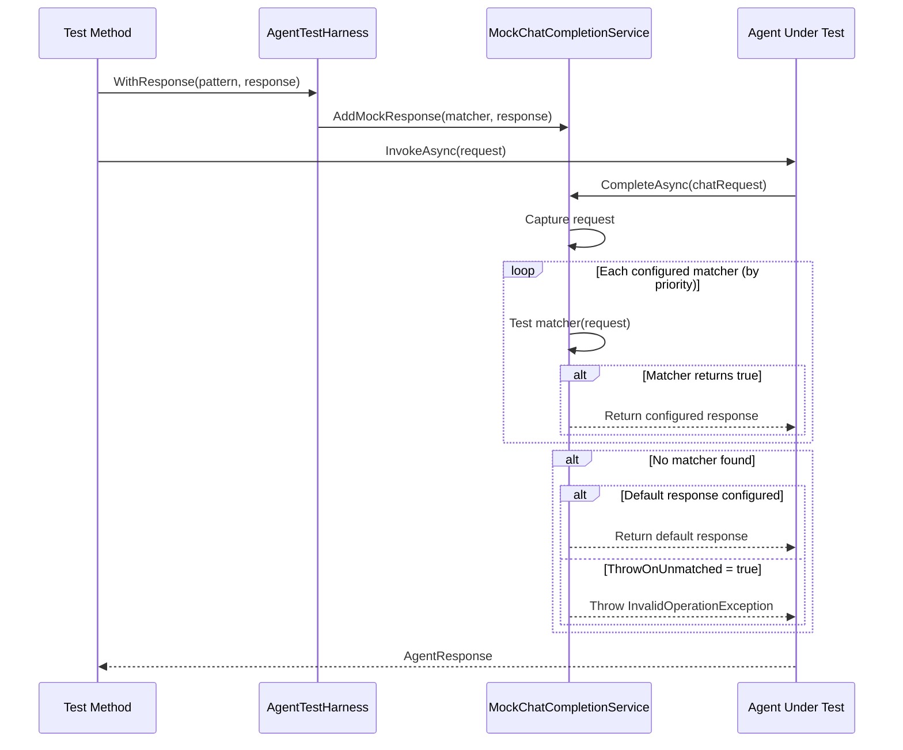
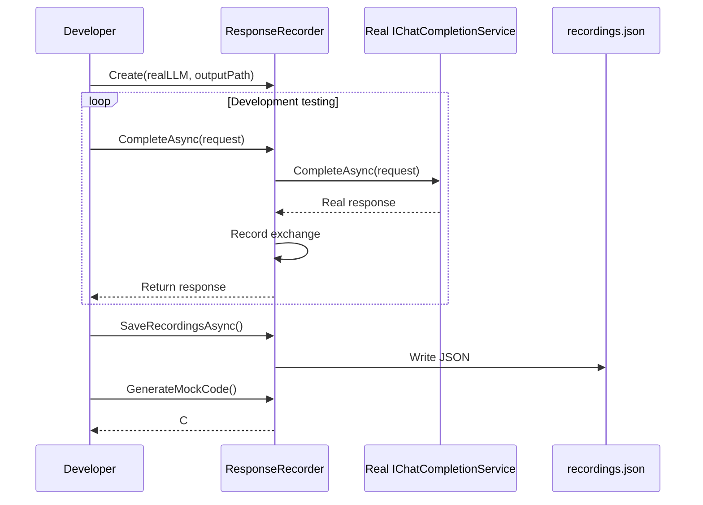

# LCS-DES-078b: Design Specification — LLM Response Mocking

## 1. Metadata & Categorization

| Field | Value | Description |
| :--- | :--- | :--- |
| **Feature ID** | `TST-078b` | Sub-part of TST-078 |
| **Feature Name** | `LLM Response Mocking (Deterministic Test Outputs)` | Mock LLM providers for testing |
| **Target Version** | `v0.7.8b` | Second sub-part of v0.7.8 |
| **Module Scope** | `Lexichord.Tests.Agents` | Test project |
| **Swimlane** | `Ensemble` | Part of Agents vertical |
| **License Tier** | `Core` | Testing available to all |
| **Feature Gate Key** | N/A | No gating for tests |
| **Author** | Lead Architect | |
| **Status** | `Draft` | |
| **Last Updated** | `2026-01-27` | |
| **Parent Document** | [LCS-DES-078-INDEX](./LCS-DES-078-INDEX.md) | |
| **Scope Breakdown** | [LCS-SBD-078 Section 3.2](./LCS-SBD-078.md#32-v078b-llm-response-mocking) | |

---

## 2. Executive Summary

### 2.1 The Requirement

Testing LLM-powered agents presents unique challenges:

- Live API calls are non-deterministic (same input can produce different outputs)
- API calls incur token costs that add up quickly during development
- Rate limits can slow down or block test execution
- Network failures can cause flaky tests
- Tests cannot run in isolated CI environments without API access

> **Goal:** Create mock LLM providers that return pre-defined responses, enabling fast, deterministic, cost-free testing.

### 2.2 The Proposed Solution

Implement a comprehensive mocking infrastructure that:

1. Provides `MockChatCompletionService` implementing `IChatCompletionService`
2. Supports multiple prompt matching strategies (exact, pattern, regex)
3. Captures all requests for assertion and debugging
4. Simulates token usage for cost testing
5. Includes `ResponseRecorder` for capturing live responses during development
6. Provides `AgentTestHarness` for simplified test configuration

---

## 3. Architecture & Modular Strategy

### 3.1 Dependencies

#### 3.1.1 Interfaces to Mock

| Interface | Source Version | Purpose |
| :--- | :--- | :--- |
| `IChatCompletionService` | v0.6.1a | LLM service interface to mock |
| `ChatRequest` | v0.6.1c | Request model |
| `ChatResponse` | v0.6.1c | Response model |
| `ChatMessage` | v0.6.1c | Message model |
| `FinishReason` | v0.6.1c | Response status |

#### 3.1.2 Consumers

| Component | Purpose |
| :--- | :--- |
| All agent accuracy tests | v0.7.8a |
| Workflow regression tests | v0.7.8c |
| Token benchmark tests | v0.7.8d |

#### 3.1.3 NuGet Packages

| Package | Version | Purpose |
| :--- | :--- | :--- |
| `xunit` | 2.9.x | Test framework |
| `FluentAssertions` | 6.x | Fluent assertions |
| `Moq` | 4.x | Additional mocking support |

### 3.2 Licensing Behavior

No licensing required. Test infrastructure only.

---

## 4. Data Contract (The API)

### 4.1 MockChatCompletionService

```csharp
namespace Lexichord.Tests.Agents.Mocking;

/// <summary>
/// Mock implementation of IChatCompletionService for deterministic testing.
/// Returns pre-configured responses based on prompt matching strategies.
/// </summary>
public class MockChatCompletionService : IChatCompletionService
{
    private readonly List<MockResponseEntry> _responses = new();
    private readonly List<CapturedRequest> _capturedRequests = new();
    private ChatResponse? _defaultResponse;
    private bool _throwOnUnmatched = true;

    #region Configuration

    /// <summary>
    /// Configure a response for prompts matching the predicate.
    /// </summary>
    /// <param name="matcher">Predicate to match requests.</param>
    /// <param name="response">Response to return when matched.</param>
    /// <param name="priority">Higher priority matchers are checked first.</param>
    public MockChatCompletionService WithResponse(
        Func<ChatRequest, bool> matcher,
        ChatResponse response,
        int priority = 0)
    {
        _responses.Add(new MockResponseEntry(matcher, response, priority));
        _responses.Sort((a, b) => b.Priority.CompareTo(a.Priority));
        return this;
    }

    /// <summary>
    /// Configure a response for prompts containing the specified text.
    /// </summary>
    public MockChatCompletionService WithExactResponse(
        string promptContains,
        string responseContent,
        int promptTokens = 100,
        int completionTokens = 50,
        FinishReason finishReason = FinishReason.Stop)
    {
        return WithResponse(
            r => r.Messages.Any(m =>
                m.Content.Contains(promptContains, StringComparison.OrdinalIgnoreCase)),
            new ChatResponse(
                Content: responseContent,
                FinishReason: finishReason,
                PromptTokens: promptTokens,
                CompletionTokens: completionTokens
            ));
    }

    /// <summary>
    /// Configure a response for prompts matching a regex pattern.
    /// </summary>
    public MockChatCompletionService WithPatternResponse(
        string regexPattern,
        string responseContent,
        int promptTokens = 100,
        int completionTokens = 50)
    {
        var regex = new Regex(regexPattern, RegexOptions.IgnoreCase);
        return WithResponse(
            r => r.Messages.Any(m => regex.IsMatch(m.Content)),
            new ChatResponse(
                Content: responseContent,
                FinishReason: FinishReason.Stop,
                PromptTokens: promptTokens,
                CompletionTokens: completionTokens
            ));
    }

    /// <summary>
    /// Configure a response based on message role.
    /// </summary>
    public MockChatCompletionService WithRoleResponse(
        MessageRole role,
        string contentContains,
        string responseContent)
    {
        return WithResponse(
            r => r.Messages.Any(m =>
                m.Role == role &&
                m.Content.Contains(contentContains, StringComparison.OrdinalIgnoreCase)),
            new ChatResponse(
                Content: responseContent,
                FinishReason: FinishReason.Stop,
                PromptTokens: 100,
                CompletionTokens: 50
            ));
    }

    /// <summary>
    /// Configure a default response for unmatched requests.
    /// </summary>
    public MockChatCompletionService WithDefaultResponse(ChatResponse response)
    {
        _defaultResponse = response;
        _throwOnUnmatched = false;
        return this;
    }

    /// <summary>
    /// Configure to return a default "no changes needed" response for unmatched requests.
    /// </summary>
    public MockChatCompletionService WithDefaultNoOp()
    {
        return WithDefaultResponse(new ChatResponse(
            Content: "No changes needed. The text looks good.",
            FinishReason: FinishReason.Stop,
            PromptTokens: 50,
            CompletionTokens: 20
        ));
    }

    /// <summary>
    /// Configure to throw on unmatched requests (default behavior).
    /// </summary>
    public MockChatCompletionService ThrowOnUnmatched(bool shouldThrow = true)
    {
        _throwOnUnmatched = shouldThrow;
        return this;
    }

    #endregion

    #region Request Capture

    /// <summary>
    /// Get all captured requests for assertion.
    /// </summary>
    public IReadOnlyList<CapturedRequest> CapturedRequests => _capturedRequests;

    /// <summary>
    /// Get the last captured request.
    /// </summary>
    public CapturedRequest? LastRequest => _capturedRequests.LastOrDefault();

    /// <summary>
    /// Get the full prompt text from the last request.
    /// </summary>
    public string? LastPrompt => LastRequest?.FullPrompt;

    /// <summary>
    /// Clear all captured requests.
    /// </summary>
    public void ClearCaptures() => _capturedRequests.Clear();

    /// <summary>
    /// Reset all configuration and captures.
    /// </summary>
    public void Reset()
    {
        _responses.Clear();
        _capturedRequests.Clear();
        _defaultResponse = null;
        _throwOnUnmatched = true;
    }

    #endregion

    #region IChatCompletionService Implementation

    public Task<ChatResponse> CompleteAsync(
        ChatRequest request,
        CancellationToken ct = default)
    {
        // Capture the request
        var captured = new CapturedRequest(
            Request: request,
            Timestamp: DateTimeOffset.UtcNow,
            FullPrompt: string.Join("\n\n", request.Messages.Select(m => $"[{m.Role}]: {m.Content}"))
        );
        _capturedRequests.Add(captured);

        // Find matching response
        var entry = _responses.FirstOrDefault(r => r.Matcher(request));
        if (entry is not null)
        {
            return Task.FromResult(entry.Response);
        }

        // Use default or throw
        if (_defaultResponse is not null)
        {
            return Task.FromResult(_defaultResponse);
        }

        if (_throwOnUnmatched)
        {
            var promptPreview = request.Messages.Last().Content;
            if (promptPreview.Length > 200)
                promptPreview = promptPreview[..200] + "...";

            throw new InvalidOperationException(
                $"No mock response configured for prompt:\n{promptPreview}\n\n" +
                $"Configure a response with WithExactResponse() or WithDefaultResponse().");
        }

        return Task.FromResult(new ChatResponse(
            Content: "",
            FinishReason: FinishReason.Stop,
            PromptTokens: 0,
            CompletionTokens: 0
        ));
    }

    public IAsyncEnumerable<ChatResponseChunk> CompleteStreamingAsync(
        ChatRequest request,
        CancellationToken ct = default)
    {
        var response = CompleteAsync(request, ct).GetAwaiter().GetResult();

        // Simulate streaming by breaking response into chunks
        return SimulateStreaming(response);
    }

    private async IAsyncEnumerable<ChatResponseChunk> SimulateStreaming(ChatResponse response)
    {
        const int chunkSize = 50;
        var content = response.Content;

        for (int i = 0; i < content.Length; i += chunkSize)
        {
            var chunk = content.Substring(i, Math.Min(chunkSize, content.Length - i));
            var isLast = i + chunkSize >= content.Length;

            yield return new ChatResponseChunk(
                Content: chunk,
                IsComplete: isLast,
                FinishReason: isLast ? response.FinishReason : null
            );

            await Task.Delay(10); // Simulate network delay
        }
    }

    #endregion
}

/// <summary>
/// Internal entry for mock response configuration.
/// </summary>
internal record MockResponseEntry(
    Func<ChatRequest, bool> Matcher,
    ChatResponse Response,
    int Priority = 0);

/// <summary>
/// Captured request for assertion and debugging.
/// </summary>
public record CapturedRequest(
    ChatRequest Request,
    DateTimeOffset Timestamp,
    string FullPrompt)
{
    /// <summary>
    /// Get the system prompt from this request.
    /// </summary>
    public string? SystemPrompt =>
        Request.Messages.FirstOrDefault(m => m.Role == MessageRole.System)?.Content;

    /// <summary>
    /// Get the user prompt from this request.
    /// </summary>
    public string? UserPrompt =>
        Request.Messages.LastOrDefault(m => m.Role == MessageRole.User)?.Content;

    /// <summary>
    /// Get the number of messages in this request.
    /// </summary>
    public int MessageCount => Request.Messages.Count;
}
```

### 4.2 AgentTestHarness

```csharp
namespace Lexichord.Tests.Agents.Mocking;

/// <summary>
/// Test harness for simplified agent testing.
/// Provides fluent API for configuring mocks and invoking agents.
/// </summary>
public class AgentTestHarness : IDisposable
{
    private readonly MockChatCompletionService _mockLlm;
    private readonly ServiceProvider _services;
    private readonly Dictionary<string, object> _contextVariables = new();

    public AgentTestHarness()
    {
        _mockLlm = new MockChatCompletionService();
        _services = BuildTestServices();
    }

    #region Configuration

    /// <summary>
    /// Configure a mock LLM response for prompts containing the specified text.
    /// </summary>
    public AgentTestHarness WithResponse(
        string promptContains,
        string response,
        int promptTokens = 100,
        int completionTokens = 50)
    {
        _mockLlm.WithExactResponse(promptContains, response, promptTokens, completionTokens);
        return this;
    }

    /// <summary>
    /// Configure a mock LLM response using a custom matcher.
    /// </summary>
    public AgentTestHarness WithMockLLM(
        Func<ChatRequest, bool> matcher,
        Func<ChatRequest, ChatResponse> responseFactory)
    {
        // Create a response for any request and use the factory
        _mockLlm.WithResponse(
            matcher,
            responseFactory(null!), // Factory called once at setup time
            priority: 100);
        return this;
    }

    /// <summary>
    /// Configure a default response for unmatched prompts.
    /// </summary>
    public AgentTestHarness WithDefaultResponse(string response)
    {
        _mockLlm.WithDefaultResponse(new ChatResponse(
            Content: response,
            FinishReason: FinishReason.Stop,
            PromptTokens: 50,
            CompletionTokens: 20
        ));
        return this;
    }

    /// <summary>
    /// Configure context variables for the test.
    /// </summary>
    public AgentTestHarness WithContext(string key, object value)
    {
        _contextVariables[key] = value;
        return this;
    }

    /// <summary>
    /// Configure context variables from a dictionary.
    /// </summary>
    public AgentTestHarness WithContext(IDictionary<string, object> context)
    {
        foreach (var kvp in context)
        {
            _contextVariables[kvp.Key] = kvp.Value;
        }
        return this;
    }

    #endregion

    #region Agent Access

    /// <summary>
    /// Get an agent instance by type.
    /// </summary>
    public TAgent GetAgent<TAgent>() where TAgent : IAgent
    {
        return _services.GetRequiredService<TAgent>();
    }

    /// <summary>
    /// Get an agent instance by ID.
    /// </summary>
    public IAgent GetAgent(string agentId)
    {
        var registry = _services.GetRequiredService<IAgentRegistry>();
        return registry.GetAgent(agentId);
    }

    /// <summary>
    /// Get a service instance.
    /// </summary>
    public TService GetService<TService>() where TService : class
    {
        return _services.GetRequiredService<TService>();
    }

    #endregion

    #region Invocation

    /// <summary>
    /// Invoke an agent and return the response.
    /// </summary>
    public async Task<AgentResponse> InvokeAsync(
        IAgent agent,
        AgentRequest request,
        CancellationToken ct = default)
    {
        return await agent.InvokeAsync(request, ct);
    }

    /// <summary>
    /// Invoke an agent by ID and return the response.
    /// </summary>
    public async Task<AgentResponse> InvokeAsync(
        string agentId,
        AgentRequest request,
        CancellationToken ct = default)
    {
        var agent = GetAgent(agentId);
        return await agent.InvokeAsync(request, ct);
    }

    /// <summary>
    /// Execute a workflow and return the result.
    /// </summary>
    public async Task<WorkflowResult> ExecuteWorkflowAsync(
        AgentWorkflow workflow,
        WorkflowContext context,
        CancellationToken ct = default)
    {
        var engine = GetService<IWorkflowEngine>();
        return await engine.ExecuteAsync(workflow, context, ct);
    }

    #endregion

    #region Assertions

    /// <summary>
    /// Assert that the generated prompt contains the expected text.
    /// </summary>
    public void AssertPromptContains(string expectedText)
    {
        var lastPrompt = _mockLlm.LastPrompt;
        lastPrompt.Should().NotBeNull("No requests were captured");
        lastPrompt.Should().Contain(expectedText,
            $"Expected prompt to contain '{expectedText}'");
    }

    /// <summary>
    /// Assert that the generated prompt matches a regex pattern.
    /// </summary>
    public void AssertPromptMatches(string regexPattern)
    {
        var lastPrompt = _mockLlm.LastPrompt;
        lastPrompt.Should().NotBeNull("No requests were captured");
        lastPrompt.Should().MatchRegex(regexPattern,
            $"Expected prompt to match pattern '{regexPattern}'");
    }

    /// <summary>
    /// Assert that the system prompt contains the expected text.
    /// </summary>
    public void AssertSystemPromptContains(string expectedText)
    {
        var lastRequest = _mockLlm.LastRequest;
        lastRequest.Should().NotBeNull("No requests were captured");
        lastRequest!.SystemPrompt.Should().Contain(expectedText,
            $"Expected system prompt to contain '{expectedText}'");
    }

    /// <summary>
    /// Assert that token usage is under a threshold.
    /// </summary>
    public void AssertTokensUnder(int maxTokens)
    {
        var lastRequest = _mockLlm.LastRequest;
        lastRequest.Should().NotBeNull("No requests were captured");

        var estimatedTokens = EstimateTokens(lastRequest!.Request);
        estimatedTokens.Should().BeLessThan(maxTokens,
            $"Expected prompt tokens ({estimatedTokens}) to be under {maxTokens}");
    }

    /// <summary>
    /// Assert that a specific number of requests were made.
    /// </summary>
    public void AssertRequestCount(int expectedCount)
    {
        _mockLlm.CapturedRequests.Should().HaveCount(expectedCount,
            $"Expected {expectedCount} LLM requests, but got {_mockLlm.CapturedRequests.Count}");
    }

    /// <summary>
    /// Get all captured prompts for inspection.
    /// </summary>
    public IReadOnlyList<string> GetCapturedPrompts()
    {
        return _mockLlm.CapturedRequests
            .Select(r => r.FullPrompt)
            .ToList();
    }

    /// <summary>
    /// Get all captured requests for inspection.
    /// </summary>
    public IReadOnlyList<CapturedRequest> GetCapturedRequests()
    {
        return _mockLlm.CapturedRequests;
    }

    #endregion

    #region Private Methods

    private ServiceProvider BuildTestServices()
    {
        var services = new ServiceCollection();

        // Register mock LLM
        services.AddSingleton<IChatCompletionService>(_mockLlm);

        // Register real agents with mock LLM
        services.AddSingleton<EditorAgent>();
        services.AddSingleton<SimplifierAgent>();
        services.AddSingleton<TuningAgent>();
        services.AddSingleton<SummarizerAgent>();

        // Register agent registry
        services.AddSingleton<IAgentRegistry, AgentRegistry>();

        // Register workflow engine
        services.AddSingleton<IWorkflowEngine, WorkflowEngine>();

        // Register supporting services with test implementations
        services.AddSingleton<IPromptRenderer, PromptRenderer>();
        services.AddSingleton<IPromptTemplateRepository, TestPromptTemplateRepository>();
        services.AddSingleton<IContextOrchestrator, TestContextOrchestrator>();
        services.AddSingleton<ILinterBridge, TestLinterBridge>();
        services.AddSingleton<IVoiceMetricsService, TestVoiceMetricsService>();

        // Register logging
        services.AddLogging(builder => builder.AddDebug());

        return services.BuildServiceProvider();
    }

    private static int EstimateTokens(ChatRequest request)
    {
        // Rough estimation: ~4 characters per token
        var totalChars = request.Messages.Sum(m => m.Content.Length);
        return totalChars / 4;
    }

    public void Dispose()
    {
        _services.Dispose();
    }

    #endregion
}
```

### 4.3 ResponseRecorder

```csharp
namespace Lexichord.Tests.Agents.Mocking;

/// <summary>
/// Records live LLM responses for later use as mock fixtures.
/// Use during development to capture real responses for test cases.
/// </summary>
public class ResponseRecorder : IChatCompletionService, IAsyncDisposable
{
    private readonly IChatCompletionService _inner;
    private readonly string _outputPath;
    private readonly List<RecordedExchange> _exchanges = new();
    private readonly SemaphoreSlim _lock = new(1, 1);

    /// <summary>
    /// Create a recorder that wraps an existing LLM service.
    /// </summary>
    /// <param name="inner">The real LLM service to wrap.</param>
    /// <param name="outputPath">Path to save recorded exchanges.</param>
    public ResponseRecorder(IChatCompletionService inner, string outputPath)
    {
        _inner = inner ?? throw new ArgumentNullException(nameof(inner));
        _outputPath = outputPath ?? throw new ArgumentNullException(nameof(outputPath));
    }

    /// <summary>
    /// Get all recorded exchanges.
    /// </summary>
    public IReadOnlyList<RecordedExchange> Exchanges => _exchanges;

    public async Task<ChatResponse> CompleteAsync(
        ChatRequest request,
        CancellationToken ct = default)
    {
        var startTime = DateTimeOffset.UtcNow;

        // Call the real service
        var response = await _inner.CompleteAsync(request, ct);

        var endTime = DateTimeOffset.UtcNow;

        // Record the exchange
        await _lock.WaitAsync(ct);
        try
        {
            _exchanges.Add(new RecordedExchange(
                Id: Guid.NewGuid().ToString("N")[..8],
                Request: request,
                Response: response,
                Timestamp: startTime,
                Duration: endTime - startTime,
                PromptPreview: GetPromptPreview(request),
                ResponsePreview: GetResponsePreview(response)
            ));
        }
        finally
        {
            _lock.Release();
        }

        return response;
    }

    public IAsyncEnumerable<ChatResponseChunk> CompleteStreamingAsync(
        ChatRequest request,
        CancellationToken ct = default)
    {
        // For simplicity, record streaming as a single response
        return RecordStreamingAsync(request, ct);
    }

    private async IAsyncEnumerable<ChatResponseChunk> RecordStreamingAsync(
        ChatRequest request,
        [EnumeratorCancellation] CancellationToken ct)
    {
        var chunks = new List<ChatResponseChunk>();
        var startTime = DateTimeOffset.UtcNow;

        await foreach (var chunk in _inner.CompleteStreamingAsync(request, ct))
        {
            chunks.Add(chunk);
            yield return chunk;
        }

        var endTime = DateTimeOffset.UtcNow;

        // Reconstruct full response from chunks
        var fullContent = string.Join("", chunks.Select(c => c.Content));
        var response = new ChatResponse(
            Content: fullContent,
            FinishReason: chunks.Last().FinishReason ?? FinishReason.Stop,
            PromptTokens: 0, // Unknown from streaming
            CompletionTokens: 0
        );

        await _lock.WaitAsync(ct);
        try
        {
            _exchanges.Add(new RecordedExchange(
                Id: Guid.NewGuid().ToString("N")[..8],
                Request: request,
                Response: response,
                Timestamp: startTime,
                Duration: endTime - startTime,
                PromptPreview: GetPromptPreview(request),
                ResponsePreview: GetResponsePreview(response),
                WasStreaming: true
            ));
        }
        finally
        {
            _lock.Release();
        }
    }

    /// <summary>
    /// Save all recorded exchanges to the output file.
    /// </summary>
    public async Task SaveRecordingsAsync(CancellationToken ct = default)
    {
        await _lock.WaitAsync(ct);
        try
        {
            var json = JsonSerializer.Serialize(_exchanges, new JsonSerializerOptions
            {
                WriteIndented = true,
                PropertyNamingPolicy = JsonNamingPolicy.CamelCase
            });

            var directory = Path.GetDirectoryName(_outputPath);
            if (!string.IsNullOrEmpty(directory))
            {
                Directory.CreateDirectory(directory);
            }

            await File.WriteAllTextAsync(_outputPath, json, ct);
        }
        finally
        {
            _lock.Release();
        }
    }

    /// <summary>
    /// Load previously recorded exchanges from a file.
    /// </summary>
    public static async Task<IReadOnlyList<RecordedExchange>> LoadRecordingsAsync(
        string path,
        CancellationToken ct = default)
    {
        if (!File.Exists(path))
            return Array.Empty<RecordedExchange>();

        var json = await File.ReadAllTextAsync(path, ct);
        return JsonSerializer.Deserialize<List<RecordedExchange>>(json,
            new JsonSerializerOptions { PropertyNamingPolicy = JsonNamingPolicy.CamelCase })
            ?? new List<RecordedExchange>();
    }

    /// <summary>
    /// Generate mock configuration code from recordings.
    /// </summary>
    public string GenerateMockCode()
    {
        var sb = new StringBuilder();
        sb.AppendLine("// Auto-generated mock configuration from recorded exchanges");
        sb.AppendLine("var harness = new AgentTestHarness();");
        sb.AppendLine();

        foreach (var exchange in _exchanges)
        {
            var promptSnippet = exchange.PromptPreview.Replace("\"", "\\\"");
            var response = exchange.Response.Content.Replace("\"", "\\\"");

            sb.AppendLine($"// Exchange {exchange.Id} - {exchange.Timestamp:yyyy-MM-dd HH:mm:ss}");
            sb.AppendLine($"harness.WithResponse(");
            sb.AppendLine($"    \"{promptSnippet}\",");
            sb.AppendLine($"    \"\"\"{response}\"\"\",");
            sb.AppendLine($"    promptTokens: {exchange.Response.PromptTokens},");
            sb.AppendLine($"    completionTokens: {exchange.Response.CompletionTokens});");
            sb.AppendLine();
        }

        return sb.ToString();
    }

    private static string GetPromptPreview(ChatRequest request)
    {
        var lastMessage = request.Messages.LastOrDefault()?.Content ?? "";
        return lastMessage.Length > 100 ? lastMessage[..100] + "..." : lastMessage;
    }

    private static string GetResponsePreview(ChatResponse response)
    {
        return response.Content.Length > 100
            ? response.Content[..100] + "..."
            : response.Content;
    }

    public async ValueTask DisposeAsync()
    {
        await SaveRecordingsAsync();
        _lock.Dispose();
    }
}

/// <summary>
/// A recorded LLM exchange for test fixture generation.
/// </summary>
public record RecordedExchange(
    string Id,
    ChatRequest Request,
    ChatResponse Response,
    DateTimeOffset Timestamp,
    TimeSpan Duration,
    string PromptPreview,
    string ResponsePreview,
    bool WasStreaming = false);
```

---

## 5. Implementation Logic

### 5.1 Mock Response Matching Flow



### 5.2 Response Recorder Flow



---

## 6. Test Scenarios

### 6.1 MockChatCompletionService Tests

```csharp
[Trait("Category", "Unit")]
[Trait("Version", "v0.7.8b")]
public class MockChatCompletionServiceTests
{
    [Fact]
    public async Task CompleteAsync_WithExactResponse_ReturnsConfiguredResponse()
    {
        // Arrange
        var sut = new MockChatCompletionService()
            .WithExactResponse("test prompt", "test response");

        var request = CreateRequest("This is a test prompt");

        // Act
        var response = await sut.CompleteAsync(request);

        // Assert
        response.Content.Should().Be("test response");
    }

    [Fact]
    public async Task CompleteAsync_WithPatternResponse_MatchesRegex()
    {
        // Arrange
        var sut = new MockChatCompletionService()
            .WithPatternResponse(@"grammar.*review", "Found grammar issues");

        var request = CreateRequest("Please do a grammar review of this text");

        // Act
        var response = await sut.CompleteAsync(request);

        // Assert
        response.Content.Should().Be("Found grammar issues");
    }

    [Fact]
    public async Task CompleteAsync_WithMultipleResponses_MatchesByPriority()
    {
        // Arrange
        var sut = new MockChatCompletionService()
            .WithResponse(r => r.Messages.Any(m => m.Content.Contains("specific")),
                new ChatResponse("Specific response", FinishReason.Stop, 10, 5),
                priority: 100)
            .WithResponse(r => true,
                new ChatResponse("Generic response", FinishReason.Stop, 10, 5),
                priority: 0);

        var request = CreateRequest("This is a specific test");

        // Act
        var response = await sut.CompleteAsync(request);

        // Assert
        response.Content.Should().Be("Specific response");
    }

    [Fact]
    public async Task CompleteAsync_Unmatched_ThrowsWhenConfigured()
    {
        // Arrange
        var sut = new MockChatCompletionService()
            .ThrowOnUnmatched(true);

        var request = CreateRequest("Unmatched prompt");

        // Act & Assert
        await Assert.ThrowsAsync<InvalidOperationException>(
            () => sut.CompleteAsync(request));
    }

    [Fact]
    public async Task CompleteAsync_Unmatched_ReturnsDefaultWhenConfigured()
    {
        // Arrange
        var sut = new MockChatCompletionService()
            .WithDefaultResponse(new ChatResponse("Default", FinishReason.Stop, 10, 5));

        var request = CreateRequest("Unmatched prompt");

        // Act
        var response = await sut.CompleteAsync(request);

        // Assert
        response.Content.Should().Be("Default");
    }

    [Fact]
    public async Task CapturedRequests_ContainsAllRequests()
    {
        // Arrange
        var sut = new MockChatCompletionService()
            .WithDefaultNoOp();

        // Act
        await sut.CompleteAsync(CreateRequest("First"));
        await sut.CompleteAsync(CreateRequest("Second"));
        await sut.CompleteAsync(CreateRequest("Third"));

        // Assert
        sut.CapturedRequests.Should().HaveCount(3);
        sut.CapturedRequests[0].FullPrompt.Should().Contain("First");
        sut.CapturedRequests[1].FullPrompt.Should().Contain("Second");
        sut.CapturedRequests[2].FullPrompt.Should().Contain("Third");
    }

    [Fact]
    public async Task TokenCounts_ReturnedCorrectly()
    {
        // Arrange
        var sut = new MockChatCompletionService()
            .WithExactResponse("test", "response", promptTokens: 150, completionTokens: 75);

        // Act
        var response = await sut.CompleteAsync(CreateRequest("test"));

        // Assert
        response.PromptTokens.Should().Be(150);
        response.CompletionTokens.Should().Be(75);
    }

    private static ChatRequest CreateRequest(string content)
    {
        return new ChatRequest(
            Messages: new[]
            {
                new ChatMessage(MessageRole.User, content)
            },
            Options: new ChatOptions()
        );
    }
}
```

### 6.2 AgentTestHarness Tests

```csharp
[Trait("Category", "Unit")]
[Trait("Version", "v0.7.8b")]
public class AgentTestHarnessTests
{
    [Fact]
    public async Task WithResponse_ConfiguresMockCorrectly()
    {
        // Arrange
        using var harness = new AgentTestHarness()
            .WithResponse("grammar", "Fixed grammar issues");

        var agent = harness.GetAgent<EditorAgent>();

        // Act
        var response = await harness.InvokeAsync(
            agent,
            new AgentRequest("Check grammar", Selection: "Test text"));

        // Assert
        response.Content.Should().Contain("Fixed grammar issues");
    }

    [Fact]
    public async Task AssertPromptContains_PassesWhenContained()
    {
        // Arrange
        using var harness = new AgentTestHarness()
            .WithDefaultResponse("OK");

        var agent = harness.GetAgent<EditorAgent>();

        // Act
        await harness.InvokeAsync(
            agent,
            new AgentRequest("Review this text", Selection: "Sample text"));

        // Assert
        harness.AssertPromptContains("Sample text");
    }

    [Fact]
    public async Task AssertTokensUnder_PassesWhenUnderLimit()
    {
        // Arrange
        using var harness = new AgentTestHarness()
            .WithDefaultResponse("OK");

        var agent = harness.GetAgent<EditorAgent>();

        // Act
        await harness.InvokeAsync(
            agent,
            new AgentRequest("Short prompt", Selection: "Short text"));

        // Assert
        harness.AssertTokensUnder(1000);
    }

    [Fact]
    public async Task GetCapturedPrompts_ReturnsAllPrompts()
    {
        // Arrange
        using var harness = new AgentTestHarness()
            .WithDefaultResponse("OK");

        var agent = harness.GetAgent<EditorAgent>();

        // Act
        await harness.InvokeAsync(agent, new AgentRequest("First", Selection: "A"));
        await harness.InvokeAsync(agent, new AgentRequest("Second", Selection: "B"));

        // Assert
        var prompts = harness.GetCapturedPrompts();
        prompts.Should().HaveCount(2);
    }
}
```

---

## 7. Observability & Logging

| Level | Message Template |
| :--- | :--- |
| Debug | `"Mock response matched: {PromptPreview} -> {ResponsePreview}"` |
| Debug | `"Request captured: {MessageCount} messages, ~{EstimatedTokens} tokens"` |
| Warning | `"No mock response found for prompt: {PromptPreview}"` |
| Info | `"Recorded {ExchangeCount} LLM exchanges to {OutputPath}"` |

---

## 8. Security & Safety

| Risk | Level | Mitigation |
| :--- | :--- | :--- |
| Recorded responses contain PII | Low | Only use in development; review before committing |
| Mock responses leak to production | None | Test code not included in production builds |
| API keys in recordings | None | ResponseRecorder only captures request/response, not credentials |

---

## 9. Acceptance Criteria

| # | Given | When | Then |
| :--- | :--- | :--- | :--- |
| 1 | Exact response configured | Request contains configured text | Returns configured response |
| 2 | Pattern response configured | Request matches regex pattern | Returns configured response |
| 3 | Multiple responses configured | Request matches multiple | Highest priority wins |
| 4 | No matching response | ThrowOnUnmatched = true | Throws InvalidOperationException |
| 5 | Default response configured | Request doesn't match any | Returns default response |
| 6 | Request made | Any request | Request captured |
| 7 | Token counts configured | Response returned | Token counts match |
| 8 | Streaming requested | Any request | Returns chunks |
| 9 | ResponseRecorder used | Request made | Exchange recorded |
| 10 | SaveRecordingsAsync called | Recordings exist | JSON file written |

---

## 10. Deliverable Checklist

| # | Deliverable | Status |
| :--- | :--- | :--- |
| 1 | `MockChatCompletionService.cs` | [ ] |
| 2 | `AgentTestHarness.cs` | [ ] |
| 3 | `ResponseRecorder.cs` | [ ] |
| 4 | `CapturedRequest.cs` record | [ ] |
| 5 | `RecordedExchange.cs` record | [ ] |
| 6 | `MockChatCompletionServiceTests.cs` | [ ] |
| 7 | `AgentTestHarnessTests.cs` | [ ] |
| 8 | `ResponseRecorderTests.cs` | [ ] |

---

## 11. Verification Commands

```bash
# Run all mocking tests
dotnet test --filter "Version=v0.7.8b" --logger "console;verbosity=detailed"

# Run MockChatCompletionService tests
dotnet test --filter "FullyQualifiedName~MockChatCompletionServiceTests"

# Run AgentTestHarness tests
dotnet test --filter "FullyQualifiedName~AgentTestHarnessTests"

# Verify mock is used (no network calls)
dotnet test --filter "Version=v0.7.8" --no-network-check
```

---

## Document History

| Version | Date | Author | Changes |
| :--- | :--- | :--- | :--- |
| 1.0 | 2026-01-27 | Lead Architect | Initial draft |
