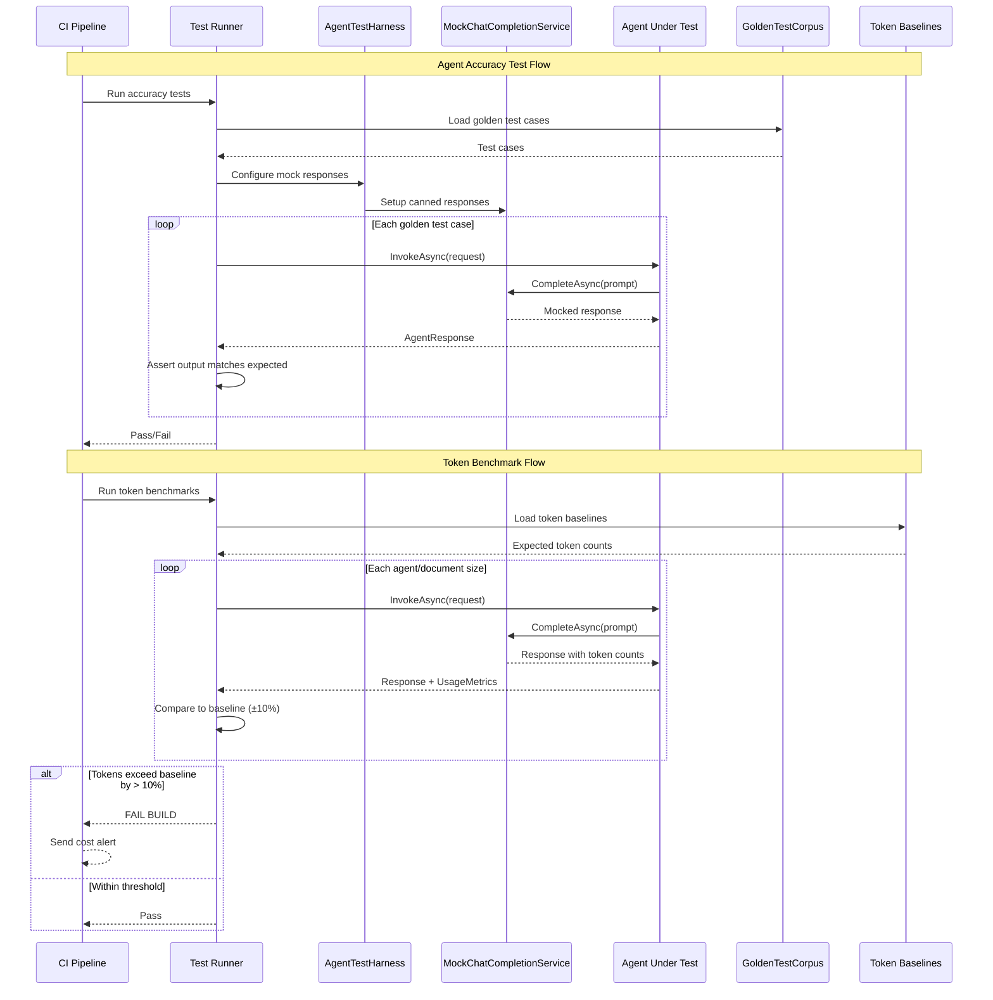

# LCS-SBD-078: Scope Breakdown — The Hardening (Agent Testing)

## Document Control

| Field            | Value                                    |
| :--------------- | :--------------------------------------- |
| **Document ID**  | LCS-SBD-078                              |
| **Version**      | v0.7.8                                   |
| **Codename**     | The Hardening (Agent Testing)            |
| **Status**       | Draft                                    |
| **Last Updated** | 2026-01-27                               |
| **Owner**        | Lead Architect                           |
| **Depends On**   | v0.7.1 (Agent Registry), v0.7.2 (Context Assembler), v0.7.3 (Editor Agent), v0.7.4 (Simplifier), v0.7.5 (Tuning Agent), v0.7.6 (Summarizer), v0.7.7 (Workflows) |

---

## 1. Executive Summary

### 1.1 The Vision

**v0.7.8** delivers the **Hardening (Agent Testing)** — comprehensive test infrastructure for verifying agent accuracy, deterministic testing through LLM mocking, workflow regression prevention, and token cost benchmarking. This release transforms Lexichord's Specialists module from a feature-complete agent platform into a production-hardened system with verified behavior and established cost baselines.

While v0.7.1-v0.7.7 built the specialist agents (Editor, Simplifier, Tuning, Summarizer) and workflow orchestration, the Hardening phase ensures these agents produce accurate, predictable results through rigorous testing. The Agent Accuracy Corpus provides golden test cases that verify each specialist performs as documented. LLM Response Mocking enables deterministic testing without live API calls. Workflow Regression Tests guard against pipeline breakages. Token Benchmarks establish cost tracking to prevent budget overruns in production.

### 1.2 Business Value

- **Agent Confidence:** Verified accuracy against curated golden test cases ensures specialists perform as documented.
- **Deterministic Testing:** Mock LLM providers enable fast, repeatable tests without API costs or rate limits.
- **Regression Prevention:** CI failures prevent agent accuracy degradation and workflow breakages before release.
- **Cost Control:** Token benchmarks establish baselines for cost estimation and budget alerts.
- **Quality Assurance:** Enterprise customers require verified, tested agent behavior for compliance use cases.
- **Foundation:** Establishes testing patterns for all future agent development.

### 1.3 Success Criteria

This release succeeds when:

1. Agent Accuracy Corpus contains 50+ golden test cases per specialist (Editor, Simplifier, Tuning, Summarizer).
2. LLM Response Mocking enables 100% deterministic test execution without live API calls.
3. Workflow Regression Tests verify all built-in workflows complete successfully with expected outputs.
4. Token Benchmarks establish baselines for all agent operations with < 10% variance alerts.
5. All tests integrate into CI/CD pipeline with automatic failure on regression.

### 1.4 License Gating

The Hardening is a **Core** feature. Testing infrastructure is available to all license tiers:

- Test suites run during development and CI/CD for all builds
- No runtime license checks required (test code, not production feature)
- Test results contribute to quality metrics across all license tiers

---

## 2. Dependencies on Prior Versions

| Component                  | Source Version | Usage in v0.7.8                                   |
| :------------------------- | :------------- | :------------------------------------------------ |
| `IAgent`                   | v0.6.6a        | Base agent interface under test                   |
| `IAgentRegistry`           | v0.7.1b        | Agent discovery for test setup                    |
| `AgentConfiguration`       | v0.7.1a        | Agent config model for test fixtures              |
| `IContextOrchestrator`     | v0.7.2c        | Context assembly under test                       |
| `EditorAgent`              | v0.7.3b        | Editor specialist under test                      |
| `IEditSuggestionParser`    | v0.7.3c        | Edit parsing under test                           |
| `SimplifierAgent`          | v0.7.4b        | Simplifier specialist under test                  |
| `TuningAgent`              | v0.7.5b        | Tuning specialist under test                      |
| `SummarizerAgent`          | v0.7.6b        | Summarizer specialist under test                  |
| `IWorkflowEngine`          | v0.7.7b        | Workflow orchestration under test                 |
| `AgentWorkflow`            | v0.7.7a        | Workflow definition model                         |
| `IChatCompletionService`   | v0.6.1a        | LLM service to mock                               |
| `IPromptRenderer`          | v0.6.3b        | Prompt rendering under test                       |
| `UsageMetrics`             | v0.6.1c        | Token usage tracking                              |
| `ILinterBridge`            | v0.7.5a        | Linter integration for tuning tests               |
| `IVoiceMetricsService`     | v0.3.3a        | Readability for simplifier tests                  |

---

## 3. Sub-Part Specifications

### 3.1 v0.7.8a: Agent Accuracy Corpus

| Field            | Value                                     |
| :--------------- | :---------------------------------------- |
| **Sub-Part ID**  | TST-078a                                  |
| **Title**        | Agent Accuracy Corpus (Golden Test Cases) |
| **Module**       | `Lexichord.Tests.Agents`                  |
| **License Tier** | Core                                      |

**Goal:** Create a curated corpus of golden test cases that verify each specialist agent produces accurate, expected outputs for known inputs.

**Key Deliverables:**

- `EditorAgentAccuracyTests.cs` with 50+ grammar/clarity test cases
- `SimplifierAgentAccuracyTests.cs` with 50+ readability improvement cases
- `TuningAgentAccuracyTests.cs` with 50+ style violation resolution cases
- `SummarizerAgentAccuracyTests.cs` with 50+ metadata generation cases
- `GoldenTestCorpus.cs` fixture with categorized input/output pairs
- Test categorization by task type, difficulty, and edge case
- Human-validated expected outputs for all test cases

**Key Interfaces:**

```csharp
namespace Lexichord.Tests.Agents.Fixtures;

/// <summary>
/// A golden test case with known input and expected output.
/// All outputs are human-validated for accuracy.
/// </summary>
public record GoldenTestCase(
    string TestId,
    string Category,
    string Description,
    string InputText,
    string ExpectedOutputPattern,
    IReadOnlyDictionary<string, object>? Context = null,
    GoldenTestDifficulty Difficulty = GoldenTestDifficulty.Standard
);

public enum GoldenTestDifficulty
{
    Simple,     // Basic cases, single issue
    Standard,   // Normal complexity
    Complex,    // Multiple issues, edge cases
    Adversarial // Designed to trip up the agent
}

/// <summary>
/// Repository of golden test cases for each agent.
/// </summary>
public static class GoldenTestCorpus
{
    public static IReadOnlyList<GoldenTestCase> EditorCases { get; }
    public static IReadOnlyList<GoldenTestCase> SimplifierCases { get; }
    public static IReadOnlyList<GoldenTestCase> TuningCases { get; }
    public static IReadOnlyList<GoldenTestCase> SummarizerCases { get; }
}
```

**Golden Test Categories:**

```text
EDITOR AGENT TEST CATEGORIES:
+-- Grammar
|   +-- Subject-verb agreement
|   +-- Tense consistency
|   +-- Punctuation errors
|   +-- Article usage (a/an/the)
+-- Clarity
|   +-- Ambiguous pronouns
|   +-- Run-on sentences
|   +-- Dangling modifiers
|   +-- Wordiness
+-- Structure
|   +-- Paragraph transitions
|   +-- Logical flow
|   +-- Topic sentences
+-- Edge Cases
    +-- Technical jargon (preserve)
    +-- Code snippets (preserve)
    +-- Proper nouns (preserve)

SIMPLIFIER AGENT TEST CATEGORIES:
+-- Readability
|   +-- Grade level reduction (14 -> 8)
|   +-- Sentence length reduction
|   +-- Passive to active conversion
+-- Jargon
|   +-- Technical term simplification
|   +-- Acronym expansion
|   +-- Domain-specific vocabulary
+-- Audience
|   +-- General public
|   +-- ESL readers
|   +-- Executive summary
+-- Edge Cases
    +-- Preserve technical accuracy
    +-- Preserve key terminology
    +-- Numeric data integrity

TUNING AGENT TEST CATEGORIES:
+-- Style Rules
|   +-- Banned word replacement
|   +-- Preferred terminology
|   +-- Voice consistency
|   +-- Formatting standards
+-- Multi-violation
|   +-- Documents with 5+ violations
|   +-- Overlapping violations
|   +-- Conflicting rules
+-- Edge Cases
    +-- Minimal changes required
    +-- Context-dependent fixes

SUMMARIZER AGENT TEST CATEGORIES:
+-- Summaries
|   +-- One-liner generation
|   +-- Abstract generation
|   +-- Key points extraction
+-- Metadata
|   +-- Tag suggestions
|   +-- Audience detection
|   +-- Reading time estimation
+-- Edge Cases
    +-- Very short documents
    +-- Very long documents
    +-- Technical content
```

**Dependencies:**

- v0.7.3b: `EditorAgent` (agent under test)
- v0.7.4b: `SimplifierAgent` (agent under test)
- v0.7.5b: `TuningAgent` (agent under test)
- v0.7.6b: `SummarizerAgent` (agent under test)

---

### 3.2 v0.7.8b: LLM Response Mocking

| Field            | Value                                     |
| :--------------- | :---------------------------------------- |
| **Sub-Part ID**  | TST-078b                                  |
| **Title**        | LLM Response Mocking (Deterministic Tests)|
| **Module**       | `Lexichord.Tests.Agents`                  |
| **License Tier** | Core                                      |

**Goal:** Create mock LLM providers that return pre-defined responses for deterministic testing without live API calls or token costs.

**Key Deliverables:**

- `MockChatCompletionService.cs` implementing `IChatCompletionService`
- `MockResponseRepository.cs` for storing/retrieving canned responses
- `AgentTestHarness.cs` for simplified agent testing setup
- Response recording capability for capturing live responses
- Prompt matching strategies (exact, pattern, semantic)
- Token usage simulation for cost testing

**Key Interfaces:**

```csharp
namespace Lexichord.Tests.Agents.Mocking;

/// <summary>
/// Mock implementation of IChatCompletionService for deterministic testing.
/// Returns pre-configured responses based on prompt matching.
/// </summary>
public class MockChatCompletionService : IChatCompletionService
{
    private readonly List<MockResponseEntry> _responses = new();
    private readonly List<ChatRequest> _capturedRequests = new();

    /// <summary>
    /// Configure a mock response for a specific prompt pattern.
    /// </summary>
    public MockChatCompletionService WithResponse(
        Func<ChatRequest, bool> matcher,
        ChatResponse response)
    {
        _responses.Add(new MockResponseEntry(matcher, response));
        return this;
    }

    /// <summary>
    /// Configure a mock response using exact prompt matching.
    /// </summary>
    public MockChatCompletionService WithExactResponse(
        string promptContains,
        string responseContent,
        int promptTokens = 100,
        int completionTokens = 50)
    {
        return WithResponse(
            r => r.Messages.Any(m => m.Content.Contains(promptContains)),
            new ChatResponse(
                Content: responseContent,
                FinishReason: FinishReason.Stop,
                PromptTokens: promptTokens,
                CompletionTokens: completionTokens
            ));
    }

    /// <summary>
    /// Get all captured requests for assertion.
    /// </summary>
    public IReadOnlyList<ChatRequest> CapturedRequests => _capturedRequests;

    public Task<ChatResponse> CompleteAsync(
        ChatRequest request,
        CancellationToken ct = default)
    {
        _capturedRequests.Add(request);

        var entry = _responses.FirstOrDefault(r => r.Matcher(request));
        if (entry is null)
        {
            throw new InvalidOperationException(
                $"No mock response configured for prompt: {request.Messages.Last().Content[..100]}...");
        }

        return Task.FromResult(entry.Response);
    }

    public IAsyncEnumerable<ChatResponseChunk> CompleteStreamingAsync(
        ChatRequest request,
        CancellationToken ct = default)
    {
        // Return single chunk for simplicity
        return AsyncEnumerable.Single(new ChatResponseChunk(
            Content: CompleteAsync(request, ct).Result.Content,
            IsComplete: true
        ));
    }
}

internal record MockResponseEntry(
    Func<ChatRequest, bool> Matcher,
    ChatResponse Response);

/// <summary>
/// Test harness for simplified agent testing.
/// </summary>
public class AgentTestHarness
{
    private readonly MockChatCompletionService _mockLlm;
    private readonly ServiceProvider _services;
    private readonly List<ChatRequest> _sentPrompts = new();

    public AgentTestHarness()
    {
        _mockLlm = new MockChatCompletionService();
        _services = BuildTestServices();
    }

    /// <summary>
    /// Configure mock LLM responses.
    /// </summary>
    public AgentTestHarness WithMockLLM(
        Func<ChatRequest, ChatResponse> responseFactory)
    {
        _mockLlm.WithResponse(_ => true, responseFactory(null!));
        return this;
    }

    /// <summary>
    /// Configure a specific mock response.
    /// </summary>
    public AgentTestHarness WithResponse(
        string promptContains,
        string response)
    {
        _mockLlm.WithExactResponse(promptContains, response);
        return this;
    }

    /// <summary>
    /// Configure context variables for the test.
    /// </summary>
    public AgentTestHarness WithContext(
        IDictionary<string, object> context)
    {
        // Store context for injection
        return this;
    }

    /// <summary>
    /// Invoke an agent and get the response.
    /// </summary>
    public async Task<AgentResponse> InvokeAsync(
        IAgent agent,
        AgentRequest request)
    {
        return await agent.InvokeAsync(request, CancellationToken.None);
    }

    /// <summary>
    /// Assert that the generated prompt contains expected text.
    /// </summary>
    public void AssertPromptContains(string expectedText)
    {
        var lastRequest = _mockLlm.CapturedRequests.Last();
        var fullPrompt = string.Join("\n", lastRequest.Messages.Select(m => m.Content));
        fullPrompt.Should().Contain(expectedText);
    }

    /// <summary>
    /// Assert that token usage is under a threshold.
    /// </summary>
    public void AssertTokensUnder(int maxTokens)
    {
        var lastRequest = _mockLlm.CapturedRequests.Last();
        var estimatedTokens = EstimateTokens(lastRequest);
        estimatedTokens.Should().BeLessThan(maxTokens);
    }

    /// <summary>
    /// Get all captured prompts for inspection.
    /// </summary>
    public IReadOnlyList<string> GetCapturedPrompts()
    {
        return _mockLlm.CapturedRequests
            .Select(r => string.Join("\n", r.Messages.Select(m => m.Content)))
            .ToList();
    }
}
```

**Response Recording for Test Generation:**

```csharp
/// <summary>
/// Records live LLM responses for later use as mock fixtures.
/// Use during development to capture real responses.
/// </summary>
public class ResponseRecorder : IChatCompletionService
{
    private readonly IChatCompletionService _inner;
    private readonly string _outputPath;
    private readonly List<RecordedExchange> _exchanges = new();

    public ResponseRecorder(IChatCompletionService inner, string outputPath)
    {
        _inner = inner;
        _outputPath = outputPath;
    }

    public async Task<ChatResponse> CompleteAsync(
        ChatRequest request,
        CancellationToken ct = default)
    {
        var response = await _inner.CompleteAsync(request, ct);

        _exchanges.Add(new RecordedExchange(
            Request: request,
            Response: response,
            Timestamp: DateTimeOffset.UtcNow
        ));

        return response;
    }

    public async Task SaveRecordingsAsync()
    {
        var json = JsonSerializer.Serialize(_exchanges, new JsonSerializerOptions
        {
            WriteIndented = true
        });
        await File.WriteAllTextAsync(_outputPath, json);
    }
}

public record RecordedExchange(
    ChatRequest Request,
    ChatResponse Response,
    DateTimeOffset Timestamp);
```

**Dependencies:**

- v0.6.1a: `IChatCompletionService` (interface to mock)
- v0.6.1c: `ChatRequest`, `ChatResponse` (models)

---

### 3.3 v0.7.8c: Workflow Regression Tests

| Field            | Value                                     |
| :--------------- | :---------------------------------------- |
| **Sub-Part ID**  | TST-078c                                  |
| **Title**        | Workflow Regression Tests (Pipeline Verification) |
| **Module**       | `Lexichord.Tests.Agents`                  |
| **License Tier** | Core                                      |

**Goal:** Create comprehensive tests that verify multi-agent workflows execute correctly and produce expected outputs at each step.

**Key Deliverables:**

- `WorkflowEngineTests.cs` for workflow orchestration tests
- `BuiltInWorkflowTests.cs` for pre-defined workflow verification
- `WorkflowStepTests.cs` for individual step execution tests
- `WorkflowConditionTests.cs` for conditional logic tests
- `WorkflowErrorHandlingTests.cs` for failure scenario tests
- Workflow output snapshot comparison

**Key Test Scenarios:**

```csharp
namespace Lexichord.Tests.Agents.Workflows;

[Trait("Category", "Unit")]
[Trait("Version", "v0.7.8c")]
public class WorkflowEngineTests
{
    private readonly AgentTestHarness _harness;
    private readonly IWorkflowEngine _sut;

    public WorkflowEngineTests()
    {
        _harness = new AgentTestHarness();
        _sut = _harness.GetService<IWorkflowEngine>();
    }

    #region Sequential Execution Tests

    [Fact]
    public async Task Execute_TwoStepWorkflow_InvokesAgentsInOrder()
    {
        // Arrange
        var invokedAgents = new List<string>();
        _harness.WithMockLLM(request =>
        {
            var agentId = ExtractAgentIdFromPrompt(request);
            invokedAgents.Add(agentId);
            return new ChatResponse($"Mock response from {agentId}", ...);
        });

        var workflow = new AgentWorkflow(
            WorkflowId: "test-sequential",
            Name: "Sequential Test",
            Description: "Tests sequential execution",
            Steps: new[]
            {
                new WorkflowStep("step1", "editor", ...),
                new WorkflowStep("step2", "simplifier", ...)
            },
            Trigger: WorkflowTrigger.Manual
        );

        // Act
        var result = await _sut.ExecuteAsync(
            workflow,
            new WorkflowContext("test.md", null, new Dictionary<string, object>()),
            CancellationToken.None);

        // Assert
        result.Success.Should().BeTrue();
        result.StepResults.Should().HaveCount(2);
        invokedAgents.Should().Equal("editor", "simplifier");
    }

    [Fact]
    public async Task Execute_WorkflowWithOutputMapping_PassesDataBetweenSteps()
    {
        // Arrange
        _harness
            .WithResponse("editor", """{"suggestions": ["fix comma"]}""")
            .WithResponse("simplifier", "Simplified text");

        var workflow = new AgentWorkflow(
            WorkflowId: "test-mapping",
            Name: "Output Mapping Test",
            Steps: new[]
            {
                new WorkflowStep(
                    StepId: "edit",
                    AgentId: "editor",
                    OutputMappings: new Dictionary<string, string>
                    {
                        ["edit_suggestions"] = "$.suggestions"
                    }),
                new WorkflowStep(
                    StepId: "simplify",
                    AgentId: "simplifier",
                    InputMappings: new Dictionary<string, string>
                    {
                        ["previous_suggestions"] = "edit_suggestions"
                    })
            },
            Trigger: WorkflowTrigger.Manual
        );

        // Act
        var result = await _sut.ExecuteAsync(workflow, ...);

        // Assert
        var simplifyStep = result.StepResults[1];
        simplifyStep.InputContext.Should().ContainKey("previous_suggestions");
    }

    #endregion

    #region Conditional Execution Tests

    [Fact]
    public async Task Execute_StepWithFalseCondition_SkipsStep()
    {
        // Arrange
        _harness.WithMockLLM(_ => new ChatResponse("Mock", ...));

        var workflow = new AgentWorkflow(
            WorkflowId: "test-condition",
            Name: "Conditional Test",
            Steps: new[]
            {
                new WorkflowStep("step1", "editor"),
                new WorkflowStep(
                    StepId: "step2",
                    AgentId: "tuning",
                    Condition: new WorkflowStepCondition("violations.Count > 0"))
            },
            Trigger: WorkflowTrigger.Manual
        );

        var context = new WorkflowContext(
            "test.md",
            null,
            new Dictionary<string, object>
            {
                ["violations"] = new List<object>() // Empty = condition false
            });

        // Act
        var result = await _sut.ExecuteAsync(workflow, context, CancellationToken.None);

        // Assert
        result.StepResults.Should().HaveCount(2);
        result.StepResults[0].Status.Should().Be(WorkflowStepStatus.Completed);
        result.StepResults[1].Status.Should().Be(WorkflowStepStatus.Skipped);
    }

    [Fact]
    public async Task Execute_StepWithTrueCondition_ExecutesStep()
    {
        // Arrange
        _harness.WithMockLLM(_ => new ChatResponse("Fixed violations", ...));

        var workflow = new AgentWorkflow(
            WorkflowId: "test-condition-true",
            Name: "Conditional True Test",
            Steps: new[]
            {
                new WorkflowStep(
                    StepId: "tune",
                    AgentId: "tuning",
                    Condition: new WorkflowStepCondition("violations.Count > 0"))
            },
            Trigger: WorkflowTrigger.Manual
        );

        var context = new WorkflowContext(
            "test.md",
            null,
            new Dictionary<string, object>
            {
                ["violations"] = new List<object> { new { RuleId = "rule1" } }
            });

        // Act
        var result = await _sut.ExecuteAsync(workflow, context, CancellationToken.None);

        // Assert
        result.StepResults[0].Status.Should().Be(WorkflowStepStatus.Completed);
    }

    #endregion

    #region Error Handling Tests

    [Fact]
    public async Task Execute_StepThrowsException_AbortsWorkflow()
    {
        // Arrange
        _harness.WithMockLLM(_ => throw new InvalidOperationException("LLM error"));

        var workflow = new AgentWorkflow(
            WorkflowId: "test-error",
            Name: "Error Test",
            Steps: new[]
            {
                new WorkflowStep("step1", "editor"),
                new WorkflowStep("step2", "simplifier")
            },
            Trigger: WorkflowTrigger.Manual
        );

        // Act
        var result = await _sut.ExecuteAsync(workflow, ...);

        // Assert
        result.Success.Should().BeFalse();
        result.StepResults[0].Status.Should().Be(WorkflowStepStatus.Failed);
        result.StepResults[0].Error.Should().NotBeNull();
    }

    [Fact]
    public async Task Execute_StepTimeout_FailsWithTimeoutError()
    {
        // Arrange
        _harness.WithMockLLM(async _ =>
        {
            await Task.Delay(TimeSpan.FromMinutes(2)); // Exceeds timeout
            return new ChatResponse("Delayed", ...);
        });

        var workflow = CreateWorkflowWithTimeout(TimeSpan.FromSeconds(5));

        // Act
        var result = await _sut.ExecuteAsync(workflow, ...);

        // Assert
        result.Success.Should().BeFalse();
        result.StepResults[0].Error.Should().Contain("timeout");
    }

    #endregion

    #region Token Aggregation Tests

    [Fact]
    public async Task Execute_MultiStepWorkflow_AggregatesTokenUsage()
    {
        // Arrange
        _harness
            .WithResponse("editor", "Edit response", promptTokens: 100, completionTokens: 50)
            .WithResponse("simplifier", "Simplify response", promptTokens: 150, completionTokens: 75);

        var workflow = CreateTwoStepWorkflow("editor", "simplifier");

        // Act
        var result = await _sut.ExecuteAsync(workflow, ...);

        // Assert
        result.TotalUsage.PromptTokens.Should().Be(250);    // 100 + 150
        result.TotalUsage.CompletionTokens.Should().Be(125); // 50 + 75
    }

    #endregion
}
```

**Built-In Workflow Tests:**

```csharp
[Trait("Category", "Unit")]
[Trait("Version", "v0.7.8c")]
public class BuiltInWorkflowTests
{
    [Fact]
    public async Task FullReviewWorkflow_CompletesAllSteps()
    {
        // Arrange: Load the full-review workflow from YAML
        var workflow = await LoadWorkflow("full-review.yaml");
        var harness = new AgentTestHarness()
            .WithResponse("editor", MockResponses.EditorSuggestions)
            .WithResponse("simplifier", MockResponses.SimplifiedText)
            .WithResponse("tuning", MockResponses.TunedText);

        // Act
        var result = await harness.ExecuteWorkflow(workflow, TestDocuments.ComplexDocument);

        // Assert
        result.Success.Should().BeTrue();
        result.StepResults.Where(s => s.Status == WorkflowStepStatus.Completed)
            .Should().HaveCountGreaterOrEqualTo(1);
    }

    [Fact]
    public async Task QuickEditWorkflow_SkipsTuningWhenNoViolations()
    {
        // Arrange: Document with no style violations
        var workflow = await LoadWorkflow("quick-edit.yaml");
        var harness = new AgentTestHarness()
            .WithResponse("editor", MockResponses.NoSuggestions);

        var context = new WorkflowContext(
            TestDocuments.CleanDocument,
            null,
            new Dictionary<string, object> { ["violations"] = Array.Empty<object>() });

        // Act
        var result = await harness.ExecuteWorkflow(workflow, context);

        // Assert
        var tuningStep = result.StepResults.FirstOrDefault(s => s.StepId == "tune");
        tuningStep?.Status.Should().Be(WorkflowStepStatus.Skipped);
    }
}
```

**Dependencies:**

- v0.7.7a: `AgentWorkflow`, `WorkflowStep` (models under test)
- v0.7.7b: `IWorkflowEngine` (engine under test)
- v0.7.7c: Built-in workflow definitions

---

### 3.4 v0.7.8d: Agent Token Benchmarks

| Field            | Value                                     |
| :--------------- | :---------------------------------------- |
| **Sub-Part ID**  | TST-078d                                  |
| **Title**        | Agent Token Benchmarks (Cost Tracking)    |
| **Module**       | `Lexichord.Tests.Agents`                  |
| **License Tier** | Core                                      |

**Goal:** Establish token usage baselines for all agent operations and integrate with CI to alert on unexpected cost increases.

**Key Deliverables:**

- `AgentTokenBenchmarks.cs` measuring token usage per operation
- `TokenUsageThresholdTests.cs` for CI cost alerts
- `TokenCostCalculator.cs` for cost estimation
- Token baseline JSON files for comparison
- Cost projection reports
- Budget alert integration

**Key Interfaces:**

```csharp
namespace Lexichord.Tests.Agents.Benchmarks;

/// <summary>
/// Token usage metrics for a single agent operation.
/// </summary>
public record TokenUsageRecord(
    string AgentId,
    string OperationType,
    int InputTokens,
    int OutputTokens,
    int TotalTokens,
    decimal EstimatedCost,
    TimeSpan Duration,
    int InputWordCount
);

/// <summary>
/// Calculates estimated costs based on token usage.
/// </summary>
public class TokenCostCalculator
{
    // Pricing per 1K tokens (example: GPT-4o pricing)
    private static readonly Dictionary<string, (decimal Input, decimal Output)> ModelPricing = new()
    {
        ["gpt-4o"] = (0.005m, 0.015m),
        ["gpt-4o-mini"] = (0.00015m, 0.0006m),
        ["claude-3-5-sonnet"] = (0.003m, 0.015m),
    };

    public decimal CalculateCost(string model, int inputTokens, int outputTokens)
    {
        if (!ModelPricing.TryGetValue(model, out var pricing))
            throw new ArgumentException($"Unknown model: {model}");

        return (inputTokens / 1000m * pricing.Input) +
               (outputTokens / 1000m * pricing.Output);
    }

    public TokenBudgetReport GenerateReport(
        IEnumerable<TokenUsageRecord> records,
        decimal budgetLimit)
    {
        var totalCost = records.Sum(r => r.EstimatedCost);
        var byAgent = records.GroupBy(r => r.AgentId)
            .ToDictionary(g => g.Key, g => g.Sum(r => r.EstimatedCost));

        return new TokenBudgetReport(
            TotalCost: totalCost,
            CostByAgent: byAgent,
            BudgetLimit: budgetLimit,
            IsOverBudget: totalCost > budgetLimit,
            ProjectedMonthlyCost: totalCost * 30 // Simple projection
        );
    }
}

public record TokenBudgetReport(
    decimal TotalCost,
    IReadOnlyDictionary<string, decimal> CostByAgent,
    decimal BudgetLimit,
    bool IsOverBudget,
    decimal ProjectedMonthlyCost);
```

**Token Benchmark Tests:**

```csharp
[Trait("Category", "Performance")]
[Trait("Version", "v0.7.8d")]
public class AgentTokenBenchmarks
{
    private readonly AgentTestHarness _harness;
    private readonly TokenCostCalculator _costCalculator;

    public AgentTokenBenchmarks()
    {
        _harness = new AgentTestHarness();
        _costCalculator = new TokenCostCalculator();
    }

    #region Editor Agent Benchmarks

    [Theory]
    [InlineData(100, 200, 350)]     // 100 words -> ~200 input, ~350 output
    [InlineData(500, 800, 1200)]    // 500 words -> ~800 input, ~1200 output
    [InlineData(1000, 1500, 2000)]  // 1000 words -> ~1500 input, ~2000 output
    public async Task EditorAgent_TokenUsage_WithinExpectedRange(
        int wordCount,
        int expectedInputMax,
        int expectedOutputMax)
    {
        // Arrange
        var document = GenerateDocument(wordCount);
        var agent = _harness.GetAgent<EditorAgent>();

        // Act
        var response = await agent.InvokeAsync(
            new AgentRequest("Review for grammar", DocumentPath: "test.md"),
            CancellationToken.None);

        // Assert
        response.Usage.PromptTokens.Should().BeLessThan(expectedInputMax,
            $"Editor prompt for {wordCount} words should use < {expectedInputMax} tokens");
        response.Usage.CompletionTokens.Should().BeLessThan(expectedOutputMax,
            $"Editor response for {wordCount} words should use < {expectedOutputMax} tokens");
    }

    #endregion

    #region Simplifier Agent Benchmarks

    [Theory]
    [InlineData(100, 250, 300)]
    [InlineData(500, 900, 1100)]
    [InlineData(1000, 1600, 1800)]
    public async Task SimplifierAgent_TokenUsage_WithinExpectedRange(
        int wordCount,
        int expectedInputMax,
        int expectedOutputMax)
    {
        var document = GenerateDocument(wordCount);
        var agent = _harness.GetAgent<SimplifierAgent>();

        var response = await agent.InvokeAsync(
            new AgentRequest("Simplify for general audience", DocumentPath: "test.md"),
            CancellationToken.None);

        response.Usage.PromptTokens.Should().BeLessThan(expectedInputMax);
        response.Usage.CompletionTokens.Should().BeLessThan(expectedOutputMax);
    }

    #endregion

    #region Workflow Token Benchmarks

    [Fact]
    public async Task FullReviewWorkflow_TokenUsage_WithinBudget()
    {
        // Arrange
        var workflow = await LoadWorkflow("full-review.yaml");
        var document = GenerateDocument(1000); // 1000 word document

        // Expected budget for full review: ~5000 tokens
        const int expectedTotalMax = 5000;
        const decimal expectedCostMax = 0.10m; // $0.10 for GPT-4o

        // Act
        var result = await _harness.ExecuteWorkflow(workflow, document);

        // Assert
        var totalTokens = result.TotalUsage.PromptTokens + result.TotalUsage.CompletionTokens;
        totalTokens.Should().BeLessThan(expectedTotalMax,
            "Full review workflow should use < 5000 total tokens");

        var cost = _costCalculator.CalculateCost(
            "gpt-4o",
            result.TotalUsage.PromptTokens,
            result.TotalUsage.CompletionTokens);
        cost.Should().BeLessThan(expectedCostMax,
            "Full review cost should be < $0.10");
    }

    #endregion
}
```

**CI Token Threshold Tests:**

```csharp
[Trait("Category", "Performance")]
[Trait("Version", "v0.7.8d")]
public class TokenUsageThresholdTests
{
    /// <summary>
    /// CI fails if any agent exceeds its baseline by more than 10%.
    /// </summary>
    [Theory]
    [MemberData(nameof(TokenBaselines))]
    public async Task Agent_TokenUsage_WithinBaselineThreshold(
        string agentId,
        int inputWords,
        int baselineTokens)
    {
        // Arrange
        var harness = new AgentTestHarness();
        var agent = harness.GetAgent(agentId);
        var document = GenerateDocument(inputWords);

        // Act
        var response = await agent.InvokeAsync(
            new AgentRequest("Standard operation", DocumentPath: "test.md"),
            CancellationToken.None);

        // Assert: Allow 10% variance
        var totalTokens = response.Usage.PromptTokens + response.Usage.CompletionTokens;
        var threshold = baselineTokens * 1.10;

        totalTokens.Should().BeLessThan((int)threshold,
            $"Agent '{agentId}' exceeded baseline by > 10%: " +
            $"actual={totalTokens}, baseline={baselineTokens}, threshold={threshold}");
    }

    public static IEnumerable<object[]> TokenBaselines => new[]
    {
        new object[] { "editor", 500, 2000 },
        new object[] { "simplifier", 500, 2100 },
        new object[] { "tuning", 500, 1800 },
        new object[] { "summarizer", 500, 1500 },
    };

    /// <summary>
    /// Alert if monthly projected cost exceeds budget.
    /// </summary>
    [Fact]
    public void ProjectedMonthlyCost_UnderBudget()
    {
        // Arrange: Load recent usage data
        var recentUsage = LoadRecentUsageMetrics();
        var calculator = new TokenCostCalculator();

        // Monthly budget limit
        const decimal monthlyBudget = 100.00m;

        // Act
        var report = calculator.GenerateReport(recentUsage, monthlyBudget);

        // Assert
        report.IsOverBudget.Should().BeFalse(
            $"Projected monthly cost ${report.ProjectedMonthlyCost:F2} exceeds budget ${monthlyBudget:F2}");
    }
}
```

**Token Baseline Configuration:**

```json
{
  "baselines": {
    "editor": {
      "100_words": { "input": 200, "output": 350 },
      "500_words": { "input": 800, "output": 1200 },
      "1000_words": { "input": 1500, "output": 2000 }
    },
    "simplifier": {
      "100_words": { "input": 250, "output": 300 },
      "500_words": { "input": 900, "output": 1100 },
      "1000_words": { "input": 1600, "output": 1800 }
    },
    "tuning": {
      "100_words": { "input": 180, "output": 250 },
      "500_words": { "input": 700, "output": 900 },
      "1000_words": { "input": 1300, "output": 1500 }
    },
    "summarizer": {
      "100_words": { "input": 150, "output": 200 },
      "500_words": { "input": 600, "output": 800 },
      "1000_words": { "input": 1100, "output": 1400 }
    }
  },
  "pricing": {
    "gpt-4o": { "input_per_1k": 0.005, "output_per_1k": 0.015 },
    "gpt-4o-mini": { "input_per_1k": 0.00015, "output_per_1k": 0.0006 }
  },
  "budget": {
    "daily_limit": 5.00,
    "monthly_limit": 100.00,
    "alert_threshold": 0.80
  }
}
```

**Dependencies:**

- v0.6.1c: `UsageMetrics` (token tracking)
- All agent implementations (v0.7.3-v0.7.6)
- v0.7.7b: `IWorkflowEngine` (workflow cost tracking)

---

## 4. Implementation Checklist

| #  | Sub-Part | Task                                                      | Est. Hours |
| :- | :------- | :-------------------------------------------------------- | :--------- |
| 1  | v0.7.8a  | Create `GoldenTestCorpus.cs` fixture structure            | 2          |
| 2  | v0.7.8a  | Create `EditorAgentAccuracyTests.cs` with 50 cases        | 4          |
| 3  | v0.7.8a  | Create `SimplifierAgentAccuracyTests.cs` with 50 cases    | 4          |
| 4  | v0.7.8a  | Create `TuningAgentAccuracyTests.cs` with 50 cases        | 4          |
| 5  | v0.7.8a  | Create `SummarizerAgentAccuracyTests.cs` with 50 cases    | 4          |
| 6  | v0.7.8a  | Human validation of all golden test cases                 | 4          |
| 7  | v0.7.8b  | Create `MockChatCompletionService.cs`                     | 3          |
| 8  | v0.7.8b  | Create `AgentTestHarness.cs`                              | 3          |
| 9  | v0.7.8b  | Create `MockResponseRepository.cs`                        | 2          |
| 10 | v0.7.8b  | Create `ResponseRecorder.cs` for test generation          | 2          |
| 11 | v0.7.8b  | Implement prompt matching strategies                      | 2          |
| 12 | v0.7.8c  | Create `WorkflowEngineTests.cs`                           | 3          |
| 13 | v0.7.8c  | Create `BuiltInWorkflowTests.cs`                          | 2          |
| 14 | v0.7.8c  | Create `WorkflowConditionTests.cs`                        | 2          |
| 15 | v0.7.8c  | Create `WorkflowErrorHandlingTests.cs`                    | 2          |
| 16 | v0.7.8c  | Create workflow output snapshot fixtures                  | 1          |
| 17 | v0.7.8d  | Create `TokenCostCalculator.cs`                           | 2          |
| 18 | v0.7.8d  | Create `AgentTokenBenchmarks.cs`                          | 3          |
| 19 | v0.7.8d  | Create `TokenUsageThresholdTests.cs`                      | 2          |
| 20 | v0.7.8d  | Create token baseline JSON files                          | 1          |
| 21 | v0.7.8d  | Configure CI pipeline for cost alerts                     | 1          |
| 22 | All      | Create test project structure                             | 1          |
| 23 | All      | Configure test categories and traits                      | 0.5        |
| 24 | All      | DI registration for test services                         | 0.5        |
| **Total** |   |                                                           | **55 hours** |

---

## 5. Dependency Matrix

### 5.1 Required Interfaces (from earlier versions)

| Interface                  | Source Version | Purpose                              |
| :------------------------- | :------------- | :----------------------------------- |
| `IAgent`                   | v0.6.6a        | Base agent interface                 |
| `IChatCompletionService`   | v0.6.1a        | LLM service to mock                  |
| `IAgentRegistry`           | v0.7.1b        | Agent discovery                      |
| `IWorkflowEngine`          | v0.7.7b        | Workflow orchestration               |
| `EditorAgent`              | v0.7.3b        | Specialist under test                |
| `SimplifierAgent`          | v0.7.4b        | Specialist under test                |
| `TuningAgent`              | v0.7.5b        | Specialist under test                |
| `SummarizerAgent`          | v0.7.6b        | Specialist under test                |

### 5.2 New Interfaces (defined in v0.7.8)

| Interface                   | Defined In | Module        | Purpose                 |
| :-------------------------- | :--------- | :------------ | :---------------------- |
| `MockChatCompletionService` | v0.7.8b    | Tests.Agents  | Deterministic testing   |
| `AgentTestHarness`          | v0.7.8b    | Tests.Agents  | Simplified test setup   |
| `TokenCostCalculator`       | v0.7.8d    | Tests.Agents  | Cost estimation         |

### 5.3 New Records/DTOs (defined in v0.7.8)

| Record                     | Defined In | Purpose                                |
| :------------------------- | :--------- | :------------------------------------- |
| `GoldenTestCase`           | v0.7.8a    | Golden test case definition            |
| `MockResponseEntry`        | v0.7.8b    | Mock response configuration            |
| `RecordedExchange`         | v0.7.8b    | Recorded LLM exchange                  |
| `TokenUsageRecord`         | v0.7.8d    | Token usage metrics                    |
| `TokenBudgetReport`        | v0.7.8d    | Cost projection report                 |

### 5.4 NuGet Packages

| Package          | Version | Purpose                    | New/Existing |
| :--------------- | :------ | :------------------------- | :----------- |
| `xunit`          | 2.9.x   | Test framework             | Existing     |
| `FluentAssertions` | 6.x   | Test assertions            | Existing     |
| `Moq`            | 4.x     | Mocking framework          | Existing     |
| `Verify.Xunit`   | 26.x    | Snapshot testing           | **New**      |

---

## 6. Architecture Diagram

```mermaid
graph TB
    subgraph "Lexichord.Tests.Agents"
        subgraph "v0.7.8a: Accuracy Corpus"
            GT[GoldenTestCorpus]
            EA[EditorAgentAccuracyTests]
            SA[SimplifierAgentAccuracyTests]
            TA[TuningAgentAccuracyTests]
            SUA[SummarizerAgentAccuracyTests]
        end

        subgraph "v0.7.8b: LLM Mocking"
            MC[MockChatCompletionService]
            TH[AgentTestHarness]
            MR[MockResponseRepository]
            RR[ResponseRecorder]
        end

        subgraph "v0.7.8c: Workflow Tests"
            WE[WorkflowEngineTests]
            BW[BuiltInWorkflowTests]
            WC[WorkflowConditionTests]
            WER[WorkflowErrorHandlingTests]
        end

        subgraph "v0.7.8d: Token Benchmarks"
            TC[TokenCostCalculator]
            TB[AgentTokenBenchmarks]
            TT[TokenUsageThresholdTests]
            BL[Baseline JSON]
        end
    end

    subgraph "Systems Under Test (Prior Versions)"
        ED[EditorAgent<br/>v0.7.3b]
        SI[SimplifierAgent<br/>v0.7.4b]
        TU[TuningAgent<br/>v0.7.5b]
        SU[SummarizerAgent<br/>v0.7.6b]
        WF[WorkflowEngine<br/>v0.7.7b]
        LLM[IChatCompletionService<br/>v0.6.1a]
    end

    subgraph "CI/CD Pipeline"
        CI[CI Runner]
        REP[Test Reports]
        COST[Cost Alerts]
    end

    EA --> ED
    SA --> SI
    TA --> TU
    SUA --> SU

    EA --> GT
    SA --> GT
    TA --> GT
    SUA --> GT

    TH --> MC
    EA --> TH
    SA --> TH
    TA --> TH
    SUA --> TH

    MC -.->|Mocks| LLM

    WE --> WF
    BW --> WF
    WC --> WF
    WER --> WF

    TB --> TC
    TT --> TC
    TT --> BL

    CI --> EA
    CI --> SA
    CI --> TA
    CI --> SUA
    CI --> WE
    CI --> TB
    CI --> TT
    CI --> REP
    CI --> COST

    style EA fill:#4a9eff,color:#fff
    style SA fill:#4a9eff,color:#fff
    style TA fill:#4a9eff,color:#fff
    style SUA fill:#4a9eff,color:#fff
    style MC fill:#10b981,color:#fff
    style TH fill:#10b981,color:#fff
    style WE fill:#8b5cf6,color:#fff
    style BW fill:#8b5cf6,color:#fff
    style TB fill:#f97316,color:#fff
    style TT fill:#f97316,color:#fff
```



---

## 7. Data Flow Diagram



---

## 8. Risks & Mitigations

| Risk | Impact | Probability | Mitigation |
| :--- | :----- | :---------- | :--------- |
| Golden test cases become stale | Medium | Medium | Regular review and update cycle; version control |
| Mock responses don't match real LLM behavior | High | Medium | Record real responses periodically; validate mocks |
| Token baselines vary by model version | Medium | High | Baseline per model version; alert on model changes |
| Cost projections inaccurate | Medium | Low | Use actual API pricing; update quarterly |
| Workflow tests don't cover all paths | Medium | Medium | Coverage reporting; require path coverage |
| Test execution time becomes slow | Low | Medium | Parallel execution; mock-only in CI |

---

## 9. Success Metrics

| Metric | Target | Measurement |
| :----- | :----- | :---------- |
| Golden test cases per agent | 50+ | Count test methods |
| Mock coverage | 100% | All tests use mocks |
| Workflow path coverage | 90%+ | Condition coverage |
| Token baseline accuracy | ±10% | Baseline comparison |
| Test execution time | < 60s | CI timing |
| Cost alert accuracy | 95%+ | Budget tracking |

---

## 10. What This Enables

After v0.7.8, Lexichord will support:

- **v0.8.x (Advanced Agents):** Confidence in testing patterns enables rapid agent development.

- **v0.9.x (Enterprise):** Compliance certifications require documented, verified agent behavior.

- **v1.0.x (Release):** Production readiness with proven agent accuracy and cost controls.

- **Future:** Token budgeting enables cost alerts and usage limits in production.

---

## 11. Decision Trees

### 11.1 Should a Test Fail CI?

```text
START: "Test failed. Should CI fail?"
|
+-- Is it an accuracy test (golden corpus)?
|   +-- YES -> FAIL CI (agent accuracy regression)
|
+-- Is it a workflow regression test?
|   +-- YES -> FAIL CI (workflow broken)
|
+-- Is it a token threshold test?
|   +-- Exceeded by > 10%?
|   |   +-- YES -> FAIL CI (cost regression)
|   +-- Exceeded by < 10%?
|       +-- NO -> WARNING only (minor variance)
|
+-- Is it a mock setup test?
|   +-- YES -> FAIL CI (test infrastructure broken)
|
+-- DEFAULT: FAIL CI
```

### 11.2 When to Update Token Baselines

```text
START: "Token usage changed. Update baseline?"
|
+-- Is usage LOWER than baseline?
|   +-- YES -> Update baseline (improvement)
|
+-- Is usage HIGHER but within 10%?
|   +-- YES -> NO UPDATE (acceptable variance)
|
+-- Is usage HIGHER by > 10%?
|   +-- Is change intentional (new features)?
|   |   +-- YES -> Update baseline with documentation
|   +-- Is change unintentional?
|       +-- YES -> INVESTIGATE before updating
|
+-- DEFAULT: NO UPDATE
```

---

## 12. User Stories

| ID    | Role            | Story                                                                                | Acceptance Criteria                    |
| :---- | :-------------- | :----------------------------------------------------------------------------------- | :------------------------------------- |
| US-01 | Developer       | As a developer, I want deterministic tests so I can verify agent behavior without API calls. | Tests run with mocks, no network calls. |
| US-02 | Developer       | As a developer, I want golden test cases so I can verify agent accuracy.             | 50+ test cases per agent pass.         |
| US-03 | QA Engineer     | As a QA engineer, I want workflow tests so I can verify pipelines work correctly.    | All built-in workflows tested.         |
| US-04 | Product Owner   | As a product owner, I want token benchmarks so I can control costs.                  | Cost alerts trigger at 80% budget.     |
| US-05 | Enterprise User | As an enterprise user, I need verified agent accuracy for compliance.                | Test reports available for audit.      |
| US-06 | DevOps          | As a DevOps engineer, I want CI integration so regressions are caught automatically. | CI fails on accuracy/cost regression.  |

---

## 13. Use Cases

### UC-01: CI Pipeline Runs Agent Tests

**Preconditions:**

- Developer pushes code to repository
- CI pipeline triggers

**Flow:**

1. CI checks out code.
2. CI runs `dotnet test --filter "Category=Unit&Version~v0.7.8"`.
3. Accuracy tests execute with mock LLM responses.
4. Results compared to golden corpus expectations.
5. CI runs `dotnet test --filter "Category=Performance&Version~v0.7.8"`.
6. Token usage compared to baseline thresholds.
7. CI reports pass/fail status.

**Postconditions:**

- Build marked as pass (all tests green) or fail (regressions detected).

---

### UC-02: Recording New Golden Test Cases

**Preconditions:**

- New agent capability added
- Need to capture expected behavior

**Flow:**

1. Developer configures `ResponseRecorder` with live LLM.
2. Developer invokes agent with test inputs.
3. Recorder captures request/response pairs.
4. Developer reviews and validates captured responses.
5. Validated responses added to `GoldenTestCorpus`.
6. Mock tests now use captured responses.

**Postconditions:**

- New golden test cases available for regression testing.

---

### UC-03: Cost Alert Triggered

**Preconditions:**

- Token usage tracking enabled
- Budget threshold configured

**Flow:**

1. CI runs token benchmark tests.
2. Tests record token usage for each operation.
3. `TokenCostCalculator` projects monthly cost.
4. Projected cost exceeds 80% of budget.
5. CI sends cost alert to team.
6. Team investigates usage increase.

**Postconditions:**

- Team alerted before budget exceeded.

---

## 14. Unit Testing Requirements

### 14.1 Test Organization

```csharp
// Test project structure
Lexichord.Tests.Agents/
+-- Accuracy/
|   +-- EditorAgentAccuracyTests.cs
|   +-- SimplifierAgentAccuracyTests.cs
|   +-- TuningAgentAccuracyTests.cs
|   +-- SummarizerAgentAccuracyTests.cs
+-- Mocking/
|   +-- MockChatCompletionService.cs
|   +-- MockResponseRepository.cs
|   +-- ResponseRecorder.cs
|   +-- AgentTestHarness.cs
+-- Workflows/
|   +-- WorkflowEngineTests.cs
|   +-- BuiltInWorkflowTests.cs
|   +-- WorkflowConditionTests.cs
|   +-- WorkflowErrorHandlingTests.cs
+-- Benchmarks/
|   +-- AgentTokenBenchmarks.cs
|   +-- TokenUsageThresholdTests.cs
|   +-- TokenCostCalculator.cs
+-- Fixtures/
|   +-- GoldenTestCorpus.cs
|   +-- TestDocuments.cs
|   +-- MockResponses.cs
+-- Baselines/
    +-- token-baselines.json
```

### 14.2 Test Trait Categories

```csharp
// Use traits for filtering
[Trait("Category", "Unit")]           // Accuracy tests
[Trait("Category", "Performance")]    // Token benchmark tests
[Trait("Category", "Integration")]    // Workflow integration tests

[Trait("Version", "v0.7.8a")]         // Accuracy corpus tests
[Trait("Version", "v0.7.8b")]         // Mocking infrastructure tests
[Trait("Version", "v0.7.8c")]         // Workflow regression tests
[Trait("Version", "v0.7.8d")]         // Token benchmark tests
```

---

## 15. Observability & Logging

| Level   | Source              | Message Template                                                       |
| :------ | :------------------ | :--------------------------------------------------------------------- |
| Info    | TestRunner          | `Running {TestCount} agent accuracy tests for v0.7.8`                  |
| Debug   | MockLLM             | `Mock response matched: {PromptPreview} -> {ResponsePreview}`          |
| Debug   | Harness             | `Agent invoked: {AgentId} with {TokenCount} tokens`                    |
| Warning | TokenBenchmark      | `Token usage exceeded baseline: {Actual} > {Expected} (+{Percent}%)`   |
| Error   | Accuracy            | `Golden test failed: {TestId} expected {Expected}, got {Actual}`       |
| Info    | Workflow            | `Workflow {WorkflowId} completed: {StepCount} steps, {TotalTokens} tokens` |

---

## 16. UI/UX Specifications

**Not applicable.** This is a testing-only release with no user-facing UI components.

---

## 17. Acceptance Criteria (QA)

| #   | Category            | Criterion                                                                    |
| :-- | :------------------ | :--------------------------------------------------------------------------- |
| 1   | **[Accuracy]**      | EditorAgent passes 50+ golden grammar test cases.                            |
| 2   | **[Accuracy]**      | SimplifierAgent passes 50+ golden readability test cases.                    |
| 3   | **[Accuracy]**      | TuningAgent passes 50+ golden style violation test cases.                    |
| 4   | **[Accuracy]**      | SummarizerAgent passes 50+ golden metadata test cases.                       |
| 5   | **[Mocking]**       | All accuracy tests run with MockChatCompletionService (no live API).         |
| 6   | **[Mocking]**       | AgentTestHarness provides fluent test configuration.                         |
| 7   | **[Workflow]**      | Full-review workflow completes with all steps.                               |
| 8   | **[Workflow]**      | Conditional steps skip correctly when condition is false.                    |
| 9   | **[Workflow]**      | Workflow errors abort execution and report failure.                          |
| 10  | **[Tokens]**        | Editor agent uses < 2000 tokens for 500-word document.                       |
| 11  | **[Tokens]**        | Full workflow uses < 5000 tokens for 1000-word document.                     |
| 12  | **[CI]**            | Accuracy regression fails CI build.                                          |
| 13  | **[CI]**            | > 10% token regression fails CI build.                                       |

---

## 18. Verification Commands

```bash
# =====================================================================
# v0.7.8 Verification
# =====================================================================

# 1. Build test projects
dotnet build tests/Lexichord.Tests.Agents

# 2. Run agent accuracy tests (v0.7.8a)
dotnet test --filter "Category=Unit&Version=v0.7.8a" --logger "console;verbosity=detailed"

# 3. Run mocking infrastructure tests (v0.7.8b)
dotnet test --filter "Version=v0.7.8b" --logger "console;verbosity=detailed"

# 4. Run workflow regression tests (v0.7.8c)
dotnet test --filter "Category=Unit&Version=v0.7.8c" --logger "console;verbosity=detailed"

# 5. Run token benchmark tests (v0.7.8d)
dotnet test --filter "Category=Performance&Version=v0.7.8d" --logger "console;verbosity=detailed"

# 6. Run all v0.7.8 tests
dotnet test --filter "Version~v0.7.8" --logger "trx;LogFileName=v078-results.trx"

# 7. Generate coverage report
dotnet test --collect:"XPlat Code Coverage" --results-directory ./coverage

# 8. Manual verification:
# a) Review golden test corpus for completeness
# b) Verify mock responses match current LLM behavior
# c) Check token baselines are current
```

---

## 19. Deliverable Checklist

| #  | Deliverable                                                    | Status |
| :- | :------------------------------------------------------------- | :----- |
| 1  | `GoldenTestCorpus.cs` with categorized test cases              | [ ]    |
| 2  | `EditorAgentAccuracyTests.cs` with 50+ tests                   | [ ]    |
| 3  | `SimplifierAgentAccuracyTests.cs` with 50+ tests               | [ ]    |
| 4  | `TuningAgentAccuracyTests.cs` with 50+ tests                   | [ ]    |
| 5  | `SummarizerAgentAccuracyTests.cs` with 50+ tests               | [ ]    |
| 6  | `MockChatCompletionService.cs` implementation                  | [ ]    |
| 7  | `AgentTestHarness.cs` with fluent API                          | [ ]    |
| 8  | `MockResponseRepository.cs` for response storage               | [ ]    |
| 9  | `ResponseRecorder.cs` for test generation                      | [ ]    |
| 10 | `WorkflowEngineTests.cs` with execution tests                  | [ ]    |
| 11 | `BuiltInWorkflowTests.cs` for pre-defined workflows            | [ ]    |
| 12 | `WorkflowConditionTests.cs` for conditional logic              | [ ]    |
| 13 | `WorkflowErrorHandlingTests.cs` for failure scenarios          | [ ]    |
| 14 | `TokenCostCalculator.cs` implementation                        | [ ]    |
| 15 | `AgentTokenBenchmarks.cs` with usage tests                     | [ ]    |
| 16 | `TokenUsageThresholdTests.cs` for CI alerts                    | [ ]    |
| 17 | `token-baselines.json` configuration file                      | [ ]    |
| 18 | CI pipeline configuration for test categories                  | [ ]    |
| 19 | Verify.Xunit NuGet package added                               | [ ]    |

---

## 20. Code Examples

### 20.1 GoldenTestCase Record

```csharp
namespace Lexichord.Tests.Agents.Fixtures;

/// <summary>
/// A golden test case with known input and expected output patterns.
/// All expected outputs are human-validated for accuracy.
/// </summary>
public record GoldenTestCase
{
    /// <summary>
    /// Unique identifier for the test case.
    /// Format: {AgentId}-{Category}-{Number}, e.g., "editor-grammar-001"
    /// </summary>
    public required string TestId { get; init; }

    /// <summary>
    /// Category for filtering and organization.
    /// Examples: "grammar", "clarity", "readability", "style"
    /// </summary>
    public required string Category { get; init; }

    /// <summary>
    /// Human-readable description of what this test verifies.
    /// </summary>
    public required string Description { get; init; }

    /// <summary>
    /// The input text to send to the agent.
    /// </summary>
    public required string InputText { get; init; }

    /// <summary>
    /// Pattern that the output must match.
    /// Can be exact string, contains check, or regex pattern.
    /// </summary>
    public required string ExpectedOutputPattern { get; init; }

    /// <summary>
    /// Type of pattern matching to use.
    /// </summary>
    public PatternMatchType MatchType { get; init; } = PatternMatchType.Contains;

    /// <summary>
    /// Additional context variables for the test.
    /// </summary>
    public IReadOnlyDictionary<string, object>? Context { get; init; }

    /// <summary>
    /// Difficulty level for categorization.
    /// </summary>
    public GoldenTestDifficulty Difficulty { get; init; } = GoldenTestDifficulty.Standard;
}

public enum PatternMatchType
{
    Exact,      // Output must exactly match pattern
    Contains,   // Output must contain pattern
    Regex,      // Output must match regex pattern
    Semantic    // Output must be semantically similar (using embedding comparison)
}

public enum GoldenTestDifficulty
{
    Simple,     // Basic cases, single issue, clear fix
    Standard,   // Normal complexity, typical user input
    Complex,    // Multiple issues, requires nuanced handling
    Adversarial // Edge cases designed to trip up the agent
}
```

### 20.2 MockChatCompletionService

```csharp
namespace Lexichord.Tests.Agents.Mocking;

/// <summary>
/// Mock implementation of IChatCompletionService for deterministic testing.
/// Enables agent testing without live API calls or token costs.
/// </summary>
public class MockChatCompletionService : IChatCompletionService
{
    private readonly List<MockResponseEntry> _responses = new();
    private readonly List<ChatRequest> _capturedRequests = new();
    private ChatResponse? _defaultResponse;

    /// <summary>
    /// Configure a response for prompts matching the predicate.
    /// </summary>
    public MockChatCompletionService WithResponse(
        Func<ChatRequest, bool> matcher,
        ChatResponse response)
    {
        _responses.Add(new MockResponseEntry(matcher, response));
        return this;
    }

    /// <summary>
    /// Configure a response for prompts containing the specified text.
    /// </summary>
    public MockChatCompletionService WithExactResponse(
        string promptContains,
        string responseContent,
        int promptTokens = 100,
        int completionTokens = 50)
    {
        return WithResponse(
            r => r.Messages.Any(m => m.Content.Contains(promptContains)),
            new ChatResponse(
                Content: responseContent,
                FinishReason: FinishReason.Stop,
                PromptTokens: promptTokens,
                CompletionTokens: completionTokens
            ));
    }

    /// <summary>
    /// Configure a default response for unmatched requests.
    /// </summary>
    public MockChatCompletionService WithDefaultResponse(ChatResponse response)
    {
        _defaultResponse = response;
        return this;
    }

    /// <summary>
    /// Get all captured requests for assertion.
    /// </summary>
    public IReadOnlyList<ChatRequest> CapturedRequests => _capturedRequests;

    /// <summary>
    /// Clear all captured requests.
    /// </summary>
    public void ClearCaptures() => _capturedRequests.Clear();

    public Task<ChatResponse> CompleteAsync(
        ChatRequest request,
        CancellationToken ct = default)
    {
        _capturedRequests.Add(request);

        var entry = _responses.FirstOrDefault(r => r.Matcher(request));
        if (entry is not null)
        {
            return Task.FromResult(entry.Response);
        }

        if (_defaultResponse is not null)
        {
            return Task.FromResult(_defaultResponse);
        }

        var promptPreview = request.Messages.Last().Content;
        if (promptPreview.Length > 100)
            promptPreview = promptPreview[..100] + "...";

        throw new InvalidOperationException(
            $"No mock response configured for prompt: {promptPreview}");
    }

    public IAsyncEnumerable<ChatResponseChunk> CompleteStreamingAsync(
        ChatRequest request,
        CancellationToken ct = default)
    {
        var response = CompleteAsync(request, ct).GetAwaiter().GetResult();
        return AsyncEnumerable.Create(_ => new SingleChunkEnumerator(response));
    }
}

internal record MockResponseEntry(
    Func<ChatRequest, bool> Matcher,
    ChatResponse Response);
```

### 20.3 TokenCostCalculator

```csharp
namespace Lexichord.Tests.Agents.Benchmarks;

/// <summary>
/// Calculates estimated costs based on token usage and model pricing.
/// </summary>
public class TokenCostCalculator
{
    private readonly Dictionary<string, ModelPricing> _pricing;

    public TokenCostCalculator()
    {
        _pricing = LoadPricing();
    }

    public TokenCostCalculator(Dictionary<string, ModelPricing> customPricing)
    {
        _pricing = customPricing;
    }

    /// <summary>
    /// Calculate cost for a single operation.
    /// </summary>
    public decimal CalculateCost(string model, int inputTokens, int outputTokens)
    {
        if (!_pricing.TryGetValue(model, out var pricing))
        {
            throw new ArgumentException($"Unknown model: {model}. Known models: {string.Join(", ", _pricing.Keys)}");
        }

        return (inputTokens / 1000m * pricing.InputPer1K) +
               (outputTokens / 1000m * pricing.OutputPer1K);
    }

    /// <summary>
    /// Generate a budget report from usage records.
    /// </summary>
    public TokenBudgetReport GenerateReport(
        IEnumerable<TokenUsageRecord> records,
        decimal budgetLimit)
    {
        var recordsList = records.ToList();
        var totalCost = recordsList.Sum(r => r.EstimatedCost);

        var byAgent = recordsList
            .GroupBy(r => r.AgentId)
            .ToDictionary(
                g => g.Key,
                g => new AgentCostSummary(
                    TotalCost: g.Sum(r => r.EstimatedCost),
                    TotalTokens: g.Sum(r => r.TotalTokens),
                    OperationCount: g.Count()
                ));

        return new TokenBudgetReport(
            TotalCost: totalCost,
            CostByAgent: byAgent,
            BudgetLimit: budgetLimit,
            IsOverBudget: totalCost > budgetLimit,
            BudgetUtilization: budgetLimit > 0 ? totalCost / budgetLimit : 0,
            ProjectedMonthlyCost: totalCost * 30
        );
    }

    private static Dictionary<string, ModelPricing> LoadPricing() => new()
    {
        ["gpt-4o"] = new ModelPricing(0.005m, 0.015m),
        ["gpt-4o-mini"] = new ModelPricing(0.00015m, 0.0006m),
        ["gpt-4-turbo"] = new ModelPricing(0.01m, 0.03m),
        ["claude-3-5-sonnet"] = new ModelPricing(0.003m, 0.015m),
        ["claude-3-opus"] = new ModelPricing(0.015m, 0.075m),
    };
}

public record ModelPricing(decimal InputPer1K, decimal OutputPer1K);

public record AgentCostSummary(
    decimal TotalCost,
    int TotalTokens,
    int OperationCount);

public record TokenBudgetReport(
    decimal TotalCost,
    IReadOnlyDictionary<string, AgentCostSummary> CostByAgent,
    decimal BudgetLimit,
    bool IsOverBudget,
    decimal BudgetUtilization,
    decimal ProjectedMonthlyCost);
```

---

## 21. Deferred Features

| Feature                         | Deferred To | Reason                                          |
| :------------------------------ | :---------- | :---------------------------------------------- |
| Semantic output comparison      | v0.8.x      | Requires embedding infrastructure               |
| Live LLM integration tests      | v0.9.x      | Cost considerations; mock-only in v0.7.8        |
| Multi-model baseline comparison | v0.9.x      | Focus on single model per agent first           |
| Token budget enforcement (prod) | v0.8.x      | v0.7.8 establishes baselines only               |
| Automated golden case generation| v0.9.x      | Requires human validation first                 |

---

## 22. Changelog Entry

Upon completion of v0.7.8, the following entry will be added to `CHANGELOG.md`:

```markdown
## [0.7.8] - YYYY-MM-DD

### Added

- **Agent Accuracy Corpus**: 200+ golden test cases across all specialist agents
- **LLM Response Mocking**: Deterministic testing without live API calls
- **Workflow Regression Tests**: Comprehensive pipeline verification
- **Token Benchmarks**: Cost tracking with CI integration

### Technical

- `GoldenTestCorpus` with categorized input/output pairs for all agents
- `MockChatCompletionService` for deterministic agent testing
- `AgentTestHarness` for simplified test configuration
- `TokenCostCalculator` for cost estimation and budget tracking
- `WorkflowEngineTests` for multi-agent pipeline verification
- `TokenUsageThresholdTests` with CI cost alerts

### Dependencies

- Added: Verify.Xunit 26.x for snapshot testing

### Testing

- 50+ accuracy tests per specialist agent (Editor, Simplifier, Tuning, Summarizer)
- 100% mock coverage (no live API calls in CI)
- Token baseline tracking with 10% regression threshold
```
