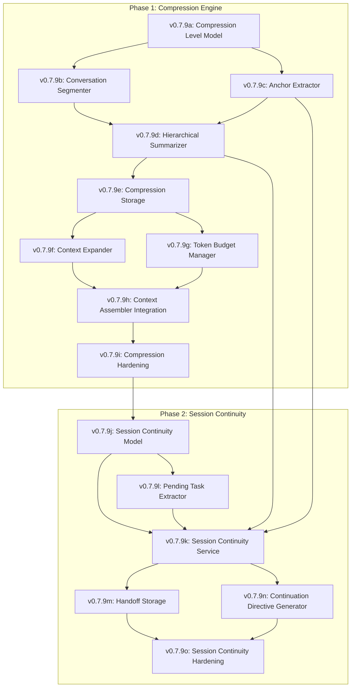

# Lexichord Design Specification Index: v0.7.9 — Contextual Compression Engine

**Parent Scope:** [LCS-SCOPE-v0.7.9.md](./LCS-SCOPE-v0.7.9.md)
**Codename:** The Compressor
**Theme:** Intelligent context compression with selective expansion and session continuity
**Status:** Draft
**Last Updated:** 2026-02-03

---

## Overview

This index catalogs all design specifications for the v0.7.9 Contextual Compression Engine feature set. The system provides hierarchical compression of conversational context, anchor point preservation, and seamless session continuity when context limits are reached.

The feature set is divided into two major phases:
1. **Compression Engine (v0.7.9a-i):** Core compression, storage, and expansion capabilities
2. **Session Continuity (v0.7.9j-o):** Automatic handoff and resumption when approaching context limits

---

## Design Specification Documents

### Phase 1: Compression Engine

| Sub-Version | Document | Feature Name | Status |
|-------------|----------|--------------|--------|
| v0.7.9a | [LCS-DES-v0.7.9a.md](./LCS-DES-v0.7.9a.md) | Compression Level Model | Draft |
| v0.7.9b | [LCS-DES-v0.7.9b.md](./LCS-DES-v0.7.9b.md) | Conversation Segmenter | Draft |
| v0.7.9c | [LCS-DES-v0.7.9c.md](./LCS-DES-v0.7.9c.md) | Anchor Extractor | Draft |
| v0.7.9d | [LCS-DES-v0.7.9d.md](./LCS-DES-v0.7.9d.md) | Hierarchical Summarizer | Draft |
| v0.7.9e | [LCS-DES-v0.7.9e.md](./LCS-DES-v0.7.9e.md) | Compression Storage | Draft |
| v0.7.9f | [LCS-DES-v0.7.9f.md](./LCS-DES-v0.7.9f.md) | Context Expander | Draft |
| v0.7.9g | [LCS-DES-v0.7.9g.md](./LCS-DES-v0.7.9g.md) | Token Budget Manager | Draft |
| v0.7.9h | [LCS-DES-v0.7.9h.md](./LCS-DES-v0.7.9h.md) | Context Assembler Integration | Draft |
| v0.7.9i | [LCS-DES-v0.7.9i.md](./LCS-DES-v0.7.9i.md) | Compression Hardening & Metrics | Draft |

### Phase 2: Session Continuity

| Sub-Version | Document | Feature Name | Status |
|-------------|----------|--------------|--------|
| v0.7.9j | [LCS-DES-v0.7.9j.md](./LCS-DES-v0.7.9j.md) | Session Continuity Model | Draft |
| v0.7.9k | [LCS-DES-v0.7.9k.md](./LCS-DES-v0.7.9k.md) | Session Continuity Service | Draft |
| v0.7.9l | [LCS-DES-v0.7.9l.md](./LCS-DES-v0.7.9l.md) | Pending Task Extractor | Draft |
| v0.7.9m | [LCS-DES-v0.7.9m.md](./LCS-DES-v0.7.9m.md) | Handoff Storage | Draft |
| v0.7.9n | [LCS-DES-v0.7.9n.md](./LCS-DES-v0.7.9n.md) | Continuation Directive Generator | Draft |
| v0.7.9o | [LCS-DES-v0.7.9o.md](./LCS-DES-v0.7.9o.md) | Session Continuity Hardening | Draft |

---

## Dependency Graph



---

## Module & License Summary

### Compression Engine

| Sub-Version | Module Scope | License Tier | Feature Gate Key |
|-------------|--------------|--------------|------------------|
| v0.7.9a | Lexichord.Modules.Agents | Writer Pro | `Agents.Compression.Model` |
| v0.7.9b | Lexichord.Modules.Agents | Writer Pro | `Agents.Compression.Segmenter` |
| v0.7.9c | Lexichord.Modules.Agents | Teams | `Agents.Compression.AnchorExtractor` |
| v0.7.9d | Lexichord.Modules.Agents | Writer Pro | `Agents.Compression.Summarizer` |
| v0.7.9e | Lexichord.Modules.Agents | Writer Pro | `Agents.Compression.Storage` |
| v0.7.9f | Lexichord.Modules.Agents | Teams | `Agents.Compression.Expander` |
| v0.7.9g | Lexichord.Modules.Agents | Teams | `Agents.Compression.BudgetManager` |
| v0.7.9h | Lexichord.Modules.Agents | Writer Pro | `Agents.Compression.Integration` |
| v0.7.9i | Lexichord.Modules.Agents | Writer Pro | `Agents.Compression.Metrics` |

### Session Continuity

| Sub-Version | Module Scope | License Tier | Feature Gate Key |
|-------------|--------------|--------------|------------------|
| v0.7.9j | Lexichord.Modules.Agents | Writer Pro | `Agents.Continuity.Model` |
| v0.7.9k | Lexichord.Modules.Agents | Teams | `Agents.Continuity.Service` |
| v0.7.9l | Lexichord.Modules.Agents | Teams | `Agents.Continuity.TaskExtractor` |
| v0.7.9m | Lexichord.Modules.Agents | Writer Pro | `Agents.Continuity.Storage` |
| v0.7.9n | Lexichord.Modules.Agents | Writer Pro | `Agents.Continuity.Directive` |
| v0.7.9o | Lexichord.Modules.Agents | Teams | `Agents.Continuity.Metrics` |

---

## Schema Changes Summary

### Compression Storage (v0.7.9e)

- `compressed_segments` — Stores multi-level compressed content
- `anchor_points` — Preserved critical elements

### Handoff Storage (v0.7.9m)

- `session_handoffs` — Session handoff packages
- `handoff_chains` — Multi-hop continuation tracking

---

## MediatR Events Summary

### Compression Events

| Event | Source | Description |
|-------|--------|-------------|
| `SegmentCompressedEvent` | v0.7.9d | Conversation segment compressed |
| `AnchorExtractedEvent` | v0.7.9c | Anchor points identified |
| `ContextExpandedEvent` | v0.7.9f | User/agent triggered expansion |
| `BudgetAllocatedEvent` | v0.7.9g | Token budget distributed |
| `CompressionFidelityWarningEvent` | v0.7.9i | Low fidelity score detected |

### Session Continuity Events

| Event | Source | Description |
|-------|--------|-------------|
| `ContextLimitApproachingEvent` | v0.7.9k | Warning before forced handoff |
| `SessionHandoffPreparedEvent` | v0.7.9k | Handoff package created |
| `SessionResumedEvent` | v0.7.9k | New session started from handoff |
| `HandoffChainExtendedEvent` | v0.7.9m | Multi-handoff chain continued |
| `PendingTasksExtractedEvent` | v0.7.9l | Unfinished work identified |

---

## Implementation Order

The recommended implementation sequence follows the dependency graph:

### Phase 1: Compression Engine
1. **Models (v0.7.9a):** Data structures for compression levels
2. **Segmentation (v0.7.9b):** Split conversations into logical units
3. **Anchors (v0.7.9c):** Extract never-compress elements
4. **Summarization (v0.7.9d):** LLM-based hierarchical compression
5. **Storage (v0.7.9e):** Persist compressed segments
6. **Expansion (v0.7.9f):** On-demand detail retrieval
7. **Budget (v0.7.9g):** Dynamic token allocation
8. **Integration (v0.7.9h):** Connect to Context Assembler
9. **Hardening (v0.7.9i):** Testing and metrics

### Phase 2: Session Continuity
10. **Model (v0.7.9j):** Handoff data structures
11. **Service (v0.7.9k):** Orchestrate handoffs with token tracking
12. **Tasks (v0.7.9l):** Extract pending work
13. **Storage (v0.7.9m):** Persist handoffs
14. **Directives (v0.7.9n):** Generate continuation instructions
15. **Hardening (v0.7.9o):** Testing and metrics

---

## Success Metrics (Overall)

### Compression Metrics

| Metric | Target |
|--------|--------|
| Compression Ratio (L0 → L2) | 10:1 |
| Compression Ratio (L0 → L3) | 50:1 |
| Anchor Preservation Rate | 100% |
| Fidelity Score (LLM evaluation) | >0.85 |
| Compression Latency | <500ms per segment |
| Expansion Latency | <200ms |

### Session Continuity Metrics

| Metric | Target |
|--------|--------|
| Handoff Preparation Latency | <2s |
| Task Extraction Accuracy | >0.90 |
| Anchor Preservation (cross-session) | 100% |
| Successful Resumption Rate | >99% |
| User-Perceived Continuity Score | >0.85 |
| Max Handoff Chain Length | 10+ |

---

## Core Concepts

### Hierarchical Compression Levels

```
┌─────────────────────────────────────────────────────────────┐
│ Level 0: Full Transcript                                    │
│ Complete conversation history, all messages verbatim        │
├─────────────────────────────────────────────────────────────┤
│ Level 1: Detailed Summary                                   │
│ Condensed narrative preserving key exchanges and outcomes   │
├─────────────────────────────────────────────────────────────┤
│ Level 2: Brief Summary                                      │
│ High-level overview: goals, decisions made, current state   │
├─────────────────────────────────────────────────────────────┤
│ Level 3: Topic Tags                                         │
│ Keywords and entity mentions for retrieval                  │
└─────────────────────────────────────────────────────────────┘
```

### Session Continuity Flow

```
Session A (approaching limit)    →    Handoff Package    →    Session B (resumed)
┌─────────────────────────┐      ┌──────────────────┐      ┌─────────────────────────┐
│ 1. Detect 85% usage     │      │ • Compacted      │      │ 1. Load handoff         │
│ 2. Extract pending tasks│  →   │   summary        │  →   │ 2. Inject directive     │
│ 3. Identify anchors     │      │ • Anchors        │      │ 3. Restore state        │
│ 4. Compress to budget   │      │ • Pending tasks  │      │ 4. Resume work          │
│ 5. Generate directive   │      │ • Session state  │      │ 5. Seamless for user    │
└─────────────────────────┘      └──────────────────┘      └─────────────────────────┘
```

---

## Open Questions

1. **Segmentation Strategy**: Fixed turn count vs. topic detection vs. time-based?
2. **Anchor Classification**: Rule-based patterns vs. LLM classification?
3. **Expansion Triggering**: Explicit markers vs. embedding similarity vs. LLM self-assessment?
4. **Storage Location**: Alongside conversation in app DB vs. separate cache?
5. **Handoff Threshold**: At what context utilization should automatic handoff trigger?
6. **User Notification**: Should users be notified before a handoff occurs?
7. **Task Granularity**: How fine-grained should pending task extraction be?
8. **Chain Limits**: Maximum handoff chain length before forcing a fresh start?
