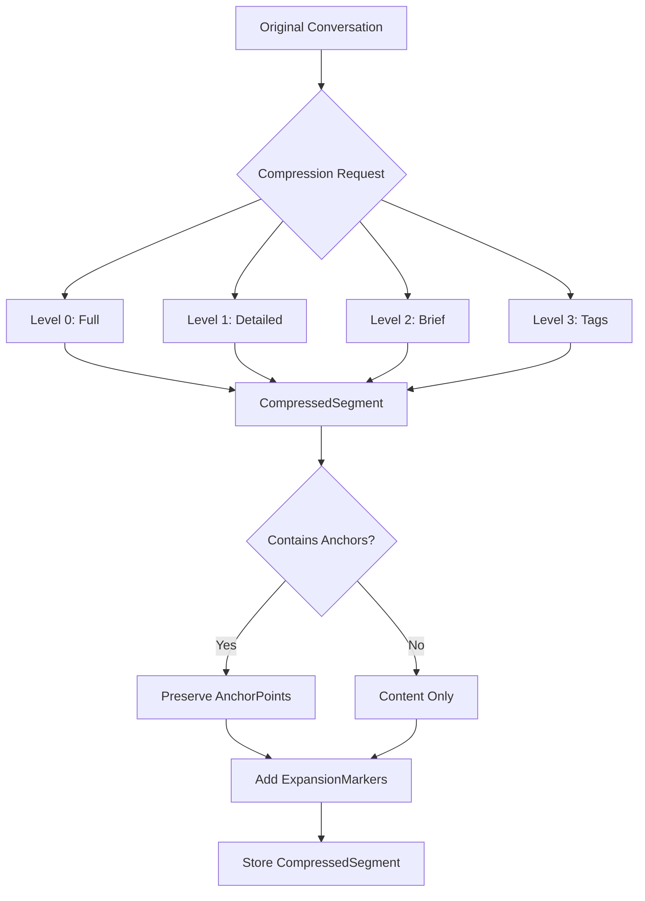

# LDS-01: Feature Design Specification — Compression Level Model

## 1. Metadata & Categorization

| Field | Value | Description |
| :--- | :--- | :--- |
| **Feature ID** | `COMP-01` | Matches the Roadmap ID. |
| **Feature Name** | Compression Level Model | The internal display name. |
| **Target Version** | `v0.7.9a` | The semantic version target. |
| **Module Scope** | `Lexichord.Modules.Agents` | The specific DLL/Project this code lives in. |
| **Swimlane** | Memory | The functional vertical. |
| **License Tier** | Writer Pro | The minimum license required to load this. |
| **Feature Gate Key** | `Agents.Compression.Model` | The string key used in `ILicenseService`. |
| **Author** | Lexichord Architecture | Primary Architect. |
| **Reviewer** | — | Lead Architect / Peer. |
| **Status** | Draft | Current lifecycle state. |
| **Last Updated** | 2026-02-03 | Date of last modification. |

---

## 2. Executive Summary

### 2.1 The Requirement
Long-running AI conversations accumulate context that exceeds LLM context window limits. The system needs a standardized data model to represent conversation content at multiple compression levels, enabling dynamic context management without losing critical information.

### 2.2 The Proposed Solution
Define foundational data structures for the compression system: `CompressionLevel` enum for hierarchy representation, `CompressedSegment` for storing compressed content, `AnchorPoint` for never-compress elements, and `ExpansionMarker` for expandable regions. These models form the foundation for all compression operations.

---

## 3. Architecture & Modular Strategy

### 3.1 Dependencies
*   **Upstream Modules:**
    *   `Lexichord.Host` (Core services, DI container)
*   **NuGet Packages:**
    *   None (pure data models)

### 3.2 Licensing Behavior
*   **Load Behavior:**
    *   [x] **Soft Gate:** Models are available to all tiers; higher compression levels require higher tiers.
*   **Fallback Experience:**
    *   Core users can use Level 0-1 compression only. Writer Pro unlocks Level 2. Teams/Enterprise unlock Level 3 and advanced features.

---

## 4. Data Contract (The API)

```csharp
namespace Lexichord.Modules.Agents.Compression.Abstractions;

/// <summary>
/// Defines the hierarchy of compression levels for conversation context.
/// Higher levels = more compression = fewer tokens.
/// </summary>
public enum CompressionLevel
{
    /// <summary>
    /// Level 0: Full transcript - complete conversation history, all messages verbatim.
    /// No compression applied. Highest fidelity, highest token cost.
    /// </summary>
    Full = 0,

    /// <summary>
    /// Level 1: Detailed summary - condensed narrative preserving key exchanges and outcomes.
    /// Typical compression ratio: 3:1.
    /// </summary>
    Detailed = 1,

    /// <summary>
    /// Level 2: Brief summary - high-level overview with goals, decisions, and current state.
    /// Typical compression ratio: 10:1.
    /// </summary>
    Brief = 2,

    /// <summary>
    /// Level 3: Topic tags - keywords and entity mentions for retrieval only.
    /// Typical compression ratio: 50:1. Requires Teams license.
    /// </summary>
    Tags = 3
}

/// <summary>
/// Represents a segment of conversation compressed to a specific level.
/// </summary>
public record CompressedSegment
{
    /// <summary>
    /// Unique identifier for this compressed segment.
    /// </summary>
    public required string SegmentId { get; init; }

    /// <summary>
    /// The conversation this segment belongs to.
    /// </summary>
    public required string ConversationId { get; init; }

    /// <summary>
    /// The compression level of this segment's content.
    /// </summary>
    public required CompressionLevel Level { get; init; }

    /// <summary>
    /// The compressed content at this level.
    /// </summary>
    public required string Content { get; init; }

    /// <summary>
    /// Anchor points preserved within this segment.
    /// These elements are never compressed away.
    /// </summary>
    public required IReadOnlyList<AnchorPoint> Anchors { get; init; }

    /// <summary>
    /// Markers indicating expandable regions within the content.
    /// </summary>
    public required IReadOnlyList<ExpansionMarker> ExpansionMarkers { get; init; }

    /// <summary>
    /// Token count of the compressed content.
    /// </summary>
    public required int TokenCount { get; init; }

    /// <summary>
    /// Token count of the original (Level 0) content.
    /// </summary>
    public required int OriginalTokenCount { get; init; }

    /// <summary>
    /// When this compression was created.
    /// </summary>
    public required DateTimeOffset CompressedAt { get; init; }

    /// <summary>
    /// Optional topic label extracted during segmentation.
    /// </summary>
    public string? TopicLabel { get; init; }

    /// <summary>
    /// Calculate the compression ratio achieved.
    /// </summary>
    public float CompressionRatio => OriginalTokenCount > 0
        ? (float)OriginalTokenCount / TokenCount
        : 1.0f;
}

/// <summary>
/// Represents a critical element that must never be compressed away.
/// Anchors are preserved verbatim across all compression levels.
/// </summary>
public record AnchorPoint
{
    /// <summary>
    /// The type of anchor (commitment, decision, etc.).
    /// </summary>
    public required AnchorType Type { get; init; }

    /// <summary>
    /// The verbatim content of the anchor.
    /// </summary>
    public required string Content { get; init; }

    /// <summary>
    /// Position in the original conversation (message index or character offset).
    /// </summary>
    public required int OriginalPosition { get; init; }

    /// <summary>
    /// Importance score (0.0-1.0) for prioritization.
    /// </summary>
    public required float Importance { get; init; }

    /// <summary>
    /// Optional source message ID for traceability.
    /// </summary>
    public string? SourceMessageId { get; init; }

    /// <summary>
    /// Optional context around the anchor for disambiguation.
    /// </summary>
    public string? Context { get; init; }
}

/// <summary>
/// Types of anchor points that are preserved during compression.
/// </summary>
public enum AnchorType
{
    /// <summary>
    /// Commitments: "I will...", "You should...", action items.
    /// </summary>
    Commitment = 0,

    /// <summary>
    /// Decisions: Choices made between alternatives.
    /// </summary>
    Decision = 1,

    /// <summary>
    /// Unresolved questions: Open loops needing follow-up.
    /// </summary>
    UnresolvedQuestion = 2,

    /// <summary>
    /// Critical facts: User-provided data, configurations, preferences.
    /// </summary>
    CriticalFact = 3,

    /// <summary>
    /// Corrections: "Actually...", "I was wrong about...".
    /// </summary>
    Correction = 4,

    /// <summary>
    /// User preferences: Explicit style/format/behavior requests.
    /// </summary>
    UserPreference = 5,

    /// <summary>
    /// Error information: Exceptions, failures, debugging context.
    /// </summary>
    ErrorContext = 6,

    /// <summary>
    /// Code artifacts: File paths, function names, code snippets.
    /// </summary>
    CodeArtifact = 7
}

/// <summary>
/// Marks a region in compressed content that can be expanded to more detail.
/// </summary>
public record ExpansionMarker
{
    /// <summary>
    /// Unique identifier for this marker.
    /// </summary>
    public required string MarkerId { get; init; }

    /// <summary>
    /// Human-readable label describing what can be expanded.
    /// </summary>
    public required string Label { get; init; }

    /// <summary>
    /// The compression level to expand to.
    /// </summary>
    public required CompressionLevel TargetLevel { get; init; }

    /// <summary>
    /// Start position of the marker in the compressed content.
    /// </summary>
    public required int StartOffset { get; init; }

    /// <summary>
    /// End position of the marker in the compressed content.
    /// </summary>
    public required int EndOffset { get; init; }

    /// <summary>
    /// The segment ID containing the expanded content.
    /// </summary>
    public required string SourceSegmentId { get; init; }

    /// <summary>
    /// Estimated token count if expanded.
    /// </summary>
    public int? EstimatedExpandedTokens { get; init; }
}

/// <summary>
/// Metadata about a compression operation.
/// </summary>
public record CompressionMetadata
{
    /// <summary>
    /// The model used for LLM-based compression.
    /// </summary>
    public string? ModelId { get; init; }

    /// <summary>
    /// Duration of the compression operation.
    /// </summary>
    public TimeSpan? Duration { get; init; }

    /// <summary>
    /// Fidelity score if evaluated (0.0-1.0).
    /// </summary>
    public float? FidelityScore { get; init; }

    /// <summary>
    /// Number of anchors extracted.
    /// </summary>
    public int AnchorCount { get; init; }

    /// <summary>
    /// Number of expansion markers created.
    /// </summary>
    public int MarkerCount { get; init; }
}

/// <summary>
/// Extension methods for compression level operations.
/// </summary>
public static class CompressionLevelExtensions
{
    /// <summary>
    /// Get the expected compression ratio for a level.
    /// </summary>
    public static float ExpectedCompressionRatio(this CompressionLevel level) => level switch
    {
        CompressionLevel.Full => 1.0f,
        CompressionLevel.Detailed => 3.0f,
        CompressionLevel.Brief => 10.0f,
        CompressionLevel.Tags => 50.0f,
        _ => 1.0f
    };

    /// <summary>
    /// Get the minimum license tier required for a compression level.
    /// </summary>
    public static string RequiredLicenseTier(this CompressionLevel level) => level switch
    {
        CompressionLevel.Full => "Core",
        CompressionLevel.Detailed => "Writer Pro",
        CompressionLevel.Brief => "Writer Pro",
        CompressionLevel.Tags => "Teams",
        _ => "Core"
    };

    /// <summary>
    /// Check if a level can be expanded to another level.
    /// </summary>
    public static bool CanExpandTo(this CompressionLevel from, CompressionLevel to) =>
        (int)from > (int)to;

    /// <summary>
    /// Get all levels more detailed than the current level.
    /// </summary>
    public static IEnumerable<CompressionLevel> MoreDetailedLevels(this CompressionLevel level)
    {
        for (var l = (int)level - 1; l >= 0; l--)
            yield return (CompressionLevel)l;
    }
}
```

---

## 5. Implementation Logic

### 5.1 Flow Diagram (Mermaid)



### 5.2 Key Algorithmic Logic

**Compression Level Selection:**

```csharp
public static CompressionLevel RecommendLevel(int availableTokens, int originalTokens)
{
    var ratio = (float)originalTokens / availableTokens;

    return ratio switch
    {
        <= 1.0f => CompressionLevel.Full,
        <= 3.0f => CompressionLevel.Detailed,
        <= 10.0f => CompressionLevel.Brief,
        _ => CompressionLevel.Tags
    };
}
```

**Anchor Importance Calculation:**

```csharp
public static float CalculateImportance(AnchorType type, int position, int totalMessages)
{
    // Base importance by type
    var baseImportance = type switch
    {
        AnchorType.Correction => 1.0f,      // Corrections are critical
        AnchorType.Decision => 0.95f,       // Decisions drive behavior
        AnchorType.Commitment => 0.9f,      // Commitments need tracking
        AnchorType.CriticalFact => 0.85f,   // Facts inform responses
        AnchorType.UnresolvedQuestion => 0.8f,
        AnchorType.UserPreference => 0.75f,
        AnchorType.ErrorContext => 0.7f,
        AnchorType.CodeArtifact => 0.65f,
        _ => 0.5f
    };

    // Recency boost (more recent = more important)
    var recencyFactor = (float)position / totalMessages;
    var recencyBoost = recencyFactor * 0.15f;

    return Math.Min(1.0f, baseImportance + recencyBoost);
}
```

---

## 6. Data Persistence (Database)

*   **Migration ID:** None required (data models only)
*   **Module Schema:** N/A
*   **New Tables / Columns:** None (storage handled in v0.7.9e)

---

## 7. UI/UX Specifications

### 7.1 Visual Components
*   **Location:** No direct UI for models (foundation layer)
*   **Debug Panel:** Settings > Advanced > Compression Debug
    *   Display current compression level for active conversation
    *   Show anchor count and expansion marker count
    *   Compression ratio indicator

### 7.2 Accessibility (A11y)
*   Compression level indicators MUST use both color and text
*   Expansion markers MUST be keyboard activatable

---

## 8. Observability & Logging

*   **Metric:** `Agents.Compression.LevelDistribution` (Counter by level)
*   **Metric:** `Agents.Compression.AnchorCount` (Histogram)
*   **Metric:** `Agents.Compression.CompressionRatio` (Histogram)

*   **Log (Debug):** `[COMP] Created CompressedSegment {SegmentId} at level {Level} ({TokenCount} tokens, ratio={Ratio})`
*   **Log (Debug):** `[COMP] Extracted {AnchorCount} anchors of types {AnchorTypes}`
*   **Log (Info):** `[COMP] Compression achieved {Ratio}:1 ratio for conversation {ConversationId}`

---

## 9. Security & Safety

*   **PII Risk:** Low — Models are data structures only; content handling is in other components.
*   **Serialization:** All records MUST use `System.Text.Json` serialization.
*   **Immutability:** All model types are records with `init` properties to ensure immutability.

---

## 10. Acceptance Criteria (QA)

1.  **[Functional]** `CompressionLevel` enum SHALL have exactly 4 levels (0-3) representing the compression hierarchy.

2.  **[Functional]** `CompressedSegment.CompressionRatio` SHALL correctly calculate the ratio from original to compressed token counts.

3.  **[Functional]** `AnchorPoint.Importance` SHALL be in the range [0.0, 1.0].

4.  **[Functional]** `ExpansionMarker.TargetLevel` SHALL be a level more detailed than the current segment's level.

5.  **[Serialization]** All model types SHALL serialize and deserialize correctly with System.Text.Json.

6.  **[Extension]** `CompressionLevel.ExpectedCompressionRatio()` SHALL return the documented ratios for each level.

7.  **[Extension]** `CompressionLevel.CanExpandTo()` SHALL return true only when expanding to a more detailed level.

---

## 11. Test Scenarios

### 11.1 Unit Tests

```gherkin
Scenario: CompressionLevel enum has correct values
    Given the CompressionLevel enum
    Then Full SHALL equal 0
    And Detailed SHALL equal 1
    And Brief SHALL equal 2
    And Tags SHALL equal 3

Scenario: CompressedSegment calculates compression ratio
    Given a CompressedSegment with OriginalTokenCount=1000 and TokenCount=100
    When CompressionRatio is accessed
    Then the value SHALL be 10.0

Scenario: AnchorPoint importance is bounded
    Given an AnchorPoint with Importance=1.5
    When validation is performed
    Then an error SHALL be raised

Scenario: ExpansionMarker target level validation
    Given a segment at Level.Brief
    And an ExpansionMarker with TargetLevel=Level.Tags
    When validation is performed
    Then an error SHALL be raised (cannot expand to less detail)

Scenario: Extension method returns expected ratios
    When ExpectedCompressionRatio is called for each level
    Then Full SHALL return 1.0
    And Detailed SHALL return 3.0
    And Brief SHALL return 10.0
    And Tags SHALL return 50.0
```

### 11.2 Integration Tests

```gherkin
Scenario: Models serialize to JSON correctly
    Given a CompressedSegment with anchors and markers
    When serialized to JSON and deserialized back
    Then all properties SHALL match the original

Scenario: Models work with EF Core
    Given a database context configured for compression models
    When a CompressedSegment is saved and retrieved
    Then all navigation properties SHALL load correctly
```
