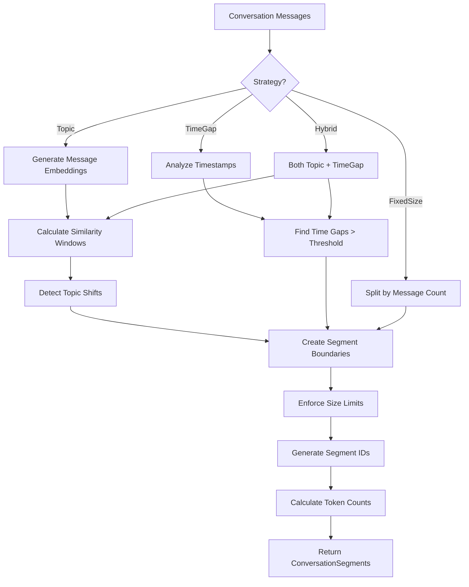

# LDS-01: Feature Design Specification — Conversation Segmenter

## 1. Metadata & Categorization

| Field | Value | Description |
| :--- | :--- | :--- |
| **Feature ID** | `COMP-02` | Matches the Roadmap ID. |
| **Feature Name** | Conversation Segmenter | The internal display name. |
| **Target Version** | `v0.7.9b` | The semantic version target. |
| **Module Scope** | `Lexichord.Modules.Agents` | The specific DLL/Project this code lives in. |
| **Swimlane** | Memory | The functional vertical. |
| **License Tier** | Writer Pro | The minimum license required to load this. |
| **Feature Gate Key** | `Agents.Compression.Segmenter` | The string key used in `ILicenseService`. |
| **Author** | Lexichord Architecture | Primary Architect. |
| **Reviewer** | — | Lead Architect / Peer. |
| **Status** | Draft | Current lifecycle state. |
| **Last Updated** | 2026-02-03 | Date of last modification. |

---

## 2. Executive Summary

### 2.1 The Requirement
Before compression can occur, conversations must be divided into logical segments that can be independently compressed, stored, and retrieved. Naive segmentation (fixed message count) loses context; intelligent segmentation preserves topic coherence and enables selective expansion.

### 2.2 The Proposed Solution
Implement `IConversationSegmenter` that splits conversation history into logical segments using topic-based, time-based, or hybrid strategies. Each segment represents a coherent unit of discussion that can be compressed independently while maintaining semantic integrity.

---

## 3. Architecture & Modular Strategy

### 3.1 Dependencies
*   **Upstream Modules:**
    *   `Lexichord.Host` (Core services)
    *   `Lexichord.Modules.Agents.Compression` (v0.7.9a models)
    *   `Lexichord.Modules.Rag` (IEmbeddingService for topic detection)
*   **NuGet Packages:**
    *   None additional

### 3.2 Licensing Behavior
*   **Load Behavior:**
    *   [x] **Soft Gate:** Basic segmentation available to Writer Pro; topic-based requires Teams.
*   **Fallback Experience:**
    *   Writer Pro users get fixed-size segmentation. Teams users get topic-based intelligent segmentation.

---

## 4. Data Contract (The API)

```csharp
namespace Lexichord.Modules.Agents.Compression.Abstractions;

/// <summary>
/// Splits conversations into logical segments for independent compression.
/// </summary>
public interface IConversationSegmenter
{
    /// <summary>
    /// Segments a conversation history into logical units.
    /// </summary>
    /// <param name="messages">The conversation messages to segment.</param>
    /// <param name="options">Segmentation configuration.</param>
    /// <param name="ct">Cancellation token.</param>
    /// <returns>Ordered list of conversation segments.</returns>
    Task<IReadOnlyList<ConversationSegment>> SegmentAsync(
        IReadOnlyList<ChatMessage> messages,
        SegmentationOptions options,
        CancellationToken ct = default);

    /// <summary>
    /// Re-segments a conversation when new messages are added.
    /// Attempts to preserve existing segment boundaries where possible.
    /// </summary>
    /// <param name="existingSegments">Previously created segments.</param>
    /// <param name="newMessages">New messages to incorporate.</param>
    /// <param name="options">Segmentation configuration.</param>
    /// <param name="ct">Cancellation token.</param>
    /// <returns>Updated segment list.</returns>
    Task<IReadOnlyList<ConversationSegment>> ResegmentAsync(
        IReadOnlyList<ConversationSegment> existingSegments,
        IReadOnlyList<ChatMessage> newMessages,
        SegmentationOptions options,
        CancellationToken ct = default);
}

/// <summary>
/// Represents a logical segment of conversation.
/// </summary>
public record ConversationSegment
{
    /// <summary>
    /// Unique identifier for this segment.
    /// </summary>
    public required string SegmentId { get; init; }

    /// <summary>
    /// Index of the first message in this segment (inclusive).
    /// </summary>
    public required int StartIndex { get; init; }

    /// <summary>
    /// Index of the last message in this segment (inclusive).
    /// </summary>
    public required int EndIndex { get; init; }

    /// <summary>
    /// The messages contained in this segment.
    /// </summary>
    public required IReadOnlyList<ChatMessage> Messages { get; init; }

    /// <summary>
    /// Detected topic label for this segment (if topic-based segmentation used).
    /// </summary>
    public string? TopicLabel { get; init; }

    /// <summary>
    /// Total token count of messages in this segment.
    /// </summary>
    public required int TokenCount { get; init; }

    /// <summary>
    /// Embedding representing the segment's semantic content (for topic matching).
    /// </summary>
    public float[]? Embedding { get; init; }

    /// <summary>
    /// Timestamp of the first message in segment.
    /// </summary>
    public DateTimeOffset? StartTime { get; init; }

    /// <summary>
    /// Timestamp of the last message in segment.
    /// </summary>
    public DateTimeOffset? EndTime { get; init; }

    /// <summary>
    /// Number of messages in this segment.
    /// </summary>
    public int MessageCount => EndIndex - StartIndex + 1;
}

/// <summary>
/// Configuration for conversation segmentation.
/// </summary>
public record SegmentationOptions
{
    /// <summary>
    /// Maximum messages per segment. Default: 20.
    /// </summary>
    public int MaxMessagesPerSegment { get; init; } = 20;

    /// <summary>
    /// Maximum tokens per segment. Default: 4000.
    /// </summary>
    public int MaxTokensPerSegment { get; init; } = 4000;

    /// <summary>
    /// Minimum messages per segment (avoid tiny segments). Default: 3.
    /// </summary>
    public int MinMessagesPerSegment { get; init; } = 3;

    /// <summary>
    /// Strategy for determining segment boundaries.
    /// </summary>
    public SegmentationStrategy Strategy { get; init; } = SegmentationStrategy.Topic;

    /// <summary>
    /// Similarity threshold for topic change detection (0.0-1.0). Default: 0.7.
    /// Lower = more sensitive to topic changes.
    /// </summary>
    public float TopicChangeThreshold { get; init; } = 0.7f;

    /// <summary>
    /// Time gap (minutes) that triggers a new segment in TimeGap strategy. Default: 30.
    /// </summary>
    public int TimeGapMinutes { get; init; } = 30;

    /// <summary>
    /// Whether to generate embeddings for segments. Default: true.
    /// </summary>
    public bool GenerateEmbeddings { get; init; } = true;

    /// <summary>
    /// Whether to detect and label topics. Default: true.
    /// </summary>
    public bool DetectTopics { get; init; } = true;
}

/// <summary>
/// Strategies for determining segment boundaries.
/// </summary>
public enum SegmentationStrategy
{
    /// <summary>
    /// Fixed number of messages per segment. Simplest, least context-aware.
    /// </summary>
    FixedSize = 0,

    /// <summary>
    /// Detect topic shifts using embedding similarity.
    /// Requires embedding service. Most intelligent but slower.
    /// </summary>
    Topic = 1,

    /// <summary>
    /// Segment on time gaps between messages.
    /// Good for async conversations with natural breaks.
    /// </summary>
    TimeGap = 2,

    /// <summary>
    /// Combination of topic detection and time gaps.
    /// Best for complex, long-running conversations.
    /// </summary>
    Hybrid = 3
}
```

---

## 5. Implementation Logic

### 5.1 Flow Diagram (Mermaid)



### 5.2 Key Algorithmic Logic

**Topic-Based Segmentation:**

```csharp
private async Task<List<int>> DetectTopicBoundariesAsync(
    IReadOnlyList<ChatMessage> messages,
    SegmentationOptions options,
    CancellationToken ct)
{
    var boundaries = new List<int> { 0 }; // Start of first segment

    // Generate embeddings for each message
    var embeddings = await GenerateEmbeddingsAsync(messages, ct);

    // Use sliding window to detect topic shifts
    const int windowSize = 3;
    for (int i = windowSize; i < messages.Count; i++)
    {
        // Calculate average embedding for previous window
        var prevWindow = embeddings
            .Skip(i - windowSize)
            .Take(windowSize)
            .ToList();
        var prevAvg = AverageEmbedding(prevWindow);

        // Calculate average embedding for current window
        var currWindow = embeddings
            .Skip(i)
            .Take(Math.Min(windowSize, messages.Count - i))
            .ToList();
        var currAvg = AverageEmbedding(currWindow);

        // If similarity drops below threshold, mark boundary
        var similarity = CosineSimilarity(prevAvg, currAvg);
        if (similarity < options.TopicChangeThreshold)
        {
            boundaries.Add(i);
            _logger.LogDebug(
                "[COMP:SEG] Topic shift detected at message {Index}, similarity={Similarity}",
                i, similarity);
        }
    }

    return boundaries;
}
```

**Time-Gap Segmentation:**

```csharp
private List<int> DetectTimeGapBoundaries(
    IReadOnlyList<ChatMessage> messages,
    SegmentationOptions options)
{
    var boundaries = new List<int> { 0 };
    var gapThreshold = TimeSpan.FromMinutes(options.TimeGapMinutes);

    for (int i = 1; i < messages.Count; i++)
    {
        var prevTime = messages[i - 1].Timestamp;
        var currTime = messages[i].Timestamp;

        if (prevTime.HasValue && currTime.HasValue)
        {
            var gap = currTime.Value - prevTime.Value;
            if (gap > gapThreshold)
            {
                boundaries.Add(i);
                _logger.LogDebug(
                    "[COMP:SEG] Time gap of {Gap} detected at message {Index}",
                    gap, i);
            }
        }
    }

    return boundaries;
}
```

**Hybrid Strategy:**

```csharp
private async Task<List<int>> DetectHybridBoundariesAsync(
    IReadOnlyList<ChatMessage> messages,
    SegmentationOptions options,
    CancellationToken ct)
{
    var topicBoundaries = await DetectTopicBoundariesAsync(messages, options, ct);
    var timeBoundaries = DetectTimeGapBoundaries(messages, options);

    // Merge boundaries, preferring natural breaks
    var merged = topicBoundaries
        .Union(timeBoundaries)
        .OrderBy(b => b)
        .ToList();

    // Remove boundaries that are too close together
    var filtered = new List<int> { 0 };
    foreach (var boundary in merged.Skip(1))
    {
        if (boundary - filtered.Last() >= options.MinMessagesPerSegment)
        {
            filtered.Add(boundary);
        }
    }

    return filtered;
}
```

**Size Limit Enforcement:**

```csharp
private List<ConversationSegment> EnforceSizeLimits(
    List<ConversationSegment> segments,
    SegmentationOptions options)
{
    var result = new List<ConversationSegment>();

    foreach (var segment in segments)
    {
        if (segment.TokenCount <= options.MaxTokensPerSegment &&
            segment.MessageCount <= options.MaxMessagesPerSegment)
        {
            result.Add(segment);
            continue;
        }

        // Split oversized segment
        var subSegments = SplitSegment(segment, options);
        result.AddRange(subSegments);
    }

    return result;
}
```

---

## 6. Data Persistence (Database)

*   **Migration ID:** None required (segments stored in v0.7.9e)
*   **Module Schema:** N/A
*   **New Tables / Columns:** None

---

## 7. UI/UX Specifications

### 7.1 Visual Components
*   **Location:** No direct UI (internal service)
*   **Debug Panel:** Settings > Advanced > Compression Debug
    *   Show segment boundaries in conversation timeline
    *   Display topic labels for each segment
    *   Visualize token distribution across segments

### 7.2 Accessibility (A11y)
*   Segment boundaries in debug view MUST be visually distinct
*   Topic labels MUST be readable by screen readers

---

## 8. Observability & Logging

*   **Metric:** `Agents.Compression.Segmentation.Duration` (Timer)
*   **Metric:** `Agents.Compression.Segmentation.SegmentCount` (Histogram)
*   **Metric:** `Agents.Compression.Segmentation.AvgSegmentSize` (Gauge)
*   **Metric:** `Agents.Compression.Segmentation.TopicShiftCount` (Counter)

*   **Log (Debug):** `[COMP:SEG] Segmenting {MessageCount} messages with strategy {Strategy}`
*   **Log (Debug):** `[COMP:SEG] Topic shift detected at message {Index}, similarity={Similarity}`
*   **Log (Info):** `[COMP:SEG] Created {SegmentCount} segments from {MessageCount} messages`
*   **Log (Warn):** `[COMP:SEG] Segment {SegmentId} exceeds token limit, splitting`

---

## 9. Security & Safety

*   **PII Risk:** Low — Segmenter processes message content but does not store it.
*   **Performance:** Topic-based segmentation requires embedding generation; cache embeddings when possible.
*   **Resource Limits:** Maximum 1000 messages per segmentation call to prevent memory exhaustion.

---

## 10. Acceptance Criteria (QA)

1.  **[Functional]** Given a conversation with 50 messages, `SegmentAsync` SHALL return segments respecting `MaxMessagesPerSegment`.

2.  **[Functional]** Given `Strategy=Topic`, the segmenter SHALL detect topic shifts using embedding similarity.

3.  **[Functional]** Given `Strategy=TimeGap`, the segmenter SHALL create boundaries at time gaps exceeding `TimeGapMinutes`.

4.  **[Functional]** Given `Strategy=Hybrid`, the segmenter SHALL combine both topic and time-gap detection.

5.  **[Size Limits]** No segment SHALL exceed `MaxTokensPerSegment` tokens.

6.  **[Minimum Size]** No segment SHALL have fewer than `MinMessagesPerSegment` messages (except possibly the last segment).

7.  **[Resegment]** `ResegmentAsync` SHALL preserve existing segment boundaries where possible.

8.  **[Licensing]** Topic-based segmentation SHALL require Teams license; FixedSize available to Writer Pro.

---

## 11. Test Scenarios

### 11.1 Unit Tests

```gherkin
Scenario: Fixed-size segmentation
    Given 45 messages
    And MaxMessagesPerSegment=20
    When SegmentAsync is called with Strategy=FixedSize
    Then 3 segments SHALL be created
    And the first two segments SHALL have 20 messages each
    And the last segment SHALL have 5 messages

Scenario: Topic-based segmentation detects shifts
    Given messages about "coding" then "lunch plans" then "coding"
    And TopicChangeThreshold=0.7
    When SegmentAsync is called with Strategy=Topic
    Then 3 segments SHALL be created
    And each segment SHALL have a distinct TopicLabel

Scenario: Time-gap segmentation respects threshold
    Given messages with a 45-minute gap in the middle
    And TimeGapMinutes=30
    When SegmentAsync is called with Strategy=TimeGap
    Then 2 segments SHALL be created
    And the boundary SHALL be at the time gap

Scenario: Oversized segment is split
    Given a segment with 6000 tokens
    And MaxTokensPerSegment=4000
    When size limits are enforced
    Then the segment SHALL be split into 2 segments
    And each segment SHALL have <= 4000 tokens
```

### 11.2 Integration Tests

```gherkin
Scenario: Resegmentation preserves boundaries
    Given a conversation previously segmented into 3 segments
    And 10 new messages are added
    When ResegmentAsync is called
    Then the first 2 segment boundaries SHALL be preserved
    And new messages SHALL be incorporated into existing or new segments

Scenario: Topic detection uses embedding service
    Given the embedding service is available
    When SegmentAsync is called with Strategy=Topic
    Then IEmbeddingService.GenerateAsync SHALL be called for each message
    And topic similarities SHALL be calculated from embeddings
```
