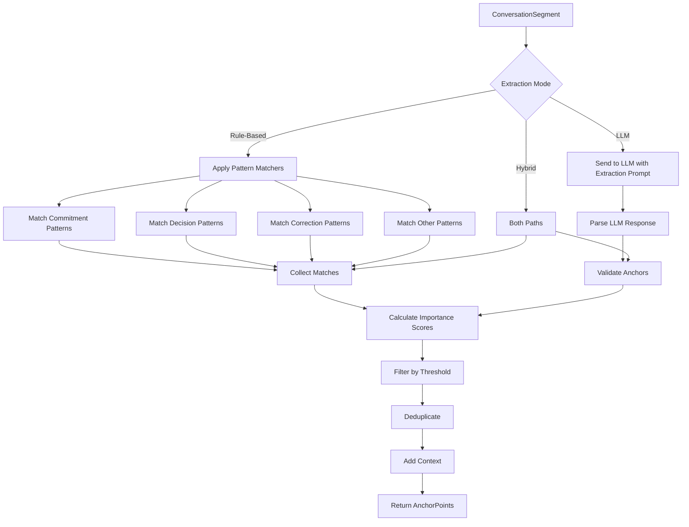

# LDS-01: Feature Design Specification — Anchor Extractor

## 1. Metadata & Categorization

| Field | Value | Description |
| :--- | :--- | :--- |
| **Feature ID** | `COMP-03` | Matches the Roadmap ID. |
| **Feature Name** | Anchor Extractor | The internal display name. |
| **Target Version** | `v0.7.9c` | The semantic version target. |
| **Module Scope** | `Lexichord.Modules.Agents` | The specific DLL/Project this code lives in. |
| **Swimlane** | Memory | The functional vertical. |
| **License Tier** | Teams | The minimum license required to load this. |
| **Feature Gate Key** | `Agents.Compression.AnchorExtractor` | The string key used in `ILicenseService`. |
| **Author** | Lexichord Architecture | Primary Architect. |
| **Reviewer** | — | Lead Architect / Peer. |
| **Status** | Draft | Current lifecycle state. |
| **Last Updated** | 2026-02-03 | Date of last modification. |

---

## 2. Executive Summary

### 2.1 The Requirement
When compressing conversation context, certain critical elements must never be lost: decisions made, commitments given, corrections stated, and user preferences expressed. Without anchor extraction, compression risks losing information that fundamentally changes the conversation's meaning.

### 2.2 The Proposed Solution
Implement `IAnchorExtractor` that identifies and extracts critical elements (anchors) from conversation segments using a hybrid approach: rule-based pattern matching for common patterns and optional LLM-assisted extraction for complex cases. Anchors are preserved verbatim across all compression levels.

---

## 3. Architecture & Modular Strategy

### 3.1 Dependencies
*   **Upstream Modules:**
    *   `Lexichord.Host` (Core services)
    *   `Lexichord.Modules.Agents.Compression` (v0.7.9a models, v0.7.9b segments)
*   **Optional Dependencies:**
    *   `IChatCompletionService` (For LLM-assisted extraction)
*   **NuGet Packages:**
    *   None additional

### 3.2 Licensing Behavior
*   **Load Behavior:**
    *   [x] **Soft Gate:** Rule-based extraction for Writer Pro; LLM-assisted for Teams+.
*   **Fallback Experience:**
    *   Writer Pro users get pattern-based anchor detection. Teams users get LLM-enhanced detection for ambiguous cases.

---

## 4. Data Contract (The API)

```csharp
namespace Lexichord.Modules.Agents.Compression.Abstractions;

/// <summary>
/// Extracts anchor points (critical, never-compress elements) from conversation segments.
/// </summary>
public interface IAnchorExtractor
{
    /// <summary>
    /// Extracts anchor points from a conversation segment.
    /// </summary>
    /// <param name="segment">The segment to analyze.</param>
    /// <param name="options">Extraction configuration.</param>
    /// <param name="ct">Cancellation token.</param>
    /// <returns>List of extracted anchor points with importance scores.</returns>
    Task<IReadOnlyList<AnchorPoint>> ExtractAsync(
        ConversationSegment segment,
        AnchorExtractionOptions options,
        CancellationToken ct = default);

    /// <summary>
    /// Extracts anchor points from raw messages (without pre-segmentation).
    /// </summary>
    /// <param name="messages">The messages to analyze.</param>
    /// <param name="options">Extraction configuration.</param>
    /// <param name="ct">Cancellation token.</param>
    /// <returns>List of extracted anchor points.</returns>
    Task<IReadOnlyList<AnchorPoint>> ExtractFromMessagesAsync(
        IReadOnlyList<ChatMessage> messages,
        AnchorExtractionOptions options,
        CancellationToken ct = default);

    /// <summary>
    /// Merges and deduplicates anchors from multiple sources.
    /// </summary>
    /// <param name="anchorSets">Multiple sets of anchors to merge.</param>
    /// <returns>Deduplicated, merged anchor list.</returns>
    IReadOnlyList<AnchorPoint> MergeAnchors(
        IEnumerable<IReadOnlyList<AnchorPoint>> anchorSets);
}

/// <summary>
/// Configuration for anchor extraction.
/// </summary>
public record AnchorExtractionOptions
{
    /// <summary>
    /// Whether to use rule-based pattern extraction. Default: true.
    /// </summary>
    public bool UseRuleBasedExtraction { get; init; } = true;

    /// <summary>
    /// Whether to use LLM for extraction (requires Teams license). Default: false.
    /// </summary>
    public bool UseLlmExtraction { get; init; } = false;

    /// <summary>
    /// Minimum importance threshold for including anchors (0.0-1.0). Default: 0.5.
    /// </summary>
    public float MinImportanceThreshold { get; init; } = 0.5f;

    /// <summary>
    /// Maximum number of anchors to extract per segment. Default: 20.
    /// </summary>
    public int MaxAnchorsPerSegment { get; init; } = 20;

    /// <summary>
    /// Anchor types to extract. Default: all types.
    /// </summary>
    public IReadOnlySet<AnchorType>? IncludedTypes { get; init; }

    /// <summary>
    /// Whether to include surrounding context with anchors. Default: true.
    /// </summary>
    public bool IncludeContext { get; init; } = true;

    /// <summary>
    /// Maximum characters of context to include around each anchor. Default: 100.
    /// </summary>
    public int ContextWindowSize { get; init; } = 100;
}

/// <summary>
/// Result of anchor extraction with metadata.
/// </summary>
public record AnchorExtractionResult
{
    /// <summary>
    /// Extracted anchor points.
    /// </summary>
    public required IReadOnlyList<AnchorPoint> Anchors { get; init; }

    /// <summary>
    /// Extraction method used (rule-based, LLM, or hybrid).
    /// </summary>
    public required AnchorExtractionMethod Method { get; init; }

    /// <summary>
    /// Processing duration.
    /// </summary>
    public TimeSpan Duration { get; init; }

    /// <summary>
    /// Number of patterns matched (for rule-based).
    /// </summary>
    public int PatternsMatched { get; init; }

    /// <summary>
    /// LLM tokens used (for LLM extraction).
    /// </summary>
    public int? LlmTokensUsed { get; init; }
}

/// <summary>
/// Methods used for anchor extraction.
/// </summary>
public enum AnchorExtractionMethod
{
    /// <summary>
    /// Pattern matching only.
    /// </summary>
    RuleBased = 0,

    /// <summary>
    /// LLM analysis only.
    /// </summary>
    LlmBased = 1,

    /// <summary>
    /// Both methods combined.
    /// </summary>
    Hybrid = 2
}
```

---

## 5. Implementation Logic

### 5.1 Flow Diagram (Mermaid)



### 5.2 Key Algorithmic Logic

**Rule-Based Pattern Definitions:**

```csharp
private static readonly Dictionary<AnchorType, Regex[]> AnchorPatterns = new()
{
    [AnchorType.Commitment] = new[]
    {
        new Regex(@"\b(I will|I'll|I am going to|Let me|I'm going to)\b[^.!?]{10,}", RegexOptions.IgnoreCase),
        new Regex(@"\b(You should|You need to|Make sure to|Please)\b[^.!?]{10,}", RegexOptions.IgnoreCase),
        new Regex(@"\b(TODO|FIXME|NOTE):\s*\S+", RegexOptions.IgnoreCase)
    },

    [AnchorType.Decision] = new[]
    {
        new Regex(@"\b(decided to|chose|selected|going with|opted for)\b[^.!?]{5,}", RegexOptions.IgnoreCase),
        new Regex(@"\b(instead of|rather than|over|not)\b[^.!?]{5,}", RegexOptions.IgnoreCase),
        new Regex(@"\b(the (best|right|correct) (choice|option|approach) is)\b", RegexOptions.IgnoreCase)
    },

    [AnchorType.Correction] = new[]
    {
        new Regex(@"\b(actually|correction|I was wrong|that's not right|my mistake)\b[^.!?]{5,}", RegexOptions.IgnoreCase),
        new Regex(@"\b(let me correct|I misspoke|I meant to say)\b[^.!?]{5,}", RegexOptions.IgnoreCase)
    },

    [AnchorType.UnresolvedQuestion] = new[]
    {
        new Regex(@"\?\s*$", RegexOptions.Multiline), // Questions at end of messages
        new Regex(@"\b(do you want|should I|which would you prefer|what about)\b[^.!?]*\?", RegexOptions.IgnoreCase)
    },

    [AnchorType.CriticalFact] = new[]
    {
        new Regex(@"\b(the password is|the key is|the secret is|the API key)\b", RegexOptions.IgnoreCase),
        new Regex(@"\b(version|v)\d+\.\d+", RegexOptions.IgnoreCase),
        new Regex(@"\b(port|IP|URL|path):\s*\S+", RegexOptions.IgnoreCase)
    },

    [AnchorType.UserPreference] = new[]
    {
        new Regex(@"\b(I (prefer|like|want|need))\b[^.!?]{5,}", RegexOptions.IgnoreCase),
        new Regex(@"\b(please (don't|do not|always|never))\b[^.!?]{5,}", RegexOptions.IgnoreCase),
        new Regex(@"\b(my style is|I typically|I usually)\b[^.!?]{5,}", RegexOptions.IgnoreCase)
    },

    [AnchorType.ErrorContext] = new[]
    {
        new Regex(@"\b(error|exception|failed|failure|crash)\b[^.!?]{5,}", RegexOptions.IgnoreCase),
        new Regex(@"(stack ?trace|traceback):", RegexOptions.IgnoreCase),
        new Regex(@"\b(bug|issue|problem)\b.{0,50}(#\d+|\d+)", RegexOptions.IgnoreCase)
    },

    [AnchorType.CodeArtifact] = new[]
    {
        new Regex(@"`[^`]+`"), // Inline code
        new Regex(@"```[\s\S]+?```"), // Code blocks
        new Regex(@"\b[\w/]+\.(cs|ts|js|py|go|rs|java|cpp|h)\b"), // File paths
        new Regex(@"\b(function|class|method|interface)\s+\w+", RegexOptions.IgnoreCase)
    }
};
```

**Rule-Based Extraction:**

```csharp
private IReadOnlyList<AnchorPoint> ExtractWithRules(
    ConversationSegment segment,
    AnchorExtractionOptions options)
{
    var anchors = new List<AnchorPoint>();
    var includedTypes = options.IncludedTypes ?? Enum.GetValues<AnchorType>().ToHashSet();

    for (int i = 0; i < segment.Messages.Count; i++)
    {
        var message = segment.Messages[i];
        var content = message.Content ?? string.Empty;

        foreach (var (anchorType, patterns) in AnchorPatterns)
        {
            if (!includedTypes.Contains(anchorType))
                continue;

            foreach (var pattern in patterns)
            {
                foreach (Match match in pattern.Matches(content))
                {
                    var importance = CalculateImportance(
                        anchorType,
                        i,
                        segment.Messages.Count,
                        match.Value.Length);

                    if (importance < options.MinImportanceThreshold)
                        continue;

                    var context = options.IncludeContext
                        ? ExtractContext(content, match.Index, match.Length, options.ContextWindowSize)
                        : null;

                    anchors.Add(new AnchorPoint
                    {
                        Type = anchorType,
                        Content = match.Value.Trim(),
                        OriginalPosition = segment.StartIndex + i,
                        Importance = importance,
                        SourceMessageId = message.Id,
                        Context = context
                    });
                }
            }
        }
    }

    return anchors
        .OrderByDescending(a => a.Importance)
        .Take(options.MaxAnchorsPerSegment)
        .ToList();
}
```

**LLM Extraction Prompt:**

```csharp
private const string LlmExtractionPrompt = """
    Analyze this conversation segment and extract critical anchor points that must be preserved.

    For each anchor, identify:
    1. Type: commitment, decision, correction, unresolved_question, critical_fact, user_preference, error_context, code_artifact
    2. Content: The exact text that must be preserved
    3. Importance: Score from 0.0 to 1.0 based on how critical this is

    Focus on:
    - Commitments: "I will...", "You should...", action items
    - Decisions: Choices made, alternatives rejected
    - Corrections: "Actually...", mistakes acknowledged
    - Unresolved questions: Questions asked but not answered
    - Critical facts: Configurations, versions, credentials (redacted)
    - User preferences: Style choices, explicit requests
    - Errors: Exception details, bug references
    - Code: File names, function names, code snippets

    CONVERSATION SEGMENT:
    {{messages}}

    Respond as JSON array:
    [
      {
        "type": "<anchor_type>",
        "content": "<exact text>",
        "importance": <0.0-1.0>,
        "message_index": <index>
      }
    ]
    """;
```

**Anchor Deduplication:**

```csharp
public IReadOnlyList<AnchorPoint> MergeAnchors(
    IEnumerable<IReadOnlyList<AnchorPoint>> anchorSets)
{
    var allAnchors = anchorSets.SelectMany(s => s).ToList();

    // Group by content similarity
    var groups = new List<List<AnchorPoint>>();
    foreach (var anchor in allAnchors)
    {
        var matchingGroup = groups.FirstOrDefault(g =>
            g.Any(a => IsSimilarContent(a.Content, anchor.Content)));

        if (matchingGroup != null)
        {
            matchingGroup.Add(anchor);
        }
        else
        {
            groups.Add(new List<AnchorPoint> { anchor });
        }
    }

    // Take highest importance from each group
    return groups
        .Select(g => g.OrderByDescending(a => a.Importance).First())
        .OrderByDescending(a => a.Importance)
        .ToList();
}

private bool IsSimilarContent(string a, string b)
{
    // Simple Jaccard similarity on words
    var wordsA = a.ToLower().Split(' ', StringSplitOptions.RemoveEmptyEntries).ToHashSet();
    var wordsB = b.ToLower().Split(' ', StringSplitOptions.RemoveEmptyEntries).ToHashSet();

    var intersection = wordsA.Intersect(wordsB).Count();
    var union = wordsA.Union(wordsB).Count();

    return union > 0 && (float)intersection / union > 0.8f;
}
```

---

## 6. Data Persistence (Database)

*   **Migration ID:** None required (anchors stored with compressed segments in v0.7.9e)
*   **Module Schema:** N/A
*   **New Tables / Columns:** None

---

## 7. UI/UX Specifications

### 7.1 Visual Components
*   **Location:** No direct UI (internal service)
*   **Debug Panel:** Settings > Advanced > Compression Debug
    *   Highlight anchors in conversation view
    *   Show anchor type badges (color-coded)
    *   Display importance scores

### 7.2 Accessibility (A11y)
*   Anchor type badges MUST use both color and icon
*   Importance scores MUST be readable by screen readers

---

## 8. Observability & Logging

*   **Metric:** `Agents.Compression.AnchorExtraction.Duration` (Timer)
*   **Metric:** `Agents.Compression.AnchorExtraction.Count` (Histogram by type)
*   **Metric:** `Agents.Compression.AnchorExtraction.LlmTokens` (Counter)

*   **Log (Debug):** `[COMP:ANCHOR] Extracting anchors from segment {SegmentId} with {MessageCount} messages`
*   **Log (Debug):** `[COMP:ANCHOR] Pattern matched: {AnchorType} at position {Position}`
*   **Log (Info):** `[COMP:ANCHOR] Extracted {AnchorCount} anchors from segment {SegmentId}`
*   **Log (Warn):** `[COMP:ANCHOR] LLM extraction failed, falling back to rule-based: {Error}`

---

## 9. Security & Safety

*   **PII Risk:** Medium — Anchors may contain sensitive information (credentials, paths). Apply redaction for logs.
*   **Credential Detection:** Critical facts with credential patterns MUST be flagged but content redacted in logs.
*   **LLM Cost:** LLM extraction consumes tokens; cache results and use rule-based first.

---

## 10. Acceptance Criteria (QA)

1.  **[Functional]** Given a message containing "I will fix the bug tomorrow", a Commitment anchor SHALL be extracted.

2.  **[Functional]** Given a message containing "I decided to use PostgreSQL instead of MySQL", a Decision anchor SHALL be extracted.

3.  **[Functional]** Given a message containing "Actually, that's wrong", a Correction anchor SHALL be extracted.

4.  **[Functional]** Anchor importance SHALL be calculated based on type, position, and content length.

5.  **[Threshold]** Anchors with importance below `MinImportanceThreshold` SHALL NOT be included.

6.  **[Deduplication]** Semantically similar anchors SHALL be merged, keeping the highest importance version.

7.  **[Licensing]** LLM extraction SHALL require Teams license; rule-based available to Writer Pro.

8.  **[Performance]** Rule-based extraction SHALL complete in < 50ms for a 20-message segment.

---

## 11. Test Scenarios

### 11.1 Unit Tests

```gherkin
Scenario: Extract commitment anchor
    Given a message "I will deploy the fix by Friday"
    When ExtractAsync is called
    Then a Commitment anchor SHALL be extracted
    And the content SHALL contain "deploy the fix by Friday"

Scenario: Extract decision anchor
    Given a message "We decided to use React instead of Vue"
    When ExtractAsync is called
    Then a Decision anchor SHALL be extracted
    And the content SHALL mention "React" and "Vue"

Scenario: Extract correction anchor
    Given a message "Actually, the port should be 8080, not 3000"
    When ExtractAsync is called
    Then a Correction anchor SHALL be extracted
    And importance SHALL be >= 0.9

Scenario: Filter by importance threshold
    Given MinImportanceThreshold=0.7
    And an anchor with importance=0.5
    When filtering is applied
    Then the anchor SHALL NOT be included

Scenario: Deduplicate similar anchors
    Given two anchors with 90% word overlap
    When MergeAnchors is called
    Then only one anchor SHALL remain
    And it SHALL be the one with higher importance
```

### 11.2 Integration Tests

```gherkin
Scenario: Hybrid extraction combines both methods
    Given LLM extraction is enabled
    When ExtractAsync is called
    Then rule-based anchors SHALL be extracted first
    And LLM SHALL add any missed anchors
    And duplicates SHALL be removed

Scenario: LLM fallback on failure
    Given LLM service returns an error
    When ExtractAsync is called with UseLlmExtraction=true
    Then rule-based extraction SHALL be used
    And a warning SHALL be logged
```
