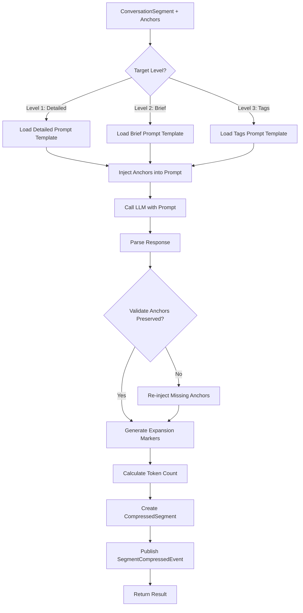

# LDS-01: Feature Design Specification — Hierarchical Summarizer

## 1. Metadata & Categorization

| Field | Value | Description |
| :--- | :--- | :--- |
| **Feature ID** | `COMP-04` | Matches the Roadmap ID. |
| **Feature Name** | Hierarchical Summarizer | The internal display name. |
| **Target Version** | `v0.7.9d` | The semantic version target. |
| **Module Scope** | `Lexichord.Modules.Agents` | The specific DLL/Project this code lives in. |
| **Swimlane** | Memory | The functional vertical. |
| **License Tier** | Writer Pro | The minimum license required to load this. |
| **Feature Gate Key** | `Agents.Compression.Summarizer` | The string key used in `ILicenseService`. |
| **Author** | Lexichord Architecture | Primary Architect. |
| **Reviewer** | — | Lead Architect / Peer. |
| **Status** | Draft | Current lifecycle state. |
| **Last Updated** | 2026-02-03 | Date of last modification. |

---

## 2. Executive Summary

### 2.1 The Requirement
With conversation segments identified and anchors extracted, the system needs to compress segment content to each hierarchical level while preserving anchor points verbatim and maintaining semantic fidelity. Different use cases require different compression levels.

### 2.2 The Proposed Solution
Implement `IHierarchicalSummarizer` that compresses conversation segments to each level (Detailed, Brief, Tags) using LLM-based summarization with level-specific prompts. Anchors are injected into summaries verbatim. Expansion markers are generated to enable on-demand detail retrieval.

---

## 3. Architecture & Modular Strategy

### 3.1 Dependencies
*   **Upstream Modules:**
    *   `Lexichord.Host` (Core services)
    *   `Lexichord.Modules.Agents.Compression` (v0.7.9a-c models, segments, anchors)
    *   `IChatCompletionService` (LLM summarization)
    *   `IPromptRenderer` (Template rendering)
*   **NuGet Packages:**
    *   None additional

### 3.2 Licensing Behavior
*   **Load Behavior:**
    *   [x] **Soft Gate:** L1-L2 compression for Writer Pro; L3 (Tags) requires Teams.
*   **Fallback Experience:**
    *   Writer Pro users can compress to Detailed and Brief levels. Teams users unlock Tags level compression.

---

## 4. Data Contract (The API)

```csharp
namespace Lexichord.Modules.Agents.Compression.Abstractions;

/// <summary>
/// Compresses conversation segments to hierarchical summary levels.
/// </summary>
public interface IHierarchicalSummarizer
{
    /// <summary>
    /// Compresses a segment to a specific compression level.
    /// </summary>
    /// <param name="segment">The conversation segment to compress.</param>
    /// <param name="anchors">Anchor points to preserve verbatim.</param>
    /// <param name="targetLevel">The target compression level.</param>
    /// <param name="options">Summarization options.</param>
    /// <param name="ct">Cancellation token.</param>
    /// <returns>Compressed segment at the target level.</returns>
    Task<CompressedSegment> CompressAsync(
        ConversationSegment segment,
        IReadOnlyList<AnchorPoint> anchors,
        CompressionLevel targetLevel,
        SummarizationOptions? options = null,
        CancellationToken ct = default);

    /// <summary>
    /// Compresses a segment to all compression levels simultaneously.
    /// More efficient than calling CompressAsync multiple times.
    /// </summary>
    /// <param name="segment">The conversation segment to compress.</param>
    /// <param name="anchors">Anchor points to preserve verbatim.</param>
    /// <param name="options">Summarization options.</param>
    /// <param name="ct">Cancellation token.</param>
    /// <returns>Dictionary mapping compression level to compressed segment.</returns>
    Task<IReadOnlyDictionary<CompressionLevel, CompressedSegment>> CompressAllLevelsAsync(
        ConversationSegment segment,
        IReadOnlyList<AnchorPoint> anchors,
        SummarizationOptions? options = null,
        CancellationToken ct = default);

    /// <summary>
    /// Validates that a compressed segment maintains semantic fidelity.
    /// </summary>
    /// <param name="original">Original segment.</param>
    /// <param name="compressed">Compressed segment.</param>
    /// <param name="ct">Cancellation token.</param>
    /// <returns>Fidelity score and details.</returns>
    Task<FidelityValidation> ValidateFidelityAsync(
        ConversationSegment original,
        CompressedSegment compressed,
        CancellationToken ct = default);
}

/// <summary>
/// Configuration for summarization behavior.
/// </summary>
public record SummarizationOptions
{
    /// <summary>
    /// Model to use for summarization. Default: configured default model.
    /// </summary>
    public string? ModelId { get; init; }

    /// <summary>
    /// Maximum tokens for the compressed output. Default: varies by level.
    /// </summary>
    public int? MaxOutputTokens { get; init; }

    /// <summary>
    /// Temperature for LLM generation. Default: 0.3 (low creativity).
    /// </summary>
    public float Temperature { get; init; } = 0.3f;

    /// <summary>
    /// Whether to generate expansion markers. Default: true.
    /// </summary>
    public bool GenerateExpansionMarkers { get; init; } = true;

    /// <summary>
    /// Whether to validate anchor preservation. Default: true.
    /// </summary>
    public bool ValidateAnchors { get; init; } = true;

    /// <summary>
    /// Custom prompt template ID (if using non-default prompts).
    /// </summary>
    public string? CustomPromptTemplateId { get; init; }
}

/// <summary>
/// Result of fidelity validation.
/// </summary>
public record FidelityValidation
{
    /// <summary>
    /// Overall fidelity score (0.0-1.0).
    /// </summary>
    public required float OverallScore { get; init; }

    /// <summary>
    /// Percentage of anchors preserved correctly.
    /// </summary>
    public required float AnchorPreservation { get; init; }

    /// <summary>
    /// Factual accuracy score.
    /// </summary>
    public required float FactualAccuracy { get; init; }

    /// <summary>
    /// Context retention score.
    /// </summary>
    public required float ContextRetention { get; init; }

    /// <summary>
    /// Any information that was lost or distorted.
    /// </summary>
    public IReadOnlyList<string>? LostInformation { get; init; }

    /// <summary>
    /// Whether the compression passes minimum quality threshold.
    /// </summary>
    public bool PassesThreshold => OverallScore >= 0.85f && AnchorPreservation >= 1.0f;
}
```

---

## 5. Implementation Logic

### 5.1 Flow Diagram (Mermaid)



### 5.2 Key Algorithmic Logic

**Level-Specific Prompt Templates:**

```yaml
# templates/compression-detailed.yaml
template_id: "compression-detailed"
system_prompt: |
  You are a conversation summarizer creating DETAILED summaries.

  Create a condensed narrative that:
  - Preserves key exchanges and their outcomes
  - Maintains the flow and reasoning of the conversation
  - Keeps specific technical details mentioned
  - Uses approximately 1/3 of the original length

  CRITICAL: You MUST include these anchor points VERBATIM in your summary:
  {{#anchors}}
  - [{{type}}]: "{{content}}"
  {{/anchors}}

  Format expansion markers as: [→more:{{segment_id}}:{{topic}}]

user_prompt: |
  Summarize this conversation segment:

  {{messages}}

---

# templates/compression-brief.yaml
template_id: "compression-brief"
system_prompt: |
  You are a conversation summarizer creating BRIEF summaries.

  Create a high-level overview (2-3 sentences) capturing:
  - The main topic or goal
  - Key decisions made
  - Current state or next steps

  CRITICAL: You MUST include these anchor points VERBATIM:
  {{#anchors}}
  - [{{type}}]: "{{content}}"
  {{/anchors}}

  Format expansion markers as: [→detail:{{segment_id}}]

user_prompt: |
  Create a brief summary of:

  {{messages}}

---

# templates/compression-tags.yaml
template_id: "compression-tags"
system_prompt: |
  Extract topic tags and key entities from this conversation segment.

  Return as a comma-separated list of:
  - Main topics discussed
  - Technologies/tools mentioned
  - File names or code artifacts
  - People or roles mentioned
  - Action verbs (decided, implemented, fixed, etc.)

  CRITICAL: Include these anchors as tags:
  {{#anchors}}
  - {{type}}: {{content | truncate:30}}
  {{/anchors}}

user_prompt: |
  Extract tags from:

  {{messages}}
```

**Compression Implementation:**

```csharp
public async Task<CompressedSegment> CompressAsync(
    ConversationSegment segment,
    IReadOnlyList<AnchorPoint> anchors,
    CompressionLevel targetLevel,
    SummarizationOptions? options,
    CancellationToken ct)
{
    options ??= new SummarizationOptions();

    // License check for Tags level
    if (targetLevel == CompressionLevel.Tags &&
        !await _licenseService.HasFeatureAsync("Agents.Compression.Tags", ct))
    {
        throw new LicenseRequiredException("Agents.Compression.Tags", "Teams");
    }

    // Level 0 (Full) - no compression needed
    if (targetLevel == CompressionLevel.Full)
    {
        return CreateFullSegment(segment, anchors);
    }

    var stopwatch = Stopwatch.StartNew();

    // Load appropriate prompt template
    var templateId = GetTemplateIdForLevel(targetLevel, options.CustomPromptTemplateId);
    var template = await _promptRenderer.LoadTemplateAsync(templateId, ct);

    // Prepare template data
    var templateData = new
    {
        messages = FormatMessagesForPrompt(segment.Messages),
        anchors = anchors.Select(a => new { type = a.Type.ToString(), content = a.Content }),
        segment_id = segment.SegmentId
    };

    // Render prompt
    var prompt = await _promptRenderer.RenderAsync(template, templateData, ct);

    // Call LLM
    var response = await _chatCompletion.CompleteAsync(
        prompt,
        new ChatCompletionOptions
        {
            ModelId = options.ModelId,
            MaxTokens = options.MaxOutputTokens ?? GetDefaultMaxTokens(targetLevel),
            Temperature = options.Temperature
        },
        ct);

    var compressedContent = response.Content;

    // Validate and re-inject anchors if needed
    if (options.ValidateAnchors)
    {
        compressedContent = EnsureAnchorsPresent(compressedContent, anchors);
    }

    // Generate expansion markers
    var markers = options.GenerateExpansionMarkers
        ? GenerateExpansionMarkers(compressedContent, segment.SegmentId, targetLevel)
        : Array.Empty<ExpansionMarker>();

    var tokenCount = await _tokenCounter.CountAsync(compressedContent, ct);

    var compressed = new CompressedSegment
    {
        SegmentId = segment.SegmentId,
        ConversationId = segment.Messages.FirstOrDefault()?.ConversationId ?? "",
        Level = targetLevel,
        Content = compressedContent,
        Anchors = anchors,
        ExpansionMarkers = markers,
        TokenCount = tokenCount,
        OriginalTokenCount = segment.TokenCount,
        CompressedAt = DateTimeOffset.UtcNow,
        TopicLabel = segment.TopicLabel
    };

    _logger.LogInformation(
        "[COMP:SUM] Compressed segment {SegmentId} to level {Level}: {OriginalTokens}→{CompressedTokens} tokens (ratio={Ratio:F1}x)",
        segment.SegmentId, targetLevel, segment.TokenCount, tokenCount, compressed.CompressionRatio);

    await _mediator.Publish(new SegmentCompressedEvent(compressed, stopwatch.Elapsed), ct);

    return compressed;
}
```

**Anchor Preservation Validation:**

```csharp
private string EnsureAnchorsPresent(string content, IReadOnlyList<AnchorPoint> anchors)
{
    var missingAnchors = anchors
        .Where(a => !content.Contains(a.Content, StringComparison.OrdinalIgnoreCase))
        .ToList();

    if (missingAnchors.Count == 0)
        return content;

    _logger.LogWarning(
        "[COMP:SUM] {Count} anchors missing from summary, re-injecting",
        missingAnchors.Count);

    // Append missing anchors at the end with clear formatting
    var anchorSection = new StringBuilder();
    anchorSection.AppendLine();
    anchorSection.AppendLine("**Key Points:**");
    foreach (var anchor in missingAnchors)
    {
        anchorSection.AppendLine($"- [{anchor.Type}]: {anchor.Content}");
    }

    return content + anchorSection.ToString();
}
```

**Expansion Marker Generation:**

```csharp
private IReadOnlyList<ExpansionMarker> GenerateExpansionMarkers(
    string content,
    string segmentId,
    CompressionLevel level)
{
    var markers = new List<ExpansionMarker>();
    var pattern = level switch
    {
        CompressionLevel.Detailed => @"\[→more:([^:]+):([^\]]+)\]",
        CompressionLevel.Brief => @"\[→detail:([^\]]+)\]",
        CompressionLevel.Tags => null, // Tags don't have expansion markers
        _ => null
    };

    if (pattern == null)
        return markers;

    var regex = new Regex(pattern);
    foreach (Match match in regex.Matches(content))
    {
        var targetLevel = level switch
        {
            CompressionLevel.Detailed => CompressionLevel.Full,
            CompressionLevel.Brief => CompressionLevel.Detailed,
            _ => CompressionLevel.Full
        };

        markers.Add(new ExpansionMarker
        {
            MarkerId = Guid.NewGuid().ToString("N")[..8],
            Label = match.Groups.Count > 2 ? match.Groups[2].Value : "More detail",
            TargetLevel = targetLevel,
            StartOffset = match.Index,
            EndOffset = match.Index + match.Length,
            SourceSegmentId = segmentId
        });
    }

    return markers;
}
```

---

## 6. Data Persistence (Database)

*   **Migration ID:** None required (storage handled in v0.7.9e)
*   **Module Schema:** N/A
*   **New Tables / Columns:** None

---

## 7. UI/UX Specifications

### 7.1 Visual Components
*   **Location:** No direct UI (internal service)
*   **Expansion Markers:** In conversation view, markers appear as clickable "..." or "[more]"
*   **Debug Panel:** Show compression ratio and fidelity score

### 7.2 Accessibility (A11y)
*   Expansion markers MUST be keyboard activatable
*   Screen readers MUST announce "Expand for more detail"

---

## 8. Observability & Logging

*   **Metric:** `Agents.Compression.Summarization.Duration` (Timer by level)
*   **Metric:** `Agents.Compression.Summarization.CompressionRatio` (Histogram by level)
*   **Metric:** `Agents.Compression.Summarization.LlmTokens` (Counter)
*   **Metric:** `Agents.Compression.Summarization.FidelityScore` (Histogram)

*   **Log (Debug):** `[COMP:SUM] Compressing segment {SegmentId} to level {Level}`
*   **Log (Info):** `[COMP:SUM] Compressed {SegmentId}: {Original}→{Compressed} tokens (ratio={Ratio}x)`
*   **Log (Warn):** `[COMP:SUM] {Count} anchors missing, re-injecting`
*   **Log (Warn):** `[COMP:SUM] Fidelity score {Score} below threshold for {SegmentId}`

---

## 9. Security & Safety

*   **PII Risk:** Medium — Content is sent to LLM. Use configured provider.
*   **Token Cost:** Track LLM token usage for billing.
*   **Fidelity:** Low fidelity scores trigger warnings; critical anchors always preserved.

---

## 10. Acceptance Criteria (QA)

1.  **[Functional]** Level 1 (Detailed) compression SHALL achieve approximately 3:1 ratio.

2.  **[Functional]** Level 2 (Brief) compression SHALL achieve approximately 10:1 ratio.

3.  **[Functional]** Level 3 (Tags) compression SHALL achieve approximately 50:1 ratio.

4.  **[Anchors]** All anchors SHALL appear verbatim in compressed output.

5.  **[Markers]** Expansion markers SHALL be generated for Level 1 and Level 2.

6.  **[Fidelity]** Fidelity score SHALL be >= 0.85 for valid compressions.

7.  **[Licensing]** Level 3 (Tags) SHALL require Teams license.

8.  **[Performance]** Compression SHALL complete in < 500ms per segment (excluding LLM latency).

---

## 11. Test Scenarios

### 11.1 Unit Tests

```gherkin
Scenario: Compress to Detailed level
    Given a segment with 1000 tokens
    When CompressAsync is called with targetLevel=Detailed
    Then the output SHALL have approximately 333 tokens
    And all anchors SHALL be present verbatim

Scenario: Compress to Brief level
    Given a segment with 1000 tokens
    When CompressAsync is called with targetLevel=Brief
    Then the output SHALL have approximately 100 tokens
    And key decisions and commitments SHALL be preserved

Scenario: Compress to Tags level
    Given a segment discussing "React", "PostgreSQL", and "deployment"
    When CompressAsync is called with targetLevel=Tags
    Then the output SHALL contain these topic tags
    And anchor content SHALL appear as tags

Scenario: Missing anchor re-injection
    Given an LLM response missing anchor "I will fix the bug"
    When anchor validation runs
    Then the anchor SHALL be appended to the content
    And a warning SHALL be logged

Scenario: Expansion markers generated
    Given compression to Brief level
    When markers are generated
    Then markers SHALL point to Detailed level
    And markers SHALL be parseable from content
```

### 11.2 Integration Tests

```gherkin
Scenario: Full compression pipeline
    Given a 50-message conversation segment
    When CompressAllLevelsAsync is called
    Then all 4 levels SHALL be returned
    And each level SHALL have increasing compression
    And Level 0 SHALL be the original content

Scenario: Fidelity validation
    Given a compressed segment
    When ValidateFidelityAsync is called
    Then a fidelity score SHALL be returned
    And anchor preservation SHALL be 100%
```
