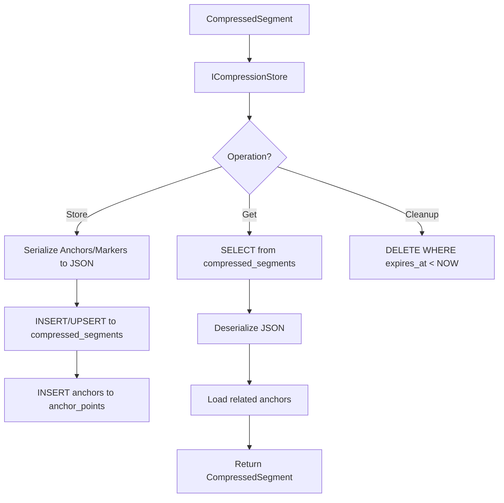

# LDS-01: Feature Design Specification — Compression Storage

## 1. Metadata & Categorization

| Field | Value | Description |
| :--- | :--- | :--- |
| **Feature ID** | `COMP-05` | Matches the Roadmap ID. |
| **Feature Name** | Compression Storage | The internal display name. |
| **Target Version** | `v0.7.9e` | The semantic version target. |
| **Module Scope** | `Lexichord.Modules.Agents` | The specific DLL/Project this code lives in. |
| **Swimlane** | Memory | The functional vertical. |
| **License Tier** | Writer Pro | The minimum license required to load this. |
| **Feature Gate Key** | `Agents.Compression.Storage` | The string key used in `ILicenseService`. |
| **Author** | Lexichord Architecture | Primary Architect. |
| **Reviewer** | — | Lead Architect / Peer. |
| **Status** | Draft | Current lifecycle state. |
| **Last Updated** | 2026-02-03 | Date of last modification. |

---

## 2. Executive Summary

### 2.1 The Requirement
Compressed segments and anchor points need persistent storage for retrieval, expansion, and cross-session continuity. Without proper storage, compressions would need to be regenerated each time, wasting LLM tokens and time.

### 2.2 The Proposed Solution
Implement `ICompressionStore` providing CRUD operations for compressed segments with efficient retrieval by conversation and compression level. Include TTL-based cleanup for old compressions and support for anchor point queries.

---

## 3. Architecture & Modular Strategy

### 3.1 Dependencies
*   **Upstream Modules:**
    *   `Lexichord.Host` (Database infrastructure)
    *   `Lexichord.Modules.Agents.Compression` (v0.7.9a-d models)
*   **NuGet Packages:**
    *   `FluentMigrator` (Schema migrations)
    *   `Dapper` (Data access)

### 3.2 Licensing Behavior
*   **Load Behavior:**
    *   [x] **Soft Gate:** Storage available to Writer Pro; extended retention for Teams+.
*   **Fallback Experience:**
    *   Writer Pro: 7-day retention. Teams: 30-day retention. Enterprise: configurable/unlimited.

---

## 4. Data Contract (The API)

```csharp
namespace Lexichord.Modules.Agents.Compression.Abstractions;

/// <summary>
/// Persistent storage for compressed conversation segments.
/// </summary>
public interface ICompressionStore
{
    /// <summary>
    /// Stores a compressed segment.
    /// </summary>
    Task StoreAsync(CompressedSegment segment, CancellationToken ct = default);

    /// <summary>
    /// Stores multiple compressed segments (batch operation).
    /// </summary>
    Task StoreBatchAsync(IEnumerable<CompressedSegment> segments, CancellationToken ct = default);

    /// <summary>
    /// Retrieves a compressed segment by ID and level.
    /// </summary>
    Task<CompressedSegment?> GetAsync(
        string segmentId,
        CompressionLevel level,
        CancellationToken ct = default);

    /// <summary>
    /// Retrieves all compression levels for a segment.
    /// </summary>
    Task<IReadOnlyDictionary<CompressionLevel, CompressedSegment>> GetAllLevelsAsync(
        string segmentId,
        CancellationToken ct = default);

    /// <summary>
    /// Retrieves all segments for a conversation at a specific level.
    /// </summary>
    Task<IReadOnlyList<CompressedSegment>> GetConversationSegmentsAsync(
        string conversationId,
        CompressionLevel level,
        CancellationToken ct = default);

    /// <summary>
    /// Retrieves all anchor points for a conversation.
    /// </summary>
    Task<IReadOnlyList<AnchorPoint>> GetAnchorsAsync(
        string conversationId,
        CancellationToken ct = default);

    /// <summary>
    /// Retrieves anchors filtered by type.
    /// </summary>
    Task<IReadOnlyList<AnchorPoint>> GetAnchorsByTypeAsync(
        string conversationId,
        AnchorType type,
        CancellationToken ct = default);

    /// <summary>
    /// Deletes all compressions for a conversation.
    /// </summary>
    Task DeleteConversationAsync(string conversationId, CancellationToken ct = default);

    /// <summary>
    /// Deletes expired compressions based on TTL.
    /// </summary>
    Task CleanupExpiredAsync(CancellationToken ct = default);

    /// <summary>
    /// Gets storage statistics for a conversation.
    /// </summary>
    Task<CompressionStorageStats> GetStatsAsync(
        string? conversationId = null,
        CancellationToken ct = default);
}

/// <summary>
/// Storage statistics for compression data.
/// </summary>
public record CompressionStorageStats
{
    public int TotalSegments { get; init; }
    public int TotalAnchors { get; init; }
    public long TotalStorageBytes { get; init; }
    public IReadOnlyDictionary<CompressionLevel, int> SegmentsByLevel { get; init; } = new Dictionary<CompressionLevel, int>();
    public IReadOnlyDictionary<AnchorType, int> AnchorsByType { get; init; } = new Dictionary<AnchorType, int>();
    public DateTimeOffset? OldestSegment { get; init; }
    public DateTimeOffset? NewestSegment { get; init; }
}
```

---

## 5. Implementation Logic

### 5.1 Flow Diagram (Mermaid)



---

## 6. Data Persistence (Database)

*   **Migration ID:** `20260203_1600_AddCompressionStorageTables`
*   **Module Schema:** `agents`

### Schema Definition

```sql
-- Migration: 20260203_1600_AddCompressionStorageTables

CREATE TABLE compressed_segments (
    id UUID PRIMARY KEY DEFAULT gen_random_uuid(),
    conversation_id TEXT NOT NULL,
    segment_id TEXT NOT NULL,
    compression_level INTEGER NOT NULL,
    content TEXT NOT NULL,
    anchors JSONB NOT NULL DEFAULT '[]',
    expansion_markers JSONB NOT NULL DEFAULT '[]',
    token_count INTEGER NOT NULL,
    original_token_count INTEGER NOT NULL,
    topic_label TEXT,
    compressed_at TIMESTAMPTZ NOT NULL DEFAULT NOW(),
    expires_at TIMESTAMPTZ,
    CONSTRAINT uq_segment_level UNIQUE(conversation_id, segment_id, compression_level)
);

CREATE INDEX idx_compressed_segments_conversation
    ON compressed_segments(conversation_id, compression_level);
CREATE INDEX idx_compressed_segments_expires
    ON compressed_segments(expires_at) WHERE expires_at IS NOT NULL;
CREATE INDEX idx_compressed_segments_segment
    ON compressed_segments(segment_id);

-- Separate table for efficient anchor queries
CREATE TABLE anchor_points (
    id UUID PRIMARY KEY DEFAULT gen_random_uuid(),
    segment_id UUID NOT NULL REFERENCES compressed_segments(id) ON DELETE CASCADE,
    conversation_id TEXT NOT NULL,
    anchor_type TEXT NOT NULL,
    content TEXT NOT NULL,
    importance REAL NOT NULL,
    original_position INTEGER NOT NULL,
    source_message_id TEXT,
    context TEXT,
    created_at TIMESTAMPTZ NOT NULL DEFAULT NOW()
);

CREATE INDEX idx_anchor_points_conversation
    ON anchor_points(conversation_id);
CREATE INDEX idx_anchor_points_type
    ON anchor_points(conversation_id, anchor_type);
CREATE INDEX idx_anchor_points_importance
    ON anchor_points(conversation_id, importance DESC);

COMMENT ON TABLE compressed_segments IS 'Stores compressed conversation segments at multiple compression levels';
COMMENT ON TABLE anchor_points IS 'Stores anchor points extracted from conversation segments';
```

### FluentMigrator Implementation

```csharp
[Migration(202602031600)]
public class AddCompressionStorageTables : Migration
{
    public override void Up()
    {
        Create.Table("compressed_segments")
            .WithColumn("id").AsGuid().PrimaryKey().WithDefault(SystemMethods.NewGuid)
            .WithColumn("conversation_id").AsString(100).NotNullable()
            .WithColumn("segment_id").AsString(100).NotNullable()
            .WithColumn("compression_level").AsInt32().NotNullable()
            .WithColumn("content").AsString(int.MaxValue).NotNullable()
            .WithColumn("anchors").AsCustom("JSONB").NotNullable().WithDefaultValue("[]")
            .WithColumn("expansion_markers").AsCustom("JSONB").NotNullable().WithDefaultValue("[]")
            .WithColumn("token_count").AsInt32().NotNullable()
            .WithColumn("original_token_count").AsInt32().NotNullable()
            .WithColumn("topic_label").AsString(200).Nullable()
            .WithColumn("compressed_at").AsDateTimeOffset().NotNullable().WithDefault(SystemMethods.CurrentUTCDateTime)
            .WithColumn("expires_at").AsDateTimeOffset().Nullable();

        Create.UniqueConstraint("uq_segment_level")
            .OnTable("compressed_segments")
            .Columns("conversation_id", "segment_id", "compression_level");

        Create.Index("idx_compressed_segments_conversation")
            .OnTable("compressed_segments")
            .OnColumn("conversation_id").Ascending()
            .OnColumn("compression_level").Ascending();

        Create.Table("anchor_points")
            .WithColumn("id").AsGuid().PrimaryKey().WithDefault(SystemMethods.NewGuid)
            .WithColumn("segment_id").AsGuid().NotNullable()
                .ForeignKey("fk_anchor_segment", "compressed_segments", "id").OnDelete(Rule.Cascade)
            .WithColumn("conversation_id").AsString(100).NotNullable()
            .WithColumn("anchor_type").AsString(50).NotNullable()
            .WithColumn("content").AsString(2000).NotNullable()
            .WithColumn("importance").AsFloat().NotNullable()
            .WithColumn("original_position").AsInt32().NotNullable()
            .WithColumn("source_message_id").AsString(100).Nullable()
            .WithColumn("context").AsString(500).Nullable()
            .WithColumn("created_at").AsDateTimeOffset().NotNullable().WithDefault(SystemMethods.CurrentUTCDateTime);

        Create.Index("idx_anchor_points_conversation")
            .OnTable("anchor_points")
            .OnColumn("conversation_id");

        Create.Index("idx_anchor_points_type")
            .OnTable("anchor_points")
            .OnColumn("conversation_id").Ascending()
            .OnColumn("anchor_type").Ascending();
    }

    public override void Down()
    {
        Delete.Table("anchor_points");
        Delete.Table("compressed_segments");
    }
}
```

---

## 7. UI/UX Specifications

### 7.1 Visual Components
*   **Location:** No direct UI (internal storage)
*   **Admin Panel:** Settings > Storage > Compression Cache
    *   Total storage used
    *   Segments by conversation
    *   Cleanup controls

### 7.2 Accessibility (A11y)
*   Storage statistics MUST be readable by screen readers

---

## 8. Observability & Logging

*   **Metric:** `Agents.Compression.Storage.SegmentCount` (Gauge)
*   **Metric:** `Agents.Compression.Storage.AnchorCount` (Gauge)
*   **Metric:** `Agents.Compression.Storage.SizeBytes` (Gauge)
*   **Metric:** `Agents.Compression.Storage.CleanupCount` (Counter)

*   **Log (Debug):** `[COMP:STORE] Storing segment {SegmentId} at level {Level}`
*   **Log (Info):** `[COMP:STORE] Retrieved {Count} segments for conversation {ConversationId}`
*   **Log (Info):** `[COMP:STORE] Cleaned up {Count} expired segments`

---

## 9. Security & Safety

*   **PII Risk:** Medium — Compressed content may contain PII. Apply encryption at rest.
*   **Data Retention:** Enforce TTL based on license tier.
*   **Cascade Delete:** Deleting conversation deletes all related compressions.

---

## 10. Acceptance Criteria (QA)

1.  **[Functional]** `StoreAsync` SHALL persist a compressed segment to the database.

2.  **[Functional]** `GetAsync` SHALL retrieve a segment by ID and level.

3.  **[Functional]** `GetConversationSegmentsAsync` SHALL return all segments for a conversation at the specified level.

4.  **[Functional]** `GetAnchorsAsync` SHALL return all anchors for a conversation.

5.  **[Cleanup]** `CleanupExpiredAsync` SHALL delete segments where `expires_at < NOW()`.

6.  **[Unique]** Storing a segment with the same (conversation_id, segment_id, level) SHALL update the existing record.

7.  **[Cascade]** Deleting a compressed_segment SHALL delete its anchor_points.

---

## 11. Test Scenarios

### 11.1 Unit Tests

```gherkin
Scenario: Store and retrieve segment
    Given a compressed segment at level Brief
    When StoreAsync is called
    And GetAsync is called with the same ID and level
    Then the retrieved segment SHALL match the stored segment

Scenario: Get all levels for segment
    Given a segment stored at levels Full, Detailed, and Brief
    When GetAllLevelsAsync is called
    Then a dictionary with 3 entries SHALL be returned

Scenario: Get anchors by type
    Given anchors of types Commitment and Decision
    When GetAnchorsByTypeAsync is called with type=Commitment
    Then only Commitment anchors SHALL be returned

Scenario: Cleanup expired segments
    Given segments with expires_at in the past
    When CleanupExpiredAsync is called
    Then those segments SHALL be deleted
    And their anchors SHALL be deleted (cascade)
```

### 11.2 Integration Tests

```gherkin
Scenario: Upsert existing segment
    Given a segment already stored at level Brief
    When StoreAsync is called with updated content
    Then the segment SHALL be updated (not duplicated)

Scenario: Foreign key cascade
    Given a segment with 5 anchor_points
    When the segment is deleted
    Then all 5 anchor_points SHALL be deleted
```
