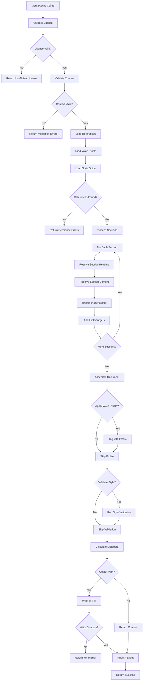

# LCS-DES-081d: Design Specification — Merge Engine

## 1. Metadata & Categorization

| Field | Value | Description |
| :--- | :--- | :--- |
| **Feature ID** | `PUB-081d` | Sub-part of PUB-081 |
| **Feature Name** | `Template Merge Engine` | Document generation from templates |
| **Target Version** | `v0.8.1d` | Fourth sub-part of v0.8.1 |
| **Module Scope** | `Lexichord.Modules.Publishing` | Publishing module |
| **Swimlane** | `Publisher` | Part of Publisher vertical |
| **License Tier** | `WriterPro` | Merge operations require WriterPro |
| **Feature Gate Key** | `FeatureFlags.Publishing.Templates` | License check key |
| **Author** | Lead Architect | |
| **Status** | `Draft` | |
| **Last Updated** | `2026-01-27` | |
| **Parent Document** | [LCS-DES-081-INDEX](./LCS-DES-081-INDEX.md) | |
| **Scope Breakdown** | [LCS-SBD-081 Section 3.4](./LCS-SBD-081.md#34-v081d-merge-engine) | |

---

## 2. Executive Summary

### 2.1 The Requirement

Once a user selects a template and provides variable values, the system must generate a complete document. The merge engine must:

- Combine template structure with resolved variables
- Apply Voice Profile settings to the generated content
- Validate content against Style Guide rules
- Handle placeholder content (keep, remove, or highlight)
- Support multiple output formats (Markdown, HTML, plain text)
- Provide progress feedback for long operations
- Report any warnings or issues during generation

### 2.2 The Proposed Solution

Implement a Merge Engine that:

1. **Validates** — Checks license, variable context, and template references
2. **Resolves** — Applies variable resolver to all template content
3. **Structures** — Builds document from section hierarchy
4. **Applies Voice Profile** — Tags content with Voice Profile metadata
5. **Validates Style** — Checks generated content against Style Guide
6. **Formats** — Outputs to requested format (Markdown, HTML, text)
7. **Persists** — Optionally writes to file system

---

## 3. Architecture & Modular Strategy

### 3.1 Dependencies

#### 3.1.1 Internal Dependencies

| Interface | Source Version | Purpose |
| :--- | :--- | :--- |
| `DocumentTemplate` | v0.8.1a | Template structure |
| `ITemplateRepository` | v0.8.1a | Load template data |
| `IVariableResolver` | v0.8.1c | Resolve variables |
| `VariableContext` | v0.8.1c | Variable values |
| `VoiceProfile` | v0.3.4a | Voice Profile data |
| `IVoiceProfileRepository` | v0.3.4d | Load Voice Profiles |
| `StyleGuide` | v0.2.1b | Style Guide data |
| `IStyleGuideRepository` | v0.2.2b | Load Style Guides |
| `ILintingOrchestrator` | v0.2.3a | Style validation |
| `ILicenseContext` | v0.0.4c | License validation |
| `IFileSystemService` | v0.0.5c | File operations |
| `IMediator` | v0.0.7a | Publish events |

### 3.2 Licensing Behavior

- **Preview Merge:** WriterPro+ (preview without file creation)
- **Full Merge:** WriterPro+ (with file creation)
- **Batch Merge:** Teams+ (future feature)

---

## 4. Data Contract (The API)

### 4.1 Merge Engine Interface

```csharp
namespace Lexichord.Modules.Publishing.Merge;

/// <summary>
/// Engine that merges templates with variable values to produce documents.
/// Handles the complete pipeline from template to output document.
/// </summary>
public interface IMergeEngine
{
    /// <summary>
    /// Merges a template with variable values to create a new document.
    /// This is the main entry point for document generation.
    /// </summary>
    /// <param name="template">The template to use.</param>
    /// <param name="context">Variable context with user-provided values.</param>
    /// <param name="options">Merge options controlling behavior.</param>
    /// <param name="progress">Optional progress reporter.</param>
    /// <param name="ct">Cancellation token.</param>
    /// <returns>The merge result with generated document.</returns>
    Task<MergeResult> MergeAsync(
        DocumentTemplate template,
        VariableContext context,
        MergeOptions? options = null,
        IProgress<MergeProgress>? progress = null,
        CancellationToken ct = default);

    /// <summary>
    /// Merges a template by ID.
    /// Loads the template from the repository before merging.
    /// </summary>
    /// <param name="templateId">Template identifier.</param>
    /// <param name="context">Variable context.</param>
    /// <param name="options">Merge options.</param>
    /// <param name="progress">Progress reporter.</param>
    /// <param name="ct">Cancellation token.</param>
    /// <returns>The merge result.</returns>
    Task<MergeResult> MergeByIdAsync(
        Guid templateId,
        VariableContext context,
        MergeOptions? options = null,
        IProgress<MergeProgress>? progress = null,
        CancellationToken ct = default);

    /// <summary>
    /// Previews a merge without creating a document file.
    /// Useful for real-time preview in the Variable Editor.
    /// </summary>
    /// <param name="template">The template to preview.</param>
    /// <param name="context">Variable context with current values.</param>
    /// <param name="ct">Cancellation token.</param>
    /// <returns>Preview with resolved content and statistics.</returns>
    Task<MergePreview> PreviewAsync(
        DocumentTemplate template,
        VariableContext context,
        CancellationToken ct = default);

    /// <summary>
    /// Validates that a merge can be performed.
    /// Checks license, variable context, and template references.
    /// </summary>
    /// <param name="template">Template to validate.</param>
    /// <param name="context">Variable context to validate.</param>
    /// <param name="ct">Cancellation token.</param>
    /// <returns>Validation result with any errors.</returns>
    Task<MergeValidationResult> ValidateAsync(
        DocumentTemplate template,
        VariableContext context,
        CancellationToken ct = default);

    /// <summary>
    /// Gets the estimated document statistics without full merge.
    /// </summary>
    /// <param name="template">Template to analyze.</param>
    /// <param name="context">Variable context.</param>
    /// <returns>Estimated statistics.</returns>
    MergeEstimate GetEstimate(DocumentTemplate template, VariableContext context);
}
```

### 4.2 Merge Options and Results

```csharp
namespace Lexichord.Modules.Publishing.Merge;

/// <summary>
/// Options controlling merge behavior.
/// </summary>
public record MergeOptions
{
    /// <summary>
    /// How to handle placeholder content in sections.
    /// Placeholders are content like "{{PlaceholderName:Write your intro here...}}".
    /// </summary>
    public PlaceholderHandling PlaceholderHandling { get; init; } = PlaceholderHandling.Keep;

    /// <summary>
    /// Whether to apply the template's Voice Profile to the document.
    /// Voice Profile metadata is embedded in the document.
    /// </summary>
    public bool ApplyVoiceProfile { get; init; } = true;

    /// <summary>
    /// Whether to validate the generated content against the Style Guide.
    /// Violations are reported as warnings in the result.
    /// </summary>
    public bool ValidateStyleGuide { get; init; } = true;

    /// <summary>
    /// Output format for the generated document.
    /// </summary>
    public DocumentFormat OutputFormat { get; init; } = DocumentFormat.Markdown;

    /// <summary>
    /// Whether to include section hints as HTML/Markdown comments.
    /// </summary>
    public bool IncludeSectionHints { get; init; } = true;

    /// <summary>
    /// Whether to include word count targets as comments.
    /// </summary>
    public bool IncludeWordCountTargets { get; init; } = true;

    /// <summary>
    /// Whether to include template metadata as document header comment.
    /// </summary>
    public bool IncludeTemplateMetadata { get; init; } = true;

    /// <summary>
    /// Whether to include document statistics as footer comment.
    /// </summary>
    public bool IncludeStatistics { get; init; } = true;

    /// <summary>
    /// Output file path. If null, content is returned but not written.
    /// </summary>
    public string? OutputPath { get; init; }

    /// <summary>
    /// Whether to open the document after creation.
    /// Only applies when OutputPath is specified.
    /// </summary>
    public bool OpenAfterCreate { get; init; } = true;

    /// <summary>
    /// Whether to overwrite existing file at OutputPath.
    /// If false and file exists, returns error.
    /// </summary>
    public bool OverwriteExisting { get; init; } = false;

    /// <summary>
    /// Custom CSS to embed in HTML output.
    /// Only applies when OutputFormat is Html.
    /// </summary>
    public string? CustomCss { get; init; }

    /// <summary>
    /// Whether to include optional sections (IsRequired=false).
    /// </summary>
    public bool IncludeOptionalSections { get; init; } = true;

    /// <summary>
    /// Default options for most use cases.
    /// </summary>
    public static MergeOptions Default => new();

    /// <summary>
    /// Options for preview (no file output, minimal processing).
    /// </summary>
    public static MergeOptions Preview => new()
    {
        ApplyVoiceProfile = false,
        ValidateStyleGuide = false,
        IncludeSectionHints = false,
        IncludeWordCountTargets = false,
        IncludeTemplateMetadata = false,
        IncludeStatistics = false
    };
}

/// <summary>
/// How to handle placeholder content in sections.
/// </summary>
public enum PlaceholderHandling
{
    /// <summary>
    /// Keep placeholder text as-is for user to replace.
    /// "{{Intro:Write your intro here...}}" becomes "Write your intro here..."
    /// </summary>
    Keep,

    /// <summary>
    /// Remove placeholder text, leaving section headers only.
    /// "{{Intro:Write your intro here...}}" becomes ""
    /// </summary>
    Remove,

    /// <summary>
    /// Highlight placeholder text with visible markers.
    /// "{{Intro:Write your intro here...}}" becomes "**[TODO: Write your intro here...]**"
    /// </summary>
    Highlight,

    /// <summary>
    /// Convert placeholders to comments.
    /// "{{Intro:Write your intro here...}}" becomes "<!-- TODO: Write your intro here... -->"
    /// </summary>
    Comment
}

/// <summary>
/// Output document format.
/// </summary>
public enum DocumentFormat
{
    /// <summary>Markdown format (.md).</summary>
    Markdown,

    /// <summary>HTML format (.html).</summary>
    Html,

    /// <summary>Plain text format (.txt).</summary>
    PlainText
}

/// <summary>
/// Result of a template merge operation.
/// </summary>
public record MergeResult
{
    /// <summary>Whether the merge succeeded without errors.</summary>
    public bool Success { get; init; }

    /// <summary>The generated document content.</summary>
    public string? Content { get; init; }

    /// <summary>Path to the created file (if OutputPath was specified).</summary>
    public string? FilePath { get; init; }

    /// <summary>Metadata about the generated document.</summary>
    public MergeMetadata? Metadata { get; init; }

    /// <summary>Warnings generated during merge (non-fatal issues).</summary>
    public IReadOnlyList<MergeWarning> Warnings { get; init; } = [];

    /// <summary>Error message if merge failed.</summary>
    public string? ErrorMessage { get; init; }

    /// <summary>Error code for programmatic handling.</summary>
    public MergeErrorCode? ErrorCode { get; init; }

    /// <summary>Template that was used.</summary>
    public required Guid TemplateId { get; init; }

    /// <summary>Template name for display.</summary>
    public string? TemplateName { get; init; }

    /// <summary>Timestamp when merge completed.</summary>
    public DateTime MergedAt { get; init; } = DateTime.UtcNow;

    /// <summary>Time taken for merge operation.</summary>
    public TimeSpan Duration { get; init; }

    /// <summary>Creates a successful result.</summary>
    public static MergeResult Succeeded(
        Guid templateId,
        string content,
        MergeMetadata metadata,
        string? filePath = null,
        IReadOnlyList<MergeWarning>? warnings = null) => new()
    {
        Success = true,
        TemplateId = templateId,
        Content = content,
        Metadata = metadata,
        FilePath = filePath,
        Warnings = warnings ?? []
    };

    /// <summary>Creates a failed result.</summary>
    public static MergeResult Failed(
        Guid templateId,
        string errorMessage,
        MergeErrorCode errorCode) => new()
    {
        Success = false,
        TemplateId = templateId,
        ErrorMessage = errorMessage,
        ErrorCode = errorCode
    };
}

/// <summary>
/// Error codes for merge failures.
/// </summary>
public enum MergeErrorCode
{
    /// <summary>Unknown error.</summary>
    Unknown,

    /// <summary>User license insufficient for merge operation.</summary>
    InsufficientLicense,

    /// <summary>Template not found.</summary>
    TemplateNotFound,

    /// <summary>Required variable missing.</summary>
    MissingRequiredVariable,

    /// <summary>Variable value invalid.</summary>
    InvalidVariableValue,

    /// <summary>Referenced Voice Profile not found.</summary>
    VoiceProfileNotFound,

    /// <summary>Referenced Style Guide not found.</summary>
    StyleGuideNotFound,

    /// <summary>Output path invalid or inaccessible.</summary>
    InvalidOutputPath,

    /// <summary>Output file already exists and OverwriteExisting is false.</summary>
    FileAlreadyExists,

    /// <summary>File write failed.</summary>
    FileWriteFailed,

    /// <summary>Operation was cancelled.</summary>
    Cancelled
}

/// <summary>
/// Metadata about a merged document.
/// </summary>
public record MergeMetadata
{
    /// <summary>Total word count of generated document.</summary>
    public int WordCount { get; init; }

    /// <summary>Total character count.</summary>
    public int CharacterCount { get; init; }

    /// <summary>Number of sections generated.</summary>
    public int SectionCount { get; init; }

    /// <summary>Number of variables that were resolved.</summary>
    public int VariablesResolved { get; init; }

    /// <summary>Number of placeholder texts remaining.</summary>
    public int PlaceholdersRemaining { get; init; }

    /// <summary>Voice Profile applied (if any).</summary>
    public Guid? VoiceProfileId { get; init; }

    /// <summary>Voice Profile name for display.</summary>
    public string? VoiceProfileName { get; init; }

    /// <summary>Style Guide validated against (if any).</summary>
    public Guid? StyleGuideId { get; init; }

    /// <summary>Style Guide name for display.</summary>
    public string? StyleGuideName { get; init; }

    /// <summary>Number of style violations found.</summary>
    public int StyleViolations { get; init; }

    /// <summary>Output format used.</summary>
    public DocumentFormat OutputFormat { get; init; }

    /// <summary>Estimated reading time (minutes).</summary>
    public int EstimatedReadingTimeMinutes { get; init; }
}

/// <summary>
/// A warning generated during merge.
/// </summary>
public record MergeWarning
{
    /// <summary>Warning message.</summary>
    public required string Message { get; init; }

    /// <summary>Warning type for categorization.</summary>
    public MergeWarningType Type { get; init; }

    /// <summary>Section ID where warning occurred (if applicable).</summary>
    public string? SectionId { get; init; }

    /// <summary>Variable name related to warning (if applicable).</summary>
    public string? VariableName { get; init; }

    /// <summary>Line number in output (if applicable).</summary>
    public int? LineNumber { get; init; }
}

/// <summary>
/// Types of merge warnings.
/// </summary>
public enum MergeWarningType
{
    /// <summary>Variable has no value, using default or empty.</summary>
    UnresolvedVariable,

    /// <summary>Optional section was skipped.</summary>
    OptionalSectionSkipped,

    /// <summary>Section content below minimum word count.</summary>
    WordCountBelowMinimum,

    /// <summary>Section content above maximum word count.</summary>
    WordCountAboveMaximum,

    /// <summary>Style Guide violation detected.</summary>
    StyleViolation,

    /// <summary>Voice Profile couldn't be fully applied.</summary>
    VoiceProfileMismatch,

    /// <summary>Placeholder content remains in output.</summary>
    PlaceholderRemaining
}

/// <summary>
/// Progress information for merge operations.
/// </summary>
public record MergeProgress
{
    /// <summary>Current stage name.</summary>
    public required string Stage { get; init; }

    /// <summary>Overall percent complete (0-100).</summary>
    public int PercentComplete { get; init; }

    /// <summary>Current section being processed (if applicable).</summary>
    public string? CurrentSection { get; init; }

    /// <summary>Detailed status message.</summary>
    public string? Message { get; init; }
}

/// <summary>
/// Preview of a merge operation.
/// </summary>
public record MergePreview
{
    /// <summary>Preview content with variables resolved.</summary>
    public required string Content { get; init; }

    /// <summary>Variables that were resolved with their values.</summary>
    public IReadOnlyList<ResolvedVariable> ResolvedVariables { get; init; } = [];

    /// <summary>Variables that are missing values.</summary>
    public IReadOnlyList<string> UnresolvedVariables { get; init; } = [];

    /// <summary>Estimated word count of final document.</summary>
    public int EstimatedWordCount { get; init; }

    /// <summary>Whether preview represents a valid document.</summary>
    public bool IsComplete => UnresolvedVariables.Count == 0;
}

/// <summary>
/// A variable with its resolved value for preview.
/// </summary>
public record ResolvedVariable
{
    /// <summary>Variable name.</summary>
    public required string Name { get; init; }

    /// <summary>Resolved value.</summary>
    public required string Value { get; init; }

    /// <summary>Source of the value.</summary>
    public required string Source { get; init; } // "User", "Default", "System"
}

/// <summary>
/// Validation result for a potential merge.
/// </summary>
public record MergeValidationResult
{
    /// <summary>Whether merge can proceed.</summary>
    public bool CanMerge => Errors.Count == 0;

    /// <summary>Errors that prevent merge.</summary>
    public IReadOnlyList<MergeValidationError> Errors { get; init; } = [];

    /// <summary>Warnings that don't prevent merge.</summary>
    public IReadOnlyList<MergeWarning> Warnings { get; init; } = [];

    /// <summary>Creates a successful validation.</summary>
    public static MergeValidationResult Success() => new();

    /// <summary>Creates a failed validation.</summary>
    public static MergeValidationResult Failed(params MergeValidationError[] errors) =>
        new() { Errors = errors };
}

/// <summary>
/// A validation error preventing merge.
/// </summary>
public record MergeValidationError
{
    /// <summary>Error message.</summary>
    public required string Message { get; init; }

    /// <summary>Error type.</summary>
    public MergeValidationErrorType Type { get; init; }
}

/// <summary>
/// Types of merge validation errors.
/// </summary>
public enum MergeValidationErrorType
{
    MissingRequiredVariable,
    InvalidVariableValue,
    TemplateNotFound,
    VoiceProfileNotFound,
    StyleGuideNotFound,
    OutputPathInvalid,
    InsufficientLicense
}

/// <summary>
/// Quick estimate of merge output without full processing.
/// </summary>
public record MergeEstimate
{
    /// <summary>Estimated word count.</summary>
    public int EstimatedWordCount { get; init; }

    /// <summary>Estimated section count.</summary>
    public int SectionCount { get; init; }

    /// <summary>Number of variables to resolve.</summary>
    public int VariableCount { get; init; }

    /// <summary>Estimated processing time (milliseconds).</summary>
    public int EstimatedDurationMs { get; init; }
}
```

---

## 5. Implementation Logic

### 5.1 Merge Pipeline



### 5.2 Section Processing

```csharp
private async Task<string> ProcessSectionAsync(
    TemplateSection section,
    VariableContext context,
    MergeOptions options,
    List<MergeWarning> warnings,
    StringBuilder document,
    CancellationToken ct)
{
    // Check if optional section should be included
    if (!section.IsRequired && !options.IncludeOptionalSections)
    {
        warnings.Add(new MergeWarning
        {
            Message = $"Optional section '{section.Id}' was skipped",
            Type = MergeWarningType.OptionalSectionSkipped,
            SectionId = section.Id
        });
        return string.Empty;
    }

    var sb = new StringBuilder();

    // Resolve and write heading
    var heading = await _variableResolver.ResolveAsync(section.Heading, context, ct);
    var headingPrefix = new string('#', section.HeadingLevel);
    sb.AppendLine($"{headingPrefix} {heading}");
    sb.AppendLine();

    // Add hints if enabled
    if (options.IncludeSectionHints && !string.IsNullOrWhiteSpace(section.Hint))
    {
        sb.AppendLine(FormatComment($"HINT: {section.Hint}", options.OutputFormat));
    }

    // Add word count targets if enabled
    if (options.IncludeWordCountTargets &&
        (section.MinWordCount > 0 || section.MaxWordCount > 0))
    {
        var target = FormatWordCountTarget(section.MinWordCount, section.MaxWordCount);
        sb.AppendLine(FormatComment($"TARGET: {target}", options.OutputFormat));
    }

    // Add optional marker
    if (!section.IsRequired)
    {
        sb.AppendLine(FormatComment("NOTE: This section is optional", options.OutputFormat));
    }

    sb.AppendLine();

    // Process content
    if (!string.IsNullOrWhiteSpace(section.Content))
    {
        var content = await _variableResolver.ResolveAsync(section.Content, context, ct);
        content = HandlePlaceholders(content, options.PlaceholderHandling, warnings, section.Id);

        // Check word count
        var wordCount = CountWords(content);
        if (section.MinWordCount > 0 && wordCount < section.MinWordCount)
        {
            warnings.Add(new MergeWarning
            {
                Message = $"Section '{section.Id}' has {wordCount} words, below minimum of {section.MinWordCount}",
                Type = MergeWarningType.WordCountBelowMinimum,
                SectionId = section.Id
            });
        }
        if (section.MaxWordCount > 0 && wordCount > section.MaxWordCount)
        {
            warnings.Add(new MergeWarning
            {
                Message = $"Section '{section.Id}' has {wordCount} words, above maximum of {section.MaxWordCount}",
                Type = MergeWarningType.WordCountAboveMaximum,
                SectionId = section.Id
            });
        }

        sb.AppendLine(content);
        sb.AppendLine();
    }

    // Process children recursively
    foreach (var child in section.Children)
    {
        var childContent = await ProcessSectionAsync(child, context, options, warnings, document, ct);
        sb.Append(childContent);
    }

    return sb.ToString();
}
```

### 5.3 Placeholder Handling

```csharp
private string HandlePlaceholders(
    string content,
    PlaceholderHandling handling,
    List<MergeWarning> warnings,
    string sectionId)
{
    // Pattern matches: {{PlaceholderName:Placeholder text here...}}
    var pattern = @"\{\{([A-Za-z_][A-Za-z0-9_]*):([^}]+)\}\}";

    return Regex.Replace(content, pattern, match =>
    {
        var name = match.Groups[1].Value;
        var text = match.Groups[2].Value;

        // Record warning about remaining placeholder
        if (handling != PlaceholderHandling.Remove)
        {
            warnings.Add(new MergeWarning
            {
                Message = $"Placeholder '{name}' remains in section '{sectionId}'",
                Type = MergeWarningType.PlaceholderRemaining,
                SectionId = sectionId,
                VariableName = name
            });
        }

        return handling switch
        {
            PlaceholderHandling.Keep => text,
            PlaceholderHandling.Remove => string.Empty,
            PlaceholderHandling.Highlight => $"**[TODO: {text}]**",
            PlaceholderHandling.Comment => $"<!-- TODO: {text} -->",
            _ => text
        };
    });
}
```

### 5.4 Output Format Handling

```csharp
private string FormatComment(string text, DocumentFormat format)
{
    return format switch
    {
        DocumentFormat.Markdown => $"<!-- {text} -->",
        DocumentFormat.Html => $"<!-- {text} -->",
        DocumentFormat.PlainText => $"[{text}]",
        _ => $"<!-- {text} -->"
    };
}

private string FormatDocument(
    string content,
    DocumentTemplate template,
    MergeOptions options,
    MergeMetadata metadata)
{
    var sb = new StringBuilder();

    // Add header metadata
    if (options.IncludeTemplateMetadata)
    {
        sb.AppendLine(FormatComment(
            $"Generated from template: {template.Name} (v{template.Metadata.Version})",
            options.OutputFormat));

        if (metadata.VoiceProfileId.HasValue)
        {
            sb.AppendLine(FormatComment(
                $"Voice Profile: {metadata.VoiceProfileName}",
                options.OutputFormat));
        }

        if (metadata.StyleGuideId.HasValue)
        {
            sb.AppendLine(FormatComment(
                $"Style Guide: {metadata.StyleGuideName}",
                options.OutputFormat));
        }

        sb.AppendLine();
    }

    // Add main content
    sb.Append(content);

    // Add footer statistics
    if (options.IncludeStatistics)
    {
        sb.AppendLine();
        sb.AppendLine(FormatComment("Document Statistics:", options.OutputFormat));
        sb.AppendLine(FormatComment($"- Word count: {metadata.WordCount}", options.OutputFormat));
        sb.AppendLine(FormatComment($"- Sections: {metadata.SectionCount}", options.OutputFormat));
        sb.AppendLine(FormatComment($"- Variables resolved: {metadata.VariablesResolved}", options.OutputFormat));
        sb.AppendLine(FormatComment($"- Placeholders remaining: {metadata.PlaceholdersRemaining}", options.OutputFormat));
        sb.AppendLine(FormatComment($"- Reading time: ~{metadata.EstimatedReadingTimeMinutes} min", options.OutputFormat));
    }

    // Convert to final format
    return options.OutputFormat switch
    {
        DocumentFormat.Html => ConvertToHtml(sb.ToString(), template, options),
        DocumentFormat.PlainText => ConvertToPlainText(sb.ToString()),
        _ => sb.ToString() // Markdown is default
    };
}
```

---

## 6. UI/UX Specifications

### 6.1 Progress Dialog

```text
+------------------------------------------------------------------+
|  Creating Document                                                |
+------------------------------------------------------------------+
|                                                                   |
|  Template: Blog Post                                              |
|                                                                   |
|  [=========================================              ] 75%    |
|                                                                   |
|  Processing section: Main Content                                 |
|                                                                   |
|  Steps:                                                           |
|  [x] Validating license                                           |
|  [x] Validating variables                                         |
|  [x] Loading Voice Profile                                        |
|  [>] Processing sections (3 of 4)                                 |
|  [ ] Validating style                                             |
|  [ ] Writing file                                                 |
|                                                                   |
|                                              [Cancel]             |
+------------------------------------------------------------------+
```

### 6.2 Result Summary

```text
+------------------------------------------------------------------+
|  Document Created Successfully                        [x] Close   |
+------------------------------------------------------------------+
|                                                                   |
|  [Check icon]  Your document has been created!                    |
|                                                                   |
|  File: ~/Documents/my-first-blog-post.md                          |
|                                                                   |
|  Statistics:                                                      |
|  - Word count: 142                                                |
|  - Sections: 6                                                    |
|  - Variables resolved: 5                                          |
|  - Placeholders to complete: 4                                    |
|  - Estimated reading time: ~1 min                                 |
|                                                                   |
|  Warnings (2):                                                    |
|  [!] Introduction section below minimum word count (50)           |
|  [!] Placeholder remains in "Key Point 3" section                 |
|                                                                   |
|                    [Open Document]  [Create Another]  [Done]      |
+------------------------------------------------------------------+
```

---

## 7. Observability & Logging

| Level | Source | Message Template |
| :--- | :--- | :--- |
| Info | MergeEngine | `Starting merge for template {TemplateName} ({TemplateId})` |
| Debug | MergeEngine | `Validating context with {VariableCount} variables` |
| Debug | MergeEngine | `Processing section {SectionId} (level {Level})` |
| Info | MergeEngine | `Merge completed: {WordCount} words, {SectionCount} sections in {Duration}ms` |
| Warning | MergeEngine | `Merge warning: {Message} in section {SectionId}` |
| Error | MergeEngine | `Merge failed: {ErrorCode} - {ErrorMessage}` |
| Info | MergeEngine | `Document written to {FilePath}` |

---

## 8. Security & Safety

| Risk | Level | Mitigation |
| :--- | :--- | :--- |
| Path traversal in OutputPath | High | Validate path is within allowed directories |
| Overwriting important files | Medium | OverwriteExisting option defaults to false |
| Large output causing OOM | Medium | Limit max sections/variables per template |
| Slow merge blocking UI | Medium | Async with cancellation, progress reporting |

---

## 9. Acceptance Criteria

### 9.1 Merge Operations

| # | Given | When | Then |
| :--- | :--- | :--- | :--- |
| 1 | Valid template and context | MergeAsync | Returns Success with content |
| 2 | Core license user | MergeAsync | Returns InsufficientLicense error |
| 3 | Missing required variable | MergeAsync | Returns MissingRequiredVariable error |
| 4 | Template with 4 sections | MergeAsync | Content has 4 sections |
| 5 | Variables in heading | MergeAsync | Heading variables resolved |
| 6 | Variables in content | MergeAsync | Content variables resolved |
| 7 | OutputPath specified | MergeAsync | File created at path |
| 8 | File exists, Overwrite=false | MergeAsync | Returns FileAlreadyExists error |

### 9.2 Options Handling

| # | Given | When | Then |
| :--- | :--- | :--- | :--- |
| 9 | PlaceholderHandling=Keep | Merge | Placeholder text preserved |
| 10 | PlaceholderHandling=Highlight | Merge | Placeholders wrapped in **[TODO:]** |
| 11 | IncludeSectionHints=true | Merge | Hints appear as comments |
| 12 | ApplyVoiceProfile=true | Merge | Profile metadata in header |
| 13 | OutputFormat=Html | Merge | HTML document returned |

### 9.3 Validation and Preview

| # | Given | When | Then |
| :--- | :--- | :--- | :--- |
| 14 | Valid context | ValidateAsync | CanMerge=true |
| 15 | Missing variable | ValidateAsync | CanMerge=false with error |
| 16 | Partial values | PreviewAsync | Preview shows resolved and unresolved |

---

## 10. Deliverable Checklist

| # | Deliverable | Status |
| :--- | :--- | :--- |
| 1 | `IMergeEngine.cs` interface | [ ] |
| 2 | `MergeEngine.cs` implementation | [ ] |
| 3 | `MergeOptions.cs` record | [ ] |
| 4 | `MergeResult.cs` record | [ ] |
| 5 | `MergeMetadata.cs` record | [ ] |
| 6 | `MergeWarning.cs` record | [ ] |
| 7 | `MergeProgress.cs` record | [ ] |
| 8 | `MergePreview.cs` record | [ ] |
| 9 | `MergeValidationResult.cs` record | [ ] |
| 10 | `MarkdownFormatter.cs` | [ ] |
| 11 | `HtmlFormatter.cs` | [ ] |
| 12 | `PlainTextFormatter.cs` | [ ] |
| 13 | `MergeProgressDialog.axaml` | [ ] |
| 14 | `MergeResultDialog.axaml` | [ ] |
| 15 | Unit tests for merge engine | [ ] |
| 16 | Unit tests for formatters | [ ] |
| 17 | Integration tests | [ ] |

---

## 11. Verification Commands

```bash
# Run merge engine tests
dotnet test --filter "Version=v0.8.1d&Category=Unit"

# Test specific scenarios
dotnet test --filter "FullyQualifiedName~MergeEngineTests"
dotnet test --filter "FullyQualifiedName~PlaceholderHandlingTests"
dotnet test --filter "FullyQualifiedName~OutputFormatterTests"

# Integration test
dotnet test --filter "Version=v0.8.1d&Category=Integration"

# Manual verification:
# 1. Select template with all variable types
# 2. Fill in all variables
# 3. Click "Create Document"
# 4. Verify progress dialog shows steps
# 5. Verify result summary shows statistics
# 6. Open created file and verify content
# 7. Verify placeholders handled per option
```

---

## Document History

| Version | Date | Author | Changes |
| :--- | :--- | :--- | :--- |
| 1.0 | 2026-01-27 | Lead Architect | Initial draft |
