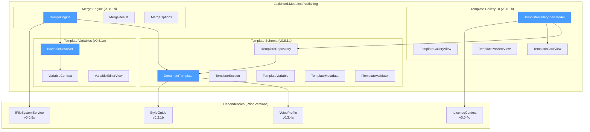
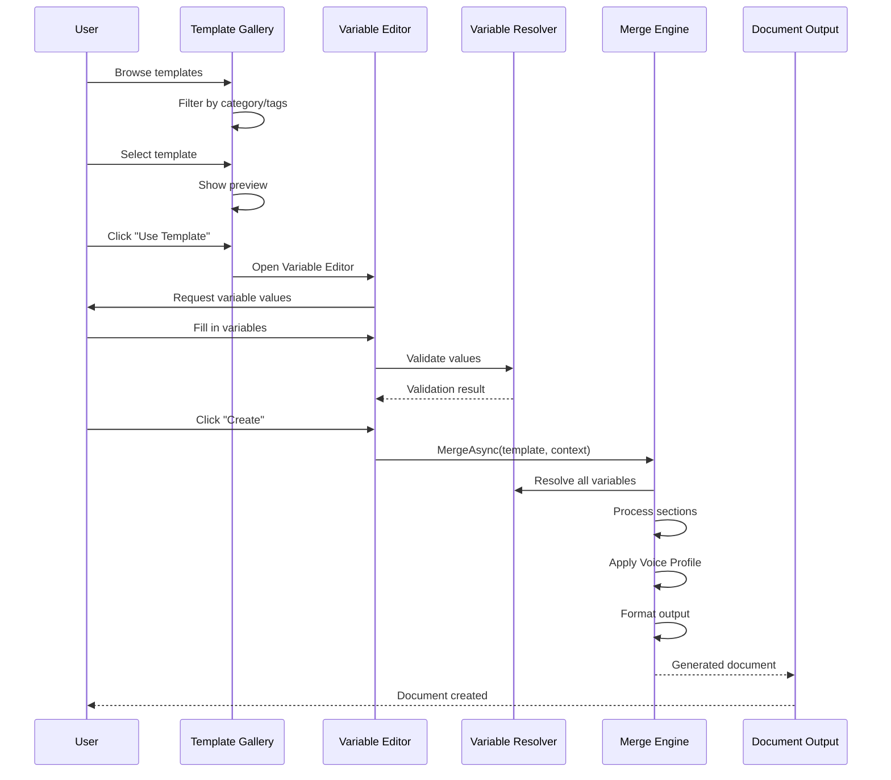

# LCS-DES-081: Design Specification Index — Document Templates

## Document Control

| Field | Value |
| :--- | :--- |
| **Document ID** | LCS-DES-081-INDEX |
| **Feature ID** | PUB-081 |
| **Feature Name** | Document Templates (The Manuscript Blueprints) |
| **Target Version** | v0.8.1 |
| **Module Scope** | Lexichord.Modules.Publishing |
| **Swimlane** | Publisher |
| **License Tier** | WriterPro |
| **Feature Gate Key** | FeatureFlags.Publishing.Templates |
| **Status** | Draft |
| **Last Updated** | 2026-01-27 |

---

## 1. Executive Summary

**v0.8.1** delivers the **Document Templates** — reusable document structures with style presets that enable rapid document scaffolding with consistent formatting, Voice Profiles, and dynamic content placeholders.

### 1.1 The Problem

Writers face several challenges when creating new documents:

- Manually copying and reformatting existing documents wastes time
- Inconsistent structure across similar document types
- Voice Profile and Style Guide settings must be reapplied each time
- No standardized way to share document formats across teams
- Dynamic content (dates, names, project info) requires manual updates

### 1.2 The Solution

Implement a comprehensive template system that:

1. **Defines Structure** — JSON/YAML schemas specify document sections, headings, and content placeholders
2. **Carries Style** — Templates embed Voice Profile and Style Guide references
3. **Resolves Variables** — Dynamic placeholders ({{Author}}, {{Date}}) are replaced during generation
4. **Enables Discovery** — A visual gallery allows browsing, filtering, and previewing templates
5. **Produces Documents** — A merge engine creates complete documents from templates and user input

### 1.3 Business Value

| Value | Description |
| :--- | :--- |
| **Productivity** | Create documents in seconds instead of minutes |
| **Consistency** | All documents from a template share structure and style |
| **Scalability** | Share templates across teams and projects |
| **Flexibility** | Variables adapt content to each document instance |
| **Integration** | Templates connect with Voice Profiles, Style Guides, and AI Agents |
| **Foundation** | Enables batch generation, template marketplace, and multi-format export |

---

## 2. Related Documents

### 2.1 Scope Breakdown Document

The detailed scope breakdown for v0.8.1, including all sub-parts, implementation checklists, user stories, and acceptance criteria:

| Document | Description |
| :--- | :--- |
| **[LCS-SBD-081](./LCS-SBD-081.md)** | Scope Breakdown — Document Templates |

### 2.2 Sub-Part Design Specifications

Each sub-part has its own detailed design specification following the LDS-01 template:

| Sub-Part | Document | Title | Description |
| :--- | :--- | :--- | :--- |
| v0.8.1a | **[LCS-DES-081a](./LCS-DES-081a.md)** | Template Schema | JSON/YAML template definition format |
| v0.8.1b | **[LCS-DES-081b](./LCS-DES-081b.md)** | Template Gallery UI | Browse, preview, select templates |
| v0.8.1c | **[LCS-DES-081c](./LCS-DES-081c.md)** | Template Variables | {{Author}}, {{Date}}, {{Project}} resolution |
| v0.8.1d | **[LCS-DES-081d](./LCS-DES-081d.md)** | Merge Engine | Apply template to new document |

---

## 3. Architecture Overview

### 3.1 Component Diagram



### 3.2 Document Generation Flow



---

## 4. Dependencies

### 4.1 Upstream Dependencies (Prior Versions)

| Interface | Source Version | Purpose |
| :--- | :--- | :--- |
| `VoiceProfile` | v0.3.4a | Templates carry Voice Profile assignments |
| `IVoiceProfileRepository` | v0.3.4d | Load Voice Profiles for templates |
| `StyleGuide` | v0.2.1b | Templates reference Style Guide rules |
| `IStyleGuideRepository` | v0.2.2b | Load Style Guides for validation |
| `IMarkdownParser` | v0.1.3b | Parse template content for preview |
| `IRegionManager` | v0.1.1b | Register Template Gallery UI |
| `ISettingsService` | v0.1.6a | Store template preferences |
| `ILicenseContext` | v0.0.4c | Gate features by license tier |
| `IMediator` | v0.0.7a | Publish template events |
| `IFileSystemService` | v0.0.5c | Read/write template files |

### 4.2 NuGet Packages

| Package | Version | Purpose |
| :--- | :--- | :--- |
| `YamlDotNet` | 16.x | YAML template parsing (NEW) |

### 4.3 Downstream Consumers (Future)

| Version | Feature | Uses From v0.8.1 |
| :--- | :--- | :--- |
| v0.8.2 | Batch Generation | Templates for bulk document creation |
| v0.8.3 | AI Template Suggestions | Template metadata for recommendations |
| v0.8.4 | Template Marketplace | Template import/export |
| v0.8.6 | Multi-Format Export | Templates for DOCX/PDF output |

---

## 5. License Gating Strategy

Document Templates is a **WriterPro** feature.

| Action | Core | Writer | WriterPro | Teams | Enterprise |
| :--- | :--- | :--- | :--- | :--- | :--- |
| View Template Gallery | Y | Y | Y | Y | Y |
| Preview templates | Y | Y | Y | Y | Y |
| Use built-in templates | - | - | Y | Y | Y |
| Create custom templates | - | - | Y | Y | Y |
| Import/Export templates | - | - | Y | Y | Y |
| Template variables | - | - | Y | Y | Y |

**Gating Behavior:**

- Core/Writer users see the gallery but "Use Template" shows upgrade prompt
- Import/Export buttons are disabled with "Upgrade to WriterPro" tooltip
- Custom template creation requires WriterPro

---

## 6. Key Interfaces Summary

### 6.1 Template Schema (v0.8.1a)

| Interface/Record | Purpose |
| :--- | :--- |
| `DocumentTemplate` | Complete template definition |
| `TemplateSection` | Hierarchical content structure |
| `TemplateVariable` | Variable placeholder definition |
| `TemplateMetadata` | Author, version, category information |
| `ITemplateRepository` | Load and save templates |
| `ITemplateValidator` | Validate template definitions |

### 6.2 Template Gallery UI (v0.8.1b)

| Interface/ViewModel | Purpose |
| :--- | :--- |
| `TemplateGalleryViewModel` | Gallery state and filtering |
| `TemplateCardViewModel` | Individual template display |
| `TemplatePreviewViewModel` | Preview rendering |

### 6.3 Template Variables (v0.8.1c)

| Interface/Record | Purpose |
| :--- | :--- |
| `IVariableResolver` | Resolve template variables |
| `VariableContext` | Resolution state and values |
| `VariableReference` | Variable reference in content |

### 6.4 Merge Engine (v0.8.1d)

| Interface/Record | Purpose |
| :--- | :--- |
| `IMergeEngine` | Merge templates to documents |
| `MergeResult` | Generated document and metadata |
| `MergeOptions` | Merge behavior configuration |

---

## 7. Key Test Scenarios Summary

### 7.1 Template Schema (v0.8.1a)

| Scenario | Input | Expected |
| :--- | :--- | :--- |
| Parse valid YAML | Blog post template | DocumentTemplate with 4 sections |
| Parse invalid YAML | Missing required field | Validation errors |
| Validate template | Template with nested sections | IsValid = true |

### 7.2 Template Gallery UI (v0.8.1b)

| Scenario | Action | Expected |
| :--- | :--- | :--- |
| Load gallery | Open Template Gallery | All templates displayed |
| Filter by category | Select "Blog" | Only blog templates shown |
| Search | Type "technical" | Matching templates shown |
| Preview | Click template | Preview panel opens |

### 7.3 Template Variables (v0.8.1c)

| Scenario | Input | Expected |
| :--- | :--- | :--- |
| Basic variable | "Hello, {{Name}}!" + Name=World | "Hello, World!" |
| Default value | "{{Name:Guest}}" + No value | "Guest" |
| Built-in variable | "{{Today}}" | "2026-01-27" |
| Missing required | No value for required var | Validation error |

### 7.4 Merge Engine (v0.8.1d)

| Scenario | Input | Expected |
| :--- | :--- | :--- |
| Simple merge | Blog template + variables | Complete document |
| With Voice Profile | Template with VoiceProfileId | Profile applied |
| With placeholders | Keep option | Placeholders preserved |
| Missing license | Core user | Error result |

---

## 8. Implementation Checklist Summary

| Sub-Part | Tasks | Est. Hours |
| :--- | :--- | :--- |
| v0.8.1a | Template Schema | 13.5 |
| v0.8.1b | Template Gallery UI | 15 |
| v0.8.1c | Template Variables | 12 |
| v0.8.1d | Merge Engine | 14.5 |
| Integration | Full workflow tests, DI registration | 3 |
| **Total** | | **58 hours** |

See [LCS-SBD-081](./LCS-SBD-081.md) Section 4 for the detailed task breakdown.

---

## 9. Success Criteria Summary

| Category | Criterion | Target |
| :--- | :--- | :--- |
| **Performance** | Template loading (100 templates) | < 500ms |
| **Performance** | Gallery filter response | < 100ms |
| **Performance** | Variable resolution (50 vars) | < 50ms |
| **Performance** | Merge operation | < 200ms |
| **Accuracy** | Variable resolution | 100% correct |
| **Coverage** | Unit test coverage | 90%+ |

See [LCS-SBD-081](./LCS-SBD-081.md) Section 9 for full success metrics.

---

## 10. Template File Format Summary

### 10.1 YAML Template Structure

```yaml
id: "guid"
name: "Template Name"
description: "Template description"
schemaVersion: "1.0"

metadata:
  author: "Author Name"
  version: "1.0.0"
  category: "Category"
  tags: ["tag1", "tag2"]

voiceProfileId: "optional-guid"
styleGuideId: "optional-guid"

variables:
  - name: "VariableName"
    type: Text|Date|Select|...
    isRequired: true|false
    defaultValue: "optional"
    prompt: "User prompt"

sections:
  - id: "section-id"
    heading: "Section Title"
    headingLevel: 2
    content: "Markdown content with {{variables}}"
    isRequired: true|false
    hint: "Writer hint"
    minWordCount: 0
    maxWordCount: 0
    children: []
```

### 10.2 Built-in Templates

| Template | Category | Sections | Variables |
| :--- | :--- | :--- | :--- |
| Blog Post | Blog | 4 | 5 |
| Technical Spec | Technical | 8 | 12 |
| Press Release | Marketing | 4 | 6 |
| Meeting Notes | Business | 3 | 4 |
| API Documentation | Technical | 10 | 15 |

---

## 11. What This Enables

| Version | Feature | Uses From v0.8.1 |
| :--- | :--- | :--- |
| v0.8.2 | Batch Generation | Generate multiple documents from templates |
| v0.8.3 | AI Template Suggestions | Recommend templates based on content |
| v0.8.4 | Template Marketplace | Share and discover templates |
| v0.8.5 | Visual Template Builder | Create templates without YAML |
| v0.8.6 | Multi-Format Export | Templates for DOCX/PDF/HTML |

---

## Document History

| Version | Date | Author | Changes |
| :--- | :--- | :--- | :--- |
| 1.0 | 2026-01-27 | Lead Architect | Initial draft |
