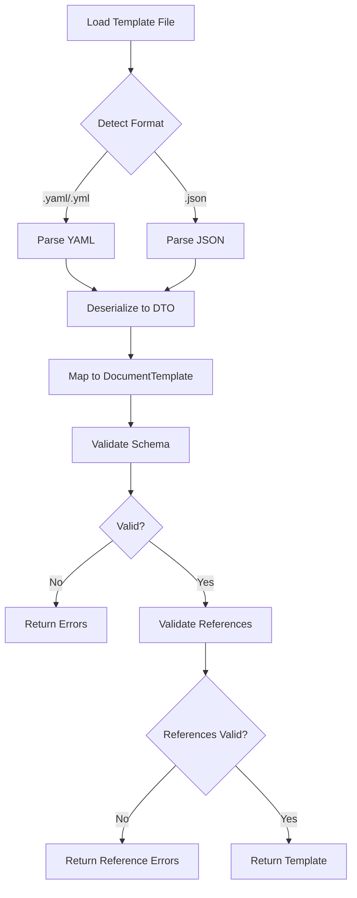

# LCS-DES-081a: Design Specification — Template Schema

## 1. Metadata & Categorization

| Field | Value | Description |
| :--- | :--- | :--- |
| **Feature ID** | `PUB-081a` | Sub-part of PUB-081 |
| **Feature Name** | `Template Schema Definition` | JSON/YAML template format |
| **Target Version** | `v0.8.1a` | First sub-part of v0.8.1 |
| **Module Scope** | `Lexichord.Modules.Publishing` | Publishing module |
| **Swimlane** | `Publisher` | Part of Publisher vertical |
| **License Tier** | `WriterPro` | Minimum tier for template features |
| **Feature Gate Key** | `FeatureFlags.Publishing.Templates` | License check key |
| **Author** | Lead Architect | |
| **Status** | `Draft` | |
| **Last Updated** | `2026-01-27` | |
| **Parent Document** | [LCS-DES-081-INDEX](./LCS-DES-081-INDEX.md) | |
| **Scope Breakdown** | [LCS-SBD-081 Section 3.1](./LCS-SBD-081.md#31-v081a-template-schema) | |

---

## 2. Executive Summary

### 2.1 The Requirement

Writers need a standardized format for defining document templates that captures:

- Hierarchical document structure with sections and subsections
- Metadata including author, version, and categorization
- Variable placeholders for dynamic content
- Voice Profile and Style Guide associations
- Validation rules for section content (word counts, requirements)

Without a defined schema, templates would be inconsistent, difficult to share, and impossible to validate programmatically.

### 2.2 The Proposed Solution

Define a comprehensive template schema supporting both JSON and YAML formats that:

1. Specifies all template properties with clear type definitions
2. Supports hierarchical section nesting
3. Defines variable types with validation constraints
4. References Voice Profiles and Style Guides by ID
5. Includes metadata for discovery and organization
6. Provides schema validation for template integrity

---

## 3. Architecture & Modular Strategy

### 3.1 Dependencies

#### 3.1.1 Upstream Dependencies

| Interface | Source Version | Purpose |
| :--- | :--- | :--- |
| `VoiceProfile` | v0.3.4a | Templates reference Voice Profiles |
| `StyleGuide` | v0.2.1b | Templates reference Style Guides |
| `IFileSystemService` | v0.0.5c | Read template files from disk |
| `Serilog` | v0.0.3b | Logging template operations |

#### 3.1.2 NuGet Packages

| Package | Version | Purpose |
| :--- | :--- | :--- |
| `YamlDotNet` | 16.x | YAML parsing and serialization |
| `System.Text.Json` | Built-in | JSON parsing and serialization |
| `FluentValidation` | 11.x | Schema validation rules |

### 3.2 Licensing Behavior

Template schema parsing is available to all tiers for reading. Template creation and modification requires WriterPro.

- **Load Behavior:** Soft Gate - Schema classes load, but repository operations check license
- **Fallback Experience:** Core users can parse templates but cannot save custom templates

---

## 4. Data Contract (The API)

### 4.1 Core Records

```csharp
namespace Lexichord.Modules.Publishing.Templates;

/// <summary>
/// Represents a complete document template definition.
/// Templates carry structure, metadata, variables, and style configurations.
/// </summary>
public record DocumentTemplate
{
    /// <summary>
    /// Unique identifier for the template.
    /// </summary>
    public required Guid Id { get; init; }

    /// <summary>
    /// Human-readable template name.
    /// Must be unique within the user's template library.
    /// </summary>
    public required string Name { get; init; }

    /// <summary>
    /// Detailed description of the template's purpose and intended use.
    /// Displayed in the Template Gallery preview.
    /// </summary>
    public string? Description { get; init; }

    /// <summary>
    /// Template metadata including author, version, and categorization.
    /// </summary>
    public required TemplateMetadata Metadata { get; init; }

    /// <summary>
    /// Hierarchical content structure with sections and placeholders.
    /// At least one section is required.
    /// </summary>
    public required IReadOnlyList<TemplateSection> Sections { get; init; }

    /// <summary>
    /// Variable definitions with names, types, defaults, and prompts.
    /// Variables are resolved during document generation.
    /// </summary>
    public IReadOnlyList<TemplateVariable> Variables { get; init; } = [];

    /// <summary>
    /// Optional Voice Profile ID to apply to generated documents.
    /// The profile must exist in the user's library.
    /// </summary>
    public Guid? VoiceProfileId { get; init; }

    /// <summary>
    /// Optional Style Guide ID to apply to generated documents.
    /// Style validation occurs during merge.
    /// </summary>
    public Guid? StyleGuideId { get; init; }

    /// <summary>
    /// Template format version for migration compatibility.
    /// Current version is "1.0".
    /// </summary>
    public string SchemaVersion { get; init; } = "1.0";

    /// <summary>
    /// Whether this is a built-in template (read-only).
    /// </summary>
    public bool IsBuiltIn { get; init; } = false;

    /// <summary>
    /// File path where the template is stored (null for built-in).
    /// </summary>
    public string? FilePath { get; init; }
}

/// <summary>
/// Metadata about the template including authorship and categorization.
/// Used for discovery, filtering, and organization in the Template Gallery.
/// </summary>
public record TemplateMetadata
{
    /// <summary>
    /// Template author name or organization.
    /// </summary>
    public string? Author { get; init; }

    /// <summary>
    /// Template version string following semantic versioning (e.g., "1.0.0").
    /// </summary>
    public string Version { get; init; } = "1.0.0";

    /// <summary>
    /// Primary category for organization.
    /// Standard categories: Blog, Technical, Marketing, Legal, Business, Other.
    /// </summary>
    public required string Category { get; init; }

    /// <summary>
    /// Tags for search and filtering.
    /// Tags are case-insensitive and should be lowercase.
    /// </summary>
    public IReadOnlyList<string> Tags { get; init; } = [];

    /// <summary>
    /// Creation timestamp in UTC.
    /// </summary>
    public DateTime CreatedAt { get; init; } = DateTime.UtcNow;

    /// <summary>
    /// Last modification timestamp in UTC.
    /// </summary>
    public DateTime ModifiedAt { get; init; } = DateTime.UtcNow;

    /// <summary>
    /// License under which template is shared (if any).
    /// Common values: "MIT", "CC-BY-4.0", "Proprietary".
    /// </summary>
    public string? License { get; init; }

    /// <summary>
    /// URL for template documentation or source.
    /// </summary>
    public string? SourceUrl { get; init; }
}

/// <summary>
/// A section within the template's content structure.
/// Sections can be nested to create hierarchical documents.
/// </summary>
public record TemplateSection
{
    /// <summary>
    /// Section identifier for reference in variables and logic.
    /// Must be unique within the template. Use kebab-case (e.g., "main-content").
    /// </summary>
    public required string Id { get; init; }

    /// <summary>
    /// Section heading text.
    /// May contain variable placeholders (e.g., "{{Title}}").
    /// </summary>
    public required string Heading { get; init; }

    /// <summary>
    /// Heading level (1-6 corresponding to H1-H6).
    /// Root sections should use level 1 or 2.
    /// </summary>
    public int HeadingLevel { get; init; } = 2;

    /// <summary>
    /// Section content in Markdown format.
    /// May contain variable placeholders and placeholder content.
    /// </summary>
    public string? Content { get; init; }

    /// <summary>
    /// Nested child sections.
    /// Children inherit context from parent.
    /// </summary>
    public IReadOnlyList<TemplateSection> Children { get; init; } = [];

    /// <summary>
    /// Whether this section is required in the generated document.
    /// Optional sections can be excluded during merge.
    /// </summary>
    public bool IsRequired { get; init; } = true;

    /// <summary>
    /// Hint text shown to writers about section purpose.
    /// Displayed as a comment in generated documents.
    /// </summary>
    public string? Hint { get; init; }

    /// <summary>
    /// Minimum word count for section content (0 = no minimum).
    /// Validated during merge, shown as guidance to writer.
    /// </summary>
    public int MinWordCount { get; init; } = 0;

    /// <summary>
    /// Maximum word count for section content (0 = no maximum).
    /// Validated during merge, shown as guidance to writer.
    /// </summary>
    public int MaxWordCount { get; init; } = 0;

    /// <summary>
    /// Order index for section display (lower = earlier).
    /// Used when sections are reordered.
    /// </summary>
    public int Order { get; init; } = 0;
}

/// <summary>
/// A variable placeholder within the template.
/// Variables are resolved during document generation.
/// </summary>
public record TemplateVariable
{
    /// <summary>
    /// Variable name used in placeholders.
    /// Use PascalCase (e.g., "AuthorName", "PublicationDate").
    /// </summary>
    public required string Name { get; init; }

    /// <summary>
    /// Display label for the variable input in the Variable Editor.
    /// If not specified, the Name is used with spaces inserted.
    /// </summary>
    public string? Label { get; init; }

    /// <summary>
    /// Variable data type determining input control and validation.
    /// </summary>
    public TemplateVariableType Type { get; init; } = TemplateVariableType.Text;

    /// <summary>
    /// Default value if user does not provide one.
    /// May reference built-in variables (e.g., "{{CurrentUser}}").
    /// </summary>
    public string? DefaultValue { get; init; }

    /// <summary>
    /// Whether the variable must have a value for merge to proceed.
    /// </summary>
    public bool IsRequired { get; init; } = false;

    /// <summary>
    /// Prompt text shown to user when requesting value.
    /// Displayed below the input field.
    /// </summary>
    public string? Prompt { get; init; }

    /// <summary>
    /// Validation regex pattern (for Text and TextArea types).
    /// Must be a valid .NET regex pattern.
    /// </summary>
    public string? ValidationPattern { get; init; }

    /// <summary>
    /// Error message shown when validation fails.
    /// </summary>
    public string? ValidationMessage { get; init; }

    /// <summary>
    /// Allowed values (for Select and MultiSelect types).
    /// Empty list means any value is allowed.
    /// </summary>
    public IReadOnlyList<string>? AllowedValues { get; init; }

    /// <summary>
    /// Format string for Date and DateTime types (e.g., "yyyy-MM-dd").
    /// Uses .NET date format specifiers.
    /// </summary>
    public string? Format { get; init; }

    /// <summary>
    /// Minimum value for Number type.
    /// </summary>
    public double? MinValue { get; init; }

    /// <summary>
    /// Maximum value for Number type.
    /// </summary>
    public double? MaxValue { get; init; }

    /// <summary>
    /// Order index for variable display in editor (lower = earlier).
    /// </summary>
    public int Order { get; init; } = 0;

    /// <summary>
    /// Group name for organizing variables in the editor.
    /// Variables with the same group are displayed together.
    /// </summary>
    public string? Group { get; init; }
}

/// <summary>
/// Supported variable data types.
/// Each type maps to a specific input control in the Variable Editor.
/// </summary>
public enum TemplateVariableType
{
    /// <summary>Single-line free-form text input.</summary>
    Text,

    /// <summary>Multi-line text area for longer content.</summary>
    TextArea,

    /// <summary>Date picker input (date only).</summary>
    Date,

    /// <summary>Date and time picker input.</summary>
    DateTime,

    /// <summary>Numeric input with optional min/max constraints.</summary>
    Number,

    /// <summary>Boolean checkbox (true/false).</summary>
    Boolean,

    /// <summary>Single selection from predefined options (dropdown).</summary>
    Select,

    /// <summary>Multiple selection from predefined options (checkbox list).</summary>
    MultiSelect,

    /// <summary>URL input with format validation.</summary>
    Url,

    /// <summary>Email input with format validation.</summary>
    Email,

    /// <summary>File path input with browse button.</summary>
    FilePath,

    /// <summary>Color picker input.</summary>
    Color
}
```

### 4.2 Repository Interface

```csharp
namespace Lexichord.Modules.Publishing.Templates;

/// <summary>
/// Repository for loading and saving document templates.
/// Manages both built-in templates (read-only) and user-defined templates.
/// </summary>
public interface ITemplateRepository
{
    /// <summary>
    /// Gets all available templates (built-in and user-defined).
    /// Templates are cached after first load.
    /// </summary>
    /// <param name="ct">Cancellation token.</param>
    /// <returns>All templates ordered by category then name.</returns>
    Task<IReadOnlyList<DocumentTemplate>> GetAllAsync(CancellationToken ct = default);

    /// <summary>
    /// Gets a template by its unique identifier.
    /// </summary>
    /// <param name="id">Template identifier.</param>
    /// <param name="ct">Cancellation token.</param>
    /// <returns>The template, or null if not found.</returns>
    Task<DocumentTemplate?> GetByIdAsync(Guid id, CancellationToken ct = default);

    /// <summary>
    /// Gets templates matching a category.
    /// </summary>
    /// <param name="category">Category to filter by (case-insensitive).</param>
    /// <param name="ct">Cancellation token.</param>
    /// <returns>Templates in the specified category.</returns>
    Task<IReadOnlyList<DocumentTemplate>> GetByCategoryAsync(
        string category, CancellationToken ct = default);

    /// <summary>
    /// Searches templates by name, description, and tags.
    /// </summary>
    /// <param name="query">Search query.</param>
    /// <param name="ct">Cancellation token.</param>
    /// <returns>Matching templates.</returns>
    Task<IReadOnlyList<DocumentTemplate>> SearchAsync(
        string query, CancellationToken ct = default);

    /// <summary>
    /// Saves a user-defined template.
    /// Creates a new template or updates an existing one.
    /// </summary>
    /// <param name="template">Template to save.</param>
    /// <param name="ct">Cancellation token.</param>
    /// <exception cref="InvalidOperationException">If attempting to modify a built-in template.</exception>
    Task SaveAsync(DocumentTemplate template, CancellationToken ct = default);

    /// <summary>
    /// Deletes a user-defined template.
    /// </summary>
    /// <param name="id">Template identifier.</param>
    /// <param name="ct">Cancellation token.</param>
    /// <exception cref="InvalidOperationException">If attempting to delete a built-in template.</exception>
    Task DeleteAsync(Guid id, CancellationToken ct = default);

    /// <summary>
    /// Imports a template from a file.
    /// Validates the template before importing.
    /// </summary>
    /// <param name="filePath">Path to the template file (.yaml or .json).</param>
    /// <param name="ct">Cancellation token.</param>
    /// <returns>The imported template.</returns>
    /// <exception cref="TemplateValidationException">If the template is invalid.</exception>
    Task<DocumentTemplate> ImportAsync(string filePath, CancellationToken ct = default);

    /// <summary>
    /// Exports a template to a file.
    /// </summary>
    /// <param name="id">Template identifier.</param>
    /// <param name="filePath">Output file path.</param>
    /// <param name="format">Output format (JSON or YAML).</param>
    /// <param name="ct">Cancellation token.</param>
    Task ExportAsync(
        Guid id, string filePath, TemplateFormat format = TemplateFormat.Yaml,
        CancellationToken ct = default);

    /// <summary>
    /// Gets all unique categories from templates.
    /// </summary>
    /// <param name="ct">Cancellation token.</param>
    /// <returns>Sorted list of categories.</returns>
    Task<IReadOnlyList<string>> GetCategoriesAsync(CancellationToken ct = default);

    /// <summary>
    /// Gets all unique tags from templates.
    /// </summary>
    /// <param name="ct">Cancellation token.</param>
    /// <returns>Sorted list of tags.</returns>
    Task<IReadOnlyList<string>> GetTagsAsync(CancellationToken ct = default);

    /// <summary>
    /// Refreshes the template cache from disk.
    /// </summary>
    /// <param name="ct">Cancellation token.</param>
    Task RefreshCacheAsync(CancellationToken ct = default);
}

public enum TemplateFormat { Json, Yaml }
```

### 4.3 Validation Interface

```csharp
namespace Lexichord.Modules.Publishing.Templates;

/// <summary>
/// Validates template definitions against the schema.
/// </summary>
public interface ITemplateValidator
{
    /// <summary>
    /// Validates a template definition.
    /// Checks all required fields, type constraints, and reference integrity.
    /// </summary>
    /// <param name="template">The template to validate.</param>
    /// <returns>Validation result with any errors and warnings.</returns>
    TemplateValidationResult Validate(DocumentTemplate template);

    /// <summary>
    /// Validates raw JSON/YAML content against the schema.
    /// Does not resolve references (Voice Profiles, Style Guides).
    /// </summary>
    /// <param name="content">Raw template content.</param>
    /// <param name="format">Content format (JSON or YAML).</param>
    /// <returns>Validation result with any errors and warnings.</returns>
    TemplateValidationResult ValidateRaw(string content, TemplateFormat format);

    /// <summary>
    /// Validates that template references (Voice Profile, Style Guide) exist.
    /// </summary>
    /// <param name="template">Template with references to validate.</param>
    /// <param name="ct">Cancellation token.</param>
    /// <returns>Validation result with any missing reference errors.</returns>
    Task<TemplateValidationResult> ValidateReferencesAsync(
        DocumentTemplate template, CancellationToken ct = default);
}

/// <summary>
/// Result of template validation.
/// </summary>
public record TemplateValidationResult
{
    /// <summary>Whether the template is valid (no errors).</summary>
    public bool IsValid => Errors.Count == 0;

    /// <summary>Validation errors that prevent template use.</summary>
    public IReadOnlyList<TemplateValidationError> Errors { get; init; } = [];

    /// <summary>Warnings that don't prevent use but indicate issues.</summary>
    public IReadOnlyList<TemplateValidationError> Warnings { get; init; } = [];

    /// <summary>Creates a successful validation result.</summary>
    public static TemplateValidationResult Success() => new();

    /// <summary>Creates a failed validation result with errors.</summary>
    public static TemplateValidationResult Failed(params TemplateValidationError[] errors) =>
        new() { Errors = errors };
}

/// <summary>
/// A validation error or warning in a template.
/// </summary>
public record TemplateValidationError
{
    /// <summary>JSON path or property name where the error occurred.</summary>
    public required string Path { get; init; }

    /// <summary>Human-readable error message.</summary>
    public required string Message { get; init; }

    /// <summary>Error severity.</summary>
    public TemplateValidationSeverity Severity { get; init; } = TemplateValidationSeverity.Error;

    /// <summary>Error code for programmatic handling.</summary>
    public string? Code { get; init; }
}

public enum TemplateValidationSeverity
{
    /// <summary>Error that prevents template use.</summary>
    Error,

    /// <summary>Warning that should be addressed but doesn't prevent use.</summary>
    Warning,

    /// <summary>Informational message.</summary>
    Info
}
```

---

## 5. Implementation Logic

### 5.1 YAML Template Structure

```yaml
# Complete template example with all features
id: "550e8400-e29b-41d4-a716-446655440001"
name: "Blog Post"
description: |
  Standard blog post template with introduction, body sections, and conclusion.
  Designed for content marketing and thought leadership articles.
schemaVersion: "1.0"

metadata:
  author: "Lexichord Team"
  version: "1.0.0"
  category: "Blog"
  tags:
    - blog
    - content
    - marketing
  createdAt: "2026-01-15T00:00:00Z"
  modifiedAt: "2026-01-27T00:00:00Z"
  license: "MIT"
  sourceUrl: "https://github.com/lexichord/templates"

voiceProfileId: "550e8400-e29b-41d4-a716-446655440002"
styleGuideId: "550e8400-e29b-41d4-a716-446655440003"

variables:
  - name: "Title"
    label: "Post Title"
    type: Text
    isRequired: true
    prompt: "Enter the blog post title"
    validationPattern: "^.{5,100}$"
    validationMessage: "Title must be between 5 and 100 characters"
    order: 1
    group: "Basic Info"

  - name: "Author"
    label: "Author Name"
    type: Text
    defaultValue: "{{CurrentUser}}"
    isRequired: true
    order: 2
    group: "Basic Info"

  - name: "PublicationDate"
    label: "Publication Date"
    type: Date
    defaultValue: "{{Today}}"
    format: "MMMM d, yyyy"
    order: 3
    group: "Basic Info"

  - name: "Category"
    label: "Post Category"
    type: Select
    allowedValues:
      - Technology
      - Business
      - Lifestyle
      - Tutorial
    defaultValue: "Technology"
    order: 4
    group: "Categorization"

  - name: "Tags"
    label: "Post Tags"
    type: MultiSelect
    allowedValues:
      - AI
      - Writing
      - Productivity
      - Tips
      - Review
    order: 5
    group: "Categorization"

  - name: "FeaturedImage"
    label: "Featured Image URL"
    type: Url
    isRequired: false
    prompt: "Enter the URL for the featured image"
    order: 6
    group: "Media"

sections:
  - id: "header"
    heading: "{{Title}}"
    headingLevel: 1
    content: |
      *By {{Author}} | {{PublicationDate}}*

      **Category:** {{Category}}

      {{#if FeaturedImage}}
      
      {{/if}}
    isRequired: true
    order: 1

  - id: "introduction"
    heading: "Introduction"
    headingLevel: 2
    content: |
      {{IntroContent:Write a compelling introduction that hooks the reader and previews the main points...}}
    isRequired: true
    hint: "Hook the reader with an engaging opening. Preview your main points."
    minWordCount: 50
    maxWordCount: 200
    order: 2

  - id: "main-content"
    heading: "Main Content"
    headingLevel: 2
    isRequired: true
    order: 3
    children:
      - id: "point-1"
        heading: "Key Point 1"
        headingLevel: 3
        content: "{{Point1Content:Develop your first main point with supporting evidence...}}"
        hint: "Present your first key argument or idea with examples."
        minWordCount: 100
        order: 1

      - id: "point-2"
        heading: "Key Point 2"
        headingLevel: 3
        content: "{{Point2Content:Develop your second main point with supporting evidence...}}"
        hint: "Present your second key argument or idea with examples."
        minWordCount: 100
        order: 2

      - id: "point-3"
        heading: "Key Point 3"
        headingLevel: 3
        content: "{{Point3Content:Develop your third main point with supporting evidence...}}"
        hint: "Present your third key argument or idea with examples."
        isRequired: false
        minWordCount: 100
        order: 3

  - id: "conclusion"
    heading: "Conclusion"
    headingLevel: 2
    content: |
      {{ConclusionContent:Summarize key points and provide a call to action...}}
    isRequired: true
    hint: "Wrap up with a summary and clear call to action."
    minWordCount: 50
    maxWordCount: 150
    order: 4
```

### 5.2 Validation Rules

```text
VALIDATION RULES:

1. REQUIRED FIELDS:
   ├── Id: Must be a valid GUID
   ├── Name: Non-empty, max 100 characters
   ├── Metadata.Category: Non-empty
   └── Sections: At least one section

2. SECTION VALIDATION:
   ├── Id: Unique within template, kebab-case recommended
   ├── Heading: Non-empty
   ├── HeadingLevel: 1-6
   ├── MinWordCount: >= 0
   ├── MaxWordCount: >= MinWordCount (if both specified)
   └── Children: Recursive validation

3. VARIABLE VALIDATION:
   ├── Name: Unique, PascalCase recommended, no spaces
   ├── Type: Valid TemplateVariableType
   ├── AllowedValues: Required for Select/MultiSelect types
   ├── DefaultValue: Must match type constraints
   ├── ValidationPattern: Valid regex (if specified)
   └── MinValue <= MaxValue (for Number type)

4. REFERENCE VALIDATION:
   ├── VoiceProfileId: Must exist if specified
   └── StyleGuideId: Must exist if specified

5. SCHEMA VERSION:
   └── Must be "1.0" (current version)
```

### 5.3 Parser Flow



---

## 6. Data Persistence

### 6.1 Storage Locations

| Platform | User Templates Path | Built-in Templates |
| :--- | :--- | :--- |
| Windows | `%APPDATA%\Lexichord\templates\` | Embedded resources |
| macOS | `~/Library/Application Support/Lexichord/templates/` | Embedded resources |
| Linux | `~/.config/Lexichord/templates/` | Embedded resources |

### 6.2 File Naming Convention

```text
TEMPLATE FILES:
├── {guid}.template.yaml     - Primary format
├── {guid}.template.json     - Alternative format
└── {name-slug}.template.yaml - User-friendly naming (optional)

EXAMPLES:
├── 550e8400-e29b-41d4-a716-446655440001.template.yaml
├── blog-post.template.yaml
└── technical-specification.template.yaml
```

### 6.3 Built-in Template Embedding

```csharp
// Templates are embedded as resources in the assembly
[assembly: EmbeddedResource("Lexichord.Modules.Publishing.Templates.BuiltIn.BlogPost.yaml")]
[assembly: EmbeddedResource("Lexichord.Modules.Publishing.Templates.BuiltIn.TechnicalSpec.yaml")]
[assembly: EmbeddedResource("Lexichord.Modules.Publishing.Templates.BuiltIn.PressRelease.yaml")]
```

---

## 7. UI/UX Specifications

**Not applicable.** This sub-part defines the data schema only. UI components are defined in v0.8.1b.

---

## 8. Observability & Logging

| Level | Source | Message Template |
| :--- | :--- | :--- |
| Debug | TemplateParser | `Parsing template from {FilePath} with format {Format}` |
| Info | TemplateRepository | `Loaded {Count} templates ({BuiltIn} built-in, {Custom} custom)` |
| Warning | TemplateValidator | `Template {TemplateId} validation warning: {Message}` |
| Error | TemplateParser | `Failed to parse template {FilePath}: {Error}` |
| Error | TemplateValidator | `Template {TemplateId} validation failed: {ErrorCount} errors` |

---

## 9. Security & Safety

| Risk | Level | Mitigation |
| :--- | :--- | :--- |
| Malicious YAML (billion laughs) | Medium | Use YamlDotNet safe mode, limit expansion depth |
| Path traversal in FilePath | High | Validate paths are within template directory |
| Script injection in content | Medium | Sanitize content before rendering to HTML |
| Template ID collision | Low | Use GUIDs, check for duplicates on import |

---

## 10. Acceptance Criteria

### 10.1 Schema Parsing

| # | Given | When | Then |
| :--- | :--- | :--- | :--- |
| 1 | Valid YAML template | Parsing | Returns DocumentTemplate |
| 2 | Valid JSON template | Parsing | Returns DocumentTemplate |
| 3 | Invalid YAML syntax | Parsing | Returns parse error with line number |
| 4 | Missing required field | Validating | Returns specific field error |
| 5 | Invalid GUID format | Validating | Returns "Id must be a valid GUID" |
| 6 | Duplicate section IDs | Validating | Returns "Section IDs must be unique" |
| 7 | Invalid variable type | Validating | Returns "Unknown variable type" |
| 8 | Select type without options | Validating | Returns "AllowedValues required for Select" |

### 10.2 Repository Operations

| # | Given | When | Then |
| :--- | :--- | :--- | :--- |
| 9 | Template directory exists | GetAllAsync | Returns all templates |
| 10 | Template with ID exists | GetByIdAsync | Returns the template |
| 11 | Template ID not found | GetByIdAsync | Returns null |
| 12 | Valid template | SaveAsync | File created in templates directory |
| 13 | Built-in template | SaveAsync | Throws InvalidOperationException |
| 14 | User template exists | DeleteAsync | File removed |
| 15 | Built-in template | DeleteAsync | Throws InvalidOperationException |

---

## 11. Deliverable Checklist

| # | Deliverable | Status |
| :--- | :--- | :--- |
| 1 | `DocumentTemplate.cs` with all properties | [ ] |
| 2 | `TemplateSection.cs` with nesting support | [ ] |
| 3 | `TemplateVariable.cs` with all types | [ ] |
| 4 | `TemplateMetadata.cs` with categorization | [ ] |
| 5 | `TemplateVariableType.cs` enum | [ ] |
| 6 | `ITemplateRepository.cs` interface | [ ] |
| 7 | `TemplateRepository.cs` implementation | [ ] |
| 8 | `ITemplateValidator.cs` interface | [ ] |
| 9 | `TemplateValidator.cs` implementation | [ ] |
| 10 | `YamlTemplateParser.cs` | [ ] |
| 11 | `JsonTemplateParser.cs` | [ ] |
| 12 | Built-in template: Blog Post | [ ] |
| 13 | Built-in template: Technical Spec | [ ] |
| 14 | Built-in template: Press Release | [ ] |
| 15 | `template-schema.json` JSON Schema file | [ ] |
| 16 | Unit tests for parsing | [ ] |
| 17 | Unit tests for validation | [ ] |
| 18 | Unit tests for repository | [ ] |

---

## 12. Verification Commands

```bash
# Run schema parsing tests
dotnet test --filter "Version=v0.8.1a&Category=Unit" --logger "console;verbosity=detailed"

# Verify built-in templates parse correctly
dotnet run --project tools/TemplateVerifier -- --verify-builtin

# Validate a user template
dotnet run --project tools/TemplateVerifier -- --validate "path/to/template.yaml"

# Generate JSON Schema
dotnet run --project tools/SchemaGenerator -- --output "docs/schemas/template-schema.json"
```

---

## Document History

| Version | Date | Author | Changes |
| :--- | :--- | :--- | :--- |
| 1.0 | 2026-01-27 | Lead Architect | Initial draft |
