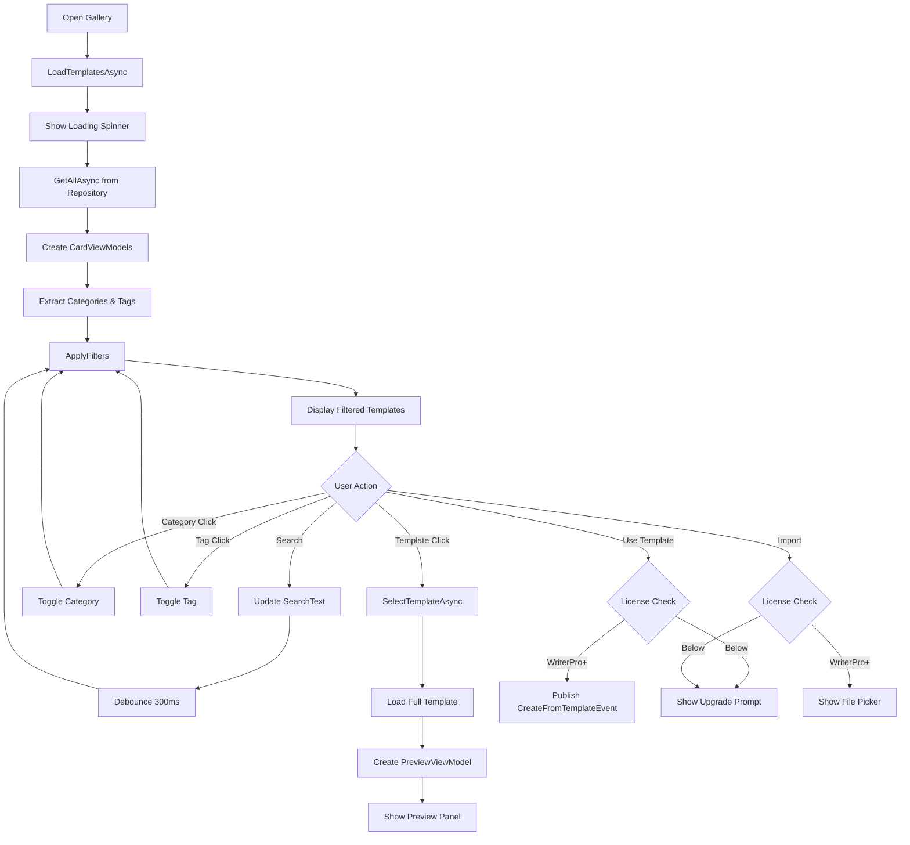

# LCS-DES-081b: Design Specification — Template Gallery UI

## 1. Metadata & Categorization

| Field | Value | Description |
| :--- | :--- | :--- |
| **Feature ID** | `PUB-081b` | Sub-part of PUB-081 |
| **Feature Name** | `Template Gallery User Interface` | Visual template browser |
| **Target Version** | `v0.8.1b` | Second sub-part of v0.8.1 |
| **Module Scope** | `Lexichord.Modules.Publishing` | Publishing module |
| **Swimlane** | `Publisher` | Part of Publisher vertical |
| **License Tier** | `WriterPro` | Full features require WriterPro |
| **Feature Gate Key** | `FeatureFlags.Publishing.Templates` | License check key |
| **Author** | Lead Architect | |
| **Status** | `Draft` | |
| **Last Updated** | `2026-01-27` | |
| **Parent Document** | [LCS-DES-081-INDEX](./LCS-DES-081-INDEX.md) | |
| **Scope Breakdown** | [LCS-SBD-081 Section 3.2](./LCS-SBD-081.md#32-v081b-template-gallery-ui) | |

---

## 2. Executive Summary

### 2.1 The Requirement

Writers need an intuitive interface to:

- Browse available document templates visually
- Filter templates by category and tags
- Search templates by name, description, or content
- Preview template structure before use
- Select a template to create a new document

Without a visual gallery, users would need to know template names or browse file systems manually.

### 2.2 The Proposed Solution

Create a Template Gallery with:

1. **Grid Layout** — Card-based display of templates with visual hierarchy
2. **Sidebar Filters** — Category checkboxes and tag cloud for filtering
3. **Search Bar** — Full-text search across template metadata
4. **Preview Panel** — Expandable view showing template structure and variables
5. **Action Buttons** — "Use Template", "Preview", "Import", "Export"
6. **License Gating** — Upgrade prompts for non-WriterPro users

---

## 3. Architecture & Modular Strategy

### 3.1 Dependencies

#### 3.1.1 Internal Dependencies

| Interface | Source Version | Purpose |
| :--- | :--- | :--- |
| `ITemplateRepository` | v0.8.1a | Load templates for display |
| `DocumentTemplate` | v0.8.1a | Template data model |
| `ILicenseContext` | v0.0.4c | Check license tier |
| `IRegionManager` | v0.1.1b | Register gallery panel |
| `IMediator` | v0.0.7a | Publish navigation events |

#### 3.1.2 UI Framework

| Package | Version | Purpose |
| :--- | :--- | :--- |
| `Avalonia.UI` | 11.x | UI framework |
| `CommunityToolkit.Mvvm` | 8.x | MVVM infrastructure |

### 3.2 Licensing Behavior

- **View Gallery:** All tiers can view the gallery
- **Preview Templates:** All tiers can preview
- **Use Templates:** WriterPro+ required
- **Import/Export:** WriterPro+ required

**Fallback Experience:** Core/Writer users see templates but "Use Template" shows upgrade prompt.

---

## 4. Data Contract (The API)

### 4.1 ViewModel Interfaces

```csharp
namespace Lexichord.Modules.Publishing.ViewModels;

/// <summary>
/// ViewModel for the Template Gallery main view.
/// Manages template loading, filtering, and selection.
/// </summary>
public partial class TemplateGalleryViewModel : ObservableObject
{
    private readonly ITemplateRepository _templateRepository;
    private readonly ILicenseContext _licenseContext;
    private readonly IMediator _mediator;
    private readonly ILogger<TemplateGalleryViewModel> _logger;

    #region Observable Properties

    /// <summary>All loaded templates.</summary>
    [ObservableProperty]
    private ObservableCollection<TemplateCardViewModel> _templates = [];

    /// <summary>Filtered templates currently displayed.</summary>
    [ObservableProperty]
    private ObservableCollection<TemplateCardViewModel> _filteredTemplates = [];

    /// <summary>Currently selected template (null if none).</summary>
    [ObservableProperty]
    private TemplateCardViewModel? _selectedTemplate;

    /// <summary>Search text for filtering.</summary>
    [ObservableProperty]
    private string _searchText = string.Empty;

    /// <summary>Currently selected category filter (null = all).</summary>
    [ObservableProperty]
    private string? _selectedCategory;

    /// <summary>Available categories from templates.</summary>
    [ObservableProperty]
    private ObservableCollection<CategoryViewModel> _categories = [];

    /// <summary>Available tags for filtering.</summary>
    [ObservableProperty]
    private ObservableCollection<TagViewModel> _tags = [];

    /// <summary>Whether templates are currently loading.</summary>
    [ObservableProperty]
    private bool _isLoading;

    /// <summary>Whether the preview panel is visible.</summary>
    [ObservableProperty]
    private bool _showPreview;

    /// <summary>ViewModel for the preview panel.</summary>
    [ObservableProperty]
    private TemplatePreviewViewModel? _previewViewModel;

    /// <summary>Whether user can create custom templates (license check).</summary>
    [ObservableProperty]
    private bool _canUseTemplates;

    /// <summary>Error message to display (null = no error).</summary>
    [ObservableProperty]
    private string? _errorMessage;

    /// <summary>Number of templates matching current filters.</summary>
    [ObservableProperty]
    private int _matchCount;

    #endregion

    #region Commands

    /// <summary>Loads all templates from the repository.</summary>
    [RelayCommand]
    private async Task LoadTemplatesAsync(CancellationToken ct);

    /// <summary>Applies current filters to the template list.</summary>
    [RelayCommand]
    private void ApplyFilters();

    /// <summary>Clears all filters and search.</summary>
    [RelayCommand]
    private void ClearFilters();

    /// <summary>Selects a template and shows preview.</summary>
    [RelayCommand]
    private async Task SelectTemplateAsync(TemplateCardViewModel template, CancellationToken ct);

    /// <summary>Creates a document from the selected template.</summary>
    [RelayCommand]
    private async Task UseTemplateAsync(CancellationToken ct);

    /// <summary>Opens the import dialog.</summary>
    [RelayCommand]
    private async Task ImportTemplateAsync(CancellationToken ct);

    /// <summary>Exports the selected template.</summary>
    [RelayCommand]
    private async Task ExportTemplateAsync(CancellationToken ct);

    /// <summary>Refreshes templates from disk.</summary>
    [RelayCommand]
    private async Task RefreshAsync(CancellationToken ct);

    /// <summary>Closes the preview panel.</summary>
    [RelayCommand]
    private void ClosePreview();

    #endregion
}

/// <summary>
/// ViewModel for individual template cards in the gallery grid.
/// </summary>
public class TemplateCardViewModel : ObservableObject
{
    /// <summary>Template unique identifier.</summary>
    public Guid Id { get; }

    /// <summary>Template display name.</summary>
    public string Name { get; }

    /// <summary>Template description (truncated for card).</summary>
    public string? Description { get; }

    /// <summary>Short description (first 100 chars).</summary>
    public string ShortDescription { get; }

    /// <summary>Primary category.</summary>
    public string Category { get; }

    /// <summary>Tags for display.</summary>
    public IReadOnlyList<string> Tags { get; }

    /// <summary>Template author.</summary>
    public string? Author { get; }

    /// <summary>Template version.</summary>
    public string Version { get; }

    /// <summary>Last modified date.</summary>
    public DateTime ModifiedAt { get; }

    /// <summary>Whether template has a Voice Profile.</summary>
    public bool HasVoiceProfile { get; }

    /// <summary>Whether template has a Style Guide.</summary>
    public bool HasStyleGuide { get; }

    /// <summary>Total section count (including nested).</summary>
    public int SectionCount { get; }

    /// <summary>Variable count.</summary>
    public int VariableCount { get; }

    /// <summary>Whether this is a built-in template.</summary>
    public bool IsBuiltIn { get; }

    /// <summary>Icon based on category.</summary>
    public string CategoryIcon { get; }

    public TemplateCardViewModel(DocumentTemplate template)
    {
        Id = template.Id;
        Name = template.Name;
        Description = template.Description;
        ShortDescription = TruncateDescription(template.Description, 100);
        Category = template.Metadata.Category;
        Tags = template.Metadata.Tags;
        Author = template.Metadata.Author;
        Version = template.Metadata.Version;
        ModifiedAt = template.Metadata.ModifiedAt;
        HasVoiceProfile = template.VoiceProfileId.HasValue;
        HasStyleGuide = template.StyleGuideId.HasValue;
        SectionCount = CountSections(template.Sections);
        VariableCount = template.Variables.Count;
        IsBuiltIn = template.IsBuiltIn;
        CategoryIcon = GetCategoryIcon(template.Metadata.Category);
    }

    private static string TruncateDescription(string? desc, int maxLength)
    {
        if (string.IsNullOrEmpty(desc)) return string.Empty;
        if (desc.Length <= maxLength) return desc;
        return desc[..(maxLength - 3)] + "...";
    }

    private static int CountSections(IReadOnlyList<TemplateSection> sections) =>
        sections.Sum(s => 1 + CountSections(s.Children));

    private static string GetCategoryIcon(string category) => category.ToLowerInvariant() switch
    {
        "blog" => "mdi-post-outline",
        "technical" => "mdi-file-document-outline",
        "marketing" => "mdi-bullhorn-outline",
        "legal" => "mdi-scale-balance",
        "business" => "mdi-briefcase-outline",
        _ => "mdi-file-outline"
    };
}

/// <summary>
/// ViewModel for category filter items.
/// </summary>
public partial class CategoryViewModel : ObservableObject
{
    /// <summary>Category name.</summary>
    public string Name { get; }

    /// <summary>Number of templates in this category.</summary>
    public int Count { get; }

    /// <summary>Whether this category is selected.</summary>
    [ObservableProperty]
    private bool _isSelected;

    public CategoryViewModel(string name, int count)
    {
        Name = name;
        Count = count;
    }
}

/// <summary>
/// ViewModel for tag filter items.
/// </summary>
public partial class TagViewModel : ObservableObject
{
    /// <summary>Tag name.</summary>
    public string Name { get; }

    /// <summary>Number of templates with this tag.</summary>
    public int Count { get; }

    /// <summary>Whether this tag is selected.</summary>
    [ObservableProperty]
    private bool _isSelected;

    public TagViewModel(string name, int count)
    {
        Name = name;
        Count = count;
    }
}

/// <summary>
/// ViewModel for the template preview panel.
/// Shows detailed template information and structure.
/// </summary>
public partial class TemplatePreviewViewModel : ObservableObject
{
    /// <summary>The template being previewed.</summary>
    public DocumentTemplate Template { get; }

    /// <summary>Hierarchical section tree.</summary>
    public ObservableCollection<SectionTreeNode> SectionTree { get; }

    /// <summary>Variables grouped by group name.</summary>
    public ObservableCollection<VariableGroupViewModel> VariableGroups { get; }

    /// <summary>Voice Profile name (if any).</summary>
    public string? VoiceProfileName { get; set; }

    /// <summary>Style Guide name (if any).</summary>
    public string? StyleGuideName { get; set; }

    /// <summary>Rendered preview content.</summary>
    [ObservableProperty]
    private string _previewContent = string.Empty;

    public TemplatePreviewViewModel(DocumentTemplate template)
    {
        Template = template;
        SectionTree = BuildSectionTree(template.Sections);
        VariableGroups = GroupVariables(template.Variables);
    }

    private static ObservableCollection<SectionTreeNode> BuildSectionTree(
        IReadOnlyList<TemplateSection> sections)
    {
        return new ObservableCollection<SectionTreeNode>(
            sections.Select(s => new SectionTreeNode(s)));
    }

    private static ObservableCollection<VariableGroupViewModel> GroupVariables(
        IReadOnlyList<TemplateVariable> variables)
    {
        return new ObservableCollection<VariableGroupViewModel>(
            variables
                .GroupBy(v => v.Group ?? "General")
                .OrderBy(g => g.Key)
                .Select(g => new VariableGroupViewModel(g.Key, g.ToList())));
    }
}

/// <summary>
/// Tree node for section hierarchy display.
/// </summary>
public class SectionTreeNode
{
    public string Id { get; }
    public string Heading { get; }
    public int HeadingLevel { get; }
    public bool IsRequired { get; }
    public string? Hint { get; }
    public string WordCountTarget { get; }
    public ObservableCollection<SectionTreeNode> Children { get; }

    public SectionTreeNode(TemplateSection section)
    {
        Id = section.Id;
        Heading = section.Heading;
        HeadingLevel = section.HeadingLevel;
        IsRequired = section.IsRequired;
        Hint = section.Hint;
        WordCountTarget = FormatWordCountTarget(section.MinWordCount, section.MaxWordCount);
        Children = new ObservableCollection<SectionTreeNode>(
            section.Children.Select(c => new SectionTreeNode(c)));
    }

    private static string FormatWordCountTarget(int min, int max)
    {
        if (min == 0 && max == 0) return string.Empty;
        if (max == 0) return $"{min}+ words";
        if (min == 0) return $"Up to {max} words";
        return $"{min}-{max} words";
    }
}

/// <summary>
/// Group of variables for display.
/// </summary>
public class VariableGroupViewModel
{
    public string GroupName { get; }
    public IReadOnlyList<VariableDisplayViewModel> Variables { get; }

    public VariableGroupViewModel(string groupName, IReadOnlyList<TemplateVariable> variables)
    {
        GroupName = groupName;
        Variables = variables.Select(v => new VariableDisplayViewModel(v)).ToList();
    }
}

/// <summary>
/// Variable for preview display.
/// </summary>
public class VariableDisplayViewModel
{
    public string Name { get; }
    public string Label { get; }
    public string TypeDisplay { get; }
    public bool IsRequired { get; }
    public string? DefaultValue { get; }

    public VariableDisplayViewModel(TemplateVariable variable)
    {
        Name = variable.Name;
        Label = variable.Label ?? variable.Name;
        TypeDisplay = FormatType(variable.Type);
        IsRequired = variable.IsRequired;
        DefaultValue = variable.DefaultValue;
    }

    private static string FormatType(TemplateVariableType type) => type switch
    {
        TemplateVariableType.Text => "Text",
        TemplateVariableType.TextArea => "Text (multi-line)",
        TemplateVariableType.Date => "Date",
        TemplateVariableType.DateTime => "Date & Time",
        TemplateVariableType.Number => "Number",
        TemplateVariableType.Boolean => "Yes/No",
        TemplateVariableType.Select => "Selection",
        TemplateVariableType.MultiSelect => "Multiple Selection",
        TemplateVariableType.Url => "URL",
        TemplateVariableType.Email => "Email",
        _ => type.ToString()
    };
}
```

---

## 5. Implementation Logic

### 5.1 Filter Logic

```text
FILTER ALGORITHM:

DISPLAY template IF:
  (searchText is empty OR
     template.Name CONTAINS searchText (case-insensitive) OR
     template.Description CONTAINS searchText OR
     ANY template.Tags CONTAINS searchText)
  AND
  (selectedCategory is null OR template.Category = selectedCategory)
  AND
  (no tags selected OR ANY selected tag IN template.Tags)

EXAMPLE:
  searchText = "blog"
  selectedCategory = null
  selectedTags = ["AI", "Writing"]

  Template "Blog Post" with tags ["blog", "AI", "content"]
  → Name contains "blog" ✓
  → Category check skipped (null) ✓
  → Has tag "AI" from selected ✓
  → DISPLAY

  Template "Technical Spec" with tags ["technical", "documentation"]
  → Name does NOT contain "blog" ✗
  → SKIP
```

### 5.2 Search Debouncing

```csharp
// Debounce search input to avoid excessive filtering
private CancellationTokenSource? _searchCts;

partial void OnSearchTextChanged(string value)
{
    _searchCts?.Cancel();
    _searchCts = new CancellationTokenSource();

    _ = Task.Delay(300, _searchCts.Token)
        .ContinueWith(_ => ApplyFilters(), TaskScheduler.FromCurrentSynchronizationContext());
}
```

### 5.3 Flow Diagram



---

## 6. UI/UX Specifications

### 6.1 Gallery Layout

```text
+------------------------------------------------------------------------------+
|  Document Templates                                                   [?]    |
|  Create documents from reusable templates                                    |
+------------------------------------------------------------------------------+
|                         [Search templates...                    ] [Q] [Import]|
+------------------------------------------------------------------------------+
| Categories              | Templates (12 of 45)                               |
|-------------------------|-----------------------------------------------------|
| [ ] All (45)            | +---------------+  +---------------+  +-------------|
| [x] Blog (12)           | |    [icon]     |  |    [icon]     |  |    [icon]   |
| [ ] Technical (15)      | |  Blog Post    |  | Tech Article  |  | Product     |
| [ ] Marketing (8)       | |               |  |               |  | Review      |
| [ ] Legal (5)           | |  4 sections   |  |  6 sections   |  |             |
| [ ] Business (5)        | |  3 variables  |  |  8 variables  |  |  5 sections |
|-------------------------|  |               |  |               |  |  4 variables|
| Tags                    | |  [VP] [SG]    |  |  [VP]         |  |             |
|-------------------------|  | v1.0          |  | v1.2          |  |  [SG]       |
| [x] Writing (8)         | +---------------+  +---------------+  | v1.0        |
| [ ] AI (5)              |                                       +-------------|
| [x] Content (10)        | +---------------+  +---------------+  +-------------|
| [ ] Tutorial (4)        | |    [icon]     |  |    [icon]     |  |    [icon]   |
| [ ] Documentation (7)   | |  Newsletter   |  | How-To Guide  |  |  Listicle   |
| [ ] Productivity (3)    | |               |  |               |  |             |
|                         | |  3 sections   |  |  7 sections   |  |  4 sections |
|                         | |  5 variables  |  |  6 variables  |  |  2 variables|
|                         | |               |  |               |  |             |
|                         | |               |  |  [VP] [SG]    |  |             |
|                         | | v1.1          |  | v2.0          |  | v1.0        |
|                         | +---------------+  +---------------+  +-------------|
|                         |                                                     |
+-------------------------|-----------------------------------------------------|
| [Clear Filters]         | << Showing 12 templates matching filters            |
+------------------------------------------------------------------------------+
```

### 6.2 Template Card Design

```text
+-------------------------------------------+
|                                           |
|              [Category Icon]              |  <- Large icon based on category
|                                           |
|           Template Name                   |  <- Bold, 16pt
|                                           |
|  Short description text that may wrap     |  <- Normal, 12pt, max 2 lines
|  to multiple lines if needed...           |
|                                           |
|  [Tag1] [Tag2] [Tag3]                     |  <- Tag pills, max 3 shown
|                                           |
|  4 sections | 3 variables                 |  <- Metadata row
|                                           |
|  [VP icon] [SG icon]      v1.0           |  <- Indicators + version
|                                           |
+-------------------------------------------+

HOVER STATE:
- Card elevates slightly (shadow increases)
- Border color changes to accent

SELECTED STATE:
- Blue border (2px)
- Checkmark in corner
```

### 6.3 Preview Panel

```text
+------------------------------------------------------------------------------+
|  Preview: Blog Post                                              [x] Close   |
+------------------------------------------------------------------------------+
| Structure                              | Preview                             |
|----------------------------------------|-------------------------------------|
| v [#] Header (H1)                      | # {{Title}}                         |
|   - Title, Author, Date                | *By {{Author}} | {{PublicationDate}}|
| v [#] Introduction (H2)                |                                     |
|   - Required | 50-200 words            | ## Introduction                     |
| v [#] Main Content (H2)                | Write a compelling introduction...  |
|   v [#] Key Point 1 (H3)               |                                     |
|   v [#] Key Point 2 (H3)               | ## Main Content                     |
|   v [#] Key Point 3 (H3) [optional]    | ### Key Point 1                     |
| v [#] Conclusion (H2)                  | Develop your first main point...    |
|   - Required | 50-150 words            |                                     |
|----------------------------------------|-------------------------------------|
| Variables                              | Attached Styles                     |
|----------------------------------------|-------------------------------------|
| Basic Info                             | Voice Profile                       |
| - Title (text) *                       | [icon] Professional Blog Voice      |
| - Author (text) *                      |                                     |
| - PublicationDate (date) *             | Style Guide                         |
|                                        | [icon] Company Blog Style           |
| Categorization                         |                                     |
| - Category (selection)                 |                                     |
| - Tags (multi-select)                  |                                     |
|                                        |                                     |
| Media                                  |                                     |
| - FeaturedImage (url)                  |                                     |
|                                        |                                     |
| * Required variables                   |                                     |
+------------------------------------------------------------------------------+
|                           [Use This Template]                                |
+------------------------------------------------------------------------------+
```

### 6.4 Component Styling

| Component | Theme Resource | Notes |
| :--- | :--- | :--- |
| Gallery Background | `Brush.Surface.Primary` | Main content area |
| Sidebar Background | `Brush.Surface.Secondary` | Slightly darker |
| Template Card | `Brush.Surface.Elevated` | With subtle shadow |
| Card Hover | `Brush.Interactive.Hover` | Highlight effect |
| Card Selected | `Brush.Interactive.Selected` | Blue border |
| Category Selected | `Brush.Accent.Primary` | Checkbox accent |
| Tag Chip | `Brush.Accent.Muted` | Rounded pill |
| Tag Selected | `Brush.Accent.Primary` | Filled pill |
| Search Input | Standard TextBox | With search icon |
| Use Button | `LexButtonPrimary` | Primary action |
| Import Button | `LexButtonSecondary` | Secondary action |
| Preview Panel | `Brush.Surface.Overlay` | Slide-in panel |

---

## 7. Observability & Logging

| Level | Source | Message Template |
| :--- | :--- | :--- |
| Info | TemplateGalleryViewModel | `Template gallery opened` |
| Debug | TemplateGalleryViewModel | `Loading templates...` |
| Info | TemplateGalleryViewModel | `Loaded {Count} templates in {ElapsedMs}ms` |
| Debug | TemplateGalleryViewModel | `Applying filters: search='{Search}', category='{Category}', tags={Tags}` |
| Info | TemplateGalleryViewModel | `Filter applied: {MatchCount} of {TotalCount} templates` |
| Info | TemplateGalleryViewModel | `Template selected: {TemplateName} ({TemplateId})` |
| Info | TemplateGalleryViewModel | `Use template requested: {TemplateName}` |
| Warning | TemplateGalleryViewModel | `Use template blocked: license tier {Tier} insufficient` |
| Error | TemplateGalleryViewModel | `Failed to load templates: {Error}` |

---

## 8. Security & Safety

| Risk | Level | Mitigation |
| :--- | :--- | :--- |
| License bypass | Medium | Check license on command execution, not just UI state |
| XSS in template preview | Low | Sanitize template content before HTML rendering |
| Performance with many templates | Medium | Virtualized grid, lazy loading |

---

## 9. Acceptance Criteria

### 9.1 Gallery Display

| # | Given | When | Then |
| :--- | :--- | :--- | :--- |
| 1 | Gallery opened | Templates load | All templates displayed in grid |
| 2 | 100 templates | Gallery loads | Load time < 500ms |
| 3 | Templates loaded | Viewing grid | Cards show name, description, counts |
| 4 | Templates loaded | Categories visible | All unique categories shown with counts |
| 5 | Templates loaded | Tags visible | All unique tags shown with counts |

### 9.2 Filtering

| # | Given | When | Then |
| :--- | :--- | :--- | :--- |
| 6 | All templates shown | Type "blog" in search | Only templates with "blog" shown |
| 7 | Templates shown | Click "Technical" category | Only Technical templates shown |
| 8 | Templates shown | Click "AI" tag | Only templates with AI tag shown |
| 9 | Filters active | Click "Clear Filters" | All templates shown again |
| 10 | Typing in search | Pause 300ms | Filter applied |

### 9.3 Preview

| # | Given | When | Then |
| :--- | :--- | :--- | :--- |
| 11 | Template in grid | Click template | Preview panel opens |
| 12 | Preview open | View structure | Section tree displayed |
| 13 | Preview open | View variables | All variables listed by group |
| 14 | Preview open | Template has VP | Voice Profile name shown |
| 15 | Preview open | Click close | Preview panel closes |

### 9.4 Actions

| # | Given | When | Then |
| :--- | :--- | :--- | :--- |
| 16 | WriterPro user, template selected | Click "Use Template" | Variable Editor opens |
| 17 | Core user, template selected | Click "Use Template" | Upgrade prompt shown |
| 18 | WriterPro user | Click "Import" | File picker opens |
| 19 | Core user | Click "Import" | Upgrade prompt shown |
| 20 | Template selected | Click "Export" | Export dialog opens |

---

## 10. Deliverable Checklist

| # | Deliverable | Status |
| :--- | :--- | :--- |
| 1 | `TemplateGalleryView.axaml` | [ ] |
| 2 | `TemplateGalleryView.axaml.cs` | [ ] |
| 3 | `TemplateGalleryViewModel.cs` | [ ] |
| 4 | `TemplateCardView.axaml` | [ ] |
| 5 | `TemplateCardViewModel.cs` | [ ] |
| 6 | `TemplatePreviewView.axaml` | [ ] |
| 7 | `TemplatePreviewViewModel.cs` | [ ] |
| 8 | `CategoryViewModel.cs` | [ ] |
| 9 | `TagViewModel.cs` | [ ] |
| 10 | `SectionTreeNode.cs` | [ ] |
| 11 | Shell region registration | [ ] |
| 12 | Unit tests for ViewModel filtering | [ ] |
| 13 | Unit tests for ViewModel commands | [ ] |
| 14 | UI automation tests | [ ] |

---

## 11. Verification Commands

```bash
# Run gallery UI tests
dotnet test --filter "Version=v0.8.1b&Category=Unit"

# Run UI automation tests
dotnet test --filter "Version=v0.8.1b&Category=UI"

# Manual verification:
# 1. Open Template Gallery from main menu
# 2. Verify all templates load
# 3. Search for "blog" - verify filtering
# 4. Click a category - verify filtering
# 5. Click a template - verify preview opens
# 6. Click "Use Template" - verify next step
```

---

## Document History

| Version | Date | Author | Changes |
| :--- | :--- | :--- | :--- |
| 1.0 | 2026-01-27 | Lead Architect | Initial draft |
