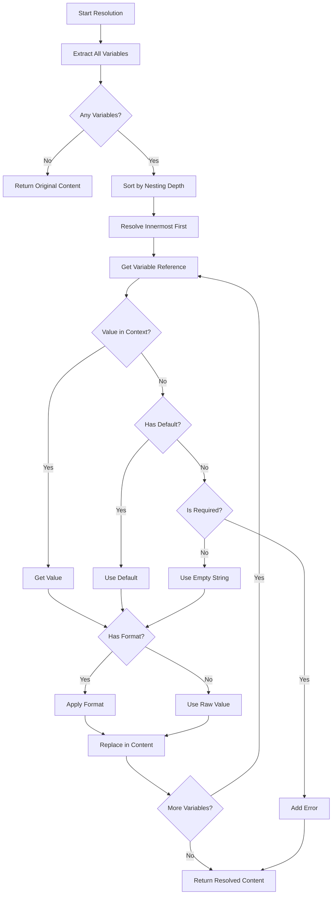

# LCS-DES-081c: Design Specification — Template Variables

## 1. Metadata & Categorization

| Field | Value | Description |
| :--- | :--- | :--- |
| **Feature ID** | `PUB-081c` | Sub-part of PUB-081 |
| **Feature Name** | `Template Variable System` | Variable resolution engine |
| **Target Version** | `v0.8.1c` | Third sub-part of v0.8.1 |
| **Module Scope** | `Lexichord.Modules.Publishing` | Publishing module |
| **Swimlane** | `Publisher` | Part of Publisher vertical |
| **License Tier** | `WriterPro` | Variable editing requires WriterPro |
| **Feature Gate Key** | `FeatureFlags.Publishing.Templates` | License check key |
| **Author** | Lead Architect | |
| **Status** | `Draft` | |
| **Last Updated** | `2026-01-27` | |
| **Parent Document** | [LCS-DES-081-INDEX](./LCS-DES-081-INDEX.md) | |
| **Scope Breakdown** | [LCS-SBD-081 Section 3.3](./LCS-SBD-081.md#33-v081c-template-variables) | |

---

## 2. Executive Summary

### 2.1 The Requirement

Templates contain placeholder variables like {{Author}}, {{Date}}, and {{ProjectName}} that must be replaced with actual values when creating documents. The variable system must:

- Parse variable placeholders from template content
- Provide built-in system variables (current date, user, etc.)
- Collect user-provided values through a form interface
- Validate values against type constraints and patterns
- Support default values and conditional content
- Handle nested variable references

### 2.2 The Proposed Solution

Implement a comprehensive variable resolution system with:

1. **Variable Parser** — Extracts {{variable}} placeholders from content
2. **Variable Context** — Stores user-provided and system values
3. **Built-in Variables** — {{Today}}, {{Now}}, {{CurrentUser}}, etc.
4. **Variable Editor UI** — Form interface for collecting values
5. **Type Validation** — Ensures values match defined types
6. **Resolution Engine** — Replaces placeholders with resolved values

---

## 3. Architecture & Modular Strategy

### 3.1 Dependencies

#### 3.1.1 Internal Dependencies

| Interface | Source Version | Purpose |
| :--- | :--- | :--- |
| `TemplateVariable` | v0.8.1a | Variable definitions |
| `DocumentTemplate` | v0.8.1a | Template with variables |
| `ISettingsService` | v0.1.6a | User defaults |
| `IMediator` | v0.0.7a | Publish events |

#### 3.1.2 NuGet Packages

| Package | Version | Purpose |
| :--- | :--- | :--- |
| `System.Text.RegularExpressions` | Built-in | Variable pattern matching |

### 3.2 Licensing Behavior

- **Parse Variables:** All tiers can parse (for preview)
- **Resolve Variables:** WriterPro+ required
- **Variable Editor:** WriterPro+ required

---

## 4. Data Contract (The API)

### 4.1 Variable Resolver Interface

```csharp
namespace Lexichord.Modules.Publishing.Variables;

/// <summary>
/// Resolves template variables to their actual values.
/// Handles both static user-provided values and dynamic system variables.
/// </summary>
public interface IVariableResolver
{
    /// <summary>
    /// Resolves all variables in the given content synchronously.
    /// Use for short content without async variable sources.
    /// </summary>
    /// <param name="content">Content containing {{variable}} placeholders.</param>
    /// <param name="context">Resolution context with user-provided values.</param>
    /// <returns>Content with all variables resolved.</returns>
    string Resolve(string content, VariableContext context);

    /// <summary>
    /// Resolves all variables in the given content asynchronously.
    /// Supports async variable sources (e.g., database lookups).
    /// </summary>
    /// <param name="content">Content containing {{variable}} placeholders.</param>
    /// <param name="context">Resolution context with user-provided values.</param>
    /// <param name="ct">Cancellation token.</param>
    /// <returns>Content with all variables resolved.</returns>
    Task<string> ResolveAsync(string content, VariableContext context, CancellationToken ct = default);

    /// <summary>
    /// Extracts all variable references from content.
    /// Does not resolve values, only identifies placeholders.
    /// </summary>
    /// <param name="content">Content to scan for variables.</param>
    /// <returns>List of variable references found.</returns>
    IReadOnlyList<VariableReference> ExtractVariables(string content);

    /// <summary>
    /// Validates that all required variables have values in the context.
    /// </summary>
    /// <param name="template">Template with variable definitions.</param>
    /// <param name="context">Context with provided values.</param>
    /// <returns>Validation result with any errors.</returns>
    VariableValidationResult ValidateContext(DocumentTemplate template, VariableContext context);

    /// <summary>
    /// Validates a single value against a variable definition.
    /// </summary>
    /// <param name="variable">Variable definition.</param>
    /// <param name="value">Value to validate.</param>
    /// <returns>Validation result.</returns>
    VariableValidationResult ValidateValue(TemplateVariable variable, object? value);

    /// <summary>
    /// Formats a value according to the variable's format specification.
    /// </summary>
    /// <param name="variable">Variable definition with format.</param>
    /// <param name="value">Value to format.</param>
    /// <returns>Formatted string value.</returns>
    string FormatValue(TemplateVariable variable, object? value);
}
```

### 4.2 Variable Context

```csharp
namespace Lexichord.Modules.Publishing.Variables;

/// <summary>
/// Context for variable resolution containing user-provided and system values.
/// Values can be static or dynamically computed.
/// </summary>
public class VariableContext
{
    private readonly Dictionary<string, object?> _values = new(StringComparer.OrdinalIgnoreCase);
    private readonly Dictionary<string, Func<object?>> _dynamicValues = new(StringComparer.OrdinalIgnoreCase);
    private readonly Dictionary<string, Func<CancellationToken, Task<object?>>> _asyncValues = new(StringComparer.OrdinalIgnoreCase);

    /// <summary>
    /// Gets or sets a variable value by name.
    /// Getting returns static value, then dynamic value, then null.
    /// </summary>
    public object? this[string name]
    {
        get
        {
            if (_values.TryGetValue(name, out var value))
                return value;
            if (_dynamicValues.TryGetValue(name, out var factory))
                return factory();
            return null;
        }
        set => _values[name] = value;
    }

    /// <summary>
    /// Sets a static variable value.
    /// </summary>
    /// <param name="name">Variable name (case-insensitive).</param>
    /// <param name="value">Value to set.</param>
    public void Set(string name, object? value) => _values[name] = value;

    /// <summary>
    /// Sets a dynamic variable that is evaluated on each access.
    /// Use for values that may change (e.g., current time).
    /// </summary>
    /// <param name="name">Variable name.</param>
    /// <param name="factory">Factory function to produce value.</param>
    public void SetDynamic(string name, Func<object?> factory) => _dynamicValues[name] = factory;

    /// <summary>
    /// Sets an async dynamic variable.
    /// Use for values requiring async operations (e.g., database lookup).
    /// </summary>
    /// <param name="name">Variable name.</param>
    /// <param name="factory">Async factory function.</param>
    public void SetAsync(string name, Func<CancellationToken, Task<object?>> factory) => _asyncValues[name] = factory;

    /// <summary>
    /// Gets a value asynchronously, checking async sources.
    /// </summary>
    public async Task<object?> GetAsync(string name, CancellationToken ct = default)
    {
        if (_values.TryGetValue(name, out var value))
            return value;
        if (_dynamicValues.TryGetValue(name, out var factory))
            return factory();
        if (_asyncValues.TryGetValue(name, out var asyncFactory))
            return await asyncFactory(ct);
        return null;
    }

    /// <summary>
    /// Checks if a variable has a value (static, dynamic, or async).
    /// </summary>
    public bool HasValue(string name) =>
        _values.ContainsKey(name) ||
        _dynamicValues.ContainsKey(name) ||
        _asyncValues.ContainsKey(name);

    /// <summary>
    /// Gets all variable names with values.
    /// </summary>
    public IEnumerable<string> GetVariableNames() =>
        _values.Keys
            .Concat(_dynamicValues.Keys)
            .Concat(_asyncValues.Keys)
            .Distinct(StringComparer.OrdinalIgnoreCase);

    /// <summary>
    /// Removes a variable from the context.
    /// </summary>
    public bool Remove(string name)
    {
        var removed = _values.Remove(name);
        removed |= _dynamicValues.Remove(name);
        removed |= _asyncValues.Remove(name);
        return removed;
    }

    /// <summary>
    /// Clears all values from the context.
    /// Does not clear parent context.
    /// </summary>
    public void Clear()
    {
        _values.Clear();
        _dynamicValues.Clear();
        _asyncValues.Clear();
    }

    /// <summary>
    /// Creates a child context that inherits from this context.
    /// Child values override parent values.
    /// </summary>
    public VariableContext CreateChild()
    {
        var child = new VariableContext();
        foreach (var (key, value) in _values)
            child._values[key] = value;
        foreach (var (key, factory) in _dynamicValues)
            child._dynamicValues[key] = factory;
        foreach (var (key, factory) in _asyncValues)
            child._asyncValues[key] = factory;
        return child;
    }

    /// <summary>
    /// Merges another context into this one.
    /// Other context values override existing values.
    /// </summary>
    public void Merge(VariableContext other)
    {
        foreach (var (key, value) in other._values)
            _values[key] = value;
        foreach (var (key, factory) in other._dynamicValues)
            _dynamicValues[key] = factory;
        foreach (var (key, factory) in other._asyncValues)
            _asyncValues[key] = factory;
    }

    /// <summary>
    /// Creates a default context with built-in system variables.
    /// </summary>
    public static VariableContext CreateDefault()
    {
        var context = new VariableContext();

        // Date/Time variables
        context.SetDynamic("Today", () => DateTime.Today.ToString("yyyy-MM-dd"));
        context.SetDynamic("Now", () => DateTime.Now.ToString("yyyy-MM-dd HH:mm:ss"));
        context.SetDynamic("Year", () => DateTime.Today.Year.ToString());
        context.SetDynamic("Month", () => DateTime.Today.ToString("MMMM"));
        context.SetDynamic("MonthNumber", () => DateTime.Today.Month.ToString("00"));
        context.SetDynamic("Day", () => DateTime.Today.Day.ToString());
        context.SetDynamic("DayOfWeek", () => DateTime.Today.DayOfWeek.ToString());
        context.SetDynamic("Time", () => DateTime.Now.ToString("HH:mm"));
        context.SetDynamic("Timestamp", () => DateTimeOffset.UtcNow.ToUnixTimeSeconds().ToString());

        // User variables
        context.SetDynamic("CurrentUser", () => Environment.UserName);
        context.SetDynamic("MachineName", () => Environment.MachineName);
        context.SetDynamic("UserDomain", () => Environment.UserDomainName);

        // Environment variables
        context.SetDynamic("OS", () => Environment.OSVersion.Platform.ToString());
        context.SetDynamic("OSVersion", () => Environment.OSVersion.VersionString);

        // Random/Unique values
        context.SetDynamic("Guid", () => Guid.NewGuid().ToString());
        context.SetDynamic("GuidShort", () => Guid.NewGuid().ToString("N")[..8]);

        return context;
    }

    /// <summary>
    /// Creates a context from a dictionary of values.
    /// </summary>
    public static VariableContext FromDictionary(IDictionary<string, object?> values)
    {
        var context = new VariableContext();
        foreach (var (key, value) in values)
            context.Set(key, value);
        return context;
    }
}
```

### 4.3 Variable Reference and Validation

```csharp
namespace Lexichord.Modules.Publishing.Variables;

/// <summary>
/// A reference to a variable found in content.
/// </summary>
public record VariableReference
{
    /// <summary>Variable name (without braces).</summary>
    public required string Name { get; init; }

    /// <summary>Default value if specified ({{Name:Default}}).</summary>
    public string? DefaultValue { get; init; }

    /// <summary>Format specifier if present ({{Name|format:spec}}).</summary>
    public string? FormatSpecifier { get; init; }

    /// <summary>Start position in the original content.</summary>
    public int StartIndex { get; init; }

    /// <summary>Length of the full placeholder including braces.</summary>
    public int Length { get; init; }

    /// <summary>The full original placeholder text.</summary>
    public required string OriginalText { get; init; }

    /// <summary>Whether this is a conditional variable ({{#if Name}}).</summary>
    public bool IsConditional { get; init; }

    /// <summary>Whether this is a loop variable ({{#each Items}}).</summary>
    public bool IsLoop { get; init; }
}

/// <summary>
/// Result of variable validation.
/// </summary>
public record VariableValidationResult
{
    /// <summary>Whether all validations passed.</summary>
    public bool IsValid => Errors.Count == 0;

    /// <summary>List of validation errors.</summary>
    public IReadOnlyList<VariableValidationError> Errors { get; init; } = [];

    /// <summary>List of validation warnings.</summary>
    public IReadOnlyList<VariableValidationError> Warnings { get; init; } = [];

    /// <summary>Creates a successful validation result.</summary>
    public static VariableValidationResult Success() => new();

    /// <summary>Creates a failed validation result.</summary>
    public static VariableValidationResult Failed(params VariableValidationError[] errors) =>
        new() { Errors = errors };

    /// <summary>Combines multiple validation results.</summary>
    public static VariableValidationResult Combine(params VariableValidationResult[] results)
    {
        var errors = results.SelectMany(r => r.Errors).ToList();
        var warnings = results.SelectMany(r => r.Warnings).ToList();
        return new VariableValidationResult { Errors = errors, Warnings = warnings };
    }
}

/// <summary>
/// A variable validation error.
/// </summary>
public record VariableValidationError
{
    /// <summary>Name of the variable with the error.</summary>
    public required string VariableName { get; init; }

    /// <summary>Human-readable error message.</summary>
    public required string Message { get; init; }

    /// <summary>Type of validation error.</summary>
    public VariableValidationErrorType Type { get; init; }

    /// <summary>The invalid value that was provided.</summary>
    public object? ProvidedValue { get; init; }
}

/// <summary>
/// Types of variable validation errors.
/// </summary>
public enum VariableValidationErrorType
{
    /// <summary>Required variable is missing a value.</summary>
    MissingRequired,

    /// <summary>Value does not match the expected type.</summary>
    InvalidType,

    /// <summary>Value does not match the format specification.</summary>
    InvalidFormat,

    /// <summary>Numeric value is out of range.</summary>
    OutOfRange,

    /// <summary>Value does not match the validation pattern.</summary>
    PatternMismatch,

    /// <summary>Value is not in the allowed options.</summary>
    InvalidOption,

    /// <summary>URL format is invalid.</summary>
    InvalidUrl,

    /// <summary>Email format is invalid.</summary>
    InvalidEmail,

    /// <summary>Date format is invalid.</summary>
    InvalidDate
}
```

### 4.4 Variable Editor ViewModel

```csharp
namespace Lexichord.Modules.Publishing.ViewModels;

/// <summary>
/// ViewModel for the Variable Editor dialog.
/// Collects user values for template variables.
/// </summary>
public partial class VariableEditorViewModel : ObservableObject
{
    private readonly DocumentTemplate _template;
    private readonly IVariableResolver _variableResolver;
    private readonly IMediator _mediator;

    /// <summary>Template being edited.</summary>
    public DocumentTemplate Template => _template;

    /// <summary>Variables grouped for display.</summary>
    [ObservableProperty]
    private ObservableCollection<VariableGroupEditorViewModel> _variableGroups = [];

    /// <summary>Variable context being built.</summary>
    public VariableContext Context { get; } = VariableContext.CreateDefault();

    /// <summary>Whether all required variables have valid values.</summary>
    [ObservableProperty]
    private bool _isValid;

    /// <summary>Validation errors to display.</summary>
    [ObservableProperty]
    private ObservableCollection<string> _validationErrors = [];

    /// <summary>Whether to show the preview pane.</summary>
    [ObservableProperty]
    private bool _showPreview = true;

    /// <summary>Preview content with current values applied.</summary>
    [ObservableProperty]
    private string _previewContent = string.Empty;

    public VariableEditorViewModel(
        DocumentTemplate template,
        IVariableResolver variableResolver,
        IMediator mediator)
    {
        _template = template;
        _variableResolver = variableResolver;
        _mediator = mediator;

        InitializeVariableGroups();
        ValidateAndUpdatePreview();
    }

    private void InitializeVariableGroups()
    {
        var groups = _template.Variables
            .GroupBy(v => v.Group ?? "General")
            .OrderBy(g => g.Key == "General" ? 0 : 1)
            .ThenBy(g => g.Key)
            .Select(g => new VariableGroupEditorViewModel(
                g.Key,
                g.OrderBy(v => v.Order).ToList(),
                this));

        VariableGroups = new ObservableCollection<VariableGroupEditorViewModel>(groups);

        // Set default values
        foreach (var variable in _template.Variables)
        {
            if (!string.IsNullOrEmpty(variable.DefaultValue))
            {
                var resolved = _variableResolver.Resolve(variable.DefaultValue, Context);
                Context.Set(variable.Name, resolved);
            }
        }
    }

    /// <summary>Called when any variable value changes.</summary>
    public void OnVariableValueChanged(string variableName, object? value)
    {
        Context.Set(variableName, value);
        ValidateAndUpdatePreview();
    }

    private void ValidateAndUpdatePreview()
    {
        var result = _variableResolver.ValidateContext(_template, Context);

        ValidationErrors = new ObservableCollection<string>(
            result.Errors.Select(e => $"{e.VariableName}: {e.Message}"));

        IsValid = result.IsValid;

        if (ShowPreview)
        {
            UpdatePreview();
        }
    }

    private void UpdatePreview()
    {
        try
        {
            var sb = new StringBuilder();
            foreach (var section in _template.Sections)
            {
                var heading = _variableResolver.Resolve(section.Heading, Context);
                sb.AppendLine($"{new string('#', section.HeadingLevel)} {heading}");
                sb.AppendLine();

                if (!string.IsNullOrEmpty(section.Content))
                {
                    var content = _variableResolver.Resolve(section.Content, Context);
                    sb.AppendLine(content);
                    sb.AppendLine();
                }
            }

            PreviewContent = sb.ToString();
        }
        catch (Exception ex)
        {
            PreviewContent = $"Preview error: {ex.Message}";
        }
    }

    [RelayCommand]
    private async Task CreateDocumentAsync(CancellationToken ct)
    {
        if (!IsValid) return;

        await _mediator.Publish(new CreateDocumentFromTemplateEvent(
            _template.Id,
            Context), ct);
    }

    [RelayCommand]
    private void Cancel()
    {
        _mediator.Publish(new CancelVariableEditorEvent());
    }

    [RelayCommand]
    private void ResetToDefaults()
    {
        InitializeVariableGroups();
        ValidateAndUpdatePreview();
    }
}

/// <summary>
/// ViewModel for a group of variables in the editor.
/// </summary>
public class VariableGroupEditorViewModel
{
    public string GroupName { get; }
    public ObservableCollection<VariableInputViewModel> Variables { get; }

    public VariableGroupEditorViewModel(
        string groupName,
        IReadOnlyList<TemplateVariable> variables,
        VariableEditorViewModel parent)
    {
        GroupName = groupName;
        Variables = new ObservableCollection<VariableInputViewModel>(
            variables.Select(v => CreateInputViewModel(v, parent)));
    }

    private static VariableInputViewModel CreateInputViewModel(
        TemplateVariable variable,
        VariableEditorViewModel parent)
    {
        return variable.Type switch
        {
            TemplateVariableType.Text => new TextInputViewModel(variable, parent),
            TemplateVariableType.TextArea => new TextAreaInputViewModel(variable, parent),
            TemplateVariableType.Date => new DateInputViewModel(variable, parent),
            TemplateVariableType.DateTime => new DateTimeInputViewModel(variable, parent),
            TemplateVariableType.Number => new NumberInputViewModel(variable, parent),
            TemplateVariableType.Boolean => new BooleanInputViewModel(variable, parent),
            TemplateVariableType.Select => new SelectInputViewModel(variable, parent),
            TemplateVariableType.MultiSelect => new MultiSelectInputViewModel(variable, parent),
            TemplateVariableType.Url => new UrlInputViewModel(variable, parent),
            TemplateVariableType.Email => new EmailInputViewModel(variable, parent),
            _ => new TextInputViewModel(variable, parent)
        };
    }
}

/// <summary>
/// Base ViewModel for variable input controls.
/// </summary>
public abstract partial class VariableInputViewModel : ObservableObject
{
    protected readonly TemplateVariable _variable;
    protected readonly VariableEditorViewModel _parent;

    public string Name => _variable.Name;
    public string Label => _variable.Label ?? _variable.Name;
    public bool IsRequired => _variable.IsRequired;
    public string? Prompt => _variable.Prompt;

    [ObservableProperty]
    private string? _errorMessage;

    [ObservableProperty]
    private bool _hasError;

    protected VariableInputViewModel(TemplateVariable variable, VariableEditorViewModel parent)
    {
        _variable = variable;
        _parent = parent;
    }

    protected void NotifyValueChanged(object? value)
    {
        _parent.OnVariableValueChanged(_variable.Name, value);
    }
}

/// <summary>
/// ViewModel for text input variables.
/// </summary>
public partial class TextInputViewModel : VariableInputViewModel
{
    [ObservableProperty]
    private string _value = string.Empty;

    public TextInputViewModel(TemplateVariable variable, VariableEditorViewModel parent)
        : base(variable, parent)
    {
        if (parent.Context[variable.Name] is string val)
            _value = val;
    }

    partial void OnValueChanged(string value) => NotifyValueChanged(value);
}

/// <summary>
/// ViewModel for date input variables.
/// </summary>
public partial class DateInputViewModel : VariableInputViewModel
{
    [ObservableProperty]
    private DateTimeOffset? _value;

    public string? Format => _variable.Format;

    public DateInputViewModel(TemplateVariable variable, VariableEditorViewModel parent)
        : base(variable, parent)
    {
        if (parent.Context[variable.Name] is string dateStr &&
            DateTimeOffset.TryParse(dateStr, out var date))
        {
            _value = date;
        }
        else
        {
            _value = DateTimeOffset.Now;
        }
    }

    partial void OnValueChanged(DateTimeOffset? value)
    {
        var formatted = value?.ToString(_variable.Format ?? "yyyy-MM-dd");
        NotifyValueChanged(formatted);
    }
}

/// <summary>
/// ViewModel for select input variables.
/// </summary>
public partial class SelectInputViewModel : VariableInputViewModel
{
    public IReadOnlyList<string> Options => _variable.AllowedValues ?? [];

    [ObservableProperty]
    private string? _selectedValue;

    public SelectInputViewModel(TemplateVariable variable, VariableEditorViewModel parent)
        : base(variable, parent)
    {
        if (parent.Context[variable.Name] is string val)
            _selectedValue = val;
        else if (!string.IsNullOrEmpty(variable.DefaultValue))
            _selectedValue = variable.DefaultValue;
    }

    partial void OnSelectedValueChanged(string? value) => NotifyValueChanged(value);
}

/// <summary>
/// ViewModel for multi-select input variables.
/// </summary>
public partial class MultiSelectInputViewModel : VariableInputViewModel
{
    public ObservableCollection<SelectableOption> Options { get; }

    public MultiSelectInputViewModel(TemplateVariable variable, VariableEditorViewModel parent)
        : base(variable, parent)
    {
        var currentValues = parent.Context[variable.Name] as IEnumerable<string>
            ?? variable.DefaultValue?.Split(',').Select(s => s.Trim())
            ?? Enumerable.Empty<string>();

        var currentSet = currentValues.ToHashSet(StringComparer.OrdinalIgnoreCase);

        Options = new ObservableCollection<SelectableOption>(
            (variable.AllowedValues ?? []).Select(opt => new SelectableOption(
                opt,
                currentSet.Contains(opt),
                isSelected => OnOptionChanged())));
    }

    private void OnOptionChanged()
    {
        var selected = Options.Where(o => o.IsSelected).Select(o => o.Value).ToList();
        NotifyValueChanged(selected);
    }
}

public partial class SelectableOption : ObservableObject
{
    public string Value { get; }

    [ObservableProperty]
    private bool _isSelected;

    private readonly Action<bool> _onChanged;

    public SelectableOption(string value, bool isSelected, Action<bool> onChanged)
    {
        Value = value;
        _isSelected = isSelected;
        _onChanged = onChanged;
    }

    partial void OnIsSelectedChanged(bool value) => _onChanged(value);
}
```

---

## 5. Implementation Logic

### 5.1 Variable Syntax

```text
VARIABLE SYNTAX PATTERNS:

1. BASIC VARIABLE:
   {{VariableName}}
   - Replaced with value from context
   - If missing: empty string or error (based on required flag)

2. WITH DEFAULT VALUE:
   {{VariableName:Default Text}}
   - Uses default if variable has no value
   - Default can contain spaces

3. WITH FORMAT SPECIFIER:
   {{VariableName|format:yyyy-MM-dd}}
   - Applies format to the value
   - Common for dates and numbers

4. COMBINED:
   {{Date:2026-01-01|format:MMMM d, yyyy}}
   - Both default and format

5. CONDITIONAL (future):
   {{#if VariableName}}
     Content shown if VariableName is truthy
   {{/if}}

6. LOOP (future):
   {{#each Items}}
     {{.}} - current item
     {{@index}} - current index
   {{/each}}

7. NESTED VARIABLES:
   {{Greeting:Hello, {{Author}}!}}
   - Inner variables resolved first
   - Then outer variable

REGEX PATTERNS:
- Basic: \{\{([A-Za-z_][A-Za-z0-9_]*)\}\}
- With default: \{\{([A-Za-z_][A-Za-z0-9_]*)(?::([^}|]+))?\}\}
- With format: \{\{([A-Za-z_][A-Za-z0-9_]*)(?::([^}|]+))?(?:\|format:([^}]+))?\}\}
```

### 5.2 Resolution Algorithm



### 5.3 Built-in Variables Table

| Variable | Description | Example Value |
| :--- | :--- | :--- |
| `{{Today}}` | Current date (yyyy-MM-dd) | `2026-01-27` |
| `{{Now}}` | Current date/time | `2026-01-27 14:30:00` |
| `{{Year}}` | Current year | `2026` |
| `{{Month}}` | Current month name | `January` |
| `{{MonthNumber}}` | Current month number | `01` |
| `{{Day}}` | Current day of month | `27` |
| `{{DayOfWeek}}` | Day of week name | `Monday` |
| `{{Time}}` | Current time (HH:mm) | `14:30` |
| `{{Timestamp}}` | Unix timestamp | `1769529000` |
| `{{CurrentUser}}` | System username | `jsmith` |
| `{{MachineName}}` | Computer name | `DESKTOP-ABC` |
| `{{UserDomain}}` | User domain | `WORKGROUP` |
| `{{OS}}` | Operating system | `Win32NT` |
| `{{Guid}}` | New GUID | `550e8400-...` |
| `{{GuidShort}}` | Short GUID (8 chars) | `550e8400` |

---

## 6. UI/UX Specifications

### 6.1 Variable Editor Layout

```text
+------------------------------------------------------------------+
|  Configure Document Variables                         [x] Close   |
+------------------------------------------------------------------+
| Fill in the values for your new document from "Blog Post"         |
|                                                                   |
| +----------------------+  +-------------------------------------+ |
| | Variables            |  | Preview                             | |
| |----------------------|  |-------------------------------------| |
| | Basic Info           |  | # My First Blog Post                | |
| |                      |  |                                     | |
| | Title *              |  | *By Jane Smith | January 27, 2026*  | |
| | +------------------+ |  |                                     | |
| | |My First Blog    | |  | **Category:** Technology            | |
| | |Post             | |  |                                     | |
| | +------------------+ |  | ## Introduction                     | |
| |                      |  |                                     | |
| | Author *             |  | Write a compelling introduction...  | |
| | +------------------+ |  |                                     | |
| | |Jane Smith       | |  | ## Main Content                     | |
| | +------------------+ |  |                                     | |
| |                      |  | ### Key Point 1                     | |
| | Publication Date *   |  |                                     | |
| | +------------------+ |  | Develop your first main point...    | |
| | |January 27, 2026 | |  |                                     | |
| | +------------------+ |  |                                     | |
| |                      |  |                                     | |
| | Categorization       |  |                                     | |
| |                      |  |                                     | |
| | Category             |  |                                     | |
| | +------------------+ |  |                                     | |
| | |Technology     v | |  |                                     | |
| | +------------------+ |  |                                     | |
| |                      |  |                                     | |
| | Tags                 |  |                                     | |
| | [x] AI               |  |                                     | |
| | [ ] Writing          |  |                                     | |
| | [x] Productivity     |  |                                     | |
| | [ ] Tips             |  |                                     | |
| |                      |  |                                     | |
| +----------------------+  +-------------------------------------+ |
|                                                                   |
| * Required fields                                                 |
|                                                                   |
| Validation: All required fields are filled                [Valid] |
|                                                                   |
|                [Reset to Defaults]  [Cancel]  [Create Document]   |
+------------------------------------------------------------------+
```

### 6.2 Input Control Types

| Variable Type | Control | Features |
| :--- | :--- | :--- |
| Text | TextBox | Single line, validation pattern |
| TextArea | TextBox (multiline) | Multiple lines, resize |
| Date | DatePicker | Calendar popup, format |
| DateTime | DateTimePicker | Date + time selection |
| Number | NumericUpDown | Min/max, increment |
| Boolean | CheckBox | Checked = true |
| Select | ComboBox | Dropdown list |
| MultiSelect | ListBox | Multiple checkboxes |
| Url | TextBox | URL validation |
| Email | TextBox | Email validation |

---

## 7. Observability & Logging

| Level | Source | Message Template |
| :--- | :--- | :--- |
| Debug | VariableResolver | `Extracting variables from content ({ContentLength} chars)` |
| Debug | VariableResolver | `Found {Count} variables: {VariableNames}` |
| Debug | VariableResolver | `Resolving variable {Name} with value {Value}` |
| Info | VariableResolver | `Resolved {Count} variables in {ElapsedMs}ms` |
| Warning | VariableResolver | `Variable {Name} has no value (using default: {Default})` |
| Error | VariableResolver | `Required variable {Name} is missing` |
| Debug | VariableEditor | `Variable {Name} changed to {Value}` |
| Info | VariableEditor | `Validation result: {IsValid}, {ErrorCount} errors` |

---

## 8. Security & Safety

| Risk | Level | Mitigation |
| :--- | :--- | :--- |
| Regex DoS (ReDoS) | Medium | Use compiled regex, set timeout |
| Script injection in values | Low | Sanitize when rendering to HTML |
| Infinite recursion in nested vars | Medium | Limit nesting depth to 10 |
| PII in built-in variables | Low | Document what variables expose |

---

## 9. Acceptance Criteria

### 9.1 Variable Parsing

| # | Given | When | Then |
| :--- | :--- | :--- | :--- |
| 1 | Content with `{{Name}}` | Extract variables | Returns VariableReference with Name="Name" |
| 2 | Content with `{{Name:Default}}` | Extract variables | Returns reference with DefaultValue="Default" |
| 3 | Content with no variables | Extract variables | Returns empty list |
| 4 | Content with `{{#if}}` | Extract variables | Returns conditional reference |

### 9.2 Variable Resolution

| # | Given | When | Then |
| :--- | :--- | :--- | :--- |
| 5 | Context with Name="World" | Resolve "Hello, {{Name}}!" | Returns "Hello, World!" |
| 6 | Empty context | Resolve "{{Name:Guest}}" | Returns "Guest" |
| 7 | Context with Date=today | Resolve "{{Date\|format:MMMM d}}" | Returns formatted date |
| 8 | Nested variables | Resolve | Resolves inner first |

### 9.3 Variable Validation

| # | Given | When | Then |
| :--- | :--- | :--- | :--- |
| 9 | Required variable, no value | Validate | Returns MissingRequired error |
| 10 | Number variable, value="abc" | Validate | Returns InvalidType error |
| 11 | Url variable, value="not-a-url" | Validate | Returns InvalidUrl error |
| 12 | All values valid | Validate | Returns IsValid=true |

### 9.4 Variable Editor

| # | Given | When | Then |
| :--- | :--- | :--- | :--- |
| 13 | Editor opened | View | All variables displayed in groups |
| 14 | Required field empty | View | Field marked as error |
| 15 | Value changed | Edit | Preview updates |
| 16 | All valid | Click Create | Document created |

---

## 10. Deliverable Checklist

| # | Deliverable | Status |
| :--- | :--- | :--- |
| 1 | `IVariableResolver.cs` interface | [ ] |
| 2 | `VariableResolver.cs` implementation | [ ] |
| 3 | `VariableContext.cs` class | [ ] |
| 4 | `VariableReference.cs` record | [ ] |
| 5 | `VariableValidationResult.cs` records | [ ] |
| 6 | `VariableEditorView.axaml` | [ ] |
| 7 | `VariableEditorViewModel.cs` | [ ] |
| 8 | `VariableInputViewModel.cs` base + types | [ ] |
| 9 | Built-in variable registration | [ ] |
| 10 | Unit tests for parsing | [ ] |
| 11 | Unit tests for resolution | [ ] |
| 12 | Unit tests for validation | [ ] |
| 13 | UI tests for editor | [ ] |

---

## 11. Verification Commands

```bash
# Run variable system tests
dotnet test --filter "Version=v0.8.1c&Category=Unit"

# Test specific scenarios
dotnet test --filter "FullyQualifiedName~VariableResolverTests"
dotnet test --filter "FullyQualifiedName~VariableContextTests"
dotnet test --filter "FullyQualifiedName~VariableValidationTests"

# Manual verification:
# 1. Open template with variables
# 2. Click "Use Template"
# 3. Verify all variables appear in editor
# 4. Fill in values and verify preview updates
# 5. Leave required field empty - verify error
# 6. Fill all required - verify Create enabled
```

---

## Document History

| Version | Date | Author | Changes |
| :--- | :--- | :--- | :--- |
| 1.0 | 2026-01-27 | Lead Architect | Initial draft |
